# <a name="run-the-surveys-application"></a>Eseguire l'applicazione Surveys

In questo articolo viene descritto come eseguire in locale l'applicazione [Tailspin Surveys](./tailspin.md) da Visual Studio. In questi passaggi l'applicazione non verrà distribuita ad Azure, tuttavia sarà necessario creare alcune risorse di Azure &mdash; una directory Azure Active Directory (Azure AD) e una cache Redis.

Di seguito viene presentato un riepilogo dei passaggi:

1. Creare una directory Azure AD (tenant) per la società fittizia Tailspin.
2. Registrare l'applicazione Surveys e l'API Web back-end in Azure AD.
3. Creare un'istanza di Cache Redis di Azure.
4. Configurare le impostazioni dell'applicazione e creare un database locale.
5. Eseguire l'applicazione e registrare un nuovo tenant.
6. Aggiungere i ruoli applicazione agli utenti.

## <a name="prerequisites"></a>Prerequisiti
-   [Visual Studio 2017][VS2017]
-   Account di [Microsoft Azure](https://azure.microsoft.com)

## <a name="create-the-tailspin-tenant"></a>Creare il tenant Tailspin

Tailspin è la società fittizia che ospita l'applicazione Surveys e usa Azure AD per abilitare la registrazione di altri tenant con l'app. Tali clienti quindi possono usare le proprie credenziali di Azure AD per accedere all'app.

In questo passaggio si creerà una directory di Azure AD per Tailspin.

1. Accedere al [portale di Azure][portal].

2. Fare clic su **+ Crea una risorsa** > **Identità** > **Azure Active Directory**.

3. Immettere `Tailspin` per il nome dell'organizzazione e un nome di dominio. Il nome di dominio avrà la forma di `xxxx.onmicrosoft.com` e deve essere globalmente univoco. 

    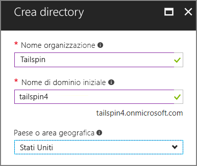

4. Fare clic su **Create**(Crea). La creazione della nuova directory può richiedere alcuni minuti.

Per completare lo scenario end-to-end, sarà necessario usare una seconda directory Azure AD per rappresentare un cliente che procede alla registrazione per l'applicazione. È possibile usare la directory di Azure AD predefinita (non Tailspin) o creare una nuova directory per questo scopo. Negli esempi, viene usato Contoso come cliente fittizio.

## <a name="register-the-surveys-web-api"></a>Registrare l'API Web Surveys 

1. Nel [portale di Azure][portal] passare alla nuova directory Tailspin selezionando l'account nell'angolo superiore destro.

2. Scegliere **Azure Active Directory** nel riquadro di navigazione a sinistra. 

3. Fare clic su **Registrazioni per l'app** > **Registrazione nuova applicazione**.

4. Nel pannello **Crea** immettere le informazioni seguenti:

   - **Nome**: `Surveys.WebAPI`

   - **Tipo di applicazione**: `Web app / API`

   - **URL di accesso**: `https://localhost:44301/`
   
    

5. Fare clic su **Create**(Crea).

6. Nel pannello **Registrazioni per l'app** selezionare la nuova applicazione **Surveys.WebAPI**.
 
7. Fare clic su **Impostazioni** > **Proprietà**.

8. Nella casella di modifica **URI ID app** immettere `https://<domain>/surveys.webapi`, dove `<domain>` è il nome di dominio della directory. Ad esempio: `https://tailspin.onmicrosoft.com/surveys.webapi`

    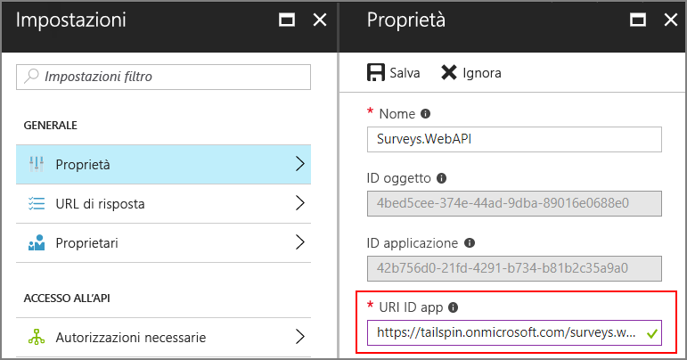

9. Impostare **Multi-tenant** su **SÌ**.

10. Fare clic su **Save**.

## <a name="register-the-surveys-web-app"></a>Registrare l'app Web Surveys 

1. Tornare al pannello **Registrazioni per l'app** e fare clic su **Registrazione nuova applicazione**.

2. Nel pannello **Crea** immettere le informazioni seguenti:

   - **Nome**: `Surveys`
   - **Tipo di applicazione**: `Web app / API`
   - **URL di accesso**: `https://localhost:44300/`
   
   Si noti che l'URL di accesso ha un numero di porta diverso dall'app `Surveys.WebAPI` nel passaggio precedente.

3. Fare clic su **Create**(Crea).
 
4. Nel pannello **Registrazioni per l'app** selezionare la nuova applicazione **Surveys**.
 
5. Copiare l'ID applicazione che sarà necessario più avanti.

    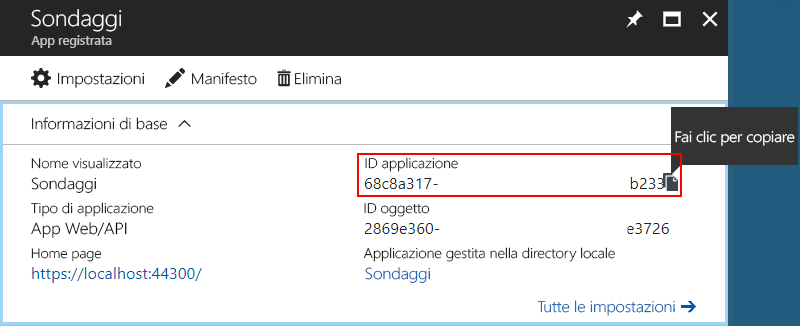

6. Fare clic su **Proprietà**.

7. Nella casella di modifica **URI ID app** immettere `https://<domain>/surveys`, dove `<domain>` è il nome di dominio della directory. 

    

8. Impostare **Multi-tenant** su **SÌ**.

9. Fare clic su **Save**.

10. Nel pannello **Impostazioni** fare clic su **URL di risposta**.
 
11. Aggiungere l'URL di risposta seguente : `https://localhost:44300/signin-oidc`.

12. Fare clic su **Save**.

13. In **ACCESSO ALL'API** fare clic su **Chiavi**.

14. Immettere una descrizione, ad esempio `client secret`.

15. Nell'elenco a discesa **Seleziona durata** selezionare **1 anno**. 

16. Fare clic su **Save**. La chiave verrà generata al salvataggio.

17. Prima si uscire da questo pannello, copiare il valore della chiave:

    > [!NOTE] 
    > dopo che si esce dal pannello, la chiave non verrà visualizzata nuovamente. 

18. In **ACCESSO ALL'API** fare clic su **Autorizzazioni necessarie**.

19. Fare clic su **Aggiungi** > **Selezionare un'API**.

20. Cercare `Surveys.WebAPI` cella casella di ricerca.

    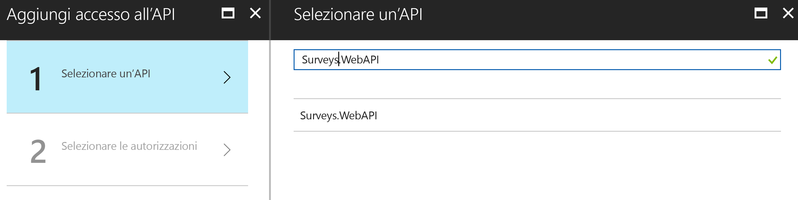

21. Selezionare `Surveys.WebAPI` e fare clic su **Seleziona**.

22. In **Autorizzazioni delegate** selezionare la casella di controllo **Access Surveys.WebAPI** (Accedi a Surveys.WebAPI).

    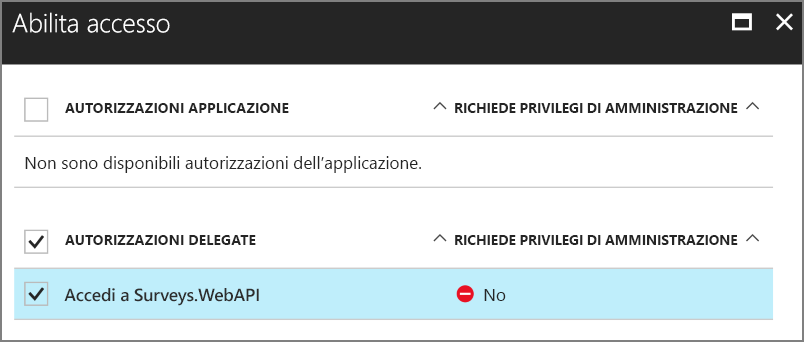

23. Fare clic su **Seleziona** > **Fine**.


## <a name="update-the-application-manifests"></a>Aggiornare i manifesti dell'applicazione

1. Tornare al pannello **Impostazioni** per l'app `Surveys.WebAPI`.

2. Fare clic su **Manifesto** > **Modifica**.

    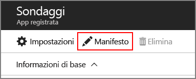
 
3. Aggiungere il JSON seguente all'elemento `appRoles`. Generare nuovi GUID per le proprietà `id`.

   ```json
   {
     "allowedMemberTypes": ["User"],
     "description": "Creators can create surveys",
     "displayName": "SurveyCreator",
     "id": "<Generate a new GUID. Example: 1b4f816e-5eaf-48b9-8613-7923830595ad>",
     "isEnabled": true,
     "value": "SurveyCreator"
   },
   {
     "allowedMemberTypes": ["User"],
     "description": "Administrators can manage the surveys in their tenant",
     "displayName": "SurveyAdmin",
     "id": "<Generate a new GUID>",  
     "isEnabled": true,
     "value": "SurveyAdmin"
   }
   ```

4. Nella proprietà `knownClientApplications` aggiungere l'ID applicazione per l'app Web Surveys, che è stato ottenuto in precedenza durante la registrazione dell'applicazione Surveys. Ad esempio: 

   ```json
   "knownClientApplications": ["be2cea23-aa0e-4e98-8b21-2963d494912e"],
   ```

   Questa impostazione aggiunge l'app Surveys all'elenco dei client autorizzati a chiamare l'API Web.

5. Fare clic su **Save**.

Ora ripetere gli stessi passaggi per l'app Surveys, ad eccezione di non aggiungere una voce per `knownClientApplications`. Usare le stesse definizioni dei ruoli, ma generare nuovi GUID per gli ID.

## <a name="create-a-new-redis-cache-instance"></a>Creare una nuova istanza di cache Redis

L'applicazione Surveys usa Redis per memorizzare nella cache i token di accesso OAuth 2. Per creare la cache:

1.  Passare al [portale di Azure](https://portal.azure.com) e fare clic su **+ Crea una risorsa** > **Database** > **Cache Redis**.

2.  Inserire le informazioni necessarie, tra cui nome DNS, gruppo di risorse, posizione e piano tariffario. È possibile creare un nuovo gruppo di risorse o usarne uno esistente.

3. Fare clic su **Create**(Crea).

4. Dopo aver creato la cache Redis, passare alla risorsa nel portale.

5. Fare clic su **Chiavi di accesso** e copiare la chiave primaria.

Per altre informazioni sulla creazione di un'istanza di cache Redis, vedere [Come usare Cache Redis di Azure](/azure/redis-cache/cache-dotnet-how-to-use-azure-redis-cache).

## <a name="set-application-secrets"></a>Impostare i segreti dell'applicazione

1.  Aprire la soluzione Tailspin.Surveys in Visual Studio.

2.  In Esplora soluzioni fare clic con il pulsante destro del mouse sul progetto Tailspin.Surveys.Web e scegliere **Gestisci segreti utente**.

3.  Nel file secrets.json, incollare il codice seguente:
    
    ```json
    {
      "AzureAd": {
        "ClientId": "<Surveys application ID>",
        "ClientSecret": "<Surveys app client secret>",
        "PostLogoutRedirectUri": "https://localhost:44300/",
        "WebApiResourceId": "<Surveys.WebAPI app ID URI>"
      },
      "Redis": {
        "Configuration": "<Redis DNS name>.redis.cache.windows.net,password=<Redis primary key>,ssl=true"
      }
    }
    ```
   
    Sostituire gli elementi visualizzati tra parentesi acute, come illustrato di seguito:

    - `AzureAd:ClientId`: ID applicazione dell'app Surveys.
    - `AzureAd:ClientSecret`: chiave generata durante la registrazione dell'applicazione Surveys in Azure AD.
    - `AzureAd:WebApiResourceId`: URI ID app specificato durante la creazione dell'applicazione Surveys.WebAPI in Azure AD. Dovrebbe avere questa forma: `https://<directory>.onmicrosoft.com/surveys.webapi`
    - `Redis:Configuration`: compilare questa stringa dal nome DNS della cache Redis e dalla chiave di accesso primaria. Ad esempio, "tailspin.redis.cache.windows.net,password=2h5tBxxx,ssl=true".

4.  Salvare il file secrets.json aggiornato.

5.  Ripetere questi passaggi per il progetto Tailspin.Surveys.WebAPI ma incollare il codice seguente in secrets.json. Sostituire gli elementi tra parentesi acute, come in precedenza.

    ```json
    {
      "AzureAd": {
        "WebApiResourceId": "<Surveys.WebAPI app ID URI>"
      },
      "Redis": {
        "Configuration": "<Redis DNS name>.redis.cache.windows.net,password=<Redis primary key>,ssl=true"
      }
    }
    ```

## <a name="initialize-the-database"></a>Inizializzare il database

In questo passaggio viene usato Entity Framework 7 per creare un database SQL locale con Local DB.

1.  Aprire una finestra di comando

2.  Passare al progetto Tailspin.Surveys.Data.

3.  Eseguire il comando seguente:

    ```
    dotnet ef database update --startup-project ..\Tailspin.Surveys.Web
    ```
    
## <a name="run-the-application"></a>Eseguire l'applicazione

Per eseguire l'applicazione, avviare entrambi i progetti Tailspin.Surveys.Web e Tailspin.Surveys.WebAPI.

È possibile impostare Visual Studio per eseguire automaticamente entrambi i progetti su F5, come segue:

1.  In Esplora soluzioni fare clic con il pulsante destro del mouse sulla soluzione e fare clic su **Imposta progetti di avvio**.
2.  Selezionare **Progetti di avvio multipli**.
3.  Impostare **Azione** = **Avvia** per i progetti Tailspin.Surveys.Web e Tailspin.Surveys.WebAPI.

## <a name="sign-up-a-new-tenant"></a>Registrare un nuovo tenant

All'avvio dell'applicazione, non viene eseguito alcun accesso e viene quindi visualizzata la home page:

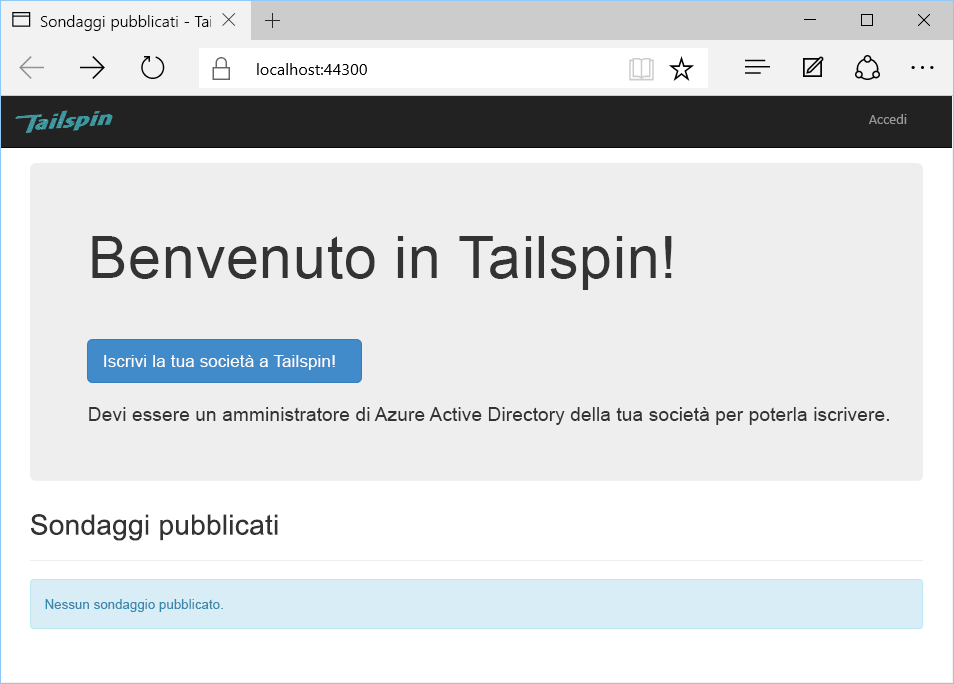

Per registrare un'organizzazione:

1. Fare clic su **Enroll your company in Tailspin** (Registra la società su Tailspin).
2. Accedere alla directory di Azure AD che rappresenta l'organizzazione con l'app Surveys. È necessario accedere come utente amministratore.
3. Accettare la richiesta di consenso.

L'applicazione registra il tenant e l'utente viene quindi disconnesso. Questo avviene poiché, prima di usare l'applicazione, è necessario configurare i ruoli applicazione in Azure AD.

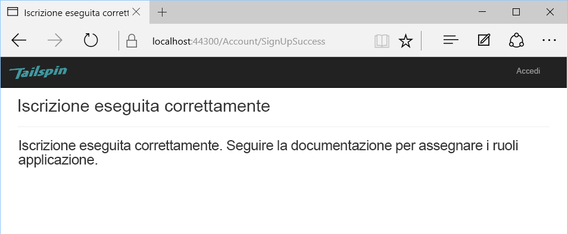

## <a name="assign-application-roles"></a>Assegnare i ruoli applicazione

Quando un tenant esegue la registrazione, è necessario che un amministratore di Azure AD per il tenant assegni i ruoli applicazione agli utenti.


1. Nel [portale di Azure][portal] passare alla directory di Azure AD usata per eseguire la registrazione per l'app Surveys. 

2. Scegliere **Azure Active Directory** nel riquadro di navigazione a sinistra. 

3. Fare clic su **Applicazioni aziendali** > **Tutte le applicazioni**. Il portale elencherà `Survey` e `Survey.WebAPI`. In caso contrario, assicurarsi di aver completato il processo di registrazione.

4.  Fare clic sull'applicazione Surveys.

5.  Fare clic su **Utenti e gruppi**.

4.  Fare clic su **Add User**.

5.  Se si dispone di Azure AD Premium, fare clic su **Utenti e gruppi**. In caso contrario, fare clic su **Utenti** (l'assegnazione di un ruolo a un gruppo richiede Azure AD Premium).

6. Selezionare uno o più utenti e fare clic su **Seleziona**.

    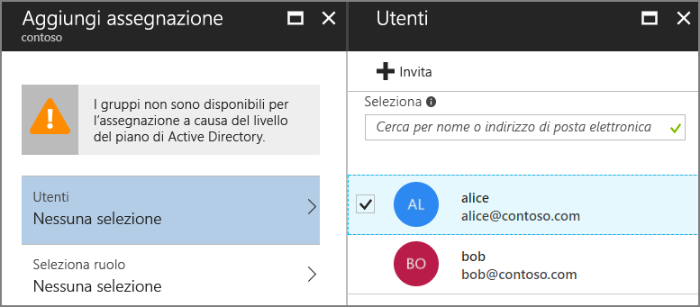

6.  Selezionare un ruolo e fare clic su **Seleziona**.

    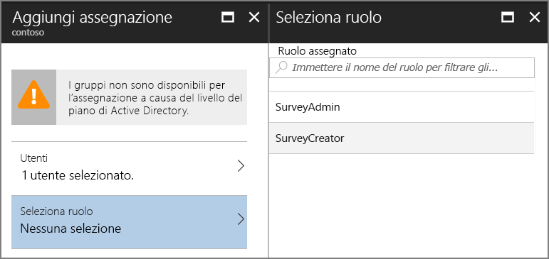

7.  Fare clic su **Assegna**.

Ripetere gli stessi passaggi per assegnare i ruoli per l'applicazione Survey.WebAPI.

> Importante: un utente deve avere sempre gli stessi ruoli sia in Survey che in Survey.WebAPI. In caso contrario, l'utente disporrà di autorizzazioni non coerenti e ciò può causare errori 403 (Accesso negato) dall'API Web.

Tornare ora all'app e accedere nuovamente. Fare clic su **My Surveys** (I miei sondaggi). Se l'utente è assegnato al ruolo SurveyAdmin o SurveyCreator, verrà visualizzato un pulsante **Create Survey** (Crea sondaggio), che indica che l'utente dispone delle autorizzazioni per creare un nuovo sondaggio.

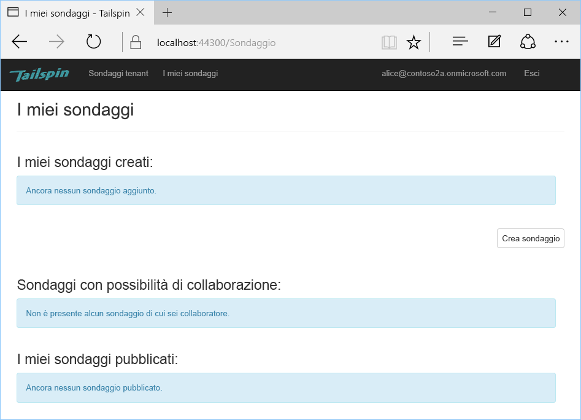


<!-- links -->

[portal]: https://portal.azure.com
[VS2017]: https://www.visualstudio.com/vs/
