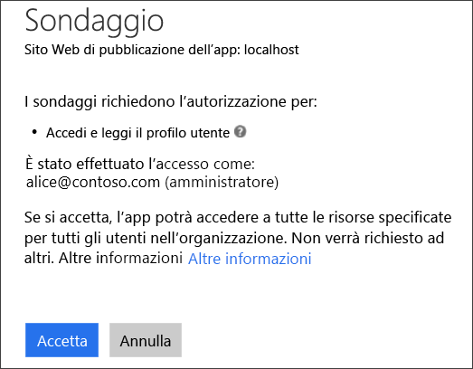
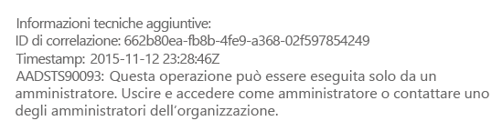
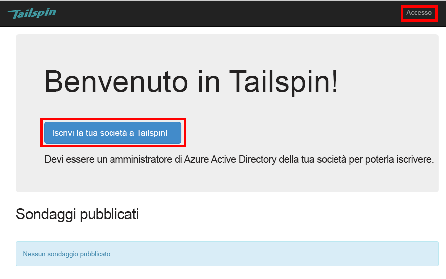
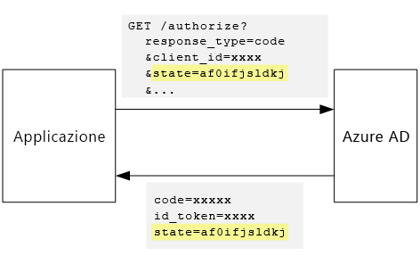

# <a name="tenant-sign-up-and-onboarding"></a>Iscrizione e onboarding del tenant

[ Codice di esempio][sample application]

Questo articolo descrive come implementare un *processo* di iscrizione in un'applicazione multi-tenant, che consente a un cliente di iscrivere la propria organizzazione all'applicazione.
È possibile implementare un processo di iscrizione per diversi motivi:

* Consentire a un amministratore di AD di concedere all'intera organizzazione di un cliente di usare l'applicazione.
* Raccogliere informazioni sul cliente, ad esempio relative al pagamento con carta di credito.
* Eseguire installazioni occasionali per ogni tenant richieste dall'applicazione.

## <a name="admin-consent-and-azure-ad-permissions"></a>Consenso dell'amministratore e autorizzazioni di Azure AD

Per l'autenticazione con Azure AD, un'applicazione deve accedere alla directory dell'utente. Come requisito minimo, l'applicazione necessita dell'autorizzazione per leggere il profilo dell'utente. Al primo accesso dell'utente, Azure AD illustra una pagina di consenso che elenca le autorizzazioni richieste. Facendo clic su **Accetta**, l'utente concede l'autorizzazione all'applicazione.

Per impostazione predefinita, viene fornito il consenso per ogni utente. Ogni utente che accede vede la pagina di consenso. Tuttavia, Azure AD supporta anche il *consenso dell'amministratore*, che consente a un amministratore di AD di fornire il consenso per un'intera organizzazione.

Quando viene usato il flusso di consenso dell'amministratore, la pagina di consenso indica che l'amministratore di AD concede l'autorizzazione per conto dell'intero tenant:



Dopo che l'amministratore seleziona **Accetta**, altri utenti all'interno dello stesso tenant possono accedere e Azure AD ignorerà la schermata di consenso.

Solo un amministratore di AD può autorizzare questo tipo di consenso, in quanto concede l'autorizzazione per conto dell'intera organizzazione. Se un utente non amministratore tenta di eseguire l'autenticazione con il flusso di consenso dell'amministratore, Azure AD visualizza un errore:



Se l'applicazione richiede autorizzazioni aggiuntive in un secondo momento, il cliente dovrà accedere nuovamente e acconsentire alle autorizzazioni aggiornate.

## <a name="implementing-tenant-sign-up"></a>Implementazione dell'iscrizione del tenant

Sono stati definiti diversi requisiti del processo di iscrizione per l'applicazione [Tailspin Surveys][Tailspin]:

* Affinché gli utenti possano accedere, il tenant deve eseguire l'accesso.
* L'iscrizione usa il flusso di consenso dell'amministratore.
* L'iscrizione aggiunge il tenant dell'utente al database dell'applicazione.
* Dopo che un tenant esegue l'iscrizione, l'applicazione visualizza una pagina per l'onboarding.

In questa sezione viene illustrata l'implementazione del processo di iscrizione.
È importante comprendere che "iscrizione" e "accesso" sono concetti riferiti all'applicazione. Durante il flusso di autenticazione, Azure AD non è in grado di capire se per l'utente è in corso la procedura di iscrizione. Spetta infatti all'applicazione tenere traccia del contesto.

Quando un utente anonimo visita l'applicazione Surveys, visualizza due pulsanti: uno per accedere e uno per la registrazione della società (iscrizione).



Questi pulsanti richiamano le azioni nella classe `AccountController`.

L'azione `SignIn` restituisce **ChallegeResult**, in modo che il middleware di OpenID Connect esegua il reindirizzamento all'endpoint di autenticazione. Questa è la modalità predefinita per attivare l'autenticazione in ASP.NET Core.

```csharp
[AllowAnonymous]
public IActionResult SignIn()
{
    return new ChallengeResult(
        OpenIdConnectDefaults.AuthenticationScheme,
        new AuthenticationProperties
        {
            IsPersistent = true,
            RedirectUri = Url.Action("SignInCallback", "Account")
        });
}
```

Confrontarla a questo punto con l'azione `SignUp` :

```csharp
[AllowAnonymous]
public IActionResult SignUp()
{
    var state = new Dictionary<string, string> { { "signup", "true" }};
    return new ChallengeResult(
        OpenIdConnectDefaults.AuthenticationScheme,
        new AuthenticationProperties(state)
        {
            RedirectUri = Url.Action(nameof(SignUpCallback), "Account")
        });
}
```

Come `SignIn`, l'azione `SignUp` restituisce anche un `ChallengeResult`. Ma questa volta, viene aggiunta una parte di informazioni sullo stato di `AuthenticationProperties` nel `ChallengeResult`:

* signup: flag booleano che indica che l'utente ha avviato il processo di iscrizione.

Le informazioni sullo stato in `AuthenticationProperties` vengono aggiunte al parametro [state] di OpenID Connect che esegue un ciclo durante il flusso di autenticazione.



Dopo che l'utente viene autenticato in Azure AD e viene reindirizzato all'applicazione, il ticket di autenticazione contiene informazioni sullo stato. Questo aspetto viene usato per assicurarsi che il valore "signup" venga mantenuto per l'intero flusso di autenticazione.

## <a name="adding-the-admin-consent-prompt"></a>Aggiunta della richiesta di consenso dell'amministratore

In Azure AD, il flusso di consenso dell'amministratore viene attivato mediante l'aggiunta di un parametro "prompt" alla stringa di query nella richiesta di autenticazione:

<!-- markdownlint-disable MD040 -->

```
/authorize?prompt=admin_consent&...
```

<!-- markdownlint-enable MD040 -->

L'applicazione Surveys aggiunge tale parametro durante l'evento `RedirectToAuthenticationEndpoint` . Questo evento viene chiamato subito prima che il middleware esegua il reindirizzamento all'endpoint di autenticazione.

```csharp
public override Task RedirectToAuthenticationEndpoint(RedirectContext context)
{
    if (context.IsSigningUp())
    {
        context.ProtocolMessage.Prompt = "admin_consent";
    }

    _logger.RedirectToIdentityProvider();
    return Task.FromResult(0);
}
```

L'impostazione `ProtocolMessage.Prompt` indica al middleware di aggiungere il parametro "prompt" alla richiesta di autenticazione.

Si noti che la richiesta è necessaria solo durante l'iscrizione, in un accesso normale non è inclusa. Per comprendere la differenza, viene verificato il valore di `signup` nello stato di autenticazione. Il metodo di estensione seguente consente di verificare questa condizione:

```csharp
internal static bool IsSigningUp(this BaseControlContext context)
{
    Guard.ArgumentNotNull(context, nameof(context));

    string signupValue;
    // Check the HTTP context and convert to string
    if ((context.Ticket == null) ||
        (!context.Ticket.Properties.Items.TryGetValue("signup", out signupValue)))
    {
        return false;
    }

    // We have found the value, so see if it's valid
    bool isSigningUp;
    if (!bool.TryParse(signupValue, out isSigningUp))
    {
        // The value for signup is not a valid boolean, throw

        throw new InvalidOperationException($"'{signupValue}' is an invalid boolean value");
    }

    return isSigningUp;
}
```

## <a name="registering-a-tenant"></a>Registrazione di un tenant

L'applicazione Surveys archivia alcune informazioni su ogni tenant e su ogni utente nel database dell'applicazione.


Nella tabella Tenant, IssuerValue è il valore dell'attestazione dell'autorità di certificazione del tenant. Per Azure AD, si tratta di `https://sts.windows.net/<tentantID>` e fornisce un valore univoco per ogni tenant.

Quando un nuovo tenant esegue l'iscrizione, l'applicazione Surveys scrive un record di tenant al database. Ciò si verifica all'interno dell'evento `AuthenticationValidated` . È opportuno non eseguire questa operazione prima di questo evento, in quanto non sarà possibile convalidare il token ID e di conseguenza i valori dell'attestazione non saranno attendibili. Vedere l'argomento relativo all' [autenticazione].

Ecco il codice pertinente dell'applicazione Surveys:

```csharp
public override async Task TokenValidated(TokenValidatedContext context)
{
    var principal = context.AuthenticationTicket.Principal;
    var userId = principal.GetObjectIdentifierValue();
    var tenantManager = context.HttpContext.RequestServices.GetService<TenantManager>();
    var userManager = context.HttpContext.RequestServices.GetService<UserManager>();
    var issuerValue = principal.GetIssuerValue();
    _logger.AuthenticationValidated(userId, issuerValue);

    // Normalize the claims first.
    NormalizeClaims(principal);
    var tenant = await tenantManager.FindByIssuerValueAsync(issuerValue)
        .ConfigureAwait(false);

    if (context.IsSigningUp())
    {
        if (tenant == null)
        {
            tenant = await SignUpTenantAsync(context, tenantManager)
                .ConfigureAwait(false);
        }

        // In this case, we need to go ahead and set up the user signing us up.
        await CreateOrUpdateUserAsync(context.Ticket, userManager, tenant)
            .ConfigureAwait(false);
    }
    else
    {
        if (tenant == null)
        {
            _logger.UnregisteredUserSignInAttempted(userId, issuerValue);
            throw new SecurityTokenValidationException($"Tenant {issuerValue} is not registered");
        }

        await CreateOrUpdateUserAsync(context.Ticket, userManager, tenant)
            .ConfigureAwait(false);
    }
}
```

Il codice esegue le attività seguenti:

1. Verifica se il valore dell'autorità di certificazione del tenant è già nel database. Se il tenant non ha eseguito l'iscrizione, `FindByIssuerValueAsync` restituisce null.
2. Se l'utente sta eseguendo l'iscrizione:
   1. Aggiunge il tenant al database (`SignUpTenantAsync`).
   2. Aggiunge l'utente autenticato al database (`CreateOrUpdateUserAsync`).
3. In caso contrario, completa il normale flusso di accesso:
   1. Se l'autorità di certificazione del tenant non viene trovata nel database, significa che il tenant non è registrato e il cliente deve eseguire l'iscrizione. In questo caso, viene generata un'eccezione che causa l'esito negativo dell'autenticazione.
   2. In caso contrario, viene creato un record di database per questo utente, se non ne esiste già uno (`CreateOrUpdateUserAsync`).

Ecco il metodo `SignUpTenantAsync` che permette di aggiungere il tenant al database.

```csharp
private async Task<Tenant> SignUpTenantAsync(BaseControlContext context, TenantManager tenantManager)
{
    Guard.ArgumentNotNull(context, nameof(context));
    Guard.ArgumentNotNull(tenantManager, nameof(tenantManager));

    var principal = context.Ticket.Principal;
    var issuerValue = principal.GetIssuerValue();
    var tenant = new Tenant
    {
        IssuerValue = issuerValue,
        Created = DateTimeOffset.UtcNow
    };

    try
    {
        await tenantManager.CreateAsync(tenant)
            .ConfigureAwait(false);
    }
    catch(Exception ex)
    {
        _logger.SignUpTenantFailed(principal.GetObjectIdentifierValue(), issuerValue, ex);
        throw;
    }

    return tenant;
}
```

Di seguito è riportato un riepilogo dell'intero flusso di iscrizione all'applicazione Surveys:

1. L'utente seleziona il pulsante **Iscriviti** .
2. L'azione `AccountController.SignUp` restituisce un risultato in attesa di verifica.  Lo stato dell'autenticazione include il valore "signup".
3. Nell'evento `RedirectToAuthenticationEndpoint` aggiungere la richiesta `admin_consent`.
4. Il middleware OpenID Connect esegue il reindirizzamento ad Azure AD e l'utente viene autenticato.
5. Nell'evento `AuthenticationValidated` cercare lo stato "signup".
6. Aggiungere il tenant al database.

[**Avanti**][app roles]

<!-- links -->

[app roles]: app-roles.md
[Tailspin]: tailspin.md

[state]: https://openid.net/specs/openid-connect-core-1_0.html#AuthRequest
[autenticazione]: authenticate.md
[sample application]: https://github.com/mspnp/multitenant-saas-guidance
