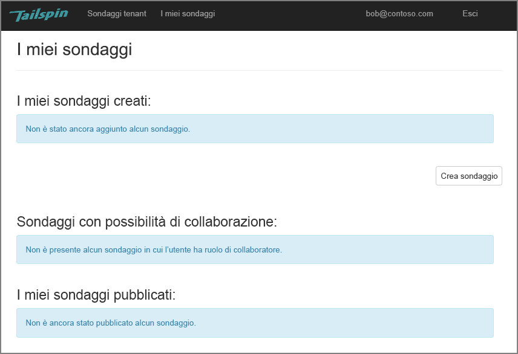
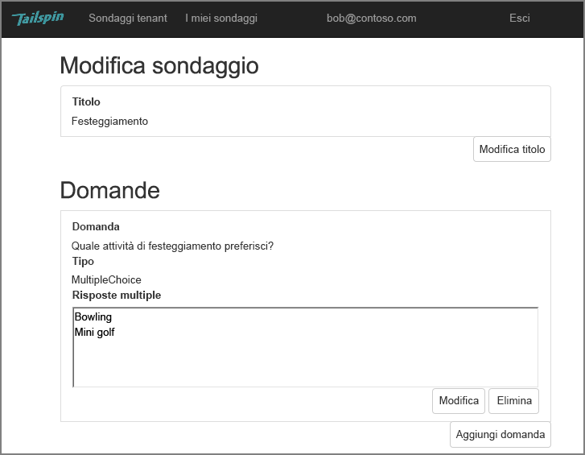
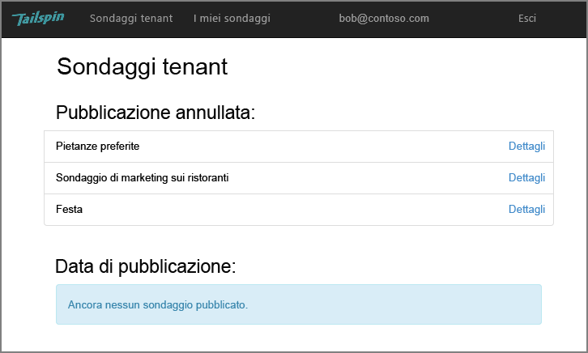
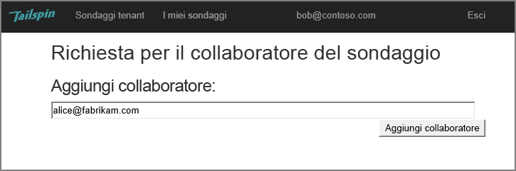
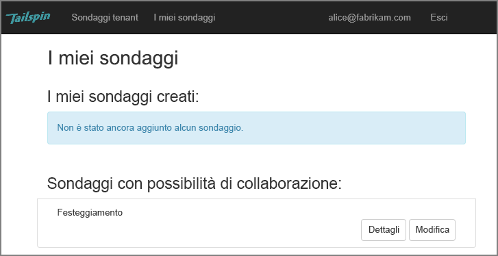
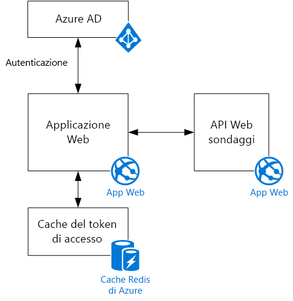

# Scenario TailspinThe Tailspin scenario

[ GitHub][sample application][ Sample code][sample application]

Tailspin è una società fittizia che sta sviluppando un'applicazione SaaS denominata Surveys.Tailspin is a fictitious company that is developing a SaaS application named Surveys. Questa applicazione consente alle organizzazioni di creare e pubblicare sondaggi online.This application enables organizations to create and publish online surveys.

* Le organizzazioni possono iscriversi per l'applicazione.An organization can sign up for the application.
* Dopo aver iscritto l'organizzazione, gli utenti possono accedere all'applicazione con le proprie credenziali aziendali.After the organization is signed up, users can sign into the application with their organizational credentials.
* Gli utenti possono creare, modificare e pubblicare i  sondaggi.Users can create, edit, and publish surveys.

> [!NOTE]
> Per iniziare a usare l'applicazione, vedere [Eseguire l'applicazione Surveys].To get started with the application, see [Run the Surveys application].
> 
> 

## Gli utenti possono creare, modificare e visualizzare sondaggiUsers can create, edit, and view surveys
Un utente autenticato può visualizzare tutti i sondaggi che ha creato o per cui ha diritti di collaboratore, nonché creare nuovi sondaggi.An authenticated user can view all the surveys that he or she has created or has contributor rights to, and create new surveys. Si noti che l'utente è connesso con la propria identità aziendale, `bob@contoso.com`.Notice that the user is signed in with his organizational identity, `bob@contoso.com`.

Questa schermata mostra la pagina Edit Survey:This screenshot shows the Edit Survey page:

Gli utenti possono anche visualizzare i sondaggi creati da altri utenti all'interno dello stesso tenant.Users can also view any surveys created by other users within the same tenant.

## I proprietari dei sondaggi possono invitare i collaboratoriSurvey owners can invite contributors
Quando crea un sondaggio, l'utente può invitare altre persone a collaborare nel sondaggio.When a user creates a survey, he or she can invite other people to be contributors on the survey. I collaboratori possono modificare il sondaggio, ma non possono eliminarlo o pubblicarlo.Contributors can edit the survey, but cannot delete or publish it.  

L'utente può aggiungere collaboratori di altri tenant consentendo in questo modo la condivisione di risorse tra tenant.A user can add contributors from other tenants, which enables cross-tenant sharing of resources. In questo screenshot Bob (`bob@contoso.com`) sta aggiungendo Alice (`alice@fabrikam.com`) come collaboratore a un sondaggio che ha creato lui stesso.In this screenshot, Bob (`bob@contoso.com`) is adding Alice (`alice@fabrikam.com`) as a contributor to a survey that Bob created.

Quando Alice esegue l'accesso, il sondaggio sarà visualizzato in "Surveys I can contribute to".When Alice logs in, she sees the survey listed under "Surveys I can contribute to".

Si noti che Alice accede al proprio tenant e non come guest al tenant Contoso.Note that Alice signs into her own tenant, not as a guest of the Contoso tenant. Alice ha autorizzazioni di collaboratore solo per questo sondaggio e non può visualizzare altri sondaggi dal tenant Contoso.Alice has contributor permissions only for that survey &mdash; she cannot view other surveys from the Contoso tenant.

## ArchitetturaArchitecture
L'applicazione Surveys è costituita da un'API Web di front-end e un'API Web di back-end.The Surveys application consists of a web front end and a web API backend. Entrambe le API vengono implementate usando [ASP.NET Core].Both are implemented using [ASP.NET Core].

L'applicazione Web usa Azure Active Directory (Azure AD) per l'autenticazione degli utenti.The web application uses Azure Active Directory (Azure AD) to authenticate users. L'applicazione Web chiama inoltre Azure AD per ottenere i token di accesso OAuth 2 per l'API Web.The web application also calls Azure AD to get OAuth 2 access tokens for the Web API. I token di accesso sono memorizzati nella cache in Cache Redis di Azure.Access tokens are cached in Azure Redis Cache. La cache consente a più istanze di condividere la stessa cache dei token (ad esempio, in una server farm).The cache enables multiple instances to share the same token cache (e.g., in a server farm).

[**Avanti**][authentication][**Next**][authentication]

<!-- Links -->

[authentication]: authenticate.md

[Eseguire l'applicazione Surveys]: ./run-the-app.md
[Run the Surveys application]: ./run-the-app.md
[ASP.NET Core]: /aspnet/core
[sample application]: https://github.com/mspnp/multitenant-saas-guidance
