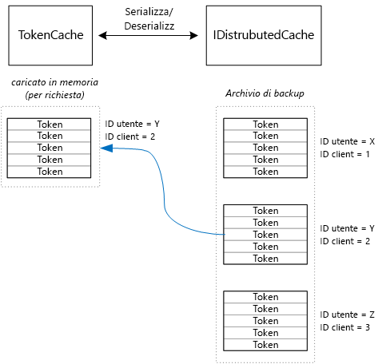

# <a name="cache-access-tokens"></a>Memorizzare nella cache i token di accesso

[ Codice di esempio][sample application]

Ottenere un token di accesso OAuth è un'attività relativamente complessa, in quanto è necessaria una richiesta HTTP all'endpoint del token. È consigliabile quindi memorizzare nella cache i token, laddove possibile. La [Azure AD Authentication Library][ADAL] (ADAL) (Raccolta di autenticazione di Azure AD) salva automaticamente nella cache i token ottenuti da Azure AD, compresi i token di aggiornamento.

ADAL fornisce un'implementazione predefinita della cache del token. Tuttavia, questa cache è progettata per le app client native e **non** è adatta alle app Web:

* Si tratta di un'istanza statica e non thread-safe.
* Non supporta la scalabilità a un numero elevato di utenti, in quanto i token di tutti gli utenti vengono collocati nello stesso dizionario.
* Non può essere condivisa tra i server Web in una farm.

In alternativa, è necessario implementare una cache di token personalizzata che deriva dalla classe `TokenCache` di ADAL, ma è adatta a un ambiente server e fornisce il livello di isolamento tra i token desiderato per utenti diversi.

La classe `TokenCache` archivia un dizionario di token, indicizzati da autorità di certificazione, risorse, ID client e utente. Una cache di token personalizzata deve scrivere questo dizionario in un archivio di backup, ad esempio una cache Redis.

Nell'applicazione Tailspin Surveys la classe `DistributedTokenCache` implementa la cache di token. Questa implementazione usa l'astrazione [IDistributedCache][distributed-cache] da ASP.NET Core. In questo modo, qualsiasi implementazione di `IDistributedCache` può essere usata come archivio di backup.

* Per impostazione predefinita, l'app Surveys usa una cache Redis.
* Per un server Web d'istanza singola, è possibile usare la [cache in memoria][in-memory-cache] ASP.NET Core. Questa opzione risulta valida anche per l'esecuzione locale dell'app durante lo sviluppo.

`DistributedTokenCache` archivia i dati della cache come coppie chiave/valore nell'archivio di backup. La chiave è costituita dall'ID utente e dall'ID client, pertanto l'archivio di backup contiene dati di cache separati per ogni combinazione univoca di utente/client.



L'archivio di backup viene partizionato dall'utente. Per ogni richiesta HTTP, i token, per quel cliente, vengono letti dall'archivio di backup e caricati nel dizionario `TokenCache`. Se Redis è usato come archivio di backup, ogni istanza del server in un cluster di server legge/scrive nella stessa cache, e questo approccio scala a molti utenti.

## <a name="encrypting-cached-tokens"></a>Crittografia dei token memorizzati nella cache

I token sono dati sensibili, perché garantiscono l'accesso alle risorse dell'utente. (Per di più, a differenza di una password di un utente, non è possibile solo archiviare un hash del token.) Pertanto, è fondamentale proteggere i token in modo che non vengano compromessi. La cache di backup Redis è protetta da un codice di accesso e se qualcuno dovesse venire a conoscenza di tale codice, otterrebbe anche i token di accesso memorizzati nella cache. Per questo motivo, la `DistributedTokenCache` crittografa tutto ciò che scrive nell'archivio di backup. La crittografia viene eseguita usando [Protezione dati][data-protection] in ASP.NET Core: le API di Consumer, configurazione, API di estensibilità e implementazione.

> [!NOTE]
> Se si distribuisce ai siti Web di Azure, viene eseguito il backup delle chiavi di crittografia nella risorsa di archiviazione di rete. Le chiavi vengono poi sincronizzate in tutti i computer (vedere [Key management and lifetime][key-management] (Gestione e durata delle chiavi)). Per impostazione predefinita, le chiavi non sono crittografate durante l'esecuzione in siti Web di Azure, ma è possibile [abilitare la crittografia tramite un certificato X.509][x509-cert-encryption].

## <a name="distributedtokencache-implementation"></a>Implementazione di DistributedTokenCache

La classe `DistributedTokenCache` deriva dalla classe [TokenCache][tokencache-class] di ADAL.

Nel costruttore, la classe `DistributedTokenCache` crea una chiave per l'utente corrente e carica la cache dall'archivio di backup:

```csharp
public DistributedTokenCache(
    ClaimsPrincipal claimsPrincipal,
    IDistributedCache distributedCache,
    ILoggerFactory loggerFactory,
    IDataProtectionProvider dataProtectionProvider)
    : base()
{
    _claimsPrincipal = claimsPrincipal;
    _cacheKey = BuildCacheKey(_claimsPrincipal);
    _distributedCache = distributedCache;
    _logger = loggerFactory.CreateLogger<DistributedTokenCache>();
    _protector = dataProtectionProvider.CreateProtector(typeof(DistributedTokenCache).FullName);
    AfterAccess = AfterAccessNotification;
    LoadFromCache();
}
```

La chiave viene creata concatenando l'ID utente e l'ID client, entrambi prelevati dalle attestazioni trovate in `ClaimsPrincipal` dell'utente:

```csharp
private static string BuildCacheKey(ClaimsPrincipal claimsPrincipal)
{
    string clientId = claimsPrincipal.FindFirstValue("aud", true);
    return string.Format(
        "UserId:{0}::ClientId:{1}",
        claimsPrincipal.GetObjectIdentifierValue(),
        clientId);
}
```

Per caricare i dati della cache, leggere il BLOB serializzato dall'archivio di backup, e chiamare `TokenCache.Deserialize` per convertire il BLOB nei dati della cache.

```csharp
private void LoadFromCache()
{
    byte[] cacheData = _distributedCache.Get(_cacheKey);
    if (cacheData != null)
    {
        this.Deserialize(_protector.Unprotect(cacheData));
    }
}
```

Ogni volta che ADAL accede alla cache, genera un evento `AfterAccess` . Se i dati della cache vengono modificati, la proprietà `HasStateChanged` è true. In tal caso, aggiornare l'archivio di backup in modo che rifletta la modifica e quindi impostare `HasStateChanged` su false.

```csharp
public void AfterAccessNotification(TokenCacheNotificationArgs args)
{
    if (this.HasStateChanged)
    {
        try
        {
            if (this.Count > 0)
            {
                _distributedCache.Set(_cacheKey, _protector.Protect(this.Serialize()));
            }
            else
            {
                // There are no tokens for this user/client, so remove the item from the cache.
                _distributedCache.Remove(_cacheKey);
            }
            this.HasStateChanged = false;
        }
        catch (Exception exp)
        {
            _logger.WriteToCacheFailed(exp);
            throw;
        }
    }
}
```

TokenCache invia altri due eventi:

* `BeforeWrite`. Chiamato immediatamente prima che ADAL scriva nella cache. Ciò consente di implementare una strategia di concorrenza.
* `BeforeAccess`. Chiamato immediatamente prima che ADAL legga dalla cache. In questo caso, è possibile ricaricare la cache per ottenere la versione più recente.

In questo esempio specifico, è stato ritenuto opportuno non gestire questi due eventi.

* Per la concorrenza, prevale la scrittura più recente. Questa opzione è accettabile, perché i token vengono archiviati in modo indipendente per ogni utente e per ogni client, pertanto si verificherà un conflitto solo se lo stesso utente ha due sessioni di accesso simultanee.
* Per la lettura, la cache viene caricata per ogni richiesta. Le richieste sono di breve durata. Se la cache viene modificata in un determinato momento, la richiesta successiva rileverà il nuovo valore.

[**Avanti**][client-assertion]

<!-- links -->
[ADAL]: https://msdn.microsoft.com/library/azure/jj573266.aspx
[client-assertion]: ./client-assertion.md
[data-protection]: /aspnet/core/security/data-protection/
[distributed-cache]: /aspnet/core/performance/caching/distributed
[key-management]: /aspnet/core/security/data-protection/configuration/default-settings
[in-memory-cache]: /aspnet/core/performance/caching/memory
[tokencache-class]: https://msdn.microsoft.com/library/azure/microsoft.identitymodel.clients.activedirectory.tokencache.aspx
[x509-cert-encryption]: /aspnet/core/security/data-protection/implementation/key-encryption-at-rest#x509-certificate
[sample application]: https://github.com/mspnp/multitenant-saas-guidance
