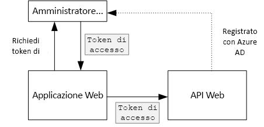

# <a name="secure-a-backend-web-api"></a><span data-ttu-id="6a783-103">Proteggere un'API Web back-end</span><span class="sxs-lookup"><span data-stu-id="6a783-103">Secure a backend web API</span></span>

<span data-ttu-id="6a783-104">[ GitHub][sample application]</span><span class="sxs-lookup"><span data-stu-id="6a783-104">[ Sample code][sample application]</span></span>

<span data-ttu-id="6a783-105">L'applicazione [Tailspin Surveys] usa un'API Web back-end per gestire le operazioni CRUD nei sondaggi.</span><span class="sxs-lookup"><span data-stu-id="6a783-105">The [Tailspin Surveys] application uses a backend web API to manage CRUD operations on surveys.</span></span> <span data-ttu-id="6a783-106">Ad esempio, quando un utente fa clic su "My Surveys" l'applicazione Web invia una richiesta HTTP all'API Web:</span><span class="sxs-lookup"><span data-stu-id="6a783-106">For example, when a user clicks "My Surveys", the web application sends an HTTP request to the web API:</span></span>

```
GET /users/{userId}/surveys
```

<span data-ttu-id="6a783-107">L'API Web restituisce un oggetto JSON:</span><span class="sxs-lookup"><span data-stu-id="6a783-107">The web API returns a JSON object:</span></span>

```
{
  "Published":[],
  "Own":[
    {"Id":1,"Title":"Survey 1"},
    {"Id":3,"Title":"Survey 3"},
    ],
  "Contribute": [{"Id":8,"Title":"My survey"}]
}
```

<span data-ttu-id="6a783-108">L'API Web non consente le richieste anonime, quindi l'app Web deve autenticarsi con i token di connessione OAuth 2.</span><span class="sxs-lookup"><span data-stu-id="6a783-108">The web API does not allow anonymous requests, so the web app must authenticate itself using OAuth 2 bearer tokens.</span></span>

> [!NOTE]
> <span data-ttu-id="6a783-109">Si tratta di uno scenario di connessioni tra server specifici.</span><span class="sxs-lookup"><span data-stu-id="6a783-109">This is a server-to-server scenario.</span></span> <span data-ttu-id="6a783-110">L'applicazione non esegue chiamate AJAX all'API dal browser client.</span><span class="sxs-lookup"><span data-stu-id="6a783-110">The application does not make any AJAX calls to the API from the browser client.</span></span>
> 
> 

<span data-ttu-id="6a783-111">Esistono due principali approcci possibili:</span><span class="sxs-lookup"><span data-stu-id="6a783-111">There are two main approaches you can take:</span></span>

* <span data-ttu-id="6a783-112">Identità utente delegato.</span><span class="sxs-lookup"><span data-stu-id="6a783-112">Delegated user identity.</span></span> <span data-ttu-id="6a783-113">L'applicazione Web si autentica con l'identità utente.</span><span class="sxs-lookup"><span data-stu-id="6a783-113">The web application authenticates with the user's identity.</span></span>
* <span data-ttu-id="6a783-114">Identità dell'applicazione.</span><span class="sxs-lookup"><span data-stu-id="6a783-114">Application identity.</span></span> <span data-ttu-id="6a783-115">L'applicazione Web si autentica con l'ID client tramite il flusso di credenziali client OAuth2.</span><span class="sxs-lookup"><span data-stu-id="6a783-115">The web application authenticates with its client ID, using OAuth2 client credential flow.</span></span>

<span data-ttu-id="6a783-116">L'applicazione Tailspin implementa l'identità utente delegato.</span><span class="sxs-lookup"><span data-stu-id="6a783-116">The Tailspin application implements delegated user identity.</span></span> <span data-ttu-id="6a783-117">Le principali differenze sono le seguenti:</span><span class="sxs-lookup"><span data-stu-id="6a783-117">Here are the main differences:</span></span>

<span data-ttu-id="6a783-118">**Identità utente delegato**</span><span class="sxs-lookup"><span data-stu-id="6a783-118">**Delegated user identity**</span></span>

* <span data-ttu-id="6a783-119">Il token di connessione inviato all'API Web contiene l'identità utente.</span><span class="sxs-lookup"><span data-stu-id="6a783-119">The bearer token sent to the web API contains the user identity.</span></span>
* <span data-ttu-id="6a783-120">L'API Web prende decisioni di autorizzazione in base all'identità utente.</span><span class="sxs-lookup"><span data-stu-id="6a783-120">The web API makes authorization decisions based on the user identity.</span></span>
* <span data-ttu-id="6a783-121">L'applicazione Web deve gestire gli errori 403 (accesso negato) dall'API Web se l'utente non è autorizzato a eseguire un'azione.</span><span class="sxs-lookup"><span data-stu-id="6a783-121">The web application needs to handle 403 (Forbidden) errors from the web API, if the user is not authorized to perform an action.</span></span>
* <span data-ttu-id="6a783-122">In genere, l'applicazione Web continua a prendere alcune decisioni di autorizzazione che influiscono sull'interfaccia utente, ad esempio mostrare o nascondere elementi dell'interfaccia utente.</span><span class="sxs-lookup"><span data-stu-id="6a783-122">Typically, the web application still makes some authorization decisions that affect UI, such as showing or hiding UI elements).</span></span>
* <span data-ttu-id="6a783-123">Potenzialmente l'API Web potrebbe essere usata da client non attendibili, ad esempio un'applicazione JavaScript o un'applicazione client nativa.</span><span class="sxs-lookup"><span data-stu-id="6a783-123">The web API can potentially be used by untrusted clients, such as a JavaScript application or a native client application.</span></span>

<span data-ttu-id="6a783-124">**Identità dell'applicazione**</span><span class="sxs-lookup"><span data-stu-id="6a783-124">**Application identity**</span></span>

* <span data-ttu-id="6a783-125">L'API Web non ottiene informazioni sull'utente.</span><span class="sxs-lookup"><span data-stu-id="6a783-125">The web API does not get information about the user.</span></span>
* <span data-ttu-id="6a783-126">L'API Web non può eseguire alcuna autorizzazione basata sull'identità utente.</span><span class="sxs-lookup"><span data-stu-id="6a783-126">The web API cannot perform any authorization based on the user identity.</span></span> <span data-ttu-id="6a783-127">Tutte le decisioni di autorizzazione vengono prese dall'applicazione Web.</span><span class="sxs-lookup"><span data-stu-id="6a783-127">All authorization decisions are made by the web application.</span></span>  
* <span data-ttu-id="6a783-128">L'API Web non può essere usata da un client non attendibile, ad esempio JavaScript o un'applicazione client nativa.</span><span class="sxs-lookup"><span data-stu-id="6a783-128">The web API cannot be used by an untrusted client (JavaScript or native client application).</span></span>
* <span data-ttu-id="6a783-129">Questo approccio è in qualche modo più semplice da implementare perché non sussiste alcuna logica di autorizzazione nell'API Web.</span><span class="sxs-lookup"><span data-stu-id="6a783-129">This approach may be somewhat simpler to implement, because there is no authorization logic in the Web API.</span></span>

<span data-ttu-id="6a783-130">In entrambi gli approcci, l'applicazione Web deve ottenere un token di accesso che corrisponde alle credenziali necessarie per chiamare l'API Web.</span><span class="sxs-lookup"><span data-stu-id="6a783-130">In either approach, the web application must get an access token, which is the credential needed to call the web API.</span></span>

* <span data-ttu-id="6a783-131">Per l'identità utente delegato il token deve provenire da IDP, in grado di rilasciare un token per conto dell'utente.</span><span class="sxs-lookup"><span data-stu-id="6a783-131">For delegated user identity, the token has to come from the IDP, which can issue a token on behalf of the user.</span></span>
* <span data-ttu-id="6a783-132">Per le credenziali client, un'applicazione può ottenere il token da IDP oppure ospitare il proprio token server.</span><span class="sxs-lookup"><span data-stu-id="6a783-132">For client credentials, an application might get the token from the IDP or host its own token server.</span></span> <span data-ttu-id="6a783-133">Tuttavia, non scrivere un token server da zero: usare un framework ben collaudato, ad esempio [IdentityServer3]. Se si esegue l'autenticazione con Azure AD, è consigliabile ottenere il token di accesso da Azure AD, anche con il flusso di credenziali del client.</span><span class="sxs-lookup"><span data-stu-id="6a783-133">(But don't write a token server from scratch; use a well-tested framework like [IdentityServer3].) If you authenticate with Azure AD, it's strongly recommended to get the access token from Azure AD, even with client credential flow.</span></span>

<span data-ttu-id="6a783-134">Il resto di questo articolo presuppone l'autenticazione dell'applicazione con Azure AD.</span><span class="sxs-lookup"><span data-stu-id="6a783-134">The rest of this article assumes the application is authenticating with Azure AD.</span></span>



## <a name="register-the-web-api-in-azure-ad"></a><span data-ttu-id="6a783-136">Registrare l'API Web in Azure AD</span><span class="sxs-lookup"><span data-stu-id="6a783-136">Register the web API in Azure AD</span></span>
<span data-ttu-id="6a783-137">Per consentire ad Azure AD di emettere un token di connessione per l'API Web, è necessario configurare alcuni aspetti in Azure AD.</span><span class="sxs-lookup"><span data-stu-id="6a783-137">In order for Azure AD to issue a bearer token for the web API, you need to configure some things in Azure AD.</span></span>

1. <span data-ttu-id="6a783-138">Registrare l'API Web in Azure AD.</span><span class="sxs-lookup"><span data-stu-id="6a783-138">Register the web API in Azure AD.</span></span>

2. <span data-ttu-id="6a783-139">Aggiungere l'ID client dell'app Web nel manifesto dell'applicazione API Web nella proprietà `knownClientApplications` .</span><span class="sxs-lookup"><span data-stu-id="6a783-139">Add the client ID of the web app to the web API application manifest, in the `knownClientApplications` property.</span></span> <span data-ttu-id="6a783-140">Vedere l'articolo su come [aggiornare i manifesti delle applicazioni].</span><span class="sxs-lookup"><span data-stu-id="6a783-140">See [Update the application manifests].</span></span>

3. <span data-ttu-id="6a783-141">Autorizzare l'applicazione Web a chiamare l'API Web.</span><span class="sxs-lookup"><span data-stu-id="6a783-141">Give the web application permission to call the web API.</span></span> <span data-ttu-id="6a783-142">Nel portale di gestione di Microsoft Azure è possibile impostare due tipi di autorizzazioni: "Autorizzazioni applicazione" per l'identità dell'applicazione (flusso di credenziali client) o "Autorizzazioni delegate" per l'identità utente delegato.</span><span class="sxs-lookup"><span data-stu-id="6a783-142">In the Azure Management Portal, you can set two types of permissions: "Application Permissions" for application identity (client credential flow), or "Delegated Permissions" for delegated user identity.</span></span>
   
   

## <a name="getting-an-access-token"></a><span data-ttu-id="6a783-144">Recupero di un token di accesso</span><span class="sxs-lookup"><span data-stu-id="6a783-144">Getting an access token</span></span>
<span data-ttu-id="6a783-145">Prima di chiamare l'API Web, l'applicazione Web ottiene un token di accesso da Azure AD.</span><span class="sxs-lookup"><span data-stu-id="6a783-145">Before calling the web API, the web application gets an access token from Azure AD.</span></span> <span data-ttu-id="6a783-146">In un'applicazione .NET usare [Azure AD Authentication Library (ADAL) for .NET][ADAL] (Raccolta di Autenticazione di Azure AD (ADAL) per .NET).</span><span class="sxs-lookup"><span data-stu-id="6a783-146">In a .NET application, use the [Azure AD Authentication Library (ADAL) for .NET][ADAL].</span></span>

<span data-ttu-id="6a783-147">Nel flusso di codici di autorizzazione OAuth 2 l'applicazione scambia un codice di autorizzazione per un token di accesso.</span><span class="sxs-lookup"><span data-stu-id="6a783-147">In the OAuth 2 authorization code flow, the application exchanges an authorization code for an access token.</span></span> <span data-ttu-id="6a783-148">Il codice seguente usa ADAL per ottenere il token di accesso.</span><span class="sxs-lookup"><span data-stu-id="6a783-148">The following code uses ADAL to get the access token.</span></span> <span data-ttu-id="6a783-149">Questo codice viene chiamato durante l'evento `AuthorizationCodeReceived` .</span><span class="sxs-lookup"><span data-stu-id="6a783-149">This code is called during the `AuthorizationCodeReceived` event.</span></span>

```csharp
// The OpenID Connect middleware sends this event when it gets the authorization code.   
public override async Task AuthorizationCodeReceived(AuthorizationCodeReceivedContext context)
{
    string authorizationCode = context.ProtocolMessage.Code;
    string authority = "https://login.microsoftonline.com/" + tenantID
    string resourceID = "https://tailspin.onmicrosoft.com/surveys.webapi" // App ID URI
    ClientCredential credential = new ClientCredential(clientId, clientSecret);

    AuthenticationContext authContext = new AuthenticationContext(authority, tokenCache);
    AuthenticationResult authResult = await authContext.AcquireTokenByAuthorizationCodeAsync(
        authorizationCode, new Uri(redirectUri), credential, resourceID);

    // If successful, the token is in authResult.AccessToken
}
```

<span data-ttu-id="6a783-150">Ecco i diversi parametri necessari:</span><span class="sxs-lookup"><span data-stu-id="6a783-150">Here are the various parameters that are needed:</span></span>

* <span data-ttu-id="6a783-151">`authority`.</span><span class="sxs-lookup"><span data-stu-id="6a783-151">`authority`.</span></span> <span data-ttu-id="6a783-152">Derivato dall'ID tenant dell'utente connesso.</span><span class="sxs-lookup"><span data-stu-id="6a783-152">Derived from the tenant ID of the signed in user.</span></span> <span data-ttu-id="6a783-153">Non l'ID tenant del provider SaaS.</span><span class="sxs-lookup"><span data-stu-id="6a783-153">(Not the tenant ID of the SaaS provider)</span></span>  
* <span data-ttu-id="6a783-154">`authorizationCode`.</span><span class="sxs-lookup"><span data-stu-id="6a783-154">`authorizationCode`.</span></span> <span data-ttu-id="6a783-155">Il codice di autorizzazione restituito da IDP.</span><span class="sxs-lookup"><span data-stu-id="6a783-155">the auth code that you got back from the IDP.</span></span>
* <span data-ttu-id="6a783-156">`clientId`.</span><span class="sxs-lookup"><span data-stu-id="6a783-156">`clientId`.</span></span> <span data-ttu-id="6a783-157">L'ID client dell'applicazione Web.</span><span class="sxs-lookup"><span data-stu-id="6a783-157">The web application's client ID.</span></span>
* <span data-ttu-id="6a783-158">`clientSecret`.</span><span class="sxs-lookup"><span data-stu-id="6a783-158">`clientSecret`.</span></span> <span data-ttu-id="6a783-159">Chiave privata client dell'applicazione Web.</span><span class="sxs-lookup"><span data-stu-id="6a783-159">The web application's client secret.</span></span>
* <span data-ttu-id="6a783-160">`redirectUri`.</span><span class="sxs-lookup"><span data-stu-id="6a783-160">`redirectUri`.</span></span> <span data-ttu-id="6a783-161">L'URI di reindirizzamento impostato per OpenID Connect.</span><span class="sxs-lookup"><span data-stu-id="6a783-161">The redirect URI that you set for OpenID connect.</span></span> <span data-ttu-id="6a783-162">L'IDP richiama qui con il token.</span><span class="sxs-lookup"><span data-stu-id="6a783-162">This is where the IDP calls back with the token.</span></span>
* <span data-ttu-id="6a783-163">`resourceID`.</span><span class="sxs-lookup"><span data-stu-id="6a783-163">`resourceID`.</span></span> <span data-ttu-id="6a783-164">L'URI ID app dell'API Web creato al momento della registrazione dell'API Web in Azure AD</span><span class="sxs-lookup"><span data-stu-id="6a783-164">The App ID URI of the web API, which you created when you registered the web API in Azure AD</span></span>
* <span data-ttu-id="6a783-165">`tokenCache`.</span><span class="sxs-lookup"><span data-stu-id="6a783-165">`tokenCache`.</span></span> <span data-ttu-id="6a783-166">Un oggetto che memorizza nella cache i token di accesso.</span><span class="sxs-lookup"><span data-stu-id="6a783-166">An object that caches the access tokens.</span></span> <span data-ttu-id="6a783-167">Vedere l'articolo sulla [memorizzazione nella cache dei token].</span><span class="sxs-lookup"><span data-stu-id="6a783-167">See [Token caching].</span></span>

<span data-ttu-id="6a783-168">Se `AcquireTokenByAuthorizationCodeAsync` viene eseguito correttamente, ADAL memorizza nella cache il token.</span><span class="sxs-lookup"><span data-stu-id="6a783-168">If `AcquireTokenByAuthorizationCodeAsync` succeeds, ADAL caches the token.</span></span> <span data-ttu-id="6a783-169">In seguito è possibile ottenere il token dalla cache chiamando AcquireTokenSilentAsync:</span><span class="sxs-lookup"><span data-stu-id="6a783-169">Later, you can get the token from the cache by calling AcquireTokenSilentAsync:</span></span>

```csharp
AuthenticationContext authContext = new AuthenticationContext(authority, tokenCache);
var result = await authContext.AcquireTokenSilentAsync(resourceID, credential, new UserIdentifier(userId, UserIdentifierType.UniqueId));
```

<span data-ttu-id="6a783-170">dove `userId` è l'ID oggetto dell'utente, disponibile nell'attestazione `http://schemas.microsoft.com/identity/claims/objectidentifier`.</span><span class="sxs-lookup"><span data-stu-id="6a783-170">where `userId` is the user's object ID, which is found in the `http://schemas.microsoft.com/identity/claims/objectidentifier` claim.</span></span>

## <a name="using-the-access-token-to-call-the-web-api"></a><span data-ttu-id="6a783-171">Usare il token di accesso per chiamare l'API Web</span><span class="sxs-lookup"><span data-stu-id="6a783-171">Using the access token to call the web API</span></span>
<span data-ttu-id="6a783-172">Dopo aver creato il token, inviarlo all'API Web nell'intestazione di autorizzazione delle richieste HTTP.</span><span class="sxs-lookup"><span data-stu-id="6a783-172">Once you have the token, send it in the Authorization header of the HTTP requests to the web API.</span></span>

```
Authorization: Bearer xxxxxxxxxx
```

<span data-ttu-id="6a783-173">Il seguente metodo di estensione dall'applicazione Surveys imposta l'intestazione di autorizzazione su una richiesta HTTP con la classe **HttpClient** .</span><span class="sxs-lookup"><span data-stu-id="6a783-173">The following extension method from the Surveys application sets the Authorization header on an HTTP request, using the **HttpClient** class.</span></span>

```csharp
public static async Task<HttpResponseMessage> SendRequestWithBearerTokenAsync(this HttpClient httpClient, HttpMethod method, string path, object requestBody, string accessToken, CancellationToken ct)
{
    var request = new HttpRequestMessage(method, path);
    if (requestBody != null)
    {
        var json = JsonConvert.SerializeObject(requestBody, Formatting.None);
        var content = new StringContent(json, Encoding.UTF8, "application/json");
        request.Content = content;
    }

    request.Headers.Authorization = new AuthenticationHeaderValue("Bearer", accessToken);
    request.Headers.Accept.Add(new MediaTypeWithQualityHeaderValue("application/json"));

    var response = await httpClient.SendAsync(request, ct);
    return response;
}
```

## <a name="authenticating-in-the-web-api"></a><span data-ttu-id="6a783-174">Autenticarsi nell'API Web</span><span class="sxs-lookup"><span data-stu-id="6a783-174">Authenticating in the web API</span></span>
<span data-ttu-id="6a783-175">L'API Web deve autenticare il token di connessione.</span><span class="sxs-lookup"><span data-stu-id="6a783-175">The web API has to authenticate the bearer token.</span></span> <span data-ttu-id="6a783-176">In ASP.NET Core è possibile usare il pacchetto [Microsoft.AspNet.Authentication.JwtBearer][JwtBearer].</span><span class="sxs-lookup"><span data-stu-id="6a783-176">In ASP.NET Core, you can use the [Microsoft.AspNet.Authentication.JwtBearer][JwtBearer] package.</span></span> <span data-ttu-id="6a783-177">Questo pacchetto offre un middleware che consente all'applicazione di ricevere i token di connessione OpenID Connect.</span><span class="sxs-lookup"><span data-stu-id="6a783-177">This package provides middleware that enables the application to receive OpenID Connect bearer tokens.</span></span>

<span data-ttu-id="6a783-178">Registrare il middleware nella classe `Startup` dell'API Web.</span><span class="sxs-lookup"><span data-stu-id="6a783-178">Register the middleware in your web API `Startup` class.</span></span>

```csharp
public void Configure(IApplicationBuilder app, IHostingEnvironment env, ApplicationDbContext dbContext, ILoggerFactory loggerFactory)
{
    // ...

    app.UseJwtBearerAuthentication(new JwtBearerOptions {
        Audience = configOptions.AzureAd.WebApiResourceId,
        Authority = Constants.AuthEndpointPrefix,
        TokenValidationParameters = new TokenValidationParameters {
            ValidateIssuer = false
        },
        Events= new SurveysJwtBearerEvents(loggerFactory.CreateLogger<SurveysJwtBearerEvents>())
    });
    
    // ...
}
```

* <span data-ttu-id="6a783-179">**Destinatari**.</span><span class="sxs-lookup"><span data-stu-id="6a783-179">**Audience**.</span></span> <span data-ttu-id="6a783-180">Impostare questa opzione per l'URL dell'ID app per l'API Web creato al momento della registrazione dell'API Web con Azure AD.</span><span class="sxs-lookup"><span data-stu-id="6a783-180">Set this to the App ID URL for the web API, which you created when you registered the web API with Azure AD.</span></span>
* <span data-ttu-id="6a783-181">**Autorità**.</span><span class="sxs-lookup"><span data-stu-id="6a783-181">**Authority**.</span></span> <span data-ttu-id="6a783-182">Per un'applicazione multi-tenant impostarla su `https://login.microsoftonline.com/common/`.</span><span class="sxs-lookup"><span data-stu-id="6a783-182">For a multitenant application, set this to `https://login.microsoftonline.com/common/`.</span></span>
* <span data-ttu-id="6a783-183">**Parametri di validazione del token**.</span><span class="sxs-lookup"><span data-stu-id="6a783-183">**TokenValidationParameters**.</span></span> <span data-ttu-id="6a783-184">Per un'applicazione multi-tenant, impostare **ValidateIssuer** su false:</span><span class="sxs-lookup"><span data-stu-id="6a783-184">For a multitenant application, set **ValidateIssuer** to false.</span></span> <span data-ttu-id="6a783-185">ciò significa che l'applicazione convaliderà l'autorità di certificazione.</span><span class="sxs-lookup"><span data-stu-id="6a783-185">That means the application will validate the issuer.</span></span>
* <span data-ttu-id="6a783-186">**Eventi** è una classe che deriva da **JwtBearerEvents**.</span><span class="sxs-lookup"><span data-stu-id="6a783-186">**Events** is a class that derives from **JwtBearerEvents**.</span></span>

### <a name="issuer-validation"></a><span data-ttu-id="6a783-187">Convalida dell'autorità di certificazione</span><span class="sxs-lookup"><span data-stu-id="6a783-187">Issuer validation</span></span>
<span data-ttu-id="6a783-188">Convalidare l'autorità di certificazione del token nell'evento **JwtBearerEvents.ValidatedToken**.</span><span class="sxs-lookup"><span data-stu-id="6a783-188">Validate the token issuer in the **JwtBearerEvents.TokenValidated** event.</span></span> <span data-ttu-id="6a783-189">L'autorità di certificazione viene inviata nell'attestazione "iss".</span><span class="sxs-lookup"><span data-stu-id="6a783-189">The issuer is sent in the "iss" claim.</span></span>

<span data-ttu-id="6a783-190">Nell'applicazione Surveys l'API Web non gestisce l' [iscrizione del tenant].</span><span class="sxs-lookup"><span data-stu-id="6a783-190">In the Surveys application, the web API doesn't handle [tenant sign-up].</span></span> <span data-ttu-id="6a783-191">Per questo motivo, controlla solo se l'autorità di certificazione si trova già nel database dell'applicazione.</span><span class="sxs-lookup"><span data-stu-id="6a783-191">Therefore, it just checks if the issuer is already in the application database.</span></span> <span data-ttu-id="6a783-192">In caso contrario, viene generata un'eccezione che determina la mancata autenticazione.</span><span class="sxs-lookup"><span data-stu-id="6a783-192">If not, it throws an exception, which causes authentication to fail.</span></span>

```csharp
public override async Task TokenValidated(TokenValidatedContext context)
{
    var principal = context.Ticket.Principal;
    var tenantManager = context.HttpContext.RequestServices.GetService<TenantManager>();
    var userManager = context.HttpContext.RequestServices.GetService<UserManager>();
    var issuerValue = principal.GetIssuerValue();
    var tenant = await tenantManager.FindByIssuerValueAsync(issuerValue);

    if (tenant == null)
    {
        // The caller was not from a trusted issuer. Throw to block the authentication flow.
        throw new SecurityTokenValidationException();
    }

    var identity = principal.Identities.First();

    // Add new claim for survey_userid
    var registeredUser = await userManager.FindByObjectIdentifier(principal.GetObjectIdentifierValue());
    identity.AddClaim(new Claim(SurveyClaimTypes.SurveyUserIdClaimType, registeredUser.Id.ToString()));
    identity.AddClaim(new Claim(SurveyClaimTypes.SurveyTenantIdClaimType, registeredUser.TenantId.ToString()));

    // Add new claim for Email
    var email = principal.FindFirst(ClaimTypes.Upn)?.Value;
    if (!string.IsNullOrWhiteSpace(email))
    {
        identity.AddClaim(new Claim(ClaimTypes.Email, email));
    }
}
```

<span data-ttu-id="6a783-193">Come illustrato in questo esempio, è possibile anche usare l'evento **TokenValidated** per modificare le attestazioni.</span><span class="sxs-lookup"><span data-stu-id="6a783-193">As this example shows, you can also use the **TokenValidated** event to modify the claims.</span></span> <span data-ttu-id="6a783-194">Si noti che le attestazioni provengono direttamente da Azure AD.</span><span class="sxs-lookup"><span data-stu-id="6a783-194">Remember that the claims come directly from Azure AD.</span></span> <span data-ttu-id="6a783-195">Se l'applicazione Web modifica le attestazioni ottenute, tali modifiche non verranno visualizzate nel token di connessione ricevuto dall'API Web.</span><span class="sxs-lookup"><span data-stu-id="6a783-195">If the web application modifies the claims that it gets, those changes won't show up in the bearer token that the web API receives.</span></span> <span data-ttu-id="6a783-196">Per maggiori informazioni, vedere [Trasformazioni delle attestazioni][claims-transformation].</span><span class="sxs-lookup"><span data-stu-id="6a783-196">For more information, see [Claims transformations][claims-transformation].</span></span>

## <a name="authorization"></a><span data-ttu-id="6a783-197">Authorization</span><span class="sxs-lookup"><span data-stu-id="6a783-197">Authorization</span></span>
<span data-ttu-id="6a783-198">Per una discussione generale sulle autorizzazioni, vedere [Autorizzazione basata sui ruoli e sulle risorse][Authorization].</span><span class="sxs-lookup"><span data-stu-id="6a783-198">For a general discussion of authorization, see [Role-based and resource-based authorization][Authorization].</span></span> 

<span data-ttu-id="6a783-199">Il middleware JwtBearer gestisce le risposte di autorizzazione.</span><span class="sxs-lookup"><span data-stu-id="6a783-199">The JwtBearer middleware handles the authorization responses.</span></span> <span data-ttu-id="6a783-200">Ad esempio, per limitare un'azione del controller agli utenti autenticati, usare l'attributo **[Authorize]** e specificare  **JwtBearerDefaults.AuthenticationScheme** come schema di autenticazione:</span><span class="sxs-lookup"><span data-stu-id="6a783-200">For example, to restrict a controller action to authenticated users, use the **[Authorize]** atrribute and specify **JwtBearerDefaults.AuthenticationScheme** as the authentication scheme:</span></span>

```csharp
[Authorize(ActiveAuthenticationSchemes = JwtBearerDefaults.AuthenticationScheme)]
```

<span data-ttu-id="6a783-201">Questo restituisce un codice di stato 401 se l'utente non è autenticato.</span><span class="sxs-lookup"><span data-stu-id="6a783-201">This returns a 401 status code if the user is not authenticated.</span></span>

<span data-ttu-id="6a783-202">Per limitare un'azione del controller attraverso i criteri di autorizzazione, specificare il nome del criterio nell'attributo **[Authorize]**:</span><span class="sxs-lookup"><span data-stu-id="6a783-202">To restrict a controller action by authorizaton policy, specify the policy name in the **[Authorize]** attribute:</span></span>

```csharp
[Authorize(Policy = PolicyNames.RequireSurveyCreator)]
```

<span data-ttu-id="6a783-203">Questo restituisce un codice di stato 401 se l'utente non è autenticato e 403 se l'utente è autenticato ma non autorizzato.</span><span class="sxs-lookup"><span data-stu-id="6a783-203">This returns a 401 status code if the user is not authenticated, and 403 if the user is authenticated but not authorized.</span></span> <span data-ttu-id="6a783-204">Registrare i criteri all'avvio:</span><span class="sxs-lookup"><span data-stu-id="6a783-204">Register the policy on startup:</span></span>

```csharp
public void ConfigureServices(IServiceCollection services)
{
    services.AddAuthorization(options =>
    {
        options.AddPolicy(PolicyNames.RequireSurveyCreator,
            policy =>
            {
                policy.AddRequirements(new SurveyCreatorRequirement());
                policy.RequireAuthenticatedUser(); // Adds DenyAnonymousAuthorizationRequirement 
                policy.AddAuthenticationSchemes(JwtBearerDefaults.AuthenticationScheme);
            });
        options.AddPolicy(PolicyNames.RequireSurveyAdmin,
            policy =>
            {
                policy.AddRequirements(new SurveyAdminRequirement());
                policy.RequireAuthenticatedUser(); // Adds DenyAnonymousAuthorizationRequirement 
                policy.AddAuthenticationSchemes(JwtBearerDefaults.AuthenticationScheme);
            });
    });
    
    // ...
}
```

<span data-ttu-id="6a783-205">[**Avanti**][token cache]</span><span class="sxs-lookup"><span data-stu-id="6a783-205">[**Next**][token cache]</span></span>

<!-- links -->
[ADAL]: https://msdn.microsoft.com/library/azure/jj573266.aspx
[JwtBearer]: https://www.nuget.org/packages/Microsoft.AspNet.Authentication.JwtBearer

[Tailspin Surveys]: tailspin.md
[IdentityServer3]: https://github.com/IdentityServer/IdentityServer3
[aggiornare i manifesti delle applicazioni]: ./run-the-app.md#update-the-application-manifests
[Update the application manifests]: ./run-the-app.md#update-the-application-manifests
[memorizzazione nella cache dei token]: token-cache.md
[Token caching]: token-cache.md
[iscrizione del tenant]: signup.md
[tenant sign-up]: signup.md
[claims-transformation]: claims.md#claims-transformations
[Authorization]: authorize.md
[sample application]: https://github.com/mspnp/multitenant-saas-guidance
[token cache]: token-cache.md
