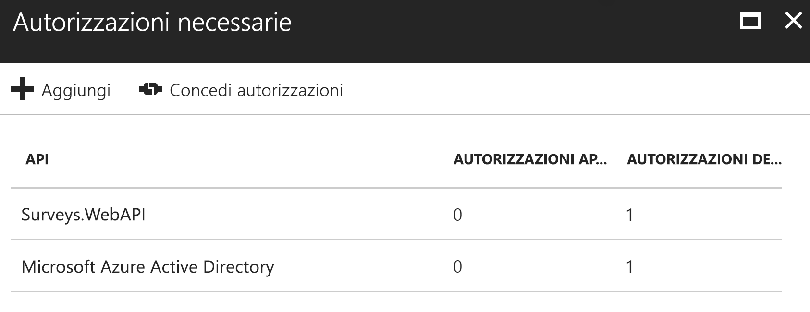

# <a name="secure-a-backend-web-api"></a>Proteggere un'API Web back-end

[ Codice di esempio][sample application]

L'applicazione [Tailspin Surveys] usa un'API Web back-end per gestire le operazioni CRUD nei sondaggi. Ad esempio, quando un utente fa clic su "My Surveys" l'applicazione Web invia una richiesta HTTP all'API Web:

```http
GET /users/{userId}/surveys
```

L'API Web restituisce un oggetto JSON:

```http
{
  "Published":[],
  "Own":[
    {"Id":1,"Title":"Survey 1"},
    {"Id":3,"Title":"Survey 3"},
    ],
  "Contribute": [{"Id":8,"Title":"My survey"}]
}
```

L'API Web non consente le richieste anonime, quindi l'app Web deve autenticarsi con i token di connessione OAuth 2.

> [!NOTE]
> Si tratta di uno scenario di connessioni tra server specifici. L'applicazione non esegue chiamate AJAX all'API dal browser client.

Esistono due principali approcci possibili:

* Identità utente delegato. L'applicazione Web si autentica con l'identità utente.
* Identità dell'applicazione. L'applicazione Web si autentica con l'ID client tramite il flusso di credenziali client OAuth2.

L'applicazione Tailspin implementa l'identità utente delegato. Le principali differenze sono le seguenti:

**Identità utente delegato**

* Il token di connessione inviato all'API Web contiene l'identità utente.
* L'API Web prende decisioni di autorizzazione in base all'identità utente.
* L'applicazione Web deve gestire gli errori 403 (accesso negato) dall'API Web se l'utente non è autorizzato a eseguire un'azione.
* In genere, l'applicazione Web continua a prendere alcune decisioni di autorizzazione che influiscono sull'interfaccia utente, ad esempio mostrare o nascondere elementi dell'interfaccia utente.
* Potenzialmente l'API Web potrebbe essere usata da client non attendibili, ad esempio un'applicazione JavaScript o un'applicazione client nativa.

**Identità dell'applicazione**

* L'API Web non ottiene informazioni sull'utente.
* L'API Web non può eseguire alcuna autorizzazione basata sull'identità utente. Tutte le decisioni di autorizzazione vengono prese dall'applicazione Web.  
* L'API Web non può essere usata da un client non attendibile, ad esempio JavaScript o un'applicazione client nativa.
* Questo approccio è in qualche modo più semplice da implementare perché non sussiste alcuna logica di autorizzazione nell'API Web.

In entrambi gli approcci, l'applicazione Web deve ottenere un token di accesso che corrisponde alle credenziali necessarie per chiamare l'API Web.

* Per l'identità utente delegato il token deve provenire da IDP, in grado di rilasciare un token per conto dell'utente.
* Per le credenziali client, un'applicazione può ottenere il token da IDP oppure ospitare il proprio token server. Non scrivere però un server di token da zero. Usare un framework ben collaudato come [IdentityServer4]. Se si esegue l'autenticazione con Azure AD, è consigliabile ottenere il token di accesso da Azure AD, anche con il flusso di credenziali del client.

Il resto di questo articolo presuppone l'autenticazione dell'applicazione con Azure AD.


## <a name="register-the-web-api-in-azure-ad"></a>Registrare l'API Web in Azure AD

Per consentire ad Azure AD di emettere un token di connessione per l'API Web, è necessario configurare alcuni aspetti in Azure AD.

1. Registrare l'API Web in Azure AD.

2. Aggiungere l'ID client dell'app Web nel manifesto dell'applicazione API Web nella proprietà `knownClientApplications` . Vedere l'articolo su come [aggiornare i manifesti delle applicazioni].

3. Autorizzare l'applicazione Web a chiamare l'API Web. Nel portale di gestione di Azure è possibile impostare due tipi di autorizzazioni: "Autorizzazioni applicazione" per l'identità dell'applicazione (flusso di credenziali client) o "Autorizzazioni delegate" per l'identità utente delegato.

   

## <a name="getting-an-access-token"></a>Recupero di un token di accesso

Prima di chiamare l'API Web, l'applicazione Web ottiene un token di accesso da Azure AD. In un'applicazione .NET usare [Azure AD Authentication Library (ADAL) for .NET][ADAL] (Raccolta di Autenticazione di Azure AD (ADAL) per .NET).

Nel flusso di codici di autorizzazione OAuth 2 l'applicazione scambia un codice di autorizzazione per un token di accesso. Il codice seguente usa ADAL per ottenere il token di accesso. Questo codice viene chiamato durante l'evento `AuthorizationCodeReceived` .

```csharp
// The OpenID Connect middleware sends this event when it gets the authorization code.
public override async Task AuthorizationCodeReceived(AuthorizationCodeReceivedContext context)
{
    string authorizationCode = context.ProtocolMessage.Code;
    string authority = "https://login.microsoftonline.com/" + tenantID
    string resourceID = "https://tailspin.onmicrosoft.com/surveys.webapi" // App ID URI
    ClientCredential credential = new ClientCredential(clientId, clientSecret);

    AuthenticationContext authContext = new AuthenticationContext(authority, tokenCache);
    AuthenticationResult authResult = await authContext.AcquireTokenByAuthorizationCodeAsync(
        authorizationCode, new Uri(redirectUri), credential, resourceID);

    // If successful, the token is in authResult.AccessToken
}
```

Ecco i diversi parametri necessari:

* `authority`. Derivato dall'ID tenant dell'utente connesso. Non l'ID tenant del provider SaaS.  
* `authorizationCode`. Il codice di autorizzazione restituito da IDP.
* `clientId`. L'ID client dell'applicazione Web.
* `clientSecret`. Chiave privata client dell'applicazione Web.
* `redirectUri`. L'URI di reindirizzamento impostato per OpenID Connect. L'IDP richiama qui con il token.
* `resourceID`. L'URI ID app dell'API Web creato al momento della registrazione dell'API Web in Azure AD
* `tokenCache`. Un oggetto che memorizza nella cache i token di accesso. Vedere l'articolo sulla [memorizzazione nella cache dei token].

Se `AcquireTokenByAuthorizationCodeAsync` viene eseguito correttamente, ADAL memorizza nella cache il token. In seguito è possibile ottenere il token dalla cache chiamando AcquireTokenSilentAsync:

```csharp
AuthenticationContext authContext = new AuthenticationContext(authority, tokenCache);
var result = await authContext.AcquireTokenSilentAsync(resourceID, credential, new UserIdentifier(userId, UserIdentifierType.UniqueId));
```

dove `userId` è l'ID oggetto dell'utente, disponibile nell'attestazione `http://schemas.microsoft.com/identity/claims/objectidentifier`.

## <a name="using-the-access-token-to-call-the-web-api"></a>Usare il token di accesso per chiamare l'API Web

Dopo aver creato il token, inviarlo all'API Web nell'intestazione di autorizzazione delle richieste HTTP.

```http
Authorization: Bearer xxxxxxxxxx
```

Il seguente metodo di estensione dall'applicazione Surveys imposta l'intestazione di autorizzazione su una richiesta HTTP con la classe **HttpClient** .

```csharp
public static async Task<HttpResponseMessage> SendRequestWithBearerTokenAsync(this HttpClient httpClient, HttpMethod method, string path, object requestBody, string accessToken, CancellationToken ct)
{
    var request = new HttpRequestMessage(method, path);
    if (requestBody != null)
    {
        var json = JsonConvert.SerializeObject(requestBody, Formatting.None);
        var content = new StringContent(json, Encoding.UTF8, "application/json");
        request.Content = content;
    }

    request.Headers.Authorization = new AuthenticationHeaderValue("Bearer", accessToken);
    request.Headers.Accept.Add(new MediaTypeWithQualityHeaderValue("application/json"));

    var response = await httpClient.SendAsync(request, ct);
    return response;
}
```

## <a name="authenticating-in-the-web-api"></a>Autenticarsi nell'API Web

L'API Web deve autenticare il token di connessione. In ASP.NET Core è possibile usare il pacchetto [Microsoft.AspNet.Authentication.JwtBearer][JwtBearer]. Questo pacchetto offre un middleware che consente all'applicazione di ricevere i token di connessione OpenID Connect.

Registrare il middleware nella classe `Startup` dell'API Web.

```csharp
public void Configure(IApplicationBuilder app, IHostingEnvironment env, ApplicationDbContext dbContext, ILoggerFactory loggerFactory)
{
    // ...

    app.UseJwtBearerAuthentication(new JwtBearerOptions {
        Audience = configOptions.AzureAd.WebApiResourceId,
        Authority = Constants.AuthEndpointPrefix,
        TokenValidationParameters = new TokenValidationParameters {
            ValidateIssuer = false
        },
        Events= new SurveysJwtBearerEvents(loggerFactory.CreateLogger<SurveysJwtBearerEvents>())
    });

    // ...
}
```

* **Destinatari**. Impostare questa opzione per l'URL dell'ID app per l'API Web creato al momento della registrazione dell'API Web con Azure AD.
* **Autorità**. Per un'applicazione multi-tenant impostarla su `https://login.microsoftonline.com/common/`.
* **Parametri di validazione del token**. Per un'applicazione multi-tenant, impostare **ValidateIssuer** su false: ciò significa che l'applicazione convaliderà l'autorità di certificazione.
* **Eventi** è una classe che deriva da **JwtBearerEvents**.

### <a name="issuer-validation"></a>Convalida dell'autorità di certificazione

Convalidare l'autorità di certificazione del token nell'evento **JwtBearerEvents.ValidatedToken**. L'autorità di certificazione viene inviata nell'attestazione "iss".

Nell'applicazione Surveys l'API Web non gestisce l' [iscrizione del tenant]. Per questo motivo, controlla solo se l'autorità di certificazione si trova già nel database dell'applicazione. In caso contrario, viene generata un'eccezione che determina la mancata autenticazione.

```csharp
public override async Task TokenValidated(TokenValidatedContext context)
{
    var principal = context.Ticket.Principal;
    var tenantManager = context.HttpContext.RequestServices.GetService<TenantManager>();
    var userManager = context.HttpContext.RequestServices.GetService<UserManager>();
    var issuerValue = principal.GetIssuerValue();
    var tenant = await tenantManager.FindByIssuerValueAsync(issuerValue);

    if (tenant == null)
    {
        // The caller was not from a trusted issuer. Throw to block the authentication flow.
        throw new SecurityTokenValidationException();
    }

    var identity = principal.Identities.First();

    // Add new claim for survey_userid
    var registeredUser = await userManager.FindByObjectIdentifier(principal.GetObjectIdentifierValue());
    identity.AddClaim(new Claim(SurveyClaimTypes.SurveyUserIdClaimType, registeredUser.Id.ToString()));
    identity.AddClaim(new Claim(SurveyClaimTypes.SurveyTenantIdClaimType, registeredUser.TenantId.ToString()));

    // Add new claim for Email
    var email = principal.FindFirst(ClaimTypes.Upn)?.Value;
    if (!string.IsNullOrWhiteSpace(email))
    {
        identity.AddClaim(new Claim(ClaimTypes.Email, email));
    }
}
```

Come illustrato in questo esempio, è possibile anche usare l'evento **TokenValidated** per modificare le attestazioni. Si noti che le attestazioni provengono direttamente da Azure AD. Se l'applicazione Web modifica le attestazioni ottenute, tali modifiche non verranno visualizzate nel token di connessione ricevuto dall'API Web. Per maggiori informazioni, vedere [Trasformazioni delle attestazioni][claims-transformation].

## <a name="authorization"></a>Authorization

Per una discussione generale sulle autorizzazioni, vedere [Autorizzazione basata sui ruoli e sulle risorse][Authorization].

Il middleware JwtBearer gestisce le risposte di autorizzazione. Ad esempio, per limitare un'azione del controller agli utenti autenticati, usare l'attributo **[Authorize]** e specificare  **JwtBearerDefaults.AuthenticationScheme** come schema di autenticazione:

```csharp
[Authorize(ActiveAuthenticationSchemes = JwtBearerDefaults.AuthenticationScheme)]
```

Questo restituisce un codice di stato 401 se l'utente non è autenticato.

Per limitare un'azione del controller attraverso i criteri di autorizzazione, specificare il nome del criterio nell'attributo **[Authorize]**:

```csharp
[Authorize(Policy = PolicyNames.RequireSurveyCreator)]
```

Questo restituisce un codice di stato 401 se l'utente non è autenticato e 403 se l'utente è autenticato ma non autorizzato. Registrare i criteri all'avvio:

```csharp
public void ConfigureServices(IServiceCollection services)
{
    services.AddAuthorization(options =>
    {
        options.AddPolicy(PolicyNames.RequireSurveyCreator,
            policy =>
            {
                policy.AddRequirements(new SurveyCreatorRequirement());
                policy.RequireAuthenticatedUser(); // Adds DenyAnonymousAuthorizationRequirement
                policy.AddAuthenticationSchemes(JwtBearerDefaults.AuthenticationScheme);
            });
        options.AddPolicy(PolicyNames.RequireSurveyAdmin,
            policy =>
            {
                policy.AddRequirements(new SurveyAdminRequirement());
                policy.RequireAuthenticatedUser(); // Adds DenyAnonymousAuthorizationRequirement
                policy.AddAuthenticationSchemes(JwtBearerDefaults.AuthenticationScheme);
            });
    });

    // ...
}
```

[**Avanti**][token cache]

<!-- links -->
[ADAL]: https://msdn.microsoft.com/library/azure/jj573266.aspx
[JwtBearer]: https://www.nuget.org/packages/Microsoft.AspNet.Authentication.JwtBearer

[Tailspin Surveys]: tailspin.md
[IdentityServer4]: https://github.com/IdentityServer/IdentityServer4
[aggiornare i manifesti delle applicazioni]: ./run-the-app.md#update-the-application-manifests
[Memorizzazione nella cache dei token]: token-cache.md
[Iscrizione del tenant]: signup.md
[claims-transformation]: claims.md#claims-transformations
[Authorization]: authorize.md
[sample application]: https://github.com/mspnp/multitenant-saas-guidance
[token cache]: token-cache.md
