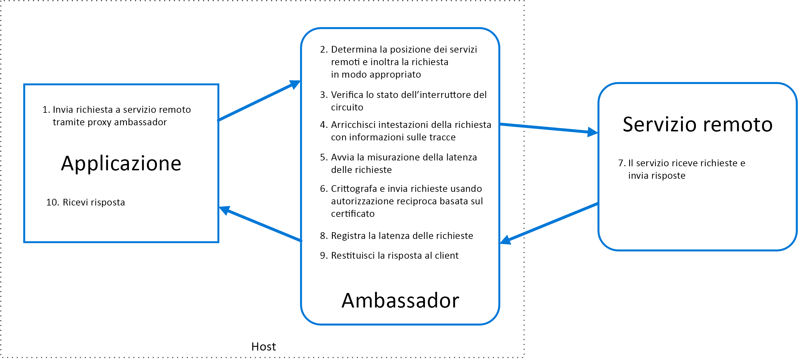

# Modello Ambassador

Creare servizi helper che inviano richieste di rete per conto di un servizio consumer o di un'applicazione. Si può pensare a un servizio ambasciata come un proxy out-of-process che ha un percorso condiviso con il client.

Questo modello può essere utile per eseguire l'offload di attività di connettività client comuni, come il monitoraggio, la registrazione, il routing, la sicurezza (ad esempio il TLS) e i [modelli di resilienza][resiliency-patterns], senza avere a che fare con il linguaggio di programmazione. Viene spesso usato con applicazioni legacy, o altre applicazioni difficili da modificare, per estendere le funzionalità di rete. Con questo modello anche un team specializzato può implementare tali funzionalità.

## Contesto e problema

Per applicazioni basate sul cloud resilienti sono necessarie funzionalità come [interruzione del circuito](./circuit-breaker.md), routing, misurazione e monitoraggio, nonché la possibilità di eseguire aggiornamenti della configurazione correlati alla rete. Potrebbe essere difficile o impossibile aggiornare le applicazioni legacy o librerie di codice esistenti per aggiungere queste funzionalità, poiché il codice non viene più mantenuto o non può essere modificato facilmente dal team di sviluppo.

Le chiamate di rete richiedono anche una configurazione considerevole della connessione, dell'autenticazione e dell'autorizzazione. Queste chiamate, se vengono usate tra più applicazioni create attraverso più linguaggi di scrittura e framework, devono essere configurate per ognuna di queste istanze. Può anche essere necessario che la funzionalità di rete e sicurezza sai gestita da un team centrale all'interno dell'organizzazione. Con una codebase di grandi dimensioni, può essere rischioso che tale team aggiorni un codice applicazione con cui non ha familiarità.

## Soluzione

Inserire i framework client e le librerie in un processo esterno che funge da proxy tra l'applicazione e i servizi esterni. Distribuire il proxy nello stesso ambiente host dell'applicazione per permettere il controllo sul routing, sulla resilienza, sulle funzionalità di sicurezza e per evitare eventuali restrizioni di accesso all'host. È anche possibile usare il modello ad ambasciata per standardizzare ed estendere la strumentazione. Il proxy può monitorare le metriche delle prestazioni, come la latenza o l'utilizzo delle risorse, e tale monitoraggio viene eseguito nello stesso ambiente host dell'applicazione.

Le funzionalità che vengono scaricate sull'Ambassador possono essere gestite in modo indipendente dall'applicazione. È possibile, non solo aggiornare e modificare l'Ambassador senza interferire con le funzionalità legacy dell'applicazione, ma anche che team separati e specializzati implementino e mantengano la sicurezza, la rete e le funzionalità di autenticazione che sono state spostate nell'Ambassador.

I servizi Ambassador possono essere distribuiti come [sidecar](./sidecar.md) per accompagnare il ciclo di vita di un'applicazione o un servizio consumer. In alternativa, se un Ambassador è condiviso da più processi separati in un host comune, può essere distribuito come un daemon o un servizio di Windows. Se il servizio consumer è inserito in contenitori, l'Ambassador dovrebbe essere creato come un contenitore separato nello stesso host, con i collegamenti appropriati configurati per la comunicazione.

## Considerazioni e problemi

- Il proxy aggiunge un sovraccarico di latenza. Valutare se una libreria client, richiamata direttamente dall'applicazione, sia un approccio migliore.
- Valutare l'impatto possibile dell'inclusione di funzionalità generalizzate nel proxy. Ad esempio, l'ambasciata può gestire i tentativi, ma ciò potrebbe essere non sicuro a meno che tutte le operazioni non siano idempotenti.
- Valutare un meccanismo che permetta che parte del contesto di esecuzione passi dal client al proxy e quindi ritorni al client. Per esempio, includere le intestazioni delle richieste HTTP per rifiutare i tentativi o specificare il numero massimo di tentativi.
- Valutare come creare un pacchetto e distribuire il proxy.
- Valutare se usare una istanza singola condivisa per tutti i client o un'istanza per ogni client.

## Quando usare questo modello

Usare questo modello quando:

- È necessario compilare un set comune di funzionalità di connettività client per più linguaggi di programmazione o framework.
- È necessario eseguire l'offload di problemi trasversali di connettività client a sviluppatori di infrastrutture o altri team più specializzati.
- È necessario supportare i requisiti di connettività cloud o cluster in un'applicazione legacy o un'applicazione difficile da modificare.

Questo modello potrebbe non essere adatto nelle situazioni seguenti:

- Quando la latenza della richiesta di rete è di importanza critica. Un proxy introdurrà un determinato sovraccarico, anche se minimo, che in alcuni casi potrebbe influire sull'applicazione.
- Quando le funzionalità di connettività client vengono usate da un solo linguaggio di programmazione. In tal caso, un'opzione migliore potrebbe essere una libreria client che viene distribuita come pacchetto ai team di sviluppo.
- Quando le funzionalità di connettività non possono essere generalizzate e richiedono una maggiore integrazione con l'applicazione client.

## Esempio

Il diagramma seguente illustra la richiesta da parte di un'applicazione a un servizio remoto tramite un proxy ambasciata. L'ambasciata fornisce il routing, l'interruttore e la registrazione. Quest'ultimo chiama il servizio remoto e quindi restituisce la risposta all'applicazione client:

## Informazioni correlate

- [Modello collaterale](./sidecar.md)

<!-- links -->

[resiliency-patterns]: ./category/resiliency.md
