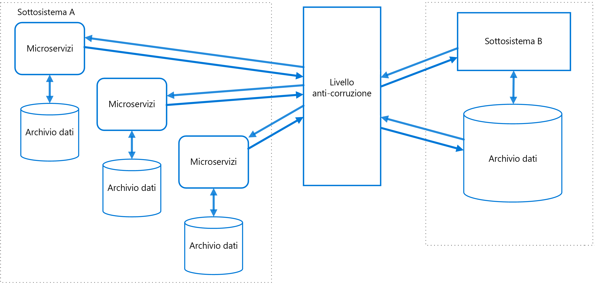

# Modello di livello anti-danneggiamentoAnti-Corruption Layer pattern

Implementare un'interfaccia o un livello adapter tra sottosistemi diversi che non condividono la stessa semantica.Implement a façade or adapter layer between different subsystems that don't share the same semantics. Questo livello traduce le richieste inviate da un sottosistema all'altro.This layer translates requests that one subsystem makes to the other subsystem. Usare questo modello per assicurarsi che la progettazione di un'applicazione non sia limitata a causa di dipendenze da sottosistemi esterni.Use this pattern to ensure that an application's design is not limited by dependencies on outside subsystems. Questo modello è stato descritto per la prima volta da Eric Evans in *Domain-Driven Design*.This pattern was first described by Eric Evans in *Domain-Driven Design*.

## Contesto e problemaContext and problem

La maggior parte delle applicazioni si basa su altri sistemi per alcuni dati o funzionalità.Most applications rely on other systems for some data or functionality. Quando, ad esempio, si esegue la migrazione di un'applicazione legacy a un sistema moderno, potrebbero ancora essere necessarie risorse legacy esistenti.For example, when a legacy application is migrated to a modern system, it may still need existing legacy resources. Le nuove funzionalità devono quindi poter chiamare il sistema legacy.New features must be able to call the legacy system. Ciò vale soprattutto per le migrazioni graduali, in cui le diverse funzionalità di un'applicazione di grandi dimensioni vengono spostate in un sistema moderno nel corso del tempo.This is especially true of gradual migrations, where different features of a larger application are moved to a modern system over time.

Spesso questi sistemi legacy sono soggetti a problemi di qualità causati, ad esempio, da schemi di dati complessa o da API obsolete.Often these legacy systems suffer from quality issues such as convoluted data schemas or obsolete APIs. Le funzionalità e le tecnologie usate nei sistemi legacy possono essere molto diverse rispetto ai sistemi più moderni.The features and technologies used in legacy systems can vary widely from more modern systems. Per interagire con il sistema legacy, è possibile che la nuova applicazione debba supportare infrastruttura, protocolli, modelli di dati e API obsolete o altre funzionalità che diversamente non sarebbero incluse in un'applicazione moderna.To interoperate with the legacy system, the new application may need to support outdated infrastructure, protocols, data models, APIs, or other features that you wouldn't otherwise put into a modern application.

Per garantire l'accesso tra il nuovo sistema e quello legacy, è possibile che il nuovo sistema debba adeguarsi ad almeno alcune API o ad altra semantica del sistema legacy.Maintaining access between new and legacy systems can force the new system to adhere to at least some of the legacy system's APIs or other semantics. Quando queste funzionalità legacy presentano problemi di qualità, supportarle significa danneggiare quella che, diversamente, sarebbe un'applicazione moderna dal design pulito.When these legacy features have quality issues, supporting them "corrupts" what might otherwise be a cleanly designed modern application.

Problemi analoghi possono sorgere con qualsiasi sistema esterno non gestito dal team di sviluppo, non solo con sistemi legacy.Similar issues can arise with any external system that your development team doesn't control, not just legacy systems.

## SoluzioneSolution

Isolare i diversi sottosistemi inserendo tra loro un livello anti-danneggiamento.Isolate the different subsystems by placing an anti-corruption layer between them. Questo livello converte le comunicazioni tra i due sistemi, consentendo a un sistema di rimanere invariato ed evitando di compromettere il design e l'approccio tecnologico dell'altro.This layer translates communications between the two systems, allowing one system to remain unchanged while the other can avoid compromising its design and technological approach.

Il diagramma precedente mostra un'applicazione con due livelli intermedi.The diagram above shows an application with two subsystems. Il sottosistema A chiama il sottosistema B tramite un livello antidanneggiamento.Subsystem A calls to subsystem B through an anti-corruption layer. Per le comunicazioni tra il sottosistema A e il livello antidanneggiamento vengono sempre usati l'architettura e il modello di dati del sottosistema A. Le chiamate dal livello antidanneggiamento al sottosistema B sono conformi al modello di dati o ai metodi di tale sottosistema.Communication between subsystem A and the anti-corruption layer always uses the data model and architecture of subsystem A. Calls from the anti-corruption layer to subsystem B conform to that subsystem's data model or methods. Il livello anti-danneggiamento contiene tutta la logica necessaria per la conversione tra i due sistemi.The anti-corruption layer contains all of the logic necessary to translate between the two systems. È possibile implementare il livello come componente all'interno dell'applicazione o come servizio indipendente.The layer can be implemented as a component within the application or as an independent service.

## Considerazioni e problemiIssues and considerations

- Il livello anti-danneggiamento potrebbe aggiungere latenza alle chiamate effettuate tra i due sistemi.The anti-corruption layer may add latency to calls made between the two systems.
- Il livello anti-danneggiamento aggiunge un altro servizio che deve essere gestito e mantenuto.The anti-corruption layer adds an additional service that must be managed and maintained.
- Valutare la scalabilità del livello anti-danneggiamento.Consider how your anti-corruption layer will scale.
- Valutare se sono necessari più livelli anti-danneggiamento.Consider whether you need more than one anti-corruption layer. Potrebbe essere necessario scomporre la funzionalità in più servizi usando linguaggi o tecnologie diverse oppure potrebbero esserci altri motivi per partizionare il livello di anti-danneggiamento.You may want to decompose functionality into multiple services using different technologies or languages, or there may be other reasons to partition the anti-corruption layer.
- Valutare il modo in cui il livello anti-danneggiamento verrà gestito in relazione ad altre applicazioni o altri servizi usati.Consider how the anti-corruption layer will be managed in relation with your other applications or services. Chiedersi in che modo verrà integrato nei processi esistenti di monitoraggio, rilascio e configurazione.How will it be integrated into your monitoring, release, and configuration processes?
- Assicurarsi che la coerenza dei dati e delle transazioni venga mantenuta e possa essere monitorata.Make sure transaction and data consistency are maintained and can be monitored.
- Valutare se il livello antidanneggiamento debba gestire tutte le comunicazioni tra sottosistemi diversi o solo un subset di funzionalità.Consider whether the anti-corruption layer needs to handle all communication between different subsystems, or just a subset of features.
- Valutare se il livello antidanneggiamento debba far parte di una strategia di migrazione delle applicazioni, se sarà permanente o se verrà ritirato una volta conclusa la migrazione di tutte le funzionalità legacy.If the anti-corruption layer is part of an application migration strategy, consider whether it will be permanent, or will be retired after all legacy functionality has been migrated.

## Quando usare questo modelloWhen to use this pattern

Usare questo modello quando:Use this pattern when:

- È stata pianificata una migrazione in più fasi, ma è necessario mantenere l'integrazione tra il sistema legacy e quello nuovo.A migration is planned to happen over multiple stages, but integration between new and legacy systems needs to be maintained.
- Due o più sottosistemi hanno semantiche diverse, ma devono comunque comunicare.Two or more subsystems have different semantics, but still need to communicate.

Questo modello potrebbe non essere appropriato se le differenze di semantica tra il sistema legacy e quello nuovo sono significative.This pattern may not be suitable if there are no significant semantic differences between new and legacy systems.

## Informazioni correlateRelated guidance

- [Modello di sostituzioneStrangler pattern](./strangler.md)
