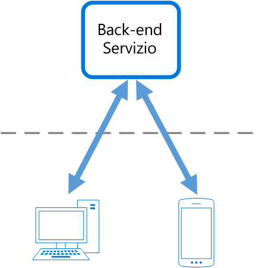

# Modello back-end per front-end

Creare servizi back-end separati che vengono utilizzati da interfacce o applicazioni front-end specifiche. Questo modello è utile quando si vuole evitare di personalizzare un singolo back-end per più interfacce. Il modello è stato descritto per la prima volta da Sam Newman.

## Contesto e problema

Un'applicazione può essere destinata inizialmente un'interfaccia utente Web desktop. In genere, viene sviluppato in parallelo un servizio back-end che fornisce le funzionalità necessarie per tale interfaccia utente. Con l'aumentare della base utenti dell'applicazione, viene sviluppata un'applicazione per dispositivi mobili che deve interagire con lo stesso back-end. Il servizio back-end diventa un back-end generico, che soddisfa i requisiti di entrambe le interfacce, desktop e per dispositivi mobili.

Ma le funzionalità di un dispositivo mobile sono notevolmente diverse da quelle di browser desktop, in termini di dimensioni dello schermo, prestazioni e limitazioni di visualizzazione. Di conseguenza, i requisiti per un back-end dell'applicazione per dispositivi mobili sono diversi rispetto a quelli dell'interfaccia utente Web desktop. 

Queste differenze determinano la necessità di definire requisiti diversi per il back-end. Il back-end richiede modifiche regolari e significative, valide sia per l'interfaccia utente Web desktop che per l'applicazione per dispositivi mobili. Spesso, i team che si occupano delle interfacce lavorano sui singoli front-end, di conseguenza il back-end diventa un collo di bottiglia nel processo di sviluppo. I diversi requisiti per gli aggiornamenti e la necessità di garantire l'operatività del servizio per entrambi i front-end possono comportare un notevole dispendio di energie su un'unica risorsa distribuibile.

 

Dal momento che l'attività di sviluppo è incentrata sul servizio back-end, è possibile creare un apposito team dedicato alla gestione e alla manutenzione del back-end. Questo causa uno scollamento tra gli team di sviluppo dell'interfaccia utente e del back-end, con quest'ultimo che deve provare a bilanciare i requisiti dei diversi team di sviluppo dell'interfaccia utente. Quando un team di sviluppo dell'interfaccia utente richiede modifiche al back-end, tali modifiche devono essere convalidate con gli altri team di sviluppo dell'interfaccia utente prima di poterle integrare nel back-end. 

## Soluzione

Creare un solo back-end per ogni interfaccia utente. Ottimizzare il comportamento e le prestazioni di ogni back-end per rispondere meglio alle esigenze dell'ambiente front-end, senza preoccuparsi dell'impatto su altre esperienze front-end.

 

Dal momento che ogni back-end è specifico di una sola interfaccia, può essere ottimizzato per tale interfaccia. Di conseguenza, sarà più piccolo, meno complesso e probabilmente più veloce rispetto a un back-end generico che prova a soddisfare i requisiti di tutte le interfacce. Ogni team di sviluppo dell'interfaccia può controllare autonomamente il proprio back-end e non si basa su un team centralizzato di sviluppo del back-end. Il team di sviluppo dell'interfaccia utente può quindi scegliere in modo flessibile il linguaggio, la frequenza di rilascio, l'assegnazione delle priorità del carico di lavoro e l'integrazione delle funzionalità nel back-end.

Per altre informazioni, vedere [Pattern: Backends For Frontends](http://samnewman.io/patterns/architectural/bff/) (Modello: back-end per front-end).

## Considerazioni e problemi

- Calcolare il numero di back-end da distribuire.
- Se le stesse richieste verranno effettuate da interfacce diverse, ad esempio client per dispositivi mobili, valutare se è necessario implementare un back-end per ogni interfaccia o se è sufficiente un unico back-end.
- L'implementazione di questo modello implica molto spesso la duplicazione del codice tra i servizi.
- I servizi back-end incentrati sul front-end devono contenere solo la logica e i comportamenti specifici dei client. La logica di business generale e altre funzionalità globali devono essere gestite in altri punti dell'applicazione.
- Provare a immaginare l'impatto di questo modello sulle responsabilità di un team di sviluppo.
- Valutare il tempo necessario per implementare questo modello. Chiedersi se la creazione dei nuovi back-end implicherà problemi di ordine tecnico mentre si continua a supportare il back-end generico esistente.

## Quando usare questo modello

Usare questo modello quando:

- È necessario gestire un servizio back-end generico o condiviso con un sovraccarico significativo sullo sviluppo.
- Si vuole ottimizzare il back-end per i requisiti di interfacce client specifiche.
- Le personalizzazioni vengono apportate su un back-end generico per gestire più interfacce.
- È preferibile usare un linguaggio alternativo per il back-end di un'interfaccia utente diversa.

Questo modello potrebbe non essere adatto:

- Quando le interfacce effettuano richieste identiche o simili al back-end.
- Quando per interagire con il back-end si usa una sola interfaccia.

## Informazioni correlate

- [Modello di aggregazione gateway](./gateway-aggregation.md)
- [Modello di offload gateway](./gateway-offloading.md)
- [Modello di routing gateway](./gateway-routing.md)

