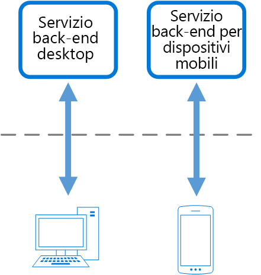

# Modello back-end per front-endBackends for Frontends pattern

Creare servizi back-end separati che vengono utilizzati da interfacce o applicazioni front-end specifiche.Create separate backend services to be consumed by specific frontend applications or interfaces. Questo modello è utile quando si vuole evitare di personalizzare un singolo back-end per più interfacce.This pattern is useful when you want to avoid customizing a single backend for multiple interfaces.

## Contesto e problemaContext and problem

Un'applicazione può essere destinata inizialmente un'interfaccia utente Web desktop.An application may initially be targeted at a desktop web UI. In genere, viene sviluppato in parallelo un servizio back-end che fornisce le funzionalità necessarie per tale interfaccia utente.Typically, a backend service is developed in parallel that provides the features needed for that UI. Con l'aumentare della base utenti dell'applicazione, viene sviluppata un'applicazione per dispositivi mobili che deve interagire con lo stesso back-end.As the application's user base grows, a mobile application is developed that must interact with the same backend. Il servizio back-end diventa un back-end generico, che soddisfa i requisiti di entrambe le interfacce, desktop e per dispositivi mobili.The backend service becomes a general-purpose backend, serving the requirements of both the desktop and mobile interfaces.

Ma le funzionalità di un dispositivo mobile sono notevolmente diverse da quelle di browser desktop, in termini di dimensioni dello schermo, prestazioni e limitazioni di visualizzazione.But the capabilities of a mobile device differ significantly from a desktop browser, in terms screen size, performance, and display limitations. Di conseguenza, i requisiti per un back-end dell'applicazione per dispositivi mobili sono diversi rispetto a quelli dell'interfaccia utente Web desktop.As a result, the requirements for a mobile application backend differ from the desktop web UI. 

Queste differenze determinano la necessità di definire requisiti diversi per il back-end.These differences result in competing requirements for the backend. Il back-end richiede modifiche regolari e significative, valide sia per l'interfaccia utente Web desktop che per l'applicazione per dispositivi mobili.The backend requires regular and significant changes to serve both the desktop web UI and the mobile application. Spesso, i team che si occupano delle interfacce lavorano sui singoli front-end, di conseguenza il back-end diventa un collo di bottiglia nel processo di sviluppo.Often, separate interface teams work on each frontend, causing the backend to become a bottleneck in the development process. I diversi requisiti per gli aggiornamenti e la necessità di garantire l'operatività del servizio per entrambi i front-end possono comportare un notevole dispendio di energie su un'unica risorsa distribuibile.Conflicting update requirements, and the need to keep the service working for both frontends, can result in spending a lot of effort on a single deployable resource.

 

Dal momento che l'attività di sviluppo è incentrata sul servizio back-end, è possibile creare un apposito team dedicato alla gestione e alla manutenzione del back-end.As the development activity focuses on the backend service, a separate team may be created to manage and maintain the backend. Questo causa uno scollamento tra gli team di sviluppo dell'interfaccia utente e del back-end, con quest'ultimo che deve provare a bilanciare i requisiti dei diversi team di sviluppo dell'interfaccia utente.Ultimately, this results in a disconnect between the interface and backend development teams, placing a burden on the backend team to balance the competing requirements of the different UI teams. Quando un team di sviluppo dell'interfaccia utente richiede modifiche al back-end, tali modifiche devono essere convalidate con gli altri team di sviluppo dell'interfaccia utente prima di poterle integrare nel back-end.When one interface team requires changes to the backend, those changes must be validated with other interface teams before they can be integrated into the backend. 

## SoluzioneSolution

Creare un solo back-end per ogni interfaccia utente.Create one backend per user interface. Ottimizzare il comportamento e le prestazioni di ogni back-end per rispondere meglio alle esigenze dell'ambiente front-end, senza preoccuparsi dell'impatto su altre esperienze front-end.Fine tune the behavior and performance of each backend to best match the needs of the frontend environment, without worrying about affecting other frontend experiences.

 

Dal momento che ogni back-end è specifico di una sola interfaccia, può essere ottimizzato per tale interfaccia.Because each backend is specific to one interface, it can be optimized for that interface. Di conseguenza, sarà più piccolo, meno complesso e probabilmente più veloce rispetto a un back-end generico che prova a soddisfare i requisiti di tutte le interfacce.As a result, it will be smaller, less complex, and likely faster than a generic backend that tries to satisfy the requirements for all interfaces. Ogni team di sviluppo dell'interfaccia può controllare autonomamente il proprio back-end e non si basa su un team centralizzato di sviluppo del back-end.Each interface team has autonomy to control their own backend and doesn't rely on a centralized backend development team. Il team di sviluppo dell'interfaccia utente può quindi scegliere in modo flessibile il linguaggio, la frequenza di rilascio, l'assegnazione delle priorità del carico di lavoro e l'integrazione delle funzionalità nel back-end.This gives the interface team flexibility in language selection, release cadence, prioritization of workload, and feature integration in their backend.

## Considerazioni e problemiIssues and considerations

- Calcolare il numero di back-end da distribuire.Consider how many backends to deploy.
- Se le stesse richieste verranno effettuate da interfacce diverse, ad esempio client per dispositivi mobili, valutare se è necessario implementare un back-end per ogni interfaccia o se è sufficiente un unico back-end.If different interfaces (such as mobile clients) will make the same requests, consider whether it is necessary to implement a backend for each interface, or if a single backend will suffice.
- L'implementazione di questo modello implica molto spesso la duplicazione del codice tra i servizi.Code duplication across services is highly likely when implementing this pattern.
- I servizi back-end incentrati sul front-end devono contenere solo la logica e i comportamenti specifici dei client.Frontend-focused backend services should only contain client-specific logic and behavior. La logica di business generale e altre funzionalità globali devono essere gestite in altri punti dell'applicazione.General business logic and other global features should be managed elsewhere in your application.
- Provare a immaginare l'impatto di questo modello sulle responsabilità di un team di sviluppo.Think about how this pattern might be reflected in the responsibilities of a development team.
- Valutare il tempo necessario per implementare questo modello.Consider how long it will take to implement this pattern. Chiedersi se la creazione dei nuovi back-end implicherà problemi di ordine tecnico mentre si continua a supportare il back-end generico esistente.Will the effort of building the new backends incur technical debt, while you continue to support the existing generic backend?

## Quando usare questo modelloWhen to use this pattern

Usare questo modello quando:Use this pattern when:

- È necessario gestire un servizio back-end generico o condiviso con un sovraccarico significativo sullo sviluppo.A shared or general purpose backend service must be maintained with significant development overhead.
- Si vuole ottimizzare il back-end per i requisiti di interfacce client specifiche.You want to optimize the backend for the requirements of specific client interfaces.
- Le personalizzazioni vengono apportate su un back-end generico per gestire più interfacce.Customizations are made to a general-purpose backend to accommodate multiple interfaces.
- È preferibile usare un linguaggio alternativo per il back-end di un'interfaccia utente diversa.An alternative language is better suited for the backend of a different user interface.

Questo modello potrebbe non essere adatto:This pattern may not be suitable:

- Quando le interfacce effettuano richieste identiche o simili al back-end.When interfaces make the same or similar requests to the backend.
- Quando per interagire con il back-end si usa una sola interfaccia.When only one interface is used to interact with the backend.

## Informazioni correlateRelated guidance

- [Modello di aggregazione gatewayGateway Aggregation pattern](./gateway-aggregation.md)
- [Modello di offload gatewayGateway Offloading pattern](./gateway-offloading.md)
- [Modello di routing gatewayGateway Routing pattern](./gateway-routing.md)

