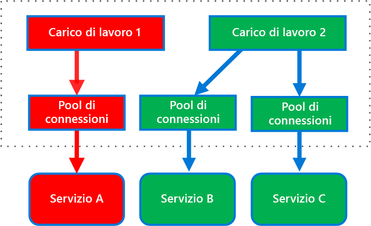
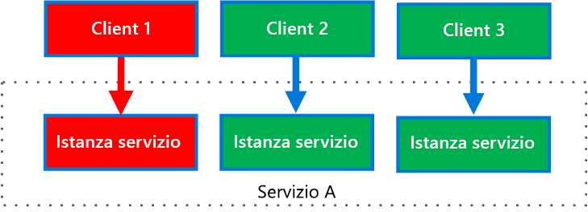

# <a name="bulkhead-pattern"></a>Modello A scomparti

Isolare gli elementi di un'applicazione in pool in modo che un eventuale problema in uno dei componenti non blocchi il funzionamento degli altri componenti.

Questo modello è denominato *A scomparti* perché ricorda le aree divise da porte tagliafuoco nello scafo di una nave. Se lo scafo subisce un danno, si riempie d'acqua solo la sezione danneggiata, impedendo quindi che l'intera nave affondi. 

## <a name="context-and-problem"></a>Contesto e problema

Un'applicazione basata su cloud può includere più servizi, e ogni servizio può essere usato da uno o più consumer. Un carico eccessivo o un errore in un servizio interesserà tutti i consumer del servizio.

Inoltre, un consumer può inviare richieste a più servizi contemporaneamente, impiegando delle risorse per ogni richiesta. Quando il consumer invia una richiesta a un servizio che non è configurato correttamente o non risponde, le risorse usate dalla richiesta del client potrebbero non essere liberate in modo tempestivo. Se le richieste inviate al servizio continuano, le risorse possono esaurirsi. Può ad esempio esaurirsi il pool di connessione del client, con un conseguente impatto sulle richieste di altri servizi da parte del consumer. Alla fine, il consumer non sarà più in grado di inviare richieste neanche agli altri servizi, non solo al servizio che per primo non ha risposto.

Lo stesso problema di esaurimento delle risorse può interessare servizi con più consumer. Un numero elevato di richieste provenienti da un client può esaurire le risorse disponibili del servizio. Altri consumer non saranno più in grado di usare il servizio, innescando errori a catena.

## <a name="solution"></a>Soluzione

Suddividere le istanze del servizio in diversi gruppi, in base ai requisiti di carico e disponibilità dei consumer. Questo schema progettuale agevola l'isolamento degli errori e consente di mantenere le funzionalità del servizio per alcuni consumer anche in caso di errore.

Un consumer può anche partizionare le risorse, per assicurare che le risorse usate per chiamare un servizio non incidano su quelle usate per chiamare un altro servizio. Ad esempio, a un consumer che chiama più servizi è possibile assegnare un pool di connessioni per ogni servizio. L'eventuale errore registrato in un servizio incide solo sul pool di connessioni assegnato a quel servizio, e il consumer può continuare a usare altri servizi.

Questo schema mostra i vantaggi seguenti:

- Consente di isolare consumer e servizi evitando errori a catena. Un problema che interessa un consumer o un servizio può restare isolato nel proprio scomparto, evitando che il problema si ripercuota sull'intera soluzione.
- Consente di mantenere alcune funzionalità in caso di errore di un servizio. Altri servizi e funzionalità dell'applicazione continueranno a funzionare.
- Consente di distribuire servizi che offrono una diversa qualità del servizio per applicazioni più esigenti. È possibile configurare un pool di consumer ad alta priorità che usa servizi ad alta priorità. 

Il diagramma seguente mostra scomparti strutturati in pool di connessioni che chiamano singoli servizi. Se nel Servizio A si verifica un errore o un altro problema, il pool di connessioni è isolato, e l'errore o il problema interesserà soli i carichi di lavoro che usano il pool di thread assegnato al Servizio A. I carichi di lavoro che usano i Servizi B e C non sono interessati e possono continuare a lavorare senza interruzioni.

 

Il diagramma seguente mostra più client che chiamano un singolo servizio. Ad ogni client viene assegnata un'istanza del servizio distinta. Il Client 1 ha inviato un numero eccessivo di richieste, con conseguente sovraccarico sulla relativa istanza. Poiché ogni istanza del servizio è isolata dalle altre, gli altri client possono continuare a effettuare chiamate.


     
## <a name="issues-and-considerations"></a>Considerazioni e problemi

- Definire le partizioni in funzione dei requisiti aziendali e tecnici dell'applicazione.
- Quando si suddividono in scomparti i servizi o i consumer, è consigliabile considerare il livello di isolamento offerto dalla tecnologia in uso, nonché il sovraccarico in termini di costo, prestazioni e gestibilità.
- Considerare la combinazione del modello A scomparti con i modelli Nuovo tentativo, Interruttore e Limitazione per offrire una gestione degli errori più complessa.
- Quando si suddividono i consumer in scomparti, valutare l'uso di processi, pool di thread e semafori. Progetti come [Netflix Hystrix][hystrix] e [Polly][polly] offrono un framework per la creazione di scomparti per consumer.
- Quando si suddividono i servizi in scomparti, valutarne la distribuzione in macchine virtuali, contenitori o processi distinti. I contenitori offrono un buon bilanciamento dell'isolamento delle risorse con un sovraccarico non significativo.
- I servizi che comunicano tramite messaggi asincroni possono essere isolati usando diversi set di code. Ogni coda può disporre di un set dedicato di istanze che elabora i messaggi nella coda o di un singolo gruppo di istanze che usa un algoritmo per rimuovere la coda ed elaborare gli invii.
- Determinare il livello di granularità degli scomparti. Se, ad esempio, si distribuiscono i tenant tra partizioni, è possibile posizionare ogni tenant in una partizione distinta o posizionare diversi tenant in una sola partizione.
- Monitorare le prestazioni e il contratto di servizio di ogni partizione.

## <a name="when-to-use-this-pattern"></a>Quando usare questo modello

Usare questo modello per:

- Isolare le risorse necessarie per l'utilizzo di un set di servizi back-end, soprattutto se l'applicazione può offrire un certo livello di funzionalità anche quando uno dei servizi non risponde.
- Isolare i consumer critici da quelli standard.
- Proteggere l'applicazione dagli errori a catena.

Questo modello potrebbe non essere adatto nelle situazioni seguenti:

- Un uso meno efficiente delle risorse non è accettabile nel progetto.
- La complessità aggiuntiva non è necessaria.

## <a name="example"></a>Esempio

Il file di configurazione Kubernetes seguente crea un contenitore isolato per l'esecuzione di un singolo servizio, con limiti e risorse di CPU e memoria propri.

```yml
apiVersion: v1
kind: Pod
metadata:
  name: drone-management
spec:
  containers:
  - name: drone-management-container
    image: drone-service
    resources:
      requests:
        memory: "64Mi"
        cpu: "250m"
      limits:
        memory: "128Mi"
        cpu: "1"
```

## <a name="related-guidance"></a>Informazioni correlate

- [Modello Interruttore](./circuit-breaker.md)
- [Progettazione di applicazioni resilienti per Azure](../resiliency/index.md)
- [Modello Nuovo tentativo](./retry.md)
- [Modello Limitazione](./throttling.md)


<!-- links -->

[hystrix]: https://github.com/Netflix/Hystrix
[polly]: https://github.com/App-vNext/Polly