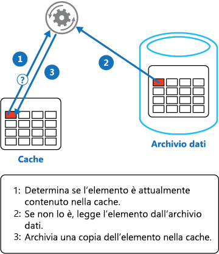

# <a name="cache-aside-pattern"></a>Modello cache-aside

[!INCLUDE [header](../_includes/header.md)]

Con questo modello i dati vengono caricati su richiesta in una cache da un archivio dati. In questo modo è possibile migliorare le prestazioni, nonché garantire la coerenza tra i dati memorizzati nella cache e quelli presenti nell'archivio dati sottostante.

## <a name="context-and-problem"></a>Contesto e problema

Le applicazioni usano una cache per migliorare l'accesso ripetuto alle informazioni presenti in un archivio dati. Non è però pensabile che i dati memorizzati nella cache siano sempre completamente coerenti con i dati presenti nell'archivio dati. Le applicazioni devono implementare una strategia in grado di garantire che i dati nella cache siano il più possibile aggiornati, ma anche di rilevare e gestire le situazioni che si verificano quando i dati nella cache diventano obsoleti.

## <a name="solution"></a>Soluzione

Molti sistemi di memorizzazione nella cache disponibili in commercio offrono operazioni di read-through e write-through/write-behind. In questi sistemi un'applicazione fa riferimento alla cache per recuperare i dati. Se non sono presenti nella cache, i dati vengono recuperati dall'archivio dati e aggiunti alla cache. Tutte le modifiche apportate ai dati memorizzati nella cache vengono scritte automaticamente anche nell'archivio dati.

Per le cache che non offrono questa funzionalità, la conservazione dei dati viene gestita dalle applicazioni che usano la cache.

Un'applicazione può emulare la funzionalità di memorizzazione nella cache di read-through implementando la strategia di cache-aside. Con questa strategia i dati vengono caricati nella cache su richiesta. La figura illustra l'uso del modello cache-aside per l'archiviazione dei dati nella cache.




Un'applicazione che aggiorna le informazioni può seguire la strategia di write-through in modo da apportare la modifica all'archivio dati e invalidare l'elemento corrispondente nella cache.

Quando l'elemento viene richiesto successivamente, con la strategia di cache-aside i dati aggiornati verranno recuperati dall'archivio dei dati e aggiunti nuovamente nella cache.

## <a name="issues-and-considerations"></a>Considerazioni e problemi

Prima di decidere come implementare questo modello, considerare quanto segue: 

**Durata dei dati memorizzati nella cache**. Molte cache implementano un criterio di scadenza che invalida i dati e li rimuove dalla cache se non vengono usati per un periodo specificato. Per rendere effettiva la strategia di cache-aside, assicurarsi che i criteri di scadenza corrispondano al criterio di accesso per le applicazioni che usano i dati. Non impostare un periodo di scadenza troppo breve per evitare che le applicazioni recuperino continuamente i dati dall'archivio dati e li aggiungano alla cache. Analogamente, non impostare un periodo di scadenza troppo lungo per evitare che i dati memorizzati nella cache diventino obsoleti. Tenere presente che la memorizzazione nella cache è più efficace per i dati relativamente statici o per dati letti frequentemente.

**Rimozione dei dati**. Le dimensioni della maggior parte delle cache è limitata rispetto all'archivio dati da cui provengono i dati, di conseguenza, se necessario i dati verranno rimossi. Per selezionare gli elementi da rimuovere, la maggior parte delle cache adotta il criterio di minor utilizzo in un determinato periodo, ma è possibile scegliere un criterio personalizzato. Configurare la proprietà di scadenza globale e altre proprietà della cache, nonché la proprietà di scadenza di ogni elemento memorizzato nella cache, per garantire che la cache sia economicamente conveniente. Non è sempre opportuno applicare criteri di rimozione globale a ogni elemento della cache. Se, ad esempio, recuperare dall'archivio dati un elemento memorizzato nella cache è molto oneroso, può essere utile mantenere questo elemento nella cache a scapito di elementi usati più spesso, ma meno onerosi.

**Inizializzazione della cache**. In molte soluzioni la cache viene prepopolata con i dati che saranno probabilmente necessari durante il processo di avvio di un'applicazione. Il modello cache-aside può risultare comunque utile se alcuni di questi dati scadono o sono stati rimossi.

**Coerenza**. L'implementazione del modello cache-aside non garantisce la coerenza tra l'archivio dati e la cache. Un processo esterno può modificare in qualsiasi momento un elemento nell'archivio dati e questa modifica potrebbe non essere presente nella cache fino al successivo caricamento dell'elemento. In un sistema che replica i dati tra archivi dati, questo problema può diventare grave se la sincronizzazione viene eseguita frequentemente.

**Memorizzazione nella cache locale (in memoria)**. Una cache può essere locale per un'istanza dell'applicazione ed essere archiviata in memoria. Il modello cache-aside può essere utile in questo ambiente se un'applicazione accede ripetutamente agli stessi dati. Una cache locale è però privata, di conseguenza istanze diverse dell'applicazione potrebbero contenere una copia degli stessi dati memorizzati nella cache. Tali dati potrebbero diventare rapidamente incoerenti tra le cache, di conseguenza potrebbe essere necessario far scadere i dati contenuti in una cache privata e aggiornarli più frequentemente. In questi scenari provare ad analizzare l'uso di un meccanismo di memorizzazione nella cache condivisa o distribuita.

## <a name="when-to-use-this-pattern"></a>Quando usare questo modello

Usare questo modello quando:

- Una cache non offre operazioni native di read-through e write-through.
- La richiesta di risorse è imprevedibile. Questo modello consente alle applicazioni di caricare dati su richiesta. Non è in grado di stabilire in anticipo i dati che verranno richiesti da un'applicazione.

Questo modello potrebbe non essere adatto:

- Quando il set di dati memorizzati nella cache è statico. Se lo spazio disponibile della cache è sufficiente per i dati, inizializzare la cache con i dati all'avvio e applicare un criterio che impedisca la scadenza dei dati.
- Per la memorizzazione nella cache delle informazioni sullo stato della sessione in un'applicazione Web ospitata in una Web farm. In questo ambiente è consigliabile evitare di introdurre dipendenze basate sull'affinità client-server.

## <a name="example"></a>Esempio

In Microsoft Azure è possibile usare Cache Redis di Azure per creare una cache distribuita condivisibile da più istanze di un'applicazione. 

Per connettersi a un'istanza di Cache Redis di Azure, chiamare il metodo statico `Connect` e passare la stringa di connessione. Il metodo restituisce un elemento `ConnectionMultiplexer` che rappresenta la connessione. Un approccio per la condivisione di un'istanza di `ConnectionMultiplexer` nell'applicazione prevede una proprietà statica che restituisce un'istanza connessa, simile a quanto illustrato nell'esempio seguente. Questo approccio costituisce un modo thread-safe per inizializzare solo una singola istanza connessa.

```csharp
private static ConnectionMultiplexer Connection;

// Redis Connection string info
private static Lazy<ConnectionMultiplexer> lazyConnection = new Lazy<ConnectionMultiplexer>(() =>
{
    string cacheConnection = ConfigurationManager.AppSettings["CacheConnection"].ToString();
    return ConnectionMultiplexer.Connect(cacheConnection);
});

public static ConnectionMultiplexer Connection => lazyConnection.Value;
```

Il metodo `GetMyEntityAsync` nell'esempio di codice seguente illustra un'implementazione del modello Cache-aside basato su Cache Redis di Azure. Questo metodo recupera un oggetto dalla cache usando l'approccio read-through.

Per l'identificazione di un oggetto viene usato come chiave un ID di tipo Integer. Il metodo `GetMyEntityAsync` prova a recuperare un elemento dalla cache usando questa chiave. Se trovato, l'eventuale elemento corrispondente viene restituito. Se la cache non contiene alcun elemento corrispondente, il metodo `GetMyEntityAsync` recupera l'oggetto da un archivio dati, lo aggiunge alla cache e quindi lo restituisce. L'esempio non include il codice che legge effettivamente i dati dall'archivio dati, perché tale codice dipende dall'archivio dati. Tenere presente che l'elemento memorizzato nella cache è configurato per la scadenza per impedire che diventi obsoleto se viene aggiornato in un'altra posizione.


```csharp
// Set five minute expiration as a default
private const double DefaultExpirationTimeInMinutes = 5.0;

public async Task<MyEntity> GetMyEntityAsync(int id)
{
  // Define a unique key for this method and its parameters.
  var key = $"MyEntity:{id}";
  var cache = Connection.GetDatabase();
  
  // Try to get the entity from the cache.
  var json = await cache.StringGetAsync(key).ConfigureAwait(false);
  var value = string.IsNullOrWhiteSpace(json) 
                ? default(MyEntity) 
                : JsonConvert.DeserializeObject<MyEntity>(json);
  
  if (value == null) // Cache miss
  {
    // If there's a cache miss, get the entity from the original store and cache it.
    // Code has been omitted because it's data store dependent.  
    value = ...;

    // Avoid caching a null value.
    if (value != null)
    {
      // Put the item in the cache with a custom expiration time that 
      // depends on how critical it is to have stale data.
      await cache.StringSetAsync(key, JsonConvert.SerializeObject(value)).ConfigureAwait(false);
      await cache.KeyExpireAsync(key, TimeSpan.FromMinutes(DefaultExpirationTimeInMinutes)).ConfigureAwait(false);
    }
  }

  return value;
}
```

>  Negli esempi viene usata l'API di Cache Redis di Azure per accedere all'archivio e recuperare le informazioni dalla cache. Per altre informazioni, vedere [Come usare Cache Redis di Azure](https://docs.microsoft.com/azure/redis-cache/cache-dotnet-how-to-use-azure-redis-cache) e [Come creare un'app Web con la cache Redis](https://docs.microsoft.com/azure/redis-cache/cache-web-app-howto).

Il metodo `UpdateEntityAsync` illustrato di seguito spiega come invalidare un oggetto nella cache quando il valore viene modificato dall'applicazione. Il codice aggiorna l'archivio dati originale e quindi rimuove dalla cache l'elemento memorizzato nella cache.

```csharp
public async Task UpdateEntityAsync(MyEntity entity)
{
    // Update the object in the original data store.
    await this.store.UpdateEntityAsync(entity).ConfigureAwait(false); 

    // Invalidate the current cache object.
    var cache = Connection.GetDatabase();
    var id = entity.Id;
    var key = $"MyEntity:{id}"; // The key for the cached object.
    await cache.KeyDeleteAsync(key).ConfigureAwait(false); // Delete this key from the cache.
}
```

> [!NOTE]
> L'ordine dei passaggi è importante. Aggiornare l'archivio dati *prima* di rimuovere l'elemento dalla cache. Se si rimuove prima l'elemento memorizzato nella cache, per un breve arco di tempo un client potrebbe recuperare l'elemento prima che l'archivio dati venga aggiornato. Questo comporterà una perdita di dati nella cache (dal momento che l'elemento è stato rimosso dalla cache), di conseguenza l'elemento recuperato dall'archivio dati e aggiunto di nuovo nella cache sarà di una versione precedente e i dati memorizzati nella cache saranno obsoleti.


## <a name="related-guidance"></a>Informazioni correlate 

Per l'implementazione di questo modello possono risultare utili anche le informazioni seguenti:

- [Informazioni aggiuntive sulla memorizzazione nella cache](https://docs.microsoft.com/azure/architecture/best-practices/caching). Include maggiori informazioni su come memorizzare nella cache i dati in una soluzione cloud ed esamina gli aspetti da considerare quando si implementa una cache.

- [Nozioni di base sulla coerenza dei dati](https://msdn.microsoft.com/library/dn589800.aspx). Le applicazioni cloud usano in genere dati che vengono distribuiti in archivi dati. La gestione e il mantenimento della coerenza dei dati in questo ambiente rappresenta un aspetto critico del sistema, in particolare in relazione ai problemi di concorrenza e disponibilità che possono verificarsi. Questo documento illustra i problemi relativi alla coerenza tra dati distribuiti e spiega in che modo un'applicazione può implementare controlli di coerenza per garantire la disponibilità dei dati.
