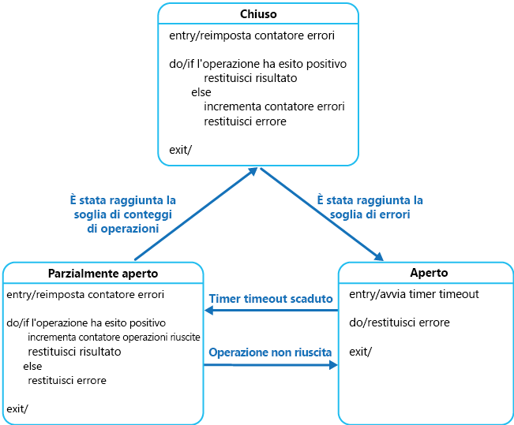

# <a name="circuit-breaker-pattern"></a><span data-ttu-id="0a8f8-104">Modello a interruttore</span><span class="sxs-lookup"><span data-stu-id="0a8f8-104">Circuit Breaker pattern</span></span>

<span data-ttu-id="0a8f8-105">Gestire gli errori il cui ripristino potrebbe richiedere una quantità variabile di tempo in fase di connessione a una risorsa o a un servizio remoto.</span><span class="sxs-lookup"><span data-stu-id="0a8f8-105">Handle faults that might take a variable amount of time to recover from, when connecting to a remote service or resource.</span></span> <span data-ttu-id="0a8f8-106">Questo può migliorare la stabilità e la resilienza di un'applicazione.</span><span class="sxs-lookup"><span data-stu-id="0a8f8-106">This can improve the stability and resiliency of an application.</span></span>

## <a name="context-and-problem"></a><span data-ttu-id="0a8f8-107">Contesto e problema</span><span class="sxs-lookup"><span data-stu-id="0a8f8-107">Context and problem</span></span>

<span data-ttu-id="0a8f8-108">In un ambiente distribuito le chiamate alle risorse remote e ai servizi possono non riuscire a causa di errori temporanei, ad esempio connessioni di rete lente, timeout oppure indisponibilità o overcommit delle risorse.</span><span class="sxs-lookup"><span data-stu-id="0a8f8-108">In a distributed environment, calls to remote resources and services can fail due to transient faults, such as slow network connections, timeouts, or the resources being overcommitted or temporarily unavailable.</span></span> <span data-ttu-id="0a8f8-109">Questi errori in genere si risolvono autonomamente dopo un breve periodo di tempo. Un'applicazione cloud affidabile deve essere preparata per gestirli tramite una strategia, ad esempio un [modello di ripetizione dei tentativi](./retry.md).</span><span class="sxs-lookup"><span data-stu-id="0a8f8-109">These faults typically correct themselves after a short period of time, and a robust cloud application should be prepared to handle them by using a strategy such as the [Retry pattern](./retry.md).</span></span>

<span data-ttu-id="0a8f8-110">Tuttavia, possono anche verificarsi situazioni in cui gli errori sono causati da eventi imprevisti, per cui la risoluzione potrebbe richiedere molto più tempo.</span><span class="sxs-lookup"><span data-stu-id="0a8f8-110">However, there can also be situations where faults are due to unanticipated events, and that might take much longer to fix.</span></span> <span data-ttu-id="0a8f8-111">Questi errori possono variare, in base alla gravità, dalla perdita parziale della connettività alla totale interruzione di un servizio.</span><span class="sxs-lookup"><span data-stu-id="0a8f8-111">These faults can range in severity from a partial loss of connectivity to the complete failure of a service.</span></span> <span data-ttu-id="0a8f8-112">In queste situazioni potrebbe essere inutile ripetere continuamente un'operazione che ha scarse possibilità di successo, mentre invece è importante che l'applicazione accetti rapidamente l'esito negativo dell'operazione e gestisca il problema in modo appropriato.</span><span class="sxs-lookup"><span data-stu-id="0a8f8-112">In these situations it might be pointless for an application to continually retry an operation that is unlikely to succeed, and instead the application should quickly accept that the operation has failed and handle this failure accordingly.</span></span>

<span data-ttu-id="0a8f8-113">Se un servizio è molto occupato, è inoltre possibile che un errore in una parte del sistema generi errori a cascata.</span><span class="sxs-lookup"><span data-stu-id="0a8f8-113">Additionally, if a service is very busy, failure in one part of the system might lead to cascading failures.</span></span> <span data-ttu-id="0a8f8-114">Un'operazione che richiama un servizio potrebbe, ad esempio, essere configurata per l'implementazione di un timeout e restituire quindi un messaggio di errore se il servizio non risponde entro l'intervallo specificato.</span><span class="sxs-lookup"><span data-stu-id="0a8f8-114">For example, an operation that invokes a service could be configured to implement a timeout, and reply with a failure message if the service fails to respond within this period.</span></span> <span data-ttu-id="0a8f8-115">Questa strategia potrebbe, tuttavia, causare il blocco di un elevato numero di richieste simultanee alla stessa operazione fino alla scadenza del periodo di timeout.</span><span class="sxs-lookup"><span data-stu-id="0a8f8-115">However, this strategy could cause many concurrent requests to the same operation to be blocked until the timeout period expires.</span></span> <span data-ttu-id="0a8f8-116">Le richieste bloccate potrebbero tenere in sospeso risorse di sistema critiche quali la memoria, i thread, le connessioni database e così via.</span><span class="sxs-lookup"><span data-stu-id="0a8f8-116">These blocked requests might hold critical system resources such as memory, threads, database connections, and so on.</span></span> <span data-ttu-id="0a8f8-117">Di conseguenza, queste risorse potrebbero esaurirsi, causando errori di altre parti del sistema, probabilmente non correlate, che devono usare le stesse risorse.</span><span class="sxs-lookup"><span data-stu-id="0a8f8-117">Consequently, these resources could become exhausted, causing failure of other possibly unrelated parts of the system that need to use the same resources.</span></span> <span data-ttu-id="0a8f8-118">In questi casi, sarebbe preferibile che l'operazione restituisse immediatamente un esito negativo e tentasse di richiamare il servizio solo se è probabile che questo venga eseguito correttamente.</span><span class="sxs-lookup"><span data-stu-id="0a8f8-118">In these situations, it would be preferable for the operation to fail immediately, and only attempt to invoke the service if it's likely to succeed.</span></span> <span data-ttu-id="0a8f8-119">L'impostazione di un timeout più breve potrebbe risolvere il problema, ma il timeout non deve essere così breve da determinare, nella maggior parte dei casi, l'esito negativo dell'operazione, anche quando la richiesta al servizio avrebbe esito positivo.</span><span class="sxs-lookup"><span data-stu-id="0a8f8-119">Note that setting a shorter timeout might help to resolve this problem, but the timeout shouldn't be so short that the operation fails most of the time, even if the request to the service would eventually succeed.</span></span>

## <a name="solution"></a><span data-ttu-id="0a8f8-120">Soluzione</span><span class="sxs-lookup"><span data-stu-id="0a8f8-120">Solution</span></span>

<span data-ttu-id="0a8f8-121">Il modello a interruttore, reso noto da Michael Nygard nel suo libro [Release It!](https://pragprog.com/book/mnee/release-it), può impedire che un'applicazione tenti più volte di eseguire un'operazione con scarsa probabilità di riuscita,</span><span class="sxs-lookup"><span data-stu-id="0a8f8-121">The Circuit Breaker pattern, popularized by Michael Nygard in his book, [Release It!](https://pragprog.com/book/mnee/release-it), can prevent an application from repeatedly trying to execute an operation that's likely to fail.</span></span> <span data-ttu-id="0a8f8-122">in modo da poter continuare l'esecuzione senza attendere la risoluzione dell'errore o senza sprecare cicli della CPU, mentre si stabilisce che l'errore è di lunga durata.</span><span class="sxs-lookup"><span data-stu-id="0a8f8-122">Allowing it to continue without waiting for the fault to be fixed or wasting CPU cycles while it determines that the fault is long lasting.</span></span> <span data-ttu-id="0a8f8-123">Grazie al modello a interruttore, inoltre, un'applicazione è in grado di rilevare se l'errore è stato risolto.</span><span class="sxs-lookup"><span data-stu-id="0a8f8-123">The Circuit Breaker pattern also enables an application to detect whether the fault has been resolved.</span></span> <span data-ttu-id="0a8f8-124">In questo caso, l'applicazione potrà provare a richiamare l'operazione.</span><span class="sxs-lookup"><span data-stu-id="0a8f8-124">If the problem appears to have been fixed, the application can try to invoke the operation.</span></span>

> <span data-ttu-id="0a8f8-125">Lo scopo del modello a interruttore è diverso da quello del modello di ripetizione dei tentativi.</span><span class="sxs-lookup"><span data-stu-id="0a8f8-125">The purpose of the Circuit Breaker pattern is different than the Retry pattern.</span></span> <span data-ttu-id="0a8f8-126">Il criterio di ripetizione consente a un'applicazione di ripetere un'operazione quando si prevede che avrà esito positivo.</span><span class="sxs-lookup"><span data-stu-id="0a8f8-126">The Retry pattern enables an application to retry an operation in the expectation that it'll succeed.</span></span> <span data-ttu-id="0a8f8-127">Il modello a interruttore impedisce che un'applicazione tenti un'operazione che probabilmente continuerà a restituire un errore.</span><span class="sxs-lookup"><span data-stu-id="0a8f8-127">The Circuit Breaker pattern prevents an application from performing an operation that is likely to fail.</span></span> <span data-ttu-id="0a8f8-128">Un'applicazione può combinare questi due modelli, usando il modello di ripetizione dei tentativi per richiamare un'operazione tramite un interruttore.</span><span class="sxs-lookup"><span data-stu-id="0a8f8-128">An application can combine these two patterns by using the Retry pattern to invoke an operation through a circuit breaker.</span></span> <span data-ttu-id="0a8f8-129">Tuttavia, la logica di riesecuzione deve essere sensibile alle eventuali eccezioni restituite dall'interruttore e abbandonare i tentativi di ripetizione se l'interruttore indica che un errore non è temporaneo.</span><span class="sxs-lookup"><span data-stu-id="0a8f8-129">However, the retry logic should be sensitive to any exceptions returned by the circuit breaker and abandon retry attempts if the circuit breaker indicates that a fault is not transient.</span></span>

<span data-ttu-id="0a8f8-130">Un interruttore funge da proxy per le operazioni che potrebbero non riuscire.</span><span class="sxs-lookup"><span data-stu-id="0a8f8-130">A circuit breaker acts as a proxy for operations that might fail.</span></span> <span data-ttu-id="0a8f8-131">Il proxy deve monitorare il numero di errori recenti che si sono verificati e usare queste informazioni per decidere se consentire il proseguimento dell'operazione o semplicemente restituire subito un'eccezione.</span><span class="sxs-lookup"><span data-stu-id="0a8f8-131">The proxy should monitor the number of recent failures that have occurred, and use this information to decide whether to allow the operation to proceed, or simply return an exception immediately.</span></span>

<span data-ttu-id="0a8f8-132">Il proxy può essere implementato come una macchina a stati, con gli stati seguenti che simulano le funzionalità di un interruttore elettrico:</span><span class="sxs-lookup"><span data-stu-id="0a8f8-132">The proxy can be implemented as a state machine with the following states that mimic the functionality of an electrical circuit breaker:</span></span>

- <span data-ttu-id="0a8f8-133">**Chiuso**: la richiesta inviata dall'applicazione viene indirizzata all'operazione.</span><span class="sxs-lookup"><span data-stu-id="0a8f8-133">**Closed**: The request from the application is routed to the operation.</span></span> <span data-ttu-id="0a8f8-134">Il proxy mantiene un conteggio del numero di errori recenti e, se la chiamata all'operazione ha esito negativo, incrementa il conteggio.</span><span class="sxs-lookup"><span data-stu-id="0a8f8-134">The proxy maintains a count of the number of recent failures, and if the call to the operation is unsuccessful the proxy increments this count.</span></span> <span data-ttu-id="0a8f8-135">Se il numero di errori recenti supera una soglia specificata in un determinato intervallo di tempo, il proxy viene impostato sullo stato **Aperto**.</span><span class="sxs-lookup"><span data-stu-id="0a8f8-135">If the number of recent failures exceeds a specified threshold within a given time period, the proxy is placed into the **Open** state.</span></span> <span data-ttu-id="0a8f8-136">A questo punto, il proxy avvia un timer di timeout e viene impostato sullo stato **Semiaperto** quando il timer scade.</span><span class="sxs-lookup"><span data-stu-id="0a8f8-136">At this point the proxy starts a timeout timer, and when this timer expires the proxy is placed into the **Half-Open** state.</span></span>

    > <span data-ttu-id="0a8f8-137">Lo scopo del timer di timeout è dare al sistema il tempo per risolvere il problema che ha causato l'errore prima di consentire all'applicazione di tentare una nuova esecuzione dell'operazione.</span><span class="sxs-lookup"><span data-stu-id="0a8f8-137">The purpose of the timeout timer is to give the system time to fix the problem that caused the failure before allowing the application to try to perform the operation again.</span></span>

- <span data-ttu-id="0a8f8-138">**Aperto**: la richiesta inviata dall'applicazione ha immediatamente esito negativo e viene restituita un'eccezione all'applicazione.</span><span class="sxs-lookup"><span data-stu-id="0a8f8-138">**Open**: The request from the application fails immediately and an exception is returned to the application.</span></span>

- <span data-ttu-id="0a8f8-139">**Semiaperto**: un numero limitato di richieste dell'applicazione può passare e richiamare l'operazione.</span><span class="sxs-lookup"><span data-stu-id="0a8f8-139">**Half-Open**: A limited number of requests from the application are allowed to pass through and invoke the operation.</span></span> <span data-ttu-id="0a8f8-140">Se queste richieste hanno esito positivo, si presuppone che l'errore che si è verificato in precedenza sia stato risolto e l'interruttore passa allo stato **Chiuso** (il contatore degli errori viene reimpostato).</span><span class="sxs-lookup"><span data-stu-id="0a8f8-140">If these requests are successful, it's assumed that the fault that was previously causing the failure has been fixed and the circuit breaker switches to the **Closed** state (the failure counter is reset).</span></span> <span data-ttu-id="0a8f8-141">Se una richiesta ha esito negativo, l'interruttore presuppone che l'errore sia ancora presente e pertanto ripristina lo stato **Aperto** e riavvia il timer di timeout per concedere al sistema un ulteriore intervallo di tempo in cui correggere l'errore.</span><span class="sxs-lookup"><span data-stu-id="0a8f8-141">If any request fails, the circuit breaker assumes that the fault is still present so it reverts back to the **Open** state and restarts the timeout timer to give the system a further period of time to recover from the failure.</span></span>

    > <span data-ttu-id="0a8f8-142">Lo stato **Semiaperto** è utile per impedire che un servizio di recupero venga improvvisamente sommerso di richieste.</span><span class="sxs-lookup"><span data-stu-id="0a8f8-142">The **Half-Open** state is useful to prevent a recovering service from suddenly being flooded with requests.</span></span> <span data-ttu-id="0a8f8-143">Quando un servizio viene ripristinato, potrebbe essere in grado di supportare un volume di richieste limitato finché il ripristino non sarà stato completato; tuttavia, mentre questo processo è in corso, l'invio di una grande quantità di richieste potrebbe causare un nuovo timeout o una nuova interruzione del servizio.</span><span class="sxs-lookup"><span data-stu-id="0a8f8-143">As a service recovers, it might be able to support a limited volume of requests until the recovery is complete, but while recovery is in progress a flood of work can cause the service to time out or fail again.</span></span>



<span data-ttu-id="0a8f8-145">Nella figura il contatore degli errori usato dallo stato **Chiuso** è basato sul tempo</span><span class="sxs-lookup"><span data-stu-id="0a8f8-145">In the figure, the failure counter used by the **Closed** state is time based.</span></span> <span data-ttu-id="0a8f8-146">e viene reimpostato automaticamente a intervalli periodici.</span><span class="sxs-lookup"><span data-stu-id="0a8f8-146">It's automatically reset at periodic intervals.</span></span> <span data-ttu-id="0a8f8-147">Questo consente di impedire che l'interruttore attivi lo stato **Aperto** in caso di guasti occasionali.</span><span class="sxs-lookup"><span data-stu-id="0a8f8-147">This helps to prevent the circuit breaker from entering the **Open** state if it experiences occasional failures.</span></span> <span data-ttu-id="0a8f8-148">La soglia di errore che attiva lo stato **Aperto** dell'interruttore viene raggiunta solo quando si verifica un determinato numero di errori durante un intervallo specificato.</span><span class="sxs-lookup"><span data-stu-id="0a8f8-148">The failure threshold that trips the circuit breaker into the **Open** state is only reached when a specified number of failures have occurred during a specified interval.</span></span> <span data-ttu-id="0a8f8-149">Il contatore usato dallo stato **Semiaperto** registra il numero di tentativi di chiamata dell'operazione con esito positivo.</span><span class="sxs-lookup"><span data-stu-id="0a8f8-149">The counter used by the **Half-Open** state records the number of successful attempts to invoke the operation.</span></span> <span data-ttu-id="0a8f8-150">L'interruttore ripristina lo stato **Chiuso** dopo che un determinato numero di chiamate consecutive all'operazione ha avuto esito positivo.</span><span class="sxs-lookup"><span data-stu-id="0a8f8-150">The circuit breaker reverts to the **Closed** state after a specified number of consecutive operation invocations have been successful.</span></span> <span data-ttu-id="0a8f8-151">In caso di esito negativo di una chiamata, l'interruttore attiva immediatamente lo stato **Aperto** e il contatore delle operazioni riuscite viene reimpostato alla successiva attivazione dello stato **Semiaperto**.</span><span class="sxs-lookup"><span data-stu-id="0a8f8-151">If any invocation fails, the circuit breaker enters the **Open** state immediately and the success counter will be reset the next time it enters the **Half-Open** state.</span></span>

> <span data-ttu-id="0a8f8-152">La modalità di ripristino del sistema viene gestita dall'esterno, verosimilmente mediante il ripristino o il riavvio di un componente in errore o il ripristino di una connessione di rete.</span><span class="sxs-lookup"><span data-stu-id="0a8f8-152">How the system recovers is handled externally, possibly by restoring or restarting a failed component or repairing a network connection.</span></span>

<span data-ttu-id="0a8f8-153">Il modello a interruttore offre stabilità mentre il sistema esegue il recupero da un errore e riduce al minimo l'impatto sulle prestazioni.</span><span class="sxs-lookup"><span data-stu-id="0a8f8-153">The Circuit Breaker pattern provides stability while the system recovers from a failure and minimizes the impact on performance.</span></span> <span data-ttu-id="0a8f8-154">Può aiutare a gestire i tempi di risposta del sistema rifiutando rapidamente una richiesta per un'operazione con scarsa probabilità di riuscita, anziché attendere il timeout o addirittura l'arresto dell'operazione.</span><span class="sxs-lookup"><span data-stu-id="0a8f8-154">It can help to maintain the response time of the system by quickly rejecting a request for an operation that's likely to fail, rather than waiting for the operation to time out, or never return.</span></span> <span data-ttu-id="0a8f8-155">Se l'interruttore genera un evento a ogni cambiamento di stato, queste informazioni possono essere usate per monitorare l'integrità della parte del sistema protetta dall'interruttore o per avvisare un amministratore quando un interruttore attiva lo stato **Aperto**.</span><span class="sxs-lookup"><span data-stu-id="0a8f8-155">If the circuit breaker raises an event each time it changes state, this information can be used to monitor the health of the part of the system protected by the circuit breaker, or to alert an administrator when a circuit breaker trips to the **Open** state.</span></span>

<span data-ttu-id="0a8f8-156">Il modello è personalizzabile e può essere adattato in base al tipo di errore possibile.</span><span class="sxs-lookup"><span data-stu-id="0a8f8-156">The pattern is customizable and can be adapted according to the type of the possible failure.</span></span> <span data-ttu-id="0a8f8-157">È ad esempio possibile applicare un timer di timeout crescente per un interruttore.</span><span class="sxs-lookup"><span data-stu-id="0a8f8-157">For example, you can apply an increasing timeout timer to a circuit breaker.</span></span> <span data-ttu-id="0a8f8-158">È possibile impostare inizialmente l'interruttore sullo stato **Aperto** per pochi secondi e quindi, se l'errore non è stato risolto, aumentare il timeout di qualche minuto e così via.</span><span class="sxs-lookup"><span data-stu-id="0a8f8-158">You could place the circuit breaker in the **Open** state for a few seconds initially, and then if the failure hasn't been resolved increase the timeout to a few minutes, and so on.</span></span> <span data-ttu-id="0a8f8-159">In alcuni casi, anziché impostare lo stato **Aperto** in modo da restituire un errore che genera un'eccezione, potrebbe essere utile restituire un valore predefinito significativo per l'applicazione.</span><span class="sxs-lookup"><span data-stu-id="0a8f8-159">In some cases, rather than the **Open** state returning failure and raising an exception, it could be useful to return a default value that is meaningful to the application.</span></span>

## <a name="issues-and-considerations"></a><span data-ttu-id="0a8f8-160">Considerazioni e problemi</span><span class="sxs-lookup"><span data-stu-id="0a8f8-160">Issues and considerations</span></span>

<span data-ttu-id="0a8f8-161">Prima di decidere come implementare questo schema, è opportuno considerare quanto segue:</span><span class="sxs-lookup"><span data-stu-id="0a8f8-161">You should consider the following points when deciding how to implement this pattern:</span></span>

<span data-ttu-id="0a8f8-162">**Gestione delle eccezioni**.</span><span class="sxs-lookup"><span data-stu-id="0a8f8-162">**Exception Handling**.</span></span> <span data-ttu-id="0a8f8-163">Un'applicazione che richiama un'operazione tramite un interruttore deve essere pronta a gestire le eccezioni generate se l'operazione non è disponibile.</span><span class="sxs-lookup"><span data-stu-id="0a8f8-163">An application invoking an operation through a circuit breaker must be prepared to handle the exceptions raised if the operation is unavailable.</span></span> <span data-ttu-id="0a8f8-164">La modalità di gestione delle eccezioni cambierà a seconda dell'applicazione.</span><span class="sxs-lookup"><span data-stu-id="0a8f8-164">The way exceptions are handled will be application specific.</span></span> <span data-ttu-id="0a8f8-165">Le funzionalità di un'applicazione potrebbero ad esempio peggiorare temporaneamente, l'applicazione potrebbe richiamare un'operazione alternativa per provare a eseguire la stessa attività o per ottenere gli stessi dati oppure segnalare l'eccezione all'utente e chiedergli di riprovare più tardi.</span><span class="sxs-lookup"><span data-stu-id="0a8f8-165">For example, an application could temporarily degrade its functionality, invoke an alternative operation to try to perform the same task or obtain the same data, or report the exception to the user and ask them to try again later.</span></span>

<span data-ttu-id="0a8f8-166">**Tipi di eccezioni**.</span><span class="sxs-lookup"><span data-stu-id="0a8f8-166">**Types of Exceptions**.</span></span> <span data-ttu-id="0a8f8-167">Una richiesta potrebbe non riuscire per diversi motivi, alcuni dei quali potrebbero indicare un tipo di errore più grave rispetto ad altri.</span><span class="sxs-lookup"><span data-stu-id="0a8f8-167">A request might fail for many reasons, some of which might indicate a more severe type of failure than others.</span></span> <span data-ttu-id="0a8f8-168">Una richiesta potrebbe, ad esempio, non riuscire a causa dell'arresto di un servizio remoto e richiedere diversi minuti per completare il ripristino o a causa di un timeout dovuto all'overload temporaneo di un servizio.</span><span class="sxs-lookup"><span data-stu-id="0a8f8-168">For example, a request might fail because a remote service has crashed and will take several minutes to recover, or because of a timeout due to the service being temporarily overloaded.</span></span> <span data-ttu-id="0a8f8-169">Un interruttore potrebbe essere in grado di esaminare i tipi di eccezioni che si verificano e adattare la propria strategia alla natura di tali eccezioni.</span><span class="sxs-lookup"><span data-stu-id="0a8f8-169">A circuit breaker might be able to examine the types of exceptions that occur and adjust its strategy depending on the nature of these exceptions.</span></span> <span data-ttu-id="0a8f8-170">Per attivare lo stato **Aperto** dell'interruttore, ad esempio, potrebbe essere necessario un numero maggiore di eccezioni di timeout rispetto al numero di errori dovuti alla totale indisponibilità del servizio.</span><span class="sxs-lookup"><span data-stu-id="0a8f8-170">For example, it might require a larger number of timeout exceptions to trip the circuit breaker to the **Open** state compared to the number of failures due to the service being completely unavailable.</span></span>

<span data-ttu-id="0a8f8-171">**Registrazione**.</span><span class="sxs-lookup"><span data-stu-id="0a8f8-171">**Logging**.</span></span> <span data-ttu-id="0a8f8-172">Un interruttore deve registrare tutte le richieste con esito negativo (e possibilmente anche quelle con esito positivo) per consentire a un amministratore di monitorare lo stato dell'operazione.</span><span class="sxs-lookup"><span data-stu-id="0a8f8-172">A circuit breaker should log all failed requests (and possibly successful requests) to enable an administrator to monitor the health of the operation.</span></span>

<span data-ttu-id="0a8f8-173">**Recuperabilità**.</span><span class="sxs-lookup"><span data-stu-id="0a8f8-173">**Recoverability**.</span></span> <span data-ttu-id="0a8f8-174">È necessario configurare l'interruttore in modo che corrisponda al probabile modello di recupero dell'operazione che protegge.</span><span class="sxs-lookup"><span data-stu-id="0a8f8-174">You should configure the circuit breaker to match the likely recovery pattern of the operation it's protecting.</span></span> <span data-ttu-id="0a8f8-175">Se, ad esempio, l'interruttore rimane a lungo nello stato **Aperto**, potrebbe generare eccezioni anche se il motivo dell'errore è stato risolto.</span><span class="sxs-lookup"><span data-stu-id="0a8f8-175">For example, if the circuit breaker remains in the **Open** state for a long period, it could raise exceptions even if the reason for the failure has been resolved.</span></span> <span data-ttu-id="0a8f8-176">Analogamente, un interruttore potrebbe fluttuare e ridurre i tempi di risposta delle applicazioni se passa dallo stato **Aperto** allo stato **Semiaperto** troppo rapidamente.</span><span class="sxs-lookup"><span data-stu-id="0a8f8-176">Similarly, a circuit breaker could fluctuate and reduce the response times of applications if it switches from the **Open** state to the **Half-Open** state too quickly.</span></span>

<span data-ttu-id="0a8f8-177">**Test delle operazioni non riuscite**.</span><span class="sxs-lookup"><span data-stu-id="0a8f8-177">**Testing Failed Operations**.</span></span> <span data-ttu-id="0a8f8-178">Nello stato **Aperto**, anziché usare un timer per stabilire quando passare allo stato **Semiaperto**, un interruttore può eseguire periodicamente un ping alla risorsa o al servizio remoto per determinare se è nuovamente disponibile.</span><span class="sxs-lookup"><span data-stu-id="0a8f8-178">In the **Open** state, rather than using a timer to determine when to switch to the **Half-Open** state, a circuit breaker can instead periodically ping the remote service or resource to determine whether it's become available again.</span></span> <span data-ttu-id="0a8f8-179">Questo ping potrebbe assumere la forma di un tentativo di richiamo di un'operazione precedentemente non riuscita oppure potrebbe usare un'operazione speciale, specificamente fornita dal servizio remoto per il test dell'integrità del servizio, come descritto dal [modello di monitoraggio degli endpoint di integrità](./health-endpoint-monitoring.md).</span><span class="sxs-lookup"><span data-stu-id="0a8f8-179">This ping could take the form of an attempt to invoke an operation that had previously failed, or it could use a special operation provided by the remote service specifically for testing the health of the service, as described by the [Health Endpoint Monitoring pattern](./health-endpoint-monitoring.md).</span></span>

<span data-ttu-id="0a8f8-180">**Sostituzione manuale**.</span><span class="sxs-lookup"><span data-stu-id="0a8f8-180">**Manual Override**.</span></span> <span data-ttu-id="0a8f8-181">In un sistema in cui il tempo per il recupero di un'operazione in errore è estremamente variabile, può essere utile offrire un'opzione di ripristino manuale che consenta a un amministratore di chiudere un interruttore e reimpostare il contatore degli errori.</span><span class="sxs-lookup"><span data-stu-id="0a8f8-181">In a system where the recovery time for a failing operation is extremely variable, it's beneficial to provide a manual reset option that enables an administrator to close a circuit breaker (and reset the failure counter).</span></span> <span data-ttu-id="0a8f8-182">Analogamente, un amministratore può forzare l'attivazione dello stato **Aperto** di un interruttore e riavviare il timer di timeout se l'operazione protetta dall'interruttore è temporaneamente non disponibile.</span><span class="sxs-lookup"><span data-stu-id="0a8f8-182">Similarly, an administrator could force a circuit breaker into the **Open** state (and restart the timeout timer) if the operation protected by the circuit breaker is temporarily unavailable.</span></span>

<span data-ttu-id="0a8f8-183">**Concorrenza**.</span><span class="sxs-lookup"><span data-stu-id="0a8f8-183">**Concurrency**.</span></span> <span data-ttu-id="0a8f8-184">L'accesso all'interruttore stesso potrebbe essere eseguito da un numero elevato di istanze simultanee di un'applicazione.</span><span class="sxs-lookup"><span data-stu-id="0a8f8-184">The same circuit breaker could be accessed by a large number of concurrent instances of an application.</span></span> <span data-ttu-id="0a8f8-185">L'implementazione non deve bloccare le richieste simultanee o aggiungere un sovraccarico eccessivo a ogni chiamata a un'operazione.</span><span class="sxs-lookup"><span data-stu-id="0a8f8-185">The implementation shouldn't block concurrent requests or add excessive overhead to each call to an operation.</span></span>

<span data-ttu-id="0a8f8-186">**Differenziazione delle risorse**.</span><span class="sxs-lookup"><span data-stu-id="0a8f8-186">**Resource Differentiation**.</span></span> <span data-ttu-id="0a8f8-187">Prestare attenzione quando si usa un singolo interruttore per un tipo di risorsa, se potrebbero essere presenti più provider indipendenti sottostanti.</span><span class="sxs-lookup"><span data-stu-id="0a8f8-187">Be careful when using a single circuit breaker for one type of resource if there might be multiple underlying independent providers.</span></span> <span data-ttu-id="0a8f8-188">In un archivio dati che contiene più partizioni, ad esempio, una partizione potrebbe essere completamente accessibile mentre su un'altra si sta verificando un problema temporaneo.</span><span class="sxs-lookup"><span data-stu-id="0a8f8-188">For example, in a data store that contains multiple shards, one shard might be fully accessible while another is experiencing a temporary issue.</span></span> <span data-ttu-id="0a8f8-189">Se le risposte di errore in questi scenari vengono unite, un'applicazione potrebbe tentare di accedere ad alcune partizioni anche quando l'errore è molto probabile, mentre l'accesso ad altre partizioni potrebbe essere bloccato anche se è probabile che abbia esito positivo.</span><span class="sxs-lookup"><span data-stu-id="0a8f8-189">If the error responses in these scenarios are merged, an application might try to access some shards even when failure is highly likely, while access to other shards might be blocked even though it's likely to succeed.</span></span>

<span data-ttu-id="0a8f8-190">**Interruzione accelerata**.</span><span class="sxs-lookup"><span data-stu-id="0a8f8-190">**Accelerated Circuit Breaking**.</span></span> <span data-ttu-id="0a8f8-191">Talvolta una risposta di errore può contenere informazioni sufficienti per attivare immediatamente l'interruttore e lasciarlo attivato per una quantità minima di tempo.</span><span class="sxs-lookup"><span data-stu-id="0a8f8-191">Sometimes a failure response can contain enough information for the circuit breaker to trip immediately and stay tripped for a minimum amount of time.</span></span> <span data-ttu-id="0a8f8-192">La risposta di errore ricevuta da una risorsa condivisa sottoposta a overload potrebbe, ad esempio, indicare che un nuovo tentativo immediato non è consigliabile e che è piuttosto preferibile provare a eseguire di nuovo l'applicazione dopo qualche minuto.</span><span class="sxs-lookup"><span data-stu-id="0a8f8-192">For example, the error response from a shared resource that's overloaded could indicate that an immediate retry isn't recommended and that the application should instead try again in a few minutes.</span></span>

> [!NOTE]
> <span data-ttu-id="0a8f8-193">Un servizio può restituire l'errore HTTP 429 (numero eccessivo di richieste) se limita il client o l'errore HTTP 503 (servizio non disponibile) se il servizio non è attualmente disponibile.</span><span class="sxs-lookup"><span data-stu-id="0a8f8-193">A service can return HTTP 429 (Too Many Requests) if it is throttling the client, or HTTP 503 (Service Unavailable) if the service is not currently available.</span></span> <span data-ttu-id="0a8f8-194">La risposta può includere informazioni aggiuntive, ad esempio la durata del ritardo prevista.</span><span class="sxs-lookup"><span data-stu-id="0a8f8-194">The response can include additional information, such as the anticipated duration of the delay.</span></span>

<span data-ttu-id="0a8f8-195">**Riproduzione delle richieste non riuscite**.</span><span class="sxs-lookup"><span data-stu-id="0a8f8-195">**Replaying Failed Requests**.</span></span> <span data-ttu-id="0a8f8-196">Nello stato **Aperto**, anziché restituire subito un errore, un interruttore può anche registrare i dettagli di ogni richiesta in un giornale di registrazione e rimandare la riproduzione di queste richieste a quando la risorsa o il servizio remoto sarà disponibile.</span><span class="sxs-lookup"><span data-stu-id="0a8f8-196">In the **Open** state, rather than simply failing quickly, a circuit breaker could also record the details of each request to a journal and arrange for these requests to be replayed when the remote resource or service becomes available.</span></span>

<span data-ttu-id="0a8f8-197">**Timeout inappropriati in servizi esterni**.</span><span class="sxs-lookup"><span data-stu-id="0a8f8-197">**Inappropriate Timeouts on External Services**.</span></span> <span data-ttu-id="0a8f8-198">Un interruttore potrebbe non essere in grado di proteggere completamente le applicazioni dalle operazioni con esito negativo in servizi esterni configurati con un periodo di timeout di lunga durata.</span><span class="sxs-lookup"><span data-stu-id="0a8f8-198">A circuit breaker might not be able to fully protect applications from operations that fail in external services that are configured with a lengthy timeout period.</span></span> <span data-ttu-id="0a8f8-199">Se il timeout è troppo lungo, un thread che esegue un interruttore potrebbe essere bloccato per un periodo prolungato prima che l'interruttore indichi che l'operazione non è riuscita.</span><span class="sxs-lookup"><span data-stu-id="0a8f8-199">If the timeout is too long, a thread running a circuit breaker might be blocked for an extended period before the circuit breaker indicates that the operation has failed.</span></span> <span data-ttu-id="0a8f8-200">In questo periodo di tempo, anche molte altre istanze di applicazioni potrebbero provare a richiamare il servizio tramite l'interruttore e bloccare un numero significativo di thread prima che abbiano tutti esito negativo.</span><span class="sxs-lookup"><span data-stu-id="0a8f8-200">In this time, many other application instances might also try to invoke the service through the circuit breaker and tie up a significant number of threads before they all fail.</span></span>

## <a name="when-to-use-this-pattern"></a><span data-ttu-id="0a8f8-201">Quando usare questo modello</span><span class="sxs-lookup"><span data-stu-id="0a8f8-201">When to use this pattern</span></span>

<span data-ttu-id="0a8f8-202">Usare questo schema:</span><span class="sxs-lookup"><span data-stu-id="0a8f8-202">Use this pattern:</span></span>

- <span data-ttu-id="0a8f8-203">Per impedire che un'applicazione tenti di richiamare un servizio remoto o accedere a una risorsa condivisa se è molto probabile che questa operazione abbia esito negativo.</span><span class="sxs-lookup"><span data-stu-id="0a8f8-203">To prevent an application from trying to invoke a remote service or access a shared resource if this operation is highly likely to fail.</span></span>

<span data-ttu-id="0a8f8-204">Questo modello non è consigliato:</span><span class="sxs-lookup"><span data-stu-id="0a8f8-204">This pattern isn't recommended:</span></span>

- <span data-ttu-id="0a8f8-205">Per gestire l'accesso a risorse private locali in un'applicazione, come una struttura di dati in memoria.</span><span class="sxs-lookup"><span data-stu-id="0a8f8-205">For handling access to local private resources in an application, such as in-memory data structure.</span></span> <span data-ttu-id="0a8f8-206">In questo ambiente, l'uso di un interruttore aggiungerebbe un overhead per il sistema.</span><span class="sxs-lookup"><span data-stu-id="0a8f8-206">In this environment, using a circuit breaker would add overhead to your system.</span></span>
- <span data-ttu-id="0a8f8-207">Come soluzione alternativa per la gestione delle eccezioni nella logica di business delle applicazioni.</span><span class="sxs-lookup"><span data-stu-id="0a8f8-207">As a substitute for handling exceptions in the business logic of your applications.</span></span>

## <a name="example"></a><span data-ttu-id="0a8f8-208">Esempio</span><span class="sxs-lookup"><span data-stu-id="0a8f8-208">Example</span></span>

<span data-ttu-id="0a8f8-209">In un'applicazione Web diverse pagine vengono popolate con dati recuperati da un servizio esterno.</span><span class="sxs-lookup"><span data-stu-id="0a8f8-209">In a web application, several of the pages are populated with data retrieved from an external service.</span></span> <span data-ttu-id="0a8f8-210">Se il sistema implementa una memorizzazione nella cache minima, la maggior parte dei riscontri per queste pagine causerà un round trip al servizio.</span><span class="sxs-lookup"><span data-stu-id="0a8f8-210">If the system implements minimal caching, most hits to these pages will cause a round trip to the service.</span></span> <span data-ttu-id="0a8f8-211">Le connessioni dall'applicazione Web al servizio potrebbero essere configurate con un periodo di timeout (in genere 60 secondi), per cui se il servizio non risponde entro questo intervallo di tempo la logica in ogni pagina Web assumerà che il servizio non è disponibile e genererà un'eccezione.</span><span class="sxs-lookup"><span data-stu-id="0a8f8-211">Connections from the web application to the service could be configured with a timeout period (typically 60 seconds), and if the service doesn't respond in this time the logic in each web page will assume that the service is unavailable and throw an exception.</span></span>

<span data-ttu-id="0a8f8-212">Se, tuttavia, il servizio ha esito negativo e il sistema è molto occupato, gli utenti potrebbero essere costretti ad attendere fino a 60 secondi prima che si verifichi un'eccezione.</span><span class="sxs-lookup"><span data-stu-id="0a8f8-212">However, if the service fails and the system is very busy, users could be forced to wait for up to 60 seconds before an exception occurs.</span></span> <span data-ttu-id="0a8f8-213">Alla fine, risorse come memoria, connessioni e thread potrebbero esaurirsi e impedire ad altri utenti di connettersi al sistema, anche se non stanno accedendo a pagine che recuperano dati dal servizio.</span><span class="sxs-lookup"><span data-stu-id="0a8f8-213">Eventually resources such as memory, connections, and threads could be exhausted, preventing other users from connecting to the system, even if they aren't accessing pages that retrieve data from the service.</span></span>

<span data-ttu-id="0a8f8-214">Il ridimensionamento del sistema mediante l'aggiunta di ulteriori server Web e l'implementazione del bilanciamento del carico potrebbe ritardare quando le risorse si esauriscono, ma non risolverà il problema perché le richieste utente continueranno a non rispondere e tutti i server Web alla fine potrebbero ancora esaurire le risorse.</span><span class="sxs-lookup"><span data-stu-id="0a8f8-214">Scaling the system by adding further web servers and implementing load balancing might delay when resources become exhausted, but it won't resolve the issue because user requests will still be unresponsive and all web servers could still eventually run out of resources.</span></span>

<span data-ttu-id="0a8f8-215">Il wrapping della logica che si connette al servizio e recupera i dati in un interruttore può essere utile per risolvere questo problema e gestire l'esito negativo del servizio in modo più efficace.</span><span class="sxs-lookup"><span data-stu-id="0a8f8-215">Wrapping the logic that connects to the service and retrieves the data in a circuit breaker could help to solve this problem and handle the service failure more elegantly.</span></span> <span data-ttu-id="0a8f8-216">Le richieste utente continueranno ad avere esito negativo, ma in tempi più rapidi, e le risorse non verranno bloccate.</span><span class="sxs-lookup"><span data-stu-id="0a8f8-216">User requests will still fail, but they'll fail more quickly and the resources won't be blocked.</span></span>

<span data-ttu-id="0a8f8-217">La classe `CircuitBreaker` conserva le informazioni sugli stati di un interruttore in un oggetto che implementa l'interfaccia `ICircuitBreakerStateStore` mostrata nel codice che segue.</span><span class="sxs-lookup"><span data-stu-id="0a8f8-217">The `CircuitBreaker` class maintains state information about a circuit breaker in an object that implements the `ICircuitBreakerStateStore` interface shown in the following code.</span></span>

```csharp
interface ICircuitBreakerStateStore
{
  CircuitBreakerStateEnum State { get; }

  Exception LastException { get; }

  DateTime LastStateChangedDateUtc { get; }

  void Trip(Exception ex);

  void Reset();

  void HalfOpen();

  bool IsClosed { get; }
}
```

<span data-ttu-id="0a8f8-218">La proprietà `State` indica lo stato corrente dell'interruttore, che sarà **Aperto**, **Semiaperto** o **Chiuso** in base a quanto definito dall'enumerazione `CircuitBreakerStateEnum`.</span><span class="sxs-lookup"><span data-stu-id="0a8f8-218">The `State` property indicates the current state of the circuit breaker, and will be either **Open**, **HalfOpen**, or **Closed** as defined by the `CircuitBreakerStateEnum` enumeration.</span></span> <span data-ttu-id="0a8f8-219">Il metodo `IsClosed` deve essere true se l'interruttore è chiuso, ma false se è aperto o semiaperto.</span><span class="sxs-lookup"><span data-stu-id="0a8f8-219">The `IsClosed` property should be true if the circuit breaker is closed, but false if it's open or half open.</span></span> <span data-ttu-id="0a8f8-220">Il metodo `Trip` imposta lo stato dell'interruttore su Aperto e registra l'eccezione che ha causato il cambiamento di stato, insieme alla data e all'ora in cui si è verificata l'eccezione.</span><span class="sxs-lookup"><span data-stu-id="0a8f8-220">The `Trip` method switches the state of the circuit breaker to the open state and records the exception that caused the change in state, together with the date and time that the exception occurred.</span></span> <span data-ttu-id="0a8f8-221">Le proprietà `LastException` e `LastStateChangedDateUtc` restituiscono queste informazioni.</span><span class="sxs-lookup"><span data-stu-id="0a8f8-221">The `LastException` and the `LastStateChangedDateUtc` properties return this information.</span></span> <span data-ttu-id="0a8f8-222">Il metodo `Reset` chiude l'interruttore, mentre il metodo `HalfOpen` lo imposta su Semiaperto.</span><span class="sxs-lookup"><span data-stu-id="0a8f8-222">The `Reset` method closes the circuit breaker, and the `HalfOpen` method sets the circuit breaker to half open.</span></span>

<span data-ttu-id="0a8f8-223">La classe `InMemoryCircuitBreakerStateStore` nell'esempio contiene un'implementazione dell'interfaccia `ICircuitBreakerStateStore`.</span><span class="sxs-lookup"><span data-stu-id="0a8f8-223">The `InMemoryCircuitBreakerStateStore` class in the example contains an implementation of the `ICircuitBreakerStateStore` interface.</span></span> <span data-ttu-id="0a8f8-224">La classe `CircuitBreaker` crea un'istanza di questa classe per conservare lo stato dell'interruttore.</span><span class="sxs-lookup"><span data-stu-id="0a8f8-224">The `CircuitBreaker` class creates an instance of this class to hold the state of the circuit breaker.</span></span>

<span data-ttu-id="0a8f8-225">Il metodo `ExecuteAction` nella classe `CircuitBreaker` esegue il wrapping di un'operazione specificata come delegato `Action`.</span><span class="sxs-lookup"><span data-stu-id="0a8f8-225">The `ExecuteAction` method in the `CircuitBreaker` class wraps an operation, specified as an `Action` delegate.</span></span> <span data-ttu-id="0a8f8-226">Se l'interruttore è chiuso, `ExecuteAction` richiama il delegato `Action`.</span><span class="sxs-lookup"><span data-stu-id="0a8f8-226">If the circuit breaker is closed, `ExecuteAction` invokes the `Action` delegate.</span></span> <span data-ttu-id="0a8f8-227">Se l'operazione non riesce, un gestore di eccezioni chiama `TrackException`, che imposta lo stato dell'interruttore su Aperto.</span><span class="sxs-lookup"><span data-stu-id="0a8f8-227">If the operation fails, an exception handler calls `TrackException`, which sets the circuit breaker state to open.</span></span> <span data-ttu-id="0a8f8-228">Il codice di esempio seguente illustra questo flusso.</span><span class="sxs-lookup"><span data-stu-id="0a8f8-228">The following code example highlights this flow.</span></span>

```csharp
public class CircuitBreaker
{
  private readonly ICircuitBreakerStateStore stateStore =
    CircuitBreakerStateStoreFactory.GetCircuitBreakerStateStore();

  private readonly object halfOpenSyncObject = new object ();
  ...
  public bool IsClosed { get { return stateStore.IsClosed; } }

  public bool IsOpen { get { return !IsClosed; } }

  public void ExecuteAction(Action action)
  {
    ...
    if (IsOpen)
    {
      // The circuit breaker is Open.
      ... (see code sample below for details)
    }

    // The circuit breaker is Closed, execute the action.
    try
    {
      action();
    }
    catch (Exception ex)
    {
      // If an exception still occurs here, simply
      // retrip the breaker immediately.
      this.TrackException(ex);

      // Throw the exception so that the caller can tell
      // the type of exception that was thrown.
      throw;
    }
  }

  private void TrackException(Exception ex)
  {
    // For simplicity in this example, open the circuit breaker on the first exception.
    // In reality this would be more complex. A certain type of exception, such as one
    // that indicates a service is offline, might trip the circuit breaker immediately.
    // Alternatively it might count exceptions locally or across multiple instances and
    // use this value over time, or the exception/success ratio based on the exception
    // types, to open the circuit breaker.
    this.stateStore.Trip(ex);
  }
}
```

<span data-ttu-id="0a8f8-229">L'esempio seguente illustra il codice (omesso nell'esempio precedente) che viene eseguito se l'interruttore non è chiuso.</span><span class="sxs-lookup"><span data-stu-id="0a8f8-229">The following example shows the code (omitted from the previous example) that is executed if the circuit breaker isn't closed.</span></span> <span data-ttu-id="0a8f8-230">Verifica innanzitutto se l'interruttore è stato aperto per un intervallo di tempo più lungo di quello specificato dal campo `OpenToHalfOpenWaitTime` locale nella classe `CircuitBreaker`.</span><span class="sxs-lookup"><span data-stu-id="0a8f8-230">It first checks if the circuit breaker has been open for a period longer than the time specified by the local `OpenToHalfOpenWaitTime` field in the `CircuitBreaker` class.</span></span> <span data-ttu-id="0a8f8-231">In questo caso, il metodo `ExecuteAction` imposta l'interruttore su Semiaperto, quindi tenta di eseguire l'operazione specificata dal delegato `Action`.</span><span class="sxs-lookup"><span data-stu-id="0a8f8-231">If this is the case, the `ExecuteAction` method sets the circuit breaker to half open, then tries to perform the operation specified by the `Action` delegate.</span></span>

<span data-ttu-id="0a8f8-232">Se l'operazione ha esito positivo, l'interruttore viene reimpostato sullo stato Chiuso.</span><span class="sxs-lookup"><span data-stu-id="0a8f8-232">If the operation is successful, the circuit breaker is reset to the closed state.</span></span> <span data-ttu-id="0a8f8-233">Se l'operazione non riesce, viene riattivato lo stato Aperto e l'ora in cui si è verificata l'eccezione viene aggiornata, in modo che l'interruttore attenderà per un ulteriore intervallo di tempo prima di provare ad eseguire di nuovo l'operazione.</span><span class="sxs-lookup"><span data-stu-id="0a8f8-233">If the operation fails, it is tripped back to the open state and the time the exception occurred is updated so that the circuit breaker will wait for a further period before trying to perform the operation again.</span></span>

<span data-ttu-id="0a8f8-234">Se l'interruttore è stato aperto solo per un breve periodo di tempo, inferiore al valore `OpenToHalfOpenWaitTime`, il metodo `ExecuteAction` genera semplicemente un'eccezione `CircuitBreakerOpenException` e restituisce l'errore che ha causato la transizione dell'interruttore allo stato Aperto.</span><span class="sxs-lookup"><span data-stu-id="0a8f8-234">If the circuit breaker has only been open for a short time, less than the `OpenToHalfOpenWaitTime` value, the `ExecuteAction` method simply throws a `CircuitBreakerOpenException` exception and returns the error that caused the circuit breaker to transition to the open state.</span></span>

<span data-ttu-id="0a8f8-235">Usa inoltre un blocco per impedire che l'interruttore tenti di eseguire chiamate simultanee all'operazione mentre è Semiaperto.</span><span class="sxs-lookup"><span data-stu-id="0a8f8-235">Additionally, it uses a lock to prevent the circuit breaker from trying to perform concurrent calls to the operation while it's half open.</span></span> <span data-ttu-id="0a8f8-236">Un tentativo simultaneo di chiamata all'operazione verrà gestito come se l'interruttore fosse Aperto e avrà esito negativo con un'eccezione, come descritto più avanti.</span><span class="sxs-lookup"><span data-stu-id="0a8f8-236">A concurrent attempt to invoke the operation will be handled as if the circuit breaker was open, and it'll fail with an exception as described later.</span></span>

```csharp
    ...
    if (IsOpen)
    {
      // The circuit breaker is Open. Check if the Open timeout has expired.
      // If it has, set the state to HalfOpen. Another approach might be to
      // check for the HalfOpen state that had be set by some other operation.
      if (stateStore.LastStateChangedDateUtc + OpenToHalfOpenWaitTime < DateTime.UtcNow)
      {
        // The Open timeout has expired. Allow one operation to execute. Note that, in
        // this example, the circuit breaker is set to HalfOpen after being
        // in the Open state for some period of time. An alternative would be to set
        // this using some other approach such as a timer, test method, manually, and
        // so on, and check the state here to determine how to handle execution
        // of the action.
        // Limit the number of threads to be executed when the breaker is HalfOpen.
        // An alternative would be to use a more complex approach to determine which
        // threads or how many are allowed to execute, or to execute a simple test
        // method instead.
        bool lockTaken = false;
        try
        {
          Monitor.TryEnter(halfOpenSyncObject, ref lockTaken);
          if (lockTaken)
          {
            // Set the circuit breaker state to HalfOpen.
            stateStore.HalfOpen();

            // Attempt the operation.
            action();

            // If this action succeeds, reset the state and allow other operations.
            // In reality, instead of immediately returning to the Closed state, a counter
            // here would record the number of successful operations and return the
            // circuit breaker to the Closed state only after a specified number succeed.
            this.stateStore.Reset();
            return;
          }
        }
        catch (Exception ex)
        {
          // If there's still an exception, trip the breaker again immediately.
          this.stateStore.Trip(ex);

          // Throw the exception so that the caller knows which exception occurred.
          throw;
        }
        finally
        {
          if (lockTaken)
          {
            Monitor.Exit(halfOpenSyncObject);
          }
        }
      }
      // The Open timeout hasn't yet expired. Throw a CircuitBreakerOpen exception to
      // inform the caller that the call was not actually attempted,
      // and return the most recent exception received.
      throw new CircuitBreakerOpenException(stateStore.LastException);
    }
    ...
```

<span data-ttu-id="0a8f8-237">Per usare un oggetto `CircuitBreaker` per proteggere un'operazione, un'applicazione crea un'istanza della classe `CircuitBreaker` e richiama il metodo `ExecuteAction`, specificando l'operazione da eseguire come parametro.</span><span class="sxs-lookup"><span data-stu-id="0a8f8-237">To use a `CircuitBreaker` object to protect an operation, an application creates an instance of the `CircuitBreaker` class and invokes the `ExecuteAction` method, specifying the operation to be performed as the parameter.</span></span> <span data-ttu-id="0a8f8-238">L'applicazione deve essere pronta a intercettare l'eccezione `CircuitBreakerOpenException` se l'operazione ha esito negativo perché l'interruttore è aperto.</span><span class="sxs-lookup"><span data-stu-id="0a8f8-238">The application should be prepared to catch the `CircuitBreakerOpenException` exception if the operation fails because the circuit breaker is open.</span></span> <span data-ttu-id="0a8f8-239">Il codice seguente mostra un esempio:</span><span class="sxs-lookup"><span data-stu-id="0a8f8-239">The following code shows an example:</span></span>

```csharp
var breaker = new CircuitBreaker();

try
{
  breaker.ExecuteAction(() =>
  {
    // Operation protected by the circuit breaker.
    ...
  });
}
catch (CircuitBreakerOpenException ex)
{
  // Perform some different action when the breaker is open.
  // Last exception details are in the inner exception.
  ...
}
catch (Exception ex)
{
  ...
}
```

## <a name="related-patterns-and-guidance"></a><span data-ttu-id="0a8f8-240">Modelli correlati e informazioni aggiuntive</span><span class="sxs-lookup"><span data-stu-id="0a8f8-240">Related patterns and guidance</span></span>

<span data-ttu-id="0a8f8-241">Quando si implementa questo modello, possono essere utili anche i modelli seguenti:</span><span class="sxs-lookup"><span data-stu-id="0a8f8-241">The following patterns might also be useful when implementing this pattern:</span></span>

- <span data-ttu-id="0a8f8-242">[Modello di ripetizione dei tentativi](./retry.md).</span><span class="sxs-lookup"><span data-stu-id="0a8f8-242">[Retry pattern](./retry.md).</span></span> <span data-ttu-id="0a8f8-243">Descrive in che modo un'applicazione può gestire gli errori temporanei previsti durante il tentativo di connessione a un servizio o a una risorsa di rete ritentando in modo trasparente un'operazione non riuscita in precedenza.</span><span class="sxs-lookup"><span data-stu-id="0a8f8-243">Describes how an application can handle anticipated temporary failures when it tries to connect to a service or network resource by transparently retrying an operation that has previously failed.</span></span>

- <span data-ttu-id="0a8f8-244">[Modello di monitoraggio endpoint di integrità](./health-endpoint-monitoring.md).</span><span class="sxs-lookup"><span data-stu-id="0a8f8-244">[Health Endpoint Monitoring pattern](./health-endpoint-monitoring.md).</span></span> <span data-ttu-id="0a8f8-245">Un interruttore potrebbe essere in grado di verificare l'integrità di un servizio inviando una richiesta a un endpoint esposto dal servizio.</span><span class="sxs-lookup"><span data-stu-id="0a8f8-245">A circuit breaker might be able to test the health of a service by sending a request to an endpoint exposed by the service.</span></span> <span data-ttu-id="0a8f8-246">Il servizio dovrebbe restituire informazioni che ne indicano lo stato.</span><span class="sxs-lookup"><span data-stu-id="0a8f8-246">The service should return information indicating its status.</span></span>
