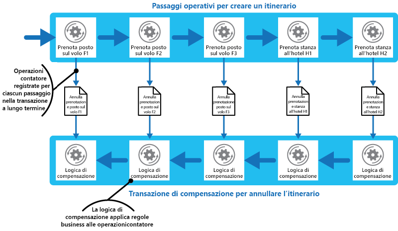

# Modello di transazioni di compensazioneCompensating Transaction pattern

[!INCLUDE [header](../_includes/header.md)]

Annullare il lavoro eseguito da una serie di passaggi che insieme definiscono un'operazione coerente in caso di esito negativo di uno o più passaggi.Undo the work performed by a series of steps, which together define an eventually consistent operation, if one or more of the steps fail. Le operazioni che seguono il modello di coerenza finale sono presenti in genere nelle applicazioni ospitate nel cloud che implementano flussi di lavoro e processi aziendali complessi.Operations that follow the eventual consistency model are commonly found in cloud-hosted applications that implement complex business processes and workflows.

## Contesto e problemaContext and problem

Le applicazioni in esecuzione nel cloud spesso modificano i dati.Applications running in the cloud frequently modify data. Questi dati potrebbero essere distribuiti in varie origini dati contenute in aree geografiche diverse.This data might be spread across various data sources held in different geographic locations. Per evitare conflitti e migliorare le prestazioni in un ambiente distribuito, un'applicazione non deve provare a offrire coerenza transazionale assoluta.To avoid contention and improve performance in a distributed environment, an application shouldn't try to provide strong transactional consistency. Deve invece implementare la coerenza finale.Rather, the application should implement eventual consistency. In questo modello, un'operazione aziendale tipica è costituita da una serie di passaggi distinti.In this model, a typical business operation consists of a series of separate steps. Mentre questi passaggi sono in esecuzione, la visualizzazione complessiva dello stato del sistema potrebbe essere incoerente, ma quando l'operazione è stata completata e tutti i passaggi sono stati eseguiti il sistema deve diventare di nuovo coerente.While these steps are being performed, the overall view of the system state might be inconsistent, but when the operation has completed and all of the steps have been executed the system should become consistent again.

> L'articolo [Data Consistency Primer](https://msdn.microsoft.com/library/dn589800.aspx) (Nozioni di base sulla coerenza dei dati) contiene informazioni sui motivi per cui le transazioni distribuite non garantiscono una corretta scalabilità e i principi del modello di coerenza finale.The [Data Consistency Primer](https://msdn.microsoft.com/library/dn589800.aspx) provides information about why distributed transactions don't scale well, and the principles of the eventual consistency model.

Una delle parti più difficili del modello di coerenza finale è come gestire un passaggio non riuscito.A challenge in the eventual consistency model is how to handle a step that has failed. In questo caso potrebbe essere necessario annullare tutto il lavoro completato tramite i passaggi precedenti nell'operazione.In this case it might be necessary to undo all of the work completed by the previous steps in the operation. I dati non possono tuttavia essere semplicemente annullati perché potrebbero essere stati modificati da altre istanze simultanee dell'applicazione.However, the data can't simply be rolled back because other concurrent instances of the application might have changed it. Anche nei casi in cui i dati non siano stati modificati da un'istanza simultanea, l'annullamento di un passaggio non può essere una semplice questione di ripristino dello stato originale.Even in cases where the data hasn't been changed by a concurrent instance, undoing a step might not simply be a matter of restoring the original state. Potrebbe essere necessario applicare diverse regole specifiche per l'azienda (vedere il sito Web di viaggi descritto nella sezione Esempio).It might be necessary to apply various business-specific rules (see the travel website described in the Example section).

Se un'operazione che implementa la coerenza finale si estende su diversi archivi dati eterogenei, l'annullamento dei passaggi dell'operazione richiederà a sua volta la visita a ogni archivio dati.If an operation that implements eventual consistency spans several heterogeneous data stores, undoing the steps in the operation will require visiting each data store in turn. Il lavoro eseguito in ogni archivio dati deve essere annullato in modo affidabile per evitare che il sistema rimanga non coerente.The work performed in every data store must be undone reliably to prevent the system from remaining inconsistent.

Non tutti i dati interessati da un'operazione che implementa la coerenza finale potrebbero essere conservati in un database.Not all data affected by an operation that implements eventual consistency might be held in a database. In un ambiente di architettura orientata ai servizi (SOA) un'operazione potrebbe chiamare un'azione in un servizio e provocare una modifica nello stato mantenuto da quel servizio.In a service oriented architecture (SOA) environment an operation could invoke an action in a service, and cause a change in the state held by that service. Per annullare l'operazione, è necessario annullare anche questa modifica di stato.To undo the operation, this state change must also be undone. Potrebbe pertanto essere necessario chiamare nuovamente il servizio ed eseguire un'altra azione che inverta gli effetti del primo.This can involve invoking the service again and performing another action that reverses the effects of the first.

## SoluzioneSolution

La soluzione consiste nell'implementare una transazione di compensazione.The solution is to implement a compensating transaction. I passaggi di una transazione di compensazione devono annullare gli effetti dei passaggi nell'operazione originale.The steps in a compensating transaction must undo the effects of the steps in the original operation. Una transazione di compensazione potrebbe non essere in grado di sostituire semplicemente lo stato corrente con lo stato di sistema all'inizio dell'operazione poiché questo approccio potrebbe sovrascrivere le modifiche apportate da altre istanze simultanee di un'applicazione.A compensating transaction might not be able to simply replace the current state with the state the system was in at the start of the operation because this approach could overwrite changes made by other concurrent instances of an application. Deve invece essere un processo intelligente che prenda in considerazione tutte le azioni eseguite dalle istanze simultanee.Instead, it must be an intelligent process that takes into account any work done by concurrent instances. Questo processo in genere è applicazione specifica, determinata dalla natura del lavoro eseguito dall'operazione originale.This process will usually be application specific, driven by the nature of the work performed by the original operation.

Un approccio comune prevede l'uso di un flusso di lavoro per implementare un'operazione coerente che richiede la compensazione.A common approach is to use a workflow to implement an eventually consistent operation that requires compensation. Via via che l'operazione originale procede, il sistema registra informazioni su ogni passaggio e su come può essere annullato il lavoro da esso eseguito.As the original operation proceeds, the system records information about each step and how the work performed by that step can be undone. Se l'operazione non riesce in qualsiasi punto, il flusso di lavoro torna indietro nei passaggi completati ed esegue il lavoro che inverte ogni passaggio.If the operation fails at any point, the workflow rewinds back through the steps it's completed and performs the work that reverses each step. Si noti che una transazione di compensazione potrebbe non dover annullare il lavoro seguendo l'esatto ordine inverso dell'operazione originale e alcuni dei passaggi dell'annullamento potrebbero essere eseguiti in parallelo.Note that a compensating transaction might not have to undo the work in the exact reverse order of the original operation, and it might be possible to perform some of the undo steps in parallel.

> Questo approccio è simile alla strategia delle Saghe descritta nel [blog di Clemens Vasters](http://vasters.com/clemensv/2012/09/01/Sagas.aspx).This approach is similar to the Sagas strategy discussed in [Clemens Vasters’ blog](http://vasters.com/clemensv/2012/09/01/Sagas.aspx).

Una transazione di compensazione è anche un'operazione coerente e potrebbe avere esito negativo.A compensating transaction is also an eventually consistent operation and it could also fail. Il sistema deve essere in grado di riprendere la transazione di compensazione al momento dell'errore e continuare.The system should be able to resume the compensating transaction at the point of failure and continue. Potrebbe essere necessario ripetere un passaggio non riuscito, pertanto i passaggi in una transazione di compensazione devono essere definiti come comandi idempotenti.It might be necessary to repeat a step that's failed, so the steps in a compensating transaction should be defined as idempotent commands. Per altre informazioni, vedere [Idempotency Patterns](http://blog.jonathanoliver.com/idempotency-patterns/) (Modelli di idempotenza) sul blog di Jonathan Oliver.For more information, see [Idempotency Patterns](http://blog.jonathanoliver.com/idempotency-patterns/) on Jonathan Oliver’s blog.

In alcuni casi potrebbe non essere possibile riprendere la transazione da un passaggio non riuscito se non tramite un intervento manuale.In some cases it might not be possible to recover from a step that has failed except through manual intervention. In questi casi il sistema deve generare un avviso e fornire quante più informazioni possibili sul motivo dell'errore.In these situations the system should raise an alert and provide as much information as possible about the reason for the failure.

## Considerazioni e problemiIssues and considerations

Prima di decidere come implementare questo modello, considerare quanto segue:Consider the following points when deciding how to implement this pattern:

Potrebbe non essere facile determinare quando un passaggio di un'operazione che implementa la coerenza finale non è riuscito.It might not be easy to determine when a step in an operation that implements eventual consistency has failed. Un passaggio potrebbe non riuscire immediatamente, ma bloccarsi.A step might not fail immediately, but instead could block. Potrebbe essere necessario implementare un tipo di meccanismo di timeout.It might be necessary to implement some form of time-out mechanism.

- La logica di compensazione non è facilmente generalizzata.-Compensation logic isn't easily generalized. Una transazione di compensazione è specifica dell'applicazione.A compensating transaction is application specific. Si basa sul fatto che l'applicazione possieda informazioni sufficienti per poter annullare gli effetti di ogni passaggio di un'operazione non riuscita.It relies on the application having sufficient information to be able to undo the effects of each step in a failed operation.

È necessario definire i passaggi in una transazione di compensazione come comandi idempotenti.You should define the steps in a compensating transaction as idempotent commands. In questo modo è possibile ripetere i passaggi se la transazione di compensazione ha esito negativo.This enables the steps to be repeated if the compensating transaction itself fails.

L'infrastruttura che gestisce i passaggi nell'operazione originale e la transazione di compensazione devono essere resilienti.The infrastructure that handles the steps in the original operation, and the compensating transaction, must be resilient. Non deve perdere le informazioni necessarie per compensare un passaggio non riuscito ed essere in grado di monitorare in modo affidabile lo stato di avanzamento della logica di compensazione.It must not lose the information required to compensate for a failing step, and it must be able to reliably monitor the progress of the compensation logic.

Una transazione di compensazione non riporta necessariamente i dati nel sistema allo stato in cui si trovavano all'inizio dell'operazione originale.A compensating transaction doesn't necessarily return the data in the system to the state it was in at the start of the original operation. Consente invece di compensare il lavoro eseguito dai passaggi completati correttamente prima che l'operazione non riuscisse.Instead, it compensates for the work performed by the steps that completed successfully before the operation failed.

L'ordine dei passaggi nella transazione di compensazione non deve essere necessariamente l'esatto opposto dei passaggi dell'operazione originale.The order of the steps in the compensating transaction doesn't necessarily have to be the exact opposite of the steps in the original operation. Ad esempio, un archivio dati potrebbe essere più sensibile alle incoerenze rispetto a un altro e pertanto i passaggi nella transazione di compensazione che annullano le modifiche a questo archivio devono essere eseguiti per primi.For example, one data store might be more sensitive to inconsistencies than another, and so the steps in the compensating transaction that undo the changes to this store should occur first.

Inserire un blocco basato sul timeout a breve termine su ogni risorsa necessaria per completare un'operazione e ottenere in anticipo queste risorse per aumentare la probabilità che l'attività complessiva abbia esito positivo.Placing a short-term timeout-based lock on each resource that's required to complete an operation, and obtaining these resources in advance, can help increase the likelihood that the overall activity will succeed. L'operazione deve essere eseguita solo dopo aver acquisito tutte le risorse.The work should be performed only after all the resources have been acquired. Tutte le azioni devono essere completate prima della scadenza del blocco.All actions must be finalized before the locks expire.

È consigliabile usare la logica di ripetizione dei tentativi, che è più tollerante, per ridurre al minimo gli errori che attivano una transazione di compensazione.Consider using retry logic that is more forgiving than usual to minimize failures that trigger a compensating transaction. Se un passaggio in un'operazione che implementa la coerenza finale non riesce, provare a gestire l'errore come un'eccezione temporanea e ripetere il passaggio.If a step in an operation that implements eventual consistency fails, try handling the failure as a transient exception and repeat the step. Arrestare l'operazione e avviare una transazione di compensazione solo se un passaggio non riesce ripetutamente o in modo permanente.Only stop the operation and initiate a compensating transaction if a step fails repeatedly or irrecoverably.

> Molti dei problemi posti dall'implementazione di una transazione di compensazione sono gli stessi relativi all'implementazione di coerenza finale.Many of the challenges of implementing a compensating transaction are the same as those with implementing eventual consistency. Per altre informazioni, vedere la sezione relativa alle considerazioni sull'implementazione della coerenza finale nell'articolo [Data Consistency Primer](https://msdn.microsoft.com/library/dn589800.aspx) (Nozioni di base sulla coerenza dei dati).See the section Considerations for Implementing Eventual Consistency in the [Data Consistency Primer](https://msdn.microsoft.com/library/dn589800.aspx) for more information.

## Quando usare questo modelloWhen to use this pattern

Usare questo modello solo per le operazioni che devono essere annullate in caso di errore.Use this pattern only for operations that must be undone if they fail. Se possibile, progettare soluzioni per evitare la complessità della richiesta di transazioni di compensazione.If possible, design solutions to avoid the complexity of requiring compensating transactions.

## EsempioExample

Un sito Web di viaggi consente ai clienti di prenotare itinerari.A travel website lets customers book itineraries. Un singolo itinerario potrebbe comprendere una serie di voli e hotel.A single itinerary might comprise a series of flights and hotels. Un cliente che viaggia da Seattle a Londra e quindi a Parigi potrebbe eseguire la procedura seguente durante la creazione di un itinerario:A customer traveling from Seattle to London and then on to Paris could perform the following steps when creating an itinerary:

1. Prenotare un posto sul volo F1 da Seattle a Londra.Book a seat on flight F1 from Seattle to London.
2. Prenotare un posto sul volo F2 da Londra a Parigi.Book a seat on flight F2 from London to Paris.
3. Prenotare un posto sul volo F3 da Parigi a Seattle.Book a seat on flight F3 from Paris to Seattle.
4. Prenotare una camera nell'hotel H1 a Londra.Reserve a room at hotel H1 in London.
5. Prenotare una camera nell'hotel H2 a Parigi.Reserve a room at hotel H2 in Paris.

Questi passaggi costituiscono un'operazione coerente, anche se ogni passaggio è un'operazione separata.These steps constitute an eventually consistent operation, although each step is a separate action. Di conseguenza, oltre a eseguire questi passaggi, il sistema deve anche registrare le operazioni di contatore necessarie per annullare ogni passaggio nel caso in cui il cliente decidesse di annullare l'itinerario.Therefore, as well as performing these steps, the system must also record the counter operations necessary to undo each step in case the customer decides to cancel the itinerary. I passaggi necessari per eseguire le operazioni di contatore possono quindi essere eseguite come una transazione di compensazione.The steps necessary to perform the counter operations can then run as a compensating transaction.

Si noti che le operazioni nella transazione di compensazione potrebbero non essere l'esatto opposto dei passaggi originali e la logica in ogni passaggio nella transazione di compensazione deve prendere in considerazione tutte le eventuali regole specifiche dell'azienda.Notice that the steps in the compensating transaction might not be the exact opposite of the original steps, and the logic in each step in the compensating transaction must take into account any business-specific rules. Ad esempio, l'annullamento della prenotazione di un volo potrebbe non dare al cliente il diritto al rimborso completo dell'importo pagato.For example, unbooking a seat on a flight might not entitle the customer to a complete refund of any money paid. Nella figura viene illustrata la generazione di una transazione di compensazione per annullare una transazione a esecuzione prolungata per la prenotazione di un itinerario di viaggio.The figure illustrates generating a compensating transaction to undo a long-running transaction to book a travel itinerary.

> Potrebbe essere possibile eseguire in parallelo i passaggi di una transazione di compensazione, a seconda di come è stata progettata la logica di compensazione per ogni passaggio.It might be possible for the steps in the compensating transaction to be performed in parallel, depending on how you've designed the compensating logic for each step.

In molte soluzioni aziendali, l'esito negativo di un unico passaggio non sempre richiede il roll-back del sistema tramite una transazione di compensazione.In many business solutions, failure of a single step doesn't always necessitate rolling the system back by using a compensating transaction. Ad esempio, se &mdash; dopo che aver prenotato i voli F1, F2 e F3 nello scenario del sito Web di viaggio &mdash; il cliente non è in grado di prenotare una stanza nell'hotel H1, è preferibile offrire al cliente una stanza in un altro albergo della stessa città anziché annullare i voli.For example, if&mdash;after having booked flights F1, F2, and F3 in the travel website scenario&mdash;the customer is unable to reserve a room at hotel H1, it's preferable to offer the customer a room at a different hotel in the same city rather than canceling the flights. Il cliente può comunque decidere di annullare la prenotazione (in tal caso, viene eseguita la transazione di compensazione e vengono annullate le prenotazioni effettuate sui voli F1, F2 e F3), ma questa decisione deve essere effettuata dal cliente anziché dal sistema.The customer can still decide to cancel (in which case the compensating transaction runs and undoes the bookings made on flights F1, F2, and F3), but this decision should be made by the customer rather than by the system.

## Modelli correlati e informazioni aggiuntiveRelated patterns and guidance

Per l'implementazione di questo modello possono risultare utili i modelli e le informazioni aggiuntive seguenti:The following patterns and guidance might also be relevant when implementing this pattern:

- [Data Consistency Primer](https://msdn.microsoft.com/library/dn589800.aspx) (Nozioni di base sulla coerenza dei dati).[Data Consistency Primer](https://msdn.microsoft.com/library/dn589800.aspx). Il modello di transazioni di compensazione viene spesso usato per annullare le operazioni che implementano il modello di coerenza finale.The Compensating Transaction pattern is often used to undo operations that implement the eventual consistency model. Queste nozioni di base offrono informazioni su vantaggi e compromessi della coerenza finale.This primer provides information on the benefits and tradeoffs of eventual consistency.

- [Scheduler-Agent-Supervisor Pattern](scheduler-agent-supervisor.md) (Modello di supervisore agente di pianificazione).[Scheduler-Agent-Supervisor Pattern](scheduler-agent-supervisor.md). Descrive come implementare sistemi resilienti che eseguono operazioni aziendali che usano risorse e servizi distribuiti.Describes how to implement resilient systems that perform business operations that use distributed services and resources. Potrebbe talvolta essere necessario annullare il lavoro eseguito da un'operazione usando una transazione di compensazione.Sometimes, it might be necessary to undo the work performed by an operation by using a compensating transaction.

- [Modello di ripetizione dei tentativi](./retry.md).[Retry Pattern](./retry.md). L'esecuzione delle transazioni di compensazione può essere costosa. Per ridurne al minimo l'uso è possibile implementare criteri efficaci per la ripetizione delle operazioni non riuscite seguendo il modello di ripetizione dei tentativi.Compensating transactions can be expensive to perform, and it might be possible to minimize their use by implementing an effective policy of retrying failing operations by following the Retry pattern.
