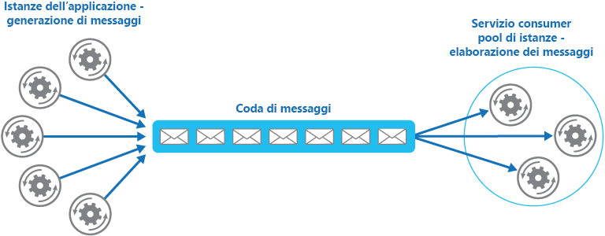

# <a name="competing-consumers-pattern"></a><span data-ttu-id="7218c-104">Modello di consumer concorrenti</span><span class="sxs-lookup"><span data-stu-id="7218c-104">Competing Consumers pattern</span></span>

[!INCLUDE [header](../_includes/header.md)]

<span data-ttu-id="7218c-105">Consentire a più consumer concorrenti di elaborare i messaggi ricevuti sullo stesso canale di messaggistica.</span><span class="sxs-lookup"><span data-stu-id="7218c-105">Enable multiple concurrent consumers to process messages received on the same messaging channel.</span></span> <span data-ttu-id="7218c-106">Questo modello consente a un sistema di elaborare più messaggi contemporaneamente per ottimizzare la velocità effettiva, per migliorare la scalabilità e la disponibilità e per bilanciare il carico di lavoro.</span><span class="sxs-lookup"><span data-stu-id="7218c-106">This enables a system to process multiple messages concurrently to optimize throughput, to improve scalability and availability, and to balance the workload.</span></span>

## <a name="context-and-problem"></a><span data-ttu-id="7218c-107">Contesto e problema</span><span class="sxs-lookup"><span data-stu-id="7218c-107">Context and problem</span></span>

<span data-ttu-id="7218c-108">Un'applicazione in esecuzione nel cloud deve gestire un numero elevato di richieste.</span><span class="sxs-lookup"><span data-stu-id="7218c-108">An application running in the cloud is expected to handle a large number of requests.</span></span> <span data-ttu-id="7218c-109">Una tecnica comune prevede che, anziché elaborare ogni richiesta in modo sincrono, l'applicazione le passi tramite un sistema di messaggistica a un altro servizio (un servizio consumer) che le gestisce in modo asincrono.</span><span class="sxs-lookup"><span data-stu-id="7218c-109">Rather than process each request synchronously, a common technique is for the application to pass them through a messaging system to another service (a consumer service) that handles them asynchronously.</span></span> <span data-ttu-id="7218c-110">Questa strategia consente di assicurarsi che la logica di business nell'applicazione non venga bloccata durante l'elaborazione delle richieste.</span><span class="sxs-lookup"><span data-stu-id="7218c-110">This strategy helps to ensure that the business logic in the application isn't blocked while the requests are being processed.</span></span>

<span data-ttu-id="7218c-111">Il numero di richieste può variare in modo significativo nel tempo per diversi motivi.</span><span class="sxs-lookup"><span data-stu-id="7218c-111">The number of requests can vary significantly over time for many reasons.</span></span> <span data-ttu-id="7218c-112">Un aumento improvviso delle attività utente o l'arrivo di richieste aggregate provenienti da più tenant può causare un carico di lavoro imprevisto.</span><span class="sxs-lookup"><span data-stu-id="7218c-112">A sudden increase in user activity or aggregated requests coming from multiple tenants can cause an unpredictable workload.</span></span> <span data-ttu-id="7218c-113">Negli orari di punta, un sistema potrebbe dover elaborare centinaia di richieste al secondo, mentre in altri momenti il numero potrebbe essere molto basso.</span><span class="sxs-lookup"><span data-stu-id="7218c-113">At peak hours a system might need to process many hundreds of requests per second, while at other times the number could be very small.</span></span> <span data-ttu-id="7218c-114">Inoltre, la natura del lavoro eseguito per gestire le richieste può essere estremamente variabile.</span><span class="sxs-lookup"><span data-stu-id="7218c-114">Additionally, the nature of the work performed to handle these requests might be highly variable.</span></span> <span data-ttu-id="7218c-115">Usando una singola istanza del servizio consumer, è possibile che l'istanza sia inondata da un numero eccessivo di richieste o che il sistema di messaggistica venga sovraccaricato da un forte afflusso di messaggi provenienti dall'applicazione.</span><span class="sxs-lookup"><span data-stu-id="7218c-115">Using a single instance of the consumer service can cause that instance to become flooded with requests, or the messaging system might be overloaded by an influx of messages coming from the application.</span></span> <span data-ttu-id="7218c-116">Per gestire questo carico di lavoro variabile, il sistema può eseguire più istanze del servizio consumer.</span><span class="sxs-lookup"><span data-stu-id="7218c-116">To handle this fluctuating workload, the system can run multiple instances of the consumer service.</span></span> <span data-ttu-id="7218c-117">Tuttavia, i consumer devono essere coordinati per garantire che ogni messaggio venga recapitato solo a un singolo consumer.</span><span class="sxs-lookup"><span data-stu-id="7218c-117">However, these consumers must be coordinated to ensure that each message is only delivered to a single consumer.</span></span> <span data-ttu-id="7218c-118">Inoltre, occorre bilanciare il carico di lavoro tra i consumer per evitare che un'istanza diventi un collo di bottiglia.</span><span class="sxs-lookup"><span data-stu-id="7218c-118">The workload also needs to be load balanced across consumers to prevent an instance from becoming a bottleneck.</span></span>

## <a name="solution"></a><span data-ttu-id="7218c-119">Soluzione</span><span class="sxs-lookup"><span data-stu-id="7218c-119">Solution</span></span>

<span data-ttu-id="7218c-120">Usare una coda di messaggi per implementare il canale di comunicazione tra l'applicazione e le istanze del servizio consumer.</span><span class="sxs-lookup"><span data-stu-id="7218c-120">Use a message queue to implement the communication channel between the application and the instances of the consumer service.</span></span> <span data-ttu-id="7218c-121">L'applicazione invia le richieste alla coda sotto forma di messaggi e le istanze del servizio consumer ricevono i messaggi dalla coda e li elaborano.</span><span class="sxs-lookup"><span data-stu-id="7218c-121">The application posts requests in the form of messages to the queue, and the consumer service instances receive messages from the queue and process them.</span></span> <span data-ttu-id="7218c-122">Questo approccio consente allo stesso pool di istanze del servizio consumer di gestire i messaggi provenienti da qualsiasi istanza dell'applicazione.</span><span class="sxs-lookup"><span data-stu-id="7218c-122">This approach enables the same pool of consumer service instances to handle messages from any instance of the application.</span></span> <span data-ttu-id="7218c-123">La figura illustra l'uso di una coda di messaggi per distribuire il lavoro alle istanze di un servizio.</span><span class="sxs-lookup"><span data-stu-id="7218c-123">The figure illustrates using a message queue to distribute work to instances of a service.</span></span>



<span data-ttu-id="7218c-125">Questa soluzione offre i vantaggi seguenti:</span><span class="sxs-lookup"><span data-stu-id="7218c-125">This solution has the following benefits:</span></span>

- <span data-ttu-id="7218c-126">Offre un sistema con bilanciamento del carico che può gestire notevoli variazioni nel volume di richieste inviate da istanze dell'applicazione.</span><span class="sxs-lookup"><span data-stu-id="7218c-126">It provides a load-leveled system that can handle wide variations in the volume of requests sent by application instances.</span></span> <span data-ttu-id="7218c-127">La coda funge da buffer tra le istanze dell'applicazione e le istanze del servizio consumer.</span><span class="sxs-lookup"><span data-stu-id="7218c-127">The queue acts as a buffer between the application instances and the consumer service instances.</span></span> <span data-ttu-id="7218c-128">Questo contribuisce a ridurre al minimo l'impatto sulla disponibilità e sui tempi di risposta per le istanze sia dell'applicazione che del servizio, come descritto in [Modello di livellamento del carico basato sulle code](queue-based-load-leveling.md).</span><span class="sxs-lookup"><span data-stu-id="7218c-128">This can help to minimize the impact on availability and responsiveness for both the application and the service instances, as described by the [Queue-based Load Leveling pattern](queue-based-load-leveling.md).</span></span> <span data-ttu-id="7218c-129">La gestione di un messaggio che richiede operazioni di elaborazione a esecuzione prolungata non impedisce la gestione contemporanea di altri messaggi da parte di altre istanze del servizio consumer.</span><span class="sxs-lookup"><span data-stu-id="7218c-129">Handling a message that requires some long-running processing doesn't prevent other messages from being handled concurrently by other instances of the consumer service.</span></span>

- <span data-ttu-id="7218c-130">Migliora l'affidabilità.</span><span class="sxs-lookup"><span data-stu-id="7218c-130">It improves reliability.</span></span> <span data-ttu-id="7218c-131">Se un producer comunica direttamente con un consumer invece di usare questo modello, ma non controlla il consumer, esiste una forte probabilità che messaggi vadano persi o non vengano elaborati se si verifica un errore del consumer.</span><span class="sxs-lookup"><span data-stu-id="7218c-131">If a producer communicates directly with a consumer instead of using this pattern, but doesn't monitor the consumer, there's a high probability that messages could be lost or fail to be processed if the consumer fails.</span></span> <span data-ttu-id="7218c-132">In questo modello, i messaggi non vengono inviati a una specifica istanza del servizio.</span><span class="sxs-lookup"><span data-stu-id="7218c-132">In this pattern, messages aren't sent to a specific service instance.</span></span> <span data-ttu-id="7218c-133">Un'istanza del servizio non riuscita non bloccherà il producer e i messaggi possono essere elaborati da qualsiasi istanza funzionante del servizio.</span><span class="sxs-lookup"><span data-stu-id="7218c-133">A failed service instance won't block a producer, and messages can be processed by any working service instance.</span></span>

- <span data-ttu-id="7218c-134">Non richiede un coordinamento complesso tra i consumer o tra il producer e le istanze del consumer.</span><span class="sxs-lookup"><span data-stu-id="7218c-134">It doesn't require complex coordination between the consumers, or between the producer and the consumer instances.</span></span> <span data-ttu-id="7218c-135">La coda di messaggi assicura che ogni messaggio sia recapitato almeno una volta.</span><span class="sxs-lookup"><span data-stu-id="7218c-135">The message queue ensures that each message is delivered at least once.</span></span>

- <span data-ttu-id="7218c-136">È scalabile.</span><span class="sxs-lookup"><span data-stu-id="7218c-136">It's scalable.</span></span> <span data-ttu-id="7218c-137">Il sistema può aumentare o diminuire in modo dinamico il numero di istanze del servizio consumer in base alla fluttuazione del volume dei messaggi.</span><span class="sxs-lookup"><span data-stu-id="7218c-137">The system can dynamically increase or decrease the number of instances of the consumer service as the volume of messages fluctuates.</span></span>

- <span data-ttu-id="7218c-138">Se la coda di messaggi fornisce operazioni di lettura transazionali, può migliorare la resilienza.</span><span class="sxs-lookup"><span data-stu-id="7218c-138">It can improve resiliency if the message queue provides transactional read operations.</span></span> <span data-ttu-id="7218c-139">Se un'istanza del servizio consumer che legge ed elabora il messaggio come parte di un'operazione transazionale ha esito negativo, questo modello può garantire che il messaggio verrà restituito alla coda per essere prelevato e gestito da un'altra istanza del servizio consumer.</span><span class="sxs-lookup"><span data-stu-id="7218c-139">If a consumer service instance reads and processes the message as part of a transactional operation, and the consumer service instance fails, this pattern can ensure that the message will be returned to the queue to be picked up and handled by another instance of the consumer service.</span></span>

## <a name="issues-and-considerations"></a><span data-ttu-id="7218c-140">Considerazioni e problemi</span><span class="sxs-lookup"><span data-stu-id="7218c-140">Issues and considerations</span></span>

<span data-ttu-id="7218c-141">Prima di decidere come implementare questo modello, considerare quanto segue:</span><span class="sxs-lookup"><span data-stu-id="7218c-141">Consider the following points when deciding how to implement this pattern:</span></span>

- <span data-ttu-id="7218c-142">**Ordinamento dei messaggi**.</span><span class="sxs-lookup"><span data-stu-id="7218c-142">**Message ordering**.</span></span> <span data-ttu-id="7218c-143">L'ordine in cui le istanze del servizio consumer ricevono i messaggi non è garantito e non riflette necessariamente l'ordine in cui i messaggi sono stati creati.</span><span class="sxs-lookup"><span data-stu-id="7218c-143">The order in which consumer service instances receive messages isn't guaranteed, and doesn't necessarily reflect the order in which the messages were created.</span></span> <span data-ttu-id="7218c-144">Progettare il sistema in modo da assicurarsi che l'elaborazione dei messaggi sia idempotente, perché ciò è utile per eliminare qualsiasi dipendenza rispetto all'ordine in cui vengono gestiti i messaggi.</span><span class="sxs-lookup"><span data-stu-id="7218c-144">Design the system to ensure that message processing is idempotent because this will help to eliminate any dependency on the order in which messages are handled.</span></span> <span data-ttu-id="7218c-145">Per altre informazioni, vedere [Idempotency Patterns](https://blog.jonathanoliver.com/idempotency-patterns/) (Modelli di idempotenza) sul blog di Jonathan Oliver.</span><span class="sxs-lookup"><span data-stu-id="7218c-145">For more information, see [Idempotency Patterns](https://blog.jonathanoliver.com/idempotency-patterns/) on Jonathon Oliver’s blog.</span></span>

    > <span data-ttu-id="7218c-146">Le code del bus di servizio di Microsoft Azure possono implementare l'ordinamento First In, First Out garantito dei messaggi mediante sessioni di messaggistica.</span><span class="sxs-lookup"><span data-stu-id="7218c-146">Microsoft Azure Service Bus Queues can implement guaranteed first-in-first-out ordering of messages by using message sessions.</span></span> <span data-ttu-id="7218c-147">Per altre informazioni, vedere [Modelli di messaggistica mediante sessioni](https://msdn.microsoft.com/magazine/jj863132.aspx).</span><span class="sxs-lookup"><span data-stu-id="7218c-147">For more information, see [Messaging Patterns Using Sessions](https://msdn.microsoft.com/magazine/jj863132.aspx).</span></span>

- <span data-ttu-id="7218c-148">**Progettazione dei servizi per la resilienza**.</span><span class="sxs-lookup"><span data-stu-id="7218c-148">**Designing services for resiliency**.</span></span> <span data-ttu-id="7218c-149">Se il sistema è progettato per rilevare e riavviare le istanze di servizio non riuscite, può essere necessario implementare le operazioni di elaborazione eseguite dalle istanze del servizio come idempotenti, in modo da ridurre al minimo gli effetti se un singolo messaggio viene recuperato ed elaborato più di una volta.</span><span class="sxs-lookup"><span data-stu-id="7218c-149">If the system is designed to detect and restart failed service instances, it might be necessary to implement the processing performed by the service instances as idempotent operations to minimize the effects of a single message being retrieved and processed more than once.</span></span>

- <span data-ttu-id="7218c-150">**Rilevamento dei messaggi non elaborabili**.</span><span class="sxs-lookup"><span data-stu-id="7218c-150">**Detecting poison messages**.</span></span> <span data-ttu-id="7218c-151">Un messaggio in formato non valido o un'attività che richiede l'accesso a risorse non disponibili può causare un errore in un'istanza del servizio.</span><span class="sxs-lookup"><span data-stu-id="7218c-151">A malformed message, or a task that requires access to resources that aren't available, can cause a service instance to fail.</span></span> <span data-ttu-id="7218c-152">Il sistema deve impedire che tali messaggi siano restituiti alla coda e invece acquisirne e archiviarne i dettagli altrove, in modo che possano essere analizzati se necessario.</span><span class="sxs-lookup"><span data-stu-id="7218c-152">The system should prevent such messages being returned to the queue, and instead capture and store the details of these messages elsewhere so that they can be analyzed if necessary.</span></span>

- <span data-ttu-id="7218c-153">**Gestione dei risultati**.</span><span class="sxs-lookup"><span data-stu-id="7218c-153">**Handling results**.</span></span> <span data-ttu-id="7218c-154">L'istanza del servizio che gestisce un messaggio è completamente separata dalla logica dell'applicazione che genera il messaggio e potrebbero non essere in grado di comunicare direttamente.</span><span class="sxs-lookup"><span data-stu-id="7218c-154">The service instance handling a message is fully decoupled from the application logic that generates the message, and they might not be able to communicate directly.</span></span> <span data-ttu-id="7218c-155">Se l'istanza del servizio genera risultati che devono essere passati alla logica dell'applicazione, queste informazioni devono essere archiviate in un percorso accessibile da entrambe.</span><span class="sxs-lookup"><span data-stu-id="7218c-155">If the service instance generates results that must be passed back to the application logic, this information must be stored in a location that's accessible to both.</span></span> <span data-ttu-id="7218c-156">Per evitare che logica dell'applicazione recuperi dati incompleti, il sistema deve segnalare il completamento dell'elaborazione.</span><span class="sxs-lookup"><span data-stu-id="7218c-156">In order to prevent the application logic from retrieving incomplete data the system must indicate when processing is complete.</span></span>

     > <span data-ttu-id="7218c-157">Se si usa Azure, un processo di lavoro può passare i risultati alla logica dell'applicazione usando una coda dedicata di risposte al messaggio.</span><span class="sxs-lookup"><span data-stu-id="7218c-157">If you're using Azure, a worker process can pass results back to the application logic by using a dedicated message reply queue.</span></span> <span data-ttu-id="7218c-158">La logica dell'applicazione deve essere in grado di correlare questi risultati con il messaggio originale.</span><span class="sxs-lookup"><span data-stu-id="7218c-158">The application logic must be able to correlate these results with the original message.</span></span> <span data-ttu-id="7218c-159">Questo scenario è descritto più dettagliatamente in [Introduzione alla messaggistica asincrona](https://msdn.microsoft.com/library/dn589781.aspx).</span><span class="sxs-lookup"><span data-stu-id="7218c-159">This scenario is described in more detail in the [Asynchronous Messaging Primer](https://msdn.microsoft.com/library/dn589781.aspx).</span></span>

- <span data-ttu-id="7218c-160">**Scalabilità del sistema di messaggistica**.</span><span class="sxs-lookup"><span data-stu-id="7218c-160">**Scaling the messaging system**.</span></span> <span data-ttu-id="7218c-161">In una soluzione su larga scala, una singola coda di messaggi può essere sovraccaricata dal numero di messaggi e diventare un collo di bottiglia nel sistema.</span><span class="sxs-lookup"><span data-stu-id="7218c-161">In a large-scale solution, a single message queue could be overwhelmed by the number of messages and become a bottleneck in the system.</span></span> <span data-ttu-id="7218c-162">In questo caso, è possibile partizionare il sistema di messaggistica in modo da inviare i messaggi provenienti da specifici producer a una determinata coda oppure usare il bilanciamento del carico per distribuire i messaggi tra più code di messaggi.</span><span class="sxs-lookup"><span data-stu-id="7218c-162">In this situation, consider partitioning the messaging system to send messages from specific producers to a particular queue, or use load balancing to distribute messages across multiple message queues.</span></span>

- <span data-ttu-id="7218c-163">**Affidabilità del sistema di messaggistica**.</span><span class="sxs-lookup"><span data-stu-id="7218c-163">**Ensuring reliability of the messaging system**.</span></span> <span data-ttu-id="7218c-164">Per garantire che dopo l'accodamento di un messaggio da parte dell'applicazione questo non vada perso, è necessario un sistema di messaggistica affidabile.</span><span class="sxs-lookup"><span data-stu-id="7218c-164">A reliable messaging system is needed to guarantee that after the application enqueues a message it won't be lost.</span></span> <span data-ttu-id="7218c-165">Ciò è essenziale per assicurare che tutti i messaggi vengano recapitati almeno una volta.</span><span class="sxs-lookup"><span data-stu-id="7218c-165">This is essential for ensuring that all messages are delivered at least once.</span></span>

## <a name="when-to-use-this-pattern"></a><span data-ttu-id="7218c-166">Quando usare questo modello</span><span class="sxs-lookup"><span data-stu-id="7218c-166">When to use this pattern</span></span>

<span data-ttu-id="7218c-167">Usare questo modello quando:</span><span class="sxs-lookup"><span data-stu-id="7218c-167">Use this pattern when:</span></span>

- <span data-ttu-id="7218c-168">Il carico di lavoro di un'applicazione è suddiviso in attività che è possibile eseguire in modo asincrono.</span><span class="sxs-lookup"><span data-stu-id="7218c-168">The workload for an application is divided into tasks that can run asynchronously.</span></span>
- <span data-ttu-id="7218c-169">Le attività sono indipendenti e possono essere eseguite in parallelo.</span><span class="sxs-lookup"><span data-stu-id="7218c-169">Tasks are independent and can run in parallel.</span></span>
- <span data-ttu-id="7218c-170">Il volume di lavoro è estremamente variabile e per questo motivo è necessaria una soluzione scalabile.</span><span class="sxs-lookup"><span data-stu-id="7218c-170">The volume of work is highly variable, requiring a scalable solution.</span></span>
- <span data-ttu-id="7218c-171">La soluzione deve offrire disponibilità elevata e deve essere resiliente se l'elaborazione di un'attività ha esito negativo.</span><span class="sxs-lookup"><span data-stu-id="7218c-171">The solution must provide high availability, and must be resilient if the processing for a task fails.</span></span>

<span data-ttu-id="7218c-172">Questo modello potrebbe non essere utile quando:</span><span class="sxs-lookup"><span data-stu-id="7218c-172">This pattern might not be useful when:</span></span>

- <span data-ttu-id="7218c-173">Non è semplice separare il carico di lavoro dell'applicazione in attività distinte o esiste un livello elevato di dipendenza tra le attività.</span><span class="sxs-lookup"><span data-stu-id="7218c-173">It's not easy to separate the application workload into discrete tasks, or there's a high degree of dependence between tasks.</span></span>
- <span data-ttu-id="7218c-174">Le attività devono essere eseguite in modo sincrono e la logica dell'applicazione deve attendere il completamento di un'attività prima di continuare.</span><span class="sxs-lookup"><span data-stu-id="7218c-174">Tasks must be performed synchronously, and the application logic must wait for a task to complete before continuing.</span></span>
- <span data-ttu-id="7218c-175">Le attività devono essere eseguite in una sequenza specifica.</span><span class="sxs-lookup"><span data-stu-id="7218c-175">Tasks must be performed in a specific sequence.</span></span>

> <span data-ttu-id="7218c-176">Alcuni sistemi di messaggistica supportano sessioni che consentono a un producer di raggruppare i messaggi e assicurarsi che siano tutti gestiti dallo stesso consumer.</span><span class="sxs-lookup"><span data-stu-id="7218c-176">Some messaging systems support sessions that enable a producer to group messages together and ensure that they're all handled by the same consumer.</span></span> <span data-ttu-id="7218c-177">Questo meccanismo può essere usato con i messaggi classificati in ordine di priorità, se supportati, per implementare una forma di ordinamento che prevede il recapito dei messaggi in sequenza da un producer a un singolo consumer.</span><span class="sxs-lookup"><span data-stu-id="7218c-177">This mechanism can be used with prioritized messages (if they are supported) to implement a form of message ordering that delivers messages in sequence from a producer to a single consumer.</span></span>

## <a name="example"></a><span data-ttu-id="7218c-178">Esempio</span><span class="sxs-lookup"><span data-stu-id="7218c-178">Example</span></span>

<span data-ttu-id="7218c-179">Azure offre code di archiviazione e code del bus di servizio che possono fungere da meccanismo per l'implementazione di questo modello.</span><span class="sxs-lookup"><span data-stu-id="7218c-179">Azure provides storage queues and Service Bus queues that can act as a mechanism for implementing this pattern.</span></span> <span data-ttu-id="7218c-180">La logica dell'applicazione può inviare messaggi a una coda e i consumer implementati come attività in uno o più ruoli possono recuperare i messaggi dalla coda ed elaborarli.</span><span class="sxs-lookup"><span data-stu-id="7218c-180">The application logic can post messages to a queue, and consumers implemented as tasks in one or more roles can retrieve messages from this queue and process them.</span></span> <span data-ttu-id="7218c-181">Per garantire la resilienza, le code del bus di servizio permettono a un consumer di usare la modalità `PeekLock` durante il recupero di un messaggio dalla coda.</span><span class="sxs-lookup"><span data-stu-id="7218c-181">For resiliency, a Service Bus queue enables a consumer to use `PeekLock` mode when it retrieves a message from the queue.</span></span> <span data-ttu-id="7218c-182">Questa modalità non rimuove effettivamente il messaggio, ma semplicemente lo nasconde agli altri consumer.</span><span class="sxs-lookup"><span data-stu-id="7218c-182">This mode doesn't actually remove the message, but simply hides it from other consumers.</span></span> <span data-ttu-id="7218c-183">Il consumer originale può eliminarlo dopo aver terminato l'elaborazione.</span><span class="sxs-lookup"><span data-stu-id="7218c-183">The original consumer can delete the message when it's finished processing it.</span></span> <span data-ttu-id="7218c-184">In caso di errore del consumer, il blocco di visualizzazione raggiunge il timeout e il messaggio diventa nuovamente visibile, consentendo a un altro consumer di recuperarlo.</span><span class="sxs-lookup"><span data-stu-id="7218c-184">If the consumer fails, the peek lock will time out and the message will become visible again, allowing another consumer to retrieve it.</span></span>

> <span data-ttu-id="7218c-185">Per informazioni dettagliate sull'uso delle code del bus di servizio di Azure, vedere[Code, argomenti e sottoscrizioni del bus di servizio](https://msdn.microsoft.com/library/windowsazure/hh367516.aspx).</span><span class="sxs-lookup"><span data-stu-id="7218c-185">For detailed information on using Azure Service Bus queues, see [Service Bus queues, topics, and subscriptions](https://msdn.microsoft.com/library/windowsazure/hh367516.aspx).</span></span>
<span data-ttu-id="7218c-186">Per informazioni sull'uso delle code di archiviazione di Azure, vedere [Introduzione all'archiviazione code di Azure con .NET](https://azure.microsoft.com/documentation/articles/storage-dotnet-how-to-use-queues/).</span><span class="sxs-lookup"><span data-stu-id="7218c-186">For information on using Azure storage queues, see [Get started with Azure Queue storage using .NET](https://azure.microsoft.com/documentation/articles/storage-dotnet-how-to-use-queues/).</span></span>

<span data-ttu-id="7218c-187">L'esempio di codice dalla classe `QueueManager` della soluzione CompetingConsumers disponibile in [GitHub](https://github.com/mspnp/cloud-design-patterns/tree/master/competing-consumers) illustra come creare una coda usando un'istanza di `QueueClient` nel gestore dell'evento `Start` in un ruolo Web o di lavoro.</span><span class="sxs-lookup"><span data-stu-id="7218c-187">The following code from the `QueueManager` class in CompetingConsumers solution available on [GitHub](https://github.com/mspnp/cloud-design-patterns/tree/master/competing-consumers) shows how you can create a queue by using a `QueueClient` instance in the `Start` event handler in a web or worker role.</span></span>

```csharp
private string queueName = ...;
private string connectionString = ...;
...

public async Task Start()
{
  // Check if the queue already exists.
  var manager = NamespaceManager.CreateFromConnectionString(this.connectionString);
  if (!manager.QueueExists(this.queueName))
  {
    var queueDescription = new QueueDescription(this.queueName);

    // Set the maximum delivery count for messages in the queue. A message
    // is automatically dead-lettered after this number of deliveries. The
    // default value for dead letter count is 10.
    queueDescription.MaxDeliveryCount = 3;

    await manager.CreateQueueAsync(queueDescription);
  }
  ...

  // Create the queue client. By default the PeekLock method is used.
  this.client = QueueClient.CreateFromConnectionString(
    this.connectionString, this.queueName);
}
```

<span data-ttu-id="7218c-188">Il frammento di codice seguente mostra in che modo un'applicazione può creare e inviare un batch di messaggi alla coda.</span><span class="sxs-lookup"><span data-stu-id="7218c-188">The next code snippet shows how an application can create and send a batch of messages to the queue.</span></span>

```csharp
public async Task SendMessagesAsync()
{
  // Simulate sending a batch of messages to the queue.
  var messages = new List<BrokeredMessage>();

  for (int i = 0; i < 10; i++)
  {
    var message = new BrokeredMessage() { MessageId = Guid.NewGuid().ToString() };
    messages.Add(message);
  }
  await this.client.SendBatchAsync(messages);
}
```

<span data-ttu-id="7218c-189">Il codice seguente illustra come un'istanza del servizio consumer può ricevere messaggi dalla coda usando un approccio guidato dagli eventi.</span><span class="sxs-lookup"><span data-stu-id="7218c-189">The following code shows how a consumer service instance can receive messages from the queue by following an event-driven approach.</span></span> <span data-ttu-id="7218c-190">Il parametro `processMessageTask` per il metodo `ReceiveMessages` è un delegato che referenzia il codice da eseguire quando viene ricevuto un messaggio.</span><span class="sxs-lookup"><span data-stu-id="7218c-190">The `processMessageTask` parameter to the `ReceiveMessages` method is a delegate that references the code to run when a message is received.</span></span> <span data-ttu-id="7218c-191">Questo codice viene eseguito in modo asincrono.</span><span class="sxs-lookup"><span data-stu-id="7218c-191">This code is run asynchronously.</span></span>

```csharp
private ManualResetEvent pauseProcessingEvent;
...

public void ReceiveMessages(Func<BrokeredMessage, Task> processMessageTask)
{
  // Set up the options for the message pump.
  var options = new OnMessageOptions();

  // When AutoComplete is disabled it's necessary to manually
  // complete or abandon the messages and handle any errors.
  options.AutoComplete = false;
  options.MaxConcurrentCalls = 10;
  options.ExceptionReceived += this.OptionsOnExceptionReceived;

  // Use of the Service Bus OnMessage message pump.
  // The OnMessage method must be called once, otherwise an exception will occur.
  this.client.OnMessageAsync(
    async (msg) =>
    {
      // Will block the current thread if Stop is called.
      this.pauseProcessingEvent.WaitOne();

      // Execute processing task here.
      await processMessageTask(msg);
    },
    options);
}
...

private void OptionsOnExceptionReceived(object sender,
  ExceptionReceivedEventArgs exceptionReceivedEventArgs)
{
  ...
}
```

<span data-ttu-id="7218c-192">Si noti che le funzionalità di scalabilità automatica, ad esempio quelle disponibili in Azure, possono essere usate per avviare e arrestare le istanze del ruolo in base alle variazioni della lunghezza della coda.</span><span class="sxs-lookup"><span data-stu-id="7218c-192">Note that autoscaling features, such as those available in Azure, can be used to start and stop role instances as the queue length fluctuates.</span></span> <span data-ttu-id="7218c-193">Per altre informazioni, vedere [Indicazioni sulla scalabilità automatica](https://msdn.microsoft.com/library/dn589774.aspx).</span><span class="sxs-lookup"><span data-stu-id="7218c-193">For more information, see [Autoscaling Guidance](https://msdn.microsoft.com/library/dn589774.aspx).</span></span> <span data-ttu-id="7218c-194">Inoltre, non è necessario mantenere una corrispondenza uno a uno tra le istanze del ruolo e i processi di lavoro&mdash;una singola istanza del ruolo può implementare più processi di lavoro.</span><span class="sxs-lookup"><span data-stu-id="7218c-194">Also, it's not necessary to maintain a one-to-one correspondence between role instances and worker processes&mdash;a single role instance can implement multiple worker processes.</span></span> <span data-ttu-id="7218c-195">Per altre informazioni, vedere [Modello di consolidamento delle risorse di calcolo](compute-resource-consolidation.md).</span><span class="sxs-lookup"><span data-stu-id="7218c-195">For more information, see [Compute Resource Consolidation pattern](compute-resource-consolidation.md).</span></span>

## <a name="related-patterns-and-guidance"></a><span data-ttu-id="7218c-196">Modelli correlati e informazioni aggiuntive</span><span class="sxs-lookup"><span data-stu-id="7218c-196">Related patterns and guidance</span></span>

<span data-ttu-id="7218c-197">Per l'implementazione di questo modello possono risultare utili i modelli e le informazioni aggiuntive seguenti:</span><span class="sxs-lookup"><span data-stu-id="7218c-197">The following patterns and guidance might be relevant when implementing this pattern:</span></span>

- <span data-ttu-id="7218c-198">[Introduzione alla messaggistica asincrona](https://msdn.microsoft.com/library/dn589781.aspx).</span><span class="sxs-lookup"><span data-stu-id="7218c-198">[Asynchronous Messaging Primer](https://msdn.microsoft.com/library/dn589781.aspx).</span></span> <span data-ttu-id="7218c-199">Le code di messaggi sono un meccanismo di comunicazione asincrona.</span><span class="sxs-lookup"><span data-stu-id="7218c-199">Message queues are an asynchronous communications mechanism.</span></span> <span data-ttu-id="7218c-200">Se un servizio consumer deve inviare una risposta a un'applicazione, può essere necessario implementare una forma di messaggistica di risposta.</span><span class="sxs-lookup"><span data-stu-id="7218c-200">If a consumer service needs to send a reply to an application, it might be necessary to implement some form of response messaging.</span></span> <span data-ttu-id="7218c-201">L'articolo Introduzione alla messaggistica asincrona contiene informazioni sull'implementazione della messaggistica di richiesta/risposta tramite code di messaggi.</span><span class="sxs-lookup"><span data-stu-id="7218c-201">The Asynchronous Messaging Primer provides information on how to implement request/reply messaging using message queues.</span></span>

- <span data-ttu-id="7218c-202">[Scalabilità automatica](https://msdn.microsoft.com/library/dn589774.aspx).</span><span class="sxs-lookup"><span data-stu-id="7218c-202">[Autoscaling Guidance](https://msdn.microsoft.com/library/dn589774.aspx).</span></span> <span data-ttu-id="7218c-203">Può essere possibile avviare e arrestare le istanze di un servizio consumer in base alla variazione della lunghezza della coda a cui le applicazioni inviano messaggi.</span><span class="sxs-lookup"><span data-stu-id="7218c-203">It might be possible to start and stop instances of a consumer service since the length of the queue applications post messages on varies.</span></span> <span data-ttu-id="7218c-204">La scalabilità automatica consente di mantenere la velocità effettiva durante i periodi di massima richiesta di elaborazione.</span><span class="sxs-lookup"><span data-stu-id="7218c-204">Autoscaling can help to maintain throughput during times of peak processing.</span></span>

- <span data-ttu-id="7218c-205">[Modello di consolidamento delle risorse di calcolo](compute-resource-consolidation.md).</span><span class="sxs-lookup"><span data-stu-id="7218c-205">[Compute Resource Consolidation Pattern](compute-resource-consolidation.md).</span></span> <span data-ttu-id="7218c-206">Può essere possibile consolidare più istanze di un servizio consumer in un singolo processo, per ridurre i costi e il sovraccarico di gestione.</span><span class="sxs-lookup"><span data-stu-id="7218c-206">It might be possible to consolidate multiple instances of a consumer service into a single process to reduce costs and management overhead.</span></span> <span data-ttu-id="7218c-207">L'articolo Modello di consolidamento delle risorse di calcolo descrive i vantaggi e gli svantaggi di questo approccio.</span><span class="sxs-lookup"><span data-stu-id="7218c-207">The Compute Resource Consolidation pattern describes the benefits and tradeoffs of following this approach.</span></span>

- <span data-ttu-id="7218c-208">[Modello di livellamento del carico basato sulle code](queue-based-load-leveling.md).</span><span class="sxs-lookup"><span data-stu-id="7218c-208">[Queue-based Load Leveling Pattern](queue-based-load-leveling.md).</span></span> <span data-ttu-id="7218c-209">Introdurre una coda di messaggi può aggiungere resilienza al sistema, consentendo alle istanze del servizio di gestire un'ampia gamma di volumi di richieste provenienti dalle istanze dell'applicazione.</span><span class="sxs-lookup"><span data-stu-id="7218c-209">Introducing a message queue can add resiliency to the system, enabling service instances to handle widely varying volumes of requests from application instances.</span></span> <span data-ttu-id="7218c-210">La coda di messaggi funge da buffer, livellando il carico.</span><span class="sxs-lookup"><span data-stu-id="7218c-210">The message queue acts as a buffer, which levels the load.</span></span> <span data-ttu-id="7218c-211">L'articolo Modello di livellamento del carico basato sulle code descrive in dettaglio i vantaggi e gli svantaggi di questo scenario.</span><span class="sxs-lookup"><span data-stu-id="7218c-211">The Queue-based Load Leveling pattern describes this scenario in more detail.</span></span>

- <span data-ttu-id="7218c-212">A questo modello è associata un'[applicazione di esempio](https://github.com/mspnp/cloud-design-patterns/tree/master/competing-consumers).</span><span class="sxs-lookup"><span data-stu-id="7218c-212">This pattern has a [sample application](https://github.com/mspnp/cloud-design-patterns/tree/master/competing-consumers) associated with it.</span></span>
