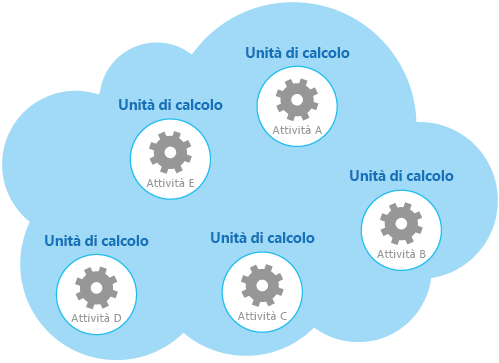

# <a name="compute-resource-consolidation-pattern"></a><span data-ttu-id="14c0d-104">Modello di consolidamento delle risorse di calcolo</span><span class="sxs-lookup"><span data-stu-id="14c0d-104">Compute Resource Consolidation pattern</span></span>

[!INCLUDE [header](../_includes/header.md)]

<span data-ttu-id="14c0d-105">Consolidare più attività o operazioni in un'unica unità di calcolo.</span><span class="sxs-lookup"><span data-stu-id="14c0d-105">Consolidate multiple tasks or operations into a single computational unit.</span></span> <span data-ttu-id="14c0d-106">Ciò può aumentare l'uso delle risorse di calcolo e ridurre il sovraccarico di gestione e i costi associati all'esecuzione di elaborazioni di calcolo in applicazioni ospitate nel cloud.</span><span class="sxs-lookup"><span data-stu-id="14c0d-106">This can increase compute resource utilization, and reduce the costs and management overhead associated with performing compute processing in cloud-hosted applications.</span></span>

## <a name="context-and-problem"></a><span data-ttu-id="14c0d-107">Contesto e problema</span><span class="sxs-lookup"><span data-stu-id="14c0d-107">Context and problem</span></span>

<span data-ttu-id="14c0d-108">Un'applicazione cloud spesso implementa una serie di operazioni.</span><span class="sxs-lookup"><span data-stu-id="14c0d-108">A cloud application often implements a variety of operations.</span></span> <span data-ttu-id="14c0d-109">In alcune soluzioni è opportuno seguire il principio di progettazione di separazione iniziale delle problematiche e dividere queste operazioni in unità di calcolo separate ospitate e distribuite singolarmente come ad esempio app Web del servizio app separate, macchine virtuali separate o ruoli del servizio Cloud separati.</span><span class="sxs-lookup"><span data-stu-id="14c0d-109">In some solutions it makes sense to follow the design principle of separation of concerns initially, and divide these operations into separate computational units that are hosted and deployed individually (for example, as separate App Service web apps, separate Virtual Machines, or separate Cloud Service roles).</span></span> <span data-ttu-id="14c0d-110">Tuttavia, sebbene questa strategia consente di semplificare la progettazione logica della soluzione, la distribuzione di un numero elevato di unità di calcolo come parte della stessa applicazione può aumentare i costi di host di runtime e rendere più complessa la gestione del sistema.</span><span class="sxs-lookup"><span data-stu-id="14c0d-110">However, although this strategy can help simplify the logical design of the solution, deploying a large number of computational units as part of the same application can increase runtime hosting costs and make management of the system more complex.</span></span>

<span data-ttu-id="14c0d-111">La figura mostra un esempio di struttura semplificata di una soluzione ospitata dal cloud implementata tramite più unità di calcolo.</span><span class="sxs-lookup"><span data-stu-id="14c0d-111">As an example, the figure shows the simplified structure of a cloud-hosted solution that is implemented using more than one computational unit.</span></span> <span data-ttu-id="14c0d-112">Ogni unità di calcolo viene eseguita nel proprio ambiente virtuale.</span><span class="sxs-lookup"><span data-stu-id="14c0d-112">Each computational unit runs in its own virtual environment.</span></span> <span data-ttu-id="14c0d-113">Ogni funzione è stata implementata come attività separata, denominata attività da A a E, in esecuzione in una specifica unità di calcolo.</span><span class="sxs-lookup"><span data-stu-id="14c0d-113">Each function has been implemented as a separate task (labeled Task A through Task E) running in its own computational unit.</span></span>



<span data-ttu-id="14c0d-115">Ogni unità di calcolo usa risorse addebitabili, anche quando è inattiva o poco usata.</span><span class="sxs-lookup"><span data-stu-id="14c0d-115">Each computational unit consumes chargeable resources, even when it's idle or lightly used.</span></span> <span data-ttu-id="14c0d-116">Pertanto, questa non è sempre la soluzione più conveniente.</span><span class="sxs-lookup"><span data-stu-id="14c0d-116">Therefore, this isn't always the most cost-effective solution.</span></span>

<span data-ttu-id="14c0d-117">In Azure, questo problema si applica ai ruoli in un Servizio Cloud, ai Servizi app e alle macchine virtuali.</span><span class="sxs-lookup"><span data-stu-id="14c0d-117">In Azure, this concern applies to roles in a Cloud Service, App Services, and Virtual Machines.</span></span> <span data-ttu-id="14c0d-118">Questi elementi vengono eseguiti nel proprio ambiente virtuale.</span><span class="sxs-lookup"><span data-stu-id="14c0d-118">These items run in their own virtual environment.</span></span> <span data-ttu-id="14c0d-119">L'esecuzione di una raccolta di ruoli separati, di siti Web o di macchine virtuali progettati per eseguire una serie di operazioni ben definite, ma che devono comunicare e cooperare come parte di una singola soluzione, può rappresentare un uso inefficiente delle risorse.</span><span class="sxs-lookup"><span data-stu-id="14c0d-119">Running a collection of separate roles, websites, or virtual machines that are designed to perform a set of well-defined operations, but that need to communicate and cooperate as part of a single solution, can be an inefficient use of resources.</span></span>

## <a name="solution"></a><span data-ttu-id="14c0d-120">Soluzione</span><span class="sxs-lookup"><span data-stu-id="14c0d-120">Solution</span></span>

<span data-ttu-id="14c0d-121">Per ridurre i costi, aumentare l'uso, migliorare la velocità di comunicazione e ridurre la gestione è possibile consolidare più attività o operazioni in una singola unità di calcolo.</span><span class="sxs-lookup"><span data-stu-id="14c0d-121">To help reduce costs, increase utilization, improve communication speed, and reduce management it's possible to consolidate multiple tasks or operations into a single computational unit.</span></span>

<span data-ttu-id="14c0d-122">Le attività possono essere raggruppate secondo criteri basati sulle funzionalità fornite dall'ambiente e ai costi ad esse associati.</span><span class="sxs-lookup"><span data-stu-id="14c0d-122">Tasks can be grouped according to criteria based on the features provided by the environment and the costs associated with these features.</span></span> <span data-ttu-id="14c0d-123">Un approccio comune consiste nel cercare attività con un profilo simile per quanto riguarda i requisiti di elaborazione, durata e scalabilità.</span><span class="sxs-lookup"><span data-stu-id="14c0d-123">A common approach is to look for tasks that have a similar profile concerning their scalability, lifetime, and processing requirements.</span></span> <span data-ttu-id="14c0d-124">Raggruppando insieme queste funzioni è possibile scalarle come un'unità.</span><span class="sxs-lookup"><span data-stu-id="14c0d-124">Grouping these together allows them to scale as a unit.</span></span> <span data-ttu-id="14c0d-125">L'elasticità fornita da molti ambienti cloud consente di avviare e arrestare istanze aggiuntive di un'unità di calcolo in base al carico di lavoro.</span><span class="sxs-lookup"><span data-stu-id="14c0d-125">The elasticity provided by many cloud environments enables additional instances of a computational unit to be started and stopped according to the workload.</span></span> <span data-ttu-id="14c0d-126">Azure offre ad esempio la scalabilità automatica che è possibile applicare ai ruoli in un servizio Cloud, ai Servizi app e alle macchine virtuali.</span><span class="sxs-lookup"><span data-stu-id="14c0d-126">For example, Azure provides autoscaling that you can apply to roles in a Cloud Service, App Services, and Virtual Machines.</span></span> <span data-ttu-id="14c0d-127">Per altre informazioni, vedere [Indicazioni sulla scalabilità automatica](https://msdn.microsoft.com/library/dn589774.aspx).</span><span class="sxs-lookup"><span data-stu-id="14c0d-127">For more information, see [Autoscaling Guidance](https://msdn.microsoft.com/library/dn589774.aspx).</span></span>

<span data-ttu-id="14c0d-128">Come esempio di contatore per illustrare come usare la scalabilità per determinare quali operazioni non devono essere raggruppate, considerare le due attività seguenti:</span><span class="sxs-lookup"><span data-stu-id="14c0d-128">As a counter example to show how scalability can be used to determine which operations shouldn't be grouped together, consider the following two tasks:</span></span>

- <span data-ttu-id="14c0d-129">L'attività 1 esegue il poll per messaggi poco frequenti indipendenti dall'orario inviati a una coda.</span><span class="sxs-lookup"><span data-stu-id="14c0d-129">Task 1 polls for infrequent, time-insensitive messages sent to a queue.</span></span>
- <span data-ttu-id="14c0d-130">L'attività 2 consente di gestire picchi di volumi elevati di traffico di rete.</span><span class="sxs-lookup"><span data-stu-id="14c0d-130">Task 2 handles high-volume bursts of network traffic.</span></span>

<span data-ttu-id="14c0d-131">La seconda attività richiede l'elasticità che può implicare l'avvio e arresto di un numero elevato di istanze dell'unità di calcolo.</span><span class="sxs-lookup"><span data-stu-id="14c0d-131">The second task requires elasticity that can involve starting and stopping a large number of instances of the computational unit.</span></span> <span data-ttu-id="14c0d-132">Applicare la stessa scalabilità alla prima attività semplicemente darà origine a più attività in attesa di messaggi non frequenti nella stessa coda e rappresenta uno spreco di risorse.</span><span class="sxs-lookup"><span data-stu-id="14c0d-132">Applying the same scaling to the first task would simply result in more tasks listening for infrequent messages on the same queue, and is a waste of resources.</span></span>

<span data-ttu-id="14c0d-133">In molti ambienti cloud è possibile specificare le risorse disponibili per un'unità di calcolo in termini di numero di core CPU, memoria, spazio su disco e così via.</span><span class="sxs-lookup"><span data-stu-id="14c0d-133">In many cloud environments it's possible to specify the resources available to a computational unit in terms of the number of CPU cores, memory, disk space, and so on.</span></span> <span data-ttu-id="14c0d-134">In genere, più sono le risorse specificate, maggiore è il costo.</span><span class="sxs-lookup"><span data-stu-id="14c0d-134">Generally, the more resources specified, the greater the cost.</span></span> <span data-ttu-id="14c0d-135">Per risparmiare, è importante ottimizzare il lavoro eseguito da un'unità di calcolo costosa e non lasciarla inattiva per un lungo periodo.</span><span class="sxs-lookup"><span data-stu-id="14c0d-135">To save money, it's important to maximize the work an expensive computational unit performs, and not let it become inactive for an extended period.</span></span>

<span data-ttu-id="14c0d-136">Se sono presenti attività che richiedono molta potenza della CPU in picchi brevi, provare a consolidare queste attività in un'unica unità di calcolo che fornisca la potenza necessaria.</span><span class="sxs-lookup"><span data-stu-id="14c0d-136">If there are tasks that require a great deal of CPU power in short bursts, consider consolidating these into a single computational unit that provides the necessary power.</span></span> <span data-ttu-id="14c0d-137">Tuttavia, è importante equilibrare la necessità di mantenere occupate le risorse costose anche in base al conflitto che si potrebbe verificare se vengono sovraccaricate.</span><span class="sxs-lookup"><span data-stu-id="14c0d-137">However, it's important to balance this need to keep expensive resources busy against the contention that could occur if they are over stressed.</span></span> <span data-ttu-id="14c0d-138">Attività con esecuzione prolungata ad elevato utilizzo di calcolo, ad esempio, non dovrebbero condividere la stessa unità di calcolo.</span><span class="sxs-lookup"><span data-stu-id="14c0d-138">Long-running, compute-intensive tasks shouldn't share the same computational unit, for example.</span></span>

## <a name="issues-and-considerations"></a><span data-ttu-id="14c0d-139">Considerazioni e problemi</span><span class="sxs-lookup"><span data-stu-id="14c0d-139">Issues and considerations</span></span>

<span data-ttu-id="14c0d-140">Prima di implementare questo modello, considerare quanto segue:</span><span class="sxs-lookup"><span data-stu-id="14c0d-140">Consider the following points when implementing this pattern:</span></span>

<span data-ttu-id="14c0d-141">**Scalabilità ed elasticità**.</span><span class="sxs-lookup"><span data-stu-id="14c0d-141">**Scalability and elasticity**.</span></span> <span data-ttu-id="14c0d-142">Molte soluzioni cloud implementano la scalabilità e l'elasticità al livello dell'unità di calcolo avviando e arrestando istanze di unità.</span><span class="sxs-lookup"><span data-stu-id="14c0d-142">Many cloud solutions implement scalability and elasticity at the level of the computational unit by starting and stopping instances of units.</span></span> <span data-ttu-id="14c0d-143">Evitare di raggruppare attività che hanno requisiti di scalabilità in conflitto nella stessa unità di calcolo.</span><span class="sxs-lookup"><span data-stu-id="14c0d-143">Avoid grouping tasks that have conflicting scalability requirements in the same computational unit.</span></span>

<span data-ttu-id="14c0d-144">**Durata**.</span><span class="sxs-lookup"><span data-stu-id="14c0d-144">**Lifetime**.</span></span> <span data-ttu-id="14c0d-145">L'infrastruttura cloud ricicla periodicamente l'ambiente virtuale che ospita un'unità di calcolo.</span><span class="sxs-lookup"><span data-stu-id="14c0d-145">The cloud infrastructure periodically recycles the virtual environment that hosts a computational unit.</span></span> <span data-ttu-id="14c0d-146">Quando sono presenti molte attività a esecuzione prolungata all'interno di un'unità di calcolo, potrebbe essere necessario configurare l'unità per impedire che venga riciclata fino al completamento queste attività.</span><span class="sxs-lookup"><span data-stu-id="14c0d-146">When there are many long-running tasks inside a computational unit, it might be necessary to configure the unit to prevent it from being recycled until these tasks have finished.</span></span> <span data-ttu-id="14c0d-147">In alternativa, è possibile progettare le attività usando un approccio checkpoint che consente loro di arrestarsi normalmente e continuare dal punto di interruzione quando l'unità di calcolo viene riavviata.</span><span class="sxs-lookup"><span data-stu-id="14c0d-147">Alternatively, design the tasks by using a check-pointing approach that enables them to stop cleanly, and continue at the point they were interrupted when the computational unit is restarted.</span></span>

<span data-ttu-id="14c0d-148">**Versioni**.</span><span class="sxs-lookup"><span data-stu-id="14c0d-148">**Release cadence**.</span></span> <span data-ttu-id="14c0d-149">Se l'implementazione o la configurazione di un'attività viene modificata di frequente, potrebbe essere necessario arrestare l'unità di calcolo che ospita il codice aggiornato, riconfigurare e ridistribuire l'unità e quindi riavviarla.</span><span class="sxs-lookup"><span data-stu-id="14c0d-149">If the implementation or configuration of a task changes frequently, it might be necessary to stop the computational unit hosting the updated code, reconfigure and redeploy the unit, and then restart it.</span></span> <span data-ttu-id="14c0d-150">Questo processo richiederà inoltre che tutte le altre attività all'interno della stessa unità di calcolo siano arrestate, ridistribuite e riavviate.</span><span class="sxs-lookup"><span data-stu-id="14c0d-150">This process will also require that all other tasks within the same computational unit are stopped, redeployed, and restarted.</span></span>

<span data-ttu-id="14c0d-151">**Sicurezza**.</span><span class="sxs-lookup"><span data-stu-id="14c0d-151">**Security**.</span></span> <span data-ttu-id="14c0d-152">Le attività nella stessa unità di calcolo possono condividere lo stesso contesto di protezione ed essere in grado di accedere alle stesse risorse.</span><span class="sxs-lookup"><span data-stu-id="14c0d-152">Tasks in the same computational unit might share the same security context and be able to access the same resources.</span></span> <span data-ttu-id="14c0d-153">Deve essere presente un elevato livello di attendibilità tra le attività e la sicurezza che un'attività non danneggia o influisce negativamente su un'altra.</span><span class="sxs-lookup"><span data-stu-id="14c0d-153">There must be a high degree of trust between the tasks, and confidence that one task isn't going to corrupt or adversely affect another.</span></span> <span data-ttu-id="14c0d-154">Inoltre, aumentando il numero di attività in esecuzione in un'unità di calcolo si aumenta la superficie di attacco dell'unità.</span><span class="sxs-lookup"><span data-stu-id="14c0d-154">Additionally, increasing the number of tasks running in a computational unit increases the attack surface of the unit.</span></span> <span data-ttu-id="14c0d-155">Ciascuna attività è protetta nello stesso modo di una particolarmente vulnerabile.</span><span class="sxs-lookup"><span data-stu-id="14c0d-155">Each task is only as secure as the one with the most vulnerabilities.</span></span>

<span data-ttu-id="14c0d-156">**Tolleranza di errore**.</span><span class="sxs-lookup"><span data-stu-id="14c0d-156">**Fault tolerance**.</span></span> <span data-ttu-id="14c0d-157">Se un'attività in un'unità di calcolo non riesce o si comporta in modo anomalo, può influire sulle altre attività in esecuzione nella stessa unità.</span><span class="sxs-lookup"><span data-stu-id="14c0d-157">If one task in a computational unit fails or behaves abnormally, it can affect the other tasks running within the same unit.</span></span> <span data-ttu-id="14c0d-158">Se ad esempio un'attività non viene avviata correttamente, può causare un errore di tutta la logica di avvio dell'unità di calcolo e impedire l'esecuzione di altre attività nella stessa unità.</span><span class="sxs-lookup"><span data-stu-id="14c0d-158">For example, if one task fails to start correctly it can cause the entire startup logic for the computational unit to fail, and prevent other tasks in the same unit from running.</span></span>

<span data-ttu-id="14c0d-159">**Contesa**.</span><span class="sxs-lookup"><span data-stu-id="14c0d-159">**Contention**.</span></span> <span data-ttu-id="14c0d-160">Evitare di introdurre contese tra le attività che si contendono le risorse nella stessa unità di calcolo.</span><span class="sxs-lookup"><span data-stu-id="14c0d-160">Avoid introducing contention between tasks that compete for resources in the same computational unit.</span></span> <span data-ttu-id="14c0d-161">In teoria, le attività che condividono la stessa unità di calcolo devono presentare caratteristiche di uso diverso delle risorse.</span><span class="sxs-lookup"><span data-stu-id="14c0d-161">Ideally, tasks that share the same computational unit should exhibit different resource utilization characteristics.</span></span> <span data-ttu-id="14c0d-162">Ad esempio, due attività a elevato utilizzo di calcolo probabilmente non dovrebbero trovarsi nella stessa unità di calcolo, così come due attività che usano grandi quantità di memoria.</span><span class="sxs-lookup"><span data-stu-id="14c0d-162">For example, two compute-intensive tasks should probably not reside in the same computational unit, and neither should two tasks that consume large amounts of memory.</span></span> <span data-ttu-id="14c0d-163">Tuttavia, la combinazione di un'attività ad elevato utilizzo di calcolo con un'attività che richiede una grande quantità di memoria è una combinazione possibile.</span><span class="sxs-lookup"><span data-stu-id="14c0d-163">However, mixing a compute intensive task with a task that requires a large amount of memory is a workable combination.</span></span>

> [!NOTE]
> <span data-ttu-id="14c0d-164">Prendere in considerazione il consolidamento delle risorse di calcolo solo per un sistema che sia stato in produzione per un periodo di tempo, in modo che gli operatori e gli sviluppatori possono monitorarlo e creare una _mappa termica_ che identifichi come ogni attività usa risorse diverse.</span><span class="sxs-lookup"><span data-stu-id="14c0d-164">Consider consolidating compute resources only for a system that's been in production for a period of time so that operators and developers can monitor the system and create a _heat map_ that identifies how each task utilizes differing resources.</span></span> <span data-ttu-id="14c0d-165">Questa mappa consente di determinare quali attività sono candidati validi per la condivisione delle risorse di calcolo.</span><span class="sxs-lookup"><span data-stu-id="14c0d-165">This map can be used to determine which tasks are good candidates for sharing compute resources.</span></span>

<span data-ttu-id="14c0d-166">**Complessità**.</span><span class="sxs-lookup"><span data-stu-id="14c0d-166">**Complexity**.</span></span> <span data-ttu-id="14c0d-167">La combinazione di più attività in una singola unità di calcolo aggiunge complessità al codice dell'unità, rendendolo più difficile da testare, eseguire il debug e gestire.</span><span class="sxs-lookup"><span data-stu-id="14c0d-167">Combining multiple tasks into a single computational unit adds complexity to the code in the unit, possibly making it more difficult to test, debug, and maintain.</span></span>

<span data-ttu-id="14c0d-168">**Architettura logica stabile**.</span><span class="sxs-lookup"><span data-stu-id="14c0d-168">**Stable logical architecture**.</span></span> <span data-ttu-id="14c0d-169">Progettare e implementare il codice in ogni attività in modo che non siano necessarie modifiche, anche se viene modificato l'ambiente fisico che in cui viene eseguita l'attività.</span><span class="sxs-lookup"><span data-stu-id="14c0d-169">Design and implement the code in each task so that it shouldn't need to change, even if the physical environment the task runs in does change.</span></span>

<span data-ttu-id="14c0d-170">**Altre strategie**.</span><span class="sxs-lookup"><span data-stu-id="14c0d-170">**Other strategies**.</span></span> <span data-ttu-id="14c0d-171">Il consolidamento delle risorse di calcolo è solo un modo per ridurre i costi associati all'esecuzione di più attività contemporaneamente.</span><span class="sxs-lookup"><span data-stu-id="14c0d-171">Consolidating compute resources is only one way to help reduce costs associated with running multiple tasks concurrently.</span></span> <span data-ttu-id="14c0d-172">Richiede un'attenta pianificazione e monitoraggio per verificare che continui a essere un approccio efficace.</span><span class="sxs-lookup"><span data-stu-id="14c0d-172">It requires careful planning and monitoring to ensure that it remains an effective approach.</span></span> <span data-ttu-id="14c0d-173">Altre strategie potrebbero essere più appropriate, a seconda della natura delle attività e a dove si trovano gli utenti che eseguono queste attività.</span><span class="sxs-lookup"><span data-stu-id="14c0d-173">Other strategies might be more appropriate, depending on the nature of the work and where the users these tasks are running are located.</span></span> <span data-ttu-id="14c0d-174">La scomposizione funzionale del carico di lavoro, ad esempio, (come descritto in [Compute Partitioning Guidance](https://msdn.microsoft.com/library/dn589773.aspx) (Indicazioni per il partizionamento dei servizi di calcolo)) potrebbe essere un'opzione migliore.</span><span class="sxs-lookup"><span data-stu-id="14c0d-174">For example, functional decomposition of the workload (as described by the [Compute Partitioning Guidance](https://msdn.microsoft.com/library/dn589773.aspx)) might be a better option.</span></span>

## <a name="when-to-use-this-pattern"></a><span data-ttu-id="14c0d-175">Quando usare questo modello</span><span class="sxs-lookup"><span data-stu-id="14c0d-175">When to use this pattern</span></span>

<span data-ttu-id="14c0d-176">Usare questo modello per attività che non sono convenienti se eseguite nelle rispettive unità di calcolo.</span><span class="sxs-lookup"><span data-stu-id="14c0d-176">Use this pattern for tasks that are not cost effective if they run in their own computational units.</span></span> <span data-ttu-id="14c0d-177">Se un'attività è inattiva per molto tempo, l'esecuzione dell'attività in un'unità dedicata può essere costosa.</span><span class="sxs-lookup"><span data-stu-id="14c0d-177">If a task spends much of its time idle, running this task in a dedicated unit can be expensive.</span></span>

<span data-ttu-id="14c0d-178">Questo modello potrebbe non essere adatto per le attività che eseguono operazioni a tolleranza di errore critica o attività che elaborano dati altamente sensibili o riservati e richiedono un proprio contesto di protezione.</span><span class="sxs-lookup"><span data-stu-id="14c0d-178">This pattern might not be suitable for tasks that perform critical fault-tolerant operations, or tasks that process highly sensitive or private data and require their own security context.</span></span> <span data-ttu-id="14c0d-179">Queste attività devono essere eseguite nel proprio ambiente isolato, in un'unità di calcolo separata.</span><span class="sxs-lookup"><span data-stu-id="14c0d-179">These tasks should run in their own isolated environment, in a separate computational unit.</span></span>

## <a name="example"></a><span data-ttu-id="14c0d-180">Esempio</span><span class="sxs-lookup"><span data-stu-id="14c0d-180">Example</span></span>

<span data-ttu-id="14c0d-181">Quando si compila un servizio cloud in Azure, è possibile consolidare l'elaborazione eseguita da più attività in un unico ruolo.</span><span class="sxs-lookup"><span data-stu-id="14c0d-181">When building a cloud service on Azure, it’s possible to consolidate the processing performed by multiple tasks into a single role.</span></span> <span data-ttu-id="14c0d-182">In genere si tratta di un ruolo di lavoro che esegue attività di elaborazione asincrona o in background.</span><span class="sxs-lookup"><span data-stu-id="14c0d-182">Typically this is a worker role that performs background or asynchronous processing tasks.</span></span>

> <span data-ttu-id="14c0d-183">In alcuni casi è possibile includere attività di elaborazione asincrona o in background nel ruolo Web.</span><span class="sxs-lookup"><span data-stu-id="14c0d-183">In some cases it's possible to include background or asynchronous processing tasks in the web role.</span></span> <span data-ttu-id="14c0d-184">Questa tecnica consente di ridurre i costi e semplificare la distribuzione, anche se può ridurre la scalabilità e la velocità di risposta dell'interfaccia pubblica disponibile per il ruolo Web.</span><span class="sxs-lookup"><span data-stu-id="14c0d-184">This technique helps to reduce costs and simplify deployment, although it can impact the scalability and responsiveness of the public-facing interface provided by the web role.</span></span>

<span data-ttu-id="14c0d-185">Il ruolo è responsabile di avviare e arrestare le attività.</span><span class="sxs-lookup"><span data-stu-id="14c0d-185">The role is responsible for starting and stopping the tasks.</span></span> <span data-ttu-id="14c0d-186">Quando il controller di infrastruttura di Azure carica un ruolo, viene generato l'evento `Start` per il ruolo.</span><span class="sxs-lookup"><span data-stu-id="14c0d-186">When the Azure fabric controller loads a role, it raises the `Start` event for the role.</span></span> <span data-ttu-id="14c0d-187">È possibile eseguire l'override del metodo `OnStart` della classe `WebRole` o `WorkerRole` per gestire questo evento, ad esempio per inizializzare i dati e altre risorse da cui dipendono le attività di questo metodo.</span><span class="sxs-lookup"><span data-stu-id="14c0d-187">You can override the `OnStart` method of the `WebRole` or `WorkerRole` class to handle this event, perhaps to initialize the data and other resources the tasks in this method depend on.</span></span>

<span data-ttu-id="14c0d-188">Quando il metodo `OnStart` viene completato, il ruolo può iniziare a rispondere alle richieste.</span><span class="sxs-lookup"><span data-stu-id="14c0d-188">When the `OnStart` method completes, the role can start responding to requests.</span></span> <span data-ttu-id="14c0d-189">È possibile trovare altre informazioni e istruzioni sull'uso dei metodi `OnStart` e `Run` in un ruolo nella sezione [Application Startup Processes](https://msdn.microsoft.com/library/ff803371.aspx#sec16) (Processi di avvio dell'applicazione) nel manuale dei modelli e procedure [Moving Applications to the Cloud](https://msdn.microsoft.com/library/ff728592.aspx) (Spostamento di applicazioni nel Cloud).</span><span class="sxs-lookup"><span data-stu-id="14c0d-189">You can find more information and guidance about using the `OnStart` and `Run` methods in a role in the [Application Startup Processes](https://msdn.microsoft.com/library/ff803371.aspx#sec16) section in the patterns & practices guide [Moving Applications to the Cloud](https://msdn.microsoft.com/library/ff728592.aspx).</span></span>

> <span data-ttu-id="14c0d-190">Mantenere il codice nel metodo `OnStart` il più conciso possibile.</span><span class="sxs-lookup"><span data-stu-id="14c0d-190">Keep the code in the `OnStart` method as concise as possible.</span></span> <span data-ttu-id="14c0d-191">Azure non impone alcun limite per il tempo impiegato per completare questo metodo, ma il ruolo non sarà in grado di rispondere alle richieste di rete inviate fino al completamento del metodo.</span><span class="sxs-lookup"><span data-stu-id="14c0d-191">Azure doesn't impose any limit on the time taken for this method to complete, but the role won't be able to start responding to network requests sent to it until this method completes.</span></span>

<span data-ttu-id="14c0d-192">Quando il metodo `OnStart` ha terminato, il ruolo esegue il metodo `Run`.</span><span class="sxs-lookup"><span data-stu-id="14c0d-192">When the `OnStart` method has finished, the role executes the `Run` method.</span></span> <span data-ttu-id="14c0d-193">A questo punto il controller di infrastruttura può iniziare a inviare le richieste al ruolo.</span><span class="sxs-lookup"><span data-stu-id="14c0d-193">At this point, the fabric controller can start sending requests to the role.</span></span>

<span data-ttu-id="14c0d-194">Inserire il codice che crea effettivamente le attività nel metodo `Run`.</span><span class="sxs-lookup"><span data-stu-id="14c0d-194">Place the code that actually creates the tasks in the `Run` method.</span></span> <span data-ttu-id="14c0d-195">Si noti che il metodo `Run` definisce la durata dell'istanza del ruolo.</span><span class="sxs-lookup"><span data-stu-id="14c0d-195">Note that the `Run` method defines the lifetime of the role instance.</span></span> <span data-ttu-id="14c0d-196">Quando questo metodo viene completato, il controller di infrastruttura arresterà il ruolo.</span><span class="sxs-lookup"><span data-stu-id="14c0d-196">When this method completes, the fabric controller will arrange for the role to be shut down.</span></span>

<span data-ttu-id="14c0d-197">Quando un ruolo viene arrestato o riciclato, il controller di infrastruttura blocca la ricezione di altre richieste in ingresso dal servizio di bilanciamento del carico e genera l'evento `Stop`.</span><span class="sxs-lookup"><span data-stu-id="14c0d-197">When a role shuts down or is recycled, the fabric controller prevents any more incoming requests being received from the load balancer and raises the `Stop` event.</span></span> <span data-ttu-id="14c0d-198">È possibile acquisire questo evento eseguendo l'override del metodo `OnStop` del ruolo ed eseguendo qualsiasi operazione di riordino necessaria prima che il ruolo termini.</span><span class="sxs-lookup"><span data-stu-id="14c0d-198">You can capture this event by overriding the `OnStop` method of the role and perform any tidying up required before the role terminates.</span></span>

> <span data-ttu-id="14c0d-199">Eventuali azioni eseguite nel metodo `OnStop` devono essere completate entro cinque minuti (o 30 secondi se si usa l'emulatore di Azure in un computer locale).</span><span class="sxs-lookup"><span data-stu-id="14c0d-199">Any actions performed in the `OnStop` method must be completed within five minutes (or 30 seconds if you are using the Azure emulator on a local computer).</span></span> <span data-ttu-id="14c0d-200">In caso contrario il controller di infrastruttura di Azure presuppone che il ruolo sia bloccato e ne forza l'arresto.</span><span class="sxs-lookup"><span data-stu-id="14c0d-200">Otherwise the Azure fabric controller assumes that the role has stalled and will force it to stop.</span></span>

<span data-ttu-id="14c0d-201">Le attività sono avviate dal metodo `Run` che attende il completamento delle attività.</span><span class="sxs-lookup"><span data-stu-id="14c0d-201">The tasks are started by the `Run` method that waits for the tasks to complete.</span></span> <span data-ttu-id="14c0d-202">Le attività implementano la logica di business del servizio cloud e possono rispondere a messaggi inviati al ruolo tramite il bilanciamento del carico di Azure.</span><span class="sxs-lookup"><span data-stu-id="14c0d-202">The tasks implement the business logic of the cloud service, and can respond to messages posted to the role through the Azure load balancer.</span></span> <span data-ttu-id="14c0d-203">La figura illustra il ciclo di vita delle attività e delle risorse in un ruolo in un servizio cloud di Azure.</span><span class="sxs-lookup"><span data-stu-id="14c0d-203">The figure shows the lifecycle of tasks and resources in a role in an Azure cloud service.</span></span>


<span data-ttu-id="14c0d-205">Il file _WorkerRole.cs_ nel progetto _ComputeResourceConsolidation.Worker_ mostra un esempio di come è possibile implementare questo modello in un servizio cloud di Azure.</span><span class="sxs-lookup"><span data-stu-id="14c0d-205">The _WorkerRole.cs_ file in the _ComputeResourceConsolidation.Worker_ project shows an example of how you might implement this pattern in an Azure cloud service.</span></span>

> <span data-ttu-id="14c0d-206">Il progetto _ComputeResourceConsolidation.Worker_ fa parte della soluzione _ComputeResourceConsolidation_ disponibile per il download da [GitHub](https://github.com/mspnp/cloud-design-patterns/tree/master/compute-resource-consolidation).</span><span class="sxs-lookup"><span data-stu-id="14c0d-206">The _ComputeResourceConsolidation.Worker_ project is part of the _ComputeResourceConsolidation_ solution available for download from [GitHub](https://github.com/mspnp/cloud-design-patterns/tree/master/compute-resource-consolidation).</span></span>

<span data-ttu-id="14c0d-207">I metodi `MyWorkerTask1` e `MyWorkerTask2` illustrano come eseguire attività diverse all'interno dello stesso ruolo di lavoro.</span><span class="sxs-lookup"><span data-stu-id="14c0d-207">The `MyWorkerTask1` and the `MyWorkerTask2` methods illustrate how to perform different tasks within the same worker role.</span></span> <span data-ttu-id="14c0d-208">Il codice seguente mostra `MyWorkerTask1`.</span><span class="sxs-lookup"><span data-stu-id="14c0d-208">The following code shows `MyWorkerTask1`.</span></span> <span data-ttu-id="14c0d-209">Si tratta di un'attività semplice che resta inattiva per 30 secondi e quindi restituisce un messaggio di traccia.</span><span class="sxs-lookup"><span data-stu-id="14c0d-209">This is a simple task that sleeps for 30 seconds and then outputs a trace message.</span></span> <span data-ttu-id="14c0d-210">Questo processo viene ripetuto fino a quando l'attività viene annullata.</span><span class="sxs-lookup"><span data-stu-id="14c0d-210">It repeats this process until the task is canceled.</span></span> <span data-ttu-id="14c0d-211">Il codice in `MyWorkerTask2` è simile.</span><span class="sxs-lookup"><span data-stu-id="14c0d-211">The code in `MyWorkerTask2` is similar.</span></span>

```csharp
// A sample worker role task.
private static async Task MyWorkerTask1(CancellationToken ct)
{
  // Fixed interval to wake up and check for work and/or do work.
  var interval = TimeSpan.FromSeconds(30);

  try
  {
    while (!ct.IsCancellationRequested)
    {
      // Wake up and do some background processing if not canceled.
      // TASK PROCESSING CODE HERE
      Trace.TraceInformation("Doing Worker Task 1 Work");

      // Go back to sleep for a period of time unless asked to cancel.
      // Task.Delay will throw an OperationCanceledException when canceled.
      await Task.Delay(interval, ct);
    }
  }
  catch (OperationCanceledException)
  {
    // Expect this exception to be thrown in normal circumstances or check
    // the cancellation token. If the role instances are shutting down, a
    // cancellation request will be signaled.
    Trace.TraceInformation("Stopping service, cancellation requested");

    // Rethrow the exception.
    throw;
  }
}
```

> <span data-ttu-id="14c0d-212">Il codice di esempio illustra un'implementazione comune di un processo in background.</span><span class="sxs-lookup"><span data-stu-id="14c0d-212">The sample code shows a common implementation of a background process.</span></span> <span data-ttu-id="14c0d-213">In un'applicazione reale è possibile seguire la stessa struttura, ad eccezione del fatto che è necessario inserire la propria logica di elaborazione nel corpo del ciclo che attende la richiesta di annullamento.</span><span class="sxs-lookup"><span data-stu-id="14c0d-213">In a real world application you can follow this same structure, except that you should place your own processing logic in the body of the loop that waits for the cancellation request.</span></span>

<span data-ttu-id="14c0d-214">Dopo che il ruolo di lavoro ha inizializzato le risorse che usa, il metodo `Run` avvia le due attività contemporaneamente, come illustrato di seguito.</span><span class="sxs-lookup"><span data-stu-id="14c0d-214">After the worker role has initialized the resources it uses, the `Run` method starts the two tasks concurrently, as shown here.</span></span>

```csharp
/// <summary>
/// The cancellation token source use to cooperatively cancel running tasks
/// </summary>
private readonly CancellationTokenSource cts = new CancellationTokenSource();

/// <summary>
/// List of running tasks on the role instance
/// </summary>
private readonly List<Task> tasks = new List<Task>();

// RoleEntry Run() is called after OnStart().
// Returning from Run() will cause a role instance to recycle.
public override void Run()
{
  // Start worker tasks and add to the task list
  tasks.Add(MyWorkerTask1(cts.Token));
  tasks.Add(MyWorkerTask2(cts.Token));

  foreach (var worker in this.workerTasks)
  {
      this.tasks.Add(worker);
  }

  Trace.TraceInformation("Worker host tasks started");
  // The assumption is that all tasks should remain running and not return,
  // similar to role entry Run() behavior.
  try
  {
    Task.WaitAll(tasks.ToArray());
  }
  catch (AggregateException ex)
  {
    Trace.TraceError(ex.Message);

    // If any of the inner exceptions in the aggregate exception
    // are not cancellation exceptions then re-throw the exception.
    ex.Handle(innerEx => (innerEx is OperationCanceledException));
  }

  // If there wasn't a cancellation request, stop all tasks and return from Run()
  // An alternative to canceling and returning when a task exits would be to
  // restart the task.
  if (!cts.IsCancellationRequested)
  {
    Trace.TraceInformation("Task returned without cancellation request");
    Stop(TimeSpan.FromMinutes(5));
  }
}
...
```

<span data-ttu-id="14c0d-215">In questo esempio, il metodo `Run` attende il completamento delle attività.</span><span class="sxs-lookup"><span data-stu-id="14c0d-215">In this example, the `Run` method waits for tasks to be completed.</span></span> <span data-ttu-id="14c0d-216">Se un'attività viene annullata, il metodo `Run` presuppone che il ruolo viene arrestato e attende che le attività rimanenti vengano annullate prima di terminare (resta in attesa per un massimo di cinque minuti prima della chiusura).</span><span class="sxs-lookup"><span data-stu-id="14c0d-216">If a task is canceled, the `Run` method assumes that the role is being shut down and waits for the remaining tasks to be canceled before finishing (it waits for a maximum of five minutes before terminating).</span></span> <span data-ttu-id="14c0d-217">Se un'attività ha esito negativo a causa di un'eccezione prevista, il metodo `Run` annulla l'attività.</span><span class="sxs-lookup"><span data-stu-id="14c0d-217">If a task fails due to an expected exception, the `Run` method cancels the task.</span></span>

> <span data-ttu-id="14c0d-218">È possibile implementare un monitoraggio e strategie di gestione delle eccezioni più completi nel metodo `Run` come ad esempio il riavvio di attività non riuscite o includere codice che abilita il ruolo ad arrestare e avviare le singole attività.</span><span class="sxs-lookup"><span data-stu-id="14c0d-218">You could implement more comprehensive monitoring and exception handling strategies in the `Run` method such as restarting tasks that have failed, or including code that enables the role to stop and start individual tasks.</span></span>

<span data-ttu-id="14c0d-219">Il metodo `Stop` illustrato nel codice seguente viene chiamato quando il controller di infrastruttura arresta l'istanza del ruolo (viene richiamato dal metodo `OnStop`).</span><span class="sxs-lookup"><span data-stu-id="14c0d-219">The `Stop` method shown in the following code is called when the fabric controller shuts down the role instance (it's invoked from the `OnStop` method).</span></span> <span data-ttu-id="14c0d-220">Il codice interrompe ogni attività annullandola.</span><span class="sxs-lookup"><span data-stu-id="14c0d-220">The code stops each task gracefully by canceling it.</span></span> <span data-ttu-id="14c0d-221">Se qualsiasi attività richiede più di cinque minuti per il completamento, l'operazione di annullamento nel metodo `Stop` smette di attendere e il ruolo viene terminato.</span><span class="sxs-lookup"><span data-stu-id="14c0d-221">If any task takes more than five minutes to complete, the cancellation processing in the `Stop` method ceases waiting and the role is terminated.</span></span>

```csharp
// Stop running tasks and wait for tasks to complete before returning
// unless the timeout expires.
private void Stop(TimeSpan timeout)
{
  Trace.TraceInformation("Stop called. Canceling tasks.");
  // Cancel running tasks.
  cts.Cancel();

  Trace.TraceInformation("Waiting for canceled tasks to finish and return");

  // Wait for all the tasks to complete before returning. Note that the
  // emulator currently allows 30 seconds and Azure allows five
  // minutes for processing to complete.
  try
  {
    Task.WaitAll(tasks.ToArray(), timeout);
  }
  catch (AggregateException ex)
  {
    Trace.TraceError(ex.Message);

    // If any of the inner exceptions in the aggregate exception
    // are not cancellation exceptions then rethrow the exception.
    ex.Handle(innerEx => (innerEx is OperationCanceledException));
  }
}
```

## <a name="related-patterns-and-guidance"></a><span data-ttu-id="14c0d-222">Modelli correlati e informazioni aggiuntive</span><span class="sxs-lookup"><span data-stu-id="14c0d-222">Related patterns and guidance</span></span>

<span data-ttu-id="14c0d-223">Per l'implementazione di questo modello possono risultare utili i modelli e le informazioni aggiuntive seguenti:</span><span class="sxs-lookup"><span data-stu-id="14c0d-223">The following patterns and guidance might also be relevant when implementing this pattern:</span></span>

- <span data-ttu-id="14c0d-224">[Scalabilità automatica](https://msdn.microsoft.com/library/dn589774.aspx).</span><span class="sxs-lookup"><span data-stu-id="14c0d-224">[Autoscaling Guidance](https://msdn.microsoft.com/library/dn589774.aspx).</span></span> <span data-ttu-id="14c0d-225">La scalabilità automatica consente di avviare e arrestare le istanze del servizio che ospita le risorse di calcolo, a seconda delle necessità di elaborazione previste.</span><span class="sxs-lookup"><span data-stu-id="14c0d-225">Autoscaling can be used to start and stop instances of service hosting computational resources, depending on the anticipated demand for processing.</span></span>

- <span data-ttu-id="14c0d-226">[Compute Partitioning Guidance](https://msdn.microsoft.com/library/dn589773.aspx) (Indicazioni per il partizionamento dei servizi di calcolo)</span><span class="sxs-lookup"><span data-stu-id="14c0d-226">[Compute Partitioning Guidance](https://msdn.microsoft.com/library/dn589773.aspx).</span></span> <span data-ttu-id="14c0d-227">Descrive come allocare i servizi e i componenti in un servizio cloud in modo da ridurre al minimo i costi operativi mantenendo la scalabilità, le prestazioni, la disponibilità e la sicurezza del servizio.</span><span class="sxs-lookup"><span data-stu-id="14c0d-227">Describes how to allocate the services and components in a cloud service in a way that helps to minimize running costs while maintaining the scalability, performance, availability, and security of the service.</span></span>

- <span data-ttu-id="14c0d-228">Questo modello include un'[applicazione di esempio](https://github.com/mspnp/cloud-design-patterns/tree/master/compute-resource-consolidation) scaricabile.</span><span class="sxs-lookup"><span data-stu-id="14c0d-228">This pattern includes a downloadable [sample application](https://github.com/mspnp/cloud-design-patterns/tree/master/compute-resource-consolidation).</span></span>
