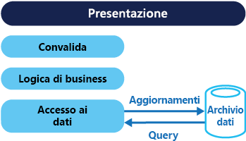
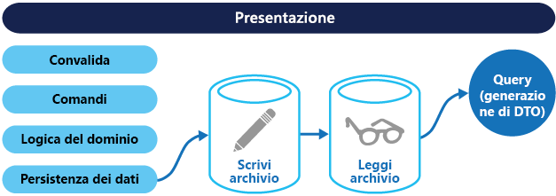

# <a name="command-and-query-responsibility-segregation-cqrs-pattern"></a><span data-ttu-id="364e7-104">Modello di separazione di responsabilità per query e comandi (CQRS, Command and Query Responsibility Segregation)</span><span class="sxs-lookup"><span data-stu-id="364e7-104">Command and Query Responsibility Segregation (CQRS) pattern</span></span>

[!INCLUDE [header](../_includes/header.md)]

<span data-ttu-id="364e7-105">Consente di segregare le operazioni di lettura dei dati dalle operazioni di aggiornamento dei dati attraverso l'utilizzo di interfacce separate.</span><span class="sxs-lookup"><span data-stu-id="364e7-105">Segregate operations that read data from operations that update data by using separate interfaces.</span></span> <span data-ttu-id="364e7-106">In questo modo è possibile ottimizzare prestazioni, scalabilità e sicurezza,</span><span class="sxs-lookup"><span data-stu-id="364e7-106">This can maximize performance, scalability, and security.</span></span> <span data-ttu-id="364e7-107">supportare l'evoluzione del sistema nel tempo grazie a una maggiore flessibilità e impedire che i comandi di aggiornamento provochino conflitti di unione a livello di dominio.</span><span class="sxs-lookup"><span data-stu-id="364e7-107">Supports the evolution of the system over time through higher flexibility, and prevent update commands from causing merge conflicts at the domain level.</span></span>

## <a name="context-and-problem"></a><span data-ttu-id="364e7-108">Contesto e problema</span><span class="sxs-lookup"><span data-stu-id="364e7-108">Context and problem</span></span>

<span data-ttu-id="364e7-109">Nei sistemi di gestione dati tradizionali sia i comandi (aggiornamenti dei dati) che le query (richieste di dati) vengono eseguiti nello stesso set di entità in un repository di dati singolo.</span><span class="sxs-lookup"><span data-stu-id="364e7-109">In traditional data management systems, both commands (updates to the data) and queries (requests for data) are executed against the same set of entities in a single data repository.</span></span> <span data-ttu-id="364e7-110">Tali entità possono essere un subset di righe di una o più tabelle in un database relazionale, ad esempio SQL Server.</span><span class="sxs-lookup"><span data-stu-id="364e7-110">These entities can be a subset of the rows in one or more tables in a relational database such as SQL Server.</span></span>

<span data-ttu-id="364e7-111">In questi sistemi tutte le operazioni di creazione, lettura, aggiornamento ed eliminazione (CRUD, Create, Read, Update, Delete) vengono in genere applicate alla stessa rappresentazione dell'entità.</span><span class="sxs-lookup"><span data-stu-id="364e7-111">Typically in these systems, all create, read, update, and delete (CRUD) operations are applied to the same representation of the entity.</span></span> <span data-ttu-id="364e7-112">Un oggetto di trasferimento dati (DTO, Data Transfer Object) che rappresenta un cliente viene recuperato ad esempio dall'archivio dati a livello di accesso ai dati (DAL, Data Access Layer) e visualizzato sullo schermo.</span><span class="sxs-lookup"><span data-stu-id="364e7-112">For example, a data transfer object (DTO) representing a customer is retrieved from the data store by the data access layer (DAL) and displayed on the screen.</span></span> <span data-ttu-id="364e7-113">Un utente aggiorna alcuni campi dell'oggetto DTO (ad esempio tramite data binding) e quest'ultimo viene salvato nuovamente nell'archivio dati a livello DAL.</span><span class="sxs-lookup"><span data-stu-id="364e7-113">A user updates some fields of the DTO (perhaps through data binding) and the DTO is then saved back in the data store by the DAL.</span></span> <span data-ttu-id="364e7-114">Lo stesso oggetto DTO viene usato per entrambe le operazioni di lettura e scrittura.</span><span class="sxs-lookup"><span data-stu-id="364e7-114">The same DTO is used for both the read and write operations.</span></span> <span data-ttu-id="364e7-115">La figura illustra un'architettura CRUD tradizionale.</span><span class="sxs-lookup"><span data-stu-id="364e7-115">The figure illustrates a traditional CRUD architecture.</span></span>



<span data-ttu-id="364e7-117">I progetti CRUD tradizionali funzionano bene solo quando alle operazioni sui dati viene applicata logica di business limitata.</span><span class="sxs-lookup"><span data-stu-id="364e7-117">Traditional CRUD designs work well when only limited business logic is applied to the data operations.</span></span> <span data-ttu-id="364e7-118">I meccanismi di scaffolding presenti negli strumenti di sviluppo possono creare molto rapidamente codice di accesso ai dati, che può quindi essere personalizzato in base alle esigenze.</span><span class="sxs-lookup"><span data-stu-id="364e7-118">Scaffold mechanisms provided by development tools can create data access code very quickly, which can then be customized as required.</span></span>

<span data-ttu-id="364e7-119">L'approccio CRUD tradizionale presenta tuttavia alcuni svantaggi:</span><span class="sxs-lookup"><span data-stu-id="364e7-119">However, the traditional CRUD approach has some disadvantages:</span></span>

- <span data-ttu-id="364e7-120">Indica spesso una mancata corrispondenza tra le rappresentazioni in lettura e scrittura dei dati, ad esempio colonne aggiuntive o proprietà che devono essere aggiornate correttamente anche se non sono necessarie come parte di un'operazione.</span><span class="sxs-lookup"><span data-stu-id="364e7-120">It often means that there's a mismatch between the read and write representations of the data, such as additional columns or properties that must be updated correctly even though they aren't required as part of an operation.</span></span>

- <span data-ttu-id="364e7-121">Si verificano conflitti di dati quando i record sono bloccati nell'archivio dati in un dominio di collaborazione, dove più attori operano in parallelo sullo stesso set di dati,</span><span class="sxs-lookup"><span data-stu-id="364e7-121">It risks data contention when records are locked in the data store in a collaborative domain, where multiple actors operate in parallel on the same set of data.</span></span> <span data-ttu-id="364e7-122">oppure conflitti di aggiornamento provocati dagli aggiornamenti simultanei quando si usa il blocco ottimistico.</span><span class="sxs-lookup"><span data-stu-id="364e7-122">Or update conflicts caused by concurrent updates when optimistic locking is used.</span></span> <span data-ttu-id="364e7-123">Tali rischi aumentano in modo proporzionale all'incremento della complessità e della velocità effettiva del sistema.</span><span class="sxs-lookup"><span data-stu-id="364e7-123">These risks increase as the complexity and throughput of the system grows.</span></span> <span data-ttu-id="364e7-124">L'approccio tradizionale può avere anche un effetto negativo sulle prestazioni dovuto al carico sull'archivio dati e sul livello di accesso ai dati e alla complessità delle query necessarie per recuperare informazioni.</span><span class="sxs-lookup"><span data-stu-id="364e7-124">In addition, the traditional approach can have a negative effect on performance due to load on the data store and data access layer, and the complexity of queries required to retrieve information.</span></span>

- <span data-ttu-id="364e7-125">La gestione della sicurezza e delle autorizzazioni può diventare più complessa perché ogni entità è sottoposta a operazioni di lettura e scrittura, con possibile esposizione dei dati in un contesto non corretto.</span><span class="sxs-lookup"><span data-stu-id="364e7-125">It can make managing security and permissions more complex because each entity is subject to both read and write operations, which might expose data in the wrong context.</span></span>

> <span data-ttu-id="364e7-126">Per informazioni più dettagliate sui limiti dell'approccio CRUD, vedere [CRUD, solo quando è accessibile](https://blogs.msdn.microsoft.com/maarten_mullender/2004/07/23/crud-only-when-you-can-afford-it-revisited/).</span><span class="sxs-lookup"><span data-stu-id="364e7-126">For a deeper understanding of the limits of the CRUD approach see [CRUD, Only When You Can Afford It](https://blogs.msdn.microsoft.com/maarten_mullender/2004/07/23/crud-only-when-you-can-afford-it-revisited/).</span></span>

## <a name="solution"></a><span data-ttu-id="364e7-127">Soluzione</span><span class="sxs-lookup"><span data-stu-id="364e7-127">Solution</span></span>

<span data-ttu-id="364e7-128">Il modello di separazione di responsabilità per query e comandi divide le operazioni di lettura dei dati (query) da quelle di aggiornamento dei dati (comandi) grazie all'uso di interfacce separate.</span><span class="sxs-lookup"><span data-stu-id="364e7-128">Command and Query Responsibility Segregation (CQRS) is a pattern that segregates the operations that read data (queries) from the operations that update data (commands) by using separate interfaces.</span></span> <span data-ttu-id="364e7-129">Ciò significa che i modelli di dati usati per l'esecuzione di query e aggiornamenti sono diversi.</span><span class="sxs-lookup"><span data-stu-id="364e7-129">This means that the data models used for querying and updates are different.</span></span> <span data-ttu-id="364e7-130">Sebbene non si tratti di un requisito assoluto, i modelli possono quindi essere isolati, come illustrato nella figura seguente.</span><span class="sxs-lookup"><span data-stu-id="364e7-130">The models can then be isolated, as shown in the following figure, although that's not an absolute requirement.</span></span>


<span data-ttu-id="364e7-132">Rispetto al modello di dati singolo usato nei sistemi basati su CRUD, l'uso di modelli di query e di aggiornamento separati per i dati nei sistemi CQRS semplifica progettazione e implementazione.</span><span class="sxs-lookup"><span data-stu-id="364e7-132">Compared to the single data model used in CRUD-based systems, the use of separate query and update models for the data in CQRS-based systems simplifies design and implementation.</span></span> <span data-ttu-id="364e7-133">A differenza dei progetti CRUD, tuttavia, il codice CQRS non può essere generato automaticamente con i meccanismi di scaffolding.</span><span class="sxs-lookup"><span data-stu-id="364e7-133">However, one disadvantage is that unlike CRUD designs, CQRS code can't automatically be generated using scaffold mechanisms.</span></span>

<span data-ttu-id="364e7-134">Il modello di query per la lettura dei dati e il modello di aggiornamento per la scrittura dei dati possono accedere allo stesso archivio fisico, usando ad esempio le visualizzazioni SQL o generando proiezioni in tempo reale.</span><span class="sxs-lookup"><span data-stu-id="364e7-134">The query model for reading data and the update model for writing data can access the same physical store, perhaps by using SQL views or by generating projections on the fly.</span></span> <span data-ttu-id="364e7-135">È comune tuttavia separare i dati in archivi fisici diversi per ottimizzare prestazioni, scalabilità e sicurezza, come illustrato nella figura seguente.</span><span class="sxs-lookup"><span data-stu-id="364e7-135">However, it's common to separate the data into different physical stores to maximize performance, scalability, and security, as shown in the next figure.</span></span>



<span data-ttu-id="364e7-137">L'archivio di lettura può essere una replica di sola lettura di quello di scrittura oppure gli archivi di lettura e scrittura possono avere una struttura completamente diversa.</span><span class="sxs-lookup"><span data-stu-id="364e7-137">The read store can be a read-only replica of the write store, or the read and write stores can have a different structure altogether.</span></span> <span data-ttu-id="364e7-138">L'uso di più repliche di sola lettura dell'archivio di lettura può aumentare notevolmente le prestazioni delle query e il tempo di risposta dell'interfaccia utente delle applicazioni, soprattutto in scenari distribuiti in cui le repliche di sola lettura si trovano vicino alle istanze delle applicazioni stesse.</span><span class="sxs-lookup"><span data-stu-id="364e7-138">Using multiple read-only replicas of the read store can greatly increase query performance and application UI responsiveness, especially in distributed scenarios where read-only replicas are located close to the application instances.</span></span> <span data-ttu-id="364e7-139">Per ottimizzare la disponibilità, alcuni sistemi di database (SQL Server) offrono funzionalità aggiuntive, quali le repliche di failover.</span><span class="sxs-lookup"><span data-stu-id="364e7-139">Some database systems (SQL Server) provide additional features such as failover replicas to maximize availability.</span></span>

<span data-ttu-id="364e7-140">La separazione degli archivi di lettura e scrittura consente anche di dimensionare ogni archivio a seconda del carico.</span><span class="sxs-lookup"><span data-stu-id="364e7-140">Separation of the read and write stores also allows each to be scaled appropriately to match the load.</span></span> <span data-ttu-id="364e7-141">Il carico degli archivi di lettura, ad esempio, è in genere molto più elevato rispetto a quello degli archivi di scrittura.</span><span class="sxs-lookup"><span data-stu-id="364e7-141">For example, read stores typically encounter a much higher load than write stores.</span></span>

<span data-ttu-id="364e7-142">Quando il modello di query/lettura contiene dati denormalizzati (vedere [Modello di vista materializzata](materialized-view.md)), le prestazioni sono ottimizzate durante la lettura dei dati per ogni visualizzazione in un'applicazione o quando si eseguono query sui dati nel sistema.</span><span class="sxs-lookup"><span data-stu-id="364e7-142">When the query/read model contains denormalized data (see [Materialized View pattern](materialized-view.md)), performance is maximized when reading data for each of the views in an application or when querying the data in the system.</span></span>

## <a name="issues-and-considerations"></a><span data-ttu-id="364e7-143">Considerazioni e problemi</span><span class="sxs-lookup"><span data-stu-id="364e7-143">Issues and considerations</span></span>

<span data-ttu-id="364e7-144">Prima di decidere come implementare questo modello, considerare quanto segue:</span><span class="sxs-lookup"><span data-stu-id="364e7-144">Consider the following points when deciding how to implement this pattern:</span></span>

- <span data-ttu-id="364e7-145">La suddivisione dei dati memorizzati in archivi fisici separati per le operazioni di lettura e scrittura può migliorare le prestazioni e la sicurezza di un sistema, ma può aumentare la complessità in termini di resilienza e coerenza finale.</span><span class="sxs-lookup"><span data-stu-id="364e7-145">Dividing the data store into separate physical stores for read and write operations can increase the performance and security of a system, but it can add complexity in terms of resiliency and eventual consistency.</span></span> <span data-ttu-id="364e7-146">L'archivio di modelli di lettura deve essere aggiornato per riflettere le modifiche all'archivio di modelli di scrittura e può essere difficile rilevare quando un utente ha inviato una richiesta basata su dati letti non aggiornati, che implica che l'operazione non può essere completata.</span><span class="sxs-lookup"><span data-stu-id="364e7-146">The read model store must be updated to reflect changes to the write model store, and it can be difficult to detect when a user has issued a request based on stale read data, which means that the operation can't be completed.</span></span>

    > <span data-ttu-id="364e7-147">Per una descrizione della coerenza finale, vedere [Nozioni di base sulla coerenza dei dati](https://msdn.microsoft.com/library/dn589800.aspx).</span><span class="sxs-lookup"><span data-stu-id="364e7-147">For a description of eventual consistency see the [Data Consistency Primer](https://msdn.microsoft.com/library/dn589800.aspx).</span></span>

- <span data-ttu-id="364e7-148">È possibile applicare il modello CQRS a sezioni limitate del sistema in cui è più rilevante.</span><span class="sxs-lookup"><span data-stu-id="364e7-148">Consider applying CQRS to limited sections of your system where it will be most valuable.</span></span>

- <span data-ttu-id="364e7-149">Un approccio tipico alla distribuzione di coerenza finale consiste nell'usare l'origine evento in combinazione con CQRS in modo che il modello di scrittura sia un flusso di sola aggiunta di eventi guidati dall'esecuzione dei comandi.</span><span class="sxs-lookup"><span data-stu-id="364e7-149">A typical approach to deploying eventual consistency is to use event sourcing in conjunction with CQRS so that the write model is an append-only stream of events driven by execution of commands.</span></span> <span data-ttu-id="364e7-150">Tali eventi vengono usati per aggiornare le viste materializzate che agiscono come modello di lettura.</span><span class="sxs-lookup"><span data-stu-id="364e7-150">These events are used to update materialized views that act as the read model.</span></span> <span data-ttu-id="364e7-151">Per altre informazioni, vedere [Origine evento e modello CQRS](https://msdn.microsoft.com/library/dn568103.aspx#EventSourcingandCQRS).</span><span class="sxs-lookup"><span data-stu-id="364e7-151">For more information see [Event Sourcing and CQRS](https://msdn.microsoft.com/library/dn568103.aspx#EventSourcingandCQRS).</span></span>

## <a name="when-to-use-this-pattern"></a><span data-ttu-id="364e7-152">Quando usare questo modello</span><span class="sxs-lookup"><span data-stu-id="364e7-152">When to use this pattern</span></span>

<span data-ttu-id="364e7-153">Usare questo modello nelle situazioni seguenti:</span><span class="sxs-lookup"><span data-stu-id="364e7-153">Use this pattern in the following situations:</span></span>

- <span data-ttu-id="364e7-154">Domini di collaborazione in cui più operazioni vengono eseguite in parallelo sugli stessi dati.</span><span class="sxs-lookup"><span data-stu-id="364e7-154">Collaborative domains where multiple operations are performed in parallel on the same data.</span></span> <span data-ttu-id="364e7-155">Il modello CQRS consente di definire i comandi con una granularità sufficiente per ridurre i conflitti di unione a livello di dominio (eventuali conflitti che si verificano possono essere uniti dal comando), anche durante l'aggiornamento di dati che sembrano essere dello stesso tipo.</span><span class="sxs-lookup"><span data-stu-id="364e7-155">CQRS allows you to define commands with enough granularity to minimize merge conflicts at the domain level (any conflicts that do arise can be merged by the command), even when updating what appears to be the same type of data.</span></span>

- <span data-ttu-id="364e7-156">Interfacce utente basate su attività in cui gli utenti vengono guidati in un processo complesso, ad esempio con una serie di passaggi o con modelli di dominio complessi.</span><span class="sxs-lookup"><span data-stu-id="364e7-156">Task-based user interfaces where users are guided through a complex process as a series of steps or with complex domain models.</span></span> <span data-ttu-id="364e7-157">È anche utile per i team che hanno già familiarità con tecniche di progettazione basate su domini.</span><span class="sxs-lookup"><span data-stu-id="364e7-157">Also, useful for teams already familiar with domain-driven design (DDD) techniques.</span></span> <span data-ttu-id="364e7-158">Il modello di scrittura dispone di uno stack di elaborazione di comandi completo con logica di business e convalida aziendale e di input per garantire una coerenza costante per ogni funzione aggregata (in cui ogni cluster degli oggetti associati viene considerato come un'unità per la modifica dei dati) nel modello di scrittura.</span><span class="sxs-lookup"><span data-stu-id="364e7-158">The write model has a full command-processing stack with business logic, input validation, and business validation to ensure that everything is always consistent for each of the aggregates (each cluster of associated objects treated as a unit for data changes) in the write model.</span></span> <span data-ttu-id="364e7-159">Il modello di lettura non dispone di alcuna logica di business né di alcuno stack di convalida e restituisce semplicemente un oggetto DTO da usare in un modello di visualizzazione.</span><span class="sxs-lookup"><span data-stu-id="364e7-159">The read model has no business logic or validation stack and just returns a DTO for use in a view model.</span></span> <span data-ttu-id="364e7-160">Il modello di lettura è coerente con il modello di scrittura.</span><span class="sxs-lookup"><span data-stu-id="364e7-160">The read model is eventually consistent with the write model.</span></span>

- <span data-ttu-id="364e7-161">Scenari in cui le prestazioni di lettura dei dati devono essere ottimizzate separatamente rispetto alle prestazioni di scrittura, soprattutto quando il rapporto di letture/scritture è molto elevato e quando è necessaria la scalabilità orizzontale.</span><span class="sxs-lookup"><span data-stu-id="364e7-161">Scenarios where performance of data reads must be fine tuned separately from performance of data writes, especially when the read/write ratio is very high, and when horizontal scaling is required.</span></span> <span data-ttu-id="364e7-162">In molti sistemi, ad esempio, il numero di operazioni di lettura è notevolmente maggiore del numero di operazioni di scrittura.</span><span class="sxs-lookup"><span data-stu-id="364e7-162">For example, in many systems the number of read operations is many times greater than the number of write operations.</span></span> <span data-ttu-id="364e7-163">Per risolvere questo problema, si prenda in considerazione la scalabilità orizzontale del modello di lettura, eseguendo tuttavia il modello di scrittura solo su una o su poche istanze.</span><span class="sxs-lookup"><span data-stu-id="364e7-163">To accommodate this, consider scaling out the read model, but running the write model on only one or a few instances.</span></span> <span data-ttu-id="364e7-164">Un numero ridotto di istanze di un modello di scrittura consente anche di ridurre l'occorrenza di conflitti di unione.</span><span class="sxs-lookup"><span data-stu-id="364e7-164">A small number of write model instances also helps to minimize the occurrence of merge conflicts.</span></span>

- <span data-ttu-id="364e7-165">Scenari in cui un team di sviluppatori possa concentrarsi su un modello di dominio complesso che fa parte del modello di scrittura e in cui un altro team possa concentrarsi sul modello di lettura e sulle interfacce utente.</span><span class="sxs-lookup"><span data-stu-id="364e7-165">Scenarios where one team of developers can focus on the complex domain model that is part of the write model, and another team can focus on the read model and the user interfaces.</span></span>

- <span data-ttu-id="364e7-166">Scenari in cui si prevede che il sistema si evolva nel tempo e che possa contenere più versioni del modello oppure in cui le regole di business cambiano regolarmente.</span><span class="sxs-lookup"><span data-stu-id="364e7-166">Scenarios where the system is expected to evolve over time and might contain multiple versions of the model, or where business rules change regularly.</span></span>

- <span data-ttu-id="364e7-167">Integrazione con altri sistemi, soprattutto in combinazione con un'origine eventi, in cui l'errore temporaneo di un sottosistema non deve influire sulla disponibilità degli altri.</span><span class="sxs-lookup"><span data-stu-id="364e7-167">Integration with other systems, especially in combination with event sourcing, where the temporal failure of one subsystem shouldn't affect the availability of the others.</span></span>

<span data-ttu-id="364e7-168">Questo modello non è consigliabile nelle situazioni seguenti:</span><span class="sxs-lookup"><span data-stu-id="364e7-168">This pattern isn't recommended in the following situations:</span></span>

- <span data-ttu-id="364e7-169">Semplicità del dominio o delle regole di business.</span><span class="sxs-lookup"><span data-stu-id="364e7-169">Where the domain or the business rules are simple.</span></span>

- <span data-ttu-id="364e7-170">Casi in cui una semplice interfaccia utente di tipo CRUD e le operazioni di accesso ai dati correlate sono sufficienti.</span><span class="sxs-lookup"><span data-stu-id="364e7-170">Where a simple CRUD-style user interface and the related data access operations are sufficient.</span></span>

- <span data-ttu-id="364e7-171">Implementazione in tutto il sistema.</span><span class="sxs-lookup"><span data-stu-id="364e7-171">For implementation across the whole system.</span></span> <span data-ttu-id="364e7-172">Sono disponibili componenti specifici di uno scenario di gestione dei dati complessivo in cui il modello CQRS può essere utile, ma può aggiungere complessità significativa e inutile qualora non sia necessario.</span><span class="sxs-lookup"><span data-stu-id="364e7-172">There are specific components of an overall data management scenario where CQRS can be useful, but it can add considerable and unnecessary complexity when it isn't required.</span></span>

## <a name="event-sourcing-and-cqrs"></a><span data-ttu-id="364e7-173">Origine evento e modello CQRS</span><span class="sxs-lookup"><span data-stu-id="364e7-173">Event Sourcing and CQRS</span></span>

<span data-ttu-id="364e7-174">Il modello CQRS viene spesso usato con il modello di origine evento.</span><span class="sxs-lookup"><span data-stu-id="364e7-174">The CQRS pattern is often used along with the Event Sourcing pattern.</span></span> <span data-ttu-id="364e7-175">I sistemi basati su CQRS usano modelli dati di lettura e scrittura separati, ognuno personalizzato in base ad attività rilevanti e spesso situato in archivi separati fisicamente.</span><span class="sxs-lookup"><span data-stu-id="364e7-175">CQRS-based systems use separate read and write data models, each tailored to relevant tasks and often located in physically separate stores.</span></span> <span data-ttu-id="364e7-176">Quando si usa il modello di [origine evento](event-sourcing.md), l'archivio di eventi rappresenta il modello di scrittura ed è l'origine ufficiale delle informazioni.</span><span class="sxs-lookup"><span data-stu-id="364e7-176">When used with the [Event Sourcing](event-sourcing.md) pattern, the store of events is the write model, and is the official source of information.</span></span> <span data-ttu-id="364e7-177">Il modello di lettura di un sistema basato su CQRS offre viste materializzate dei dati, in genere come viste fortemente denormalizzate.</span><span class="sxs-lookup"><span data-stu-id="364e7-177">The read model of a CQRS-based system provides materialized views of the data, typically as highly denormalized views.</span></span> <span data-ttu-id="364e7-178">Tali viste sono specifiche per le interfacce e i requisiti di visualizzazione dell'applicazione, in modo da ottimizzare sia le prestazioni delle query che quelle di visualizzazione.</span><span class="sxs-lookup"><span data-stu-id="364e7-178">These views are tailored to the interfaces and display requirements of the application, which helps to maximize both display and query performance.</span></span>

<span data-ttu-id="364e7-179">L'uso del flusso di eventi come archivio di scrittura, anziché dei dati effettivi in un punto nel tempo, consente di evitare conflitti di aggiornamento su una singola funzione di aggregazione e di ottimizzare prestazioni e scalabilità.</span><span class="sxs-lookup"><span data-stu-id="364e7-179">Using the stream of events as the write store, rather than the actual data at a point in time, avoids update conflicts on a single aggregate and maximizes performance and scalability.</span></span> <span data-ttu-id="364e7-180">Gli eventi possono essere usati per generare in modo asincrono le viste materializzate dei dati usati per popolare l'archivio di lettura.</span><span class="sxs-lookup"><span data-stu-id="364e7-180">The events can be used to asynchronously generate materialized views of the data that are used to populate the read store.</span></span>

<span data-ttu-id="364e7-181">Poiché l'archivio di eventi è l'origine ufficiale delle informazioni, è possibile eliminare le viste materializzate e riprodurre tutti gli eventi precedenti per creare una nuova rappresentazione dello stato corrente quando il sistema si evolve o quando il modello di lettura deve cambiare.</span><span class="sxs-lookup"><span data-stu-id="364e7-181">Because the event store is the official source of information, it is possible to delete the materialized views and replay all past events to create a new representation of the current state when the system evolves, or when the read model must change.</span></span> <span data-ttu-id="364e7-182">Le viste materializzate sono in effetti una cache di sola lettura permanente dei dati.</span><span class="sxs-lookup"><span data-stu-id="364e7-182">The materialized views are in effect a durable read-only cache of the data.</span></span>

<span data-ttu-id="364e7-183">Quando si usa il modello CQRS in combinazione con il modello di origine evento, è necessario considerare quanto segue:</span><span class="sxs-lookup"><span data-stu-id="364e7-183">When using CQRS combined with the Event Sourcing pattern, consider the following:</span></span>

- <span data-ttu-id="364e7-184">In modo analogo a qualsiasi sistema in cui gli archivi di lettura e scrittura sono separati, i sistemi basati su questo modello sono caratterizzati solo da coerenza finale.</span><span class="sxs-lookup"><span data-stu-id="364e7-184">As with any system where the write and read stores are separate, systems based on this pattern are only eventually consistent.</span></span> <span data-ttu-id="364e7-185">Si verifica pertanto un ritardo tra l'evento generato e l'archivio dati aggiornato.</span><span class="sxs-lookup"><span data-stu-id="364e7-185">There will be some delay between the event being generated and the data store being updated.</span></span>

- <span data-ttu-id="364e7-186">Il modello aggiunge complessità perché è necessario creare codice per avviare e gestire gli eventi e assemblare o aggiornare le viste o gli oggetti appropriati richiesti dalle query o da un modello di lettura.</span><span class="sxs-lookup"><span data-stu-id="364e7-186">The pattern adds complexity because code must be created to initiate and handle events, and assemble or update the appropriate views or objects required by queries or a read model.</span></span> <span data-ttu-id="364e7-187">La complessità del modello CQRS quando si usa il modello di origine evento rende più difficile una corretta implementazione e richiede un approccio diverso alla progettazione di sistemi.</span><span class="sxs-lookup"><span data-stu-id="364e7-187">The complexity of the CQRS pattern when used with the Event Sourcing pattern can make a successful implementation more difficult, and requires a different approach to designing systems.</span></span> <span data-ttu-id="364e7-188">Il modello di origine evento, tuttavia, può semplificare la modellazione del dominio e la rigenerazione di viste o la creazione di nuove perché lo scopo delle modifiche dei dati viene mantenuto.</span><span class="sxs-lookup"><span data-stu-id="364e7-188">However, event sourcing can make it easier to model the domain, and makes it easier to rebuild views or create new ones because the intent of the changes in the data is preserved.</span></span>

- <span data-ttu-id="364e7-189">La generazione di viste materializzare per l'uso nel modello di lettura o nelle proiezioni dei dati per la riproduzione e la gestione degli eventi per entità specifiche o raccolte di entità può richiedere tempo di elaborazione e uso di risorse significativi.</span><span class="sxs-lookup"><span data-stu-id="364e7-189">Generating materialized views for use in the read model or projections of the data by replaying and handling the events for specific entities or collections of entities can require significant processing time and resource usage.</span></span> <span data-ttu-id="364e7-190">Questo aspetto è particolarmente vero se è richiesta la somma o l'analisi dei valori per lunghi periodi, poiché potrebbe essere necessario esaminare tutti gli eventi associati.</span><span class="sxs-lookup"><span data-stu-id="364e7-190">This is especially true if it requires summation or analysis of values over long periods, because all the associated events might need to be examined.</span></span> <span data-ttu-id="364e7-191">Per risolvere questo problema, è necessario implementare snapshot di dati a intervalli pianificati, ad esempio un conteggio totale del numero di azioni specifiche che si sono verificate o lo stato corrente di un'entità.</span><span class="sxs-lookup"><span data-stu-id="364e7-191">Resolve this by implementing snapshots of the data at scheduled intervals, such as a total count of the number of a specific action that have occurred, or the current state of an entity.</span></span>

## <a name="example"></a><span data-ttu-id="364e7-192">Esempio</span><span class="sxs-lookup"><span data-stu-id="364e7-192">Example</span></span>

<span data-ttu-id="364e7-193">Il codice seguente mostra alcuni estratti da un esempio di un'implementazione del modello CQRS che usa definizioni diverse per modelli di lettura e di scrittura.</span><span class="sxs-lookup"><span data-stu-id="364e7-193">The following code shows some extracts from an example of a CQRS implementation that uses different definitions for the read and the write models.</span></span> <span data-ttu-id="364e7-194">Le interfacce di modello non impongono alcuna funzionalità degli archivi dati sottostanti e possono evolversi ed essere ottimizzate in modo indipendente, perché queste interfacce sono separate.</span><span class="sxs-lookup"><span data-stu-id="364e7-194">The model interfaces don't dictate any features of the underlying data stores, and they can evolve and be fine-tuned independently because these interfaces are separated.</span></span>

<span data-ttu-id="364e7-195">Il codice seguente illustra la definizione di modello di lettura.</span><span class="sxs-lookup"><span data-stu-id="364e7-195">The following code shows the read model definition.</span></span>

```csharp
// Query interface
namespace ReadModel
{
  public interface ProductsDao
  {
    ProductDisplay FindById(int productId);
    ICollection<ProductDisplay> FindByName(string name);
    ICollection<ProductInventory> FindOutOfStockProducts();
    ICollection<ProductDisplay> FindRelatedProducts(int productId);
  }

  public class ProductDisplay
  {
    public int Id { get; set; }
    public string Name { get; set; }
    public string Description { get; set; }
    public decimal UnitPrice { get; set; }
    public bool IsOutOfStock { get; set; }
    public double UserRating { get; set; }
  }

  public class ProductInventory
  {
    public int Id { get; set; }
    public string Name { get; set; }
    public int CurrentStock { get; set; }
  }
}
```

<span data-ttu-id="364e7-196">Il sistema consente agli utenti di valutare i prodotti.</span><span class="sxs-lookup"><span data-stu-id="364e7-196">The system allows users to rate products.</span></span> <span data-ttu-id="364e7-197">Il codice dell'applicazione può usare il comando `RateProduct` illustrato nel codice seguente.</span><span class="sxs-lookup"><span data-stu-id="364e7-197">The application code does this using the `RateProduct` command shown in the following code.</span></span>

```csharp
public interface ICommand
{
  Guid Id { get; }
}

public class RateProduct : ICommand
{
  public RateProduct()
  {
    this.Id = Guid.NewGuid();
  }
  public Guid Id { get; set; }
  public int ProductId { get; set; }
  public int Rating { get; set; }
  public int UserId {get; set; }
}
```

<span data-ttu-id="364e7-198">Il sistema usa la classe `ProductsCommandHandler` per gestire i comandi inviati dall'applicazione.</span><span class="sxs-lookup"><span data-stu-id="364e7-198">The system uses the `ProductsCommandHandler` class to handle commands sent by the application.</span></span> <span data-ttu-id="364e7-199">I client inviano in genere comandi al dominio usando un sistema di messaggistica, ad esempio una coda.</span><span class="sxs-lookup"><span data-stu-id="364e7-199">Clients typically send commands to the domain through a messaging system such as a queue.</span></span> <span data-ttu-id="364e7-200">Il gestore del comando accetta tali comandi e richiama i metodi dell'interfaccia di dominio.</span><span class="sxs-lookup"><span data-stu-id="364e7-200">The command handler accepts these commands and invokes methods of the domain interface.</span></span> <span data-ttu-id="364e7-201">La granularità di ogni comando è progettata per ridurre il rischio di richieste in conflitto.</span><span class="sxs-lookup"><span data-stu-id="364e7-201">The granularity of each command is designed to reduce the chance of conflicting requests.</span></span> <span data-ttu-id="364e7-202">Il codice seguente illustra la classe `ProductsCommandHandler`.</span><span class="sxs-lookup"><span data-stu-id="364e7-202">The following code shows an outline of the `ProductsCommandHandler` class.</span></span>

```csharp
public class ProductsCommandHandler :
    ICommandHandler<AddNewProduct>,
    ICommandHandler<RateProduct>,
    ICommandHandler<AddToInventory>,
    ICommandHandler<ConfirmItemShipped>,
    ICommandHandler<UpdateStockFromInventoryRecount>
{
  private readonly IRepository<Product> repository;

  public ProductsCommandHandler (IRepository<Product> repository)
  {
    this.repository = repository;
  }

  void Handle (AddNewProduct command)
  {
    ...
  }

  void Handle (RateProduct command)
  {
    var product = repository.Find(command.ProductId);
    if (product != null)
    {
      product.RateProduct(command.UserId, command.Rating);
      repository.Save(product);
    }
  }

  void Handle (AddToInventory command)
  {
    ...
  }

  void Handle (ConfirmItemsShipped command)
  {
    ...
  }

  void Handle (UpdateStockFromInventoryRecount command)
  {
    ...
  }
}
```

<span data-ttu-id="364e7-203">Il codice seguente illustra l'interfaccia `IProductsDomain` del modello di scrittura.</span><span class="sxs-lookup"><span data-stu-id="364e7-203">The following code shows the `IProductsDomain` interface from the write model.</span></span>

```csharp
public interface IProductsDomain
{
  void AddNewProduct(int id, string name, string description, decimal price);
  void RateProduct(int userId, int rating);
  void AddToInventory(int productId, int quantity);
  void ConfirmItemsShipped(int productId, int quantity);
  void UpdateStockFromInventoryRecount(int productId, int updatedQuantity);
}
```

<span data-ttu-id="364e7-204">Si noti anche come l'interfaccia `IProductsDomain` includa metodi che hanno un significato nel dominio.</span><span class="sxs-lookup"><span data-stu-id="364e7-204">Also notice how the `IProductsDomain` interface contains methods that have a meaning in the domain.</span></span> <span data-ttu-id="364e7-205">In un ambiente CRUD questi metodi avrebbero in genere nomi comuni, ad esempio `Save` o `Update`, e hanno un oggetto DTO come unico argomento.</span><span class="sxs-lookup"><span data-stu-id="364e7-205">Typically, in a CRUD environment these methods would have generic names such as `Save` or `Update`, and have a DTO as the only argument.</span></span> <span data-ttu-id="364e7-206">L'approccio CQRS può essere progettato per soddisfare le esigenze aziendali e i sistemi di gestione dell'inventario dell'organizzazione.</span><span class="sxs-lookup"><span data-stu-id="364e7-206">The CQRS approach can be designed to meet the needs of this organization's business and inventory management systems.</span></span>

## <a name="related-patterns-and-guidance"></a><span data-ttu-id="364e7-207">Modelli correlati e informazioni aggiuntive</span><span class="sxs-lookup"><span data-stu-id="364e7-207">Related patterns and guidance</span></span>

<span data-ttu-id="364e7-208">Quando si implementa questo modello, possono essere utili i modelli e le linee guida seguenti:</span><span class="sxs-lookup"><span data-stu-id="364e7-208">The following patterns and guidance are useful when implementing this pattern:</span></span>

- <span data-ttu-id="364e7-209">Per un confronto di CQRS con altri stili di architettura, vedere [Stili di architettura](/azure/architecture/guide/architecture-styles/) e [Stile di architettura CQRS](/azure/architecture/guide/architecture-styles/cqrs).</span><span class="sxs-lookup"><span data-stu-id="364e7-209">For a comparison of CQRS with other architectural styles, see [Architecture styles](/azure/architecture/guide/architecture-styles/) and [CQRS architecture style](/azure/architecture/guide/architecture-styles/cqrs).</span></span>

- <span data-ttu-id="364e7-210">[Nozioni di base sulla coerenza dei dati](https://msdn.microsoft.com/library/dn589800.aspx).</span><span class="sxs-lookup"><span data-stu-id="364e7-210">[Data Consistency Primer](https://msdn.microsoft.com/library/dn589800.aspx).</span></span> <span data-ttu-id="364e7-211">Descrive i problemi che si verificano in genere a causa della coerenza finale tra gli archivi dati di lettura e scrittura quando si usa il modello CQRS e il modo in cui possono essere risolti.</span><span class="sxs-lookup"><span data-stu-id="364e7-211">Explains the issues that are typically encountered due to eventual consistency between the read and write data stores when using the CQRS pattern, and how these issues can be resolved.</span></span>

- <span data-ttu-id="364e7-212">[Linee guida di partizionamento di dati](https://msdn.microsoft.com/library/dn589795.aspx).</span><span class="sxs-lookup"><span data-stu-id="364e7-212">[Data Partitioning Guidance](https://msdn.microsoft.com/library/dn589795.aspx).</span></span> <span data-ttu-id="364e7-213">Descrive il modo in cui gli archivi dati in lettura e scrittura usati nel modello CQRS possono essere suddivisi in partizioni che è possibile gestire e a cui è possibile accedere separatamente per migliorare la scalabilità, ridurre i conflitti e ottimizzare le prestazioni.</span><span class="sxs-lookup"><span data-stu-id="364e7-213">Describes how the read and write data stores used in the CQRS pattern can be divided into partitions that can be managed and accessed separately to improve scalability, reduce contention, and optimize performance.</span></span>

- <span data-ttu-id="364e7-214">[Modello di origine evento](event-sourcing.md).</span><span class="sxs-lookup"><span data-stu-id="364e7-214">[Event Sourcing Pattern](event-sourcing.md).</span></span> <span data-ttu-id="364e7-215">Descrive in dettaglio il modo in cui l'origine evento può essere usata con il modello CQRS per semplificare le attività in domini complessi e migliorare nel contempo prestazioni, scalabilità e velocità di risposta.</span><span class="sxs-lookup"><span data-stu-id="364e7-215">Describes in more detail how Event Sourcing can be used with the CQRS pattern to simplify tasks in complex domains while improving performance, scalability, and responsiveness.</span></span> <span data-ttu-id="364e7-216">Descrive anche come offrire coerenza per i dati transazionali e mantenere controlli completi e cronologia che possono abilitare le azioni di compensazione.</span><span class="sxs-lookup"><span data-stu-id="364e7-216">As well as how to provide consistency for transactional data while maintaining full audit trails and history that can enable compensating actions.</span></span>

- <span data-ttu-id="364e7-217">[Modello di viste materializzate](materialized-view.md).</span><span class="sxs-lookup"><span data-stu-id="364e7-217">[Materialized View Pattern](materialized-view.md).</span></span> <span data-ttu-id="364e7-218">Il modello di lettura di un'implementazione CQRS può contenere viste materializzate dei dati del modello di scrittura oppure può essere usato per generare viste materializzate.</span><span class="sxs-lookup"><span data-stu-id="364e7-218">The read model of a CQRS implementation can contain materialized views of the write model data, or the read model can be used to generate materialized views.</span></span>

- <span data-ttu-id="364e7-219">Guida ai modelli e alle procedure consigliate [Percorso CQRS](http://aka.ms/cqrs).</span><span class="sxs-lookup"><span data-stu-id="364e7-219">The patterns & practices guide [CQRS Journey](http://aka.ms/cqrs).</span></span> <span data-ttu-id="364e7-220">In particolare, [Introduzione al modello di separazione di responsabilità per query e comandi](https://msdn.microsoft.com/library/jj591573.aspx) esamina il modello e i momenti in cui risulta più utile, mentre [Epilogo - Lezioni apprese](https://msdn.microsoft.com/library/jj591568.aspx) consente di comprendere alcuni problemi da affrontare quando si usa questo modello.</span><span class="sxs-lookup"><span data-stu-id="364e7-220">In particular, [Introducing the Command Query Responsibility Segregation Pattern](https://msdn.microsoft.com/library/jj591573.aspx) explores the pattern and when it's useful, and [Epilogue: Lessons Learned](https://msdn.microsoft.com/library/jj591568.aspx) helps you understand some of the issues that come up when using this pattern.</span></span>

- <span data-ttu-id="364e7-221">Il post [CQRS di Martin Fowler](http://martinfowler.com/bliki/CQRS.html), che illustra le nozioni di base del modello e contiene collegamenti ad altre risorse utili.</span><span class="sxs-lookup"><span data-stu-id="364e7-221">The post [CQRS by Martin Fowler](http://martinfowler.com/bliki/CQRS.html), which explains the basics of the pattern and links to other useful resources.</span></span>

- <span data-ttu-id="364e7-222">[Post di Greg Young](http://codebetter.com/gregyoung/), che esaminano molti aspetti del modello CQRS.</span><span class="sxs-lookup"><span data-stu-id="364e7-222">[Greg Young’s posts](http://codebetter.com/gregyoung/), which explore many aspects of the CQRS pattern.</span></span>
