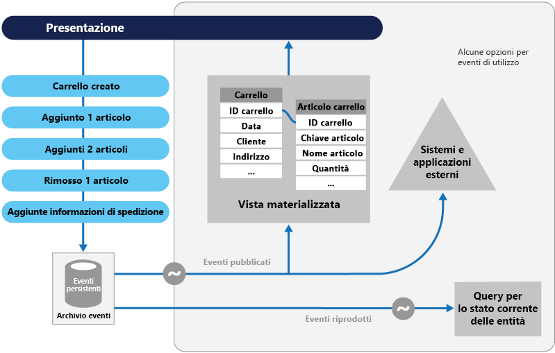

# Modello di origine eventiEvent Sourcing pattern

[!INCLUDE [header](../_includes/header.md)]

Anziché archiviare solo lo stato corrente dei dati in un dominio, usare un archivio di solo accodamento per registrare la serie completa di azioni eseguite sui dati.Instead of storing just the current state of the data in a domain, use an append-only store to record the full series of actions taken on that data.
L'archivio svolge la funzione di sistema di registrazione e consente di materializzare gli oggetti del dominio.The store acts as the system of record and can be used to materialize the domain objects. Contribuisce quindi a semplificare le attività in domini complessi, evitando la necessità di sincronizzare il modello dati e il dominio aziendale e migliorando le prestazioni, la scalabilità e la velocità di risposta.This can simplify tasks in complex domains, by avoiding the need to synchronize the data model and the business domain, while improving performance, scalability, and responsiveness. Può inoltre garantire coerenza ai dati transazionali e mantenere dati di cronologia e audit trail completi che consentono di eseguire azioni di compensazione.It can also provide consistency for transactional data, and maintain full audit trails and history that can enable compensating actions.

## Contesto e problemaContext and problem

La maggior parte delle applicazioni interagisce con i dati e, in genere, le applicazioni mantengono lo stato corrente dei dati lasciando agli utenti la facoltà di aggiornarli.Most applications work with data, and the typical approach is for the application to maintain the current state of the data by updating it as users work with it. Ad esempio, nel modello di creazione, lettura, aggiornamento ed eliminazione (CRUD, Create, Read, Update, Delete) tradizionale un processo dati tipico consiste nel leggere i dati dall'archivio, apportarvi alcune modifiche e aggiornare lo stato corrente dei dati con i nuovi valori&mdash;spesso tramite transazioni che bloccano i dati.For example, in the traditional create, read, update, and delete (CRUD) model a typical data process is to read data from the store, make some modifications to it, and update the current state of the data with the new values&mdash;often by using transactions that lock the data.

L'approccio CRUD presenta tuttavia alcune limitazioni:The CRUD approach has some limitations:

- Eseguendo le operazioni di aggiornamento direttamente nell'archivio dati, i sistemi CRUD generano un sovraccarico di elaborazione che può rallentare le prestazioni e la velocità di risposta e limitare la scalabilità.CRUD systems perform update operations directly against a data store, which can slow down performance and responsiveness, and limit scalability, due to the processing overhead it requires.

- In un dominio in collaborazione con molti utenti simultanei, i conflitti di aggiornamento sono più frequenti poiché le operazioni di aggiornamento vengono eseguite su un unico elemento di dati.In a collaborative domain with many concurrent users, data update conflicts are more likely because the update operations take place on a single item of data.

- A meno che non sia presente un meccanismo di controllo aggiuntivo che registra i dettagli di ogni operazione in un log separato, quindi, la cronologia viene persa.Unless there's an additional auditing mechanism that records the details of each operation in a separate log, history is lost.

> Per informazioni più dettagliate sui limiti dell'approccio CRUD, vedere [CRUD, Only When You Can Afford It](https://blogs.msdn.microsoft.com/maarten_mullender/2004/07/23/crud-only-when-you-can-afford-it-revisited/) (CRUD, solo quando è accessibile).For a deeper understanding of the limits of the CRUD approach see [CRUD, Only When You Can Afford It](https://blogs.msdn.microsoft.com/maarten_mullender/2004/07/23/crud-only-when-you-can-afford-it-revisited/).

## SoluzioneSolution

Il modello di origine eventi definisce un approccio alla gestione delle operazioni sui dati determinato da una sequenza di eventi, ognuno dei quali registrato in un archivio di solo accodamento.The Event Sourcing pattern defines an approach to handling operations on data that's driven by a sequence of events, each of which is recorded in an append-only store. Il codice dell'applicazione invia una serie di eventi che descrivono in modo imperativo ogni azione eseguita sui dati nell'archivio eventi, in cui sono salvati in modo permanente.Application code sends a series of events that imperatively describe each action that has occurred on the data to the event store, where they're persisted. Ogni evento rappresenta un set di modifiche ai dati (ad esempio `AddedItemToOrder`).Each event represents a set of changes to the data (such as `AddedItemToOrder`).

Gli eventi vengono salvati in modo permanente in un archivio eventi che svolge la funzione di sistema di registrazione (origine dati autorevole) dello stato corrente dei dati.The events are persisted in an event store that acts as the system of record (the authoritative data source) about the current state of the data. L'archivio eventi pubblica in genere questi eventi in modo che i consumer vengano informati e, se necessario, possano gestirli.The event store typically publishes these events so that consumers can be notified and can handle them if needed. I consumer, ad esempio, possono iniziare le attività che si applicano alle operazioni sugli eventi di altri sistemi oppure eseguire qualsiasi altra azione associata necessaria per completare l'operazione.Consumers could, for example, initiate tasks that apply the operations in the events to other systems, or perform any other associated action that's required to complete the operation. Tenere presente che il codice dell'applicazione che genera gli eventi è separato dai sistemi che sottoscrivono gli eventi.Notice that the application code that generates the events is decoupled from the systems that subscribe to the events.

Gli usi tipici degli eventi pubblicati dall'archivio eventi prevedono la gestione di viste materializzate di entità come azioni nell'applicazione e per l'integrazione con sistemi esterni.Typical uses of the events published by the event store are to maintain materialized views of entities as actions in the application change them, and for integration with external systems. Un sistema, ad esempio, può gestire una vista materializzata di tutti gli ordini clienti usata per popolare parti dell'interfaccia utente.For example, a system can maintain a materialized view of all customer orders that's used to populate parts of the UI. Quando l'applicazione aggiunge nuovi ordini, aggiunge o rimuove elementi nell'ordine o aggiunge le informazioni di spedizione, gli eventi che descrivono queste modifiche possono essere gestiti e usati per aggiornare la [vista materializzata](materialized-view.md).As the application adds new orders, adds or removes items on the order, and adds shipping information, the events that describe these changes can be handled and used to update the [materialized view](materialized-view.md).

In qualsiasi momento, inoltre, le applicazioni possono leggere la cronologia degli eventi e usarla per materializzare lo stato corrente di un'entità riproducendo e consumando tutti gli eventi correlati all'entità.In addition, at any point it's possible for applications to read the history of events, and use it to materialize the current state of an entity by playing back and consuming all the events related to that entity. Questa operazione può verificarsi su richiesta per materializzare un oggetto di dominio quando si gestisce una richiesta o tramite un'attività pianificata in modo che lo stato dell'entità possa essere archiviato come una vista materializzata per supportare il livello di presentazione.This can occur on demand to materialize a domain object when handling a request, or through a scheduled task so that the state of the entity can be stored as a materialized view to support the presentation layer.

La figura illustra una panoramica del modello, incluse alcune delle opzioni relative all'uso del flusso eventi, tra cui la creazione di una vista materializzata, l'integrazione di eventi con applicazioni e sistemi esterni e la riproduzione di eventi per poter creare proiezioni dello stato corrente di specifiche entità.The figure shows an overview of the pattern, including some of the options for using the event stream such as creating a materialized view, integrating events with external applications and systems, and replaying events to create projections of the current state of specific entities.

Il modello di origine eventi offre i vantaggi seguenti:The Event Sourcing pattern provides the following advantages:

- Gli eventi non sono modificabili e possono essere memorizzati con un'operazione di solo accodamento.Events are immutable and can be stored using an append-only operation. L'interfaccia utente, il flusso di lavoro o il processo che ha avviato un evento può continuare e le attività che gestiscono gli eventi possono essere eseguite in background.The user interface, workflow, or process that initiated an event can continue, and tasks that handle the events can run in the background. Questo vantaggio, combinato con l'assenza di conflitti durante l'elaborazione delle transazioni, può migliorare notevolmente le prestazioni e la scalabilità delle applicazioni, soprattutto in termini di interfaccia utente o livello di presentazione.This, combined with the fact that there's no contention during the processing of transactions, can vastly improve performance and scalability for applications, especially for the presentation level or user interface.

- Gli eventi sono oggetti semplici che descrivono un'azione che si è verificata, insieme a eventuali dati associati necessari per descrivere l'azione rappresentata dall'evento.Events are simple objects that describe some action that occurred, together with any associated data required to describe the action represented by the event. Gli eventi non aggiornano direttamente un archivio dati.Events don't directly update a data store. Vengono semplicemente registrati per essere gestiti al momento opportuno.They're simply recorded for handling at the appropriate time. Questi fattori possono semplificare l'implementazione e la gestione.This can simplify implementation and management.

- Gli eventi, in genere, sono facilmente comprensibili per gli esperti del settore, mentre la [mancata corrispondenza di impedenza object-relational](https://en.wikipedia.org/wiki/Object-relational_impedance_mismatch) può rendere difficile la comprensione delle tabelle di database complesse.Events typically have meaning for a domain expert, whereas [object-relational impedance mismatch](https://en.wikipedia.org/wiki/Object-relational_impedance_mismatch) can make complex database tables hard to understand. Le tabelle sono costrutti artificiali che rappresentano lo stato corrente del sistema, non gli eventi che si sono verificati.Tables are artificial constructs that represent the current state of the system, not the events that occurred.

- La funzione di origine eventi contribuisce a impedire conflitti generati da aggiornamenti simultanei in quanto evita la necessità di aggiornare direttamente gli oggetti nell'archivio dati.Event sourcing can help prevent concurrent updates from causing conflicts because it avoids the requirement to directly update objects in the data store. La progettazione del modello di dominio, tuttavia, non prevede ancora la protezione da richieste che possono determinare uno stato incoerente.However, the domain model must still be designed to protect itself from requests that might result in an inconsistent state.

- L'archiviazione di solo accodamento degli eventi offre un audit trail che consente di monitorare le azioni intraprese in un archivio dati, di rigenerare lo stato corrente come proiezioni o viste materializzate riproducendo gli eventi in qualsiasi momento e di semplificare le operazioni di test e debug del sistema.The append-only storage of events provides an audit trail that can be used to monitor actions taken against a data store, regenerate the current state as materialized views or projections by replaying the events at any time, and assist in testing and debugging the system. La necessità di usare eventi di compensazione per annullare le modifiche fornisce inoltre una cronologia delle modifiche annullate, possibilità che non sarebbe consentita se il modello archiviasse semplicemente lo stato corrente.In addition, the requirement to use compensating events to cancel changes provides a history of changes that were reversed, which wouldn't be the case if the model simply stored the current state. L'elenco degli eventi può essere usato anche per analizzare le prestazioni delle applicazioni e individuare tendenze di comportamento degli utenti, nonché per ottenere altre informazioni aziendali utili.The list of events can also be used to analyze application performance and detect user behavior trends, or to obtain other useful business information.

- L'archivio eventi genera eventi e le attività eseguono operazioni in risposta agli eventi.The event store raises events, and tasks perform operations in response to those events. È questa separazione tra le attività e gli eventi a garantire flessibilità ed estensibilità.This decoupling of the tasks from the events provides flexibility and extensibility. Le attività sono a conoscenza del tipo di evento e dei dati relativi all'evento, ma non dell'operazione che l'evento ha generato.Tasks know about the type of event and the event data, but not about the operation that triggered the event. Ogni evento, inoltre, può essere gestito da più attività.In addition, multiple tasks can handle each event. Questo aspetto semplifica l'integrazione con altri servizi e sistemi che restano in ascolto solo di nuovi eventi generati dall'archivio eventi.This enables easy integration with other services and systems that only listen for new events raised by the event store. Gli eventi che danno origine a nuovi eventi, tuttavia, tendono a essere di livello molto basso e può essere necessario generare eventi di integrazione specifici.However, the event sourcing events tend to be very low level, and it might be necessary to generate specific integration events instead.

> Il modello di origine eventi viene spesso combinato con il modello CQRS per l'esecuzione di attività di gestione dati in risposta agli eventi e per la materializzazione delle viste a partire da eventi archiviati.Event sourcing is commonly combined with the CQRS pattern by performing the data management tasks in response to the events, and by materializing views from the stored events.

## Considerazioni e problemiIssues and considerations

Prima di decidere come implementare questo modello, considerare quanto segue:Consider the following points when deciding how to implement this pattern:

Il sistema acquisirà la coerenza finale solo durante la creazione di viste materializzate o la generazione di proiezioni di dati tramite la riproduzione di eventi.The system will only be eventually consistent when creating materialized views or generating projections of data by replaying events. Si verifica un minimo ritardo tra il momento in cui un'applicazione aggiunge un evento all'archivio eventi in seguito alla gestione di una richiesta, il momento in cui l'evento viene pubblicato e quello in cui viene gestito dai consumer.There's some delay between an application adding events to the event store as the result of handling a request, the events being published, and consumers of the events handling them. Durante questo intervallo di tempo è possibile che siano giunti nell'archivio nuovi eventi che descrivono ulteriori modifiche alle entità.During this period, new events that describe further changes to entities might have arrived at the event store.

> [!NOTE]
> Per altre informazioni sulla coerenza finale, vedere [Nozioni di base sulla coerenza dei dati](https://msdn.microsoft.com/library/dn589800.aspx).See the [Data Consistency Primer](https://msdn.microsoft.com/library/dn589800.aspx) for information about eventual consistency.

L'archivio eventi è un'origine permanente di informazioni e i dati dell'evento, quindi, non dovrebbero essere mai aggiornati.The event store is the permanent source of information, and so the event data should never be updated. L'unico modo per aggiornare un'entità in modo da annullare una modifica è quello di aggiungere un evento di compensazione all'archivio eventi.The only way to update an entity to undo a change is to add a compensating event to the event store. Se deve essere modificato il formato, anziché i dati, degli eventi persistenti, ad esempio durante una migrazione, potrebbe essere difficile combinare eventi esistenti nell'archivio con la nuova versione.If the format (rather than the data) of the persisted events needs to change, perhaps during a migration, it can be difficult to combine existing events in the store with the new version. È possibile che sia necessario scorrere tutti gli eventi per modificarli in modo da uniformarli al nuovo formato oppure aggiungere nuovi eventi che usano il nuovo formato.It might be necessary to iterate through all the events making changes so they're compliant with the new format, or add new events that use the new format. Valutare l'opportunità di usare uno stamp di versione in ogni versione dello schema eventi per mantenere sia il nuovo che il vecchio formato.Consider using a version stamp on each version of the event schema to maintain both the old and the new event formats.

È possibile che nell'archivio eventi vengano archiviati eventi anche da parte di applicazioni multithread e da più istanze delle applicazioni.Multi-threaded applications and multiple instances of applications might be storing events in the event store. La coerenza degli eventi nell'archivio eventi è di fondamentale importanza, così come l'ordine degli eventi che interessano un'entità specifica (l'ordine in cui vengono apportate le modifiche influisce sullo stato corrente dell'entità).The consistency of events in the event store is vital, as is the order of events that affect a specific entity (the order that changes occur to an entity affects its current state). L'aggiunta di un timestamp a ogni evento contribuisce a evitare problemi.Adding a timestamp to every event can help to avoid issues. Un'altra procedura comune è quella di annotare ogni evento generato da una richiesta con un identificatore incrementale.Another common practice is to annotate each event resulting from a request with an incremental identifier. Se due azioni tentano contemporaneamente di aggiungere eventi per una stessa entità, l'archivio eventi può rifiutare un evento che corrisponde a un identificatore di entità e a un identificatore di evento esistenti.If two actions attempt to add events for the same entity at the same time, the event store can reject an event that matches an existing entity identifier and event identifier.

Non esiste un approccio standard o un meccanismo esistente, ad esempio query SQL, per leggere gli eventi in modo da ottenere informazioni.There's no standard approach, or existing mechanisms such as SQL queries, for reading the events to obtain information. Un flusso di eventi è l'unico tipo di dati che è possibile estrarre usando un identificatore di eventi come criterio.The only data that can be extracted is a stream of events using an event identifier as the criteria. L'ID evento è generalmente associato a entità individuali.The event ID typically maps to individual entities. Lo stato corrente di un'entità può essere determinato solo riproducendo tutti gli eventi associati all'entità sullo stato originale dell'entità.The current state of an entity can be determined only by replaying all of the events that relate to it against the original state of that entity.

La lunghezza di ogni flusso di eventi influisce sulle modalità di gestione e di aggiornamento del sistema.The length of each event stream affects managing and updating the system. Se i flussi sono di grandi dimensioni, valutare l'opportunità di creare snapshot a intervalli specifici, ad esempio dopo un determinato numero di eventi.If the streams are large, consider creating snapshots at specific intervals such as a specified number of events. È possibile ottenere lo stato corrente dell'entità mediante lo snapshot e la riproduzione di tutti gli eventi che si sono verificati a partire da quel punto nel tempo.The current state of the entity can be obtained from the snapshot and by replaying any events that occurred after that point in time. Per altre informazioni sulla creazione di snapshot di dati, vedere la sezione [Snapshot del sito Web di Martin Fowler sull'architettura delle applicazioni aziendali](https://martinfowler.com/eaaDev/Snapshot.html) e l'articolo sulla [replica snapshot master-subordinato](https://msdn.microsoft.com/library/ff650012.aspx).For more information about creating snapshots of data, see [Snapshot on Martin Fowler’s Enterprise Application Architecture website](https://martinfowler.com/eaaDev/Snapshot.html) and [Master-Subordinate Snapshot Replication](https://msdn.microsoft.com/library/ff650012.aspx).

Anche se l'origine eventi riduce al minimo il rischio di conflitti tra gli aggiornamenti ai dati, l'applicazione deve comunque essere in grado di gestire eventuali incoerenze derivanti dalla coerenza finale e dalla mancanza di transazioni.Even though event sourcing minimizes the chance of conflicting updates to the data, the application must still be able to deal with inconsistencies that result from eventual consistency and the lack of transactions. Un evento che indica una riduzione delle scorte, ad esempio, può giungere nell'archivio dati mentre viene emesso un ordine per l'elemento mancante, determinando quindi la necessità di riconciliare le due operazioni, ovvero informando il cliente o creando un ordine arretrato.For example, an event that indicates a reduction in stock inventory might arrive in the data store while an order for that item is being placed, resulting in a requirement to reconcile the two operations either by advising the customer or creating a back order.

La pubblicazione degli eventi può essere di tipo "almeno una volta", in modo che i consumer degli eventi siano idempotenti.Event publication might be “at least once,” and so consumers of the events must be idempotent. In questo modo, non è necessario riapplicare l'aggiornamento descritto in un evento se l'evento viene gestito più volte.They must not reapply the update described in an event if the event is handled more than once. Se, ad esempio, più istanze di un consumer mantengono un dato aggregato per la proprietà di un'entità, ad esempio il numero totale di ordini, quando si verifica un evento relativo a un nuovo ordine effettuato, è necessario incrementare il dato aggregato in una sola istanza.For example, if multiple instances of a consumer maintain an aggregate an entity's property, such as the total number of orders placed, only one must succeed in incrementing the aggregate when an order placed event occurs. Sebbene non si tratti di una caratteristica chiave della funzione di origine eventi, costituisce comunque la decisione di implementazione consueta.While this isn't a key characteristic of event sourcing, it's the usual implementation decision.

## Quando usare questo modelloWhen to use this pattern

Usare questo modello negli scenari seguenti:Use this pattern in the following scenarios:

- Quando si vuole acquisire l'intento, lo scopo o il motivo insito nei dati.When you want to capture intent, purpose, or reason in the data. Le modifiche a un'entità cliente, ad esempio, possono essere acquisite come una serie di tipi di eventi specifici, come _Trasferito_, _Account chiuso_ o _Deceduto_.For example, changes to a customer entity can be captured as a series of specific event types such as _Moved home_, _Closed account_, or _Deceased_.

- Quando è essenziale ridurre al minimo o evitare completamente la presenza di conflitti tra gli aggiornamenti ai dati.When it's vital to minimize or completely avoid the occurrence of conflicting updates to data.

- Quando si vuole registrare gli eventi che si verificano ed essere in grado di riprodurli in modo da ripristinare lo stato di un sistema, annullare le modifiche o mantenere una cronologia e audit log.When you want to record events that occur, and be able to replay them to restore the state of a system, roll back changes, or keep a history and audit log. Se un'attività si articola in più passaggi, ad esempio, può essere necessario eseguire determinate azioni per annullare alcuni aggiornamenti e quindi riprodurre una serie di passaggi per ripristinare i dati a uno stato coerente.For example, when a task involves multiple steps you might need to execute actions to revert updates and then replay some steps to bring the data back into a consistent state.

- Quando l'uso di eventi costituisce un elemento naturale dell'operatività di un'applicazione e richiede un impegno aggiuntivo minimo in termini di sviluppo o implementazione.When using events is a natural feature of the operation of the application, and requires little additional development or implementation effort.

- Quando si deve separare il processo di inserimento o aggiornamento dei dati dalle attività necessarie per applicare queste azioni.When you need to decouple the process of inputting or updating data from the tasks required to apply these actions. Questa necessità può derivare dalla volontà di migliorare le prestazioni dell'interfaccia utente o di distribuire gli eventi ad altri listener che eseguono determinate operazioni quando si verifica un evento.This might be to improve UI performance, or to distribute events to other listeners that take action when the events occur. Uno scenario di questo tipo può essere costituito, ad esempio, dall'integrazione di un sistema di gestione delle paghe con un sito Web di invio di note spese, in modo che degli eventi generati dall'archivio eventi in risposta ad aggiornamenti ai dati eseguiti sul sito Web possano avvalersi sia il sito Web sia il sistema di gestione delle paghe.For example, integrating a payroll system with an expense submission website so that events raised by the event store in response to data updates made in the website are consumed by both the website and the payroll system.

- Se si vuole avere la possibilità di modificare il formato dei modelli materializzati e i dati dell'entità in caso di variazione dei requisiti oppure &mdash;se, in combinazione con un modello CQRS&mdash;, si deve adattare un modello di lettura o le viste che espongono i dati.When you want flexibility to be able to change the format of materialized models and entity data if requirements change, or&mdash;when used in conjunction with CQRS&mdash;you need to adapt a read model or the views that expose the data.

- Quando il modello di origine eventi viene usato con un modello CQRS e la coerenza finale è accettabile durante l'aggiornamento di un modello di lettura o l'impatto sulle prestazioni generato dalla riattivazione di entità e dati da un flusso di eventi è accettabile.When used in conjunction with CQRS, and eventual consistency is acceptable while a read model is updated, or the performance impact of rehydrating entities and data from an event stream is acceptable.

Questo modello può non essere utile nelle situazioni seguenti:This pattern might not be useful in the following situations:

- Domini semplici o di piccole dimensioni, con poca o alcuna logica di business o sistemi non di dominio che per natura interagiscono bene con i tradizionali meccanismi di gestione dati CRUD.Small or simple domains, systems that have little or no business logic, or nondomain systems that naturally work well with traditional CRUD data management mechanisms.

- Sistemi in cui sono necessari coerenza e aggiornamenti in tempo reale alle visualizzazioni dei dati.Systems where consistency and real-time updates to the views of the data are required.

- Sistemi in cui non sono necessarie funzioni di audit trail, cronologia e annullamento e riproduzione delle azioni.Systems where audit trails, history, and capabilities to roll back and replay actions are not required.

- Sistemi in cui la frequenza di conflitti tra gli aggiornamenti ai dati sottostanti è molto bassa.Systems where there's only a very low occurrence of conflicting updates to the underlying data. Ad esempio, sistemi che in prevalenza aggiungono dati anziché aggiornarli.For example, systems that predominantly add data rather than updating it.

## EsempioExample

Un sistema di gestione delle conferenze deve tenere traccia del numero di prenotazioni completate per una conferenza in modo da poter verificare la disponibilità di posti nel momento in cui un aspirante partecipante prova a effettuare una prenotazione.A conference management system needs to track the number of completed bookings for a conference so that it can check whether there are seats still available when a potential attendee tries to make a booking. Il sistema può archiviare il numero totale di prenotazioni per una conferenza in almeno due modi:The system could store the total number of bookings for a conference in at least two ways:

- Il sistema può memorizzare le informazioni sul numero totale di prenotazioni come entità separata in un database in cui sono contenute le informazioni di prenotazione.The system could store the information about the total number of bookings as a separate entity in a database that holds booking information. Per ogni nuova prenotazione effettuata o annullata, il sistema può incrementare o diminuire il numero di conseguenza.As bookings are made or canceled, the system could increment or decrement this number as appropriate. Questo approccio è molto semplice in teoria, ma può generare problemi di scalabilità nel caso in cui un numero elevato di partecipanti tenti di effettuare una prenotazione in un breve intervallo di tempo,This approach is simple in theory, but can cause scalability issues if a large number of attendees are attempting to book seats during a short period of time. ad esempio nell'ultimo giorno prima della chiusura delle prenotazioni.For example, in the last day or so prior to the booking period closing.

- Il sistema può memorizzare le informazioni su ogni nuova prenotazione aggiunta o annullata come eventi contenuti in un archivio eventi.The system could store information about bookings and cancellations as events held in an event store. Può quindi calcolare il numero di posti disponibili riproducendo questi eventi.It could then calculate the number of seats available by replaying these events. Questo approccio può essere più scalabile grazie alla non modificabilità degli eventi.This approach can be more scalable due to the immutability of events. Il sistema deve solo riuscire a leggere dati dall'archivio eventi e, se necessario, aggiungere nuovi dati.The system only needs to be able to read data from the event store, or append data to the event store. Le informazioni sugli eventi rappresentati da ogni nuova prenotazione aggiunta o annullata non vengono mai modificate.Event information about bookings and cancellations is never modified.

Il grafico seguente illustra come il sottosistema di prenotazione dei posti del sistema di gestione delle conferenze possa essere implementato usando il modello di origine eventi.The following diagram illustrates how the seat reservation subsystem of the conference management system might be implemented using event sourcing.

Di seguito è illustrata la sequenza di azioni per la prenotazione di due posti:The sequence of actions for reserving two seats is as follows:

1. L'interfaccia utente esegue un comando per prenotare i posti per due partecipanti.The user interface issues a command to reserve seats for two attendees. Il comando viene gestito da un gestore di comando separato.The command is handled by a separate command handler. Una parte della logica che viene separata dall'interfaccia utente diventa responsabile della gestione delle richieste inviate sotto forma di comandi.A piece of logic that is decoupled from the user interface and is responsible for handling requests posted as commands.

2. Viene creata un'aggregazione contenente informazioni su tutte le prenotazioni per la conferenza tramite l'esecuzione di query sugli eventi che descrivono le nuove prenotazioni e gli annullamenti.An aggregate containing information about all reservations for the conference is constructed by querying the events that describe bookings and cancellations. L'aggregazione prende il nome di `SeatAvailability` ed è contenuta in un modello di dominio che espone i metodi per l'esecuzione di query e la modifica dei dati inclusi nell'aggregazione.This aggregate is called `SeatAvailability`, and is contained within a domain model that exposes methods for querying and modifying the data in the aggregate.

    > Alcune ottimizzazioni da valutare comprendono l'uso di snapshot (in modo che non sia necessario eseguire query e riprodurre l'elenco completo degli eventi per ottenere lo stato corrente dell'aggregazione) e la conservazione di una copia memorizzata nella cache dell'aggregazione in memoria.Some optimizations to consider are using snapshots (so that you don’t need to query and replay the full list of events to obtain the current state of the aggregate), and maintaining a cached copy of the aggregate in memory.

3. Il gestore di comando richiama un metodo esposto dal modello di dominio per effettuare le prenotazioni.The command handler invokes a method exposed by the domain model to make the reservations.

4. L'aggregazione `SeatAvailability` registra un evento contenente il numero di posti prenotati.The `SeatAvailability` aggregate records an event containing the number of seats that were reserved. La volta successiva in cui l'aggregazione applica un evento verranno usate tutte le prenotazioni per calcolare il numero di posti rimanenti.The next time the aggregate applies events, all the reservations will be used to compute how many seats remain.

5. Il sistema aggiunge il nuovo evento all'elenco degli eventi presenti nell'archivio eventi.The system appends the new event to the list of events in the event store.

Se un utente annulla una prenotazione, il sistema segue un processo simile, ma in questo caso il gestore di comando esegue un comando che genera un evento di annullamento della prenotazione e lo aggiunge all'archivio eventi.If a user cancels a seat, the system follows a similar process except the command handler issues a command that generates a seat cancellation event and appends it to the event store.

Oltre a garantire una maggiore scalabilità, l'uso di un archivio eventi offre anche una cronologia completa o un audit trail delle prenotazioni aggiunte o annullate per una conferenza.As well as providing more scope for scalability, using an event store also provides a complete history, or audit trail, of the bookings and cancellations for a conference. Gli eventi nell'archivio di eventi costituiscono il record esatto.The events in the event store are the accurate record. Non è necessario rendere l'aggregazione permanente in altri modi poiché il sistema può facilmente riprodurre gli eventi e ripristinare lo stato a un qualsiasi punto nel tempo.There is no need to persist aggregates in any other way because the system can easily replay the events and restore the state to any point in time.

> Altre informazioni su questo esempio sono disponibili in [Introducing Event Sourcing](https://msdn.microsoft.com/library/jj591559.aspx) (Introduzione all'origine eventi).You can find more information about this example in [Introducing Event Sourcing](https://msdn.microsoft.com/library/jj591559.aspx).

## Modelli correlati e informazioni aggiuntiveRelated patterns and guidance

Per l'implementazione di questo modello possono risultare utili i modelli e le informazioni aggiuntive seguenti:The following patterns and guidance might also be relevant when implementing this pattern:

- [Modello di separazione di responsabilità per query e comandi (CQRS, Command and Query Responsibility Segregation)](cqrs.md).[Command and Query Responsibility Segregation (CQRS) Pattern](cqrs.md). L'archivio di scrittura che costituisce un'origine permanente di informazioni per l'implementazione di un modello CQRS è spesso basato su un'implementazione del modello di origine eventi.The write store that provides the permanent source of information for a CQRS implementation is often based on an implementation of the Event Sourcing pattern. Questo modello descrive come isolare in un'applicazione le operazioni di lettura dei dati dalle operazioni di aggiornamento dei dati tramite l'uso di interfacce separate.Describes how to segregate the operations that read data in an application from the operations that update data by using separate interfaces.

- [Modello di viste materializzate](materialized-view.md).[Materialized View Pattern](materialized-view.md). L'archivio dati usato in un sistema basato sull'origine di eventi non è in genere adatto per l'esecuzione di query efficienti.The data store used in a system based on event sourcing is typically not well suited to efficient querying. In questo caso, l'approccio comune è quello di generare viste dati prepopolate a intervalli regolari o in caso di variazione dei dati.Instead, a common approach is to generate prepopulated views of the data at regular intervals, or when the data changes. Questo modello illustra come viene eseguita questa operazione.Shows how this can be done.

- [Modello di transazioni di compensazione](compensating-transaction.md).[Compensating Transaction Pattern](compensating-transaction.md). I dati esistenti in un archivio di origine eventi non vengono aggiornati, ma vengono aggiunte nuove voci che determinano la transizione dello stato delle entità su nuovi valori.The existing data in an event sourcing store is not updated, instead new entries are added that transition the state of entities to the new values. Per annullare una modifica, vengono usati voci di compensazione poiché non è possibile annullare semplicemente la modifica precedente.To reverse a change, compensating entries are used because it isn't possible to simply reverse the previous change. In questo modello viene descritto come annullare le conseguenze prodotte da un'operazione precedente.Describes how to undo the work that was performed by a previous operation.

- [Nozioni di base sulla coerenza dei dati](https://msdn.microsoft.com/library/dn589800.aspx).[Data Consistency Primer](https://msdn.microsoft.com/library/dn589800.aspx). Quando si usa il modello di origine eventi con un archivio di letture o viste materializzate diverse, i dati letti non saranno subito coerenti ma avranno una coerenza finale.When using event sourcing with a separate read store or materialized views, the read data won't be immediately consistent, instead it'll be only eventually consistent. Questo modello riepiloga i problemi da affrontare per mantenere la coerenza dei dati distribuiti.Summarizes the issues surrounding maintaining consistency over distributed data.

- [Linee guida di partizionamento di dati](https://msdn.microsoft.com/library/dn589795.aspx).[Data Partitioning Guidance](https://msdn.microsoft.com/library/dn589795.aspx). Quando si usa il modello di origine eventi, si ricorre spesso al partizionamento dei dati per migliorare la scalabilità, ridurre i conflitti e ottimizzare le prestazioni.Data is often partitioned when using event sourcing to improve scalability, reduce contention, and optimize performance. Questo modello descrive come suddividere i dati in partizioni distinte e illustra i problemi che possono derivarne.Describes how to divide data into discrete partitions, and the issues that can arise.
