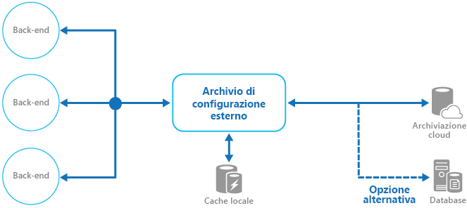

# <a name="external-configuration-store-pattern"></a><span data-ttu-id="ba054-104">Modello di archivio di configurazione esterno</span><span class="sxs-lookup"><span data-stu-id="ba054-104">External Configuration Store pattern</span></span>

[!INCLUDE [header](../_includes/header.md)]

<span data-ttu-id="ba054-105">È possibile estrarre le informazioni di configurazione dal pacchetto di distribuzione dell'applicazione e spostarle in una posizione centralizzata.</span><span class="sxs-lookup"><span data-stu-id="ba054-105">Move configuration information out of the application deployment package to a centralized location.</span></span> <span data-ttu-id="ba054-106">In questo modo può essere più facile gestire e controllare i dati di configurazione e si può avere l'opportunità di condividere i dati di configurazione tra applicazioni e istanze dell'applicazione.</span><span class="sxs-lookup"><span data-stu-id="ba054-106">This can provide opportunities for easier management and control of configuration data, and for sharing configuration data across applications and application instances.</span></span>

## <a name="context-and-problem"></a><span data-ttu-id="ba054-107">Contesto e problema</span><span class="sxs-lookup"><span data-stu-id="ba054-107">Context and problem</span></span>

<span data-ttu-id="ba054-108">La maggior parte degli ambienti di runtime delle applicazioni includono informazioni di configurazione contenute in file distribuiti con l'applicazione.</span><span class="sxs-lookup"><span data-stu-id="ba054-108">The majority of application runtime environments include configuration information that's held in files deployed with the application.</span></span> <span data-ttu-id="ba054-109">In alcuni casi è possibile modificare questi file per cambiare il comportamento dell'applicazione dopo che è stata distribuita.</span><span class="sxs-lookup"><span data-stu-id="ba054-109">In some cases, it's possible to edit these files to change the application behavior after it's been deployed.</span></span> <span data-ttu-id="ba054-110">Tuttavia, se si modifica la configurazione sarà necessario ridistribuire l'applicazione e spesso questo causa tempi di inattività inaccettabili e altro sovraccarico amministrativo.</span><span class="sxs-lookup"><span data-stu-id="ba054-110">However, changes to the configuration require the application be redeployed, often resulting in unacceptable downtime and other administrative overhead.</span></span>

<span data-ttu-id="ba054-111">I file di configurazione locale limitano anche la configurazione a una sola applicazione, ma a volte può essere utile condividere le impostazioni di configurazione tra più applicazioni.</span><span class="sxs-lookup"><span data-stu-id="ba054-111">Local configuration files also limit the configuration to a single application, but sometimes it would be useful to share configuration settings across multiple applications.</span></span> <span data-ttu-id="ba054-112">Alcuni esempi sono le stringhe di connessione del database, le informazioni sui temi dell'interfaccia utente o gli URL delle code e delle risorse di archiviazione usate da un insieme di applicazioni correlate.</span><span class="sxs-lookup"><span data-stu-id="ba054-112">Examples include database connection strings, UI theme information, or the URLs of queues and storage used by a related set of applications.</span></span>

<span data-ttu-id="ba054-113">È difficile gestire le modifiche apportate alle configurazioni locale tra più istanze in esecuzione dell'applicazione, soprattutto in uno scenario ospitato nel cloud.</span><span class="sxs-lookup"><span data-stu-id="ba054-113">It's challenging to manage changes to local configurations across multiple running instances of the application, especially in a cloud-hosted scenario.</span></span> <span data-ttu-id="ba054-114">Di conseguenza, è possibile avere istanze che usano impostazioni di configurazione diverse durante la distribuzione dell'aggiornamento.</span><span class="sxs-lookup"><span data-stu-id="ba054-114">It can result in instances using different configuration settings while the update is being deployed.</span></span>

<span data-ttu-id="ba054-115">Inoltre, gli aggiornamenti di applicazioni e componenti possono richiedere modifiche agli schemi di configurazione.</span><span class="sxs-lookup"><span data-stu-id="ba054-115">In addition, updates to applications and components might require changes to configuration schemas.</span></span> <span data-ttu-id="ba054-116">Molti sistemi di configurazione non supportano versioni diverse delle informazioni di configurazione.</span><span class="sxs-lookup"><span data-stu-id="ba054-116">Many configuration systems don't support different versions of configuration information.</span></span>

## <a name="solution"></a><span data-ttu-id="ba054-117">Soluzione</span><span class="sxs-lookup"><span data-stu-id="ba054-117">Solution</span></span>

<span data-ttu-id="ba054-118">Archiviare le informazioni di configurazione in un archivio esterno e rendere disponibile un'interfaccia che consenta di leggere e aggiornare le impostazioni di configurazione in modo rapido ed efficiente.</span><span class="sxs-lookup"><span data-stu-id="ba054-118">Store the configuration information in external storage, and provide an interface that can be used to quickly and efficiently read and update configuration settings.</span></span> <span data-ttu-id="ba054-119">Il tipo di archivio esterno dipende dall'ambiente di hosting e di runtime dell'applicazione.</span><span class="sxs-lookup"><span data-stu-id="ba054-119">The type of external store depends on the hosting and runtime environment of the application.</span></span> <span data-ttu-id="ba054-120">In uno scenario ospitato nel cloud si tratta in genere di un servizio di archiviazione basato su cloud, ma potrebbe essere un database ospitato o un altro sistema.</span><span class="sxs-lookup"><span data-stu-id="ba054-120">In a cloud-hosted scenario it's typically a cloud-based storage service, but could be a hosted database or other system.</span></span>

<span data-ttu-id="ba054-121">L'archivio di backup che si sceglie per le informazioni di configurazione deve avere un'interfaccia con accesso semplice e coerente.</span><span class="sxs-lookup"><span data-stu-id="ba054-121">The backing store you choose for configuration information should have an interface that provides consistent and easy-to-use access.</span></span> <span data-ttu-id="ba054-122">Le informazioni devono essere esposte in un formato correttamente tipizzato e strutturato.</span><span class="sxs-lookup"><span data-stu-id="ba054-122">It should expose the information in a correctly typed and structured format.</span></span> <span data-ttu-id="ba054-123">L'implementazione può anche richiedere l'autorizzazione dell'accesso da parte degli utenti per proteggere i dati di configurazione ed essere sufficientemente flessibile da consentire l'archiviazione di più versioni della configurazione, ad esempio sviluppo, gestione temporanea o produzione, ognuna con più versioni di rilascio.</span><span class="sxs-lookup"><span data-stu-id="ba054-123">The implementation might also need to authorize users’ access in order to protect configuration data, and be flexible enough to allow storage of multiple versions of the configuration (such as development, staging, or production, including multiple release versions of each one).</span></span>

> <span data-ttu-id="ba054-124">Molti sistemi di configurazione predefiniti leggono i dati all'avvio dell'applicazione e memorizzano i dati nella cache per consentire un accesso rapido e ridurre al minimo l'impatto sulle prestazioni dell'applicazione.</span><span class="sxs-lookup"><span data-stu-id="ba054-124">Many built-in configuration systems read the data when the application starts up, and cache the data in memory to provide fast access and minimize the impact on application performance.</span></span> <span data-ttu-id="ba054-125">In base al tipo di archivio di backup in uso e alla latenza di tale archivio, potrebbe essere utile implementare un meccanismo di memorizzazione nella cache all'interno dell'archivio di configurazione esterno.</span><span class="sxs-lookup"><span data-stu-id="ba054-125">Depending on the type of backing store used, and the latency of this store, it might be helpful to implement a caching mechanism within the external configuration store.</span></span> <span data-ttu-id="ba054-126">Per altre informazioni, vedere [Informazioni aggiuntive sulla memorizzazione nella cache](https://msdn.microsoft.com/library/dn589802.aspx).</span><span class="sxs-lookup"><span data-stu-id="ba054-126">For more information, see the [Caching Guidance](https://msdn.microsoft.com/library/dn589802.aspx).</span></span> <span data-ttu-id="ba054-127">La figura illustra una panoramica del modello di archivio di configurazione esterno con cache locale facoltativa.</span><span class="sxs-lookup"><span data-stu-id="ba054-127">The figure illustrates an overview of the External Configuration Store pattern with optional local cache.</span></span>



## <a name="issues-and-considerations"></a><span data-ttu-id="ba054-129">Considerazioni e problemi</span><span class="sxs-lookup"><span data-stu-id="ba054-129">Issues and considerations</span></span>

<span data-ttu-id="ba054-130">Prima di decidere come implementare questo modello, considerare quanto segue:</span><span class="sxs-lookup"><span data-stu-id="ba054-130">Consider the following points when deciding how to implement this pattern:</span></span>

<span data-ttu-id="ba054-131">Scegliere un archivio di backup che offre prestazioni accettabili, elevata disponibilità, affidabilità e di cui si può eseguire il backup come parte del processo di manutenzione e amministrazione dell'applicazione.</span><span class="sxs-lookup"><span data-stu-id="ba054-131">Choose a backing store that offers acceptable performance, high availability, robustness, and can be backed up as part of the application maintenance and administration process.</span></span> <span data-ttu-id="ba054-132">In un'applicazione ospitata nel cloud, l'uso di un meccanismo di archiviazione cloud è in genere una scelta ottimale per soddisfare questi requisiti.</span><span class="sxs-lookup"><span data-stu-id="ba054-132">In a cloud-hosted application, using a cloud storage mechanism is usually a good choice to meet these requirements.</span></span>

<span data-ttu-id="ba054-133">Progettare lo schema dell'archivio di backup per garantire la flessibilità nei tipi di informazioni che può contenere.</span><span class="sxs-lookup"><span data-stu-id="ba054-133">Design the schema of the backing store to allow flexibility in the types of information it can hold.</span></span> <span data-ttu-id="ba054-134">Verificare che soddisfi tutti i requisiti di configurazione, ad esempio dati tipizzati, raccolte di impostazioni, più versioni delle impostazioni e altre funzionalità richieste dalle applicazioni che lo usano.</span><span class="sxs-lookup"><span data-stu-id="ba054-134">Ensure that it provides for all configuration requirements such as typed data, collections of settings, multiple versions of settings, and any other features that the applications using it require.</span></span> <span data-ttu-id="ba054-135">Lo schema deve essere facile da estendere per supportare impostazioni aggiuntive quando cambiano i requisiti.</span><span class="sxs-lookup"><span data-stu-id="ba054-135">The schema should be easy to extend to support additional settings as requirements change.</span></span>

<span data-ttu-id="ba054-136">Considerare le funzionalità fisiche dell'archivio di backup, la sua relazione con la modalità di archiviazione delle informazioni di configurazione e l'impatto sulle prestazioni.</span><span class="sxs-lookup"><span data-stu-id="ba054-136">Consider the physical capabilities of the backing store, how it relates to the way configuration information is stored, and the effects on performance.</span></span> <span data-ttu-id="ba054-137">Ad esempio, l'archiviazione di un documento XML contenente informazioni di configurazione richiederà che l'interfaccia di configurazione o l'applicazione analizzi il documento in modo da leggere le singole impostazioni.</span><span class="sxs-lookup"><span data-stu-id="ba054-137">For example, storing an XML document containing configuration information will require either the configuration interface or the application to parse the document in order to read individual settings.</span></span> <span data-ttu-id="ba054-138">In questo modo aggiornare un'impostazione diventerà più complicato, anche se memorizzare nella cache le impostazioni può compensare il rallentamento delle prestazioni di lettura.</span><span class="sxs-lookup"><span data-stu-id="ba054-138">It'll make updating a setting more complicated, though caching the settings can help to offset slower read performance.</span></span>

<span data-ttu-id="ba054-139">Considerare il modo in cui l'interfaccia di configurazione consente il controllo dell'ambito e dell'ereditarietà delle impostazioni di configurazione.</span><span class="sxs-lookup"><span data-stu-id="ba054-139">Consider how the configuration interface will permit control of the scope and inheritance of configuration settings.</span></span> <span data-ttu-id="ba054-140">Ad esempio, potrebbe essere un requisito esaminare le impostazioni di configurazione a livello di organizzazione, applicazione e computer.</span><span class="sxs-lookup"><span data-stu-id="ba054-140">For example, it might be a requirement to scope configuration settings at the organization, application, and the machine level.</span></span> <span data-ttu-id="ba054-141">L'operazione può essere necessaria per supportare la delega del controllo dell'accesso a diversi ambiti e per impedire o consentire alle singole applicazioni di ignorare le impostazioni.</span><span class="sxs-lookup"><span data-stu-id="ba054-141">It might need to support delegation of control over access to different scopes, and to prevent or allow individual applications to override settings.</span></span>

<span data-ttu-id="ba054-142">Verificare che l'interfaccia di configurazione sia in grado di esporre i dati di configurazione nei formati richiesti, ad esempio valori tipizzati, raccolte, coppie chiave/valore o contenitori di proprietà.</span><span class="sxs-lookup"><span data-stu-id="ba054-142">Ensure that the configuration interface can expose the configuration data in the required formats such as typed values, collections, key/value pairs, or property bags.</span></span>

<span data-ttu-id="ba054-143">Prendere in considerazione il comportamento dell'interfaccia dell'archivio di configurazione quando le impostazioni di contengono errori o non esistono nell'archivio di backup.</span><span class="sxs-lookup"><span data-stu-id="ba054-143">Consider how the configuration store interface will behave when settings contain errors, or don't exist in the backing store.</span></span> <span data-ttu-id="ba054-144">Può essere appropriato restituire le impostazioni predefinite e registrare gli errori.</span><span class="sxs-lookup"><span data-stu-id="ba054-144">It might be appropriate to return default settings and log errors.</span></span> <span data-ttu-id="ba054-145">Considerare anche aspetti come la distinzione tra maiuscole e minuscole per le chiavi o i nomi delle impostazioni di configurazione, l'archiviazione e la gestione dei dati binari e i modi in cui vengono gestiti i valori null o vuoti.</span><span class="sxs-lookup"><span data-stu-id="ba054-145">Also consider aspects such as the case sensitivity of configuration setting keys or names, the storage and handling of binary data, and the ways that null or empty values are handled.</span></span>

<span data-ttu-id="ba054-146">È necessario proteggere i dati di configurazione per consentire l'accesso solo alle applicazioni e agli utenti appropriati.</span><span class="sxs-lookup"><span data-stu-id="ba054-146">Consider how to protect the configuration data to allow access to only the appropriate users and applications.</span></span> <span data-ttu-id="ba054-147">Si tratta probabilmente di una funzionalità dell'interfaccia dell'archivio di configurazione, ma è anche necessario assicurarsi che non sia possibile accedere ai dati contenuti nell'archivio di backup senza l'autorizzazione appropriata.</span><span class="sxs-lookup"><span data-stu-id="ba054-147">This is likely a feature of the configuration store interface, but it's also necessary to ensure that the data in the backing store can't be accessed directly without the appropriate permission.</span></span> <span data-ttu-id="ba054-148">Verificare che esista una separazione rigorosa tra le autorizzazioni necessarie per leggere e scrivere i dati di configurazione.</span><span class="sxs-lookup"><span data-stu-id="ba054-148">Ensure strict separation between the permissions required to read and to write configuration data.</span></span> <span data-ttu-id="ba054-149">Considerare anche la necessità di crittografare alcune o tutte le impostazioni di configurazione e le relative modalità di implementazione nell'interfaccia dell'archivio di configurazione.</span><span class="sxs-lookup"><span data-stu-id="ba054-149">Also consider whether you need to encrypt some or all of the configuration settings, and how this'll be implemented in the configuration store interface.</span></span>

<span data-ttu-id="ba054-150">Le configurazioni archiviate centralmente, che modificano il comportamento dell'applicazione in fase di esecuzione, sono estremamente importanti e devono essere distribuite, aggiornate e gestite con gli stessi meccanismi usati per la distribuzione di codice dell'applicazione.</span><span class="sxs-lookup"><span data-stu-id="ba054-150">Centrally stored configurations, which change application behavior during runtime, are critically important and should be deployed, updated, and managed using the same mechanisms as deploying application code.</span></span> <span data-ttu-id="ba054-151">Ad esempio, le modifiche che possono interessare più di un'applicazione devono essere apportate usando un approccio con test completi e distribuzione a fasi per garantire che le modifiche siano appropriate per tutte le applicazioni che usano questa configurazione.</span><span class="sxs-lookup"><span data-stu-id="ba054-151">For example, changes that can affect more than one application must be carried out using a full test and staged deployment approach to ensure that the change is appropriate for all applications that use this configuration.</span></span> <span data-ttu-id="ba054-152">Se un amministratore modifica un'impostazione per aggiornare una sola applicazione, ciò potrebbe influire negativamente sulle altre applicazioni che usano la stessa impostazione.</span><span class="sxs-lookup"><span data-stu-id="ba054-152">If an administrator edits a setting to update one application, it could adversely impact other applications that use the same setting.</span></span>

<span data-ttu-id="ba054-153">Se un'applicazione memorizza nella cache le informazioni di configurazione, l'applicazione deve ricevere un avviso se la configurazione viene modificata.</span><span class="sxs-lookup"><span data-stu-id="ba054-153">If an application caches configuration information, the application needs to be alerted if the configuration changes.</span></span> <span data-ttu-id="ba054-154">Può essere possibile implementare un criterio di scadenza sui dati di configurazione memorizzati nella cache in modo che periodicamente queste informazioni vengano automaticamente aggiornate e le eventuali modifiche vengano selezionate e gestite.</span><span class="sxs-lookup"><span data-stu-id="ba054-154">It might be possible to implement an expiration policy over cached configuration data so that this information is automatically refreshed periodically and any changes picked up (and acted on).</span></span>

## <a name="when-to-use-this-pattern"></a><span data-ttu-id="ba054-155">Quando usare questo modello</span><span class="sxs-lookup"><span data-stu-id="ba054-155">When to use this pattern</span></span>

<span data-ttu-id="ba054-156">Questo modello è utile per:</span><span class="sxs-lookup"><span data-stu-id="ba054-156">This pattern is useful for:</span></span>

- <span data-ttu-id="ba054-157">Impostazioni di configurazione che vengono condivise tra più applicazioni e istanze dell'applicazione o quando è necessario usare una configurazione standard in più applicazioni e istanze dell'applicazione.</span><span class="sxs-lookup"><span data-stu-id="ba054-157">Configuration settings that are shared between multiple applications and application instances, or where a standard configuration must be enforced across multiple applications and application instances.</span></span>

- <span data-ttu-id="ba054-158">Un sistema di configurazione standard che non supporta tutte le impostazioni di configurazione necessarie, ad esempio l'archiviazione di immagini o tipi di dati complessi.</span><span class="sxs-lookup"><span data-stu-id="ba054-158">A standard configuration system that doesn't support all of the required configuration settings, such as storing images or complex data types.</span></span>

- <span data-ttu-id="ba054-159">Come archivio complementare per alcune delle impostazioni per le applicazioni, per consentire ad esempio alle applicazioni di ignorare alcune o tutte le impostazioni archiviate centralmente.</span><span class="sxs-lookup"><span data-stu-id="ba054-159">As a complementary store for some of the settings for applications, perhaps allowing applications to override some or all of the centrally-stored settings.</span></span>

- <span data-ttu-id="ba054-160">Come un modo per semplificare l'amministrazione di più applicazioni e, facoltativamente, monitorare l'uso delle impostazioni di configurazione registrando alcuni o tutti i tipi di accesso all'archivio di configurazione.</span><span class="sxs-lookup"><span data-stu-id="ba054-160">As a way to simplify administration of multiple applications, and optionally for monitoring use of configuration settings by logging some or all types of access to the configuration store.</span></span>

## <a name="example"></a><span data-ttu-id="ba054-161">Esempio</span><span class="sxs-lookup"><span data-stu-id="ba054-161">Example</span></span>

<span data-ttu-id="ba054-162">In un'applicazione ospitata in Microsoft Azure la scelta più comune per l'archiviazione esterna delle informazioni di configurazione è Archiviazione di Azure.</span><span class="sxs-lookup"><span data-stu-id="ba054-162">In a Microsoft Azure hosted application, a typical choice for storing configuration information externally is to use Azure Storage.</span></span> <span data-ttu-id="ba054-163">Si tratta di una soluzione flessibile, che offre prestazioni elevate e viene replicata tre volte con failover automatico per assicurare una disponibilità elevata.</span><span class="sxs-lookup"><span data-stu-id="ba054-163">This is resilient, offers high performance, and is replicated three times with automatic failover to offer high availability.</span></span> <span data-ttu-id="ba054-164">Tabella di Azure offre un archivio di chiavi/valori con la possibilità di usare uno schema flessibile per i valori.</span><span class="sxs-lookup"><span data-stu-id="ba054-164">Azure Table storage provides a key/value store with the ability to use a flexible schema for the values.</span></span> <span data-ttu-id="ba054-165">L'archiviazione BLOB di Azure offre un archivio gerarchico basato su contenitore in grado di contenere qualsiasi tipo di dati in BLOB denominati singolarmente.</span><span class="sxs-lookup"><span data-stu-id="ba054-165">Azure Blob storage provides a hierarchical, container-based store that can hold any type of data in individually named blobs.</span></span>

<span data-ttu-id="ba054-166">L'esempio seguente illustra come implementare un archivio di configurazione con l'archiviazione BLOB per archiviare ed esporre le informazioni di configurazione.</span><span class="sxs-lookup"><span data-stu-id="ba054-166">The following example shows how a configuration store can be implemented over Blob storage to store and expose configuration information.</span></span> <span data-ttu-id="ba054-167">La classe `BlobSettingsStore` astrae l'archiviazione BLOB in modo che contenga le informazioni di configurazione e implementa l'interfaccia `ISettingsStore` specificata nel codice seguente.</span><span class="sxs-lookup"><span data-stu-id="ba054-167">The `BlobSettingsStore` class abstracts Blob storage for holding configuration information, and implements the `ISettingsStore` interface shown in the following code.</span></span>

> <span data-ttu-id="ba054-168">Questo codice è riportato nel progetto _ExternalConfigurationStore.Cloud_ nella soluzione _ExternalConfigurationStore_, disponibile da [GitHub](https://github.com/mspnp/cloud-design-patterns/tree/master/external-configuration-store).</span><span class="sxs-lookup"><span data-stu-id="ba054-168">This code is provided in the _ExternalConfigurationStore.Cloud_ project in the _ExternalConfigurationStore_ solution, available from [GitHub](https://github.com/mspnp/cloud-design-patterns/tree/master/external-configuration-store).</span></span>

```csharp
public interface ISettingsStore
{
    Task<string> GetVersionAsync();

    Task<Dictionary<string, string>> FindAllAsync();
}
```

<span data-ttu-id="ba054-169">Questa interfaccia definisce i metodi per il recupero e l'aggiornamento delle impostazioni di configurazione contenute nell'archivio di configurazione e include un numero di versione che può essere usato per rilevare se le impostazioni di configurazione sono state modificate di recente.</span><span class="sxs-lookup"><span data-stu-id="ba054-169">This interface defines methods for retrieving and updating configuration settings held in the configuration store, and includes a version number that can be used to detect whether any configuration settings have been modified recently.</span></span> <span data-ttu-id="ba054-170">La classe `BlobSettingsStore` usa la proprietà `ETag` del BLOB per implementare il controllo delle versioni.</span><span class="sxs-lookup"><span data-stu-id="ba054-170">The `BlobSettingsStore` class uses the `ETag` property of the blob to implement versioning.</span></span> <span data-ttu-id="ba054-171">La proprietà `ETag` viene aggiornata automaticamente ogni volta che viene scritto il BLOB.</span><span class="sxs-lookup"><span data-stu-id="ba054-171">The `ETag` property is updated automatically each time the blob is written.</span></span>

> <span data-ttu-id="ba054-172">Per impostazione predefinita, questa soluzione semplice espone tutte le impostazioni di configurazione come valori stringa anziché come valori tipizzati.</span><span class="sxs-lookup"><span data-stu-id="ba054-172">By design, this simple solution exposes all configuration settings as string values rather than typed values.</span></span>

<span data-ttu-id="ba054-173">La classe `ExternalConfigurationManager` definisce un wrapper per un oggetto `BlobSettingsStore`.</span><span class="sxs-lookup"><span data-stu-id="ba054-173">The `ExternalConfigurationManager` class provides a wrapper around a `BlobSettingsStore` object.</span></span> <span data-ttu-id="ba054-174">Un'applicazione può usare questa classe per archiviare e recuperare le informazioni di configurazione.</span><span class="sxs-lookup"><span data-stu-id="ba054-174">An application can use this class to store and retrieve configuration information.</span></span> <span data-ttu-id="ba054-175">La classe usa la libreria di [estensioni reattive](https://msdn.microsoft.com/library/hh242985.aspx) di Microsoft per esporre tutte le modifiche apportate alla configurazione attraverso un'implementazione dell'interfaccia di `IObservable`.</span><span class="sxs-lookup"><span data-stu-id="ba054-175">This class uses the Microsoft [Reactive Extensions](https://msdn.microsoft.com/library/hh242985.aspx) library to expose any changes made to the configuration through an implementation of the `IObservable` interface.</span></span> <span data-ttu-id="ba054-176">Se un'impostazione viene modificata chiamando il metodo `SetAppSetting`, viene generato l'evento `Changed` e tutti i sottoscrittori dell'evento ricevono una notifica.</span><span class="sxs-lookup"><span data-stu-id="ba054-176">If a setting is modified by calling the `SetAppSetting` method, the `Changed` event is raised and all subscribers to this event will be notified.</span></span>

<span data-ttu-id="ba054-177">Si noti che tutte le impostazioni vengono anche memorizzate nella cache in un oggetto `Dictionary` all'interno della classe `ExternalConfigurationManager` per l'accesso rapido.</span><span class="sxs-lookup"><span data-stu-id="ba054-177">Note that all settings are also cached in a `Dictionary` object inside the `ExternalConfigurationManager` class for fast access.</span></span> <span data-ttu-id="ba054-178">Il metodo `GetSetting` usato per recuperare un'impostazione di configurazione legge i dati dalla cache.</span><span class="sxs-lookup"><span data-stu-id="ba054-178">The `GetSetting` method used to retrieve a configuration setting reads the data from the cache.</span></span> <span data-ttu-id="ba054-179">Se l'impostazione non viene individuata nella cache, viene recuperata dall'oggetto `BlobSettingsStore`.</span><span class="sxs-lookup"><span data-stu-id="ba054-179">If the setting isn't found in the cache, it's retrieved from the `BlobSettingsStore` object instead.</span></span>

<span data-ttu-id="ba054-180">Il metodo `GetSettings` richiama il metodo `CheckForConfigurationChanges` per verificare se le informazioni di configurazione presenti nell'archiviazione BLOB sono state modificate.</span><span class="sxs-lookup"><span data-stu-id="ba054-180">The `GetSettings` method invokes the `CheckForConfigurationChanges` method to detect whether the configuration information in blob storage has changed.</span></span> <span data-ttu-id="ba054-181">Il numero di versione viene esaminato e confrontato con il numero di versione corrente contenuto nell'oggetto `ExternalConfigurationManager`.</span><span class="sxs-lookup"><span data-stu-id="ba054-181">It does this by examining the version number and comparing it with the current version number held by the `ExternalConfigurationManager` object.</span></span> <span data-ttu-id="ba054-182">Se sono state apportate una o più modifiche, viene generato l'evento `Changed` e le impostazioni di configurazione memorizzate nella cache nell'oggetto `Dictionary` vengono aggiornate.</span><span class="sxs-lookup"><span data-stu-id="ba054-182">If one or more changes have occurred, the `Changed` event is raised and the configuration settings cached in the `Dictionary` object are refreshed.</span></span> <span data-ttu-id="ba054-183">Si tratta di un'applicazione del [modello cache-aside](./cache-aside.md).</span><span class="sxs-lookup"><span data-stu-id="ba054-183">This is an application of the [Cache-Aside pattern](./cache-aside.md).</span></span>

<span data-ttu-id="ba054-184">L'esempio di codice che segue illustra come vengono implementati l'evento `Changed`, il metodo `GetSettings` e il metodo `CheckForConfigurationChanges`:</span><span class="sxs-lookup"><span data-stu-id="ba054-184">The following code sample shows how the `Changed` event, the `GetSettings` method, and the `CheckForConfigurationChanges` method are implemented:</span></span>

```csharp
public class ExternalConfigurationManager : IDisposable
{
  // An abstraction of the configuration store.
  private readonly ISettingsStore settings;
  private readonly ISubject<KeyValuePair<string, string>> changed;
  ...
  private readonly ReaderWriterLockSlim settingsCacheLock = new ReaderWriterLockSlim();
  private readonly SemaphoreSlim syncCacheSemaphore = new SemaphoreSlim(1);  
  ...
  private Dictionary<string, string> settingsCache;
  private string currentVersion;
  ...
  public ExternalConfigurationManager(ISettingsStore settings, ...)
  {
    this.settings = settings;
    ...
  }
  ...
  public IObservable<KeyValuePair<string, string>> Changed => this.changed.AsObservable();
  ...

  public string GetAppSetting(string key)
  {
    ...
    // Try to get the value from the settings cache.
    // If there's a cache miss, get the setting from the settings store and refresh the settings cache.

    string value;
    try
    {
        this.settingsCacheLock.EnterReadLock();

        this.settingsCache.TryGetValue(key, out value);
    }
    finally
    {
        this.settingsCacheLock.ExitReadLock();
    }

    return value;
  }
  ...
  private void CheckForConfigurationChanges()
  {
    try
    {
        // It is assumed that updates are infrequent.
        // To avoid race conditions in refreshing the cache, synchronize access to the in-memory cache.
        await this.syncCacheSemaphore.WaitAsync();

        var latestVersion = await this.settings.GetVersionAsync();

        // If the versions are the same, nothing has changed in the configuration.
        if (this.currentVersion == latestVersion) return;

        // Get the latest settings from the settings store and publish changes.
        var latestSettings = await this.settings.FindAllAsync();

        // Refresh the settings cache.
        try
        {
            this.settingsCacheLock.EnterWriteLock();

            if (this.settingsCache != null)
            {
                //Notify settings changed
                latestSettings.Except(this.settingsCache).ToList().ForEach(kv => this.changed.OnNext(kv));
            }
            this.settingsCache = latestSettings;
        }
        finally
        {
            this.settingsCacheLock.ExitWriteLock();
        }

        // Update the current version.
        this.currentVersion = latestVersion;
    }
    catch (Exception ex)
    {
        this.changed.OnError(ex);
    }
    finally
    {
        this.syncCacheSemaphore.Release();
    }
  }
}
```

> <span data-ttu-id="ba054-185">La classe `ExternalConfigurationManager` offre anche una proprietà denominata `Environment`.</span><span class="sxs-lookup"><span data-stu-id="ba054-185">The `ExternalConfigurationManager` class also provides a property named `Environment`.</span></span> <span data-ttu-id="ba054-186">Questa proprietà supporta configurazioni diverse per un'applicazione in esecuzione in ambienti diversi, ad esempio gestione temporanea e produzione.</span><span class="sxs-lookup"><span data-stu-id="ba054-186">This property supports varying configurations for an application running in different environments, such as staging and production.</span></span>

<span data-ttu-id="ba054-187">Un oggetto `ExternalConfigurationManager` può anche eseguire periodicamente una query sull'oggetto `BlobSettingsStore` per verificare le modifiche.</span><span class="sxs-lookup"><span data-stu-id="ba054-187">An `ExternalConfigurationManager` object can also query the `BlobSettingsStore` object periodically for any changes.</span></span> <span data-ttu-id="ba054-188">Nel codice seguente, il metodo `StartMonitor` chiama `CheckForConfigurationChanges` a un intervallo specificato per rilevare le modifiche e generare l'evento `Changed`, come descritto in precedenza.</span><span class="sxs-lookup"><span data-stu-id="ba054-188">In the following code, the `StartMonitor` method calls `CheckForConfigurationChanges` at an interval to detect any changes and raise the `Changed` event, as described earlier.</span></span>

```csharp
public class ExternalConfigurationManager : IDisposable
{
  ...
  private readonly ISubject<KeyValuePair<string, string>> changed;
  private Dictionary<string, string> settingsCache;
  private readonly CancellationTokenSource cts = new CancellationTokenSource();
  private Task monitoringTask;
  private readonly TimeSpan interval;

  private readonly SemaphoreSlim timerSemaphore = new SemaphoreSlim(1);
  ...
  public ExternalConfigurationManager(string environment) : this(new BlobSettingsStore(environment), TimeSpan.FromSeconds(15), environment)
  {
  }
  
  public ExternalConfigurationManager(ISettingsStore settings, TimeSpan interval, string environment)
  {
      this.settings = settings;
      this.interval = interval;
      this.CheckForConfigurationChangesAsync().Wait();
      this.changed = new Subject<KeyValuePair<string, string>>();
      this.Environment = environment;
  }
  ...
  /// <summary>
  /// Check to see if the current instance is monitoring for changes
  /// </summary>
  public bool IsMonitoring => this.monitoringTask != null && !this.monitoringTask.IsCompleted;

  /// <summary>
  /// Start the background monitoring for configuration changes in the central store
  /// </summary>
  public void StartMonitor()
  {
      if (this.IsMonitoring)
          return;

      try
      {
          this.timerSemaphore.Wait();

          // Check again to make sure we are not already running.
          if (this.IsMonitoring)
              return;

          // Start running our task loop.
          this.monitoringTask = ConfigChangeMonitor();
      }
      finally
      {
          this.timerSemaphore.Release();
      }
  }

  /// <summary>
  /// Loop that monitors for configuration changes
  /// </summary>
  /// <returns></returns>
  public async Task ConfigChangeMonitor()
  {
      while (!cts.Token.IsCancellationRequested)
      {
          await this.CheckForConfigurationChangesAsync();
          await Task.Delay(this.interval, cts.Token);
      }
  }

  /// <summary>
  /// Stop monitoring for configuration changes
  /// </summary>
  public void StopMonitor()
  {
      try
      {
          this.timerSemaphore.Wait();

          // Signal the task to stop.
          this.cts.Cancel();

          // Wait for the loop to stop.
          this.monitoringTask.Wait();

          this.monitoringTask = null;
      }
      finally
      {
          this.timerSemaphore.Release();
      }
  }

  public void Dispose()
  {
      this.cts.Cancel();
  }
  ...
}
```

<span data-ttu-id="ba054-189">Un'istanza della classe `ExternalConfigurationManager` viene creata come istanza singleton dalla classe `ExternalConfiguration` illustrata di seguito.</span><span class="sxs-lookup"><span data-stu-id="ba054-189">The `ExternalConfigurationManager` class is instantiated as a singleton instance by the `ExternalConfiguration` class shown below.</span></span>

```csharp
public static class ExternalConfiguration
{
    private static readonly Lazy<ExternalConfigurationManager> configuredInstance = new Lazy<ExternalConfigurationManager>(
        () =>
        {
            var environment = CloudConfigurationManager.GetSetting("environment");
            return new ExternalConfigurationManager(environment);
        });

    public static ExternalConfigurationManager Instance => configuredInstance.Value;
}
```

<span data-ttu-id="ba054-190">Il codice seguente è tratto dalla classe `WorkerRole` del progetto _ExternalConfigurationStore.Cloud_.</span><span class="sxs-lookup"><span data-stu-id="ba054-190">The following code is taken from the `WorkerRole` class in the _ExternalConfigurationStore.Cloud_ project.</span></span> <span data-ttu-id="ba054-191">Indica come l'applicazione usa la classe `ExternalConfiguration` per leggere un'impostazione.</span><span class="sxs-lookup"><span data-stu-id="ba054-191">It shows how the application uses the `ExternalConfiguration` class to read a setting.</span></span>

```csharp
public override void Run()
{
  // Start monitoring configuration changes.
  ExternalConfiguration.Instance.StartMonitor();

  // Get a setting.
  var setting = ExternalConfiguration.Instance.GetAppSetting("setting1");
  Trace.TraceInformation("Worker Role: Get setting1, value: " + setting);

  this.completeEvent.WaitOne();
}
```

<span data-ttu-id="ba054-192">Il codice seguente, anch'esso dalla classe `WorkerRole`, illustra in che modo l'applicazione sottoscrive gli eventi di configurazione.</span><span class="sxs-lookup"><span data-stu-id="ba054-192">The following code, also from the `WorkerRole` class, shows how the application subscribes to configuration events.</span></span>

```csharp
public override bool OnStart()
{
  ...
  // Subscribe to the event.
  ExternalConfiguration.Instance.Changed.Subscribe(
     m => Trace.TraceInformation("Configuration has changed. Key:{0} Value:{1}",
          m.Key, m.Value),
     ex => Trace.TraceError("Error detected: " + ex.Message));
  ...
}
```

## <a name="related-patterns-and-guidance"></a><span data-ttu-id="ba054-193">Modelli correlati e informazioni aggiuntive</span><span class="sxs-lookup"><span data-stu-id="ba054-193">Related patterns and guidance</span></span>

- <span data-ttu-id="ba054-194">Un esempio che illustra questo modello è disponibile su [GitHub](https://github.com/mspnp/cloud-design-patterns/tree/master/external-configuration-store).</span><span class="sxs-lookup"><span data-stu-id="ba054-194">A sample that demonstrates this pattern is available on [GitHub](https://github.com/mspnp/cloud-design-patterns/tree/master/external-configuration-store).</span></span>
