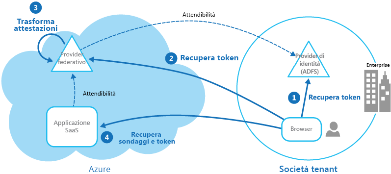

# Modello di identità federativaFederated Identity pattern

[!INCLUDE [header](../_includes/header.md)]

È possibile delegare l'autenticazione a un provider di identità esterno.Delegate authentication to an external identity provider. Questo può semplificare lo sviluppo, ridurre al minimo i requisiti per l'amministrazione utenti e migliorare l'esperienza utente dell'applicazione.This can simplify development, minimize the requirement for user administration, and improve the user experience of the application.

## Contesto e problemaContext and problem

Gli utenti di solito usano più applicazioni messe a disposizione e ospitate da diverse organizzazioni con cui hanno relazioni commerciali.Users typically need to work with multiple applications provided and hosted by different organizations they have a business relationship with. Ogni organizzazione potrebbe richiedere l'uso di credenziali specifiche (e diverse).These users might be required to use specific (and different) credentials for each one. Ciò potrebbe causare quanto segue:This can:

- **Un'esperienza utente frammentaria**.**Cause a disjointed user experience**. Gli utenti dimenticano spesso le credenziali di accesso quando ne usano molte.Users often forget sign-in credentials when they have many different ones.

- **Esposizione di vulnerabilità della sicurezza**.**Expose security vulnerabilities**. Quando un utente lascia l'azienda, il suo account deve essere immediatamente sottoposto a deprovisioning.When a user leaves the company the account must immediately be deprovisioned. È facile trascurare questa esigenza nelle aziende di grandi dimensioni.It's easy to overlook this in large organizations.

- **Gestione complicata degli utenti**.**Complicate user management**. Gli amministratori devono gestire le credenziali per tutti gli utenti ed eseguire attività aggiuntive, ad esempio inviare promemoria per le password.Administrators must manage credentials for all of the users, and perform additional tasks such as providing password reminders.

Gli utenti in genere preferiscono usare le stesse credenziali per tutte le applicazioni.Users typically prefer to use the same credentials for all these applications.

## SoluzioneSolution

Implementare un meccanismo di autenticazione in grado di usare l'identità federativa.Implement an authentication mechanism that can use federated identity. Separare l'autenticazione utente dal codice dell'applicazione e delegare l'autenticazione a un provider di identità attendibile.Separate user authentication from the application code, and delegate authentication to a trusted identity provider. In questo modo si semplifica lo sviluppo e si consente agli utenti di eseguire l'autenticazione usando un'ampia gamma di provider di identità (IdP), riducendo al minimo il carico amministrativo.This can simplify development and allow users to authenticate using a wider range of identity providers (IdP) while minimizing the administrative overhead. Si consente inoltre di separare chiaramente l'autenticazione dall'autorizzazione.It also allows you to clearly decouple authentication from authorization.

I provider di identità attendibili includono le directory aziendali, i servizi di federazione locali, altri servizi token di sicurezza (STS) di partner commerciali e i provider di identità social in grado di autenticare gli utenti che hanno, ad esempio, un account Microsoft, Google, Yahoo! o Facebook.The trusted identity providers include corporate directories, on-premises federation services, other security token services (STS) provided by business partners, or social identity providers that can authenticate users who have, for example, a Microsoft, Google, Yahoo!, or Facebook account.

Nella figura viene illustrato il modello di identità federativa quando un'applicazione client deve accedere a un servizio che richiede l'autenticazione.The figure illustrates the Federated Identity pattern when a client application needs to access a service that requires authentication. L'autenticazione viene eseguita da un IdP che interagisce con un servizio token di sicurezza.The authentication is performed by an IdP that works in concert with an STS. L'IdP rilascia token di sicurezza con informazioni relative all'utente autenticato.The IdP issues security tokens that provide information about the authenticated user. Tali informazioni, denominate attestazioni, includono l'identità dell'utente e possono includere anche altre informazioni, ad esempio l'appartenenza ai ruoli e diritti di accesso più granulari.This information, referred to as claims, includes the user’s identity, and might also include other information such as role membership and more granular access rights.

Questo modello viene spesso definito controllo di accesso basato sulle attestazioni.This model is often called claims-based access control. Le applicazioni e i servizi autorizzano l'accesso alle funzionalità basate sulle attestazioni contenute nel token.Applications and services authorize access to features and functionality based on the claims contained in the token. Il servizio che richiede l'autenticazione deve considerare attendibile il provider di identità.The service that requires authentication must trust the IdP. L'applicazione client contatta il provider di identità che esegue l'autenticazione.The client application contacts the IdP that performs the authentication. Se l'autenticazione ha esito positivo, il provider di identità restituisce un token contenente le attestazioni che identificano l'utente per il servizio STS. Si noti che il provider di identità e il servizio token di sicurezza possono essere lo stesso servizio.If the authentication is successful, the IdP returns a token containing the claims that identify the user to the STS (note that the IdP and STS can be the same service). Il servizio STS può trasformare e ottimizzare le attestazioni nel token in base a regole predefinite, prima di restituirlo al client.The STS can transform and augment the claims in the token based on predefined rules, before returning it to the client. L'applicazione client può quindi passare questo token al servizio come prova dell'identità.The client application can then pass this token to the service as proof of its identity.

> Possono essere presenti altri servizi token di sicurezza nella catena di trust.There might be additional STSs in the chain of trust. Ad esempio, nello scenario descritto in seguito, un servizio token di sicurezza locale ritiene attendibile un altro servizio token di sicurezza che è responsabile dell'accesso a un provider di identità per autenticare l'utente.For example, in the scenario described later, an on-premises STS trusts another STS that is responsible for accessing an identity provider to authenticate the user. Questo approccio è comune in scenari aziendali in cui sono presenti un servizio token di sicurezza e una directory locali.This approach is common in enterprise scenarios where there's an on-premises STS and directory.

L'autenticazione federata offre una soluzione basata su standard per il problema dell'attendibilità delle identità tra domini diversi ed è in grado di supportare l'accesso Single Sign-On.Federated authentication provides a standards-based solution to the issue of trusting identities across diverse domains, and can support single sign-on. Viene usata sempre più di frequente in tutti i tipi di applicazioni, soprattutto in quelle ospitate nel cloud, poiché supporta il Single Sign-On senza richiedere una connessione di rete diretta ai provider di identità.It's becoming more common across all types of applications, especially cloud-hosted applications, because it supports single sign-on without requiring a direct network connection to identity providers. L'utente non deve immettere le credenziali per ogni applicazione.The user doesn't have to enter credentials for every application. Ciò aumenta la protezione poiché viene impedita la creazione delle credenziali necessarie per accedere a molte applicazioni diverse e le credenziali dell'utente sono nascoste per tutti tranne il provider di identità originale.This increases security because it prevents the creation of credentials required to access many different applications, and it also hides the user’s credentials from all but the original identity provider. Le applicazioni vedono solo le informazioni dell'identità autenticata contenute all'interno del token.Applications see just the authenticated identity information contained within the token.

Il vantaggio principale offerto dall'identità federativa è il fatto che la gestione delle identità e delle credenziali è responsabilità del provider di identità.Federated identity also has the major advantage that management of the identity and credentials is the responsibility of the identity provider. L'applicazione o il servizio non richiede l'uso di funzionalità di gestione di identità.The application or service doesn't need to provide identity management features. Inoltre, negli scenari aziendali, la directory aziendale non richiede informazioni sull'utente se considera attendibile il provider di identità.In addition, in corporate scenarios, the corporate directory doesn't need to know about the user if it trusts the identity provider. In questo modo si elimina tutto il carico amministrativo dovuto alla gestione delle identità degli utenti nella directory.This removes all the administrative overhead of managing the user identity within the directory.

## Considerazioni e problemiIssues and considerations

Quando si progettano applicazioni che implementano l'autenticazione federata, tenere presente quanto segue:Consider the following when designing applications that implement federated authentication:

- L'autenticazione può essere un singolo punto di errore.Authentication can be a single point of failure. Se si distribuisce l'applicazione a più data center, considerare la possibilità di distribuire il meccanismo di gestione delle identità agli stessi data center per mantenere l'affidabilità e la disponibilità dell'applicazione.If you deploy your application to multiple datacenters, consider deploying your identity management mechanism to the same datacenters to maintain application reliability and availability.

- Gli strumenti di autenticazione consentono di configurare il controllo di accesso in base alle attestazioni di ruolo contenute nel token di autenticazione.Authentication tools make it possible to configure access control based on role claims contained in the authentication token. Ciò è noto anche come controllo di accesso basato sui ruoli (RBAC) e può consentire un livello più granulare di controllo sull'accesso a funzionalità e risorse.This is often referred to as role-based access control (RBAC), and it can allow a more granular level of control over access to features and resources.

- A differenza di una directory aziendale, l'autenticazione basata sulle attestazioni che usa i provider di identità social generalmente non offre informazioni sull'utente autenticato a parte un indirizzo di posta elettronica e forse un nome.Unlike a corporate directory, claims-based authentication using social identity providers doesn't usually provide information about the authenticated user other than an email address, and perhaps a name. Alcuni provider di identità social, ad esempio un account Microsoft, usano solo un identificatore univoco.Some social identity providers, such as a Microsoft account, provide only a unique identifier. In genere, l'applicazione deve gestire alcune informazioni sugli utenti registrati ed essere in grado di associare queste informazioni all'identificatore contenuto nelle attestazioni nel token.The application usually needs to maintain some information on registered users, and be able to match this information to the identifier contained in the claims in the token. Ciò avviene di solito durante la registrazione quando l'utente accede per la prima volta all'applicazione e in seguito le informazioni vengono inserite nel token come attestazioni aggiuntive dopo ogni autenticazione.Typically this is done through registration when the user first accesses the application, and information is then injected into the token as additional claims after each authentication.

- Se è presente più di un provider di identità configurato per il servizio token di sicurezza, è necessario rilevare a quale provider di identità deve essere reindirizzato l'utente per l'autenticazione.If there's more than one identity provider configured for the STS, it must detect which identity provider the user should be redirected to for authentication. Questo processo è detto individuazione dell'area di autenticazione.This process is called home realm discovery. Il servizio token di sicurezza potrebbe essere in grado di eseguire questa operazione automaticamente in base a un indirizzo di posta elettronica o un nome utente specificato dall'utente, un sottodominio dell'applicazione a cui accede l'utente, l'ambito dell'indirizzo IP dell'utente o il contenuto di un cookie memorizzato nel browser dell'utente.The STS might be able to do this automatically based on an email address or user name that the user provides, a subdomain of the application that the user is accessing, the user’s IP address scope, or on the contents of a cookie stored in the user’s browser. Ad esempio, se l'utente ha immesso un indirizzo di posta elettronica nel dominio Microsoft, ad esempio user@live.com, il servizio token di sicurezza reindirizzerà l'utente alla pagina di accesso dell'account Microsoft.For example, if the user entered an email address in the Microsoft domain, such as user@live.com, the STS will redirect the user to the Microsoft account sign-in page. Nelle visite successive, il servizio token di sicurezza può usare un cookie per indicare che l'ultimo accesso è stato effettuato con un account Microsoft.On later visits, the STS could use a cookie to indicate that the last sign in was with a Microsoft account. Se l'individuazione automatica non è in grado di determinare l'area di autenticazione principale, il servizio token di sicurezza visualizza una pagina di individuazione dell'area di autenticazione in cui sono elencati i provider di identità attendibili e l'utente deve selezionare quello che vuole utilizzare.If automatic discovery can't determine the home realm, the STS will display a home realm discovery page that lists the trusted identity providers, and the user must select the one they want to use.

## Quando usare questo modelloWhen to use this pattern

Questo modello è utile per scenari come:This pattern is useful for scenarios such as:

- **Single Sign-On nell'azienda**.**Single sign-on in the enterprise**. In questo scenario i dipendenti vengono autenticati per le applicazioni aziendali ospitate nel cloud all'esterno dei limiti di protezione aziendale, in modo che non siano obbligati a effettuare l'accesso ogni volta che visitano un'applicazione.In this scenario you need to authenticate employees for corporate applications that are hosted in the cloud outside the corporate security boundary, without requiring them to sign in every time they visit an application. L'esperienza utente è identica a quella in cui si usano le applicazioni locali per cui si è autenticati quando si accede a una rete aziendale e da questo momento i dipendenti hanno accesso a tutte le applicazioni pertinenti senza dover eseguire nuovamente l'accesso.The user experience is the same as when using on-premises applications where they're authenticated when signing in to a corporate network, and from then on have access to all relevant applications without needing to sign in again.

- **Identità federativa con più partner**.**Federated identity with multiple partners**. In questo scenario è necessario autenticare sia i dipendenti aziendali che i partner aziendali che non hanno un account nella directory aziendale.In this scenario you need to authenticate both corporate employees and business partners who don't have accounts in the corporate directory. Ciò è comune nelle applicazioni business-to-business, applicazioni integrate con servizi di terze parti in cui le aziende con sistemi IT diversi hanno risorse unite o condivise.This is common in business-to-business applications, applications that integrate with third-party services, and where companies with different IT systems have merged or shared resources.

- **Identità federativa nelle applicazioni SaaS**.**Federated identity in SaaS applications**. In questo scenario i fornitori di software indipendenti offrono un servizio pronto per l'uso per più client o tenant.In this scenario independent software vendors provide a ready-to-use service for multiple clients or tenants. Ogni tenant viene autenticato usando un provider di identità appropriato.Each tenant authenticates using a suitable identity provider. Ad esempio, gli utenti aziendali useranno le proprie credenziali aziendali, mentre i consumer e i client del tenant useranno le credenziali di identità social.For example, business users will use their corporate credentials, while consumers and clients of the tenant will use their social identity credentials.

Questo modello potrebbe non essere utile nelle situazioni seguenti:This pattern might not be useful in the following situations:

- Tutti gli utenti dell'applicazione possono essere autenticati da un solo provider di identità e non è obbligatorio eseguire l'autenticazione usando altri provider di identità.All users of the application can be authenticated by one identity provider, and there's no requirement to authenticate using any other identity provider. Questo è tipico nelle applicazioni aziendali che usano una directory aziendale (accessibile nell'applicazione) per l'autenticazione, usando una VPN o, in uno scenario ospitato nel cloud, una connessione di rete virtuale tra la directory locale e l'applicazione.This is typical in business applications that use a corporate directory (accessible within the application) for authentication, by using a VPN, or (in a cloud-hosted scenario) through a virtual network connection between the on-premises directory and the application.

- L'applicazione originariamente è stata creata usando un diverso meccanismo di autenticazione, probabilmente con archivi utente personalizzati, oppure non è in grado di gestire gli standard di negoziazione usati dalle tecnologie basate su attestazioni.The application was originally built using a different authentication mechanism, perhaps with custom user stores, or doesn't have the capability to handle the negotiation standards used by claims-based technologies. L'adeguamento del controllo di accesso e dell'autenticazione basata su attestazioni nelle applicazioni esistenti può essere complesso ed economicamente non conveniente.Retrofitting claims-based authentication and access control into existing applications can be complex, and probably not cost effective.

## EsempioExample

Un'organizzazione ospita un'applicazione SaaS in Microsoft Azure.An organization hosts a multi-tenant software as a service (SaaS) application in Microsoft Azure. L'applicazione include un sito Web che i tenant possono usare per gestire l'applicazione per i propri utenti.The application includes a website that tenants can use to manage the application for their own users. L'applicazione consente ai tenant di accedere al sito Web usando un'identità federativa generata da Active Directory Federation Services (ADFS) quando un utente è autenticato da tale organizzazione con Active Directory.The application allows tenants to access the website by using a federated identity that is generated by Active Directory Federation Services (ADFS) when a user is authenticated by that organization’s own Active Directory.

Nella figura viene illustrato come i tenant eseguono l'autenticazione con il proprio provider di identità (passaggio 1), in questo caso ADFS.The figure shows how tenants authenticate with their own identity provider (step 1), in this case ADFS. Dopo aver autenticato un tenant, ADFS rilascia un token.After successfully authenticating a tenant, ADFS issues a token. Il browser client inoltra il token al provider federativo dell'applicazione SaaS, che considera attendibili i token emessi da ADFS del tenant, per ottenere un token valido per il provider federativo SaaS (passaggio 2).The client browser forwards this token to the SaaS application’s federation provider, which trusts tokens issued by the tenant’s ADFS, in order to get back a token that is valid for the SaaS federation provider (step 2). Se necessario, il provider federativo SaaS esegue una trasformazione delle attestazioni contenute nel token in attestazioni che l'applicazione è in grado di riconoscere (passaggio 3) prima di restituire il nuovo token al browser client.If necessary, the SaaS federation provider performs a transformation on the claims in the token into claims that the application recognizes (step 3) before returning the new token to the client browser. L'applicazione considera attendibili i token rilasciati dal provider federativo SaaS e usa le attestazioni nel token per applicare le regole di autorizzazione (passaggio 4).The application trusts tokens issued by the SaaS federation provider and uses the claims in the token to apply authorization rules (step 4).

I tenant non dovranno ricordare credenziali separate per accedere all'applicazione e un amministratore della società del tenant può configurare nel proprio servizio ADFS l'elenco di utenti che possono accedere all'applicazione.Tenants won't need to remember separate credentials to access the application, and an administrator at the tenant’s company can configure in its own ADFS the list of users that can access the application.

## Informazioni correlateRelated guidance

- [Microsoft Azure Active DirectoryMicrosoft Azure Active Directory](https://azure.microsoft.com/services/active-directory/)
- [Active Directory Domain ServicesActive Directory Domain Services](https://msdn.microsoft.com/library/bb897402.aspx)
- [Active Directory Federation ServicesActive Directory Federation Services](https://msdn.microsoft.com/library/bb897402.aspx)
- [Gestione delle identità per le applicazioni multi-tenant in Microsoft AzureIdentity management for multitenant applications in Microsoft Azure](/azure/architecture/multitenant-identity)
- [Applicazioni multi-tenant in AzureMultitenant Applications in Azure](/azure/dotnet-develop-multitenant-applications)
