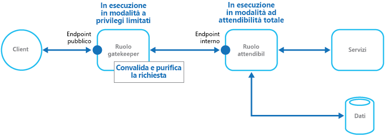

# Modello Gatekeeper

[!INCLUDE [header](../_includes/header.md)]

Proteggere le applicazioni e i servizi usando un'istanza host dedicata che funga da broker tra i client e l'applicazione o il servizio, convalidi e purifichi le richieste e passi le richieste e i dati tra di essi. Può fornire un altro livello di protezione e limitare la superficie di attacco del sistema.

## Contesto e problema

Le applicazioni espongono le proprie funzionalità ai client accettando ed elaborando le richieste. Negli scenari ospitati su cloud, le applicazioni espongono gli endpoint a cui si connettono i client, includendo in genere il codice per gestire le richieste che da questi provengono. Questo codice esegue autenticazione e convalida, elabora alcune o tutte le richieste e, probabilmente, accede alla risorsa di archiviazione e ad altri servizi per conto del client.

Se un utente malintenzionato riesce a compromettere il sistema e ad accedere all'ambiente che ospita l'applicazione, i meccanismi di sicurezza usati, ad esempio le credenziali e le chiavi di archiviazione, risulteranno esposti, insieme ai servizi e ai dati a cui l'utente ha avuto accesso. Di conseguenza, l'utente malintenzionato può accedere a informazioni riservate e altri servizi.

## Soluzione

Per ridurre al minimo il rischio che i client possano accedere a informazioni e servizi riservati, è consigliabile separare gli host o le attività che espongono gli endpoint pubblici dal codice che elabora le richieste e accede all'archiviazione. A tal fine, usare un'interfaccia o un'attività dedicata che interagisce con i client e che quindi passa la richiesta, magari attraverso un'interfaccia distinta, agli host o all'attività che la gestiranno. La figura illustra una panoramica generale di questo modello.

Il modello Gatekeeper può essere usato semplicemente per proteggere le risorse di archiviazione oppure come interfaccia più completa per proteggere tutte le funzioni dell'applicazione. Di seguito i fattori importanti:

- **Convalida controllata**. Gatekeeper convalida tutte le richieste e rifiuta quelle che non soddisfano i requisiti della convalida.
- **Rischio ed esposizione limitati**. Gatekeeper non ha accesso alle credenziali o alle chiavi usate dall'host attendibile per accedere ai servizi e all'archiviazione. Se il gatekeeper è compromesso, l'autore dell'attacco non potrà accedere a tali credenziali o chiavi.
- **Sicurezza appropriata**. Gatekeeper viene eseguito in una modalità con privilegi limitati, mentre il resto dell'applicazione viene eseguito nella modalità di totale attendibilità richiesta per accedere alle risorse di archiviazione e ai servizi. Se il gatekeeper risulta compromesso, non può accedere direttamente ai servizi o ai dati dell'applicazione.

Questo modello agisce come un firewall in una tipica topografia di rete. Consente al gatekeeper di esaminare le richieste e di prendere una decisione sull'opportunità di passare la richiesta all'host attendibile, anche noto come master chiavi, che esegue le attività richieste. In genere la decisione richiede al gatekeeper di convalidare e purificare il contenuto della richiesta prima di passarlo all'host.

## Considerazioni e problemi

Prima di decidere come implementare questo modello, considerare quanto segue:

- Verificare che gli host attendibili, a cui il gatekeeper passa le richieste, espongano solo endpoint interni o protetti e si connettano solo al gatekeeper. Gli host attendibili non devono esporre interfacce o endpoint esterni.
- Il gatekeeper deve essere eseguito in una modalità con privilegi limitati. In genere, ciò implica che il gatekeeper e l'host attendibile vengono eseguiti in macchine virtuali o servizi ospitati separati.
- Il gatekeeper non deve eseguire elaborazioni relative all'applicazione o ai servizi, o accedere ai dati. La sua funzione è esclusivamente quella di convalidare e purificare le richieste. Gli host attendibili potrebbero dover eseguire una convalida aggiuntiva delle richieste, ma la convalida principale deve essere eseguita dal gatekeeper.
- Quando possibile, usare un canale di comunicazione sicura (HTTPS, SSL o TLS) tra il gatekeeper e gli host attendibili. Alcuni ambienti di hosting non supportano il protocollo HTTPS o gli endpoint interni.
- L'aggiunta di questo livello all'applicazione per implementare il modello Gatekeeper può influire sulle prestazioni a causa dell'elaborazione e della comunicazione di rete aggiuntiva che richiede.
- L'istanza del gatekeeper potrebbe rappresentare un singolo punto di guasto. Per ridurre al minimo l'impatto di un guasto, valutare la distribuzione di istanze aggiuntive e l'utilizzo di un meccanismo di scalabilità automatica che garantisca di disporre sempre della capacità necessaria a conservare la disponibilità.

## Quando usare questo modello

Questo modello è utile per:

- Applicazioni che gestiscono informazioni riservate, espongono servizi che richiedono un elevato livello di protezione dagli attacchi o eseguono operazioni critiche che non possono essere interrotte.
- Applicazioni distribuite in cui è necessario separare l'esecuzione della convalida delle richieste dalle attività principali, o centralizzare la convalida per semplificare la gestione e la manutenzione.

## Esempio

In uno scenario ospitato su cloud, è possibile implementare questo modello separando il ruolo di gatekeeper o di macchina virtuale dai ruoli e dai servizi attendibili di un'applicazione. A tal fine, usare un endpoint interno, una coda o una risorsa di archiviazione come meccanismo di comunicazione intermedio. La figura illustra l'utilizzo di un endpoint interno.

## Modelli correlati

Il [Modello Passepartout](./valet-key.md) può essere importante durante l'implementazione del modello Gatekeeper. Durante la comunicazione tra i ruoli attendibili e il Gatekeeper è consigliabile incrementare la sicurezza tramite chiavi o token che limitano le autorizzazioni di accesso alle risorse. Descrive come usare un token o una chiave che fornisce ai client l'accesso diretto limitato a una risorsa o a un servizio specifico.
