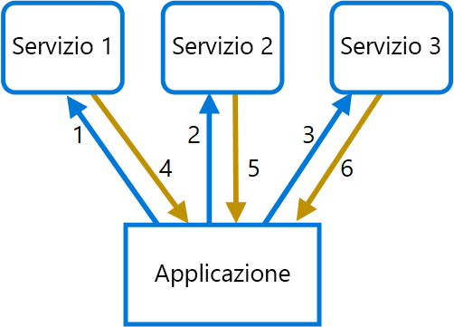

# <a name="gateway-aggregation-pattern"></a>Modello di aggregazione gateway

Usare un gateway per aggregare più richieste singole in un'unica richiesta. Questo modello è utile quando un client deve effettuare più chiamate a sistemi back-end diversi per eseguire un'operazione.

## <a name="context-and-problem"></a>Contesto e problema

Per eseguire un'attività singola, un client potrebbe dover eseguire più chiamate a vari servizi back-end. Un'applicazione che si basa su molti servizi per eseguire un'attività deve impiegare le risorse per ogni richiesta. Quando vengono aggiunti all'applicazione nuovi servizi o funzionalità, sono necessarie richieste aggiuntive e ciò aumenta ancor di più i requisiti delle risorse e le chiamate di rete. Questa frammentarietà tra il client e un servizio back-end può avere un impatto negativo sulle prestazioni e sulla scalabilità dell'applicazione.  Le architetture di microservizi hanno reso questo problema più comune, poiché le applicazioni con molti servizi più piccoli hanno naturalmente una maggiore quantità di chiamate tra servizi.

Nel diagramma seguente, il client invia richieste per ogni servizio (1,2,3). Ogni servizio elabora la richiesta e invia la risposta all'applicazione (4,5,6). In una rete cellulare con latenza generalmente elevata, l'uso di richieste singole in questa modalità è inefficiente e potrebbe causare connettività interrotta o richieste incomplete. Mentre ogni richiesta può essere eseguita in parallelo, l'applicazione deve inviare, attendere ed elaborare i dati per ogni richiesta, il tutto su connessioni separate, e ciò aumenta la possibilità di errore.



## <a name="solution"></a>Soluzione

Usare un gateway per ridurre la frammentarietà tra il client e i servizi. Il gateway riceve le richieste client, le invia ai diversi sistemi back-end e successivamente aggrega i risultati e li invia al client richiedente.

Questo modello può ridurre il numero di richieste che l'applicazione invia ai servizi back-end e migliorare le prestazioni dell'applicazione su reti a latenza elevata.

Nel diagramma seguente l'applicazione invia una richiesta al gateway (1) contenente un pacchetto di richieste aggiuntive. Il gateway le scompone ed elabora ogni richiesta inviandola al servizio pertinente (2). Ogni servizio restituisce una risposta al gateway (3). Il gateway combina le risposte da ogni servizio e invia la risposta all'applicazione (4). L'applicazione esegue una richiesta singola e riceve solo una risposta singola dal gateway.


## <a name="issues-and-considerations"></a>Considerazioni e problemi

- Il gateway non deve introdurre accoppiamenti di servizi tra i servizi back-end.
- Il gateway deve essere posizionato in prossimità di servizi back-end per ridurre la latenza il più possibile.
- Il servizio gateway può introdurre un punto di errore singolo. Assicurarsi che il gateway che sia progettato correttamente per soddisfare i requisiti di disponibilità dell'applicazione.
- Il gateway può introdurre un collo di bottiglia. Assicurarsi che il gateway abbia prestazioni adeguate per gestire il carico e che possa essere ridimensionato per soddisfare la crescita prevista.
- Eseguire test di carico sul gateway per assicurarsi di non generare errori a catena nei servizi.
- Implementare una progettazione resiliente, usando tecniche come [bulkhead][bulkhead], [circuit breaking][circuit-breaker], [retry][retry]e timeout.
- Se una o più chiamate al servizio sono troppo lunghe, può essere accettabile terminare e restituire un set parziale di dati. Prendere in considerazione la modalità con cui l'applicazione gestirà questo scenario.
- Usare I/O asincroni per garantire che un ritardo nel back-end non causi problemi di prestazioni nell'applicazione.
- Implementare la traccia distribuita usando ID di correlazione per tenere traccia di ogni singola chiamata.
- Monitorare la metrica per le richieste e le dimensioni delle richieste.
- Valutare la restituzione di dati memorizzati nella cache come strategia di failover per gestire gli errori.
- Invece di compilare l'aggregazione nel gateway, considerare il posizionamento di un servizio di aggregazione dietro il gateway. L'aggregazione di richieste avrà probabilmente requisiti di risorse diversi rispetto ad altri servizi nel gateway e può influenzare il routing del gateway e la funzionalità di offload.

## <a name="when-to-use-this-pattern"></a>Quando usare questo modello

Usare questo modello quando:

- È necessario che un client comunichi con più servizi back-end per eseguire un'operazione.
- Il client può usare reti con una latenza significativa, ad esempio reti cellulari.

Questo modello potrebbe non essere adatto nelle situazioni seguenti:

- Si desidera ridurre il numero di chiamate tra un client e un servizio singolo tra più operazioni. In questo scenario può essere preferibile aggiungere un'operazione batch al servizio.
- Il client o l'applicazione sono posizionati in prossimità di servizi back-end e la latenza non è un fattore significativo.

## <a name="example"></a>Esempio

Nell'esempio seguente viene illustrato come creare un servizio semplice NGINX di aggregazione gateway usando Lua.

```lua
worker_processes  4;

events {
  worker_connections 1024;
}

http {
  server {
    listen 80;

    location = /batch {
      content_by_lua '
        ngx.req.read_body()

        -- read json body content
        local cjson = require "cjson"
        local batch = cjson.decode(ngx.req.get_body_data())["batch"]

        -- create capture_multi table
        local requests = {}
        for i, item in ipairs(batch) do
          table.insert(requests, {item.relative_url, { method = ngx.HTTP_GET}})
        end

        -- execute batch requests in parallel
        local results = {}
        local resps = { ngx.location.capture_multi(requests) }
        for i, res in ipairs(resps) do
          table.insert(results, {status = res.status, body = cjson.decode(res.body), header = res.header})
        end

        ngx.say(cjson.encode({results = results}))
      ';
    }

    location = /service1 {
      default_type application/json;
      echo '{"attr1":"val1"}';
    }

    location = /service2 {
      default_type application/json;
      echo '{"attr2":"val2"}';
    }
  }
}
```

## <a name="related-guidance"></a>Informazioni correlate

- [Modello back-end per front-end](./backends-for-frontends.md)
- [Modello di offload gateway](./gateway-offloading.md)
- [Modello di routing gateway](./gateway-routing.md)

[bulkhead]: ./bulkhead.md
[circuit-breaker]: ./circuit-breaker.md
[retry]: ./retry.md