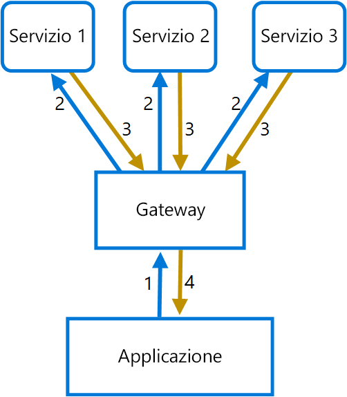

# <a name="gateway-aggregation-pattern"></a><span data-ttu-id="b4ba3-103">Modello di aggregazione gateway</span><span class="sxs-lookup"><span data-stu-id="b4ba3-103">Gateway Aggregation pattern</span></span>

<span data-ttu-id="b4ba3-104">Usare un gateway per aggregare più richieste singole in un'unica richiesta.</span><span class="sxs-lookup"><span data-stu-id="b4ba3-104">Use a gateway to aggregate multiple individual requests into a single request.</span></span> <span data-ttu-id="b4ba3-105">Questo modello è utile quando un client deve effettuare più chiamate a sistemi back-end diversi per eseguire un'operazione.</span><span class="sxs-lookup"><span data-stu-id="b4ba3-105">This pattern is useful when a client must make multiple calls to different backend systems to perform an operation.</span></span>

## <a name="context-and-problem"></a><span data-ttu-id="b4ba3-106">Contesto e problema</span><span class="sxs-lookup"><span data-stu-id="b4ba3-106">Context and problem</span></span>

<span data-ttu-id="b4ba3-107">Per eseguire un'attività singola, un client potrebbe dover eseguire più chiamate a vari servizi back-end.</span><span class="sxs-lookup"><span data-stu-id="b4ba3-107">To perform a single task, a client may have to make multiple calls to various backend services.</span></span> <span data-ttu-id="b4ba3-108">Un'applicazione che si basa su molti servizi per eseguire un'attività deve impiegare le risorse per ogni richiesta.</span><span class="sxs-lookup"><span data-stu-id="b4ba3-108">An application that relies on many services to perform a task must expend resources on each request.</span></span> <span data-ttu-id="b4ba3-109">Quando vengono aggiunti all'applicazione nuovi servizi o funzionalità, sono necessarie richieste aggiuntive e ciò aumenta ancor di più i requisiti delle risorse e le chiamate di rete.</span><span class="sxs-lookup"><span data-stu-id="b4ba3-109">When any new feature or service is added to the application, additional requests are needed, further increasing resource requirements and network calls.</span></span> <span data-ttu-id="b4ba3-110">Questa frammentarietà tra il client e un servizio back-end può avere un impatto negativo sulle prestazioni e sulla scalabilità dell'applicazione.</span><span class="sxs-lookup"><span data-stu-id="b4ba3-110">This chattiness between a client and a backend can adversely impact the performance and scale of the application.</span></span>  <span data-ttu-id="b4ba3-111">Le architetture di microservizi hanno reso questo problema più comune, poiché le applicazioni con molti servizi più piccoli hanno naturalmente una maggiore quantità di chiamate tra servizi.</span><span class="sxs-lookup"><span data-stu-id="b4ba3-111">Microservice architectures have made this problem more common, as applications built around many smaller services naturally have a higher amount of cross-service calls.</span></span> 

<span data-ttu-id="b4ba3-112">Nel diagramma seguente, il client invia richieste per ogni servizio (1,2,3).</span><span class="sxs-lookup"><span data-stu-id="b4ba3-112">In the following diagram, the client sends requests to each service (1,2,3).</span></span> <span data-ttu-id="b4ba3-113">Ogni servizio elabora la richiesta e invia la risposta all'applicazione (4,5,6).</span><span class="sxs-lookup"><span data-stu-id="b4ba3-113">Each service processes the request and sends the response back to the application (4,5,6).</span></span> <span data-ttu-id="b4ba3-114">In una rete cellulare con latenza generalmente elevata, l'uso di richieste singole in questa modalità è inefficiente e potrebbe causare connettività interrotta o richieste incomplete.</span><span class="sxs-lookup"><span data-stu-id="b4ba3-114">Over a cellular network with typically high latency, using individual requests in this manner is inefficient and could result in broken connectivity or incomplete requests.</span></span> <span data-ttu-id="b4ba3-115">Mentre ogni richiesta può essere eseguita in parallelo, l'applicazione deve inviare, attendere ed elaborare i dati per ogni richiesta, il tutto su connessioni separate, e ciò aumenta la possibilità di errore.</span><span class="sxs-lookup"><span data-stu-id="b4ba3-115">While each request may be done in parallel, the application must send, wait, and process data for each request, all on separate connections, increasing the chance of failure.</span></span>

 

## <a name="solution"></a><span data-ttu-id="b4ba3-116">Soluzione</span><span class="sxs-lookup"><span data-stu-id="b4ba3-116">Solution</span></span>

<span data-ttu-id="b4ba3-117">Usare un gateway per ridurre la frammentarietà tra il client e i servizi.</span><span class="sxs-lookup"><span data-stu-id="b4ba3-117">Use a gateway to reduce chattiness between the client and the services.</span></span> <span data-ttu-id="b4ba3-118">Il gateway riceve le richieste client, le invia ai diversi sistemi back-end e successivamente aggrega i risultati e li invia al client richiedente.</span><span class="sxs-lookup"><span data-stu-id="b4ba3-118">The gateway receives client requests, dispatches requests to the various backend systems, and then aggregates the results and sends them back to the requesting client.</span></span>

<span data-ttu-id="b4ba3-119">Questo modello può ridurre il numero di richieste che l'applicazione invia ai servizi back-end e migliorare le prestazioni dell'applicazione su reti a latenza elevata.</span><span class="sxs-lookup"><span data-stu-id="b4ba3-119">This pattern can reduce the number of requests that the application makes to backend services, and improve application performance over high-latency networks.</span></span>

<span data-ttu-id="b4ba3-120">Nel diagramma seguente l'applicazione invia una richiesta al gateway (1)</span><span class="sxs-lookup"><span data-stu-id="b4ba3-120">In the following diagram, the application sends a request to the gateway (1).</span></span> <span data-ttu-id="b4ba3-121">contenente un pacchetto di richieste aggiuntive.</span><span class="sxs-lookup"><span data-stu-id="b4ba3-121">The request contains a package of additional requests.</span></span> <span data-ttu-id="b4ba3-122">Il gateway le scompone ed elabora ogni richiesta inviandola al servizio pertinente (2).</span><span class="sxs-lookup"><span data-stu-id="b4ba3-122">The gateway decomposes these and processes each request by sending it to the relevant service (2).</span></span> <span data-ttu-id="b4ba3-123">Ogni servizio restituisce una risposta al gateway (3).</span><span class="sxs-lookup"><span data-stu-id="b4ba3-123">Each service returns a response to the gateway (3).</span></span> <span data-ttu-id="b4ba3-124">Il gateway combina le risposte da ogni servizio e invia la risposta all'applicazione (4).</span><span class="sxs-lookup"><span data-stu-id="b4ba3-124">The gateway combines the responses from each service and sends the response to the application (4).</span></span> <span data-ttu-id="b4ba3-125">L'applicazione esegue una richiesta singola e riceve solo una risposta singola dal gateway.</span><span class="sxs-lookup"><span data-stu-id="b4ba3-125">The application makes a single request and receives only a single response from the gateway.</span></span>



## <a name="issues-and-considerations"></a><span data-ttu-id="b4ba3-126">Considerazioni e problemi</span><span class="sxs-lookup"><span data-stu-id="b4ba3-126">Issues and considerations</span></span>

- <span data-ttu-id="b4ba3-127">Il gateway non deve introdurre accoppiamenti di servizi tra i servizi back-end.</span><span class="sxs-lookup"><span data-stu-id="b4ba3-127">The gateway should not introduce service coupling across the backend services.</span></span>
- <span data-ttu-id="b4ba3-128">Il gateway deve essere posizionato in prossimità di servizi back-end per ridurre la latenza il più possibile.</span><span class="sxs-lookup"><span data-stu-id="b4ba3-128">The gateway should be located near the backend services to reduce latency as much as possible.</span></span>
- <span data-ttu-id="b4ba3-129">Il servizio gateway può introdurre un punto di errore singolo.</span><span class="sxs-lookup"><span data-stu-id="b4ba3-129">The gateway service may introduce a single point of failure.</span></span> <span data-ttu-id="b4ba3-130">Assicurarsi che il gateway che sia progettato correttamente per soddisfare i requisiti di disponibilità dell'applicazione.</span><span class="sxs-lookup"><span data-stu-id="b4ba3-130">Ensure the gateway is properly designed to meet your application's availability requirements.</span></span>
- <span data-ttu-id="b4ba3-131">Il gateway può introdurre un collo di bottiglia.</span><span class="sxs-lookup"><span data-stu-id="b4ba3-131">The gateway may introduce a bottleneck.</span></span> <span data-ttu-id="b4ba3-132">Assicurarsi che il gateway abbia prestazioni adeguate per gestire il carico e che possa essere ridimensionato per soddisfare la crescita prevista.</span><span class="sxs-lookup"><span data-stu-id="b4ba3-132">Ensure the gateway has adequate performance to handle load and can be scaled to meet your anticipated growth.</span></span>
- <span data-ttu-id="b4ba3-133">Eseguire test di carico sul gateway per assicurarsi di non generare errori a catena nei servizi.</span><span class="sxs-lookup"><span data-stu-id="b4ba3-133">Perform load testing against the gateway to ensure you don't introduce cascading failures for services.</span></span>
- <span data-ttu-id="b4ba3-134">Implementare una progettazione resiliente, usando tecniche come [bulkhead][bulkhead], [circuit breaking][circuit-breaker], [retry][retry]e timeout.</span><span class="sxs-lookup"><span data-stu-id="b4ba3-134">Implement a resilient design, using techniques such as [bulkheads][bulkhead], [circuit breaking][circuit-breaker], [retry][retry], and timeouts.</span></span>
- <span data-ttu-id="b4ba3-135">Se una o più chiamate al servizio sono troppo lunghe, può essere accettabile terminare e restituire un set parziale di dati.</span><span class="sxs-lookup"><span data-stu-id="b4ba3-135">If one or more service calls takes too long, it may be acceptable to timeout and return a partial set of data.</span></span> <span data-ttu-id="b4ba3-136">Prendere in considerazione la modalità con cui l'applicazione gestirà questo scenario.</span><span class="sxs-lookup"><span data-stu-id="b4ba3-136">Consider how your application will handle this scenario.</span></span>
- <span data-ttu-id="b4ba3-137">Usare I/O asincroni per garantire che un ritardo nel back-end non causi problemi di prestazioni nell'applicazione.</span><span class="sxs-lookup"><span data-stu-id="b4ba3-137">Use asynchronous I/O to ensure that a delay at the backend doesn't cause performance issues in the application.</span></span>
- <span data-ttu-id="b4ba3-138">Implementare la traccia distribuita usando ID di correlazione per tenere traccia di ogni singola chiamata.</span><span class="sxs-lookup"><span data-stu-id="b4ba3-138">Implement distributed tracing using correlation IDs to track each individual call.</span></span>
- <span data-ttu-id="b4ba3-139">Monitorare la metrica per le richieste e le dimensioni delle richieste.</span><span class="sxs-lookup"><span data-stu-id="b4ba3-139">Monitor request metrics and response sizes.</span></span>
- <span data-ttu-id="b4ba3-140">Valutare la restituzione di dati memorizzati nella cache come strategia di failover per gestire gli errori.</span><span class="sxs-lookup"><span data-stu-id="b4ba3-140">Consider returning cached data as a failover strategy to handle failures.</span></span>
- <span data-ttu-id="b4ba3-141">Invece di compilare l'aggregazione nel gateway, considerare il posizionamento di un servizio di aggregazione dietro il gateway.</span><span class="sxs-lookup"><span data-stu-id="b4ba3-141">Instead of building aggregation into the gateway, consider placing an aggregation service behind the gateway.</span></span> <span data-ttu-id="b4ba3-142">L'aggregazione di richieste avrà probabilmente requisiti di risorse diversi rispetto ad altri servizi nel gateway e può influenzare il routing del gateway e la funzionalità di offload.</span><span class="sxs-lookup"><span data-stu-id="b4ba3-142">Request aggregation will likely have different resource requirements than other services in the gateway and may impact the gateway's routing and offloading functionality.</span></span>

## <a name="when-to-use-this-pattern"></a><span data-ttu-id="b4ba3-143">Quando usare questo modello</span><span class="sxs-lookup"><span data-stu-id="b4ba3-143">When to use this pattern</span></span>

<span data-ttu-id="b4ba3-144">Usare questo modello quando:</span><span class="sxs-lookup"><span data-stu-id="b4ba3-144">Use this pattern when:</span></span>

- <span data-ttu-id="b4ba3-145">È necessario che un client comunichi con più servizi back-end per eseguire un'operazione.</span><span class="sxs-lookup"><span data-stu-id="b4ba3-145">A client needs to communicate with multiple backend services to perform an operation.</span></span>
- <span data-ttu-id="b4ba3-146">Il client può usare reti con una latenza significativa, ad esempio reti cellulari.</span><span class="sxs-lookup"><span data-stu-id="b4ba3-146">The client may use networks with significant latency, such as cellular networks.</span></span>

<span data-ttu-id="b4ba3-147">Questo modello potrebbe non essere adatto nelle situazioni seguenti:</span><span class="sxs-lookup"><span data-stu-id="b4ba3-147">This pattern may not be suitable when:</span></span>

- <span data-ttu-id="b4ba3-148">Si desidera ridurre il numero di chiamate tra un client e un servizio singolo tra più operazioni.</span><span class="sxs-lookup"><span data-stu-id="b4ba3-148">You want to reduce the number of calls between a client and a single service across multiple operations.</span></span> <span data-ttu-id="b4ba3-149">In questo scenario può essere preferibile aggiungere un'operazione batch al servizio.</span><span class="sxs-lookup"><span data-stu-id="b4ba3-149">In that scenario, it may be better to add a batch operation to the service.</span></span>
- <span data-ttu-id="b4ba3-150">Il client o l'applicazione sono posizionati in prossimità di servizi back-end e la latenza non è un fattore significativo.</span><span class="sxs-lookup"><span data-stu-id="b4ba3-150">The client or application is located near the backend services and latency is not a significant factor.</span></span>

## <a name="example"></a><span data-ttu-id="b4ba3-151">Esempio</span><span class="sxs-lookup"><span data-stu-id="b4ba3-151">Example</span></span>

<span data-ttu-id="b4ba3-152">Nell'esempio seguente viene illustrato come creare un servizio semplice NGINX di aggregazione gateway usando Lua.</span><span class="sxs-lookup"><span data-stu-id="b4ba3-152">The following example illustrates how to create a simple a gateway aggregation NGINX service using Lua.</span></span>

```lua
worker_processes  4;

events {
  worker_connections 1024;
}

http {
  server {
    listen 80;

    location = /batch {
      content_by_lua '
        ngx.req.read_body()

        -- read json body content
        local cjson = require "cjson"
        local batch = cjson.decode(ngx.req.get_body_data())["batch"]

        -- create capture_multi table
        local requests = {}
        for i, item in ipairs(batch) do
          table.insert(requests, {item.relative_url, { method = ngx.HTTP_GET}})
        end

        -- execute batch requests in parallel
        local results = {}
        local resps = { ngx.location.capture_multi(requests) }
        for i, res in ipairs(resps) do
          table.insert(results, {status = res.status, body = cjson.decode(res.body), header = res.header})
        end

        ngx.say(cjson.encode({results = results}))
      ';
    }

    location = /service1 {
      default_type application/json;
      echo '{"attr1":"val1"}';
    }

    location = /service2 {
      default_type application/json;
      echo '{"attr2":"val2"}';
    }
  }
}
```

## <a name="related-guidance"></a><span data-ttu-id="b4ba3-153">Informazioni correlate</span><span class="sxs-lookup"><span data-stu-id="b4ba3-153">Related guidance</span></span>

- [<span data-ttu-id="b4ba3-154">Modello back-end per front-end</span><span class="sxs-lookup"><span data-stu-id="b4ba3-154">Backends for Frontends pattern</span></span>](./backends-for-frontends.md)
- [<span data-ttu-id="b4ba3-155">Modello di offload gateway</span><span class="sxs-lookup"><span data-stu-id="b4ba3-155">Gateway Offloading pattern</span></span>](./gateway-offloading.md)
- [<span data-ttu-id="b4ba3-156">Modello Routing gateway</span><span class="sxs-lookup"><span data-stu-id="b4ba3-156">Gateway Routing pattern</span></span>](./gateway-routing.md)

[bulkhead]: ./bulkhead.md
[circuit-breaker]: ./circuit-breaker.md
[retry]: ./retry.md