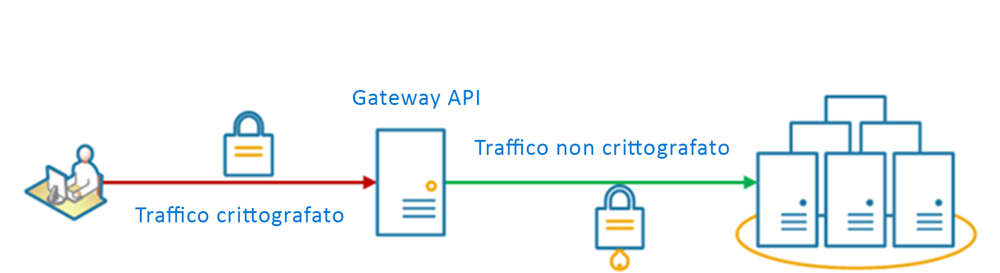

# <a name="gateway-offloading-pattern"></a>Modello di offload gateway

Eseguire l'offload delle funzionalità dei servizi condivise o specializzate in un proxy gateway. Questo modello consente di semplificare lo sviluppo di applicazioni grazie allo spostamento di funzionalità di servizi condivisi, quali l'uso di certificati SSL, da altre parti dell'applicazione nel gateway.

## <a name="context-and-problem"></a>Contesto e problema

Alcune funzionalità usate comunemente in più servizi richiedono l'esecuzione di attività di configurazione, gestione e manutenzione. Un servizio condiviso o specializzato che viene distribuito con ogni distribuzione dell'applicazione implica un incremento del carico amministrativo, nonché delle probabilità di errori di distribuzione. Tutti gli aggiornamenti di una funzionalità condivisa devono essere distribuiti in tutti i servizi che condividono tale funzionalità.

Per gestire correttamente problemi di sicurezza (convalida dei token, crittografia, gestione dei certificati SSL) e altre attività complesse, i membri del team devono essere altamente specializzati. Ad esempio, un certificato richiesto da un'applicazione deve essere configurato e distribuito in tutte le istanze dell'applicazione. Con ogni nuova distribuzione il certificato deve essere gestito per assicurarsi che non scada. In prossimità della scadenza, tutti i certificati comuni devono essere aggiornati, testati e verificati in ogni distribuzione dell'applicazione.

L'implementazione e la gestione di altri servizi comuni, tra cui l'autenticazione, l'autorizzazione, la registrazione, il monitoraggio e la [limitazione delle richieste](./throttling.md), possono risultare complicate in un numero elevato di distribuzioni. Può quindi essere opportuno consolidare questo tipo di funzionalità per ridurre il sovraccarico e la probabilità di errori.

## <a name="solution"></a>Soluzione

Eseguire l'offload in un gateway API di alcune funzionalità, in particolare di quelle con problematiche trasversali, come la gestione dei certificati, l'autenticazione, la terminazione SSL, il monitoraggio, la conversione dei protocolli e la limitazione delle richieste. 

Il diagramma seguente illustra un gateway API che termina le connessioni SSL in ingresso. Il gateway richiede i dati per conto del richiedente originale di qualsiasi server HTTP a monte del gateway API.

 
 
I vantaggi di questo schema includono:

- Semplificazione dello sviluppo di servizi, perché non è più necessario distribuire e gestire risorse di supporto, ad esempio i certificati server Web e la configurazione dei siti Web sicuri. La semplificazione della configurazione facilita la gestione e la scalabilità, semplificando a sua volta gli aggiornamenti del servizio.

- Possibilità per i team dedicati di implementare funzionalità che richiedono competenze specifiche, come la sicurezza. In questo modo il core team può concentrarsi sulle funzionalità dell'applicazione, lasciando queste problematiche trasversali agli esperti del settore.

- Implementazione di un certo livello di coerenza per la registrazione e il monitoraggio di richieste e risposte. Anche se un servizio non è instrumentato correttamente, è possibile configurare il gateway in modo da garantire un livello minimo di monitoraggio e registrazione.

## <a name="issues-and-considerations"></a>Considerazioni e problemi

- Assicurarsi che il gateway API sia resiliente agli errori e a disponibilità elevata. Per evitare singoli punti di guasto, eseguire più istanze del gateway API. 
- Assicurarsi che il gateway che sia progettato per soddisfare i requisiti di capacità e scalabilità dell'applicazione e degli endpoint. Assicurarsi che il gateway non diventi un collo di bottiglia per l'applicazione e che sia sufficientemente scalabile.
- Eseguire l'offload solo delle funzionalità usate in tutta l'applicazione, ad esempio il trasferimento di dati o la sicurezza.
- Non eseguire mai l'offload della logica di business al gateway API. 
- Se è necessario tenere traccia delle transazioni, provare a generare ID di correlazione ai fini della registrazione.

## <a name="when-to-use-this-pattern"></a>Quando usare questo modello

Usare questo modello quando:

- La distribuzione di un'applicazione implica problematiche condivise, come i certificati SSL o la crittografia.
- Una funzionalità è in comune tra più distribuzioni di applicazioni che potrebbero avere requisiti diversi in termini di risorse, ad esempio risorse di memoria, capacità di archiviazione o connessioni di rete.
- Si vuole demandare a un team specializzato la responsabilità di problemi quali la sicurezza di rete, la limitazione delle risorse o altre problematiche relative ai limiti di rete.

Questo modello potrebbe non essere adatto se introduce l'accoppiamento tra i servizi.

## <a name="example"></a>Esempio

Usando Nginx come appliance di offload SSL, la configurazione seguente consente di terminare una connessione SSL in ingresso e di distribuire la connessione a uno dei tre server HTTP a monte.

```
upstream iis {
        server  10.3.0.10    max_fails=3    fail_timeout=15s;
        server  10.3.0.20    max_fails=3    fail_timeout=15s;
        server  10.3.0.30    max_fails=3    fail_timeout=15s;
}

server {
        listen 443;
        ssl on;
        ssl_certificate /etc/nginx/ssl/domain.cer;
        ssl_certificate_key /etc/nginx/ssl/domain.key;

        location / {
                set $targ iis;
                proxy_pass http://$targ;
                proxy_set_header X-Forwarded-For $proxy_add_x_forwarded_for;
                proxy_set_header X-Forwarded-Proto https;
proxy_set_header X-Real-IP $remote_addr;
                proxy_set_header Host $host;
        }
}
```

## <a name="related-guidance"></a>Informazioni correlate

- [Modello back-end per front-end](./backends-for-frontends.md)
- [Modello di aggregazione gateway](./gateway-aggregation.md)
- [Modello di routing gateway](./gateway-routing.md)

