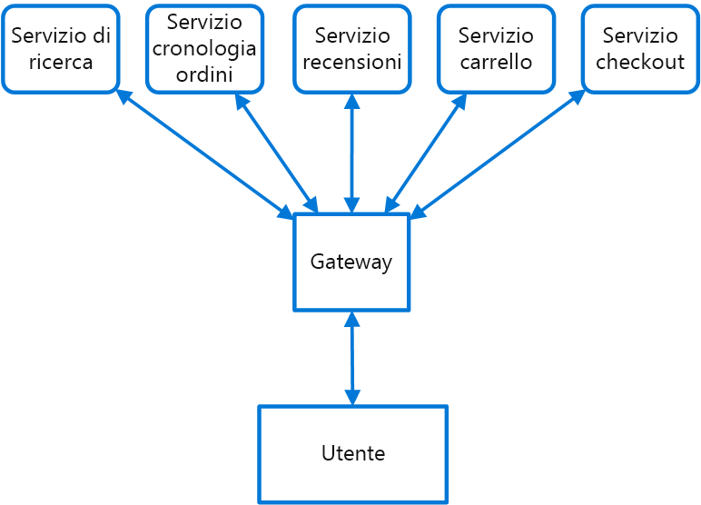

# <a name="gateway-routing-pattern"></a>Modello di routing gateway

Eseguire il routing delle richieste a più servizi, usando un singolo endpoint. Questo modello è utile quando si vuole esporre più servizi in un singolo endpoint ed eseguire il routing al servizio appropriato in base alla richiesta.

## <a name="context-and-problem"></a>Contesto e problema

Quando un client deve utilizzare più servizi, uno scenario in cui viene impostato un endpoint separato per ogni servizio e il client gestisce ogni endpoint può essere complesso. Un'applicazione di e-commerce può ad esempio fornire servizi, come la ricerca, le recensioni, il carrello, il completamento delle transazioni e la cronologia degli ordini. Ogni servizio ha un'API diversa con cui il client deve interagire e il client deve conoscere ogni endpoint per connettersi ai servizi. Se un'API viene modificata, è necessario aggiornare anche il client. Se si effettua il refactoring di un servizio in due o più servizi separati, è necessario modificare il codice sia nel servizio che nel client.

## <a name="solution"></a>Soluzione

Inserire un gateway davanti a un set di applicazioni, servizi o distribuzioni. Usare il routing delle applicazioni di livello 7 per instradare la richiesta alle istanze appropriate.

Con questo modello, l'applicazione client deve conoscere e comunicare solo con un singolo endpoint. Se un servizio viene consolidato o scomposto, il client non deve necessariamente essere aggiornato. Può continuare a inviare le richieste al gateway e solo il routing cambia.

Un gateway consente anche di astrarre i servizi back-end dai client, permettendo di mantenere semplici le chiamate client e consentendo nel contempo le modifiche ai servizi back-end dietro il gateway. Le chiamate client possono essere instradate al servizio, o ai servizi, che devono gestire il comportamento previsto del client, in modo che sia possibile aggiungere, dividere e riorganizzare i servizi dietro il gateway senza modificare il client.



Questo modello è utile anche per la distribuzione, perché consente di gestire la modalità di implementazione degli aggiornamenti per gli utenti. Quando viene distribuita una nuova versione del servizio, la distribuzione può avvenire in parallelo con la versione esistente. Il routing consente di controllare la versione del servizio presentata ai client, offrendo la flessibilità di scegliere tra diverse strategie di rilascio, ovvero implementazioni incrementali, parallele o complete degli aggiornamenti. È possibile correggere rapidamente eventuali problemi rilevati dopo la distribuzione del nuovo servizio modificando la configurazione nel gateway, senza influire sui client.

## <a name="issues-and-considerations"></a>Considerazioni e problemi

- Il servizio gateway può introdurre un punto di errore singolo. Assicurarsi che sia progettato correttamente per soddisfare i requisiti di disponibilità. Durante l'implementazione, considerare le capacità di resilienza e tolleranza di errore.
- Il servizio gateway può introdurre un collo di bottiglia. Verificare che il gateway offra prestazioni adeguate per gestire il carico e consenta facile scalabilità in base alle proprie aspettative di crescita.
- Eseguire test di carico sul gateway per assicurarsi di non introdurre errori a catena per i servizi.
- Il routing gateway è di livello 7. Può essere basato su IP, porta, intestazione o URL.

## <a name="when-to-use-this-pattern"></a>Quando usare questo modello

Usare questo modello quando:

- Un client deve utilizzare più servizi accessibili dietro un gateway.
- Si vuole semplificare le applicazioni client usando un singolo endpoint.
- È necessario eseguire il routing delle richieste da endpoint indirizzabili esternamente a endpoint virtuali interni, ad esempio esponendo le porte in una macchina virtuale agli indirizzi IP virtuali del cluster.

Questo modello potrebbe non essere appropriato quando si ha un'applicazione semplice che usa solo uno o due servizi.

## <a name="example"></a>Esempio

Usando Nginx come router, di seguito viene fornito un semplice file di configurazione di esempio per un server che esegue il routing delle richieste per le applicazioni che si trovano in directory virtuali diverse nei vari computer nel back-end.

```console
server {
    listen 80;
    server_name domain.com;

    location /app1 {
        proxy_pass http://10.0.3.10:80;
    }

    location /app2 {
        proxy_pass http://10.0.3.20:80;
    }

    location /app3 {
        proxy_pass http://10.0.3.30:80;
    }
}
```

## <a name="related-guidance"></a>Informazioni correlate

- [Modello back-end per front-end](./backends-for-frontends.md)
- [Modello di aggregazione gateway](./gateway-aggregation.md)
- [Modello di offload gateway](./gateway-offloading.md)
