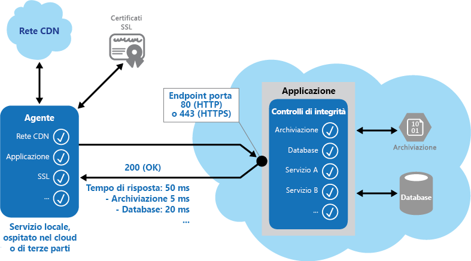

# <a name="health-endpoint-monitoring-pattern"></a>Modello di monitoraggio endpoint di integrità

[!INCLUDE [header](../_includes/header.md)]

Implementare controlli funzionali all'interno di un'applicazione a cui gli strumenti esterni possono accedere tramite endpoint esposti a intervalli regolari. Ciò consente di verificare che le applicazioni e i servizi funzionino correttamente.

## <a name="context-and-problem"></a>Contesto e problema

È buona norma, e spesso un requisito di business, monitorare le applicazioni Web e i servizi di back-end per verificare che siano disponibili e funzionino correttamente. È comunque più difficile monitorare i servizi in esecuzione nel cloud anziché i servizi locali. Ad esempio, non si esercita controllo completo sull'ambiente di hosting e i servizi in genere dipendono da altri servizi offerti dai fornitori di piattaforme e altri.

Molti fattori influiscono sulle applicazioni ospitate nel cloud, ad esempio latenza di rete, prestazioni e disponibilità dei sistemi di elaborazione e archiviazione sottostanti, nonché la larghezza di banda di rete tra questi. Il servizio può non riuscire in modo completo o parziale per via di uno di questi fattori. È pertanto necessario verificare a intervalli regolari che il servizio funzioni correttamente per garantire il livello di disponibilità richiesto, che potrebbe far parte del contratto di servizio (SLA).

## <a name="solution"></a>Soluzione

Implementare il monitoraggio dell'integrità inviando richieste a un endpoint nell'applicazione. L'applicazione deve eseguire i controlli necessari e restituire un'indicazione del relativo stato.

Un controllo di monitoraggio dell'integrità combina in genere due fattori:

- I controlli (se presenti) eseguiti dall'applicazione o dal servizio in risposta alla richiesta all'endpoint di verifica dell'integrità.
- L'analisi dei risultati eseguita dallo strumento o dal framework che esegue il controllo di verifica dell'integrità.

Il codice di risposta indica lo stato dell'applicazione e, facoltativamente, eventuali componenti o servizi usati. Il controllo di latenza o del tempo di risposta viene eseguito dallo strumento o dal framework di monitoraggio. La figura offre una panoramica del modello.



Altri controlli che possono essere eseguiti dal codice di monitoraggio dell'integrità nell'applicazione includono:
- Controllo della disponibilità e del tempo di risposta dell'archiviazione cloud o di un database.
- Controllo di risorse o servizi nell'applicazione o altrove, ma usati dall'applicazione.

Sono disponibili servizi e strumenti che monitorano le applicazioni Web inviando una richiesta a un set configurabile di endpoint e valutando i risultati a fronte di un set di regole configurabili. È relativamente semplice creare un endpoint di servizio il cui unico scopo consista nell'eseguire alcuni test funzionali nel sistema.

Controlli tipici che possono essere eseguiti dagli strumenti di monitoraggio includono:

- Convalida del codice di risposta. Ad esempio, una risposta HTTP di 200 (OK) indica che l'applicazione ha risposto senza errori. Il sistema di monitoraggio potrebbe anche controllare altri codici di risposta per offrire risultati più completi.
- Controllo del contenuto della risposta per rilevare errori, anche quando viene restituito un codice di stato 200 (OK). In questo modo è possibile rilevare errori che riguardano solo una sezione della pagina Web o della risposta del servizio restituita. Ad esempio, il controllo del titolo di una pagina o la ricerca di una frase specifica che indichi che è stata restituita la pagina corretta.
- Misurazione del tempo di risposta, che indica una combinazione di latenza di rete e del tempo impiegato dall'applicazione per eseguire la richiesta. Un valore di incremento può indicare un problema emergente con l'applicazione o la rete.
- Controllo delle risorse o dei servizi che si trovano all'esterno dell'applicazione, ad esempio una rete per la distribuzione di contenuti usata dall'applicazione per distribuire contenuti da cache globali.
- Controllo della scadenza dei certificati SSL.
- Misurazione del tempo di risposta di una ricerca DNS dell'URL dell'applicazione per misurare la latenza e gli errori DNS.
- Convalida dell'URL restituito dalla ricerca DNS per verificare le voci corrette. In questo modo è possibile evitare il reindirizzamento dannoso delle richieste mediante un attacco sul server DNS.

È anche utile, laddove possibile, eseguire questi controlli da posizioni ospitate o locali diverse per misurare e confrontare i tempi di risposta. In teoria è consigliabile monitorare le applicazioni da posizioni vicine ai clienti per ottenere una vista accurata delle prestazioni da ogni posizione. Oltre a offrire un meccanismo di controllo più efficiente, i risultati sono utili per decidere la posizione di distribuzione per l'applicazione e scegliere se distribuirla in più data center.

È consigliabile eseguire test anche per tutte le istanze del servizio usate dai clienti per verificare che l'applicazione funzioni correttamente per tutti i clienti. Ad esempio, se le risorse di archiviazione dei clienti sono suddivise in più account di archiviazione, il processo di monitoraggio dovrebbe controllarli tutti.

## <a name="issues-and-considerations"></a>Considerazioni e problemi

Prima di decidere come implementare questo modello, considerare quanto segue:

Come convalidare la risposta. Ad esempio, un singolo codice di stato 200 (OK) è sufficiente per verificare che l'applicazione funzioni correttamente? Sebbene questa situazione offra la misura ideale della disponibilità dell'applicazione e rappresenti l'implementazione minima di questo modello, fornisce poche informazioni sulle operazioni, sulle tendenze e sui possibili problemi imminenti nell'applicazione.

   >  Verificare che l'applicazione restituisca un codice di stato 200 (OK) solo se la risorsa di destinazione viene trovata ed elaborata. In alcuni scenari, ad esempio quando si usa una pagina master per ospitare la pagina Web di destinazione, il server invia di nuovo un codice di stato 200 (OK) anziché un codice 404 (non trovato), anche se la pagina dei contenuti di destinazione non è stata trovata.

Il numero di endpoint da esporre per un'applicazione. Un approccio consiste nell'esporre almeno un endpoint per i servizi di base usato dall'applicazione e un altro per i servizi di priorità inferiore, consentendo di assegnare vari livelli di importanza a ogni risultato di monitoraggio. Valutare anche di esporre più endpoint, ad esempio uno per ogni servizio di base, per garantire maggiore granularità di monitoraggio. Un controllo di verifica dell'integrità potrebbe ad esempio controllare il database, la risorsa di archiviazione e un servizio di geocodifica esterno usato da un'applicazione, ognuno richiedente un livello diverso di tempi di attività e risposta. L'applicazione potrebbe comunque essere ancora integra se il servizio di geocodifica o un'altra attività in background non è disponibile per alcuni minuti.

Se per il monitoraggio si intende usare lo stesso endpoint per l'accesso generale, ma a un percorso specifico progettato per i controlli di verifica dell'integrità, ad esempio /HealthCheck/{GUID}/ nell'endpoint di accesso generale. In questo modo alcuni test funzionali nell'applicazione possono essere eseguiti dagli strumenti di monitoraggio, ad esempio l'aggiunta di una nuova registrazione utente, l'accesso e l'inserimento di un ordine di test, verificando al contempo che l'endpoint di accesso generale sia disponibile.

Il tipo di informazioni da raccogliere nel servizio in risposta a richieste di monitoraggio e il modo in cui restituirle. La maggior parte degli strumenti e dei framework esistenti verificano solo il codice di stato HTTP restituito dall'endpoint. Per restituire e convalidare informazioni aggiuntive, potrebbe essere necessario creare un servizio o un'utilità di monitoraggio personalizzata.

Quantità di informazioni da raccogliere. L'esecuzione di eccessive elaborazioni durante il controllo può sottoporre a overload l'applicazione e influire su altri utenti. Il tempo impiegato potrebbe superare il timeout del sistema di monitoraggio, contrassegnando l'applicazione come non disponibile. La maggior parte delle applicazioni include la strumentazione, ad esempio gestori di errori e contatori delle prestazioni che registrano prestazioni e informazioni dettagliate sugli errori. Potrebbe essere sufficiente, anziché restituire altre informazioni da un controllo di verifica dell'integrità.

Memorizzazione nella cache dello stato dell'endpoint. Potrebbe essere dispendioso eseguire troppo spesso il controllo dell'integrità. Se lo stato di integrità viene ad esempio segnalato con un dashboard, non è consigliabile che ogni richiesta del dashboard attivi un controllo dell'integrità. In alternativa, controllare periodicamente l'integrità del sistema e memorizzare lo stato nella cache. Esporre un endpoint che restituisca lo stato memorizzato nella cache.

Come configurare la sicurezza per gli endpoint di monitoraggio per la protezione da accesso pubblico, che potrebbe esporre l'applicazione ad attacchi dannosi, rischiare di esporre informazioni sensibili o attirare attacchi Denial of Service (DoS). Questo deve in genere verificarsi nella configurazione dell'applicazione in modo che possa essere facilmente aggiornata senza riavviare l'applicazione. Considerare l'uso di una o più tecniche riportate di seguito:

- Proteggere l'endpoint richiedendo l'autenticazione. A tale scopo, usare una chiave di sicurezza dell'autenticazione nell'intestazione della richiesta o passare le credenziali con la richiesta, a condizione che lo strumento o il servizio di monitoraggio supporti l'autenticazione.

  - Usare un endpoint oscuro o nascosto. Ad esempio, esporre l'endpoint in un indirizzo IP diverso da quello usato dall'URL dell'applicazione predefinito, configurare l'endpoint su una porta HTTP non standard e/o usare un percorso complesso per la pagina di test. È in genere possibile specificare indirizzi e porte di endpoint aggiuntivi nella configurazione dell'applicazione e aggiungere voci per questi endpoint al server DNS, se necessario, per evitare di dover specificare direttamente l'indirizzo IP.

  - Esporre un metodo su un endpoint che accetta un parametro, ad esempio un valore di chiave o di modalità di operazione. A seconda del valore specificato per questo parametro, quando si riceve una richiesta il codice può eseguire un test o un set di test specifico oppure restituire un errore 404 (non trovato) se il valore del parametro non viene riconosciuto. Nella configurazione dell'applicazione è possibile impostare i valori dei parametri riconosciuti.

     >  Gli attacchi DoS hanno in genere un impatto inferiore su un endpoint separato che esegue test funzionali di base senza compromettere il funzionamento dell'applicazione. Evitare se possibile di usare un test che possa esporre informazioni riservate. Se è necessario restituire informazioni che potrebbero essere utili a un utente malintenzionato, valutare un modo per proteggere l'endpoint e i dati da un accesso non autorizzato. In questo caso, affidarsi all'oscuramento non è sufficiente. È opportuno valutare anche l'uso di una connessione HTTPS e la crittografia dei dati sensibili, sebbene aumenti il carico sul server.

- Come accedere a un endpoint protetto mediante autenticazione. Non tutti gli strumenti e i framework possono essere configurati per includere credenziali con la richiesta di verifica dell'integrità. Ad esempio, le funzionalità di verifica dell'integrità predefinite di Microsoft Azure non forniscono credenziali di autenticazione. Sono disponibili alcune alternative di terze parti: [Pingdom](https://www.pingdom.com/), [Panopta](http://www.panopta.com/), [NewRelic](https://newrelic.com/) e [Statuscake](https://www.statuscake.com/).

- Come garantire la corretta esecuzione dell'agente di monitoraggio. Un approccio consiste nell'esporre un endpoint che restituisce semplicemente un valore dalla configurazione dell'applicazione o un valore casuale che può essere usato per testare l'agente.

   >  Verificare anche che il sistema di monitoraggio esegua controlli su se stesso, ad esempio una verifica automatica e un test integrato, per evitare che restituisca falsi positivi.

## <a name="when-to-use-this-pattern"></a>Quando usare questo modello

Questo modello è utile per:
- Monitorare applicazioni e siti Web per verificare la disponibilità.
- Monitorare applicazioni e siti Web per confermare il corretto funzionamento.
- Monitorare servizi di livello intermedio o condivisi per rilevare e isolare un errore che può interrompere altre applicazioni.
- Integrare la strumentazione esistente nell'applicazione, ad esempio con contatori delle prestazioni e gestori degli errori. Il controllo di verifica dell'integrità non sostituisce il requisito di registrazione e controllo nell'applicazione. La strumentazione offre informazioni utili per un framework esistente che monitora contatori e log degli errori per rilevare altri problemi. Non fornisce comunque informazioni se l'applicazione non è disponibile.

## <a name="example"></a>Esempio

Gli esempi di codice seguenti, ricavati dalla classe `HealthCheckController` (un esempio che illustra questo modello è disponibile in [GitHub](https://github.com/mspnp/cloud-design-patterns/tree/master/health-endpoint-monitoring)), espongono un endpoint per l'esecuzione di un'ampia gamma di controlli di integrità.

Il metodo `CoreServices`, illustrato di seguito in C#, esegue una serie di controlli sui servizi usati nell'applicazione. Se tutti i test vengono eseguiti senza errori, il metodo restituisce un codice di stato 200 (OK). Se un test genera un'eccezione, il metodo restituisce un codice di stato 500 (errore interno). Il metodo potrebbe anche restituire informazioni aggiuntive in caso di errore, se il framework o lo strumento di monitoraggio è in grado di usarle.

```csharp
public ActionResult CoreServices()
{
  try
  {
    // Run a simple check to ensure the database is available.
    DataStore.Instance.CoreHealthCheck();

    // Run a simple check on our external service.
    MyExternalService.Instance.CoreHealthCheck();
  }
  catch (Exception ex)
  {
    Trace.TraceError("Exception in basic health check: {0}", ex.Message);

    // This can optionally return different status codes based on the exception.
    // Optionally it could return more details about the exception.
    // The additional information could be used by administrators who access the
    // endpoint with a browser, or using a ping utility that can display the
    // additional information.
    return new HttpStatusCodeResult((int)HttpStatusCode.InternalServerError);
  }
  return new HttpStatusCodeResult((int)HttpStatusCode.OK);
}
```
Il metodo `ObscurePath` mostra come leggere un percorso dalla configurazione dell'applicazione e usarlo come endpoint per i test. Questo esempio, in C#, illustra anche come accettare un ID come parametro e usarlo per verificare la presenza di richieste valide.

```csharp
public ActionResult ObscurePath(string id)
{
  // The id could be used as a simple way to obscure or hide the endpoint.
  // The id to match could be retrieved from configuration and, if matched,
  // perform a specific set of tests and return the result. If not matched it
  // could return a 404 (Not Found) status.

  // The obscure path can be set through configuration to hide the endpoint.
  var hiddenPathKey = CloudConfigurationManager.GetSetting("Test.ObscurePath");

  // If the value passed does not match that in configuration, return 404 (Not Found).
  if (!string.Equals(id, hiddenPathKey))
  {
    return new HttpStatusCodeResult((int)HttpStatusCode.NotFound);
  }

  // Else continue and run the tests...
  // Return results from the core services test.
  return this.CoreServices();
}
```

Il metodo `TestResponseFromConfig` mostra come esporre un endpoint che esegue un controllo per un valore di impostazione della configurazione specificato.

```csharp
public ActionResult TestResponseFromConfig()
{
  // Health check that returns a response code set in configuration for testing.
  var returnStatusCodeSetting = CloudConfigurationManager.GetSetting(
                                                          "Test.ReturnStatusCode");

  int returnStatusCode;

  if (!int.TryParse(returnStatusCodeSetting, out returnStatusCode))
  {
    returnStatusCode = (int)HttpStatusCode.OK;
  }

  return new HttpStatusCodeResult(returnStatusCode);
}
```
## <a name="monitoring-endpoints-in-azure-hosted-applications"></a>Monitoraggio di endpoint nelle applicazioni ospitate di Azure

Di seguito sono riportate alcune opzioni per il monitoraggio degli endpoint nelle applicazioni di Azure:

- Usare le funzionalità di monitoraggio integrate di Azure.

- Usare un framework o un servizio di terze parti come Microsoft System Center Operations Manager.

- Creare un'utilità o un servizio personalizzato eseguibile su un server proprietario oppure ospitato.

   >  Anche se Azure fornisce un set ragionevolmente completo di opzioni di monitoraggio, è possibile usare altri strumenti e servizi per fornire informazioni aggiuntive. I servizi di gestione di Azure offrono un meccanismo di monitoraggio integrato per le regole di avviso. La sezione degli avvisi della pagina relativa ai servizi di gestione nel portale di Azure consente di configurare fino a dieci regole di avviso per ogni sottoscrizione per i servizi. Queste regole specificano una condizione e un valore di soglia per un servizio, ad esempio il carico della CPU o il numero di richieste o errori al secondo, e il servizio può inviare automaticamente notifiche tramite posta elettronica agli indirizzi definiti in ogni regola.

Le condizioni che è possibile monitorare variano a seconda del meccanismo di hosting scelto per l'applicazione (ad esempio Siti Web, Servizi cloud, Macchine virtuali o Servizi mobili), ma tutti consentono di creare una regola di avviso che usa un endpoint Web specificato nelle impostazioni per il servizio. L'endpoint risponde in modo tempestivo, in modo che il sistema di avvisi possa rilevare il corretto funzionamento dell'applicazione.

>  Sono disponibili altre informazioni sulla [creazione di notifiche di avviso][portal-alerts].

Se si ospita l'applicazione nei ruoli Web e di lavoro di Servizi cloud di Azure o in Macchine virtuali, è possibile usufruire di un servizio integrato in Azure, denominato Gestione traffico. Gestione traffico è un servizio di routing e bilanciamento del carico che consente di distribuire le richieste a istanze specifiche dell'applicazione ospitata in Servizi cloud in base a un'ampia gamma di regole e impostazioni.

Oltre al routing delle richieste, Gestione traffico esegue il ping di un URL, una porta e un percorso relativo specificati a intervalli regolari per determinare quali istanze dell'applicazione definita nelle regole sono attive e rispondono alle richieste. Se rileva un codice di stato 200 (OK), contrassegna l'applicazione come disponibile. Con qualsiasi altro codice di stato, Gestione traffico contrassegna l'applicazione come offline. È possibile visualizzare lo stato nella console di Gestione traffico e configurare la regola per reindirizzare le richieste ad altre istanze dell'applicazione che rispondono.

Gestione traffico attenderà tuttavia solo dieci secondi per ricevere una risposta dall'URL di monitoraggio. È pertanto necessario verificare che il codice di verifica dell'integrità sia in esecuzione, consentendo la latenza di rete necessaria per il round trip da Gestione traffico all'applicazione e viceversa.

>  Sono disponibili altre informazioni sull'uso di [Gestione traffico per monitorare le applicazioni](https://azure.microsoft.com/documentation/services/traffic-manager/). Gestione traffico è anche descritto in[Multiple Datacenter Deployment Guidance](https://msdn.microsoft.com/library/dn589779.aspx) (Guida alla distribuzione in più data center).

## <a name="related-guidance"></a>Informazioni correlate

Quando si implementa questo modello, possono essere utili le linee guida seguenti:
- [Indicazioni sulla strumentazione e la telemetria](https://msdn.microsoft.com/library/dn589775.aspx). Il controllo dell'integrità di servizi e componenti viene in genere eseguita mediante probing, ma è anche utile avere a disposizione le informazioni per monitorare le prestazioni dell'applicazione e rilevare gli eventi che si verificano durante il runtime. Questi dati possono essere trasmessi di nuovo agli strumenti di monitoraggio come informazioni aggiuntive per il monitoraggio dell'integrità. Indicazioni sulla strumentazione e la telemetria esplora le informazioni di diagnostica raccolte dalla strumentazione di applicazioni.
- [Ricezione di avvisi di allerta][portal-alerts].
- Questo modello include un'[applicazione di esempio](https://github.com/mspnp/cloud-design-patterns/tree/master/health-endpoint-monitoring) scaricabile.

[portal-alerts]: https://azure.microsoft.com/documentation/articles/insights-receive-alert-notifications/
