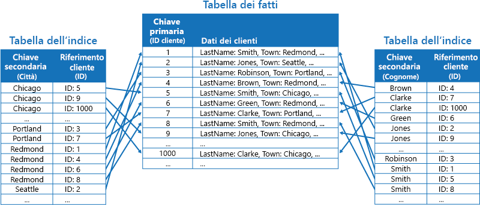
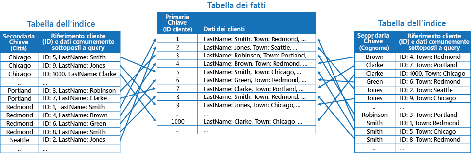
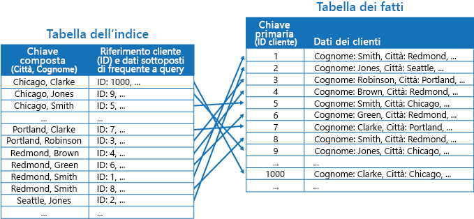

# Modello di tabella degli indici

[!INCLUDE [header](../_includes/header.md)]

Creare indici sui campi negli archivi dati spesso referenziati dalle query. Questo modello può migliorare le prestazioni delle query, consentendo alle applicazioni di individuare più rapidamente i dati da recuperare da un archivio dati.

## Contesto e problema

Molti archivi dati consentono di organizzare i dati per una raccolta di entità usando la chiave primaria. Un'applicazione può usare questa chiave per individuare e recuperare i dati. Nella figura viene illustrato un esempio di un archivio dati che contiene informazioni sul cliente. La chiave primaria è l'ID cliente. La figura mostra informazioni sul cliente organizzate per la chiave primaria (ID cliente).

Mentre la chiave primaria è utile per le query che recuperano i dati in base al suo valore, un'applicazione potrebbe non riuscire a usare la chiave primaria se è necessario recuperare i dati in base a un altro campo. Nell'esempio dei clienti un'applicazione non può usare la chiave primaria ID cliente per recuperare i clienti se sottopone a query i dati facendo riferimento solamente al valore di qualche altro attributo, ad esempio la città in cui si trova il cliente. Per eseguire una query come questa, l'applicazione potrebbe dover recuperare ed esaminare ogni record del cliente, processo che potrebbe rivelarsi lento.

Molti sistemi di gestione di database relazionali supportano gli indici secondari. Un indice secondario è una struttura dei dati separata organizzata per uno o più campi chiave non primari (secondari) e indica dove sono archiviati i dati per ogni valore indicizzato. In genere, gli elementi in un indice secondario sono ordinati in base al valore delle chiavi secondarie per consentire una ricerca rapida dei dati. Questi indici sono in genere gestiti automaticamente dal sistema di gestione di database.

È possibile creare tutti gli indici secondari necessari per supportare le diverse query eseguite dall'applicazione. Ad esempio, in una tabella Clienti in un database relazionale dove l'ID cliente è la chiave primaria, è utile aggiungere un indice secondario sul campo della città se l'applicazione cerca spesso i clienti per la città in cui risiedono.

Tuttavia, anche se gli indici secondari sono comuni nei sistemi relazionali, la maggior parte degli archivi dati NoSQL usati dalle applicazioni cloud non fornisce una funzionalità equivalente.

## Soluzione

Se l'archivio dati non supporta gli indici secondari, è possibile emularli manualmente tramite la creazione di tabelle dell'indice. Una tabella dell'indice consente di organizzare i dati in base a una chiave specifica. Per strutturare una tabella dell'indice, vengono comunemente usate tre strategie, a seconda del numero di indici secondari necessari e della natura delle query eseguite da un'applicazione.

La prima strategia consiste nel duplicare i dati in ciascuna tabella dell'indice organizzandoli però in base a chiavi diverse (denormalizzazione completa). La figura seguente mostra le tabelle dell'indice che consentono di organizzare le informazioni del cliente in base a Town (Città) e LastName (Cognome).

Questa strategia è adeguata se i dati sono relativamente statici rispetto al numero di volte in cui vengono sottoposti a query usando ciascuna chiave. Se i dati sono più dinamici, il sovraccarico della gestione di ogni tabella dell'indice diventa troppo grande perché questo approccio sia utile. Inoltre, se il volume dei dati è molto elevato, la quantità di spazio necessaria per archiviare i dati duplicati diventa significativa.

La seconda strategia consiste nel creare le tabelle dell'indice normalizzate organizzate in base a diverse chiavi e nel far riferimento ai dati originali usando la chiave primaria, anziché duplicandola, come illustrato nella figura seguente. I dati originali vengono chiamati da una tabella dei fatti.

Questa tecnica consente di risparmiare spazio e riduce il sovraccarico della gestione dei dati duplicati. Lo svantaggio è che un'applicazione deve eseguire due operazioni di ricerca per trovare i dati usando una chiave secondaria. Deve trovare la chiave primaria per i dati nella tabella dell'indice e quindi usare la chiave primaria per cercare i dati nella tabella dei fatti.

La terza strategia consiste nel creare tabelle dell'indice parzialmente normalizzate organizzate in base a chiavi diverse che duplicano spesso i campi recuperati. Fare riferimento alla tabella dei fatti per accedere ai campi con accesso meno frequente. La figura successiva illustra come i campi usati più frequentemente vengano duplicati in ogni tabella dell'indice.

Con questa strategia, è possibile raggiungere un equilibrio tra i primi due approcci. I dati per le query comuni possono essere recuperati rapidamente usando una singola ricerca, mentre il sovraccarico dello spazio e della manutenzione non è significativo come duplicare l'intero set di dati.

Se un'applicazione esegue di frequente query di dati specificando una combinazione di valori (ad esempio, "Trova tutti i clienti che risiedono a Redmond e di cognome Smith"), è possibile implementare le chiavi negli elementi della tabella dell'indice come una concatenazione degli attributi Town (Città) e LastName (Cognome). La figura seguente mostra una tabella dell'indice basata sulle chiavi composte. Le chiavi vengono ordinate in base a Town (Città) e quindi a LastName (Cognome) per i record che hanno lo stesso valore per Town (Città).

Le tabelle dell'indice possono velocizzare le operazioni di query su dati partizionati e sono particolarmente utili laddove la chiave di partizione venga sottoposta a hash. La figura seguente mostra un esempio in cui la chiave di partizione è un hash dell'ID cliente. La tabella dell'indice può organizzare i dati in base al valore senza hash (Town [Città] e LastName [Cognome]) e fornire la chiave di partizione con hash come i dati di ricerca. Ciò consente di evitare all'applicazione di calcolare ripetutamente le chiavi hash (operazione dispendiosa) quando occorre recuperare i dati che rientrano in un intervallo o recuperare i dati nell'ordine della chiave senza hash. Ad esempio, una query come "Trova tutti i clienti che risiedono in Redmond" può essere risolta rapidamente individuando gli elementi corrispondenti nella tabella dell'indice, in cui sono tutti archiviati in un blocco contiguo. Seguire quindi i riferimenti ai dati dei clienti usando le chiavi di partizione archiviate nella tabella dell'indice.

## Considerazioni e problemi

Prima di decidere come implementare questo modello, considerare quanto segue:

- Il sovraccarico della gestione degli indici secondari può essere significativo. È necessario analizzare e comprendere le query usate dall'applicazione. Creare le tabelle dell'indice solo quando possono essere usate regolarmente. Non creare tabelle dell'indice speculative per supportare le query che un'applicazione non esegue o esegue solo occasionalmente.
- La duplicazione dei dati in una tabella dell'indice può aggiungere un sovraccarico significativo ai costi di archiviazione e allo sforzo necessario per mantenere più copie di dati.
- L'implementazione di una tabella dell'indice come una struttura normalizzata che fa riferimento ai dati originali richiede che un'applicazione esegua due operazioni di ricerca per trovare i dati. La prima operazione fa una ricerca nella tabella dell'indice per recuperare la chiave primaria, mentre la seconda usa la chiave primaria per recuperare i dati.
- Se un sistema incorpora un numero di tabelle dell'indice su set di dati molto grandi, può rendere difficile mantenere la coerenza tra le tabelle dell'indice e i dati originali. Potrebbe essere possibile progettare l'applicazione sulla base del modello di coerenza finale. Ad esempio, per inserire, aggiornare o eliminare dati, un'applicazione può inviare un messaggio a una coda e consentire a un'attività separata di eseguire l'operazione e mantenere le tabelle dell'indice che fanno riferimento a questi dati in modo asincrono. Per altre informazioni sull'implementazione della coerenza finale, vedere [Data Consistency Primer](https://msdn.microsoft.com/library/dn589800.aspx) (Informazioni relative alla coerenza dei dati).

   >  Le tabelle di archiviazione di Microsoft Azure supportano gli aggiornamenti transazionali per le modifiche apportate ai dati contenuti nella stessa partizione (definite come transazioni dei gruppi di entità). Se è possibile archiviare i dati di una tabella dei fatti e di una o più tabelle dell'indice nella stessa partizione, questa funzionalità può essere usata per garantire la coerenza.

- Le stesse tabelle dell'indice potrebbero essere partizionate.

## Quando usare questo modello

Usare questo modello per migliorare le prestazioni delle query quando un'applicazione deve poter recuperare spesso i dati con una chiave diversa dalla chiave primaria (o di partizione).

Questo modello potrebbe non essere utile quando:

- I dati sono volatili. Una tabella dell'indice può diventare obsoleta molto rapidamente, diventando inefficace o rendendo il sovraccarico della gestione della tabella dell'indice superiore a qualsiasi risparmio ottenuto usandola.
- Un campo selezionato come chiave secondaria di una tabella dell'indice non è discriminante e può avere solo un piccolo set di valori (ad esempio il genere).
- L'equilibrio dei valori dei dati di un campo selezionato come chiave secondaria per una tabella dell'indice viene fortemente alterato. Se ad esempio il 90% dei record contiene lo stesso valore in un campo, creare e gestire una tabella dell'indice per cercare i dati in base a questo campo potrebbe generare un sovraccarico superiore rispetto all'analisi sequenziale dei dati. Tuttavia questo indice può rivelarsi utile qualora le query facciano molto spesso riferimento ai valori presenti nel restante 10%. È necessario comprendere le query eseguite dall'applicazione e la frequenza di esecuzione.

## Esempio

Le tabelle di archiviazione di Azure offrono un archivio di dati chiave/valore altamente scalabile per le applicazioni in esecuzione nel cloud. Le applicazioni archiviano e recupero i valori dei dati specificando una chiave. I valori dei dati possono contenere più campi, ma la struttura di un elemento di dati è opaca per l'archiviazione tabelle, che gestisce semplicemente un elemento di dati come una matrice di byte.

Le tabelle di archiviazione di Azure supportano anche il partizionamento orizzontale. La chiave di partizionamento orizzontale include due elementi: una chiave di partizione e una chiave di riga. Gli elementi che hanno la stessa chiave di partizione vengono archiviati nella stessa partizione, mentre gli elementi vengono archiviati in base alla chiave di riga all'interno di una partizione. L'archiviazione tabelle viene ottimizzata per eseguire le query che recuperano i dati appartenenti a un intervallo contiguo di valori di chiave di riga all'interno di una partizione. Se si stanno creando applicazioni cloud che archiviano informazioni nelle tabelle di Azure, è necessario strutturare i dati tenendo presente questa funzionalità.

Ad esempio, si consideri un'applicazione che archivia le informazioni sui film. L'applicazione sottopone spesso a query i film per genere (azione, documentari, storici, commedie, drammatici, e così via). È possibile creare una tabella di Azure con partizioni per ogni genere usando il genere come chiave di partizione e indicando il nome del film come chiave di riga, come illustrato nella figura riportata di seguito.

Questo approccio è meno efficace se l'applicazione deve anche sottoporre a query i film in base all'attore. In questo caso, è possibile creare una tabella di Azure separata che agisce come una tabella dell'indice. La chiave di partizione è l'attore mentre la chiave di riga è il nome del film. I dati di ogni attore sono archiviati in partizioni distinte. Se un film è interpretato da più attori, lo stesso film si presenterà in più partizioni.

È possibile duplicare i dati dei film nei valori mantenuti per ogni partizione adottando il primo approccio descritto nella precedente sezione Soluzione. Tuttavia è probabile che ogni film verrà replicato più volte (una volta per ogni attore), pertanto potrebbe essere più efficiente denormalizzare parzialmente i dati per supportare le query più comuni (ad esempio i nomi degli altri attori) e consentire a un'applicazione di recuperare le informazioni rimanenti includendo la chiave di partizione necessaria per trovare le informazioni complete nelle partizioni del genere. Questo approccio è descritto dalla terza opzione nella sezione Soluzione. La figura seguente illustra questo approccio.

## Modelli correlati e informazioni aggiuntive

Per l'implementazione di questo modello possono risultare utili i modelli e le informazioni aggiuntive seguenti:

- [Nozioni di base sulla coerenza dei dati](https://msdn.microsoft.com/library/dn589800.aspx). Una tabella dell'indice deve essere gestita come i dati di cui indicizza le modifiche. Nel cloud, potrebbe non essere possibile o necessario eseguire le operazioni di aggiornamento di un indice come parte della stessa transazione che modifica i dati. In tal caso, è più indicato un approccio per la coerenza finale. Vengono fornite informazioni sui problemi legati alla coerenza finale.
- [Modello di partizionamento orizzontale](./sharding.md). Il modello di tabella dell'indice viene spesso usato in combinazione con dati partizionati tramite le partizioni. Il modello di partizionamento orizzontale offre altre informazioni su come suddividere un archivio dati in un set di partizioni.
- [Modello di vista materializzata](./materialized-view.md). Anziché indicizzare i dati per supportare le query che riepilogano i dati, potrebbe essere più appropriato creare una vista materializzata dei dati. Descrive come supportare query riepilogative efficienti generando viste prepopolate sui dati.
