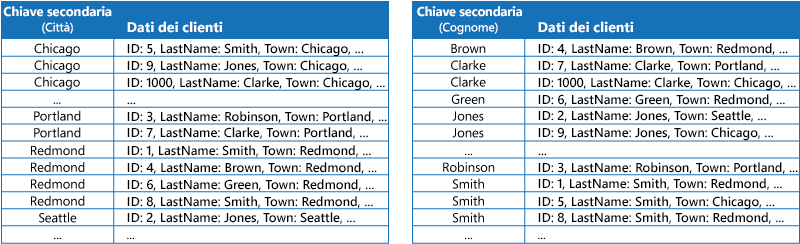
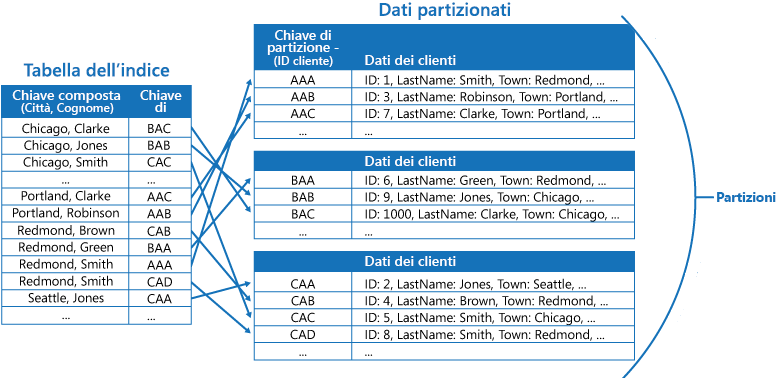
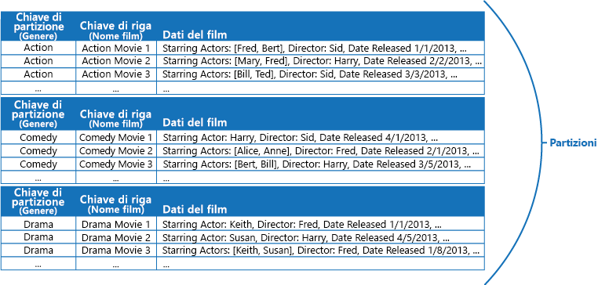

# Modello di tabella degli indiciIndex Table pattern

[!INCLUDE [header](../_includes/header.md)]

Creare indici sui campi negli archivi dati spesso referenziati dalle query.Create indexes over the fields in data stores that are frequently referenced by queries. Questo modello può migliorare le prestazioni delle query, consentendo alle applicazioni di individuare più rapidamente i dati da recuperare da un archivio dati.This pattern can improve query performance by allowing applications to more quickly locate the data to retrieve from a data store.

## Contesto e problemaContext and problem

Molti archivi dati consentono di organizzare i dati per una raccolta di entità usando la chiave primaria.Many data stores organize the data for a collection of entities using the primary key. Un'applicazione può usare questa chiave per individuare e recuperare i dati.An application can use this key to locate and retrieve data. Nella figura viene illustrato un esempio di un archivio dati che contiene informazioni sul cliente.The figure shows an example of a data store holding customer information. La chiave primaria è l'ID cliente.The primary key is the Customer ID. La figura mostra informazioni sul cliente organizzate per la chiave primaria (ID cliente).The figure shows customer information organized by the primary key (Customer ID).

Mentre la chiave primaria è utile per le query che recuperano i dati in base al suo valore, un'applicazione potrebbe non riuscire a usare la chiave primaria se è necessario recuperare i dati in base a un altro campo.While the primary key is valuable for queries that fetch data based on the value of this key, an application might not be able to use the primary key if it needs to retrieve data based on some other field. Nell'esempio dei clienti un'applicazione non può usare la chiave primaria ID cliente per recuperare i clienti se sottopone a query i dati facendo riferimento solamente al valore di qualche altro attributo, ad esempio la città in cui si trova il cliente.In the customers example, an application can't use the Customer ID primary key to retrieve customers if it queries data solely by referencing the value of some other attribute, such as the town in which the customer is located. Per eseguire una query come questa, l'applicazione potrebbe dover recuperare ed esaminare ogni record del cliente, processo che potrebbe rivelarsi lento.To perform a query such as this, the application might have to fetch and examine every customer record, which could be a slow process.

Molti sistemi di gestione di database relazionali supportano gli indici secondari.Many relational database management systems support secondary indexes. Un indice secondario è una struttura dei dati separata organizzata per uno o più campi chiave non primari (secondari) e indica dove sono archiviati i dati per ogni valore indicizzato.A secondary index is a separate data structure that's organized by one or more nonprimary (secondary) key fields, and it indicates where the data for each indexed value is stored. In genere, gli elementi in un indice secondario sono ordinati in base al valore delle chiavi secondarie per consentire una ricerca rapida dei dati.The items in a secondary index are typically sorted by the value of the secondary keys to enable fast lookup of data. Questi indici sono in genere gestiti automaticamente dal sistema di gestione di database.These indexes are usually maintained automatically by the database management system.

È possibile creare tutti gli indici secondari necessari per supportare le diverse query eseguite dall'applicazione.You can create as many secondary indexes as you need to support the different queries that your application performs. Ad esempio, in una tabella Clienti in un database relazionale dove l'ID cliente è la chiave primaria, è utile aggiungere un indice secondario sul campo della città se l'applicazione cerca spesso i clienti per la città in cui risiedono.For example, in a Customers table in a relational database where the Customer ID is the primary key, it's beneficial to add a secondary index over the town field if the application frequently looks up customers by the town where they reside.

Tuttavia, anche se gli indici secondari sono comuni nei sistemi relazionali, la maggior parte degli archivi dati NoSQL usati dalle applicazioni cloud non fornisce una funzionalità equivalente.However, although secondary indexes are common in relational systems, most NoSQL data stores used by cloud applications don't provide an equivalent feature.

## SoluzioneSolution

Se l'archivio dati non supporta gli indici secondari, è possibile emularli manualmente tramite la creazione di tabelle dell'indice.If the data store doesn't support secondary indexes, you can emulate them manually by creating your own index tables. Una tabella dell'indice consente di organizzare i dati in base a una chiave specifica.An index table organizes the data by a specified key. Per strutturare una tabella dell'indice, vengono comunemente usate tre strategie, a seconda del numero di indici secondari necessari e della natura delle query eseguite da un'applicazione.Three strategies are commonly used for structuring an index table, depending on the number of secondary indexes that are required and the nature of the queries that an application performs.

La prima strategia consiste nel duplicare i dati in ciascuna tabella dell'indice organizzandoli però in base a chiavi diverse (denormalizzazione completa).The first strategy is to duplicate the data in each index table but organize it by different keys (complete denormalization). La figura seguente mostra le tabelle dell'indice che consentono di organizzare le informazioni del cliente in base a Town (Città) e LastName (Cognome).The next figure shows index tables that organize the same customer information by Town and LastName.

Questa strategia è adeguata se i dati sono relativamente statici rispetto al numero di volte in cui vengono sottoposti a query usando ciascuna chiave.This strategy is appropriate if the data is relatively static compared to the number of times it's queried using each key. Se i dati sono più dinamici, il sovraccarico della gestione di ogni tabella dell'indice diventa troppo grande perché questo approccio sia utile.If the data is more dynamic, the processing overhead of maintaining each index table becomes too large for this approach to be useful. Inoltre, se il volume dei dati è molto elevato, la quantità di spazio necessaria per archiviare i dati duplicati diventa significativa.Also, if the volume of data is very large, the amount of space required to store the duplicate data is significant.

La seconda strategia consiste nel creare le tabelle dell'indice normalizzate organizzate in base a diverse chiavi e nel far riferimento ai dati originali usando la chiave primaria, anziché duplicandola, come illustrato nella figura seguente.The second strategy is to create normalized index tables organized by different keys and reference the original data by using the primary key rather than duplicating it, as shown in the following figure. I dati originali vengono chiamati da una tabella dei fatti.The original data is called a fact table.

Questa tecnica consente di risparmiare spazio e riduce il sovraccarico della gestione dei dati duplicati.This technique saves space and reduces the overhead of maintaining duplicate data. Lo svantaggio è che un'applicazione deve eseguire due operazioni di ricerca per trovare i dati usando una chiave secondaria.The disadvantage is that an application has to perform two lookup operations to find data using a secondary key. Deve trovare la chiave primaria per i dati nella tabella dell'indice e quindi usare la chiave primaria per cercare i dati nella tabella dei fatti.It has to find the primary key for the data in the index table, and then use the primary key to look up the data in the fact table.

La terza strategia consiste nel creare tabelle dell'indice parzialmente normalizzate organizzate in base a chiavi diverse che duplicano spesso i campi recuperati.The third strategy is to create partially normalized index tables organized by different keys that duplicate frequently retrieved fields. Fare riferimento alla tabella dei fatti per accedere ai campi con accesso meno frequente.Reference the fact table to access less frequently accessed fields. La figura successiva illustra come i campi usati più frequentemente vengano duplicati in ogni tabella dell'indice.The next figure shows how commonly accessed data is duplicated in each index table.

Con questa strategia, è possibile raggiungere un equilibrio tra i primi due approcci.With this strategy, you can strike a balance between the first two approaches. I dati per le query comuni possono essere recuperati rapidamente usando una singola ricerca, mentre il sovraccarico dello spazio e della manutenzione non è significativo come duplicare l'intero set di dati.The data for common queries can be retrieved quickly by using a single lookup, while the space and maintenance overhead isn't as significant as duplicating the entire data set.

Se un'applicazione esegue di frequente query di dati specificando una combinazione di valori (ad esempio, "Trova tutti i clienti che risiedono a Redmond e di cognome Smith"), è possibile implementare le chiavi negli elementi della tabella dell'indice come una concatenazione degli attributi Town (Città) e LastName (Cognome).If an application frequently queries data by specifying a combination of values (for example, “Find all customers that live in Redmond and that have a last name of Smith”), you could implement the keys to the items in the index table as a concatenation of the Town attribute and the LastName attribute. La figura seguente mostra una tabella dell'indice basata sulle chiavi composte.The next figure shows an index table based on composite keys. Le chiavi vengono ordinate in base a Town (Città) e quindi a LastName (Cognome) per i record che hanno lo stesso valore per Town (Città).The keys are sorted by Town, and then by LastName for records that have the same value for Town.

Le tabelle dell'indice possono velocizzare le operazioni di query su dati partizionati e sono particolarmente utili laddove la chiave di partizione venga sottoposta a hash.Index tables can speed up query operations over sharded data, and are especially useful where the shard key is hashed. La figura seguente mostra un esempio in cui la chiave di partizione è un hash dell'ID cliente.The next figure shows an example where the shard key is a hash of the Customer ID. La tabella dell'indice può organizzare i dati in base al valore senza hash (Town [Città] e LastName [Cognome]) e fornire la chiave di partizione con hash come i dati di ricerca.The index table can organize data by the nonhashed value (Town and LastName), and provide the hashed shard key as the lookup data. Ciò consente di evitare all'applicazione di calcolare ripetutamente le chiavi hash (operazione dispendiosa) quando occorre recuperare i dati che rientrano in un intervallo o recuperare i dati nell'ordine della chiave senza hash.This can save the application from repeatedly calculating hash keys (an expensive operation) if it needs to retrieve data that falls within a range, or it needs to fetch data in order of the nonhashed key. Ad esempio, una query come "Trova tutti i clienti che risiedono in Redmond" può essere risolta rapidamente individuando gli elementi corrispondenti nella tabella dell'indice, in cui sono tutti archiviati in un blocco contiguo.For example, a query such as “Find all customers that live in Redmond” can be quickly resolved by locating the matching items in the index table, where they're all stored in a contiguous block. Seguire quindi i riferimenti ai dati dei clienti usando le chiavi di partizione archiviate nella tabella dell'indice.Then, follow the references to the customer data using the shard keys stored in the index table.

## Considerazioni e problemiIssues and considerations

Prima di decidere come implementare questo modello, considerare quanto segue:Consider the following points when deciding how to implement this pattern:

- Il sovraccarico della gestione degli indici secondari può essere significativo.The overhead of maintaining secondary indexes can be significant. È necessario analizzare e comprendere le query usate dall'applicazione.You must analyze and understand the queries that your application uses. Creare le tabelle dell'indice solo quando possono essere usate regolarmente.Only create index tables when they're likely to be used regularly. Non creare tabelle dell'indice speculative per supportare le query che un'applicazione non esegue o esegue solo occasionalmente.Don't create speculative index tables to support queries that an application doesn't perform, or performs only occasionally.
- La duplicazione dei dati in una tabella dell'indice può aggiungere un sovraccarico significativo ai costi di archiviazione e allo sforzo necessario per mantenere più copie di dati.Duplicating data in an index table can add significant overhead in storage costs and the effort required to maintain multiple copies of data.
- L'implementazione di una tabella dell'indice come una struttura normalizzata che fa riferimento ai dati originali richiede che un'applicazione esegua due operazioni di ricerca per trovare i dati.Implementing an index table as a normalized structure that references the original data requires an application to perform two lookup operations to find data. La prima operazione fa una ricerca nella tabella dell'indice per recuperare la chiave primaria, mentre la seconda usa la chiave primaria per recuperare i dati.The first operation searches the index table to retrieve the primary key, and the second uses the primary key to fetch the data.
- Se un sistema incorpora un numero di tabelle dell'indice su set di dati molto grandi, può rendere difficile mantenere la coerenza tra le tabelle dell'indice e i dati originali.If a system incorporates a number of index tables over very large data sets, it can be difficult to maintain consistency between index tables and the original data. Potrebbe essere possibile progettare l'applicazione sulla base del modello di coerenza finale.It might be possible to design the application around the eventual consistency model. Ad esempio, per inserire, aggiornare o eliminare dati, un'applicazione può inviare un messaggio a una coda e consentire a un'attività separata di eseguire l'operazione e mantenere le tabelle dell'indice che fanno riferimento a questi dati in modo asincrono.For example, to insert, update, or delete data, an application could post a message to a queue and let a separate task perform the operation and maintain the index tables that reference this data asynchronously. Per altre informazioni sull'implementazione della coerenza finale, vedere [Data Consistency Primer](https://msdn.microsoft.com/library/dn589800.aspx) (Informazioni relative alla coerenza dei dati).For more information about implementing eventual consistency, see the [Data Consistency Primer](https://msdn.microsoft.com/library/dn589800.aspx).

   >  Le tabelle di archiviazione di Microsoft Azure supportano gli aggiornamenti transazionali per le modifiche apportate ai dati contenuti nella stessa partizione (definite come transazioni dei gruppi di entità).Microsoft Azure storage tables support transactional updates for changes made to data held in the same partition (referred to as entity group transactions). Se è possibile archiviare i dati di una tabella dei fatti e di una o più tabelle dell'indice nella stessa partizione, questa funzionalità può essere usata per garantire la coerenza.If you can store the data for a fact table and one or more index tables in the same partition, you can use this feature to help ensure consistency.

- Le stesse tabelle dell'indice potrebbero essere partizionate.Index tables might themselves be partitioned or sharded.

## Quando usare questo modelloWhen to use this pattern

Usare questo modello per migliorare le prestazioni delle query quando un'applicazione deve poter recuperare spesso i dati con una chiave diversa dalla chiave primaria (o di partizione).Use this pattern to improve query performance when an application frequently needs to retrieve data by using a key other than the primary (or shard) key.

Questo modello potrebbe non essere utile quando:This pattern might not be useful when:

- I dati sono volatili.Data is volatile. Una tabella dell'indice può diventare obsoleta molto rapidamente, diventando inefficace o rendendo il sovraccarico della gestione della tabella dell'indice superiore a qualsiasi risparmio ottenuto usandola.An index table can become out of date very quickly, making it ineffective or making the overhead of maintaining the index table greater than any savings made by using it.
- Un campo selezionato come chiave secondaria di una tabella dell'indice non è discriminante e può avere solo un piccolo set di valori (ad esempio il genere).A field selected as the secondary key for an index table is nondiscriminating and can only have a small set of values (for example, gender).
- L'equilibrio dei valori dei dati di un campo selezionato come chiave secondaria per una tabella dell'indice viene fortemente alterato.The balance of the data values for a field selected as the secondary key for an index table are highly skewed. Se ad esempio il 90% dei record contiene lo stesso valore in un campo, creare e gestire una tabella dell'indice per cercare i dati in base a questo campo potrebbe generare un sovraccarico superiore rispetto all'analisi sequenziale dei dati.For example, if 90% of the records contain the same value in a field, then creating and maintaining an index table to look up data based on this field might create more overhead than scanning sequentially through the data. Tuttavia questo indice può rivelarsi utile qualora le query facciano molto spesso riferimento ai valori presenti nel restante 10%.However, if queries very frequently target values that lie in the remaining 10%, this index can be useful. È necessario comprendere le query eseguite dall'applicazione e la frequenza di esecuzione.You should understand the queries that your application is performing, and how frequently they're performed.

## EsempioExample

Le tabelle di archiviazione di Azure offrono un archivio di dati chiave/valore altamente scalabile per le applicazioni in esecuzione nel cloud.Azure storage tables provide a highly scalable key/value data store for applications running in the cloud. Le applicazioni archiviano e recupero i valori dei dati specificando una chiave.Applications store and retrieve data values by specifying a key. I valori dei dati possono contenere più campi, ma la struttura di un elemento di dati è opaca per l'archiviazione tabelle, che gestisce semplicemente un elemento di dati come una matrice di byte.The data values can contain multiple fields, but the structure of a data item is opaque to table storage, which simply handles a data item as an array of bytes.

Le tabelle di archiviazione di Azure supportano anche il partizionamento orizzontale.Azure storage tables also support sharding. La chiave di partizionamento orizzontale include due elementi: una chiave di partizione e una chiave di riga.The sharding key includes two elements, a partition key and a row key. Gli elementi che hanno la stessa chiave di partizione vengono archiviati nella stessa partizione, mentre gli elementi vengono archiviati in base alla chiave di riga all'interno di una partizione.Items that have the same partition key are stored in the same partition (shard), and the items are stored in row key order within a shard. L'archiviazione tabelle viene ottimizzata per eseguire le query che recuperano i dati appartenenti a un intervallo contiguo di valori di chiave di riga all'interno di una partizione.Table storage is optimized for performing queries that fetch data falling within a contiguous range of row key values within a partition. Se si stanno creando applicazioni cloud che archiviano informazioni nelle tabelle di Azure, è necessario strutturare i dati tenendo presente questa funzionalità.If you're building cloud applications that store information in Azure tables, you should structure your data with this feature in mind.

Ad esempio, si consideri un'applicazione che archivia le informazioni sui film.For example, consider an application that stores information about movies. L'applicazione sottopone spesso a query i film per genere (azione, documentari, storici, commedie, drammatici, e così via).The application frequently queries movies by genre (action, documentary, historical, comedy, drama, and so on). È possibile creare una tabella di Azure con partizioni per ogni genere usando il genere come chiave di partizione e indicando il nome del film come chiave di riga, come illustrato nella figura riportata di seguito.You could create an Azure table with partitions for each genre by using the genre as the partition key, and specifying the movie name as the row key, as shown in the next figure.

Questo approccio è meno efficace se l'applicazione deve anche sottoporre a query i film in base all'attore.This approach is less effective if the application also needs to query movies by starring actor. In questo caso, è possibile creare una tabella di Azure separata che agisce come una tabella dell'indice.In this case, you can create a separate Azure table that acts as an index table. La chiave di partizione è l'attore mentre la chiave di riga è il nome del film.The partition key is the actor and the row key is the movie name. I dati di ogni attore sono archiviati in partizioni distinte.The data for each actor will be stored in separate partitions. Se un film è interpretato da più attori, lo stesso film si presenterà in più partizioni.If a movie stars more than one actor, the same movie will occur in multiple partitions.

È possibile duplicare i dati dei film nei valori mantenuti per ogni partizione adottando il primo approccio descritto nella precedente sezione Soluzione.You can duplicate the movie data in the values held by each partition by adopting the first approach described in the Solution section above. Tuttavia è probabile che ogni film verrà replicato più volte (una volta per ogni attore), pertanto potrebbe essere più efficiente denormalizzare parzialmente i dati per supportare le query più comuni (ad esempio i nomi degli altri attori) e consentire a un'applicazione di recuperare le informazioni rimanenti includendo la chiave di partizione necessaria per trovare le informazioni complete nelle partizioni del genere.However, it's likely that each movie will be replicated several times (once for each actor), so it might be more efficient to partially denormalize the data to support the most common queries (such as the names of the other actors) and enable an application to retrieve any remaining details by including the partition key necessary to find the complete information in the genre partitions. Questo approccio è descritto dalla terza opzione nella sezione Soluzione.This approach is described by the third option in the Solution section. La figura seguente illustra questo approccio.The next figure shows this approach.

## Modelli correlati e informazioni aggiuntiveRelated patterns and guidance

Per l'implementazione di questo modello possono risultare utili i modelli e le informazioni aggiuntive seguenti:The following patterns and guidance might also be relevant when implementing this pattern:

- [Nozioni di base sulla coerenza dei dati](https://msdn.microsoft.com/library/dn589800.aspx).[Data Consistency Primer](https://msdn.microsoft.com/library/dn589800.aspx). Una tabella dell'indice deve essere gestita come i dati di cui indicizza le modifiche.An index table must be maintained as the data that it indexes changes. Nel cloud, potrebbe non essere possibile o necessario eseguire le operazioni di aggiornamento di un indice come parte della stessa transazione che modifica i dati.In the cloud, it might not be possible or appropriate to perform operations that update an index as part of the same transaction that modifies the data. In tal caso, è più indicato un approccio per la coerenza finale.In that case, an eventually consistent approach is more suitable. Vengono fornite informazioni sui problemi legati alla coerenza finale.Provides information on the issues surrounding eventual consistency.
- [Modello di partizionamento orizzontale](./sharding.md).[Sharding pattern](./sharding.md). Il modello di tabella dell'indice viene spesso usato in combinazione con dati partizionati tramite le partizioni.The Index Table pattern is frequently used in conjunction with data partitioned by using shards. Il modello di partizionamento orizzontale offre altre informazioni su come suddividere un archivio dati in un set di partizioni.The Sharding pattern provides more information on how to divide a data store into a set of shards.
- [Modello di vista materializzata](./materialized-view.md).[Materialized View pattern](./materialized-view.md). Anziché indicizzare i dati per supportare le query che riepilogano i dati, potrebbe essere più appropriato creare una vista materializzata dei dati.Instead of indexing data to support queries that summarize data, it might be more appropriate to create a materialized view of the data. Descrive come supportare query riepilogative efficienti generando viste prepopolate sui dati.Describes how to support efficient summary queries by generating prepopulated views over data.
