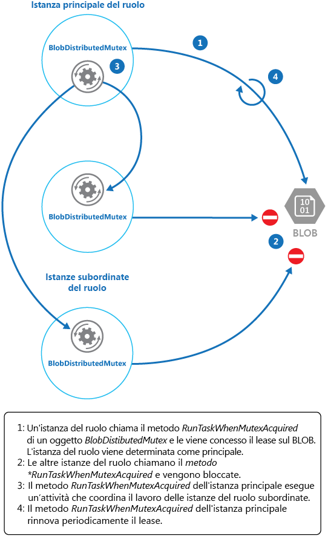

# <a name="leader-election-pattern"></a><span data-ttu-id="d0eab-104">Modello Designazione leader</span><span class="sxs-lookup"><span data-stu-id="d0eab-104">Leader Election pattern</span></span>

[!INCLUDE [header](../_includes/header.md)]

<span data-ttu-id="d0eab-105">Coordinare le azioni eseguite da una raccolta di istanze di collaborazione in un'applicazione distribuita designando un'istanza come leader, con la responsabilità di gestire le altre,</span><span class="sxs-lookup"><span data-stu-id="d0eab-105">Coordinate the actions performed by a collection of collaborating instances in a distributed application by electing one instance as the leader that assumes responsibility for managing the others.</span></span> <span data-ttu-id="d0eab-106">consente di garantire che le istanze non siano in conflitto tra loro, non provochino una contesa per le risorse condivise o non interferiscano inavvertitamente con il lavoro di altre istanze.</span><span class="sxs-lookup"><span data-stu-id="d0eab-106">This can help to ensure that instances don't conflict with each other, cause contention for shared resources, or inadvertently interfere with the work that other instances are performing.</span></span>

## <a name="context-and-problem"></a><span data-ttu-id="d0eab-107">Contesto e problema</span><span class="sxs-lookup"><span data-stu-id="d0eab-107">Context and problem</span></span>

<span data-ttu-id="d0eab-108">Un'applicazione cloud tipica include molte attività che agiscono in modo coordinato.</span><span class="sxs-lookup"><span data-stu-id="d0eab-108">A typical cloud application has many tasks acting in a coordinated manner.</span></span> <span data-ttu-id="d0eab-109">Queste attività potrebbero essere tutte istanze che eseguono lo stesso codice e che richiedono l'accesso alle stesse risorse o potrebbero collaborare in parallelo per eseguire le singole parti di un calcolo complesso.</span><span class="sxs-lookup"><span data-stu-id="d0eab-109">These tasks could all be instances running the same code and requiring access to the same resources, or they might be working together in parallel to perform the individual parts of a complex calculation.</span></span>

<span data-ttu-id="d0eab-110">Le istanze delle attività potrebbero essere eseguite separatamente per la maggior parte del tempo, ma potrebbe anche essere necessario coordinare le azioni di ogni istanza per garantire che non entrino in conflitto, non provochino una contesa per le risorse condivise o non interferiscano inavvertitamente con il lavoro di altre istanze delle attività.</span><span class="sxs-lookup"><span data-stu-id="d0eab-110">The task instances might run separately for much of the time, but it might also be necessary to coordinate the actions of each instance to ensure that they don’t conflict, cause contention for shared resources, or accidentally interfere with the work that other task instances are performing.</span></span>

<span data-ttu-id="d0eab-111">Ad esempio: </span><span class="sxs-lookup"><span data-stu-id="d0eab-111">For example:</span></span>

- <span data-ttu-id="d0eab-112">In un sistema basato su cloud che implementa la scalabilità orizzontale, più istanze della stessa attività potrebbero essere in esecuzione nello stesso momento con ogni istanza che serve un utente diverso.</span><span class="sxs-lookup"><span data-stu-id="d0eab-112">In a cloud-based system that implements horizontal scaling, multiple instances of the same task could be running at the same time with each instance serving a different user.</span></span> <span data-ttu-id="d0eab-113">Se queste istanze scrivono in una risorsa condivisa, è necessario coordinarne le azioni per impedire che le diverse istanze sovrascrivano le modifiche apportate dalle altre.</span><span class="sxs-lookup"><span data-stu-id="d0eab-113">If these instances write to a shared resource, it's necessary to coordinate their actions to prevent each instance from overwriting the changes made by the others.</span></span>
- <span data-ttu-id="d0eab-114">Se le attività eseguono singoli elementi di un calcolo complesso in parallelo, i risultati devono essere aggregati quando sono tutte completate.</span><span class="sxs-lookup"><span data-stu-id="d0eab-114">If the tasks are performing individual elements of a complex calculation in parallel, the results need to be aggregated when they all complete.</span></span>

<span data-ttu-id="d0eab-115">Le istanze delle attività sono tutte pari, pertanto non c'è un leader naturale che possa agire da coordinatore o da aggregatore.</span><span class="sxs-lookup"><span data-stu-id="d0eab-115">The task instances are all peers, so there isn't a natural leader that can act as the coordinator or aggregator.</span></span>

## <a name="solution"></a><span data-ttu-id="d0eab-116">Soluzione</span><span class="sxs-lookup"><span data-stu-id="d0eab-116">Solution</span></span>

<span data-ttu-id="d0eab-117">Una singola istanza dell'attività deve essere designata per fungere da leader e questa istanza deve coordinare le azioni delle altre istanze delle attività subordinate.</span><span class="sxs-lookup"><span data-stu-id="d0eab-117">A single task instance should be elected to act as the leader, and this instance should coordinate the actions of the other subordinate task instances.</span></span> <span data-ttu-id="d0eab-118">Se tutte le istanze delle attività eseguono lo stesso codice, ognuna di esse sarà in grado di agire come leader.</span><span class="sxs-lookup"><span data-stu-id="d0eab-118">If all of the task instances are running the same code, they are each capable of acting as the leader.</span></span> <span data-ttu-id="d0eab-119">Pertanto, il processo di designazione deve essere gestito attentamente per evitare che due o più istanze assumano il ruolo di leader nello stesso momento.</span><span class="sxs-lookup"><span data-stu-id="d0eab-119">Therefore, the election process must be managed carefully to prevent two or more instances taking over the leader role at the same time.</span></span>

<span data-ttu-id="d0eab-120">Il sistema deve fornire un meccanismo efficiente per la scelta del leader.</span><span class="sxs-lookup"><span data-stu-id="d0eab-120">The system must provide a robust mechanism for selecting the leader.</span></span> <span data-ttu-id="d0eab-121">Questo metodo deve essere in grado di gestire eventi come interruzioni di rete o errori dei processi.</span><span class="sxs-lookup"><span data-stu-id="d0eab-121">This method has to cope with events such as network outages or process failures.</span></span> <span data-ttu-id="d0eab-122">In molte soluzioni le istanze delle attività subordinate monitorano il leader usando un metodo heartbeat o tramite polling.</span><span class="sxs-lookup"><span data-stu-id="d0eab-122">In many solutions, the subordinate task instances monitor the leader through some type of heartbeat method, or by polling.</span></span> <span data-ttu-id="d0eab-123">Se il leader designato termina in modo imprevisto o un errore di rete lo rende non disponibile per le istanze delle attività subordinate, è necessario poter designare un nuovo leader.</span><span class="sxs-lookup"><span data-stu-id="d0eab-123">If the designated leader terminates unexpectedly, or a network failure makes the leader unavailable to the subordinate task instances, it's necessary for them to elect a new leader.</span></span>

<span data-ttu-id="d0eab-124">Sono disponibili diverse strategie per designare un leader tra un set di attività in un ambiente distribuito, tra cui:</span><span class="sxs-lookup"><span data-stu-id="d0eab-124">There are several strategies for electing a leader among a set of tasks in a distributed environment, including:</span></span>

- <span data-ttu-id="d0eab-125">Selezione dell'istanza dell'attività con l'ID di processo o di istanza con la classificazione più bassa.</span><span class="sxs-lookup"><span data-stu-id="d0eab-125">Selecting the task instance with the lowest-ranked instance or process ID.</span></span>
- <span data-ttu-id="d0eab-126">Competizione per acquisire un mutex condiviso e distribuito.</span><span class="sxs-lookup"><span data-stu-id="d0eab-126">Racing to acquire a shared, distributed mutex.</span></span> <span data-ttu-id="d0eab-127">La prima istanza dell'attività che acquisisce il mutex è il leader.</span><span class="sxs-lookup"><span data-stu-id="d0eab-127">The first task instance that acquires the mutex is the leader.</span></span> <span data-ttu-id="d0eab-128">Tuttavia, il sistema deve garantire che, se il leader termina o viene disconnesso dal resto del sistema, il mutex viene rilasciato per consentire a un'altra istanza dell'attività di diventare leader.</span><span class="sxs-lookup"><span data-stu-id="d0eab-128">However, the system must ensure that, if the leader terminates or becomes disconnected from the rest of the system, the mutex is released to allow another task instance to become the leader.</span></span>
- <span data-ttu-id="d0eab-129">Implementazione di uno degli algoritmi di designazione leader comuni, ad esempio l'[algoritmo Bully](https://www.cs.colostate.edu/~cs551/CourseNotes/Synchronization/BullyExample.html) o l'[algoritmo Ring](https://www.cs.colostate.edu/~cs551/CourseNotes/Synchronization/RingElectExample.html).</span><span class="sxs-lookup"><span data-stu-id="d0eab-129">Implementing one of the common leader election algorithms such as the [Bully Algorithm](https://www.cs.colostate.edu/~cs551/CourseNotes/Synchronization/BullyExample.html) or the [Ring Algorithm](https://www.cs.colostate.edu/~cs551/CourseNotes/Synchronization/RingElectExample.html).</span></span> <span data-ttu-id="d0eab-130">Questi algoritmi presuppongono che ciascun candidato alla designazione abbia un ID univoco e sia in grado di comunicare con altri candidati in modo affidabile.</span><span class="sxs-lookup"><span data-stu-id="d0eab-130">These algorithms assume that each candidate in the election has a unique ID, and that it can communicate with the other candidates reliably.</span></span>

## <a name="issues-and-considerations"></a><span data-ttu-id="d0eab-131">Considerazioni e problemi</span><span class="sxs-lookup"><span data-stu-id="d0eab-131">Issues and considerations</span></span>

<span data-ttu-id="d0eab-132">Prima di decidere come implementare questo modello, considerare quanto segue:</span><span class="sxs-lookup"><span data-stu-id="d0eab-132">Consider the following points when deciding how to implement this pattern:</span></span>

- <span data-ttu-id="d0eab-133">Il processo di designazione di un leader deve essere resiliente agli errori temporanei e permanenti.</span><span class="sxs-lookup"><span data-stu-id="d0eab-133">The process of electing a leader should be resilient to transient and persistent failures.</span></span>
- <span data-ttu-id="d0eab-134">Deve essere possibile rilevare quando il leader ha riscontrato un errore o è diventato non disponibile, ad esempio a causa di un problema di comunicazione.</span><span class="sxs-lookup"><span data-stu-id="d0eab-134">It must be possible to detect when the leader has failed or has become otherwise unavailable (such as due to a communications failure).</span></span> <span data-ttu-id="d0eab-135">La rapidità con cui è necessario il rilevamento dipende dal sistema.</span><span class="sxs-lookup"><span data-stu-id="d0eab-135">How quickly detection is needed is system dependent.</span></span> <span data-ttu-id="d0eab-136">Alcuni sistemi potrebbero essere in grado di funzionare in assenza di un leader per un breve periodo, durante il quale un errore temporaneo potrebbe essere corretto.</span><span class="sxs-lookup"><span data-stu-id="d0eab-136">Some systems might be able to function for a short time without a leader, during which a transient fault might be fixed.</span></span> <span data-ttu-id="d0eab-137">In altri casi potrebbe essere necessario rilevare immediatamente l'errore del leader e attivare una nuova designazione.</span><span class="sxs-lookup"><span data-stu-id="d0eab-137">In other cases, it might be necessary to detect leader failure immediately and trigger a new election.</span></span>
- <span data-ttu-id="d0eab-138">In un sistema che implementa il ridimensionamento orizzontale il leader potrebbe essere terminato se il sistema riduce il numero di alcune delle risorse di calcolo o le arresta.</span><span class="sxs-lookup"><span data-stu-id="d0eab-138">In a system that implements horizontal autoscaling, the leader could be terminated if the system scales back and shuts down some of the computing resources.</span></span>
- <span data-ttu-id="d0eab-139">L'uso di un mutex distribuito condiviso introduce una dipendenza dal servizio esterno che fornisce il mutex.</span><span class="sxs-lookup"><span data-stu-id="d0eab-139">Using a shared, distributed mutex introduces a dependency on the external service that provides the mutex.</span></span> <span data-ttu-id="d0eab-140">Il servizio costituisce un singolo punto di guasto.</span><span class="sxs-lookup"><span data-stu-id="d0eab-140">The service constitutes a single point of failure.</span></span> <span data-ttu-id="d0eab-141">Se per qualsiasi motivo non risulta disponibile, il sistema non sarà in grado di designare un leader.</span><span class="sxs-lookup"><span data-stu-id="d0eab-141">If it becomes unavailable for any reason, the system won't be able to elect a leader.</span></span>
- <span data-ttu-id="d0eab-142">L'uso di un singolo processo dedicato come leader è un approccio molto semplice.</span><span class="sxs-lookup"><span data-stu-id="d0eab-142">Using a single dedicated process as the leader is a straightforward approach.</span></span> <span data-ttu-id="d0eab-143">Tuttavia, se il processo non riesce potrebbe verificarsi un notevole ritardo durante il riavvio.</span><span class="sxs-lookup"><span data-stu-id="d0eab-143">However, if the process fails there could be a significant delay while it's restarted.</span></span> <span data-ttu-id="d0eab-144">La latenza risultante può influire sulle prestazioni e sui tempi di risposta di altri processi se sono in attesa del leader per il coordinamento di un'operazione.</span><span class="sxs-lookup"><span data-stu-id="d0eab-144">The resulting latency can affect the performance and response times of other processes if they're waiting for the leader to coordinate an operation.</span></span>
- <span data-ttu-id="d0eab-145">L'implementazione manuale di uno degli algoritmi di designazione leader assicura la massima flessibilità per l'ottimizzazione del codice.</span><span class="sxs-lookup"><span data-stu-id="d0eab-145">Implementing one of the leader election algorithms manually provides the greatest flexibility for tuning and optimizing the code.</span></span>

## <a name="when-to-use-this-pattern"></a><span data-ttu-id="d0eab-146">Quando usare questo modello</span><span class="sxs-lookup"><span data-stu-id="d0eab-146">When to use this pattern</span></span>

<span data-ttu-id="d0eab-147">Usare questo modello quando le attività in un'applicazione distribuita, ad esempio una soluzione ospitata nel cloud, necessitano di un attento coordinamento e non è presente alcun leader naturale.</span><span class="sxs-lookup"><span data-stu-id="d0eab-147">Use this pattern when the tasks in a distributed application, such as a cloud-hosted solution, need careful coordination and there's no natural leader.</span></span>

> <span data-ttu-id="d0eab-148">Evitare di fare del leader un collo di bottiglia nel sistema.</span><span class="sxs-lookup"><span data-stu-id="d0eab-148">Avoid making the leader a bottleneck in the system.</span></span> <span data-ttu-id="d0eab-149">L'obiettivo del leader consiste nel coordinare il lavoro delle attività subordinate; non deve necessariamente partecipare al lavoro, anche se deve essere in grado di farlo se l'attività non viene designata come leader.</span><span class="sxs-lookup"><span data-stu-id="d0eab-149">The purpose of the leader is to coordinate the work of the subordinate tasks, and it doesn't necessarily have to participate in this work itself&mdash;although it should be able to do so if the task isn't elected as the leader.</span></span>

<span data-ttu-id="d0eab-150">Questo modello potrebbe non essere utile se:</span><span class="sxs-lookup"><span data-stu-id="d0eab-150">This pattern might not be useful if:</span></span>

- <span data-ttu-id="d0eab-151">È presente un leader naturale o un processo dedicato che può sempre fungere da leader.</span><span class="sxs-lookup"><span data-stu-id="d0eab-151">There's a natural leader or dedicated process that can always act as the leader.</span></span> <span data-ttu-id="d0eab-152">Ad esempio, potrebbe essere possibile implementare un processo singleton che coordina le istanze delle attività.</span><span class="sxs-lookup"><span data-stu-id="d0eab-152">For example, it might be possible to implement a singleton process that coordinates the task instances.</span></span> <span data-ttu-id="d0eab-153">Se questo processo non riesce o risulta non integro, il sistema può arrestarlo e riavviarlo.</span><span class="sxs-lookup"><span data-stu-id="d0eab-153">If this process fails or becomes unhealthy, the system can shut it down and restart it.</span></span>
- <span data-ttu-id="d0eab-154">Il coordinamento tra le attività può essere ottenuto usando un metodo più semplice.</span><span class="sxs-lookup"><span data-stu-id="d0eab-154">The coordination between tasks can be achieved using a more lightweight method.</span></span> <span data-ttu-id="d0eab-155">Ad esempio, se più istanze delle attività necessitano semplicemente dell'accesso coordinato a una risorsa condivisa, una soluzione migliore consiste nell'usare il blocco ottimistico o pessimistico per controllare l'accesso.</span><span class="sxs-lookup"><span data-stu-id="d0eab-155">For example, if several task instances simply need coordinated access to a shared resource, a better solution is to use optimistic or pessimistic locking to control access.</span></span>
- <span data-ttu-id="d0eab-156">Una soluzione di terze parti è più appropriata.</span><span class="sxs-lookup"><span data-stu-id="d0eab-156">A third-party solution is more appropriate.</span></span> <span data-ttu-id="d0eab-157">Ad esempio, il servizio Microsoft Azure HDInsight (basato su Apache Hadoop) usa i servizi forniti da Apache Zookeeper per coordinare la mappa e ridurre le attività di raccolta e riepilogo dei dati.</span><span class="sxs-lookup"><span data-stu-id="d0eab-157">For example, the Microsoft Azure HDInsight service (based on Apache Hadoop) uses the services provided by Apache Zookeeper to coordinate the map and reduce tasks that collect and summarize data.</span></span>

## <a name="example"></a><span data-ttu-id="d0eab-158">Esempio</span><span class="sxs-lookup"><span data-stu-id="d0eab-158">Example</span></span>

<span data-ttu-id="d0eab-159">Il progetto DistributedMutex nella soluzione LeaderElection (un esempio che illustra questo modello è disponibile in [GitHub](https://github.com/mspnp/cloud-design-patterns/tree/master/leader-election)) mostra come usare un lease in un BLOB del servizio di archiviazione di Azure per fornire un meccanismo per l'implementazione di un mutex distribuito condiviso.</span><span class="sxs-lookup"><span data-stu-id="d0eab-159">The DistributedMutex project in the LeaderElection solution (a sample that demonstrates this pattern is available on [GitHub](https://github.com/mspnp/cloud-design-patterns/tree/master/leader-election)) shows how to use a lease on an Azure Storage blob to provide a mechanism for implementing a shared, distributed mutex.</span></span> <span data-ttu-id="d0eab-160">Questo mutex può essere usato per designare un leader in un gruppo di istanze del ruolo in un servizio cloud di Azure.</span><span class="sxs-lookup"><span data-stu-id="d0eab-160">This mutex can be used to elect a leader among a group of role instances in an Azure cloud service.</span></span> <span data-ttu-id="d0eab-161">La prima istanza del ruolo ad acquisire il lease viene designata come leader e rimane tale finché non rilascia il lease o non è in grado di rinnovarlo.</span><span class="sxs-lookup"><span data-stu-id="d0eab-161">The first role instance to acquire the lease is elected the leader, and remains the leader until it releases the lease or isn't able to renew the lease.</span></span> <span data-ttu-id="d0eab-162">Altre istanze del ruolo possono continuare a monitorare il lease del BLOB, nel caso in cui il leader non sia più disponibile.</span><span class="sxs-lookup"><span data-stu-id="d0eab-162">Other role instances can continue to monitor the blob lease in case the leader is no longer available.</span></span>

> <span data-ttu-id="d0eab-163">Un lease del BLOB è un blocco di scrittura esclusivo su un BLOB.</span><span class="sxs-lookup"><span data-stu-id="d0eab-163">A blob lease is an exclusive write lock over a blob.</span></span> <span data-ttu-id="d0eab-164">Un singolo BLOB può essere oggetto di un solo lease in qualsiasi punto nel tempo.</span><span class="sxs-lookup"><span data-stu-id="d0eab-164">A single blob can be the subject of only one lease at any point in time.</span></span> <span data-ttu-id="d0eab-165">Un'istanza del ruolo può richiedere un lease per un BLOB specifico e il lease verrà concesso se nessun'altra istanza del ruolo contiene un lease per lo stesso BLOB.</span><span class="sxs-lookup"><span data-stu-id="d0eab-165">A role instance can request a lease over a specified blob, and it'll be granted the lease if no other role instance holds a lease over the same blob.</span></span> <span data-ttu-id="d0eab-166">In caso contrario, la richiesta genererà un'eccezione.</span><span class="sxs-lookup"><span data-stu-id="d0eab-166">Otherwise the request will throw an exception.</span></span>
>
> <span data-ttu-id="d0eab-167">Per evitare che un'istanza del ruolo con errori mantenga il lease per un periodo illimitato, specificare una durata per il lease.</span><span class="sxs-lookup"><span data-stu-id="d0eab-167">To avoid a faulted role instance retaining the lease indefinitely, specify a lifetime for the lease.</span></span> <span data-ttu-id="d0eab-168">Alla scadenza, il lease diventerà disponibile.</span><span class="sxs-lookup"><span data-stu-id="d0eab-168">When this expires, the lease becomes available.</span></span> <span data-ttu-id="d0eab-169">Tuttavia, mentre un'istanza del ruolo contiene il lease può richiedere che il lease venga rinnovato e il lease verrà concesso per un ulteriore periodo di tempo.</span><span class="sxs-lookup"><span data-stu-id="d0eab-169">However, while a role instance holds the lease it can request that the lease is renewed, and it'll be granted the lease for a further period of time.</span></span> <span data-ttu-id="d0eab-170">L'istanza del ruolo può ripetere continuamente questo processo se vuole mantenere il lease.</span><span class="sxs-lookup"><span data-stu-id="d0eab-170">The role instance can continually repeat this process if it wants to retain the lease.</span></span>
> <span data-ttu-id="d0eab-171">Per altre informazioni sul lease di un BLOB, vedere [Lease Blob (REST API)](https://msdn.microsoft.com/library/azure/ee691972.aspx) (Lease Blob (API REST)).</span><span class="sxs-lookup"><span data-stu-id="d0eab-171">For more information on how to lease a blob, see [Lease Blob (REST API)](https://msdn.microsoft.com/library/azure/ee691972.aspx).</span></span>

<span data-ttu-id="d0eab-172">La classe `BlobDistributedMutex` nell'esempio di C# seguente contiene il metodo `RunTaskWhenMutexAquired`, che consente a un'istanza del ruolo di tentare di acquisire un lease per un BLOB specificato.</span><span class="sxs-lookup"><span data-stu-id="d0eab-172">The `BlobDistributedMutex` class in the C# example below contains the `RunTaskWhenMutexAquired` method that enables a role instance to attempt to acquire a lease over a specified blob.</span></span> <span data-ttu-id="d0eab-173">I dettagli del BLOB (nome, contenitore e account di archiviazione) vengono passati al costruttore in un oggetto `BlobSettings` quando viene creato l'oggetto `BlobDistributedMutex` (questo oggetto è uno struct semplice incluso nel codice di esempio).</span><span class="sxs-lookup"><span data-stu-id="d0eab-173">The details of the blob (the name, container, and storage account) are passed to the constructor in a `BlobSettings` object when the `BlobDistributedMutex` object is created (this object is a simple struct that is included in the sample code).</span></span> <span data-ttu-id="d0eab-174">Il costruttore accetta inoltre un `Task` che fa riferimento al codice che l'istanza del ruolo dovrebbe eseguire se acquisisce correttamente il lease per il BLOB e viene designato come leader.</span><span class="sxs-lookup"><span data-stu-id="d0eab-174">The constructor also accepts a `Task` that references the code that the role instance should run if it successfully acquires the lease over the blob and is elected the leader.</span></span> <span data-ttu-id="d0eab-175">Si noti che il codice che gestisce i dettagli di basso livello dell'acquisizione del lease viene implementato in una classe helper distinta denominata `BlobLeaseManager`.</span><span class="sxs-lookup"><span data-stu-id="d0eab-175">Note that the code that handles the low-level details of acquiring the lease is implemented in a separate helper class named `BlobLeaseManager`.</span></span>

```csharp
public class BlobDistributedMutex
{
  ...
  private readonly BlobSettings blobSettings;
  private readonly Func<CancellationToken, Task> taskToRunWhenLeaseAcquired;
  ...

  public BlobDistributedMutex(BlobSettings blobSettings,
           Func<CancellationToken, Task> taskToRunWhenLeaseAquired)
  {
    this.blobSettings = blobSettings;
    this.taskToRunWhenLeaseAquired = taskToRunWhenLeaseAquired;
  }

  public async Task RunTaskWhenMutexAcquired(CancellationToken token)
  {
    var leaseManager = new BlobLeaseManager(blobSettings);
    await this.RunTaskWhenBlobLeaseAcquired(leaseManager, token);
  }
  ...
```

<span data-ttu-id="d0eab-176">Il metodo `RunTaskWhenMutexAquired` nell'esempio di codice precedente richiama il metodo `RunTaskWhenBlobLeaseAcquired` illustrato nell'esempio di codice seguente per acquisire effettivamente il lease.</span><span class="sxs-lookup"><span data-stu-id="d0eab-176">The `RunTaskWhenMutexAquired` method in the code sample above invokes the `RunTaskWhenBlobLeaseAcquired` method shown in the following code sample to actually acquire the lease.</span></span> <span data-ttu-id="d0eab-177">Il metodo `RunTaskWhenBlobLeaseAcquired` viene eseguito in modo asincrono.</span><span class="sxs-lookup"><span data-stu-id="d0eab-177">The `RunTaskWhenBlobLeaseAcquired` method runs asynchronously.</span></span> <span data-ttu-id="d0eab-178">Se il lease viene acquisito correttamente, l'istanza del ruolo è stata designata come leader.</span><span class="sxs-lookup"><span data-stu-id="d0eab-178">If the lease is successfully acquired, the role instance has been elected the leader.</span></span> <span data-ttu-id="d0eab-179">Lo scopo del delegato `taskToRunWhenLeaseAcquired` consiste nell'eseguire il lavoro che coordina le altre istanze del ruolo.</span><span class="sxs-lookup"><span data-stu-id="d0eab-179">The purpose of the `taskToRunWhenLeaseAcquired` delegate is to perform the work that coordinates the other role instances.</span></span> <span data-ttu-id="d0eab-180">Se il lease non viene acquisito, un'altra istanza del ruolo è stata designata come leader e l'istanza del ruolo corrente rimane subordinata.</span><span class="sxs-lookup"><span data-stu-id="d0eab-180">If the lease isn't acquired, another role instance has been elected as the leader and the current role instance remains a subordinate.</span></span> <span data-ttu-id="d0eab-181">Si noti che il metodo `TryAcquireLeaseOrWait` è un metodo helper che usa l'oggetto `BlobLeaseManager` per acquisire il lease.</span><span class="sxs-lookup"><span data-stu-id="d0eab-181">Note that the `TryAcquireLeaseOrWait` method is a helper method that uses the `BlobLeaseManager` object to acquire the lease.</span></span>

```csharp
  private async Task RunTaskWhenBlobLeaseAcquired(
    BlobLeaseManager leaseManager, CancellationToken token)
  {
    while (!token.IsCancellationRequested)
    {
      // Try to acquire the blob lease.
      // Otherwise wait for a short time before trying again.
      string leaseId = await this.TryAquireLeaseOrWait(leaseManager, token);

      if (!string.IsNullOrEmpty(leaseId))
      {
        // Create a new linked cancellation token source so that if either the
        // original token is canceled or the lease can't be renewed, the
        // leader task can be canceled.
        using (var leaseCts =
          CancellationTokenSource.CreateLinkedTokenSource(new[] { token }))
        {
          // Run the leader task.
          var leaderTask = this.taskToRunWhenLeaseAquired.Invoke(leaseCts.Token);
          ...
        }
      }
    }
    ...
  }
```

<span data-ttu-id="d0eab-182">Anche l'attività avviata dal leader viene eseguita in modo asincrono.</span><span class="sxs-lookup"><span data-stu-id="d0eab-182">The task started by the leader also runs asynchronously.</span></span> <span data-ttu-id="d0eab-183">Durante l'esecuzione dell'attività, il metodo `RunTaskWhenBlobLeaseAquired` illustrato nell'esempio di codice seguente tenta periodicamente di rinnovare il lease.</span><span class="sxs-lookup"><span data-stu-id="d0eab-183">While this task is running, the `RunTaskWhenBlobLeaseAquired` method shown in the following code sample periodically attempts to renew the lease.</span></span> <span data-ttu-id="d0eab-184">Ciò consente di garantire che l'istanza del ruolo rimanga il leader.</span><span class="sxs-lookup"><span data-stu-id="d0eab-184">This helps to ensure that the role instance remains the leader.</span></span> <span data-ttu-id="d0eab-185">Nella soluzione di esempio il ritardo tra le richieste di rinnovo è inferiore al tempo specificato per la durata del lease, in modo da impedire che un'altra istanza del ruolo venga designata come leader.</span><span class="sxs-lookup"><span data-stu-id="d0eab-185">In the sample solution, the delay between renewal requests is less than the time specified for the duration of the lease in order to prevent another role instance from being elected the leader.</span></span> <span data-ttu-id="d0eab-186">Se per qualsiasi motivo il rinnovo non riesce, l'attività viene annullata.</span><span class="sxs-lookup"><span data-stu-id="d0eab-186">If the renewal fails for any reason, the task is canceled.</span></span>

<span data-ttu-id="d0eab-187">Se il lease non viene rinnovato o l'attività viene annullata, ad esempio in seguito all'arresto dell'istanza del ruolo, il lease viene rilasciato.</span><span class="sxs-lookup"><span data-stu-id="d0eab-187">If the lease fails to be renewed or the task is canceled (possibly as a result of the role instance shutting down), the lease is released.</span></span> <span data-ttu-id="d0eab-188">A questo punto, questa o un'altra istanza del ruolo può essere designata come leader.</span><span class="sxs-lookup"><span data-stu-id="d0eab-188">At this point, this or another role instance might be elected as the leader.</span></span> <span data-ttu-id="d0eab-189">L'estratto di codice seguente illustra questa parte del processo.</span><span class="sxs-lookup"><span data-stu-id="d0eab-189">The code extract below shows this part of the process.</span></span>

```csharp
  private async Task RunTaskWhenBlobLeaseAcquired(
    BlobLeaseManager leaseManager, CancellationToken token)
  {
    while (...)
    {
      ...
      if (...)
      {
        ...
        using (var leaseCts = ...)
        {
          ...
          // Keep renewing the lease in regular intervals.
          // If the lease can't be renewed, then the task completes.
          var renewLeaseTask =
            this.KeepRenewingLease(leaseManager, leaseId, leaseCts.Token);

          // When any task completes (either the leader task itself or when it
          // couldn't renew the lease) then cancel the other task.
          await CancelAllWhenAnyCompletes(leaderTask, renewLeaseTask, leaseCts);
        }
      }
    }
  }
  ...
}
```

<span data-ttu-id="d0eab-190">Il metodo `KeepRenewingLease` è un altro metodo helper che usa l'oggetto `BlobLeaseManager` per rinnovare il lease.</span><span class="sxs-lookup"><span data-stu-id="d0eab-190">The `KeepRenewingLease` method is another helper method that uses the `BlobLeaseManager` object to renew the lease.</span></span> <span data-ttu-id="d0eab-191">Il metodo `CancelAllWhenAnyCompletes` annulla le attività specificate come i primi due parametri.</span><span class="sxs-lookup"><span data-stu-id="d0eab-191">The `CancelAllWhenAnyCompletes` method cancels the tasks specified as the first two parameters.</span></span> <span data-ttu-id="d0eab-192">Il diagramma seguente illustra l'uso della classe `BlobDistributedMutex` per la designazione di un leader e l'esecuzione di un'attività che coordina le operazioni.</span><span class="sxs-lookup"><span data-stu-id="d0eab-192">The following diagram illustrates using the `BlobDistributedMutex` class to elect a leader and run a task that coordinates operations.</span></span>



<span data-ttu-id="d0eab-194">L'esempio di codice seguente illustra come usare la classe `BlobDistributedMutex` in un ruolo di lavoro.</span><span class="sxs-lookup"><span data-stu-id="d0eab-194">The following code example shows how to use the `BlobDistributedMutex` class in a worker role.</span></span> <span data-ttu-id="d0eab-195">Questo codice acquisisce un lease per un BLOB denominato `MyLeaderCoordinatorTask` nel contenitore del lease nell'archivio di sviluppo e specifica che il codice definito nel metodo `MyLeaderCoordinatorTask` sia eseguito se l'istanza del ruolo viene designata come leader.</span><span class="sxs-lookup"><span data-stu-id="d0eab-195">This code acquires a lease over a blob named `MyLeaderCoordinatorTask` in the lease's container in development storage, and specifies that the code defined in the `MyLeaderCoordinatorTask` method should run if the role instance is elected the leader.</span></span>

```csharp
var settings = new BlobSettings(CloudStorageAccount.DevelopmentStorageAccount,
  "leases", "MyLeaderCoordinatorTask");
var cts = new CancellationTokenSource();
var mutex = new BlobDistributedMutex(settings, MyLeaderCoordinatorTask);
mutex.RunTaskWhenMutexAcquired(this.cts.Token);
...

// Method that runs if the role instance is elected the leader
private static async Task MyLeaderCoordinatorTask(CancellationToken token)
{
  ...
}
```

<span data-ttu-id="d0eab-196">Tenere presente i punti seguenti riguardo alla soluzione di esempio:</span><span class="sxs-lookup"><span data-stu-id="d0eab-196">Note the following points about the sample solution:</span></span>

- <span data-ttu-id="d0eab-197">Il BLOB è un singolo punto di guasto potenziale.</span><span class="sxs-lookup"><span data-stu-id="d0eab-197">The blob is a potential single point of failure.</span></span> <span data-ttu-id="d0eab-198">Se il servizio BLOB non è più disponibile o è inaccessibile, il leader non sarà in grado di rinnovare il lease e nessun'altra istanza del ruolo potrà acquisire il lease.</span><span class="sxs-lookup"><span data-stu-id="d0eab-198">If the blob service becomes unavailable, or is inaccessible, the leader won't be able to renew the lease and no other role instance will be able to acquire the lease.</span></span> <span data-ttu-id="d0eab-199">In questo caso, nessuna istanza del ruolo sarà in grado di fungere da leader.</span><span class="sxs-lookup"><span data-stu-id="d0eab-199">In this case, no role instance will be able to act as the leader.</span></span> <span data-ttu-id="d0eab-200">Tuttavia, il servizio BLOB è progettato per essere resiliente, pertanto un guasto completo del servizio BLOB è considerato estremamente improbabile.</span><span class="sxs-lookup"><span data-stu-id="d0eab-200">However, the blob service is designed to be resilient, so complete failure of the blob service is considered to be extremely unlikely.</span></span>
- <span data-ttu-id="d0eab-201">Se l'attività eseguita dal leader è in fase di stallo, il leader potrebbe continuare a rinnovare il lease, impedendo a qualsiasi altra istanza del ruolo di acquisire il lease e assumere il ruolo di leader per coordinare le attività.</span><span class="sxs-lookup"><span data-stu-id="d0eab-201">If the task being performed by the leader stalls, the leader might continue to renew the lease, preventing any other role instance from acquiring the lease and taking over the leader role in order to coordinate tasks.</span></span> <span data-ttu-id="d0eab-202">Nel mondo reale è necessario verificare l'integrità del leader a intervalli frequenti.</span><span class="sxs-lookup"><span data-stu-id="d0eab-202">In the real world, the health of the leader should be checked at frequent intervals.</span></span>
- <span data-ttu-id="d0eab-203">Il processo di designazione è non deterministico.</span><span class="sxs-lookup"><span data-stu-id="d0eab-203">The election process is nondeterministic.</span></span> <span data-ttu-id="d0eab-204">Non è possibile fare supposizioni su quale istanza del ruolo acquisirà il lease del BLOB e diventerà leader.</span><span class="sxs-lookup"><span data-stu-id="d0eab-204">You can't make any assumptions about which role instance will acquire the blob lease and become the leader.</span></span>
- <span data-ttu-id="d0eab-205">Il BLOB usato come destinazione del lease del BLOB non dovrebbe essere usato per altri scopi.</span><span class="sxs-lookup"><span data-stu-id="d0eab-205">The blob used as the target of the blob lease shouldn't be used for any other purpose.</span></span> <span data-ttu-id="d0eab-206">Se un'istanza del ruolo tenta di archiviare i dati in questo BLOB, questi dati non saranno accessibili a meno che l'istanza del ruolo non sia il leader e non contenga il lease del BLOB.</span><span class="sxs-lookup"><span data-stu-id="d0eab-206">If a role instance attempts to store data in this blob, this data won't be accessible unless the role instance is the leader and holds the blob lease.</span></span>

## <a name="related-patterns-and-guidance"></a><span data-ttu-id="d0eab-207">Modelli correlati e informazioni aggiuntive</span><span class="sxs-lookup"><span data-stu-id="d0eab-207">Related patterns and guidance</span></span>

<span data-ttu-id="d0eab-208">Per l'implementazione di questo modello possono risultare utili le informazioni aggiuntive seguenti:</span><span class="sxs-lookup"><span data-stu-id="d0eab-208">The following guidance might also be relevant when implementing this pattern:</span></span>

- <span data-ttu-id="d0eab-209">Questo modello ha un'[applicazione di esempio](https://github.com/mspnp/cloud-design-patterns/tree/master/leader-election) scaricabile.</span><span class="sxs-lookup"><span data-stu-id="d0eab-209">This pattern has a downloadable [sample application](https://github.com/mspnp/cloud-design-patterns/tree/master/leader-election).</span></span>
- <span data-ttu-id="d0eab-210">[Scalabilità automatica](https://msdn.microsoft.com/library/dn589774.aspx).</span><span class="sxs-lookup"><span data-stu-id="d0eab-210">[Autoscaling Guidance](https://msdn.microsoft.com/library/dn589774.aspx).</span></span> <span data-ttu-id="d0eab-211">È possibile avviare e arrestare le istanze degli host delle attività di pari passo con la variazione del carico sull'applicazione.</span><span class="sxs-lookup"><span data-stu-id="d0eab-211">It's possible to start and stop instances of the task hosts as the load on the application varies.</span></span> <span data-ttu-id="d0eab-212">La scalabilità automatica consente di mantenere la velocità effettiva e le prestazioni durante i periodi di massima richiesta di elaborazione.</span><span class="sxs-lookup"><span data-stu-id="d0eab-212">Autoscaling can help to maintain throughput and performance during times of peak processing.</span></span>
- <span data-ttu-id="d0eab-213">[Indicazioni sul partizionamento del calcolo](https://msdn.microsoft.com/library/dn589773.aspx).</span><span class="sxs-lookup"><span data-stu-id="d0eab-213">[Compute Partitioning Guidance](https://msdn.microsoft.com/library/dn589773.aspx).</span></span> <span data-ttu-id="d0eab-214">Queste indicazioni descrivono come allocare attività agli host in un servizio cloud, in modo da ridurre al minimo i costi operativi mantenendo la scalabilità, le prestazioni, la disponibilità e la sicurezza del servizio.</span><span class="sxs-lookup"><span data-stu-id="d0eab-214">This guidance describes how to allocate tasks to hosts in a cloud service in a way that helps to minimize running costs while maintaining the scalability, performance, availability, and security of the service.</span></span>
- <span data-ttu-id="d0eab-215">[Modello asincrono basato su attività](https://msdn.microsoft.com/library/hh873175.aspx).</span><span class="sxs-lookup"><span data-stu-id="d0eab-215">The [Task-based Asynchronous Pattern](https://msdn.microsoft.com/library/hh873175.aspx).</span></span>
- <span data-ttu-id="d0eab-216">Esempio che illustra l'[algoritmo Bully](https://www.cs.colostate.edu/~cs551/CourseNotes/Synchronization/BullyExample.html).</span><span class="sxs-lookup"><span data-stu-id="d0eab-216">An example illustrating the [Bully Algorithm](https://www.cs.colostate.edu/~cs551/CourseNotes/Synchronization/BullyExample.html).</span></span>
- <span data-ttu-id="d0eab-217">Esempio che illustra l'[algoritmo Ring](https://www.cs.colostate.edu/~cs551/CourseNotes/Synchronization/RingElectExample.html).</span><span class="sxs-lookup"><span data-stu-id="d0eab-217">An example illustrating the [Ring Algorithm](https://www.cs.colostate.edu/~cs551/CourseNotes/Synchronization/RingElectExample.html).</span></span>
- <span data-ttu-id="d0eab-218">[Apache Curator](https://curator.apache.org/), una libreria client per Apache ZooKeeper.</span><span class="sxs-lookup"><span data-stu-id="d0eab-218">[Apache Curator](https://curator.apache.org/) a client library for Apache ZooKeeper.</span></span>
- <span data-ttu-id="d0eab-219">Articolo [Lease Blob (REST API)](https://msdn.microsoft.com/library/azure/ee691972.aspx) (Lease Blob (API REST)) su MSDN.</span><span class="sxs-lookup"><span data-stu-id="d0eab-219">The article [Lease Blob (REST API)](https://msdn.microsoft.com/library/azure/ee691972.aspx) on MSDN.</span></span>
