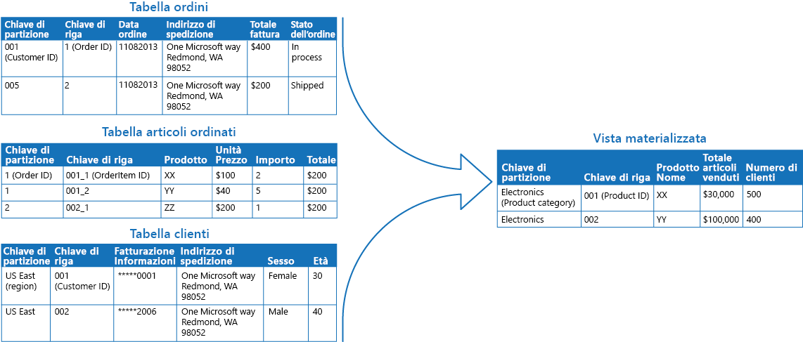

# Modello di vista materializzata

[!INCLUDE [header](../_includes/header.md)]

Generare viste prepopolate sui dati in uno o più archivi dati quando i dati non sono formattati in modo ideale per le operazioni di query necessarie. In questo modo è possibile garantire l'efficienza delle attività di query ed estrazione dei dati e migliorare le prestazioni dell'applicazione.

## Contesto e problema

Quando si archiviano i dati, la priorità per gli sviluppatori e gli amministratori dei dati è spesso rappresentata dalla modalità di archiviazione dei dati, piuttosto che da quella di lettura. Il formato di archiviazione scelto è in genere strettamente correlato al formato dei dati, ai requisiti per la gestione delle dimensioni e dell'integrità dei dati e al tipo di archivio in uso. Quando, ad esempio, si usa l'archivio documenti NoSQL, i dati sono spesso rappresentati come una serie di aggregati, ognuno contenente tutte le informazioni per l'entità.

Ciò, tuttavia, può avere un effetto negativo sulle query. Quando una query richiede solo un subset dei dati di alcune entità, ad esempio un riepilogo degli ordini per diversi clienti senza tutti i dettagli degli ordini, è necessario estrarre tutti i dati per le entità rilevanti per ottenere le informazioni necessarie.

## Soluzione

Per consentire query efficaci, una soluzione comune consiste nel generare in anticipo una vista che materializza i dati in un formato adattato al set di risultati richiesto. Il modello di vista materializzata descrive la generazione di viste prepopolate dei dati in ambienti in cui i dati di origine non sono in un formato adatto per l'esecuzione di query, in cui è difficile generare una query appropriata o in cui le prestazioni di query sono scarse a causa della natura dei dati o dell'archivio dati.

Queste viste materializzate, che contengono solo i dati richiesti da una query, consentono alle applicazioni di ottenere rapidamente le informazioni necessarie. Oltre a unire le tabelle o combinare le entità di dati, le viste materializzate possono includere i valori correnti delle colonne calcolate o degli elementi di dati, i risultati della combinazione di valori o dell'esecuzione di trasformazioni sugli elementi di dati e i valori specificati come parte della query. Una vista materializzata può anche essere ottimizzata per una singola query.

Un punto importante è che una vista materializzata e i dati in essa contenuti possono essere eliminati completamente, perché è possibile ricreare interamente la vista dagli archivi dati di origine. Una vista materializzata non viene mai aggiornata direttamente da un'applicazione ed è quindi una cache specializzata.

Quando i dati di origine per la vista cambiano, la vista deve essere aggiornata per includere le nuove informazioni. È possibile pianificare questa operazione in modo che avvenga automaticamente oppure quando il sistema rileva una modifica ai dati originali. In alcuni casi potrebbe essere necessario rigenerare manualmente la vista. La figura mostra un esempio di come è possibile usare il modello di vista materializzata.

## Considerazioni e problemi

Prima di decidere come implementare questo modello, considerare quanto segue:

Come e quando la vista verrà aggiornata. Idealmente, verrà rigenerata in risposta a un evento che indica una modifica ai dati di origine, anche se ciò può causare un sovraccarico eccessivo se i dati di origine cambiano rapidamente. In alternativa, è possibile usare un'attività pianificata, un trigger esterno o un'azione manuale per rigenerare la vista.

In alcuni sistemi, ad esempio quando si usa il modello di origine eventi per mantenere un archivio solo degli eventi che hanno modificato i dati, le viste materializzate sono necessarie. Prepopolare le viste esaminando tutti gli eventi per determinare lo stato corrente potrebbe essere l'unico modo per ottenere informazioni dall'archivio eventi. Se non si il modello di origine eventi, è necessario stabilire se una vista materializzata è utile o meno. Le viste materializzate tendono a essere personalizzate per una o poche query. Se si usano molte query, i requisiti di capacità di archiviazione e i costi di archiviazione delle viste materializzate possono diventare eccessivi.

Valutare l'impatto sulla coerenza dei dati quando si genera la vista e quando la si aggiorna, se questo avviene in base a una pianificazione. Se i dati di origine cambiano nel momento in cui la vista viene generata, la copia dei dati nella vista non sarà completamente coerente con i dati originali.

Valutare dove verrà archiviata la vista. La vista non deve necessariamente trovarsi nello stesso archivio o partizione dei dati originali. Può essere un subset di diverse partizioni combinate.

Una vista può essere ricreata, se viene persa. Per questo motivo, se la vista è temporanea e viene usata solo per migliorare le prestazioni di query riflettendo lo stato corrente dei dati o per migliorare la scalabilità, può essere archiviata in una cache o in una posizione meno affidabile.

Quando si definisce una vista materializzata, aumentarne il valore aggiungendo elementi di dati o colonne in base al calcolo o alla trasformazione degli elementi di dati esistenti, ai valori passati nella query o a combinazioni di questi valori, quando appropriato.

Se il meccanismo di archiviazione lo consente, è possibile indicizzare la vista materializzata per migliorare ulteriormente le prestazioni. La maggior parte dei database relazionali supporta l'indicizzazione delle viste, come anche le soluzioni per Big Data basate su Apache Hadoop.

## Quando usare questo modello

Questo modello è utile per:

- Creare viste materializzate su dati su cui è difficile eseguire una query direttamente o nei casi in cui le query devono essere molto complesse per estrarre i dati archiviati in modo non strutturato, semistrutturato o normalizzato.
- Creare viste temporanee che possono migliorare notevolmente le prestazioni di query o che possono fungere direttamente da viste di origine o oggetti di trasferimento dati per l'interfaccia utente, per la creazione di report o la visualizzazione.
- Supportare scenari connessi occasionalmente o disconnessi, in cui la connessione all'archivio dati non è sempre disponibile. In questo caso, la vista può essere memorizzata nella cache in locale.
- Semplificare le query ed esporre i dati per la sperimentazione, in modo che non sia richiesta la conoscenza del formato dei dati di origine. Ad esempio, unendo tabelle diverse in uno o più database o uno o più domini in archivi NoSQL e quindi formattando i dati in base all'uso previsto.
- Fornire l'accesso a subset specifici di dati di origine che, per motivi di privacy o di sicurezza, non sono generalmente accessibili, modificabili o completamente esposti agli utenti.
- Creare un collegamento tra diversi archivi dati, per sfruttare le relative funzionalità. È ad esempio possibile usare un archivio cloud efficiente per la scrittura come archivio dati di riferimento e un database relazionale che offre buone prestazioni di lettura e query per contenere le viste materializzate.

Questo modello non è utile nelle situazioni seguenti:

- I dati di origine sono semplici ed è facile eseguire query su di essi.
- I dati di origine cambiano molto rapidamente oppure è possibile accedervi senza usare una vista. In questi casi, è consigliabile evitare il sovraccarico di elaborazione correlato alla creazione di viste.
- La coerenza è molto importante. Le viste potrebbero non essere sempre completamente coerenti con i dati originali.

## Esempio

La figura seguente mostra un esempio di uso del modello di vista materializzata per generare un riepilogo delle vendite. I dati delle tabelle Order, OrderItem e Customer in partizioni distinte in un account di archiviazione di Azure vengono combinati per generare una vista che contiene il valore totale delle vendite per ogni prodotto nella categoria Electronics, insieme al conteggio del numero di clienti che hanno acquistato ogni articolo.

La creazione di questa vista materializzata richiede query complesse. Esponendo il risultato della query come vista materializzata, tuttavia, gli utenti possono ottenere facilmente i risultati e usarli direttamente o includerli in un'altra query. La vista può essere probabilmente usata in un sistema di creazione di report o un dashboard e può essere aggiornata in base a una pianificazione, ad esempio ogni settimana.

> Anche se questo esempio usa l'archiviazione tabelle di Azure, anche molti sistemi di gestione di database relazionali forniscono il supporto nativo per le viste materializzate.

## Modelli correlati e informazioni aggiuntive

Per l'implementazione di questo modello possono risultare utili i modelli e le informazioni aggiuntive seguenti:

- [Nozioni di base sulla coerenza dei dati](https://msdn.microsoft.com/library/dn589800.aspx). Le informazioni di riepilogo in una vista materializzata devono essere gestite in modo da riflettere i valori dei dati sottostanti. Quando i valori dei dati cambiano, potrebbe risultare poco pratico aggiornare i dati di riepilogo in tempo reale e potrebbe quindi essere necessario adottare un approccio di coerenza finale. Questo argomento riepiloga i problemi da affrontare per mantenere la coerenza dei dati distribuiti e descrive i vantaggi e i compromessi di diversi modelli di coerenza.
- [Modello di separazione di responsabilità per query e comandi (CQRS, Command and Query Responsibility Segregation)](./cqrs.md). Usare questo modello per aggiornare le informazioni contenute in una vista materializzata rispondendo agli eventi che si verificano quando i valori dei dati sottostanti cambiano.
- [Modello di origine eventi](./event-sourcing.md). Usare questo modello in combinazione con il modello CQRS per gestire le informazioni in una vista materializzata. Quando i valori dei dati su cui è basata una vista materializzata cambiano, il sistema può generare eventi che descrivono le modifiche e salvarli in un archivio eventi.
- [Modello di tabella degli indici](./index-table.md). I dati in una vista materializzata sono organizzati in genere in base a una chiave primaria, ma le query potrebbero dover recuperare le informazioni da questa vista esaminando i dati in altri campi. Usare questo modello per creare indici secondari sui set di dati per gli archivi dati che non supportano gli indici secondari nativi.
