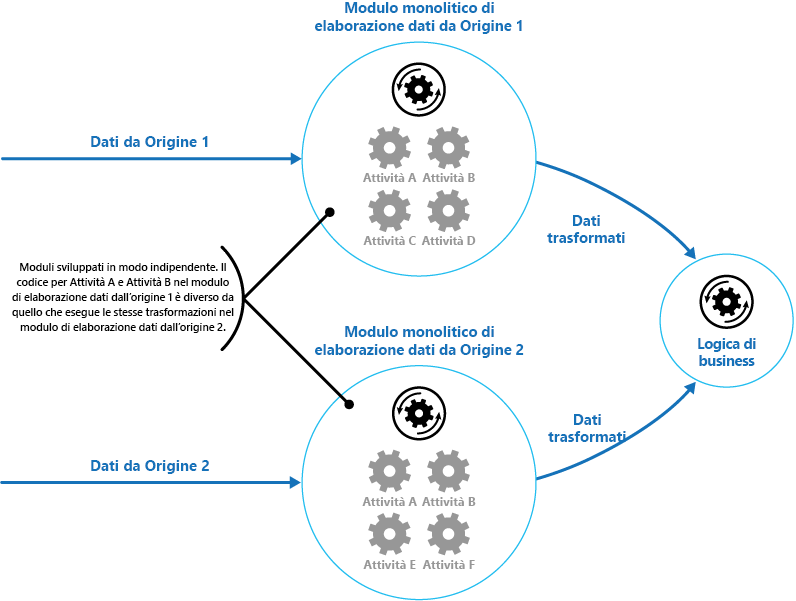

# <a name="pipes-and-filters-pattern"></a>Modello di pipe e filtri

[!INCLUDE [header](../_includes/header.md)]

Scomporre un'attività che esegue un'elaborazione complessa in una serie di elementi distinti riutilizzabili. Si possono migliorare prestazioni, scalabilità e riusabilità, consentendo agli elementi delle attività che eseguono l'elaborazione di essere distribuiti e ridimensionati in modo indipendente.

## <a name="context-and-problem"></a>Contesto e problema

Un'applicazione deve poter eseguire una serie di attività di varia complessità sulle informazioni che elabora. Un approccio semplice ma rigido per implementare tale applicazione è quello di eseguire l'elaborazione come modulo monolitico. Tuttavia, questo approccio probabilmente ridurrà le opportunità di refactoring, ottimizzazione o riutilizzo del codice se parti della stessa elaborazione sono necessarie in un altro punto dell'applicazione.

Nella figura vengono illustrati i problemi relativi all'elaborazione dei dati tramite l'approccio monolitico. Un'applicazione riceve ed elabora i dati da due origini. I dati da ogni origine vengono elaborati da un modulo separato che esegue una serie di attività per trasformare i dati, prima di passare il risultato alla logica di business dell'applicazione.



Alcune delle attività che eseguono i moduli monolitici sono molto simili a livello funzionale, ma i moduli sono stati progettati separatamente. Il codice che implementa le attività è strettamente associato a un modulo e sviluppato tenendo poco conto del riuso o della scalabilità.

Tuttavia, le attività di elaborazione eseguite da ogni modulo o i requisiti di distribuzione per ogni attività possono cambiare una volta che i requisiti aziendali vengono aggiornati. Alcune attività potrebbero essere a elevato uso di calcolo e richiedere hardware potente per essere eseguite, mentre altre potrebbero non aver bisogno di risorse così costose. Inoltre in futuro potrebbe essere necessaria un'ulteriore elaborazione, o cambiare l'ordine in cui le attività vengono eseguite dall'elaborazione. Occorre una soluzione che risolva questi problemi e aumenti le possibilità di riuso del codice.

## <a name="solution"></a>Soluzione

Suddividere l'elaborazione richiesta per ogni flusso in un set di componenti separati (o filtri), ognuno dei quali esegue una singola attività. Standardizzando il formato dei dati ricevuti e inviati da ciascun componente, questi filtri possono essere combinati insieme in una pipeline. Ciò consente di evitare la duplicazione del codice e semplifica la rimozione, la sostituzione o l'integrazione di componenti aggiuntivi in caso di modifica dei requisiti di elaborazione. La figura seguente mostra una soluzione implementata usando pipe e filtri.


Il tempo impiegato per elaborare una singola richiesta dipende dalla velocità del filtro più lento nella pipeline. Uno o più filtri potrebbero rappresentare un collo di bottiglia, soprattutto se in un flusso si verifica un numero elevato di richieste da una determinata origine dati. Un vantaggio chiave della struttura della pipeline è l'opportunità di eseguire istanze parallele di filtri lenti, consentendo al sistema di distribuire il carico e migliorare la velocità effettiva.

I filtri che compongono una pipeline possono essere eseguiti su macchine diverse, che consentono loro di essere scalati in modo indipendente e di sfruttare l'elasticità offerta da molti ambienti cloud. Un filtro impegnativo da un punto di vista computazionale può essere eseguito su hardware ad alte prestazioni, mentre altri filtri meno esigenti possono essere ospitati su hardware meno costoso. I filtri non devono nemmeno trovarsi nello stesso data center o nella medesima posizione geografica, il che consente a ciascun elemento di una pipeline di essere eseguito in un ambiente sito in prossimità delle risorse richieste.  La figura seguente mostra un esempio applicato alla pipeline dei dati dall'Origine 1.


Se l'input e l'output di un filtro sono strutturati come flusso, è possibile eseguire l'elaborazione per ciascun filtro in parallelo. Il primo filtro nella pipeline può iniziare il suo lavoro e produrre i risultati, che vengono passati direttamente al filtro successivo nella sequenza prima che il primo filtro abbia completato il suo lavoro.

Un altro vantaggio è la resilienza che questo modello è in grado di offrire. Se un filtro ha esito negativo o la macchina su cui è in esecuzione non è più disponibile, la pipeline può riprogrammare il lavoro che il filtro stava eseguendo e dirigerlo su un'altra istanza del componente. Il fallimento di un solo filtro non comporta necessariamente il fallimento dell'intera pipeline.

L'uso del modello di Pipe e Filtri in combinazione con il [Modello di transazioni di compensazione](./compensating-transaction.md) è un approccio alternativo all'implementazione delle transazioni distribuite. Una transazione distribuita può essere suddivisa in attività separate e compensabili, ognuna delle quali può essere implementata usando un filtro che implementa anche il modello di transazioni di compensazione. I filtri in una pipeline possono essere implementati come attività ospitate separate in esecuzione in prossimità dei dati che gestiscono.

## <a name="issues-and-considerations"></a>Considerazioni e problemi

Prima di decidere come implementare questo schema, è opportuno considerare quanto segue:

- **Complessità**. La maggiore flessibilità offerta da questo modello può anche presentare complessità, specialmente se i filtri in una pipeline sono distribuiti su server diversi.

- **Affidabilità**. Uso di un'infrastruttura che assicura che i dati che si propagano tra i filtri in una pipeline non vadano persi.

- **Idempotenza**. Se un filtro in una pipeline ha esito negativo dopo la ricezione di un messaggio e il lavoro viene ripianificato in un'altra istanza del filtro, parte del lavoro potrebbe essere già stata completata. Se questa operazione aggiorna alcuni aspetti dello stato globale (come le informazioni archiviate in un database), l'aggiornamento stesso potrebbe venire ripetuto. Un problema simile potrebbe verificarsi se un filtro fallisce dopo aver pubblicato i risultati sul filtro successivo nella pipeline, ma prima di indicare di aver completato correttamente il lavoro. In questi casi, la stessa operazione può essere ripetuta da un'altra istanza del filtro, facendo sì che gli stessi risultati vengano pubblicati due volte. Ciò potrebbe generare filtri successivi nella pipeline che elaborano gli stessi dati due volte. Pertanto i filtri di una pipeline vanno progettati come idempotenti. Per altre informazioni, vedere [Idempotency Patterns](https://blog.jonathanoliver.com/idempotency-patterns/) (Modelli di idempotenza) sul blog di Jonathan Oliver.

- **Messaggi ripetuti**. Se un filtro in una pipeline fallisce dopo aver inviato un messaggio alla fase successiva della pipeline, potrebbe essere eseguita un'altra istanza del filtro che invierà una copia dello stesso messaggio alla pipeline. Ciò potrebbe causare il passaggio di due istanze dello stesso messaggio al filtro successivo. Per evitare questo problema, la pipeline deve rilevare ed eliminare i messaggi duplicati.

    >  Se si sta implementando la pipeline usando code di messaggi (come le code del bus di servizio di Microsoft Azure), l'infrastruttura di accodamento dei messaggi potrebbe fornire il rilevamento e la rimozione automatici dei messaggi duplicati.

- **Contesto e stato**. In una pipeline, ciascun filtro viene eseguito essenzialmente in isolamento e non deve formulare alcuna ipotesi su come è stato richiamato. Ciò significa che ogni filtro dovrebbe essere fornito con un contesto sufficiente a svolgere il proprio lavoro. Questo contesto potrebbe includere una grande quantità di informazioni sullo stato.

## <a name="when-to-use-this-pattern"></a>Quando usare questo modello

Usare questo modello quando:

- L'elaborazione richiesta da un'applicazione può essere facilmente suddivisa in un set di passaggi indipendenti.

- I passaggi di elaborazione eseguiti da un'applicazione hanno requisiti di scalabilità differenti.

    >  È possibile raggruppare i filtri che dovrebbero scalare insieme nello stesso processo. Per altre informazioni, vedere [Compute Resource Consolidation pattern](./compute-resource-consolidation.md) (Modello di consolidamento delle risorse di calcolo).

- La flessibilità è necessaria per riordinare i passaggi di elaborazione eseguiti da un'applicazione o per aggiungere e rimuovere passaggi.

- Il sistema può trarre vantaggio dalla distribuzione dell'elaborazione per i passaggi su server diversi.

- È necessaria una soluzione affidabile che riduca al minimo gli effetti di un errore in un passaggio durante l'elaborazione dei dati.

Questo modello potrebbe non essere utile quando:

- I passaggi di elaborazione eseguiti da un'applicazione non sono indipendenti o devono essere eseguiti insieme come parte della stessa transazione.

- La quantità di informazioni di contesto o di stato richiesta da un passaggio rende questo approccio inefficiente. Potrebbe invece essere possibile mantenere le informazioni sullo stato in un database, ma non usare questa strategia se il carico aggiuntivo sul database causa una contesa eccessiva.

## <a name="example"></a>Esempio

È possibile usare una sequenza di code di messaggi per fornire l'infrastruttura necessaria per implementare una pipeline. Una coda di messaggi iniziale riceve messaggi non elaborati. Un componente implementato come attività filtro ascolta un messaggio in questa coda, esegue il proprio lavoro e quindi invia il messaggio trasformato alla coda successiva nella sequenza. Un'altra attività di filtro può essere in ascolto dei messaggi in questa coda, elaborarli, pubblicare i risultati in un'altra coda e così via fino a quando i dati completamente trasformati appaiono nel messaggio finale della coda. La figura seguente illustra l'implementazione di una pipeline usando le code dei messaggi.


Se si sta creando una soluzione su Azure, è possibile usare le code del bus di servizio per fornire un meccanismo di accodamento affidabile e scalabile. La classe `ServiceBusPipeFilter` mostrata di seguito in C# dimostra come è possibile implementare un filtro che riceve i messaggi di input da una coda, elabora questi messaggi e inserisce i risultati in un'altra coda.

> La classe `ServiceBusPipeFilter` è definita nel progetto PipesAndFilters.Shared disponibile da [GitHub](https://github.com/mspnp/cloud-design-patterns/tree/master/pipes-and-filters).

```csharp
public class ServiceBusPipeFilter
{
  ...
  private readonly string inQueuePath;
  private readonly string outQueuePath;
  ...
  private QueueClient inQueue;
  private QueueClient outQueue;
  ...

  public ServiceBusPipeFilter(..., string inQueuePath, string outQueuePath = null)
  {
     ...
     this.inQueuePath = inQueuePath;
     this.outQueuePath = outQueuePath;
  }

  public void Start()
  {
    ...
    // Create the outbound filter queue if it doesn't exist.
    ...
    this.outQueue = QueueClient.CreateFromConnectionString(...);

    ...
    // Create the inbound and outbound queue clients.
    this.inQueue = QueueClient.CreateFromConnectionString(...);
  }

  public void OnPipeFilterMessageAsync(
    Func<BrokeredMessage, Task<BrokeredMessage>> asyncFilterTask, ...)
  {
    ...

    this.inQueue.OnMessageAsync(
      async (msg) =>
    {
      ...
      // Process the filter and send the output to the
      // next queue in the pipeline.
      var outMessage = await asyncFilterTask(msg);

      // Send the message from the filter processor
      // to the next queue in the pipeline.
      if (outQueue != null)
      {
        await outQueue.SendAsync(outMessage);
      }

      // Note: There's a chance that the same message could be sent twice
      // or that a message gets processed by an upstream or downstream
      // filter at the same time.
      // This would happen in a situation where processing of a message was
      // completed, it was sent to the next pipe/queue, and then failed
      // to complete when using the PeekLock method.
      // Idempotent message processing and concurrency should be considered
      // in a real-world implementation.
    },
    options);
  }

  public async Task Close(TimeSpan timespan)
  {
    // Pause the processing threads.
    this.pauseProcessingEvent.Reset();

    // There's no clean approach for waiting for the threads to complete
    // the processing. This example simply stops any new processing, waits
    // for the existing thread to complete, then closes the message pump
    // and finally returns.
    Thread.Sleep(timespan);

    this.inQueue.Close();
    ...
  }

  ...
}
```

Il metodo `Start` nella classe `ServiceBusPipeFilter` si connette a una coppia di code di input e output, mentre il metodo `Close` si disconnette dalla coda di input. Il metodo `OnPipeFilterMessageAsync` esegue l'elaborazione effettiva dei messaggi, il parametro `asyncFilterTask` di questo metodo specifica l'elaborazione da eseguire. Il metodo `OnPipeFilterMessageAsync` attende i messaggi in arrivo sulla coda di input, esegue il codice specificato dal parametro `asyncFilterTask` su ciascun messaggio non appena arriva e inserisce i risultati nella coda di output. Le code stesse sono specificate dal costruttore.

La soluzione di esempio implementa i filtri in un set di ruoli di lavoro. Ogni ruolo di lavoro può essere ridimensionato in modo indipendente, a seconda della complessità dell'elaborazione aziendale che esegue o delle risorse necessarie per l'elaborazione. Inoltre è possibile eseguire più istanze di ciascun ruolo di lavoro in parallelo per migliorare la velocità effettiva.

Nel codice seguente viene illustrato un ruolo di lavoro di Azure denominato `PipeFilterARoleEntry`, definito nel progetto PipeFilterA nella soluzione di esempio.

```csharp
public class PipeFilterARoleEntry : RoleEntryPoint
{
  ...
  private ServiceBusPipeFilter pipeFilterA;

  public override bool OnStart()
  {
    ...
    this.pipeFilterA = new ServiceBusPipeFilter(
      ...,
      Constants.QueueAPath,
      Constants.QueueBPath);

    this.pipeFilterA.Start();
    ...
  }

  public override void Run()
  {
    this.pipeFilterA.OnPipeFilterMessageAsync(async (msg) =>
    {
      // Clone the message and update it.
      // Properties set by the broker (Deliver count, enqueue time, ...)
      // aren't cloned and must be copied over if required.
      var newMsg = msg.Clone();

      await Task.Delay(500); // DOING WORK

      Trace.TraceInformation("Filter A processed message:{0} at {1}",
        msg.MessageId, DateTime.UtcNow);

      newMsg.Properties.Add(Constants.FilterAMessageKey, "Complete");

      return newMsg;
    });

    ...
  }

  ...
}
```

Questo ruolo contiene un oggetto `ServiceBusPipeFilter`. Il metodo `OnStart` nel ruolo si connette alle code per ricevere i messaggi di input e inviare i messaggi di output (i nomi delle code vengono definiti nella classe `Constants`). Il metodo `Run` richiama il metodo `OnPipeFilterMessagesAsync` per eseguire alcune elaborazioni su ciascun messaggio ricevuto (in questo esempio, l'elaborazione viene simulata attendendo per un breve periodo di tempo). Al termine dell'elaborazione, viene creato un nuovo messaggio contenente i risultati (in questo caso il messaggio di input ha una proprietà personalizzata aggiunta) e questo messaggio viene inviato alla coda di output.

Il codice di esempio contiene un altro ruolo di lavoro denominato `PipeFilterBRoleEntry` nel progetto PipeFilterB. Questo ruolo è simile a `PipeFilterARoleEntry` ma esegue un'elaborazione diversa nel metodo `Run`. Nella soluzione di esempio, questi due ruoli vengono combinati per creare una pipeline, la coda di output per il ruolo `PipeFilterARoleEntry` è la coda di input per il ruolo `PipeFilterBRoleEntry`.

La soluzione di esempio fornisce anche due ruoli aggiuntivi denominati `InitialSenderRoleEntry` (nel progetto InitialSender) e `FinalReceiverRoleEntry` (nel progetto FinalReceiver). Il ruolo `InitialSenderRoleEntry` fornisce il messaggio iniziale nella pipeline. Il metodo `OnStart` si connette a una singola coda e il metodo `Run` invia un metodo a questa coda. La coda è la coda di input usata dal ruolo `PipeFilterARoleEntry`, pertanto l'invio di un messaggio fa sì che il messaggio venga ricevuto ed elaborato dal ruolo `PipeFilterARoleEntry`. Il messaggio elaborato passa quindi attraverso il ruolo `PipeFilterBRoleEntry`.

La coda di input per il ruolo `FinalReceiveRoleEntry` è la coda di output per il ruolo `PipeFilterBRoleEntry`. Il metodo `Run` nel ruolo `FinalReceiveRoleEntry`, illustrato di seguito, riceve il messaggio ed esegue alcune operazioni di elaborazione finale. Scrive quindi i valori delle proprietà personalizzate aggiunte dai filtri nella pipeline per l'output di traccia.

```csharp
public class FinalReceiverRoleEntry : RoleEntryPoint
{
  ...
  // Final queue/pipe in the pipeline to process data from.
  private ServiceBusPipeFilter queueFinal;

  public override bool OnStart()
  {
    ...
    // Set up the queue.
    this.queueFinal = new ServiceBusPipeFilter(...,Constants.QueueFinalPath);
    this.queueFinal.Start();
    ...
  }

  public override void Run()
  {
    this.queueFinal.OnPipeFilterMessageAsync(
      async (msg) =>
      {
        await Task.Delay(500); // DOING WORK

        // The pipeline message was received.
        Trace.TraceInformation(
          "Pipeline Message Complete - FilterA:{0} FilterB:{1}",
          msg.Properties[Constants.FilterAMessageKey],
          msg.Properties[Constants.FilterBMessageKey]);

        return null;
      });
    ...
  }

  ...
}
```

## <a name="related-patterns-and-guidance"></a>Modelli correlati e informazioni aggiuntive

Per l'implementazione di questo modello possono risultare utili i modelli e le informazioni aggiuntive seguenti:

- Un esempio che illustra questo modello è disponibile su [GitHub](https://github.com/mspnp/cloud-design-patterns/tree/master/pipes-and-filters).
- [Modello di consumer concorrenti](./competing-consumers.md). Una pipeline può contenere più istanze di uno o più filtri. Questo approccio è utile per eseguire istanze parallele di filtri lenti, consentendo al sistema di distribuire il carico e migliorare la velocità effettiva. Ogni istanza di un filtro concorrerà per l'input con le altre istanze, due istanze di un filtro non dovrebbero essere in grado di elaborare gli stessi dati. Fornisce una spiegazione di questo approccio.
- [Compute Resource Consolidation pattern](./compute-resource-consolidation.md) (Modello di consolidamento delle risorse di calcolo). È possibile raggruppare i filtri che dovrebbero scalare insieme nello stesso processo. Offre altre informazioni sui vantaggi e gli svantaggi di questa strategia.
- [Modello di transazioni di compensazione](./compensating-transaction.md). Un filtro può essere implementato come un'operazione che può essere invertita o che ha un'operazione di compensazione che in caso di errore ripristina lo stato a una versione precedente. Spiega come questa può essere implementata per mantenere o ottenere la coerenza finale.
- [Idempotency Patterns](https://blog.jonathanoliver.com/idempotency-patterns/) (Modelli di idempotenza) sul blog di Jonathan Oliver.
