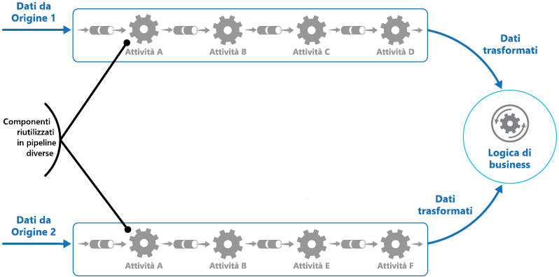

# <a name="pipes-and-filters-pattern"></a><span data-ttu-id="bc09a-104">Modello di pipe e filtri</span><span class="sxs-lookup"><span data-stu-id="bc09a-104">Pipes and Filters pattern</span></span>

[!INCLUDE [header](../_includes/header.md)]

<span data-ttu-id="bc09a-105">Scomporre un'attività che esegue un'elaborazione complessa in una serie di elementi distinti riutilizzabili.</span><span class="sxs-lookup"><span data-stu-id="bc09a-105">Decompose a task that performs complex processing into a series of separate elements that can be reused.</span></span> <span data-ttu-id="bc09a-106">Si possono migliorare prestazioni, scalabilità e riusabilità, consentendo agli elementi delle attività che eseguono l'elaborazione di essere distribuiti e ridimensionati in modo indipendente.</span><span class="sxs-lookup"><span data-stu-id="bc09a-106">This can improve performance, scalability, and reusability by allowing task elements that perform the processing to be deployed and scaled independently.</span></span>

## <a name="context-and-problem"></a><span data-ttu-id="bc09a-107">Contesto e problema</span><span class="sxs-lookup"><span data-stu-id="bc09a-107">Context and problem</span></span>

<span data-ttu-id="bc09a-108">Un'applicazione deve poter eseguire una serie di attività di varia complessità sulle informazioni che elabora.</span><span class="sxs-lookup"><span data-stu-id="bc09a-108">An application is required to perform a variety of tasks of varying complexity on the information that it processes.</span></span> <span data-ttu-id="bc09a-109">Un approccio semplice ma rigido per implementare tale applicazione è quello di eseguire l'elaborazione come modulo monolitico.</span><span class="sxs-lookup"><span data-stu-id="bc09a-109">A straightforward but inflexible approach to implementing an application is to perform this processing as a monolithic module.</span></span> <span data-ttu-id="bc09a-110">Tuttavia, questo approccio probabilmente ridurrà le opportunità di refactoring, ottimizzazione o riutilizzo del codice se parti della stessa elaborazione sono necessarie in un altro punto dell'applicazione.</span><span class="sxs-lookup"><span data-stu-id="bc09a-110">However, this approach is likely to reduce the opportunities for refactoring the code, optimizing it, or reusing it if parts of the same processing are required elsewhere within the application.</span></span>

<span data-ttu-id="bc09a-111">Nella figura vengono illustrati i problemi relativi all'elaborazione dei dati tramite l'approccio monolitico.</span><span class="sxs-lookup"><span data-stu-id="bc09a-111">The figure illustrates the issues with processing data using the monolithic approach.</span></span> <span data-ttu-id="bc09a-112">Un'applicazione riceve ed elabora i dati da due origini.</span><span class="sxs-lookup"><span data-stu-id="bc09a-112">An application receives and processes data from two sources.</span></span> <span data-ttu-id="bc09a-113">I dati da ogni origine vengono elaborati da un modulo separato che esegue una serie di attività per trasformare i dati, prima di passare il risultato alla logica di business dell'applicazione.</span><span class="sxs-lookup"><span data-stu-id="bc09a-113">The data from each source is processed by a separate module that performs a series of tasks to transform this data, before passing the result to the business logic of the application.</span></span>


<span data-ttu-id="bc09a-115">Alcune delle attività che eseguono i moduli monolitici sono molto simili a livello funzionale, ma i moduli sono stati progettati separatamente.</span><span class="sxs-lookup"><span data-stu-id="bc09a-115">Some of the tasks that the monolithic modules perform are functionally very similar, but the modules have been designed separately.</span></span> <span data-ttu-id="bc09a-116">Il codice che implementa le attività è strettamente associato a un modulo e sviluppato tenendo poco conto del riuso o della scalabilità.</span><span class="sxs-lookup"><span data-stu-id="bc09a-116">The code that implements the tasks is closely coupled in a module, and has been developed with little or no thought given to reuse or scalability.</span></span>

<span data-ttu-id="bc09a-117">Tuttavia, le attività di elaborazione eseguite da ogni modulo o i requisiti di distribuzione per ogni attività possono cambiare una volta che i requisiti aziendali vengono aggiornati.</span><span class="sxs-lookup"><span data-stu-id="bc09a-117">However, the processing tasks performed by each module, or the deployment requirements for each task, could change as business requirements are updated.</span></span> <span data-ttu-id="bc09a-118">Alcune attività potrebbero essere a elevato uso di calcolo e richiedere hardware potente per essere eseguite, mentre altre potrebbero non aver bisogno di risorse così costose.</span><span class="sxs-lookup"><span data-stu-id="bc09a-118">Some tasks might be compute intensive and could benefit from running on powerful hardware, while others might not require such expensive resources.</span></span> <span data-ttu-id="bc09a-119">Inoltre in futuro potrebbe essere necessaria un'ulteriore elaborazione, o cambiare l'ordine in cui le attività vengono eseguite dall'elaborazione.</span><span class="sxs-lookup"><span data-stu-id="bc09a-119">Also, additional processing might be required in the future, or the order in which the tasks performed by the processing could change.</span></span> <span data-ttu-id="bc09a-120">Occorre una soluzione che risolva questi problemi e aumenti le possibilità di riuso del codice.</span><span class="sxs-lookup"><span data-stu-id="bc09a-120">A solution is required that addresses these issues, and increases the possibilities for code reuse.</span></span>

## <a name="solution"></a><span data-ttu-id="bc09a-121">Soluzione</span><span class="sxs-lookup"><span data-stu-id="bc09a-121">Solution</span></span>

<span data-ttu-id="bc09a-122">Suddividere l'elaborazione richiesta per ogni flusso in un set di componenti separati (o filtri), ognuno dei quali esegue una singola attività.</span><span class="sxs-lookup"><span data-stu-id="bc09a-122">Break down the processing required for each stream into a set of separate components (or filters), each performing a single task.</span></span> <span data-ttu-id="bc09a-123">Standardizzando il formato dei dati ricevuti e inviati da ciascun componente, questi filtri possono essere combinati insieme in una pipeline.</span><span class="sxs-lookup"><span data-stu-id="bc09a-123">By standardizing the format of the data that each component receives and sends, these filters can be combined together into a pipeline.</span></span> <span data-ttu-id="bc09a-124">Ciò consente di evitare la duplicazione del codice e semplifica la rimozione, la sostituzione o l'integrazione di componenti aggiuntivi in caso di modifica dei requisiti di elaborazione.</span><span class="sxs-lookup"><span data-stu-id="bc09a-124">This helps to avoid duplicating code, and makes it easy to remove, replace, or integrate additional components if the processing requirements change.</span></span> <span data-ttu-id="bc09a-125">La figura seguente mostra una soluzione implementata usando pipe e filtri.</span><span class="sxs-lookup"><span data-stu-id="bc09a-125">The next figure shows a solution implemented using pipes and filters.</span></span>



<span data-ttu-id="bc09a-127">Il tempo impiegato per elaborare una singola richiesta dipende dalla velocità del filtro più lento nella pipeline.</span><span class="sxs-lookup"><span data-stu-id="bc09a-127">The time it takes to process a single request depends on the speed of the slowest filter in the pipeline.</span></span> <span data-ttu-id="bc09a-128">Uno o più filtri potrebbero rappresentare un collo di bottiglia, soprattutto se in un flusso si verifica un numero elevato di richieste da una determinata origine dati.</span><span class="sxs-lookup"><span data-stu-id="bc09a-128">One or more filters could be a bottleneck, especially if a large number of requests appear in a stream from a particular data source.</span></span> <span data-ttu-id="bc09a-129">Un vantaggio chiave della struttura della pipeline è l'opportunità di eseguire istanze parallele di filtri lenti, consentendo al sistema di distribuire il carico e migliorare la velocità effettiva.</span><span class="sxs-lookup"><span data-stu-id="bc09a-129">A key advantage of the pipeline structure is that it provides opportunities for running parallel instances of slow filters, enabling the system to spread the load and improve throughput.</span></span>

<span data-ttu-id="bc09a-130">I filtri che compongono una pipeline possono essere eseguiti su macchine diverse, che consentono loro di essere scalati in modo indipendente e di sfruttare l'elasticità offerta da molti ambienti cloud.</span><span class="sxs-lookup"><span data-stu-id="bc09a-130">The filters that make up a pipeline can run on different machines, enabling them to be scaled independently and take advantage of the elasticity that many cloud environments provide.</span></span> <span data-ttu-id="bc09a-131">Un filtro impegnativo da un punto di vista computazionale può essere eseguito su hardware ad alte prestazioni, mentre altri filtri meno esigenti possono essere ospitati su hardware meno costoso.</span><span class="sxs-lookup"><span data-stu-id="bc09a-131">A filter that is computationally intensive can run on high performance hardware, while other less demanding filters can be hosted on less expensive commodity hardware.</span></span> <span data-ttu-id="bc09a-132">I filtri non devono nemmeno trovarsi nello stesso data center o nella medesima posizione geografica, il che consente a ciascun elemento di una pipeline di essere eseguito in un ambiente sito in prossimità delle risorse richieste.</span><span class="sxs-lookup"><span data-stu-id="bc09a-132">The filters don't even have to be in the same data center or geographical location, which allows each element in a pipeline to run in an environment that is close to the resources it requires.</span></span>  <span data-ttu-id="bc09a-133">La figura seguente mostra un esempio applicato alla pipeline dei dati dall'Origine 1.</span><span class="sxs-lookup"><span data-stu-id="bc09a-133">The next figure shows an example applied to the pipeline for the data from Source 1.</span></span>


<span data-ttu-id="bc09a-135">Se l'input e l'output di un filtro sono strutturati come flusso, è possibile eseguire l'elaborazione per ciascun filtro in parallelo.</span><span class="sxs-lookup"><span data-stu-id="bc09a-135">If the input and output of a filter are structured as a stream, it's possible to perform the processing for each filter in parallel.</span></span> <span data-ttu-id="bc09a-136">Il primo filtro nella pipeline può iniziare il suo lavoro e produrre i risultati, che vengono passati direttamente al filtro successivo nella sequenza prima che il primo filtro abbia completato il suo lavoro.</span><span class="sxs-lookup"><span data-stu-id="bc09a-136">The first filter in the pipeline can start its work and output its results, which are passed directly on to the next filter in the sequence before the first filter has completed its work.</span></span>

<span data-ttu-id="bc09a-137">Un altro vantaggio è la resilienza che questo modello è in grado di offrire.</span><span class="sxs-lookup"><span data-stu-id="bc09a-137">Another benefit is the resiliency that this model can provide.</span></span> <span data-ttu-id="bc09a-138">Se un filtro ha esito negativo o la macchina su cui è in esecuzione non è più disponibile, la pipeline può riprogrammare il lavoro che il filtro stava eseguendo e dirigerlo su un'altra istanza del componente.</span><span class="sxs-lookup"><span data-stu-id="bc09a-138">If a filter fails or the machine it's running on is no longer available, the pipeline can reschedule the work that the filter was performing and direct this work to another instance of the component.</span></span> <span data-ttu-id="bc09a-139">Il fallimento di un solo filtro non comporta necessariamente il fallimento dell'intera pipeline.</span><span class="sxs-lookup"><span data-stu-id="bc09a-139">Failure of a single filter doesn't necessarily result in failure of the entire pipeline.</span></span>

<span data-ttu-id="bc09a-140">L'uso del modello di Pipe e Filtri in combinazione con il [Modello di transazioni di compensazione](./compensating-transaction.md) è un approccio alternativo all'implementazione delle transazioni distribuite.</span><span class="sxs-lookup"><span data-stu-id="bc09a-140">Using the Pipes and Filters pattern in conjunction with the [Compensating Transaction pattern](./compensating-transaction.md) is an alternative approach to implementing distributed transactions.</span></span> <span data-ttu-id="bc09a-141">Una transazione distribuita può essere suddivisa in attività separate e compensabili, ognuna delle quali può essere implementata usando un filtro che implementa anche il modello di transazioni di compensazione.</span><span class="sxs-lookup"><span data-stu-id="bc09a-141">A distributed transaction can be broken down into separate, compensable tasks, each of which can be implemented by using a filter that also implements the Compensating Transaction pattern.</span></span> <span data-ttu-id="bc09a-142">I filtri in una pipeline possono essere implementati come attività ospitate separate in esecuzione in prossimità dei dati che gestiscono.</span><span class="sxs-lookup"><span data-stu-id="bc09a-142">The filters in a pipeline can be implemented as separate hosted tasks running close to the data that they maintain.</span></span>

## <a name="issues-and-considerations"></a><span data-ttu-id="bc09a-143">Considerazioni e problemi</span><span class="sxs-lookup"><span data-stu-id="bc09a-143">Issues and considerations</span></span>

<span data-ttu-id="bc09a-144">Prima di decidere come implementare questo schema, è opportuno considerare quanto segue:</span><span class="sxs-lookup"><span data-stu-id="bc09a-144">You should consider the following points when deciding how to implement this pattern:</span></span>

- <span data-ttu-id="bc09a-145">**Complessità**.</span><span class="sxs-lookup"><span data-stu-id="bc09a-145">**Complexity**.</span></span> <span data-ttu-id="bc09a-146">La maggiore flessibilità offerta da questo modello può anche presentare complessità, specialmente se i filtri in una pipeline sono distribuiti su server diversi.</span><span class="sxs-lookup"><span data-stu-id="bc09a-146">The increased flexibility that this pattern provides can also introduce complexity, especially if the filters in a pipeline are distributed across different servers.</span></span>

- <span data-ttu-id="bc09a-147">**Affidabilità**.</span><span class="sxs-lookup"><span data-stu-id="bc09a-147">**Reliability**.</span></span> <span data-ttu-id="bc09a-148">Uso di un'infrastruttura che assicura che i dati che si propagano tra i filtri in una pipeline non vadano persi.</span><span class="sxs-lookup"><span data-stu-id="bc09a-148">Use an infrastructure that ensures that data flowing between filters in a pipeline won't be lost.</span></span>

- <span data-ttu-id="bc09a-149">**Idempotenza**.</span><span class="sxs-lookup"><span data-stu-id="bc09a-149">**Idempotency**.</span></span> <span data-ttu-id="bc09a-150">Se un filtro in una pipeline ha esito negativo dopo la ricezione di un messaggio e il lavoro viene ripianificato in un'altra istanza del filtro, parte del lavoro potrebbe essere già stata completata.</span><span class="sxs-lookup"><span data-stu-id="bc09a-150">If a filter in a pipeline fails after receiving a message and the work is rescheduled to another instance of the filter, part of the work might have already been completed.</span></span> <span data-ttu-id="bc09a-151">Se questa operazione aggiorna alcuni aspetti dello stato globale (come le informazioni archiviate in un database), l'aggiornamento stesso potrebbe venire ripetuto.</span><span class="sxs-lookup"><span data-stu-id="bc09a-151">If this work updates some aspect of the global state (such as information stored in a database), the same update could be repeated.</span></span> <span data-ttu-id="bc09a-152">Un problema simile potrebbe verificarsi se un filtro fallisce dopo aver pubblicato i risultati sul filtro successivo nella pipeline, ma prima di indicare di aver completato correttamente il lavoro.</span><span class="sxs-lookup"><span data-stu-id="bc09a-152">A similar issue might occur if a filter fails after posting its results to the next filter in the pipeline, but before indicating that it's completed its work successfully.</span></span> <span data-ttu-id="bc09a-153">In questi casi, la stessa operazione può essere ripetuta da un'altra istanza del filtro, facendo sì che gli stessi risultati vengano pubblicati due volte.</span><span class="sxs-lookup"><span data-stu-id="bc09a-153">In these cases, the same work could be repeated by another instance of the filter, causing the same results to be posted twice.</span></span> <span data-ttu-id="bc09a-154">Ciò potrebbe generare filtri successivi nella pipeline che elaborano gli stessi dati due volte.</span><span class="sxs-lookup"><span data-stu-id="bc09a-154">This could result in subsequent filters in the pipeline processing the same data twice.</span></span> <span data-ttu-id="bc09a-155">Pertanto i filtri di una pipeline vanno progettati come idempotenti.</span><span class="sxs-lookup"><span data-stu-id="bc09a-155">Therefore filters in a pipeline should be designed to be idempotent.</span></span> <span data-ttu-id="bc09a-156">Per altre informazioni, vedere [Idempotency Patterns](https://blog.jonathanoliver.com/idempotency-patterns/) (Modelli di idempotenza) sul blog di Jonathan Oliver.</span><span class="sxs-lookup"><span data-stu-id="bc09a-156">For more information see [Idempotency Patterns](https://blog.jonathanoliver.com/idempotency-patterns/) on Jonathan Oliver’s blog.</span></span>

- <span data-ttu-id="bc09a-157">**Messaggi ripetuti**.</span><span class="sxs-lookup"><span data-stu-id="bc09a-157">**Repeated messages**.</span></span> <span data-ttu-id="bc09a-158">Se un filtro in una pipeline fallisce dopo aver inviato un messaggio alla fase successiva della pipeline, potrebbe essere eseguita un'altra istanza del filtro che invierà una copia dello stesso messaggio alla pipeline.</span><span class="sxs-lookup"><span data-stu-id="bc09a-158">If a filter in a pipeline fails after posting a message to the next stage of the pipeline, another instance of the filter might be run, and it'll post a copy of the same message to the pipeline.</span></span> <span data-ttu-id="bc09a-159">Ciò potrebbe causare il passaggio di due istanze dello stesso messaggio al filtro successivo.</span><span class="sxs-lookup"><span data-stu-id="bc09a-159">This could cause two instances of the same message to be passed to the next filter.</span></span> <span data-ttu-id="bc09a-160">Per evitare questo problema, la pipeline deve rilevare ed eliminare i messaggi duplicati.</span><span class="sxs-lookup"><span data-stu-id="bc09a-160">To avoid this, the pipeline should detect and eliminate duplicate messages.</span></span>

    >  <span data-ttu-id="bc09a-161">Se si sta implementando la pipeline usando code di messaggi (come le code del bus di servizio di Microsoft Azure), l'infrastruttura di accodamento dei messaggi potrebbe fornire il rilevamento e la rimozione automatici dei messaggi duplicati.</span><span class="sxs-lookup"><span data-stu-id="bc09a-161">If you're implementing the pipeline by using message queues (such as Microsoft Azure Service Bus queues), the message queuing infrastructure might provide automatic duplicate message detection and removal.</span></span>

- <span data-ttu-id="bc09a-162">**Contesto e stato**.</span><span class="sxs-lookup"><span data-stu-id="bc09a-162">**Context and state**.</span></span> <span data-ttu-id="bc09a-163">In una pipeline, ciascun filtro viene eseguito essenzialmente in isolamento e non deve formulare alcuna ipotesi su come è stato richiamato.</span><span class="sxs-lookup"><span data-stu-id="bc09a-163">In a pipeline, each filter essentially runs in isolation and shouldn't make any assumptions about how it was invoked.</span></span> <span data-ttu-id="bc09a-164">Ciò significa che ogni filtro dovrebbe essere fornito con un contesto sufficiente a svolgere il proprio lavoro.</span><span class="sxs-lookup"><span data-stu-id="bc09a-164">This means that each filter should be provided with sufficient context to perform its work.</span></span> <span data-ttu-id="bc09a-165">Questo contesto potrebbe includere una grande quantità di informazioni sullo stato.</span><span class="sxs-lookup"><span data-stu-id="bc09a-165">This context could include a large amount of state information.</span></span>

## <a name="when-to-use-this-pattern"></a><span data-ttu-id="bc09a-166">Quando usare questo modello</span><span class="sxs-lookup"><span data-stu-id="bc09a-166">When to use this pattern</span></span>

<span data-ttu-id="bc09a-167">Usare questo modello quando:</span><span class="sxs-lookup"><span data-stu-id="bc09a-167">Use this pattern when:</span></span>

- <span data-ttu-id="bc09a-168">L'elaborazione richiesta da un'applicazione può essere facilmente suddivisa in un set di passaggi indipendenti.</span><span class="sxs-lookup"><span data-stu-id="bc09a-168">The processing required by an application can easily be broken down into a set of independent steps.</span></span>

- <span data-ttu-id="bc09a-169">I passaggi di elaborazione eseguiti da un'applicazione hanno requisiti di scalabilità differenti.</span><span class="sxs-lookup"><span data-stu-id="bc09a-169">The processing steps performed by an application have different scalability requirements.</span></span>

    >  <span data-ttu-id="bc09a-170">È possibile raggruppare i filtri che dovrebbero scalare insieme nello stesso processo.</span><span class="sxs-lookup"><span data-stu-id="bc09a-170">It's possible to group filters that should scale together in the same process.</span></span> <span data-ttu-id="bc09a-171">Per altre informazioni, vedere [Compute Resource Consolidation pattern](./compute-resource-consolidation.md) (Modello di consolidamento delle risorse di calcolo).</span><span class="sxs-lookup"><span data-stu-id="bc09a-171">For more information, see the [Compute Resource Consolidation pattern](./compute-resource-consolidation.md).</span></span>

- <span data-ttu-id="bc09a-172">La flessibilità è necessaria per riordinare i passaggi di elaborazione eseguiti da un'applicazione o per aggiungere e rimuovere passaggi.</span><span class="sxs-lookup"><span data-stu-id="bc09a-172">Flexibility is required to allow reordering of the processing steps performed by an application, or the capability to add and remove steps.</span></span>

- <span data-ttu-id="bc09a-173">Il sistema può trarre vantaggio dalla distribuzione dell'elaborazione per i passaggi su server diversi.</span><span class="sxs-lookup"><span data-stu-id="bc09a-173">The system can benefit from distributing the processing for steps across different servers.</span></span>

- <span data-ttu-id="bc09a-174">È necessaria una soluzione affidabile che riduca al minimo gli effetti di un errore in un passaggio durante l'elaborazione dei dati.</span><span class="sxs-lookup"><span data-stu-id="bc09a-174">A reliable solution is required that minimizes the effects of failure in a step while data is being processed.</span></span>

<span data-ttu-id="bc09a-175">Questo modello potrebbe non essere utile quando:</span><span class="sxs-lookup"><span data-stu-id="bc09a-175">This pattern might not be useful when:</span></span>

- <span data-ttu-id="bc09a-176">I passaggi di elaborazione eseguiti da un'applicazione non sono indipendenti o devono essere eseguiti insieme come parte della stessa transazione.</span><span class="sxs-lookup"><span data-stu-id="bc09a-176">The processing steps performed by an application aren't independent, or they have to be performed together as part of the same transaction.</span></span>

- <span data-ttu-id="bc09a-177">La quantità di informazioni di contesto o di stato richiesta da un passaggio rende questo approccio inefficiente.</span><span class="sxs-lookup"><span data-stu-id="bc09a-177">The amount of context or state information required by a step makes this approach inefficient.</span></span> <span data-ttu-id="bc09a-178">Potrebbe invece essere possibile mantenere le informazioni sullo stato in un database, ma non usare questa strategia se il carico aggiuntivo sul database causa una contesa eccessiva.</span><span class="sxs-lookup"><span data-stu-id="bc09a-178">It might be possible to persist state information to a database instead, but don't use this strategy if the additional load on the database causes excessive contention.</span></span>

## <a name="example"></a><span data-ttu-id="bc09a-179">Esempio</span><span class="sxs-lookup"><span data-stu-id="bc09a-179">Example</span></span>

<span data-ttu-id="bc09a-180">È possibile usare una sequenza di code di messaggi per fornire l'infrastruttura necessaria per implementare una pipeline.</span><span class="sxs-lookup"><span data-stu-id="bc09a-180">You can use a sequence of message queues to provide the infrastructure required to implement a pipeline.</span></span> <span data-ttu-id="bc09a-181">Una coda di messaggi iniziale riceve messaggi non elaborati.</span><span class="sxs-lookup"><span data-stu-id="bc09a-181">An initial message queue receives unprocessed messages.</span></span> <span data-ttu-id="bc09a-182">Un componente implementato come attività filtro ascolta un messaggio in questa coda, esegue il proprio lavoro e quindi invia il messaggio trasformato alla coda successiva nella sequenza.</span><span class="sxs-lookup"><span data-stu-id="bc09a-182">A component implemented as a filter task listens for a message on this queue, performs its work, and then posts the transformed message to the next queue in the sequence.</span></span> <span data-ttu-id="bc09a-183">Un'altra attività di filtro può essere in ascolto dei messaggi in questa coda, elaborarli, pubblicare i risultati in un'altra coda e così via fino a quando i dati completamente trasformati appaiono nel messaggio finale della coda.</span><span class="sxs-lookup"><span data-stu-id="bc09a-183">Another filter task can listen for messages on this queue, process them, post the results to another queue, and so on until the fully transformed data appears in the final message in the queue.</span></span> <span data-ttu-id="bc09a-184">La figura seguente illustra l'implementazione di una pipeline usando le code dei messaggi.</span><span class="sxs-lookup"><span data-stu-id="bc09a-184">The next figure illustrates implementing a pipeline using message queues.</span></span>


<span data-ttu-id="bc09a-186">Se si sta creando una soluzione su Azure, è possibile usare le code del bus di servizio per fornire un meccanismo di accodamento affidabile e scalabile.</span><span class="sxs-lookup"><span data-stu-id="bc09a-186">If you're building a solution on Azure you can use Service Bus queues to provide a reliable and scalable queuing mechanism.</span></span> <span data-ttu-id="bc09a-187">La classe `ServiceBusPipeFilter` mostrata di seguito in C# dimostra come è possibile implementare un filtro che riceve i messaggi di input da una coda, elabora questi messaggi e inserisce i risultati in un'altra coda.</span><span class="sxs-lookup"><span data-stu-id="bc09a-187">The `ServiceBusPipeFilter` class shown below in C# demonstrates how you can implement a filter that receives input messages from a queue, processes these messages, and posts the results to another queue.</span></span>

> <span data-ttu-id="bc09a-188">La classe `ServiceBusPipeFilter` è definita nel progetto PipesAndFilters.Shared disponibile da [GitHub](https://github.com/mspnp/cloud-design-patterns/tree/master/pipes-and-filters).</span><span class="sxs-lookup"><span data-stu-id="bc09a-188">The `ServiceBusPipeFilter` class is defined in the PipesAndFilters.Shared project available from [GitHub](https://github.com/mspnp/cloud-design-patterns/tree/master/pipes-and-filters).</span></span>

```csharp
public class ServiceBusPipeFilter
{
  ...
  private readonly string inQueuePath;
  private readonly string outQueuePath;
  ...
  private QueueClient inQueue;
  private QueueClient outQueue;
  ...

  public ServiceBusPipeFilter(..., string inQueuePath, string outQueuePath = null)
  {
     ...
     this.inQueuePath = inQueuePath;
     this.outQueuePath = outQueuePath;
  }

  public void Start()
  {
    ...
    // Create the outbound filter queue if it doesn't exist.
    ...
    this.outQueue = QueueClient.CreateFromConnectionString(...);

    ...
    // Create the inbound and outbound queue clients.
    this.inQueue = QueueClient.CreateFromConnectionString(...);
  }

  public void OnPipeFilterMessageAsync(
    Func<BrokeredMessage, Task<BrokeredMessage>> asyncFilterTask, ...)
  {
    ...

    this.inQueue.OnMessageAsync(
      async (msg) =>
    {
      ...
      // Process the filter and send the output to the
      // next queue in the pipeline.
      var outMessage = await asyncFilterTask(msg);

      // Send the message from the filter processor
      // to the next queue in the pipeline.
      if (outQueue != null)
      {
        await outQueue.SendAsync(outMessage);
      }

      // Note: There's a chance that the same message could be sent twice
      // or that a message gets processed by an upstream or downstream
      // filter at the same time.
      // This would happen in a situation where processing of a message was
      // completed, it was sent to the next pipe/queue, and then failed
      // to complete when using the PeekLock method.
      // Idempotent message processing and concurrency should be considered
      // in a real-world implementation.
    },
    options);
  }

  public async Task Close(TimeSpan timespan)
  {
    // Pause the processing threads.
    this.pauseProcessingEvent.Reset();

    // There's no clean approach for waiting for the threads to complete
    // the processing. This example simply stops any new processing, waits
    // for the existing thread to complete, then closes the message pump
    // and finally returns.
    Thread.Sleep(timespan);

    this.inQueue.Close();
    ...
  }

  ...
}
```

<span data-ttu-id="bc09a-189">Il metodo `Start` nella classe `ServiceBusPipeFilter` si connette a una coppia di code di input e output, mentre il metodo `Close` si disconnette dalla coda di input.</span><span class="sxs-lookup"><span data-stu-id="bc09a-189">The `Start` method in the `ServiceBusPipeFilter` class connects to a pair of input and output queues, and the `Close` method disconnects from the input queue.</span></span> <span data-ttu-id="bc09a-190">Il metodo `OnPipeFilterMessageAsync` esegue l'elaborazione effettiva dei messaggi, il parametro `asyncFilterTask` di questo metodo specifica l'elaborazione da eseguire.</span><span class="sxs-lookup"><span data-stu-id="bc09a-190">The `OnPipeFilterMessageAsync` method performs the actual processing of messages, the `asyncFilterTask` parameter to this method specifies the processing to be performed.</span></span> <span data-ttu-id="bc09a-191">Il metodo `OnPipeFilterMessageAsync` attende i messaggi in arrivo sulla coda di input, esegue il codice specificato dal parametro `asyncFilterTask` su ciascun messaggio non appena arriva e inserisce i risultati nella coda di output.</span><span class="sxs-lookup"><span data-stu-id="bc09a-191">The `OnPipeFilterMessageAsync` method waits for incoming messages on the input queue, runs the code specified by the `asyncFilterTask` parameter over each message as it arrives, and posts the results to the output queue.</span></span> <span data-ttu-id="bc09a-192">Le code stesse sono specificate dal costruttore.</span><span class="sxs-lookup"><span data-stu-id="bc09a-192">The queues themselves are specified by the constructor.</span></span>

<span data-ttu-id="bc09a-193">La soluzione di esempio implementa i filtri in un set di ruoli di lavoro.</span><span class="sxs-lookup"><span data-stu-id="bc09a-193">The sample solution implements filters in a set of worker roles.</span></span> <span data-ttu-id="bc09a-194">Ogni ruolo di lavoro può essere ridimensionato in modo indipendente, a seconda della complessità dell'elaborazione aziendale che esegue o delle risorse necessarie per l'elaborazione.</span><span class="sxs-lookup"><span data-stu-id="bc09a-194">Each worker role can be scaled independently, depending on the complexity of the business processing that it performs or the resources required for processing.</span></span> <span data-ttu-id="bc09a-195">Inoltre è possibile eseguire più istanze di ciascun ruolo di lavoro in parallelo per migliorare la velocità effettiva.</span><span class="sxs-lookup"><span data-stu-id="bc09a-195">Additionally, multiple instances of each worker role can be run in parallel to improve throughput.</span></span>

<span data-ttu-id="bc09a-196">Nel codice seguente viene illustrato un ruolo di lavoro di Azure denominato `PipeFilterARoleEntry`, definito nel progetto PipeFilterA nella soluzione di esempio.</span><span class="sxs-lookup"><span data-stu-id="bc09a-196">The following code shows an Azure worker role named `PipeFilterARoleEntry`, defined in the PipeFilterA project in the sample solution.</span></span>

```csharp
public class PipeFilterARoleEntry : RoleEntryPoint
{
  ...
  private ServiceBusPipeFilter pipeFilterA;

  public override bool OnStart()
  {
    ...
    this.pipeFilterA = new ServiceBusPipeFilter(
      ...,
      Constants.QueueAPath,
      Constants.QueueBPath);

    this.pipeFilterA.Start();
    ...
  }

  public override void Run()
  {
    this.pipeFilterA.OnPipeFilterMessageAsync(async (msg) =>
    {
      // Clone the message and update it.
      // Properties set by the broker (Deliver count, enqueue time, ...)
      // aren't cloned and must be copied over if required.
      var newMsg = msg.Clone();

      await Task.Delay(500); // DOING WORK

      Trace.TraceInformation("Filter A processed message:{0} at {1}",
        msg.MessageId, DateTime.UtcNow);

      newMsg.Properties.Add(Constants.FilterAMessageKey, "Complete");

      return newMsg;
    });

    ...
  }

  ...
}
```

<span data-ttu-id="bc09a-197">Questo ruolo contiene un oggetto `ServiceBusPipeFilter`.</span><span class="sxs-lookup"><span data-stu-id="bc09a-197">This role contains a `ServiceBusPipeFilter` object.</span></span> <span data-ttu-id="bc09a-198">Il metodo `OnStart` nel ruolo si connette alle code per ricevere i messaggi di input e inviare i messaggi di output (i nomi delle code vengono definiti nella classe `Constants`).</span><span class="sxs-lookup"><span data-stu-id="bc09a-198">The `OnStart` method in the role connects to the queues for receiving input messages and posting output messages (the names of the queues are defined in the `Constants` class).</span></span> <span data-ttu-id="bc09a-199">Il metodo `Run` richiama il metodo `OnPipeFilterMessagesAsync` per eseguire alcune elaborazioni su ciascun messaggio ricevuto (in questo esempio, l'elaborazione viene simulata attendendo per un breve periodo di tempo).</span><span class="sxs-lookup"><span data-stu-id="bc09a-199">The `Run` method invokes the `OnPipeFilterMessagesAsync` method to perform some processing on each message that's received (in this example, the processing is simulated by waiting for a short period of time).</span></span> <span data-ttu-id="bc09a-200">Al termine dell'elaborazione, viene creato un nuovo messaggio contenente i risultati (in questo caso il messaggio di input ha una proprietà personalizzata aggiunta) e questo messaggio viene inviato alla coda di output.</span><span class="sxs-lookup"><span data-stu-id="bc09a-200">When processing is complete, a new message is constructed containing the results (in this case, the input message has a custom property added), and this message is posted to the output queue.</span></span>

<span data-ttu-id="bc09a-201">Il codice di esempio contiene un altro ruolo di lavoro denominato `PipeFilterBRoleEntry` nel progetto PipeFilterB.</span><span class="sxs-lookup"><span data-stu-id="bc09a-201">The sample code contains another worker role named `PipeFilterBRoleEntry` in the PipeFilterB project.</span></span> <span data-ttu-id="bc09a-202">Questo ruolo è simile a `PipeFilterARoleEntry` ma esegue un'elaborazione diversa nel metodo `Run`.</span><span class="sxs-lookup"><span data-stu-id="bc09a-202">This role is similar to `PipeFilterARoleEntry` except that it performs different processing in the `Run` method.</span></span> <span data-ttu-id="bc09a-203">Nella soluzione di esempio, questi due ruoli vengono combinati per creare una pipeline, la coda di output per il ruolo `PipeFilterARoleEntry` è la coda di input per il ruolo `PipeFilterBRoleEntry`.</span><span class="sxs-lookup"><span data-stu-id="bc09a-203">In the example solution, these two roles are combined to construct a pipeline, the output queue for the `PipeFilterARoleEntry` role is the input queue for the `PipeFilterBRoleEntry` role.</span></span>

<span data-ttu-id="bc09a-204">La soluzione di esempio fornisce anche due ruoli aggiuntivi denominati `InitialSenderRoleEntry` (nel progetto InitialSender) e `FinalReceiverRoleEntry` (nel progetto FinalReceiver).</span><span class="sxs-lookup"><span data-stu-id="bc09a-204">The sample solution also provides two additional roles named `InitialSenderRoleEntry` (in the InitialSender project) and `FinalReceiverRoleEntry` (in the FinalReceiver project).</span></span> <span data-ttu-id="bc09a-205">Il ruolo `InitialSenderRoleEntry` fornisce il messaggio iniziale nella pipeline.</span><span class="sxs-lookup"><span data-stu-id="bc09a-205">The `InitialSenderRoleEntry` role provides the initial message in the pipeline.</span></span> <span data-ttu-id="bc09a-206">Il metodo `OnStart` si connette a una singola coda e il metodo `Run` invia un metodo a questa coda.</span><span class="sxs-lookup"><span data-stu-id="bc09a-206">The `OnStart` method connects to a single queue and the `Run` method posts a method to this queue.</span></span> <span data-ttu-id="bc09a-207">La coda è la coda di input usata dal ruolo `PipeFilterARoleEntry`, pertanto l'invio di un messaggio fa sì che il messaggio venga ricevuto ed elaborato dal ruolo `PipeFilterARoleEntry`.</span><span class="sxs-lookup"><span data-stu-id="bc09a-207">This queue is the input queue used by the `PipeFilterARoleEntry` role, so posting a message to it causes the message to be received and processed by the `PipeFilterARoleEntry` role.</span></span> <span data-ttu-id="bc09a-208">Il messaggio elaborato passa quindi attraverso il ruolo `PipeFilterBRoleEntry`.</span><span class="sxs-lookup"><span data-stu-id="bc09a-208">The processed message then passes through the `PipeFilterBRoleEntry` role.</span></span>

<span data-ttu-id="bc09a-209">La coda di input per il ruolo `FinalReceiveRoleEntry` è la coda di output per il ruolo `PipeFilterBRoleEntry`.</span><span class="sxs-lookup"><span data-stu-id="bc09a-209">The input queue for the `FinalReceiveRoleEntry` role is the output queue for the `PipeFilterBRoleEntry` role.</span></span> <span data-ttu-id="bc09a-210">Il metodo `Run` nel ruolo `FinalReceiveRoleEntry`, illustrato di seguito, riceve il messaggio ed esegue alcune operazioni di elaborazione finale.</span><span class="sxs-lookup"><span data-stu-id="bc09a-210">The `Run` method in the `FinalReceiveRoleEntry` role, shown below, receives the message and performs some final processing.</span></span> <span data-ttu-id="bc09a-211">Scrive quindi i valori delle proprietà personalizzate aggiunte dai filtri nella pipeline per l'output di traccia.</span><span class="sxs-lookup"><span data-stu-id="bc09a-211">Then it writes the values of the custom properties added by the filters in the pipeline to the trace output.</span></span>

```csharp
public class FinalReceiverRoleEntry : RoleEntryPoint
{
  ...
  // Final queue/pipe in the pipeline to process data from.
  private ServiceBusPipeFilter queueFinal;

  public override bool OnStart()
  {
    ...
    // Set up the queue.
    this.queueFinal = new ServiceBusPipeFilter(...,Constants.QueueFinalPath);
    this.queueFinal.Start();
    ...
  }

  public override void Run()
  {
    this.queueFinal.OnPipeFilterMessageAsync(
      async (msg) =>
      {
        await Task.Delay(500); // DOING WORK

        // The pipeline message was received.
        Trace.TraceInformation(
          "Pipeline Message Complete - FilterA:{0} FilterB:{1}",
          msg.Properties[Constants.FilterAMessageKey],
          msg.Properties[Constants.FilterBMessageKey]);

        return null;
      });
    ...
  }

  ...
}
```

## <a name="related-patterns-and-guidance"></a><span data-ttu-id="bc09a-212">Modelli correlati e informazioni aggiuntive</span><span class="sxs-lookup"><span data-stu-id="bc09a-212">Related patterns and guidance</span></span>

<span data-ttu-id="bc09a-213">Per l'implementazione di questo modello possono risultare utili i modelli e le informazioni aggiuntive seguenti:</span><span class="sxs-lookup"><span data-stu-id="bc09a-213">The following patterns and guidance might also be relevant when implementing this pattern:</span></span>

- <span data-ttu-id="bc09a-214">Un esempio che illustra questo modello è disponibile su [GitHub](https://github.com/mspnp/cloud-design-patterns/tree/master/pipes-and-filters).</span><span class="sxs-lookup"><span data-stu-id="bc09a-214">A sample that demonstrates this pattern is available on [GitHub](https://github.com/mspnp/cloud-design-patterns/tree/master/pipes-and-filters).</span></span>
- <span data-ttu-id="bc09a-215">[Modello di consumer concorrenti](./competing-consumers.md).</span><span class="sxs-lookup"><span data-stu-id="bc09a-215">[Competing Consumers pattern](./competing-consumers.md).</span></span> <span data-ttu-id="bc09a-216">Una pipeline può contenere più istanze di uno o più filtri.</span><span class="sxs-lookup"><span data-stu-id="bc09a-216">A pipeline can contain multiple instances of one or more filters.</span></span> <span data-ttu-id="bc09a-217">Questo approccio è utile per eseguire istanze parallele di filtri lenti, consentendo al sistema di distribuire il carico e migliorare la velocità effettiva.</span><span class="sxs-lookup"><span data-stu-id="bc09a-217">This approach is useful for running parallel instances of slow filters, enabling the system to spread the load and improve throughput.</span></span> <span data-ttu-id="bc09a-218">Ogni istanza di un filtro concorrerà per l'input con le altre istanze, due istanze di un filtro non dovrebbero essere in grado di elaborare gli stessi dati.</span><span class="sxs-lookup"><span data-stu-id="bc09a-218">Each instance of a filter will compete for input with the other instances, two instances of a filter shouldn't be able to process the same data.</span></span> <span data-ttu-id="bc09a-219">Fornisce una spiegazione di questo approccio.</span><span class="sxs-lookup"><span data-stu-id="bc09a-219">Provides an explanation of this approach.</span></span>
- <span data-ttu-id="bc09a-220">[Compute Resource Consolidation pattern](./compute-resource-consolidation.md) (Modello di consolidamento delle risorse di calcolo).</span><span class="sxs-lookup"><span data-stu-id="bc09a-220">[Compute Resource Consolidation pattern](./compute-resource-consolidation.md).</span></span> <span data-ttu-id="bc09a-221">È possibile raggruppare i filtri che dovrebbero scalare insieme nello stesso processo.</span><span class="sxs-lookup"><span data-stu-id="bc09a-221">It might be possible to group filters that should scale together into the same process.</span></span> <span data-ttu-id="bc09a-222">Offre altre informazioni sui vantaggi e gli svantaggi di questa strategia.</span><span class="sxs-lookup"><span data-stu-id="bc09a-222">Provides more information about the benefits and tradeoffs of this strategy.</span></span>
- <span data-ttu-id="bc09a-223">[Modello di transazioni di compensazione](./compensating-transaction.md).</span><span class="sxs-lookup"><span data-stu-id="bc09a-223">[Compensating Transaction pattern](./compensating-transaction.md).</span></span> <span data-ttu-id="bc09a-224">Un filtro può essere implementato come un'operazione che può essere invertita o che ha un'operazione di compensazione che in caso di errore ripristina lo stato a una versione precedente.</span><span class="sxs-lookup"><span data-stu-id="bc09a-224">A filter can be implemented as an operation that can be reversed, or that has a compensating operation that restores the state to a previous version in the event of a failure.</span></span> <span data-ttu-id="bc09a-225">Spiega come questa può essere implementata per mantenere o ottenere la coerenza finale.</span><span class="sxs-lookup"><span data-stu-id="bc09a-225">Explains how this can be implemented to maintain or achieve eventual consistency.</span></span>
- <span data-ttu-id="bc09a-226">[Idempotency Patterns](https://blog.jonathanoliver.com/idempotency-patterns/) (Modelli di idempotenza) sul blog di Jonathan Oliver.</span><span class="sxs-lookup"><span data-stu-id="bc09a-226">[Idempotency Patterns](https://blog.jonathanoliver.com/idempotency-patterns/) on Jonathan Oliver’s blog.</span></span>
