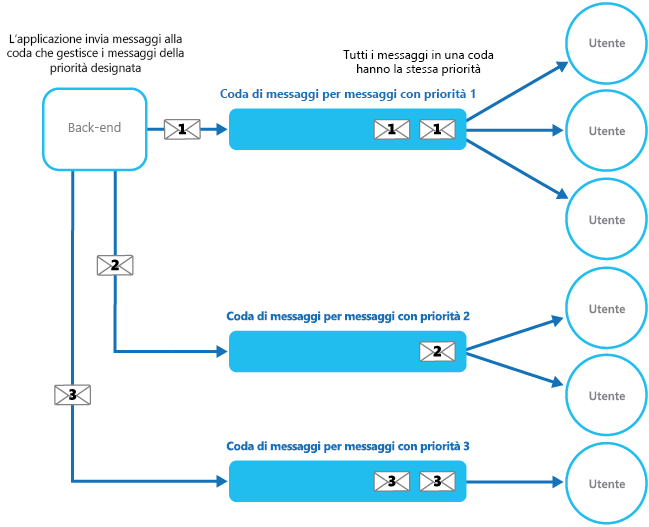

# <a name="priority-queue-pattern"></a><span data-ttu-id="a1957-104">Modello di coda con priorità</span><span class="sxs-lookup"><span data-stu-id="a1957-104">Priority Queue pattern</span></span>

[!INCLUDE [header](../_includes/header.md)]

<span data-ttu-id="a1957-105">Assegnare una priorità alle richieste inviate ai servizi in modo che le richieste con una priorità più alta vengano ricevute ed elaborate più rapidamente rispetto a quelle con priorità più bassa.</span><span class="sxs-lookup"><span data-stu-id="a1957-105">Prioritize requests sent to services so that requests with a higher priority are received and processed more quickly than those with a lower priority.</span></span> <span data-ttu-id="a1957-106">Questo modello è utile nelle applicazioni che offrono diverse garanzie del livello di servizio ai singoli client.</span><span class="sxs-lookup"><span data-stu-id="a1957-106">This pattern is useful in applications that offer different service level guarantees to individual clients.</span></span>

## <a name="context-and-problem"></a><span data-ttu-id="a1957-107">Contesto e problema</span><span class="sxs-lookup"><span data-stu-id="a1957-107">Context and Problem</span></span>

<span data-ttu-id="a1957-108">Le applicazioni possono delegare attività specifiche ad altri servizi, ad esempio per l'elaborazione in background o l'integrazione con altre applicazioni o altri servizi.</span><span class="sxs-lookup"><span data-stu-id="a1957-108">Applications can delegate specific tasks to other services, for example, to perform background processing or to integrate with other applications or services.</span></span> <span data-ttu-id="a1957-109">Nel cloud, una coda di messaggi viene in genere usata per delegare attività all'elaborazione in background.</span><span class="sxs-lookup"><span data-stu-id="a1957-109">In the cloud, a message queue is typically used to delegate tasks to background processing.</span></span> <span data-ttu-id="a1957-110">In molti casi l'ordine con cui le richieste vengono ricevute da un servizio non è importante.</span><span class="sxs-lookup"><span data-stu-id="a1957-110">In many cases the order requests are received in by a service isn't important.</span></span> <span data-ttu-id="a1957-111">In alcuni casi è invece necessario assegnare una priorità a richieste specifiche.</span><span class="sxs-lookup"><span data-stu-id="a1957-111">In some cases, though, it's necessary to prioritize specific requests.</span></span> <span data-ttu-id="a1957-112">Queste richieste devono essere elaborate prima delle richieste con priorità più bassa inviate precedentemente dall'applicazione.</span><span class="sxs-lookup"><span data-stu-id="a1957-112">These requests should be processed earlier than lower priority requests that were sent previously by the application.</span></span>

## <a name="solution"></a><span data-ttu-id="a1957-113">Soluzione</span><span class="sxs-lookup"><span data-stu-id="a1957-113">Solution</span></span>

<span data-ttu-id="a1957-114">Una coda è in genere una struttura First-In, First-Out (FIFO) e gli utenti solitamente ricevono i messaggi nello stesso ordine con cui sono stati inseriti nella coda.</span><span class="sxs-lookup"><span data-stu-id="a1957-114">A queue is usually a first-in, first-out (FIFO) structure, and consumers typically receive messages in the same order that they were posted to the queue.</span></span> <span data-ttu-id="a1957-115">Tuttavia alcune code di messaggi supportano l'invio dei messaggi in base a una priorità.</span><span class="sxs-lookup"><span data-stu-id="a1957-115">However, some message queues support priority messaging.</span></span> <span data-ttu-id="a1957-116">L'applicazione che inserisce un messaggio può assegnare una priorità e i messaggi nella coda vengono riordinati automaticamente in modo che quelli con priorità più alta vengano ricevuti prima di quelli con priorità più bassa.</span><span class="sxs-lookup"><span data-stu-id="a1957-116">The application posting a message can assign a priority and the messages in the queue are automatically reordered so that those with a higher priority will be received before those with a lower priority.</span></span> <span data-ttu-id="a1957-117">La figura illustra una coda di messaggi con priorità.</span><span class="sxs-lookup"><span data-stu-id="a1957-117">The figure illustrates a queue with priority messaging.</span></span>


> <span data-ttu-id="a1957-119">La maggior parte delle implementazioni delle code di messaggi supporta più consumer (secondo il [modello di consumer concorrenti](https://msdn.microsoft.com/library/dn568101.aspx)) e il numero di processi consumer può essere aumentato o diminuito in base alla richiesta.</span><span class="sxs-lookup"><span data-stu-id="a1957-119">Most message queue implementations support multiple consumers (following the [Competing Consumers pattern](https://msdn.microsoft.com/library/dn568101.aspx)), and the number of consumer processes can be scaled up or down depending on demand.</span></span>

<span data-ttu-id="a1957-120">Come soluzione alternativa nei sistemi che non supportano le code di messaggi basate sulla priorità è possibile gestire una coda separata per ogni priorità.</span><span class="sxs-lookup"><span data-stu-id="a1957-120">In systems that don't support priority-based message queues, an alternative solution is to maintain a separate queue for each priority.</span></span> <span data-ttu-id="a1957-121">L'applicazione è responsabile dell'inserimento dei messaggi nella coda appropriata.</span><span class="sxs-lookup"><span data-stu-id="a1957-121">The application is responsible for posting messages to the appropriate queue.</span></span> <span data-ttu-id="a1957-122">Ogni coda può avere un pool di consumer distinto.</span><span class="sxs-lookup"><span data-stu-id="a1957-122">Each queue can have a separate pool of consumers.</span></span> <span data-ttu-id="a1957-123">Le code con priorità maggiore possono avere un pool di consumer più ampio eseguito su hardware più veloce rispetto alle code con priorità inferiore.</span><span class="sxs-lookup"><span data-stu-id="a1957-123">Higher priority queues can have a larger pool of consumers running on faster hardware than lower priority queues.</span></span> <span data-ttu-id="a1957-124">La figura seguente illustra l'uso di code di messaggi separate per ogni priorità.</span><span class="sxs-lookup"><span data-stu-id="a1957-124">The next figure illustrates using separate message queues for each priority.</span></span>




<span data-ttu-id="a1957-126">Una variante di questa strategia consiste nell'usare un unico pool di consumer che gestisca prima i messaggi nelle code con priorità elevata e successivamente inizi a recuperare i messaggi dalle code con priorità inferiore.</span><span class="sxs-lookup"><span data-stu-id="a1957-126">A variation on this strategy is to have a single pool of consumers that check for messages on high priority queues first, and only then start to fetch messages from lower priority queues.</span></span> <span data-ttu-id="a1957-127">Esistono alcune differenze a livello semantico tra una soluzione che usa un solo pool di processi consumer (con una sola coda che supporta messaggi con priorità diverse o con più code ognuna delle quali gestisce messaggi con una sola priorità) e una soluzione che usa più code con un pool separato per ogni coda.</span><span class="sxs-lookup"><span data-stu-id="a1957-127">There are some semantic differences between a solution that uses a single pool of consumer processes (either with a single queue that supports messages with different priorities or with multiple queues that each handle messages of a single priority), and a solution that uses multiple queues with a separate pool for each queue.</span></span>

<span data-ttu-id="a1957-128">Nel caso del singolo pool, i messaggi con priorità più alta vengono sempre ricevuti ed elaborati prima dei messaggi con priorità più bassa.</span><span class="sxs-lookup"><span data-stu-id="a1957-128">In the single pool approach, higher priority messages are always received and processed before lower priority messages.</span></span> <span data-ttu-id="a1957-129">In teoria, i messaggi con una priorità molto bassa potrebbero essere continuamente sostituiti dai messaggi con priorità più alta e non essere mai elaborati.</span><span class="sxs-lookup"><span data-stu-id="a1957-129">In theory, messages that have a very low priority could be continually superseded and might never be processed.</span></span> <span data-ttu-id="a1957-130">Nel caso di più pool, i messaggi con priorità più bassa verranno sempre elaborati, anche se non altrettanto rapidamente di quelli con priorità più alta (a seconda delle dimensioni relative dei pool e delle risorse che hanno a disposizione).</span><span class="sxs-lookup"><span data-stu-id="a1957-130">In the multiple pool approach, lower priority messages will always be processed, just not as quickly as those of a higher priority (depending on the relative size of the pools and the resources that they have available).</span></span>

<span data-ttu-id="a1957-131">L'uso di un meccanismo di accodamento basato sulla priorità può offrire i vantaggi seguenti:</span><span class="sxs-lookup"><span data-stu-id="a1957-131">Using a priority queuing mechanism can provide the following advantages:</span></span>

- <span data-ttu-id="a1957-132">Consente alle applicazioni di soddisfare i requisiti aziendali a livello di priorità di disponibilità o prestazioni, come l'offerta di livelli di servizio diversi a specifici gruppi di clienti.</span><span class="sxs-lookup"><span data-stu-id="a1957-132">It allows applications to meet business requirements that require prioritization of availability or performance, such as offering different levels of service to specific groups of customers.</span></span>

- <span data-ttu-id="a1957-133">Può contribuire a ridurre al minimo i costi operativi.</span><span class="sxs-lookup"><span data-stu-id="a1957-133">It can help to minimize operational costs.</span></span> <span data-ttu-id="a1957-134">Nel caso della singola coda, è possibile ridurre il numero di consumer se necessario.</span><span class="sxs-lookup"><span data-stu-id="a1957-134">In the single queue approach, you can scale back the number of consumers if necessary.</span></span> <span data-ttu-id="a1957-135">I messaggi con priorità alta continueranno a essere elaborati per primi (anche se probabilmente più lentamente), mentre l'invio dei messaggi con priorità più bassa potrebbe essere ulteriormente ritardato.</span><span class="sxs-lookup"><span data-stu-id="a1957-135">High priority messages will still be processed first (although possibly more slowly), and lower priority messages might be delayed for longer.</span></span> <span data-ttu-id="a1957-136">Se è stata implementata la soluzione con più code di messaggi con pool di consumer distinti per ogni coda, è possibile ridurre il pool di consumer per le code con priorità più bassa o persino sospendere l'elaborazione di alcune code con priorità molto bassa arrestando tutti i consumer in attesa di messaggi su tali code.</span><span class="sxs-lookup"><span data-stu-id="a1957-136">If you've implemented the multiple message queue approach with separate pools of consumers for each queue, you can reduce the pool of consumers for lower priority queues, or even suspend processing for some very low priority queues by stopping all the consumers that listen for messages on those queues.</span></span>

- <span data-ttu-id="a1957-137">L'approccio basato su più code di messaggi può contribuire a ottimizzare le prestazioni e la scalabilità dell'applicazione eseguendo il partizionamento dei messaggi in base ai requisiti di elaborazione.</span><span class="sxs-lookup"><span data-stu-id="a1957-137">The multiple message queue approach can help maximize application performance and scalability by partitioning messages based on processing requirements.</span></span> <span data-ttu-id="a1957-138">Ad esempio, alle attività di importanza vitale può essere assegnata la priorità massima in modo che vengano gestite dai ricevitori che vengono eseguiti immediatamente, mentre le attività in background meno importanti possono essere gestite dai ricevitori programmati per l'esecuzione in periodi con meno traffico.</span><span class="sxs-lookup"><span data-stu-id="a1957-138">For example, vital tasks can be prioritized to be handled by receivers that run immediately while less important background tasks can be handled by receivers that are scheduled to run at less busy periods.</span></span>

## <a name="issues-and-considerations"></a><span data-ttu-id="a1957-139">Problemi e considerazioni</span><span class="sxs-lookup"><span data-stu-id="a1957-139">Issues and Considerations</span></span>

<span data-ttu-id="a1957-140">Prima di decidere come implementare questo modello, considerare quanto segue:</span><span class="sxs-lookup"><span data-stu-id="a1957-140">Consider the following points when deciding how to implement this pattern:</span></span>

<span data-ttu-id="a1957-141">Definire le priorità nel contesto della soluzione.</span><span class="sxs-lookup"><span data-stu-id="a1957-141">Define the priorities in the context of the solution.</span></span> <span data-ttu-id="a1957-142">Ad esempio, priorità alta potrebbe significare che i messaggi debbano essere elaborati entro dieci secondi.</span><span class="sxs-lookup"><span data-stu-id="a1957-142">For example, high priority could mean that messages should be processed within ten seconds.</span></span> <span data-ttu-id="a1957-143">Identificare i requisiti per la gestione degli elementi con priorità alta e le altre risorse che dovrebbero essere allocate per soddisfare questi criteri.</span><span class="sxs-lookup"><span data-stu-id="a1957-143">Identify the requirements for handling high priority items, and the other resources that should be allocated to meet these criteria.</span></span>

<span data-ttu-id="a1957-144">Decidere se tutti gli elementi con priorità alta debbano essere elaborati prima di qualsiasi elemento con priorità più bassa.</span><span class="sxs-lookup"><span data-stu-id="a1957-144">Decide if all high priority items must be processed before any lower priority items.</span></span> <span data-ttu-id="a1957-145">Se i messaggi vengono elaborati da un solo pool di consumer, occorre fornire un meccanismo che sia in grado di anticipare e sospendere un'attività che sta gestendo un messaggio con priorità bassa qualora diventi disponibile un messaggio con priorità più alta.</span><span class="sxs-lookup"><span data-stu-id="a1957-145">If the messages are being processed by a single pool of consumers, you have to provide a mechanism that can preempt and suspend a task that's handling a low priority message if a higher priority message becomes available.</span></span>

<span data-ttu-id="a1957-146">Nel caso di più code, quando si usa un solo pool di processi consumer in ascolto su tutte le code invece di un pool di consumer dedicati per ogni coda, il consumer deve applicare un algoritmo che assicuri che vengano sempre serviti i messaggi delle code con priorità più alta prima di quelli delle code con priorità più bassa.</span><span class="sxs-lookup"><span data-stu-id="a1957-146">In the multiple queue approach, when using a single pool of consumer processes that listen on all queues rather than a dedicated consumer pool for each queue, the consumer must apply an algorithm that ensures it always services messages from higher priority queues before those from lower priority queues.</span></span>

<span data-ttu-id="a1957-147">Monitorare la velocità di elaborazione sulle code con priorità alta e bassa per verificare che i messaggi in queste code vengano elaborati con la frequenza prevista.</span><span class="sxs-lookup"><span data-stu-id="a1957-147">Monitor the processing speed on high and low priority queues to ensure that messages in these queues are processed at the expected rates.</span></span>

<span data-ttu-id="a1957-148">Se occorre garantire che i messaggi con priorità bassa verranno elaborati, è necessario implementare la soluzione con più code di messaggi e più pool di consumer.</span><span class="sxs-lookup"><span data-stu-id="a1957-148">If you need to guarantee that low priority messages will be processed, it's necessary to implement the multiple message queue approach with multiple pools of consumers.</span></span> <span data-ttu-id="a1957-149">In alternativa, in una coda che supporta la classificazione dei messaggi in ordine di priorità, è possibile aumentare dinamicamente la priorità di un messaggio in coda man mano che trascorre il tempo.</span><span class="sxs-lookup"><span data-stu-id="a1957-149">Alternatively, in a queue that supports message prioritization, it's possible to dynamically increase the priority of a queued message as it ages.</span></span> <span data-ttu-id="a1957-150">Questo approccio dipende però dalla coda di messaggi che fornisce questa funzionalità.</span><span class="sxs-lookup"><span data-stu-id="a1957-150">However, this approach depends on the message queue providing this feature.</span></span>

<span data-ttu-id="a1957-151">L'uso di una coda separata per ogni priorità di messaggio è più indicata per i sistemi con un numero limitato di priorità ben definite.</span><span class="sxs-lookup"><span data-stu-id="a1957-151">Using a separate queue for each message priority works best for systems that have a small number of well-defined priorities.</span></span>

<span data-ttu-id="a1957-152">Le priorità dei messaggi possono essere determinate in modo logico dal sistema.</span><span class="sxs-lookup"><span data-stu-id="a1957-152">Message priorities can be determined logically by the system.</span></span> <span data-ttu-id="a1957-153">Ad esempio, invece di assegnare esplicitamente una priorità alta o bassa ai messaggi, il sistema potrebbe designare le priorità in base ai clienti che pagano una tariffa e a quelli che non la pagano.</span><span class="sxs-lookup"><span data-stu-id="a1957-153">For example, rather than having explicit high and low priority messages, they could be designated as “fee paying customer,” or “non-fee paying customer.”</span></span> <span data-ttu-id="a1957-154">A seconda del modello aziendale, il sistema può allocare più risorse per l'elaborazione dei messaggi dei clienti paganti rispetto a quelli non paganti.</span><span class="sxs-lookup"><span data-stu-id="a1957-154">Depending on your business model, your system can allocate more resources to processing messages from fee paying customers than non-fee paying ones.</span></span>

<span data-ttu-id="a1957-155">Al controllo dei messaggi in una coda potrebbe essere associato un costo finanziario e di elaborazione. Alcuni sistemi di messaggistica commerciali addebitano infatti un piccolo importo per ogni messaggio inserito o recuperato e per ogni volta che vengono controllati i messaggi in una coda.</span><span class="sxs-lookup"><span data-stu-id="a1957-155">There might be a financial and processing cost associated with checking a queue for a message (some commercial messaging systems charge a small fee each time a message is posted or retrieved, and each time a queue is queried for messages).</span></span> <span data-ttu-id="a1957-156">Questo costo aumenta se occorre controllare più code.</span><span class="sxs-lookup"><span data-stu-id="a1957-156">This cost increases when checking multiple queues.</span></span>

<span data-ttu-id="a1957-157">È possibile modificare dinamicamente le dimensioni di un pool di consumer in base alla lunghezza della coda servita dal pool.</span><span class="sxs-lookup"><span data-stu-id="a1957-157">It's possible to dynamically adjust the size of a pool of consumers based on the length of the queue that the pool is servicing.</span></span> <span data-ttu-id="a1957-158">Per altre informazioni, vedere [Indicazioni sulla scalabilità automatica](https://msdn.microsoft.com/library/dn589774.aspx).</span><span class="sxs-lookup"><span data-stu-id="a1957-158">For more information, see the [Autoscaling Guidance](https://msdn.microsoft.com/library/dn589774.aspx).</span></span>

## <a name="when-to-use-this-pattern"></a><span data-ttu-id="a1957-159">Quando usare questo modello</span><span class="sxs-lookup"><span data-stu-id="a1957-159">When to use this pattern</span></span>

<span data-ttu-id="a1957-160">Questo modello è utile in scenari in cui:</span><span class="sxs-lookup"><span data-stu-id="a1957-160">This pattern is useful in scenarios where:</span></span>

- <span data-ttu-id="a1957-161">Il sistema deve gestire più attività con priorità diverse.</span><span class="sxs-lookup"><span data-stu-id="a1957-161">The system must handle multiple tasks that have different priorities.</span></span>

- <span data-ttu-id="a1957-162">Utenti o tenant diversi devono essere serviti con una priorità diversa.</span><span class="sxs-lookup"><span data-stu-id="a1957-162">Different users or tenants should be served with different priority.</span></span>

## <a name="example"></a><span data-ttu-id="a1957-163">Esempio</span><span class="sxs-lookup"><span data-stu-id="a1957-163">Example</span></span>

<span data-ttu-id="a1957-164">Microsoft Azure non fornisce un meccanismo di accodamento che supporti in maniera nativa la classificazione automatica dei messaggi in base alla priorità mediante l'ordinamento.</span><span class="sxs-lookup"><span data-stu-id="a1957-164">Microsoft Azure doesn't provide a queuing mechanism that natively supports automatic prioritization of messages through sorting.</span></span> <span data-ttu-id="a1957-165">Fornisce tuttavia argomenti e sottoscrizioni del bus di servizio di Azure che supportano un meccanismo di accodamento che fornisce il filtro dei messaggi, oltre a un'ampia varietà di funzionalità flessibili che lo rendono ideale per l'uso nella maggior parte delle implementazioni delle code con priorità.</span><span class="sxs-lookup"><span data-stu-id="a1957-165">However, it does provide Azure Service Bus topics and subscriptions that support a queuing mechanism that provides message filtering, together with a wide range of flexible capabilities that make it ideal for use in most priority queue implementations.</span></span>

<span data-ttu-id="a1957-166">Una soluzione di Azure può implementare un argomento del bus di servizio in cui un'applicazione può inserire messaggi, allo stesso modo di una coda.</span><span class="sxs-lookup"><span data-stu-id="a1957-166">An Azure solution can implement a Service Bus topic an application can post messages to, in the same way as a queue.</span></span> <span data-ttu-id="a1957-167">I messaggi possono contenere metadati in forma di proprietà personalizzate definite dall'applicazione.</span><span class="sxs-lookup"><span data-stu-id="a1957-167">Messages can contain metadata in the form of application-defined custom properties.</span></span> <span data-ttu-id="a1957-168">Le sottoscrizioni del bus di servizio possono essere associate all'argomento e queste sottoscrizioni possono filtrare i messaggi in base alle relative proprietà.</span><span class="sxs-lookup"><span data-stu-id="a1957-168">Service Bus subscriptions can be associated with the topic, and these subscriptions can filter messages based on their properties.</span></span> <span data-ttu-id="a1957-169">Quando un'applicazione invia un messaggio a un argomento, il messaggio viene indirizzato alla sottoscrizione appropriata in cui possa essere letto da un consumer.</span><span class="sxs-lookup"><span data-stu-id="a1957-169">When an application sends a message to a topic, the message is directed to the appropriate subscription where it can be read by a consumer.</span></span> <span data-ttu-id="a1957-170">I processi consumer possono recuperare messaggi da una sottoscrizione usando la stessa semantica di una coda di messaggi (una sottoscrizione è una coda logica).</span><span class="sxs-lookup"><span data-stu-id="a1957-170">Consumer processes can retrieve messages from a subscription using the same semantics as a message queue (a subscription is a logical queue).</span></span> <span data-ttu-id="a1957-171">La figura seguente illustra l'implementazione di una coda con priorità con argomenti e sottoscrizioni del bus di servizio di Azure.</span><span class="sxs-lookup"><span data-stu-id="a1957-171">The following figure illustrates implementing a priority queue with Azure Service Bus topics and subscriptions.</span></span>


<span data-ttu-id="a1957-173">Nella figura riportata sopra l'applicazione crea diversi messaggi e assegna una proprietà personalizzata chiamata `Priority` in ogni messaggio con un valore, `High` o `Low`.</span><span class="sxs-lookup"><span data-stu-id="a1957-173">In the figure above, the application creates several messages and assigns a custom property called `Priority` in each message with a value, either `High` or `Low`.</span></span> <span data-ttu-id="a1957-174">L'applicazione inserisce questi messaggi in un argomento.</span><span class="sxs-lookup"><span data-stu-id="a1957-174">The application posts these messages to a topic.</span></span> <span data-ttu-id="a1957-175">All'argomento sono associate due sottoscrizioni che filtrano i messaggi esaminando la proprietà `Priority`.</span><span class="sxs-lookup"><span data-stu-id="a1957-175">The topic has two associated subscriptions that both filter messages by examining the `Priority` property.</span></span> <span data-ttu-id="a1957-176">Una sottoscrizione accetta i messaggi in cui la proprietà `Priority` è impostata su `High`, mentre l'altra accetta i messaggi in cui la proprietà `Priority` è impostata su `Low`.</span><span class="sxs-lookup"><span data-stu-id="a1957-176">One subscription accepts messages where the `Priority` property is set to `High`, and the other accepts messages where the `Priority` property is set to `Low`.</span></span> <span data-ttu-id="a1957-177">Un pool di consumer legge i messaggi di ogni sottoscrizione.</span><span class="sxs-lookup"><span data-stu-id="a1957-177">A pool of consumers reads messages from each subscription.</span></span> <span data-ttu-id="a1957-178">La sottoscrizione con priorità alta ha un pool più ampio e i relativi consumer potrebbero essere eseguiti in computer più potenti con più risorse a disposizione rispetto ai consumer del pool con priorità bassa.</span><span class="sxs-lookup"><span data-stu-id="a1957-178">The high priority subscription has a larger pool, and these consumers might be running on more powerful computers with more resources available than the consumers in the low priority pool.</span></span>

<span data-ttu-id="a1957-179">In questo esempio non c'è niente di speciale in merito alla designazione di messaggi con priorità alta e bassa.</span><span class="sxs-lookup"><span data-stu-id="a1957-179">Note that there's nothing special about the designation of high and low priority messages in this example.</span></span> <span data-ttu-id="a1957-180">Si tratta di semplici etichette specificate come proprietà in ogni messaggio e usate per indirizzare i messaggi a una sottoscrizione specifica.</span><span class="sxs-lookup"><span data-stu-id="a1957-180">They're simply labels specified as properties in each message, and are used to direct messages to a specific subscription.</span></span> <span data-ttu-id="a1957-181">Se sono necessarie ulteriori priorità, è relativamente facile creare altre sottoscrizioni e pool di processi consumer per gestire queste priorità.</span><span class="sxs-lookup"><span data-stu-id="a1957-181">If additional priorities are required, it's relatively easy to create further subscriptions and pools of consumer processes to handle these priorities.</span></span>

<span data-ttu-id="a1957-182">La soluzione PriorityQueue disponibile in [GitHub](https://github.com/mspnp/cloud-design-patterns/tree/master/priority-queue) contiene un'implementazione di questo approccio.</span><span class="sxs-lookup"><span data-stu-id="a1957-182">The PriorityQueue solution available on [GitHub](https://github.com/mspnp/cloud-design-patterns/tree/master/priority-queue) contains an implementation of this approach.</span></span> <span data-ttu-id="a1957-183">Questa soluzione contiene due progetti di ruolo di lavoro denominati `PriorityQueue.High` e `PriorityQueue.Low`.</span><span class="sxs-lookup"><span data-stu-id="a1957-183">This solution contains two worker role projects named `PriorityQueue.High` and `PriorityQueue.Low`.</span></span> <span data-ttu-id="a1957-184">Questi ruoli di lavoro ereditano dalla classe `PriorityWorkerRole` che contiene la funzionalità per la connessione a una sottoscrizione specificata nel metodo `OnStart`.</span><span class="sxs-lookup"><span data-stu-id="a1957-184">These worker roles inherit from the `PriorityWorkerRole` class that contains the functionality for connecting to a specified subscription in the `OnStart` method.</span></span>

<span data-ttu-id="a1957-185">I ruoli di lavoro `PriorityQueue.High` e `PriorityQueue.Low` si connettono a sottoscrizioni diverse, definite dalle relative impostazioni di configurazione.</span><span class="sxs-lookup"><span data-stu-id="a1957-185">The `PriorityQueue.High` and `PriorityQueue.Low` worker roles connect to different subscriptions, defined by their configuration settings.</span></span> <span data-ttu-id="a1957-186">Un amministratore può configurare diverse istanze di ogni ruolo da eseguire.</span><span class="sxs-lookup"><span data-stu-id="a1957-186">An administrator can configure different numbers of each role to be run.</span></span> <span data-ttu-id="a1957-187">In genere esisteranno più istanze del ruolo di lavoro `PriorityQueue.High` rispetto al ruolo di lavoro `PriorityQueue.Low`.</span><span class="sxs-lookup"><span data-stu-id="a1957-187">Typically there'll be more instances of the `PriorityQueue.High` worker role than the `PriorityQueue.Low` worker role.</span></span>

<span data-ttu-id="a1957-188">Il metodo `Run` nella classe `PriorityWorkerRole` predispone l'esecuzione del metodo virtuale `ProcessMessage` (definito anche nella classe `PriorityWorkerRole`) per ogni messaggio ricevuto dalla coda.</span><span class="sxs-lookup"><span data-stu-id="a1957-188">The `Run` method in the `PriorityWorkerRole` class arranges for the virtual `ProcessMessage` method (also defined in the `PriorityWorkerRole` class) to be run for each message received on the queue.</span></span> <span data-ttu-id="a1957-189">Il codice seguente mostra i metodi `Run` e `ProcessMessage`.</span><span class="sxs-lookup"><span data-stu-id="a1957-189">The following code shows the `Run` and `ProcessMessage` methods.</span></span> <span data-ttu-id="a1957-190">La classe `QueueManager`, definita nel progetto PriorityQueue.Shared, fornisce metodi helper per l'uso delle code del bus di servizio di Azure.</span><span class="sxs-lookup"><span data-stu-id="a1957-190">The `QueueManager` class, defined in the PriorityQueue.Shared project, provides helper methods for using Azure Service Bus queues.</span></span>

```csharp
public class PriorityWorkerRole : RoleEntryPoint
{
  private QueueManager queueManager;
  ...

  public override void Run()
  {
    // Start listening for messages on the subscription.
    var subscriptionName = CloudConfigurationManager.GetSetting("SubscriptionName");
    this.queueManager.ReceiveMessages(subscriptionName, this.ProcessMessage);
    ...;
  }
  ...

  protected virtual async Task ProcessMessage(BrokeredMessage message)
  {
    // Simulating processing.
    await Task.Delay(TimeSpan.FromSeconds(2));
  }
}
```
<span data-ttu-id="a1957-191">I ruoli di lavoro `PriorityQueue.High` e `PriorityQueue.Low` eseguono entrambi l'override della funzionalità predefinita del metodo `ProcessMessage`.</span><span class="sxs-lookup"><span data-stu-id="a1957-191">The `PriorityQueue.High` and `PriorityQueue.Low` worker roles both override the default functionality of the `ProcessMessage` method.</span></span> <span data-ttu-id="a1957-192">Il codice seguente mostra il metodo `ProcessMessage` per il ruolo di lavoro `PriorityQueue.High`.</span><span class="sxs-lookup"><span data-stu-id="a1957-192">The code below shows the `ProcessMessage` method for the `PriorityQueue.High` worker role.</span></span>

```csharp
protected override async Task ProcessMessage(BrokeredMessage message)
{
  // Simulate message processing for High priority messages.
  await base.ProcessMessage(message);
  Trace.TraceInformation("High priority message processed by " +
    RoleEnvironment.CurrentRoleInstance.Id + " MessageId: " + message.MessageId);
}
```

<span data-ttu-id="a1957-193">Quando un'applicazione inserisce messaggi nell'argomento associato alle sottoscrizioni usate dai ruoli di lavoro `PriorityQueue.High` e `PriorityQueue.Low`, specifica la priorità usando la proprietà personalizzata `Priority`, come illustrato nel codice di esempio seguente.</span><span class="sxs-lookup"><span data-stu-id="a1957-193">When an application posts messages to the topic associated with the subscriptions used by the `PriorityQueue.High` and `PriorityQueue.Low` worker roles, it specifies the priority by using the `Priority` custom property, as shown in the following code example.</span></span> <span data-ttu-id="a1957-194">Questo codice (implementato nella classe `WorkerRole` del progetto PriorityQueue.Sender) usa il metodo helper `SendBatchAsync` della classe `QueueManager` per inserire messaggi in un argomento in batch.</span><span class="sxs-lookup"><span data-stu-id="a1957-194">This code (implemented in the `WorkerRole` class in the PriorityQueue.Sender project), uses the `SendBatchAsync` helper method of the `QueueManager` class to post messages to a topic in batches.</span></span>

```csharp
// Send a low priority batch.
var lowMessages = new List<BrokeredMessage>();

for (int i = 0; i < 10; i++)
{
  var message = new BrokeredMessage() { MessageId = Guid.NewGuid().ToString() };
  message.Properties["Priority"] = Priority.Low;
  lowMessages.Add(message);
}

this.queueManager.SendBatchAsync(lowMessages).Wait();
...

// Send a high priority batch.
var highMessages = new List<BrokeredMessage>();

for (int i = 0; i < 10; i++)
{
  var message = new BrokeredMessage() { MessageId = Guid.NewGuid().ToString() };
  message.Properties["Priority"] = Priority.High;
  highMessages.Add(message);
}

this.queueManager.SendBatchAsync(highMessages).Wait();
```

## <a name="related-patterns-and-guidance"></a><span data-ttu-id="a1957-195">Modelli correlati e informazioni aggiuntive</span><span class="sxs-lookup"><span data-stu-id="a1957-195">Related patterns and guidance</span></span>

<span data-ttu-id="a1957-196">Per l'implementazione di questo modello possono risultare utili i modelli e le informazioni aggiuntive seguenti:</span><span class="sxs-lookup"><span data-stu-id="a1957-196">The following patterns and guidance might also be relevant when implementing this pattern:</span></span>

- <span data-ttu-id="a1957-197">Un esempio che illustra questo modello è disponibile su [GitHub](https://github.com/mspnp/cloud-design-patterns/tree/master/priority-queue).</span><span class="sxs-lookup"><span data-stu-id="a1957-197">A sample that demonstrates this pattern is available on [GitHub](https://github.com/mspnp/cloud-design-patterns/tree/master/priority-queue).</span></span>

- <span data-ttu-id="a1957-198">[Introduzione alla messaggistica asincrona](https://msdn.microsoft.com/library/dn589781.aspx).</span><span class="sxs-lookup"><span data-stu-id="a1957-198">[Asynchronous Messaging Primer](https://msdn.microsoft.com/library/dn589781.aspx).</span></span> <span data-ttu-id="a1957-199">Un servizio consumer che elabora una richiesta potrebbe dover inviare una risposta all'istanza dell'applicazione che ha inviato la richiesta.</span><span class="sxs-lookup"><span data-stu-id="a1957-199">A consumer service that processes a request might need to send a reply to the instance of the application that posted the request.</span></span> <span data-ttu-id="a1957-200">Fornisce informazioni sulle strategie che è possibile usare per implementare la messaggistica richiesta-risposta.</span><span class="sxs-lookup"><span data-stu-id="a1957-200">Provides information on the strategies that you can use to implement request/response messaging.</span></span>

- <span data-ttu-id="a1957-201">[Modello di consumer concorrenti](competing-consumers.md).</span><span class="sxs-lookup"><span data-stu-id="a1957-201">[Competing Consumers pattern](competing-consumers.md).</span></span> <span data-ttu-id="a1957-202">Per aumentare la velocità effettiva delle code, è possibile impostare più consumer in ascolto sulla stessa coda ed elaborare le attività in parallelo.</span><span class="sxs-lookup"><span data-stu-id="a1957-202">To increase the throughput of the queues, it’s possible to have multiple consumers that listen on the same queue, and process the tasks in parallel.</span></span> <span data-ttu-id="a1957-203">Questi consumer competeranno per i messaggi, ma solo uno dovrebbe essere in grado di elaborare ogni messaggio.</span><span class="sxs-lookup"><span data-stu-id="a1957-203">These consumers will compete for messages, but only one should be able to process each message.</span></span> <span data-ttu-id="a1957-204">Offre altre informazioni sui vantaggi e gli svantaggi dell'implementazione di questo approccio.</span><span class="sxs-lookup"><span data-stu-id="a1957-204">Provides more information on the benefits and tradeoffs of implementing this approach.</span></span>

- <span data-ttu-id="a1957-205">[Modello di limitazione](throttling.md).</span><span class="sxs-lookup"><span data-stu-id="a1957-205">[Throttling pattern](throttling.md).</span></span> <span data-ttu-id="a1957-206">È possibile implementare la limitazione delle richieste mediante le code.</span><span class="sxs-lookup"><span data-stu-id="a1957-206">You can implement throttling by using queues.</span></span> <span data-ttu-id="a1957-207">L'assegnazione di priorità ai messaggi può garantire che alle richieste provenienti da applicazioni di importanza cruciale o da applicazioni eseguite da clienti importanti sia data priorità sulle richieste provenienti da applicazioni meno importanti.</span><span class="sxs-lookup"><span data-stu-id="a1957-207">Priority messaging can be used to ensure that requests from critical applications, or applications being run by high-value customers, are given priority over requests from less important applications.</span></span>

- <span data-ttu-id="a1957-208">[Indicazioni sulla scalabilità automatica](https://msdn.microsoft.com/library/dn589774.aspx).</span><span class="sxs-lookup"><span data-stu-id="a1957-208">[Autoscaling Guidance](https://msdn.microsoft.com/library/dn589774.aspx).</span></span> <span data-ttu-id="a1957-209">Potrebbe essere possibile aumentare o ridurre le dimensioni del pool di processi consumer che gestiscono una coda in base alla lunghezza della coda.</span><span class="sxs-lookup"><span data-stu-id="a1957-209">It might be possible to scale the size of the pool of consumer processes handling a queue depending on the length of the queue.</span></span> <span data-ttu-id="a1957-210">Questa strategia può migliorare le prestazioni, specialmente per i pool che gestiscono messaggi con priorità alta.</span><span class="sxs-lookup"><span data-stu-id="a1957-210">This strategy can help to improve performance, especially for pools handling high priority messages.</span></span>

- <span data-ttu-id="a1957-211">[Modelli di integrazione aziendale con il bus di servizio](http://abhishekrlal.com/2013/01/11/enterprise-integration-patterns-with-service-bus-part-2/) sul blog di Abhishek Lal.</span><span class="sxs-lookup"><span data-stu-id="a1957-211">[Enterprise Integration Patterns with Service Bus](http://abhishekrlal.com/2013/01/11/enterprise-integration-patterns-with-service-bus-part-2/) on Abhishek Lal’s blog.</span></span>

