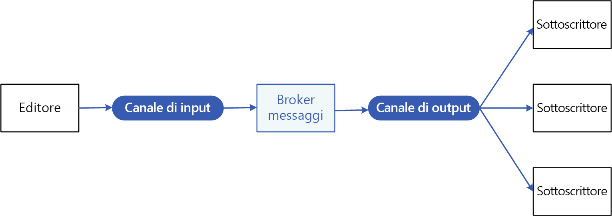
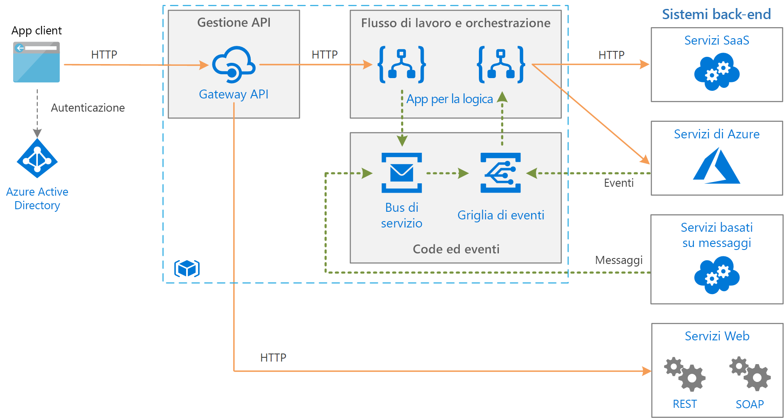

# Modello di pubblicazione/sottoscrizionePublisher-Subscriber pattern

Abilitare un'applicazione all'annuncio di eventi a più consumer interessati in modalità asincrona, senza accoppiamento di mittenti e destinatari.Enable an application to announce events to multiple interested consumers aynchronously, without coupling the senders to the receivers.

**Detto anche**: messaggistica pub/sub**Also called**: Pub/sub messaging

## Contesto e problemaContext and problem

Nelle applicazioni basate su cloud e distribuite, i componenti del sistema spesso richiedono di fornire informazioni ad altri componenti appena si verificano gli eventi.In cloud-based and distributed applications, components of the system often need to provide information to other components as events happen.

La messaggistica asincrona è un metodo efficace per separare i mittenti dai consumer ed evitare il blocco del mittente in attesa di una risposta.Asynchronous messaging is an effective way to decouple senders from consumers, and avoid blocking the sender to wait for a response. Tuttavia, l'uso di una coda di messaggi dedicata per ogni consumer non si adatta in modo efficace a molti consumer.However, using a dedicated message queue for each consumer does not effectively scale to many consumers. Inoltre, alcuni dei consumer potrebbero essere interessati solo a un subset delle informazioni.Also, some of the consumers might be interested in only a subset of the information. Come può il mittente annunciare gli eventi a tutti i consumer interessati senza conoscere le loro identità?How can the sender announce events to all interested consumers without knowing their identities?

## SoluzioneSolution

Introdurre un sottosistema di messaggistica asincrona che include quanto segue:Introduce an asynchronous messaging subsystem that includes the following:

- Un canale di input di messaggistica usato dal mittente.An input messaging channel used by the sender. Il mittente, usando un formato di messaggio conosciuto, crea dei pacchetti di eventi nei messaggi e invia questi messaggi tramite il canale di input.The sender packages events into messages, using a known message format, and sends these messages via the input channel. In questo modello, il mittente viene chiamato anche *server di pubblicazione*.The sender in this pattern is also called the *publisher*.

  > [!NOTE]
  > Un *messaggio* è un pacchetto di dati.A *message* is a packet of data. Un *evento* è un messaggio che informa altri componenti di una modifica o un'azione che ha avuto luogo.An *event* is a message that notifies other components about a change or an action that has taken place.

- Un canale di output di messaggistica per ogni consumer.One output messaging channel per consumer. I consumer sono detti *sottoscrittori*.The consumers are known as *subscribers*.

- Un meccanismo per la copia di ogni messaggio dal canale di input ai canali di output per tutti i sottoscrittori interessati al messaggio.A mechanism for copying each message from the input channel to the output channels for all subscribers interested in that message. Questa operazione viene in genere gestita da un intermediario, ad esempio un bus di eventi o broker di messaggi.This operation is typically handled by a intermediary such as a message broker or event bus.

Il diagramma seguente mostra i componenti logici di questo modello:The following diagram shows the logical components of this pattern:

 
La messaggistica pub/sub offre i seguenti vantaggi:Pub/sub messaging has the following benefits:

- Separa i sottosistemi che devono ancora comunicare.It decouples subsystems that still need to communicate. I sottosistemi possono essere gestiti in modo indipendente, mentre i messaggi possono essere gestiti correttamente anche se uno o più destinatari sono offline.Subsystems can be managed independently, and messages can be properly managed even if one or more receivers are offline.

- Aumenta la scalabilità e migliora la velocità di risposta del mittente.It increases scalability and improves responsiveness of the sender. Il mittente può inviare rapidamente un singolo messaggio al canale di input, quindi tornare alle responsabilità di elaborazione principali.The sender can quickly send a single message to the input channel, then return to its core processing responsibilities. L'infrastruttura di messaggistica è responsabile nel garantire che i messaggi vengano recapitati ai sottoscrittori interessati.The messaging infrastructure is responsible for ensuring messages are delivered to interested subscribers.

- Migliora l'affidabilità.It improves reliability. La messaggistica asincrona consente alle applicazioni di continuare a eseguire carichi di lavoro elevati in modo uniforme, nonché a gestire in modo più efficace gli errori intermittenti.Asynchronous messaging helps applications continue to run smoothly under increased loads and handle intermittent failures more effectively.

- Permette l'elaborazione pianificata o posticipata.It allows for deferred or scheduled processing. I sottoscrittori possono attendere fino a orari di meno traffico prima di prelevare i messaggi, oppure questi ultimi possono essere instradati o elaborati in base a una pianificazione specifica.Subscribers can wait to pick up messages until off-peak hours, or messages can be routed or processed according to a specific schedule.

- Rende più semplice l'integrazione tra sistemi che usano piattaforme, linguaggi di programmazione o protocolli di comunicazione diversi, nonché tra sistemi locali e applicazioni in esecuzione nel cloud.It enables simpler integration between systems using different platforms, programming languages, or communication protocols, as well as between on-premises systems and applications running in the cloud.

- Semplifica i flussi di lavoro asincroni in un'organizzazione.It facilitates asynchronous workflows across an enterprise.

- Migliora la testabilità.It improves testability. I canali possono essere monitorati e i messaggi controllati o registrati come parte di una strategia generale di test di integrazione.Channels can be monitored and messages can be inspected or logged as part of an overall integration test strategy.

- Fornisce la separazione degli interessi per le applicazioni.It provides separation of concerns for your applications. Ciascuna applicazione può concentrarsi sulle sue principali capacità, mentre l'infrastruttura di messaggistica gestisce tutte le operazioni necessarie per indirizzare i messaggi a più consumer in modo affidabile.Each application can focus on its core capabilities, while the messaging infrastructure handles everything required to reliably route messages to multiple consumers. 

## Considerazioni e problemiIssues and considerations

Prima di decidere come implementare questo modello, considerare quanto segue:Consider the following points when deciding how to implement this pattern:

- **Tecnologie esistenti.****Existing technologies.** È altamente consigliato l'uso dei prodotti e servizi di messaggistica disponibili che supportano il modello di pubblicazione/sottoscrizione, anziché compilarne uno per conto proprio.It is strongly recommended to use available messaging products and services that support a publish-subscribe model, rather than building your own. In Azure, è consigliabile usare il [bus di servizio](/azure/service-bus-messaging/) oppure la [griglia di eventi](/azure/event-grid/).In Azure, consider using [Service Bus](/azure/service-bus-messaging/) or [Event Grid](/azure/event-grid/). Altre tecnologie che possono essere usate per la messaggistica pub/sub includono Apache Kafka, RabbitMQ e Redis.Other technologies that can be used for pub/sub messaging include Redis, RabbitMQ, and Apache Kafka.

- **Gestione delle sottoscrizioni.****Subscription handling.** L'infrastruttura di messaggistica deve fornire meccanismi utili agli utenti per effettuare o annullare la sottoscrizione ai canali disponibili.The messaging infrastructure must provide mechanisms that consumers can use to subscribe to or unsubscribe from available channels.

- **Sicurezza.****Security.** La connessione a un canale di messaggi deve essere limitata da criteri di sicurezza per impedire l'intercettazione da parte di utenti o applicazioni non autorizzate.Connecting to any message channel must be restricted by security policy to prevent eavesdropping by unauthorized users or applications.

- **Subset di messaggi.****Subsets of messages.** In genere, i sottoscrittori sono interessati solo a subset dei messaggi distribuiti da un server di pubblicazione.Subscribers are usually only interested in subset of the messages distributed by a publisher. I servizi di messaggistica spesso consentono ridurre il set di messaggi ricevuti tramite limitazioni per:Messaging services often allow subscribers to narrow the set of messages received by:

  - **Argomenti.****Topics.** Ogni argomento ha un canale di output dedicato e ogni consumer può effettuare la sottoscrizione a tutti gli argomenti pertinenti.Each topic has a dedicated output channel, and each consumer can subscribe to all relevant topics.
  - **Filtri dei contenuti.****Content filtering.** I messaggi vengono ispezionati e distribuiti in base al contenuto di ogni messaggio.Messages are inspected and distributed based on the content of each message. Ogni sottoscrittore può specificare il contenuto di suo interesse.Each subscriber can specify the content it is interested in.

- **Sottoscrizioni con caratteri jolly.****Wildcard subscribers.** È possibile consentire ai sottoscrittori di effettuare la sottoscrizione a più argomenti tramite caratteri jolly.Consider allowing subscribers to subscribe to multiple topics via wildcards.

- **Comunicazioni bidirezionali.****Bi-directional communication.** I canali in un sistema di pubblicazione/sottoscrizione sono considerati come unidirezionali.The channels in a publish-subscribe system are treated as unidirectional. Se uno specifico sottoscrittore deve inviare un riconoscimento o comunicare lo stato al server di pubblicazione, è consigliabile usare il [modello di richiesta/risposta](http://www.enterpriseintegrationpatterns.com/patterns/messaging/RequestReply.html).If a specific subscriber needs to send acknowledgement or communicate status back to the publisher, consider using the [Request/Reply Pattern](http://www.enterpriseintegrationpatterns.com/patterns/messaging/RequestReply.html). Questo modello usa un canale per inviare il messaggio al sottoscrittore e un canale di risposta separato per comunicare nuovamente con il server di pubblicazione.This pattern uses one channel to send a message to the subscriber, and a separate reply channel for communicating back to the publisher.

- **Ordinamento dei messaggi.****Message ordering.** L'ordine in cui le istanze del consumer ricevono i messaggi non è garantito e non riflette necessariamente l'ordine di creazione dei messaggi.The order in which consumer instances receive messages isn't guaranteed, and doesn't necessarily reflect the order in which the messages were created. Progettare il sistema in modo da assicurarsi che l'elaborazione dei messaggi sia idempotente, in modo da eliminare qualsiasi dipendenza rispetto all'ordine di gestione dei messaggi.Design the system to ensure that message processing is idempotent to help eliminate any dependency on the order of message handling.

- **Priorità dei messaggi.****Message priority.** Alcune soluzioni potrebbero richiedere l'elaborazione dei messaggi in un ordine specifico.Some solutions may require that messages are processed in a specific order. Il [modello della coda di priorità](priority-queue.md) fornisce un meccanismo per garantire il recapito di messaggi specifici prima di altri.The [Priority Queue pattern](priority-queue.md) provides a mechanism for ensuring specific messages are delivered before others.

- **Messaggi non elaborabili.****Poison messages.** Un messaggio in formato non valido o un'attività che richiede l'accesso a risorse non disponibili può causare un errore in un'istanza del servizio.A malformed message, or a task that requires access to resources that aren't available, can cause a service instance to fail. Il sistema deve impedire la restituzione di tali messaggi alla coda.The system should prevent such messages being returned to the queue. Acquisire e archiviare i dettagli di questi messaggi in un'altra posizione, in modo da poterli analizzare se necessario.Instead, capture and store the details of these messages elsewhere so that they can be analyzed if necessary.

- **Messaggi ripetuti.****Repeated messages.** Lo stesso messaggio potrebbe essere inviato più volte.The same message might be sent more than once. Ad esempio, l'invio potrebbe non riuscire dopo la pubblicazione di un messaggio.For example, the sender might fail after posting a message. Potrebbe quindi avviarsi una nuova istanza del mittente, ripetendo il messaggio.Then a new instance of the sender might start up and repeat the message. L'infrastruttura di messaggistica deve implementare il rilevamento e la rimozione dei messaggi duplicati, nota anche come deduplicazione, in base ai loro ID per garantire che siano recapitati solo una volta.The messaging infrastructure should implement duplicate message detection and removal (also known as de-duping) based on message IDs in order to provide at-most-once delivery of messages.

- **Scadenza dei messaggi.****Message expiration.** Un messaggio potrebbe avere una durata limitata.A message might have a limited lifetime. Se non viene elaborato entro questo periodo di tempo, potrebbe non essere più rilevante e deve essere eliminato.If it isn't processed within this period, it might no longer be relevant and should be discarded. Un mittente può specificare una scadenza come parte dei dati nel messaggio.A sender can specify an experiation time as part of the data in the message. Un ricevitore può esaminare queste informazioni prima di decidere se eseguire la logica di business associata al messaggio.A receiver can examine this information before deciding whether to perform the business logic associated with the message.

- **Pianificazione dei messaggi.****Message scheduling.** Un messaggio potrebbe essere temporaneamente bloccato e non deve essere elaborato fino a una data e ora specifiche.A message might be temporarily embargoed and should not be processed until a specific date and time. Il messaggio non deve essere disponibile per un ricevitore fino a quel momento.The message should not be available to a receiver until this time.

## Quando usare questo modelloWhen to use this pattern

Usare questo modello quando:Use this pattern when:

- Un'applicazione deve trasmettere informazioni a un numero significativo di consumer.An application needs to broadcast information to a significant number of consumers.

- Un'applicazione deve comunicare con uno o più servizi o applicazioni sviluppate in modo indipendente, i quali potrebbero usare piattaforme, linguaggi di programmazione e protocolli di comunicazione diversi.An application needs to communicate with one or more independently-developed applications or services, which may use different platforms, programming languages, and communication protocols.

- Un'applicazione può inviare informazioni ai consumer senza richiedere risposte in tempo reale da parte di questi ultimi.An application can send information to consumers without requiring real-time responses from the consumers.

- I sistemi integrati sono progettati per supportare un modello di coerenza finale per i loro dati.The systems being integrated are designed to support an eventual consistency model for their data.

- Un'applicazione deve comunicare informazioni a più consumer, i quali possono avere requisiti di disponibilità o pianificazioni dei tempi di attività diverse rispetto al mittente.An application needs to communicate information to multiple consumers, which may have different availability requirements or uptime schedules than the sender.

Questo modello potrebbe non essere utile quando:This pattern might not be useful when:

- Un'applicazione ha solo pochi consumer che hanno bisogno di informazioni notevolmente diverse da parte dell'applicazione di produzione.An application has only a few consumers who need significantly different information from the producing application.

- Un'applicazione richiede un'interazione quasi in tempo reali con i consumer.An application requires near real-time interaction with consumers.

## EsempioExample

Il diagramma seguente mostra un'architettura di integrazione aziendale che usa il bus di servizio per il coordinamento dei flussi di lavoro, mentre la griglia di eventi invia notifiche ai sottosistemi relative agli eventi che si verificano.The following diagram shows an enterprise integration architecture that uses Service Bus to coordinate workflows, and Event Grid notify subsystems of events that occur. Per altre informazioni, consultare [Integrazione aziendale in Azure con code ed eventi di messaggi](../reference-architectures/enterprise-integration/queues-events.md).For more information, see [Enterprise integration on Azure using message queues and events](../reference-architectures/enterprise-integration/queues-events.md).

## Modelli correlati e informazioni aggiuntiveRelated patterns and guidance

Per l'implementazione di questo modello possono risultare utili i modelli e le informazioni aggiuntive seguenti:The following patterns and guidance might be relevant when implementing this pattern:

- [Scegliere tra i servizi di Azure che recapitano messaggi](/azure/event-grid/compare-messaging-services).[Choose between Azure services that deliver messages](/azure/event-grid/compare-messaging-services).

- Lo [stile di architettura guidato dagli eventi](../guide/architecture-styles/event-driven.md) è uno stile di architettura che usa la messaggistica pub/sub.The [Event-driven architecture style](../guide/architecture-styles/event-driven.md) is an architecture style that uses pub/sub messaging.

- [Introduzione alla messaggistica asincrona](https://msdn.microsoft.com/library/dn589781.aspx).[Asynchronous Messaging Primer](https://msdn.microsoft.com/library/dn589781.aspx). Le code di messaggi sono un meccanismo di comunicazione asincrona.Message queues are an asynchronous communications mechanism. Se un servizio consumer deve inviare una risposta a un'applicazione, può essere necessario implementare una forma di messaggistica di risposta.If a consumer service needs to send a reply to an application, it might be necessary to implement some form of response messaging. L'articolo Introduzione alla messaggistica asincrona contiene informazioni sull'implementazione della messaggistica di richiesta/risposta tramite code di messaggi.The Asynchronous Messaging Primer provides information on how to implement request/reply messaging using message queues.

- [Modello osservatore](https://en.wikipedia.org/wiki/Observer_pattern).[Observer Pattern](https://en.wikipedia.org/wiki/Observer_pattern). Il modello di pubblicazione/sottoscrizione si basa sul modello osservatore, separando i soggetti dagli osservatori tramite messaggistica asincrona.The Publish-Subscribe pattern builds on the Observer pattern by decoupling subjects from observers via asynchronous messaging.

- [Modello del broker di messaggi](https://en.wikipedia.org/wiki/Message_broker).[Message Broker Pattern](https://en.wikipedia.org/wiki/Message_broker). Molti sottosistemi di messaggistica che supportano il modello di pubblicazione/sottoscrizione sono implementati tramite un broker messaggi.Many messaging subsystems that support a publish-subscribe modek are implemented via a message broker.
