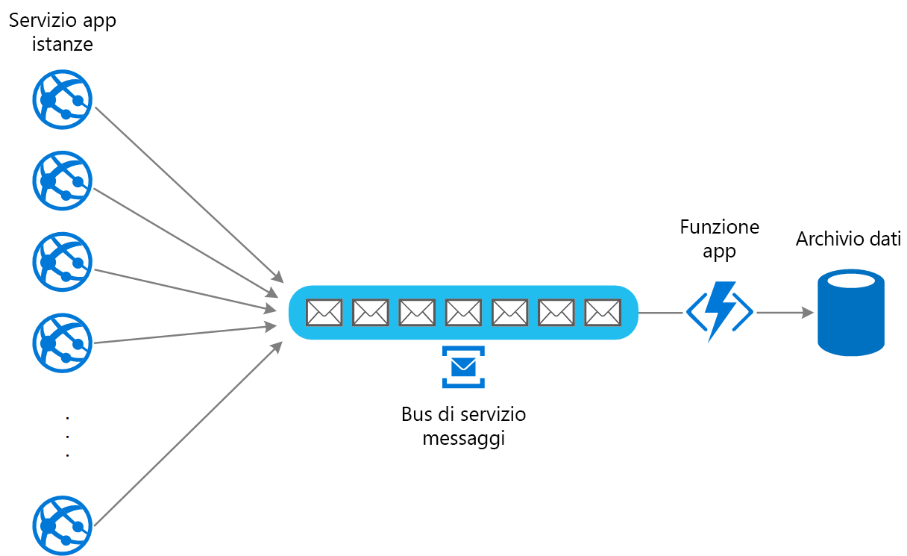

# Schema di livellamento del carico basato sulle code

Usare una coda che funge da buffer tra un'attività e un servizio richiamato per alleggerire i sovraccarichi a intermittenza che possono causare la mancata esecuzione del servizio o il timeout dell'attività. Ciò consente di ridurre al minimo l'impatto dei picchi della domanda di disponibilità e i tempi di risposta sia per l'attività che per il servizio.

## Contesto e problema

Molte soluzioni del cloud prevedono l'esecuzione di attività che richiamano i servizi. In questo ambiente, se un servizio viene sottoposto a sovraccarichi a intermittenza, è possibile che si verifichino problemi di prestazioni o affidabilità.

Un servizio potrebbe essere parte della stessa soluzione come le attività che lo usano oppure potrebbe essere un servizio di terze parti che offre accesso alle risorse usate di frequente, ad esempio una cache o un servizio di archiviazione. Se lo stesso servizio viene usato da diverse attività in esecuzione contemporaneamente, può essere difficile prevedere in qualsiasi momento il volume di richieste al servizio.

Un servizio potrebbe avere picchi nella domanda che ne causano il sovraccarico e potrebbe non essere in grado di rispondere alle richieste in modo tempestivo. La saturazione di un servizio con un numero elevato di richieste simultanee può anche comportare la mancata esecuzione del servizio se non è in grado di gestire il conflitto causato da queste richieste.

## Soluzione

Effettuare il refactoring della soluzione e introdurre una coda tra l'attività e il servizio. L'attività e il servizio vengono eseguite in modo asincrono. L'attività pubblica un messaggio contenente i dati richiesti dal servizio in una coda. La coda funge da buffer, memorizzando il messaggio finché non viene recuperato dal servizio. Il servizio recupera i messaggi dalla coda e li elabora. Le richieste provenienti da certo un numero di attività, che possono essere generate con una frequenza altamente variabile, possono essere passate al servizio attraverso la stessa coda di messaggi. Questa figura illustra l'uso di una coda per livellare il carico in un servizio.

La coda separa le attività del servizio, così il servizio può gestire i messaggi al proprio ritmo indipendentemente dal volume di richieste delle attività simultanee. Per di più non si verifica alcun ritardo per un'attività se il servizio non è disponibile quando pubblica un messaggio nella coda.

Questo modello offre i vantaggi seguenti:

- Consente di ottimizzare la disponibilità in quanto i ritardi causati nei servizi non avranno un impatto diretto e immediato nell'applicazione, la quale può continuare a pubblicare i messaggi nella coda anche quando il servizio non è disponibile o non elabora al momento i messaggi.
- Consente di ottimizzare la scalabilità perché sia il numero di code che il numero di servizi può essere variato per soddisfare la richiesta.
- Consente di controllare i costi in quanto basta che il numero di istanze del servizio distribuite sia sufficiente per soddisfare un carico medio anziché il carico di picco.

    >  Alcuni servizi implementano la limitazione delle richieste quando la richiesta raggiunge una soglia oltre la quale il sistema potrebbe non riuscire. La limitazione delle richieste può ridurre le funzionalità disponibili. Con questi servizi è possibile implementare il livellamento del carico per assicurarsi che la soglia non venga raggiunta.

## Considerazioni e problemi

Prima di decidere come implementare questo modello, considerare quanto segue:

- È necessario implementare la logica dell'applicazione che controlla la frequenza con cui i servizi gestiscono i messaggi per evitare di sovraccaricare la risorsa di destinazione. Evitare di passare i picchi di domanda alla fase successiva del sistema. Testare il sistema sotto carico per assicurarsi che offra il livellamento necessario e modificare il numero di code e il numero di istanze del servizio che gestiscono i messaggi per ottenere questo risultato.
- Le code dei messaggi sono un meccanismo di comunicazione unidirezionale. Se un'attività attende una risposta da un servizio, potrebbe essere necessario implementare un meccanismo che il servizio può usare per inviare una risposta. Per altre informazioni, vedere [Introduzione alla messaggistica asincrona](https://msdn.microsoft.com/library/dn589781.aspx).
- Prestare attenzione se si applica la scalabilità automatica per i servizi che sono in ascolto di richieste nella coda. Questo potrebbe comportare un aumento del conflitto per tutte le risorse condivise dai servizi e riduce l'efficacia dell'uso della coda per livellare il carico.

## Quando usare questo modello

Questo modello è utile per qualsiasi applicazione che usi i servizi soggetti a sovraccarico.

Questo modello non è utile se l'applicazione attende una risposta dal servizio con una latenza minima.

## Esempio

Un'app Web scrive dati in un archivio dati esterno. Se viene eseguito contemporaneamente un numero elevato di istanze dell'app Web, l'archivio dati potrebbe non riuscire a rispondere alle richieste in modo sufficientemente rapido, causando il timeout, la limitazione o un altro tipo di esito negativo delle richieste. Il diagramma seguente illustra un archivio dati sovraccaricato da un numero elevato di richieste simultanee provenienti dalle istanze di un'applicazione.

Per risolvere il problema, è possibile usare una coda per livellare il carico tra le istanze dell'applicazione e l'archivio dati. Un'app per le funzioni di Azure legge i messaggi dalla coda e invia le richieste di lettura/scrittura all'archivio dati. La logica dell'applicazione nell'app per le funzioni può controllare la frequenza con cui le richieste vengono passate all'archivio dati per impedire il sovraccarico dell'archivio. In caso contrario, l'app per le funzioni si limiterà a reintrodurre lo stesso problema nel back-end.

## Modelli correlati e informazioni aggiuntive

Per l'implementazione di questo modello possono risultare utili i modelli e le informazioni aggiuntive seguenti:

- [Introduzione alla messaggistica asincrona](https://msdn.microsoft.com/library/dn589781.aspx). Le code di messaggi sono intrinsecamente asincrone. Potrebbe essere necessario riprogettare la logica dell'applicazione in un'attività se è stata adattata dalla diretta comunicazione con un servizio per l'uso di una coda di messaggi. Analogamente, potrebbe essere necessario effettuare il refactoring di un servizio affinché accetti le richieste da una coda di messaggi. In alternativa, è possibile implementare un servizio proxy, come descritto nell'esempio.

- [Modello di consumer concorrenti](./competing-consumers.md). È possibile eseguire più istanze di un servizio, ognuna delle quali agisce come un consumer di messaggi dalla coda di livellamento del carico. È possibile usare questo approccio per regolare la frequenza con cui i messaggi vengono ricevuti e passati a un servizio.

- [Modello di limitazione](./throttling.md). Un modo semplice per implementare la limitazione delle richieste con un servizio è usare il livellamento del carico basato su coda e indirizzare tutte le richieste a un servizio tramite una coda di messaggi. Il servizio può elaborare le richieste con una frequenza che garantisce che le risorse necessarie al servizio non si esauriscano e per ridurre il conflitto che potrebbe verificarsi.

- [Scegliere tra i servizi di messaggistica di Azure](/azure/event-grid/compare-messaging-services). Informazioni sulla scelta di un meccanismo di messaggistica e accodamento nelle applicazioni di Azure.

- [Migliorare la scalabilità in un'applicazione Web di Azure](../reference-architectures/app-service-web-app/scalable-web-app.md). Questa architettura di riferimento include il livellamento del carico basato sulle code come parte dell'architettura.
