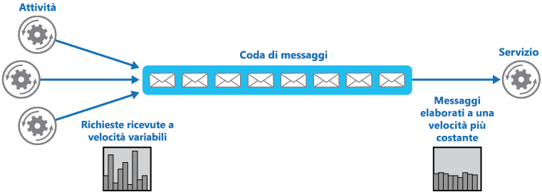
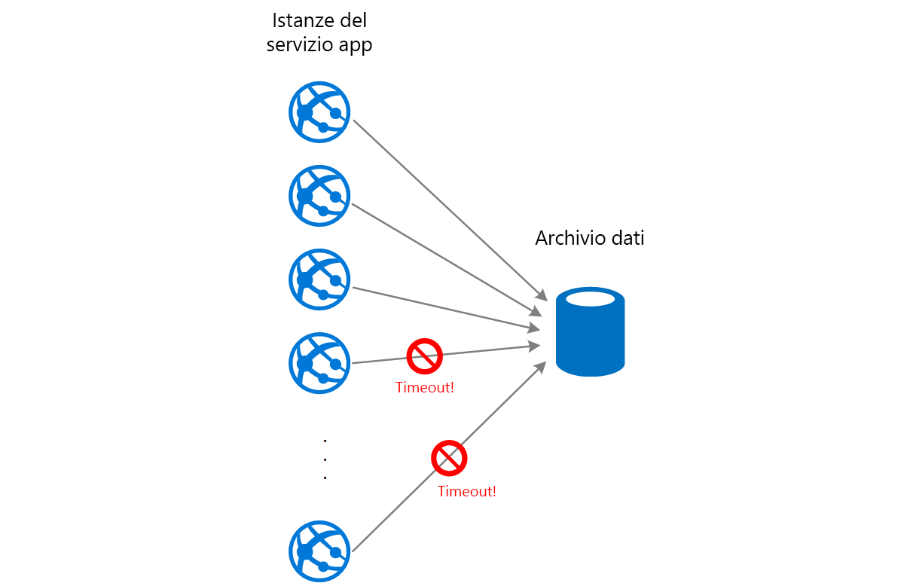

# Schema di livellamento del carico basato sulle codeQueue-Based Load Leveling pattern

[!INCLUDE [header](../_includes/header.md)]

Usare una coda che funge da buffer tra un'attività e un servizio richiamato per alleggerire i sovraccarichi a intermittenza che possono causare la mancata esecuzione del servizio o il timeout dell'attività. Ciò consente di ridurre al minimo l'impatto dei picchi della domanda di disponibilità e i tempi di risposta sia per l'attività che per il servizio.Use a queue that acts as a buffer between a task and a service it invokes in order to smooth intermittent heavy loads that can cause the service to fail or the task to time out. This can help to minimize the impact of peaks in demand on availability and responsiveness for both the task and the service.

## Contesto e problemaContext and problem

Molte soluzioni del cloud prevedono l'esecuzione di attività che richiamano i servizi.Many solutions in the cloud involve running tasks that invoke services. In questo ambiente, se un servizio viene sottoposto a sovraccarichi a intermittenza, è possibile che si verifichino problemi di prestazioni o affidabilità.In this environment, if a service is subjected to intermittent heavy loads, it can cause performance or reliability issues.

Un servizio potrebbe essere parte della stessa soluzione come le attività che lo usano oppure potrebbe essere un servizio di terze parti che offre accesso alle risorse usate di frequente, ad esempio una cache o un servizio di archiviazione.A service could be part of the same solution as the tasks that use it, or it could be a third-party service providing access to frequently used resources such as a cache or a storage service. Se lo stesso servizio viene usato da diverse attività in esecuzione contemporaneamente, può essere difficile prevedere in qualsiasi momento il volume di richieste al servizio.If the same service is used by a number of tasks running concurrently, it can be difficult to predict the volume of requests to the service at any time.

Un servizio potrebbe avere picchi nella domanda che ne causano il sovraccarico e potrebbe non essere in grado di rispondere alle richieste in modo tempestivo.A service might experience peaks in demand that cause it to overload and be unable to respond to requests in a timely manner. La saturazione di un servizio con un numero elevato di richieste simultanee può anche comportare la mancata esecuzione del servizio se non è in grado di gestire il conflitto causato da queste richieste.Flooding a service with a large number of concurrent requests can also result in the service failing if it's unable to handle the contention these requests cause.

## SoluzioneSolution

Effettuare il refactoring della soluzione e introdurre una coda tra l'attività e il servizio.Refactor the solution and introduce a queue between the task and the service. L'attività e il servizio vengono eseguite in modo asincrono.The task and the service run asynchronously. L'attività pubblica un messaggio contenente i dati richiesti dal servizio in una coda.The task posts a message containing the data required by the service to a queue. La coda funge da buffer, memorizzando il messaggio finché non viene recuperato dal servizio.The queue acts as a buffer, storing the message until it's retrieved by the service. Il servizio recupera i messaggi dalla coda e li elabora.The service retrieves the messages from the queue and processes them. Le richieste provenienti da certo un numero di attività, che possono essere generate con una frequenza altamente variabile, possono essere passate al servizio attraverso la stessa coda di messaggi.Requests from a number of tasks, which can be generated at a highly variable rate, can be passed to the service through the same message queue. Questa figura illustra l'uso di una coda per livellare il carico in un servizio.This figure shows using a queue to level the load on a service.

La coda separa le attività del servizio, così il servizio può gestire i messaggi al proprio ritmo indipendentemente dal volume di richieste delle attività simultanee.The queue decouples the tasks from the service, and the service can handle the messages at its own pace regardless of the volume of requests from concurrent tasks. Per di più non si verifica alcun ritardo per un'attività se il servizio non è disponibile quando pubblica un messaggio nella coda.Additionally, there's no delay to a task if the service isn't available at the time it posts a message to the queue.

Questo modello offre i vantaggi seguenti:This pattern provides the following benefits:

- Consente di ottimizzare la disponibilità in quanto i ritardi causati nei servizi non avranno un impatto diretto e immediato nell'applicazione, la quale può continuare a pubblicare i messaggi nella coda anche quando il servizio non è disponibile o non elabora al momento i messaggi.It can help to maximize availability because delays arising in services won't have an immediate and direct impact on the application, which can continue to post messages to the queue even when the service isn't available or isn't currently processing messages.
- Consente di ottimizzare la scalabilità perché sia il numero di code che il numero di servizi può essere variato per soddisfare la richiesta.It can help to maximize scalability because both the number of queues and the number of services can be varied to meet demand.
- Consente di controllare i costi in quanto basta che il numero di istanze del servizio distribuite sia sufficiente per soddisfare un carico medio anziché il carico di picco.It can help to control costs because the number of service instances deployed only have to be adequate to meet average load rather than the peak load.

    >  Alcuni servizi implementano la limitazione delle richieste quando la richiesta raggiunge una soglia oltre la quale il sistema potrebbe non riuscire.Some services implement throttling when demand reaches a threshold beyond which the system could fail. La limitazione delle richieste può ridurre le funzionalità disponibili.Throttling can reduce the functionality available. Con questi servizi è possibile implementare il livellamento del carico per assicurarsi che la soglia non venga raggiunta.You can implement load leveling with these services to ensure that this threshold isn't reached.

## Considerazioni e problemiIssues and considerations

Prima di decidere come implementare questo modello, considerare quanto segue:Consider the following points when deciding how to implement this pattern:

- È necessario implementare la logica dell'applicazione che controlla la frequenza con cui i servizi gestiscono i messaggi per evitare di sovraccaricare la risorsa di destinazione.It's necessary to implement application logic that controls the rate at which services handle messages to avoid overwhelming the target resource. Evitare di passare i picchi di domanda alla fase successiva del sistema.Avoid passing spikes in demand to the next stage of the system. Testare il sistema sotto carico per assicurarsi che offra il livellamento necessario e modificare il numero di code e il numero di istanze del servizio che gestiscono i messaggi per ottenere questo risultato.Test the system under load to ensure that it provides the required leveling, and adjust the number of queues and the number of service instances that handle messages to achieve this.
- Le code dei messaggi sono un meccanismo di comunicazione unidirezionale.Message queues are a one-way communication mechanism. Se un'attività attende una risposta da un servizio, potrebbe essere necessario implementare un meccanismo che il servizio può usare per inviare una risposta.If a task expects a reply from a service, it might be necessary to implement a mechanism that the service can use to send a response. Per altre informazioni, vedere [Introduzione alla messaggistica asincrona](https://msdn.microsoft.com/library/dn589781.aspx).For more information, see the [Asynchronous Messaging Primer](https://msdn.microsoft.com/library/dn589781.aspx).
- Prestare attenzione se si applica la scalabilità automatica per i servizi che sono in ascolto di richieste nella coda.Be careful if you apply autoscaling to services that are listening for requests on the queue. Questo potrebbe comportare un aumento del conflitto per tutte le risorse condivise dai servizi e riduce l'efficacia dell'uso della coda per livellare il carico.This can result in increased contention for any resources that these services share and diminish the effectiveness of using the queue to level the load.

## Quando usare questo modelloWhen to use this pattern

Questo modello è utile per qualsiasi applicazione che usi i servizi soggetti a sovraccarico.This pattern is useful to any application that uses services that are subject to overloading.

Questo modello non è utile se l'applicazione attende una risposta dal servizio con una latenza minima.This pattern isn't useful if the application expects a response from the service with minimal latency.

## EsempioExample

Un ruolo Web di Microsoft Azure archivia i dati tramite un servizio di archiviazione separata.A Microsoft Azure web role stores data using a separate storage service. Se un numero elevato di istanze del ruolo Web vien eseguito contemporaneamente, è possibile che il servizio di archiviazione non sia in grado di rispondere alle richieste in modo sufficientemente rapido per impedire il timeout o l'errore delle richieste.If a large number of instances of the web role run concurrently, it's possible that the storage service will be unable to respond to requests quickly enough to prevent these requests from timing out or failing. Questa figura illustra un servizio sovraccaricato da un numero elevato di richieste simultanee provenienti da istanze di un ruolo Web.This figure highlights a service being overwhelmed by a large number of concurrent requests from instances of a web role.

Per risolvere questo problema, è possibile usare una coda per livellare il carico tra le istanze del ruolo Web e il servizio di archiviazione.To resolve this, you can use a queue to level the load between the web role instances and the storage service. Tuttavia, il servizio di archiviazione è progettato per accettare le richieste sincrone e non può essere modificato facilmente per poter leggere i messaggi e gestire la velocità effettiva.However, the storage service is designed to accept synchronous requests and can't be easily modified to read messages and manage throughput. È possibile introdurre un ruolo di lavoro che agisca come un servizio proxy che riceve le richieste dalla coda e le inoltra al servizio di archiviazione.You can introduce a worker role to act as a proxy service that receives requests from the queue and forwards them to the storage service. La logica dell'applicazione nel ruolo di lavoro può controllare la frequenza con cui passa le richieste al servizio di archiviazione per impedire che questo venga sovraccaricato.The application logic in the worker role can control the rate at which it passes requests to the storage service to prevent the storage service from being overwhelmed. Questa figura illustra l'uso di una coda e di un ruolo di lavoro per livellare il carico tra le istanze del ruolo Web e il servizio.This figure illustrates using a queue and a worker role to level the load between instances of the web role and the service.

## Modelli correlati e informazioni aggiuntiveRelated patterns and guidance

Per l'implementazione di questo modello possono risultare utili i modelli e le informazioni aggiuntive seguenti:The following patterns and guidance might also be relevant when implementing this pattern:

- [Introduzione alla messaggistica asincrona](https://msdn.microsoft.com/library/dn589781.aspx).[Asynchronous Messaging Primer](https://msdn.microsoft.com/library/dn589781.aspx). Le code di messaggi sono intrinsecamente asincrone.Message queues are inherently asynchronous. Potrebbe essere necessario riprogettare la logica dell'applicazione in un'attività se è stata adattata dalla diretta comunicazione con un servizio per l'uso di una coda di messaggi.It might be necessary to redesign the application logic in a task if it's adapted from communicating directly with a service to using a message queue. Analogamente, potrebbe essere necessario effettuare il refactoring di un servizio affinché accetti le richieste da una coda di messaggi.Similarly, it might be necessary to refactor a service to accept requests from a message queue. In alternativa, è possibile implementare un servizio proxy, come descritto nell'esempio.Alternatively, it might be possible to implement a proxy service, as described in the example.
- [Modello di consumer concorrenti](competing-consumers.md).[Competing Consumers pattern](competing-consumers.md). È possibile eseguire più istanze di un servizio, ognuna delle quali agisce come un consumer di messaggi dalla coda di livellamento del carico.It might be possible to run multiple instances of a service, each acting as a message consumer from the load-leveling queue. È possibile usare questo approccio per regolare la frequenza con cui i messaggi vengono ricevuti e passati a un servizio.You can use this approach to adjust the rate at which messages are received and passed to a service.
- [Modello di limitazione](throttling.md).[Throttling pattern](throttling.md). Un modo semplice per implementare la limitazione delle richieste con un servizio è usare il livellamento del carico basato su coda e indirizzare tutte le richieste a un servizio tramite una coda di messaggi.A simple way to implement throttling with a service is to use queue-based load leveling and route all requests to a service through a message queue. Il servizio può elaborare le richieste con una frequenza che garantisce che le risorse necessarie al servizio non si esauriscano e per ridurre il conflitto che potrebbe verificarsi.The service can process requests at a rate that ensures that resources required by the service aren't exhausted, and to reduce the amount of contention that could occur.
- [Concetti del servizio di accodamento](https://msdn.microsoft.com/library/azure/dd179353.aspx).[Queue Service Concepts](https://msdn.microsoft.com/library/azure/dd179353.aspx). Informazioni sulla scelta di un meccanismo di messaggistica e accodamento nelle applicazioni di Azure.Information about choosing a messaging and queuing mechanism in Azure applications.
