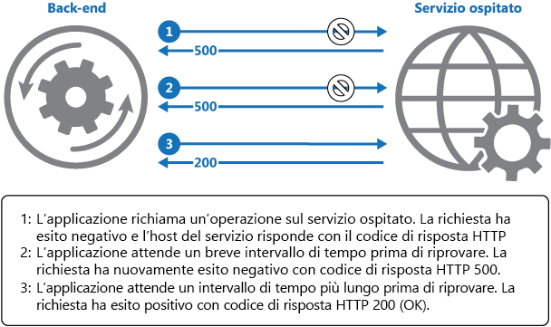

# <a name="retry-pattern"></a><span data-ttu-id="d58c9-104">Modello di ripetizione dei tentativi</span><span class="sxs-lookup"><span data-stu-id="d58c9-104">Retry pattern</span></span>

[!INCLUDE [header](../_includes/header.md)]

<span data-ttu-id="d58c9-105">È possibile abilitare un'applicazione per gestire gli errori temporanei durante il tentativo di connessione a un servizio o a una risorsa di rete ritentando in modo trasparente un'operazione non riuscita.</span><span class="sxs-lookup"><span data-stu-id="d58c9-105">Enable an application to handle transient failures when it tries to connect to a service or network resource, by transparently retrying a failed operation.</span></span> <span data-ttu-id="d58c9-106">Ciò può migliorare la stabilità dell'applicazione.</span><span class="sxs-lookup"><span data-stu-id="d58c9-106">This can improve the stability of the application.</span></span>

## <a name="context-and-problem"></a><span data-ttu-id="d58c9-107">Contesto e problema</span><span class="sxs-lookup"><span data-stu-id="d58c9-107">Context and problem</span></span>

<span data-ttu-id="d58c9-108">Un'applicazione che comunica con gli elementi in esecuzione nel cloud deve essere in grado di rilevare gli errori temporanei che possono verificarsi in questo ambiente.</span><span class="sxs-lookup"><span data-stu-id="d58c9-108">An application that communicates with elements running in the cloud has to be sensitive to the transient faults that can occur in this environment.</span></span> <span data-ttu-id="d58c9-109">Tra gli errori sono inclusi la perdita temporanea della connettività di rete per componenti e servizi, l'indisponibilità temporanea di un servizio o i timeout generati perché un servizio è occupato.</span><span class="sxs-lookup"><span data-stu-id="d58c9-109">Faults include the momentary loss of network connectivity to components and services, the temporary unavailability of a service, or timeouts that occur when a service is busy.</span></span>

<span data-ttu-id="d58c9-110">Questi errori si risolvono di solito automaticamente e, se l'azione che ha generato l'errore viene ripetuta dopo un intervallo di tempo appropriato, è probabile che abbia esito positivo.</span><span class="sxs-lookup"><span data-stu-id="d58c9-110">These faults are typically self-correcting, and if the action that triggered a fault is repeated after a suitable delay it's likely to be successful.</span></span> <span data-ttu-id="d58c9-111">Ad esempio, un servizio di database potrebbe implementare una strategia di limitazione durante l'elaborazione di un numero elevato di richieste simultanee, in modo da rifiutare temporaneamente eventuali ulteriori richieste fino alla riduzione del carico di lavoro.</span><span class="sxs-lookup"><span data-stu-id="d58c9-111">For example, a database service that's processing a large number of concurrent requests can implement a throttling strategy that temporarily rejects any further requests until its workload has eased.</span></span> <span data-ttu-id="d58c9-112">Un'applicazione che tenta di accedere al database in questa situazione potrebbe non riuscire a connettersi, ma un tentativo successivo potrebbe invece avere esito positivo.</span><span class="sxs-lookup"><span data-stu-id="d58c9-112">An application trying to access the database might fail to connect, but if it tries again after a delay it might succeed.</span></span>

## <a name="solution"></a><span data-ttu-id="d58c9-113">Soluzione</span><span class="sxs-lookup"><span data-stu-id="d58c9-113">Solution</span></span>

<span data-ttu-id="d58c9-114">Nel cloud, gli errori temporanei sono abbastanza comuni e un'applicazione deve essere progettata per gestirli in modo elegante e trasparente.</span><span class="sxs-lookup"><span data-stu-id="d58c9-114">In the cloud, transient faults aren't uncommon and an application should be designed to handle them elegantly and transparently.</span></span> <span data-ttu-id="d58c9-115">Si riducono così i possibili effetti degli errori sulle attività aziendali eseguite dall'applicazione.</span><span class="sxs-lookup"><span data-stu-id="d58c9-115">This minimizes the effects faults can have on the business tasks the application is performing.</span></span>

<span data-ttu-id="d58c9-116">Se un'applicazione rileva un errore durante il tentativo di inviare una richiesta a un servizio remoto, può adottare le strategie seguenti per gestire l'errore:</span><span class="sxs-lookup"><span data-stu-id="d58c9-116">If an application detects a failure when it tries to send a request to a remote service, it can handle the failure using the following strategies:</span></span>

- <span data-ttu-id="d58c9-117">**Annullare**.</span><span class="sxs-lookup"><span data-stu-id="d58c9-117">**Cancel**.</span></span> <span data-ttu-id="d58c9-118">Se l'errore risulta essere non temporaneo o indica che è improbabile che l'operazione venga eseguita correttamente se ripetuta, l'applicazione deve annullare l'operazione e segnalare un'eccezione.</span><span class="sxs-lookup"><span data-stu-id="d58c9-118">If the fault indicates that the failure isn't transient or is unlikely to be successful if repeated, the application should cancel the operation and report an exception.</span></span> <span data-ttu-id="d58c9-119">Ad esempio, un errore di autenticazione causato dall'immissione di credenziali non valide è improbabile che si risolva con ulteriori tentativi.</span><span class="sxs-lookup"><span data-stu-id="d58c9-119">For example, an authentication failure caused by providing invalid credentials is not likely to succeed no matter how many times it's attempted.</span></span>

- <span data-ttu-id="d58c9-120">**Riprovare**.</span><span class="sxs-lookup"><span data-stu-id="d58c9-120">**Retry**.</span></span> <span data-ttu-id="d58c9-121">Se l'errore specifico segnalato è insolito o raro, potrebbe essere stato causato da circostanze non comuni, ad esempio un pacchetto di rete danneggiato durante la trasmissione.</span><span class="sxs-lookup"><span data-stu-id="d58c9-121">If the specific fault reported is unusual or rare, it might have been caused by unusual circumstances such as a network packet becoming corrupted while it was being transmitted.</span></span> <span data-ttu-id="d58c9-122">In questo caso, l'applicazione può ritentare immediatamente la richiesta in errore, perché è improbabile che si ripeta lo stesso errore ed è invece probabile che la richiesta venga completata.</span><span class="sxs-lookup"><span data-stu-id="d58c9-122">In this case, the application could retry the failing request again immediately because the same failure is unlikely to be repeated and the request will probably be successful.</span></span>

- <span data-ttu-id="d58c9-123">**Riprovare dopo un certo intervallo di tempo**.</span><span class="sxs-lookup"><span data-stu-id="d58c9-123">**Retry after delay**.</span></span> <span data-ttu-id="d58c9-124">Se l'errore è causato da uno degli errori di più comuni di connettività o di servizio occupato, potrebbe essere necessario aspettare un breve periodo di tempo per fare in modo che i problemi di connettività vengano risolti o che venga completato il backlog di lavoro.</span><span class="sxs-lookup"><span data-stu-id="d58c9-124">If the fault is caused by one of the more commonplace connectivity or busy failures, the network or service might need a short period while the connectivity issues are corrected or the backlog of work is cleared.</span></span> <span data-ttu-id="d58c9-125">In questo caso, l'applicazione deve attendere per un periodo di tempo appropriato prima di ritentare la richiesta.</span><span class="sxs-lookup"><span data-stu-id="d58c9-125">The application should wait for a suitable time before retrying the request.</span></span>

<span data-ttu-id="d58c9-126">Per gli errori temporanei più comuni, l'intervallo tra i tentativi deve essere scelto in modo da distribuire le richieste da più istanze dell'applicazione nel modo più uniforme possibile.</span><span class="sxs-lookup"><span data-stu-id="d58c9-126">For the more common transient failures, the period between retries should be chosen to spread requests from multiple instances of the application as evenly as possible.</span></span> <span data-ttu-id="d58c9-127">Si riduce così la possibilità che un servizio occupato continui a essere sovraccaricato.</span><span class="sxs-lookup"><span data-stu-id="d58c9-127">This reduces the chance of a busy service continuing to be overloaded.</span></span> <span data-ttu-id="d58c9-128">Se molte istanze di un'applicazione inondano continuamente un servizio di richieste di nuovi tentativi, al servizio servirà più tempo per il ripristino.</span><span class="sxs-lookup"><span data-stu-id="d58c9-128">If many instances of an application are continually overwhelming a service with retry requests, it'll take the service longer to recover.</span></span>

<span data-ttu-id="d58c9-129">Se la richiesta ha ancora esito negativo, l'applicazione può attendere ed eseguire un altro tentativo.</span><span class="sxs-lookup"><span data-stu-id="d58c9-129">If the request still fails, the application can wait and make another attempt.</span></span> <span data-ttu-id="d58c9-130">Se necessario, questo processo può essere ripetuto con ritardi crescenti tra i tentativi, fino al raggiungimento di un numero massimo di tentativi di riesecuzione delle richieste.</span><span class="sxs-lookup"><span data-stu-id="d58c9-130">If necessary, this process can be repeated with increasing delays between retry attempts, until some maximum number of requests have been attempted.</span></span> <span data-ttu-id="d58c9-131">Il ritardo può essere aumentato in modo incrementale o esponenziale, a seconda del tipo di errore e delle probabilità che venga risolto durante questo periodo.</span><span class="sxs-lookup"><span data-stu-id="d58c9-131">The delay can be increased incrementally or exponentially, depending on the type of failure and the probability that it'll be corrected during this time.</span></span>

<span data-ttu-id="d58c9-132">Il diagramma seguente illustra come richiamare un'operazione in un servizio ospitato usando questo modello.</span><span class="sxs-lookup"><span data-stu-id="d58c9-132">The following diagram illustrates invoking an operation in a hosted service using this pattern.</span></span> <span data-ttu-id="d58c9-133">Se la richiesta ha esito negativo dopo un numero predefinito di tentativi, l'applicazione deve trattare l'errore come eccezione e gestirla di conseguenza.</span><span class="sxs-lookup"><span data-stu-id="d58c9-133">If the request is unsuccessful after a predefined number of attempts, the application should treat the fault as an exception and handle it accordingly.</span></span>



<span data-ttu-id="d58c9-135">L'applicazione deve eseguire il wrapping di tutti i tentativi di accesso a un servizio remoto all'interno di codice per implementare criteri di ripetizione dei tentativi corrispondenti a una delle strategie sopra elencate.</span><span class="sxs-lookup"><span data-stu-id="d58c9-135">The application should wrap all attempts to access a remote service in code that implements a retry policy matching one of the strategies listed above.</span></span> <span data-ttu-id="d58c9-136">Le richieste inviate a servizi diversi possono essere soggette a criteri diversi.</span><span class="sxs-lookup"><span data-stu-id="d58c9-136">Requests sent to different services can be subject to different policies.</span></span> <span data-ttu-id="d58c9-137">Alcuni fornitori offrono librerie che implementano criteri di ripetizione dei tentativi, con i quali l'applicazione può specificare il numero massimo di tentativi, l'intervallo tra i tentativi e altri parametri.</span><span class="sxs-lookup"><span data-stu-id="d58c9-137">Some vendors provide libraries that implement retry policies, where the application can specify the maximum number of retries, the time between retry attempts, and other parameters.</span></span>

<span data-ttu-id="d58c9-138">Un'applicazione deve registrare i dettagli degli errori e delle operazioni con esito negativo.</span><span class="sxs-lookup"><span data-stu-id="d58c9-138">An application should log the details of faults and failing operations.</span></span> <span data-ttu-id="d58c9-139">Queste informazioni sono utili per gli operatori.</span><span class="sxs-lookup"><span data-stu-id="d58c9-139">This information is useful to operators.</span></span> <span data-ttu-id="d58c9-140">Se un servizio è frequentemente non disponibile oppure occupato, spesso la causa è l'esaurimento delle risorse.</span><span class="sxs-lookup"><span data-stu-id="d58c9-140">If a service is frequently unavailable or busy, it's often because the service has exhausted its resources.</span></span> <span data-ttu-id="d58c9-141">È possibile ridurre la frequenza degli errori ampliando il servizio.</span><span class="sxs-lookup"><span data-stu-id="d58c9-141">You can reduce the frequency of these faults by scaling out the service.</span></span> <span data-ttu-id="d58c9-142">Ad esempio, se un servizio di database risulta continuamente sovraccarico, potrebbe essere utile partizionare il database e distribuire il carico su più server.</span><span class="sxs-lookup"><span data-stu-id="d58c9-142">For example, if a database service is continually overloaded, it might be beneficial to partition the database and spread the load across multiple servers.</span></span>

> <span data-ttu-id="d58c9-143">[Microsoft Entity Framework](/ef) offre strumenti per la ripetizione dei tentativi di esecuzione delle operazioni su database.</span><span class="sxs-lookup"><span data-stu-id="d58c9-143">[Microsoft Entity Framework](/ef) provides facilities for retrying database operations.</span></span> <span data-ttu-id="d58c9-144">La maggior parte dei servizi di Azure e degli SDK client include inoltre un meccanismo di ripetizione dei tentativi.</span><span class="sxs-lookup"><span data-stu-id="d58c9-144">Also, most Azure services and client SDKs include a retry mechanism.</span></span> <span data-ttu-id="d58c9-145">Per altre informazioni, vedere [Retry guidance for specific services](/azure/architecture/best-practices/retry-service-specific) (Linee guida per la ripetizione dei tentativi per servizi specifici).</span><span class="sxs-lookup"><span data-stu-id="d58c9-145">For more information, see [Retry guidance for specific services](/azure/architecture/best-practices/retry-service-specific).</span></span>

## <a name="issues-and-considerations"></a><span data-ttu-id="d58c9-146">Considerazioni e problemi</span><span class="sxs-lookup"><span data-stu-id="d58c9-146">Issues and considerations</span></span>

<span data-ttu-id="d58c9-147">Prima di decidere come implementare questo modello, è opportuno considerare quanto segue.</span><span class="sxs-lookup"><span data-stu-id="d58c9-147">You should consider the following points when deciding how to implement this pattern.</span></span>

<span data-ttu-id="d58c9-148">I criteri di ripetizione dei tentativi devono essere adattati ai requisiti aziendali dell'applicazione e alla natura dell'errore.</span><span class="sxs-lookup"><span data-stu-id="d58c9-148">The retry policy should be tuned to match the business requirements of the application and the nature of the failure.</span></span> <span data-ttu-id="d58c9-149">Per alcune operazioni non critiche, è preferibile fallire e rispondere immediatamente agli errori piuttosto che ripetere vari tentativi con effetti sulla velocità effettiva dell'applicazione.</span><span class="sxs-lookup"><span data-stu-id="d58c9-149">For some noncritical operations, it's better to fail fast rather than retry several times and impact the throughput of the application.</span></span> <span data-ttu-id="d58c9-150">Per un'applicazione Web interattiva che accede a un servizio remoto, ad esempio, è preferibile interrompere l'esecuzione dopo un numero limitato di tentativi e con un breve ritardo tra i tentativi, quindi visualizzare un messaggio appropriato all'utente (ad esempio, "riprovare più tardi").</span><span class="sxs-lookup"><span data-stu-id="d58c9-150">For example, in an interactive web application accessing a remote service, it's better to fail after a smaller number of retries with only a short delay between retry attempts, and display a suitable message to the user (for example, “please try again later”).</span></span> <span data-ttu-id="d58c9-151">Per un'applicazione che esegue operazioni in batch, potrebbe essere invece più appropriato aumentare il numero di tentativi con un ritardo esponenzialmente maggiore tra i vari tentativi.</span><span class="sxs-lookup"><span data-stu-id="d58c9-151">For a batch application, it might be more appropriate to increase the number of retry attempts with an exponentially increasing delay between attempts.</span></span>

<span data-ttu-id="d58c9-152">Criteri di ripetizione aggressivi con un ritardo minimo tra tentativi, così come un numero elevato di tentativi, potrebbero peggiorare ulteriormente la situazione per un servizio occupato eseguito ai limiti della capacità.</span><span class="sxs-lookup"><span data-stu-id="d58c9-152">An aggressive retry policy with minimal delay between attempts, and a large number of retries, could further degrade a busy service that's running close to or at capacity.</span></span> <span data-ttu-id="d58c9-153">Questo tipo di criteri di ripetizione possono influire anche sulla velocità di risposta dell'applicazione, se tenta continuamente di eseguire un'operazione che non riesce.</span><span class="sxs-lookup"><span data-stu-id="d58c9-153">This retry policy could also affect the responsiveness of the application if it's continually trying to perform a failing operation.</span></span>

<span data-ttu-id="d58c9-154">Se una richiesta non riesce dopo un numero significativo di tentativi, è consigliabile che l'applicazione eviti ulteriori richieste per la stessa risorsa e che invece segnali immediatamente un errore.</span><span class="sxs-lookup"><span data-stu-id="d58c9-154">If a request still fails after a significant number of retries, it's better for the application to prevent further requests going to the same resource and simply report a failure immediately.</span></span> <span data-ttu-id="d58c9-155">Al termine del periodo, l'applicazione può provare a consentire una o più richieste per verificare se riescono.</span><span class="sxs-lookup"><span data-stu-id="d58c9-155">When the period expires, the application can tentatively allow one or more requests through to see whether they're successful.</span></span> <span data-ttu-id="d58c9-156">Per altri dettagli su questa strategia, vedere [Modello a interruttore](./circuit-breaker.md).</span><span class="sxs-lookup"><span data-stu-id="d58c9-156">For more details of this strategy, see the [Circuit Breaker pattern](./circuit-breaker.md).</span></span>

<span data-ttu-id="d58c9-157">Valutare se l'operazione è idempotente.</span><span class="sxs-lookup"><span data-stu-id="d58c9-157">Consider whether the operation is idempotent.</span></span> <span data-ttu-id="d58c9-158">In caso affermativo, la ripetizione dei tentativi è intrinsecamente sicura.</span><span class="sxs-lookup"><span data-stu-id="d58c9-158">If so, it's inherently safe to retry.</span></span> <span data-ttu-id="d58c9-159">In caso contrario, i tentativi potrebbero causare più esecuzioni dell'operazione, con effetti collaterali imprevisti.</span><span class="sxs-lookup"><span data-stu-id="d58c9-159">Otherwise, retries could cause the operation to be executed more than once, with unintended side effects.</span></span> <span data-ttu-id="d58c9-160">Ad esempio, un servizio potrebbe ricevere la richiesta ed elaborarla correttamente, ma non riuscire invece a inviare una risposta.</span><span class="sxs-lookup"><span data-stu-id="d58c9-160">For example, a service might receive the request, process the request successfully, but fail to send a response.</span></span> <span data-ttu-id="d58c9-161">A questo punto, la logica di ripetizione dei tentativi potrebbe inviare nuovamente la richiesta, partendo dal presupposto che la prima richiesta non sia stata ricevuta.</span><span class="sxs-lookup"><span data-stu-id="d58c9-161">At that point, the retry logic might re-send the request, assuming that the first request wasn't received.</span></span>

<span data-ttu-id="d58c9-162">Una richiesta per un servizio può avere esito negativo per svariati motivi e generare eccezioni diverse a seconda della natura dell'errore.</span><span class="sxs-lookup"><span data-stu-id="d58c9-162">A request to a service can fail for a variety of reasons raising different exceptions depending on the nature of the failure.</span></span> <span data-ttu-id="d58c9-163">Alcune eccezioni indicano un errore che può essere risolto rapidamente, mentre altre indicano errori di più lunga durata.</span><span class="sxs-lookup"><span data-stu-id="d58c9-163">Some exceptions indicate a failure that can be resolved quickly, while others indicate that the failure is longer lasting.</span></span> <span data-ttu-id="d58c9-164">È utile che i criteri per la ripetizione dei tentativi adattino l'intervallo di tempo tra i tentativi in base al tipo dell'eccezione.</span><span class="sxs-lookup"><span data-stu-id="d58c9-164">It's useful for the retry policy to adjust the time between retry attempts based on the type of the exception.</span></span>

<span data-ttu-id="d58c9-165">Valutare gli effetti della ripetizione di un'operazione che fa parte di una transazione sulla coerenza complessiva delle transazioni.</span><span class="sxs-lookup"><span data-stu-id="d58c9-165">Consider how retrying an operation that's part of a transaction will affect the overall transaction consistency.</span></span> <span data-ttu-id="d58c9-166">Mettere a punto i criteri di ripetizione dei tentativi per le operazioni transazionali per ottenere la massima probabilità di successo e ridurre la necessità di annullare tutti i passaggi della transazione.</span><span class="sxs-lookup"><span data-stu-id="d58c9-166">Fine tune the retry policy for transactional operations to maximize the chance of success and reduce the need to undo all the transaction steps.</span></span>

<span data-ttu-id="d58c9-167">Assicurarsi di testare in modo completo tutto il codice per la ripetizione dei tentativi per un'ampia gamma di condizioni di errore.</span><span class="sxs-lookup"><span data-stu-id="d58c9-167">Ensure that all retry code is fully tested against a variety of failure conditions.</span></span> <span data-ttu-id="d58c9-168">Verificare che non ci siano effetti gravi sulle prestazioni o l'affidabilità dell'applicazione, che non causi un carico eccessivo su servizi e risorse o che non si generino colli di bottiglia o race condition.</span><span class="sxs-lookup"><span data-stu-id="d58c9-168">Check that it doesn't severely impact the performance or reliability of the application, cause excessive load on services and resources, or generate race conditions or bottlenecks.</span></span>

<span data-ttu-id="d58c9-169">Implementare la logica di ripetizione dei tentativi solo nei casi in cui è noto il contesto completo di un'operazione con esito negativo.</span><span class="sxs-lookup"><span data-stu-id="d58c9-169">Implement retry logic only where the full context of a failing operation is understood.</span></span> <span data-ttu-id="d58c9-170">Ad esempio, se un'attività che contiene criteri di ripetizione richiama un'altra attività che contiene a sua volta criteri di ripetizione, questo livello aggiuntivo di tentativi può introdurre lunghi ritardi per l'elaborazione.</span><span class="sxs-lookup"><span data-stu-id="d58c9-170">For example, if a task that contains a retry policy invokes another task that also contains a retry policy, this extra layer of retries can add long delays to the processing.</span></span> <span data-ttu-id="d58c9-171">Potrebbe essere più appropriato configurare l'attività di livello più basso in modo che fallisca e risponda immediatamente agli errori e segnali il motivo dell'errore all'attività che l'ha richiamata.</span><span class="sxs-lookup"><span data-stu-id="d58c9-171">It might be better to configure the lower-level task to fail fast and report the reason for the failure back to the task that invoked it.</span></span> <span data-ttu-id="d58c9-172">Questa attività di livello superiore può quindi gestire l'errore in base ai propri criteri.</span><span class="sxs-lookup"><span data-stu-id="d58c9-172">This higher-level task can then handle the failure based on its own policy.</span></span>

<span data-ttu-id="d58c9-173">È importante registrare tutti gli errori di connettività che causano un nuovo tentativo, in modo da poter identificare i problemi sottostanti con l'applicazione, i servizi o le risorse.</span><span class="sxs-lookup"><span data-stu-id="d58c9-173">It's important to log all connectivity failures that cause a retry so that underlying problems with the application, services, or resources can be identified.</span></span>

<span data-ttu-id="d58c9-174">Esaminare gli errori che è più probabile che si verifichino per un servizio o una risorsa per stabilire se è probabile che siano durevoli o terminali.</span><span class="sxs-lookup"><span data-stu-id="d58c9-174">Investigate the faults that are most likely to occur for a service or a resource to discover if they're likely to be long lasting or terminal.</span></span> <span data-ttu-id="d58c9-175">In questo caso, è preferibile gestire l'errore come un'eccezione.</span><span class="sxs-lookup"><span data-stu-id="d58c9-175">If they are, it's better to handle the fault as an exception.</span></span> <span data-ttu-id="d58c9-176">L'applicazione può segnalare o registrare l'eccezione e quindi tentare di continuare richiamando un servizio alternativo (se disponibile) o offrendo funzionalità ridotte.</span><span class="sxs-lookup"><span data-stu-id="d58c9-176">The application can report or log the exception, and then try to continue either by invoking an alternative service (if one is available), or by offering degraded functionality.</span></span> <span data-ttu-id="d58c9-177">Per altre informazioni su come rilevare e gestire gli errori di lunga durata, vedere il [modello di interruttore](./circuit-breaker.md).</span><span class="sxs-lookup"><span data-stu-id="d58c9-177">For more information on how to detect and handle long-lasting faults, see the [Circuit Breaker pattern](./circuit-breaker.md).</span></span>

## <a name="when-to-use-this-pattern"></a><span data-ttu-id="d58c9-178">Quando usare questo modello</span><span class="sxs-lookup"><span data-stu-id="d58c9-178">When to use this pattern</span></span>

<span data-ttu-id="d58c9-179">Usare questo modello quando un'applicazione può subire errori temporanei quando interagisce con un servizio remoto o accede a una risorsa remota.</span><span class="sxs-lookup"><span data-stu-id="d58c9-179">Use this pattern when an application could experience transient faults as it interacts with a remote service or accesses a remote resource.</span></span> <span data-ttu-id="d58c9-180">Questi errori sono prevedibilmente di breve durata e la ripetizione di una richiesta non riuscita in precedenza potrebbe avere esito positivo durante un tentativo successivo.</span><span class="sxs-lookup"><span data-stu-id="d58c9-180">These faults are expected to be short lived, and repeating a request that has previously failed could succeed on a subsequent attempt.</span></span>

<span data-ttu-id="d58c9-181">Questo modello potrebbe non essere utile:</span><span class="sxs-lookup"><span data-stu-id="d58c9-181">This pattern might not be useful:</span></span>

- <span data-ttu-id="d58c9-182">Quando è probabile che un errore sia di lunga durata, in quanto questo può influire sulla velocità di risposta di un'applicazione.</span><span class="sxs-lookup"><span data-stu-id="d58c9-182">When a fault is likely to be long lasting, because this can affect the responsiveness of an application.</span></span> <span data-ttu-id="d58c9-183">L'applicazione potrebbe sprecare tempo e risorse nel tentativo di ripetere una richiesta che probabilmente non riuscirà.</span><span class="sxs-lookup"><span data-stu-id="d58c9-183">The application might be wasting time and resources trying to repeat a request that's likely to fail.</span></span>
- <span data-ttu-id="d58c9-184">Per la gestione degli errori che non sono dovuti a problematiche temporanee, ad esempio le eccezioni interne causate da errori nella logica di business di un'applicazione.</span><span class="sxs-lookup"><span data-stu-id="d58c9-184">For handling failures that aren't due to transient faults, such as internal exceptions caused by errors in the business logic of an application.</span></span>
- <span data-ttu-id="d58c9-185">Come alternativa alla risoluzione dei problemi di scalabilità in un sistema.</span><span class="sxs-lookup"><span data-stu-id="d58c9-185">As an alternative to addressing scalability issues in a system.</span></span> <span data-ttu-id="d58c9-186">Se un'applicazione riscontra errori frequenti per condizioni di occupato, questo spesso è segno della necessità di potenziare il servizio o la risorsa a cui si accede.</span><span class="sxs-lookup"><span data-stu-id="d58c9-186">If an application experiences frequent busy faults, it's often a sign that the service or resource being accessed should be scaled up.</span></span>

## <a name="example"></a><span data-ttu-id="d58c9-187">Esempio</span><span class="sxs-lookup"><span data-stu-id="d58c9-187">Example</span></span>

<span data-ttu-id="d58c9-188">Questo esempio in C# illustra un'implementazione del modello di ripetizione dei tentativi.</span><span class="sxs-lookup"><span data-stu-id="d58c9-188">This example in C# illustrates an implementation of the Retry pattern.</span></span> <span data-ttu-id="d58c9-189">Il metodo `OperationWithBasicRetryAsync`, illustrato di seguito, richiama un servizio esterno in modo asincrono tramite il metodo `TransientOperationAsync`.</span><span class="sxs-lookup"><span data-stu-id="d58c9-189">The `OperationWithBasicRetryAsync` method, shown below, invokes an external service asynchronously through the `TransientOperationAsync` method.</span></span> <span data-ttu-id="d58c9-190">I dettagli del metodo `TransientOperationAsync` sono specifici del servizio e sono stati omessi dal codice di esempio.</span><span class="sxs-lookup"><span data-stu-id="d58c9-190">The details of the `TransientOperationAsync` method will be specific to the service and are omitted from the sample code.</span></span>

```csharp
private int retryCount = 3;
private readonly TimeSpan delay = TimeSpan.FromSeconds(5);

public async Task OperationWithBasicRetryAsync()
{
  int currentRetry = 0;

  for (;;)
  {
    try
    {
      // Call external service.
      await TransientOperationAsync();

      // Return or break.
      break;
    }
    catch (Exception ex)
    {
      Trace.TraceError("Operation Exception");

      currentRetry++;

      // Check if the exception thrown was a transient exception
      // based on the logic in the error detection strategy.
      // Determine whether to retry the operation, as well as how
      // long to wait, based on the retry strategy.
      if (currentRetry > this.retryCount || !IsTransient(ex))
      {
        // If this isn't a transient error or we shouldn't retry,
        // rethrow the exception.
        throw;
      }
    }

    // Wait to retry the operation.
    // Consider calculating an exponential delay here and
    // using a strategy best suited for the operation and fault.
    await Task.Delay(delay);
  }
}

// Async method that wraps a call to a remote service (details not shown).
private async Task TransientOperationAsync()
{
  ...
}
```

<span data-ttu-id="d58c9-191">L'istruzione che richiama questo metodo è contenuta in un blocco try/catch di cui viene eseguito il wrapping in un ciclo for.</span><span class="sxs-lookup"><span data-stu-id="d58c9-191">The statement that invokes this method is contained in a try/catch block wrapped in a for loop.</span></span> <span data-ttu-id="d58c9-192">Il ciclo for restituisce il controllo se la chiamata del metodo `TransientOperationAsync` ha esito positivo senza generare un'eccezione.</span><span class="sxs-lookup"><span data-stu-id="d58c9-192">The for loop exits if the call to the `TransientOperationAsync` method succeeds without throwing an exception.</span></span> <span data-ttu-id="d58c9-193">Se il metodo `TransientOperationAsync` ha esito negativo, il blocco catch esamina il motivo dell'errore.</span><span class="sxs-lookup"><span data-stu-id="d58c9-193">If the `TransientOperationAsync` method fails, the catch block examines the reason for the failure.</span></span> <span data-ttu-id="d58c9-194">Se si ritiene che l'errore sia temporaneo, il codice attende per un breve intervallo di tempo prima di ritentare l'operazione.</span><span class="sxs-lookup"><span data-stu-id="d58c9-194">If it's believed to be a transient error the code waits for a short delay before retrying the operation.</span></span>

<span data-ttu-id="d58c9-195">Il ciclo for tiene anche traccia del numero di tentativi di esecuzione dell'operazione e se il codice ha esito negativo tre volte, l'eccezione viene considerata di più lunga durata.</span><span class="sxs-lookup"><span data-stu-id="d58c9-195">The for loop also tracks the number of times that the operation has been attempted, and if the code fails three times the exception is assumed to be more long lasting.</span></span> <span data-ttu-id="d58c9-196">Se l'eccezione non è temporanea o è di lunga durata, il gestore catch genera un'eccezione.</span><span class="sxs-lookup"><span data-stu-id="d58c9-196">If the exception isn't transient or it's long lasting, the catch handler throws an exception.</span></span> <span data-ttu-id="d58c9-197">Questa eccezione causa l'uscita dal ciclo for e deve essere intercettata dal codice che richiama il metodo `OperationWithBasicRetryAsync`.</span><span class="sxs-lookup"><span data-stu-id="d58c9-197">This exception exits the for loop and should be caught by the code that invokes the `OperationWithBasicRetryAsync` method.</span></span>

<span data-ttu-id="d58c9-198">Il metodo `IsTransient`, illustrato di seguito, verifica la presenza di un set specifico di eccezioni rilevanti per l'ambiente in cui viene eseguito il codice.</span><span class="sxs-lookup"><span data-stu-id="d58c9-198">The `IsTransient` method, shown below, checks for a specific set of exceptions that are relevant to the environment the code is run in.</span></span> <span data-ttu-id="d58c9-199">La definizione di eccezione temporanea varia in base alle risorse a cui si accede e all'ambiente in cui viene eseguita l'operazione.</span><span class="sxs-lookup"><span data-stu-id="d58c9-199">The definition of a transient exception will vary according to the resources being accessed and the environment the operation is being performed in.</span></span>

```csharp
private bool IsTransient(Exception ex)
{
  // Determine if the exception is transient.
  // In some cases this is as simple as checking the exception type, in other
  // cases it might be necessary to inspect other properties of the exception.
  if (ex is OperationTransientException)
    return true;

  var webException = ex as WebException;
  if (webException != null)
  {
    // If the web exception contains one of the following status values
    // it might be transient.
    return new[] {WebExceptionStatus.ConnectionClosed,
                  WebExceptionStatus.Timeout,
                  WebExceptionStatus.RequestCanceled }.
            Contains(webException.Status);
  }

  // Additional exception checking logic goes here.
  return false;
}
```

## <a name="related-patterns-and-guidance"></a><span data-ttu-id="d58c9-200">Modelli correlati e informazioni aggiuntive</span><span class="sxs-lookup"><span data-stu-id="d58c9-200">Related patterns and guidance</span></span>

- <span data-ttu-id="d58c9-201">[Modello di interruttore](./circuit-breaker.md).</span><span class="sxs-lookup"><span data-stu-id="d58c9-201">[Circuit Breaker pattern](./circuit-breaker.md).</span></span> <span data-ttu-id="d58c9-202">Il modello di ripetizione dei tentativi è utile per la gestione degli errori temporanei.</span><span class="sxs-lookup"><span data-stu-id="d58c9-202">The Retry pattern is useful for handling transient faults.</span></span> <span data-ttu-id="d58c9-203">Se si prevede che un errore sia di maggiore durata, potrebbe essere più appropriato implementare il modello di interruttore.</span><span class="sxs-lookup"><span data-stu-id="d58c9-203">If a failure is expected to be more long lasting, it might be more appropriate to implement the Circuit Breaker pattern.</span></span> <span data-ttu-id="d58c9-204">Il modello di ripetizione dei tentativi può essere usato anche in combinazione con un interruttore per ottenere un approccio completo alla gestione degli errori.</span><span class="sxs-lookup"><span data-stu-id="d58c9-204">The Retry pattern can also be used in conjunction with a circuit breaker to provide a comprehensive approach to handling faults.</span></span>
- [<span data-ttu-id="d58c9-205">Materiale sussidiario su come eseguire nuovi tentativi per servizi specifici</span><span class="sxs-lookup"><span data-stu-id="d58c9-205">Retry guidance for specific services</span></span>](/azure/architecture/best-practices/retry-service-specific)
- [<span data-ttu-id="d58c9-206">Resilienza della connessione</span><span class="sxs-lookup"><span data-stu-id="d58c9-206">Connection Resiliency</span></span>](/ef/core/miscellaneous/connection-resiliency)
