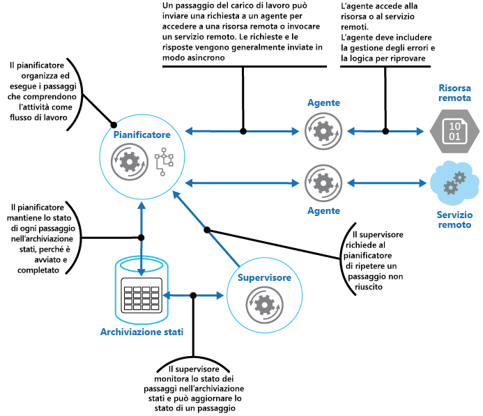

# Modello di supervisione agente di pianificazioneScheduler Agent Supervisor pattern

[!INCLUDE [header](../_includes/header.md)]

Coordinare un set di azioni distribuite come singola operazione.Coordinate a set of distributed actions as a single operation. Se una qualsiasi operazione ha esito negativo, provare a gestire gli errori in modo trasparente oppure annullare l'attività eseguita in modo da consentire che l'operazione abbia interamente esito positivo o negativo.If any of the actions fail, try to handle the failures transparently, or else undo the work that was performed, so the entire operation succeeds or fails as a whole. In questo modo si può aggiungere resilienza a un sistema distribuito, consentendo di recuperare e ripetere le azioni non riuscite a causa di eccezioni temporanee, errori di processi e di lunga durata.This can add resiliency to a distributed system, by enabling it to recover and retry actions that fail due to transient exceptions, long-lasting faults, and process failures.

## Contesto e problemaContext and problem

Un'applicazione esegue attività che comprendono diversi passaggi, alcuni dei quali potrebbero richiamare servizi remoti o accedere a risorse remote.An application performs tasks that include a number of steps, some of which might invoke remote services or access remote resources. I singoli passaggi potrebbero essere indipendenti tra loro, ma sono coordinati dalla logica dell'applicazione che implementa l'attività.The individual steps might be independent of each other, but they are orchestrated by the application logic that implements the task.

Quando possibile, l'applicazione deve garantire che l'attività venga eseguita fino al completamento e risolvere eventuali problemi che potrebbero verificarsi durante l'accesso a risorse o servizi remoti.Whenever possible, the application should ensure that the task runs to completion and resolve any failures that might occur when accessing remote services or resources. Possono verificarsi errori per diversi motivi.Failures can occur for many reasons. Ad esempio, la rete potrebbe essere inattiva, le comunicazioni potrebbero essere interrotte, un servizio remoto potrebbe non rispondere o essere in uno stato instabile oppure una risorsa remota potrebbe essere temporaneamente inaccessibile, forse a causa di vincoli.For example, the network might be down, communications could be interrupted, a remote service might be unresponsive or in an unstable state, or a remote resource might be temporarily inaccessible, perhaps due to resource constraints. In molti casi, gli errori sono temporanei e possono essere gestiti con il [modello di ripetizione dei tentativi](./retry.md).In many cases the failures will be transient and can be handled by using the [Retry pattern](./retry.md).

Se l'applicazione rileva un errore più permanente da cui non è possibile eseguire facilmente il recupero, deve essere in grado di ripristinare il sistema a uno stato coerente e garantire l'integrità dell'intera operazione.If the application detects a more permanent fault it can't easily recover from, it must be able to restore the system to a consistent state and ensure integrity of the entire operation.

## SoluzioneSolution

Il modello di supervisione agente di pianificazione definisce gli attori seguenti.The Scheduler Agent Supervisor pattern defines the following actors. Questi attori orchestrano i passaggi da eseguire nell'ambito dell'attività complessiva.These actors orchestrate the steps to be performed as part of the overall task.

- L'**utilità di pianificazione** predispone i passaggi che costituiscono l'attività da eseguire e ne orchestra il funzionamento.The **Scheduler** arranges for the steps that make up the task to be executed and orchestrates their operation. Questi passaggi possono essere combinati in una pipeline o un flusso di lavoro.These steps can be combined into a pipeline or workflow. L'utilità di pianificazione è responsabile dell'esecuzione dei passaggi descritti in questo flusso di lavoro nell'ordine corretto.The Scheduler is responsible for ensuring that the steps in this workflow are performed in the right order. All'esecuzione di ogni passaggio l'utilità di pianificazione registra lo stato del flusso di lavoro, indicando ad esempio che il passaggio non è stato ancora avviato, è in esecuzione o è stato completato.As each step is performed, the Scheduler records the state of the workflow, such as "step not yet started," "step running," or "step completed." Le informazioni sullo stato devono includere anche un limite superiore di tempo consentito per il completamento del passaggio, detto appunto ora di completamento.The state information should also include an upper limit of the time allowed for the step to finish, called the complete-by time. Se un passaggio richiede l'accesso a una risorsa o un servizio remoto, l'utilità di pianificazione richiama l'agente appropriato, passando i dettagli del lavoro da eseguire.If a step requires access to a remote service or resource, the Scheduler invokes the appropriate Agent, passing it the details of the work to be performed. L'utilità di pianificazione comunica in genere con un agente usando la messaggistica asincrona di richiesta-risposta.The Scheduler typically communicates with an Agent using asynchronous request/response messaging. Questa azione può essere implementata usando le code, sebbene sia possibile usare anche altre tecnologie di messaggistica distribuite.This can be implemented using queues, although other distributed messaging technologies could be used instead.

    > L'utilità di pianificazione esegue una funzione analoga al gestore processi nel [modello del gestore processi](https://www.enterpriseintegrationpatterns.com/patterns/messaging/ProcessManager.html).The Scheduler performs a similar function to the Process Manager in the [Process Manager pattern](https://www.enterpriseintegrationpatterns.com/patterns/messaging/ProcessManager.html). Il flusso di lavoro effettivo è in genere definito e implementato da un motore del flusso di lavoro controllato dall'utilità di pianificazione.The actual workflow is typically defined and implemented by a workflow engine that's controlled by the Scheduler. Questo approccio decuplica la logica di business nel flusso di lavoro dall'utilità di pianificazione.This approach decouples the business logic in the workflow from the Scheduler.

- L'**agente** contiene logica che incapsula una chiamata a un servizio remoto o l'accesso a una risorsa remota a cui si fa riferimento in un passaggio di un'attività.The **Agent** contains logic that encapsulates a call to a remote service, or access to a remote resource referenced by a step in a task. Ogni agente in genere esegue il wrapping delle chiamate in un singolo servizio o una risorsa, implementando la logica di gestione degli errori e ripetizione dei tentativi appropriata (soggetta a un vincolo di timeout, descritto più avanti).Each Agent typically wraps calls to a single service or resource, implementing the appropriate error handling and retry logic (subject to a timeout constraint, described later). Se i passaggi nel flusso di lavoro eseguiti dall'utilità di pianificazione usano vari servizi e risorse in diversi passaggi, ognuno di questi può fare riferimento a un agente differente (dettaglio di implementazione del modello).If the steps in the workflow being run by the Scheduler use several services and resources across different steps, each step might reference a different Agent (this is an implementation detail of the pattern).

- Il **supervisore** monitora lo stato dei passaggi nell'attività eseguita dall'utilità di pianificazione.The **Supervisor** monitors the status of the steps in the task being performed by the Scheduler. Viene eseguito periodicamente (la frequenza sarà specifica del sistema) ed esamina lo stato dei passaggi gestiti dall'utilità di pianificazione.It runs periodically (the frequency will be system specific), and examines the status of steps maintained by the Scheduler. Se ne rileva alcuni con timeout o errori, ne predispone il recupero da parte dell'agente appropriato oppure esegue l'azione correttiva idonea (che potrebbe includere la modifica dello stato di un passaggio).If it detects any that have timed out or failed, it arranges for the appropriate Agent to recover the step or execute the appropriate remedial action (this might involve modifying the status of a step). Si noti che le azioni di recupero o correttive vengono implementate dall'utilità di pianificazione e dagli agenti.Note that the recovery or remedial actions are implemented by the Scheduler and Agents. Il supervisore deve semplicemente richiedere l'esecuzione di queste azioni.The Supervisor should simply request that these actions be performed.

L'utilità di pianificazione, l'agente e il supervisore sono componenti logici e la loro implementazione fisica dipende dalla tecnologia usata.The Scheduler, Agent, and Supervisor are logical components and their physical implementation depends on the technology being used. Ad esempio, potrebbero essere implementati vari agenti logici nell'ambito di un unico servizio Web.For example, several logical agents might be implemented as part of a single web service.

L'utilità di pianificazione gestisce le informazioni sullo stato dell'attività e sullo stato di ogni passaggio in un archivio dati permanente, detto l'archivio stati.The Scheduler maintains information about the progress of the task and the state of each step in a durable data store, called the state store. Il supervisore può usare queste informazioni per determinare se un passaggio non è riuscito.The Supervisor can use this information to help determine whether a step has failed. La figura illustra la relazione tra l'utilità di pianificazione, gli agenti, il supervisore e l'archivio stati.The figure illustrates the relationship between the Scheduler, the Agents, the Supervisor, and the state store.

> [!NOTE]
> Questo diagramma mostra una versione semplificata del modello.This diagram shows a simplified version of the pattern. In un'implementazione reale varie istanze dell'utilità di pianificazione potrebbero essere in esecuzione contemporaneamente, ognuna con un subset di attività.In a real implementation, there might be many instances of the Scheduler running concurrently, each a subset of tasks. In modo analogo, il sistema può eseguire più istanze di ogni agente o anche più supervisori.Similarly, the system could run multiple instances of each Agent, or even multiple Supervisors. In questo caso i supervisori devono coordinare attentamente il lavoro tra loro per verificare che non si trovino a recuperare gli stessi passaggi e attività non riusciti.In this case, Supervisors must coordinate their work with each other carefully to ensure that they don’t compete to recover the same failed steps and tasks. Il [modello di designazione leader](./leader-election.md) offre una possibile soluzione a questo problema.The [Leader Election pattern](./leader-election.md) provides one possible solution to this problem.

Quando l'applicazione è pronta per l'esecuzione di un'attività, invia una richiesta all'utilità di pianificazione.When the application is ready to run a task, it submits a request to the Scheduler. L'utilità di pianificazione registra le informazioni sullo stato iniziale dell'attività e dei relativi passaggi (ad esempio, indicando che il passaggio non è ancora stata avviato) nell'archivio stati e poi inizia a eseguire le operazioni definite dal flusso di lavoro.The Scheduler records initial state information about the task and its steps (for example, step not yet started) in the state store and then starts performing the operations defined by the workflow. All'avvio di ogni passaggio, l'utilità di pianificazione aggiorna le informazioni sullo stato del passaggio nell'archivio stati (ad esempio, come passaggio in esecuzione).As the Scheduler starts each step, it updates the information about the state of that step in the state store (for example, step running).

Se un passaggio fa riferimento a una risorsa o un servizio remoto, l'utilità di pianificazione invia un messaggio all'agente appropriato.If a step references a remote service or resource, the Scheduler sends a message to the appropriate Agent. Il messaggio contiene le informazioni necessarie all'agente per passare al servizio o accedere alla risorsa, oltre all'ora di completamento per l'operazione.The message contains the information that the Agent needs to pass to the service or access the resource, in addition to the complete-by time for the operation. Se l'agente completata l'operazione, restituisce una risposta all'utilità di pianificazione.If the Agent completes its operation successfully, it returns a response to the Scheduler. A questo punto l'utilità di pianificazione può aggiornare le informazioni sullo stato nell'archivio stati (ad esempio, come passaggio completato) ed esegue il passaggio successivo.The Scheduler can then update the state information in the state store (for example, step completed) and perform the next step. Questo processo continua fino al completamento dell'intera attività.This process continues until the entire task is complete.

Un agente può implementare qualsiasi logica di ripetizione dei tentativi necessaria a eseguire il lavoro.An Agent can implement any retry logic that's necessary to perform its work. Tuttavia, se l'agente non completa il lavoro entro il periodo di completamento, l'utilità di pianificazione presupporrà che l'operazione non sia riuscita.However, if the Agent doesn't complete its work before the complete-by period expires, the Scheduler will assume that the operation has failed. In questo caso l'agente dovrebbe interrompere il lavoro e non restituire alcuna risposta all'utilità di pianificazione (nemmeno un messaggio di errore) o tentare alcun tipo di ripristino.In this case, the Agent should stop its work and not try to return anything to the Scheduler (not even an error message), or try any form of recovery. Il motivo di questa limitazione è che, in caso di timeout o errori in un passaggio, un'altra istanza dell'agente può essere pianificata per eseguire il passaggio non riuscito (questo processo è descritto più avanti).The reason for this restriction is that, after a step has timed out or failed, another instance of the Agent might be scheduled to run the failing step (this process is described later).

Se l'agente ha esito negativo, l'utilità di pianificazione non riceverà una risposta.If the Agent fails, the Scheduler won't receive a response. Il modello non effettua distinzione tra un passaggio con timeout e uno effettivamente non riuscito.The pattern doesn't make a distinction between a step that has timed out and one that has genuinely failed.

In caso di timeout o errore in un passaggio, l'archivio stati conterrà un record che indica che il passaggio è in esecuzione, ma l'ora di completamento sarà stato superato.If a step times out or fails, the state store will contain a record that indicates that the step is running, but the complete-by time will have passed. Il supervisore cerca passaggi come questo e tenta di recuperarli.The Supervisor looks for steps like this and tries to recover them. Una possibile strategia prevede che il supervisore aggiorni il valore dell'ora di completamento per estendere la durata disponibile per completare il passaggio e invii un messaggio all'utilità di pianificazione identificando il passaggio con timeout. A questo punto l'utilità di pianificazione potrà provare a ripetere il passaggio.One possible strategy is for the Supervisor to update the complete-by value to extend the time available to complete the step, and then send a message to the Scheduler identifying the step that has timed out. The Scheduler can then try to repeat this step. Tuttavia, per questa soluzione le attività devono essere idempotenti.However, this design requires the tasks to be idempotent.

Il supervisore potrebbe dover impedire che lo stesso passaggio venga ripetuto se continuano a verificarsi errori o timeout. A tale scopo, il supervisore può gestire un numero di tentativi per ogni passaggio, insieme alle informazioni sullo stato, nell'archivio stati.The Supervisor might need to prevent the same step from being retried if it continually fails or times out. To do this, the Supervisor could maintain a retry count for each step, along with the state information, in the state store. Se questo numero supera una soglia predefinita, il supervisore può adottare una strategia di attesa per un periodo più esteso prima di indicare all'utilità di pianificazione di provare a ripetere il passaggio, nell'eventualità che l'errore venga risolto durante questo periodo.If this count exceeds a predefined threshold the Supervisor can adopt a strategy of waiting for an extended period before notifying the Scheduler that it should retry the step, in the expectation that the fault will be resolved during this period. In alternativa, il supervisore può inviare un messaggio all'utilità di pianificazione per richiedere di annullare l'intera attività implementando un [modello di transazioni di compensazione](./compensating-transaction.md).Alternatively, the Supervisor can send a message to the Scheduler to request the entire task be undone by implementing a [Compensating Transaction pattern](./compensating-transaction.md). Questo approccio varia a seconda che l'utilità di pianificazione e gli agenti forniscano o meno le informazioni necessarie per implementare le operazioni di compensazione per ogni passaggio completato correttamente.This approach will depend on the Scheduler and Agents providing the information necessary to implement the compensating operations for each step that completed successfully.

> Non è compito del supervisore monitorare l'utilità di pianificazione e gli agenti e riavviarli in caso di errori.It isn't the purpose of the Supervisor to monitor the Scheduler and Agents, and restart them if they fail. Questo aspetto del sistema deve essere gestito dall'infrastruttura in cui sono in esecuzione questi componenti.This aspect of the system should be handled by the infrastructure these components are running in. In modo analogo, il supervisore non è tenuto a conoscere le effettive operazioni di business svolte dalle attività in esecuzione nell'utilità di pianificazione (tra cui la procedura di compensazione in caso di errori in queste attività).Similarly, the Supervisor shouldn't have knowledge of the actual business operations that the tasks being performed by the Scheduler are running (including how to compensate should these tasks fail). È compito della logica di flusso di lavoro implementata dall'utilità di pianificazione.This is the purpose of the workflow logic implemented by the Scheduler. L'unica responsabilità del supervisore consiste nel determinare se un passaggio non è riuscito e disporne la ripetizione oppure l'annullamento dell'intera attività che include il passaggio con errori.The sole responsibility of the Supervisor is to determine whether a step has failed and arrange either for it to be repeated or for the entire task containing the failed step to be undone.

Se l'utilità di pianificazione viene riavviata dopo un errore o il flusso di lavoro eseguito dall'utilità di pianificazione si arresta in modo imprevisto, l'utilità di pianificazione dovrà essere in grado di determinare lo stato di qualsiasi attività in elaborazione al suo interno al momento dell'errore ed essere pronta a riprenderla dal punto dell'interruzione.If the Scheduler is restarted after a failure, or the workflow being performed by the Scheduler terminates unexpectedly, the Scheduler should be able to determine the status of any inflight task that it was handling when it failed, and be prepared to resume this task from that point. I dettagli di implementazione di questo processo sono probabilmente specifici del sistema.The implementation details of this process are likely to be system specific. Se l'attività non può essere recuperata, potrebbe essere necessario annullare il lavoro già eseguito dall'attività stessa.If the task can't be recovered, it might be necessary to undo the work already performed by the task. Potrebbe essere anche necessario implementare una [transazione di compensazione](./compensating-transaction.md).This might also require implementing a [compensating transaction](./compensating-transaction.md).

Il vantaggio principale di questo modello è che il sistema è resiliente in caso di errori temporanei o irreversibili imprevisti.The key advantage of this pattern is that the system is resilient in the event of unexpected temporary or unrecoverable failures. Il sistema può essere progettato per la riparazione automatica.The system can be constructed to be self healing. Ad esempio, se si verifica un errore nell'agente o nell'utilità di pianificazione, è possibile avviare un nuovo agente e il supervisore può predisporre la ripresa di un'attività.For example, if an Agent or the Scheduler fails, a new one can be started and the Supervisor can arrange for a task to be resumed. Se si verificano errori nel supervisore, un'altra istanza può essere avviata e riprendere dal punto in cui si è verificato l'errore.If the Supervisor fails, another instance can be started and can take over from where the failure occurred. Se il supervisore è pianificato per l'esecuzione periodica, una nuova istanza può essere avviata automaticamente dopo un intervallo predefinito.If the Supervisor is scheduled to run periodically, a new instance can be automatically started after a predefined interval. È possibile replicare l'archivio stati per raggiungere anche un maggiore grado di resilienza.The state store can be replicated to reach an even greater degree of resiliency.

## Considerazioni e problemiIssues and considerations

Prima di decidere come implementare questo schema, è opportuno considerare quanto segue:You should consider the following points when deciding how to implement this pattern:

- Questo modello può essere difficile da implementare e richiede test approfonditi di ogni possibile modalità di errore del sistema.This pattern can be difficult to implement and requires thorough testing of each possible failure mode of the system.

- La logica di recupero/ripetizione dei tentativi implementata dall'utilità di pianificazione è complessa e varia a seconda delle informazioni sullo stato incluse nell'archivio stati.The recovery/retry logic implemented by the Scheduler is complex and dependent on state information held in the state store. Potrebbe anche essere necessario registrare le informazioni richieste per implementare una transazione di compensazione in un archivio dati permanente.It might also be necessary to record the information required to implement a compensating transaction in a durable data store.

- La frequenza di esecuzione del supervisore è importante.How often the Supervisor runs will be important. Deve essere eseguito con una frequenza tale da impedire che eventuali passaggi con errori blocchino un'applicazione per un lungo periodo di tempo, ma non così spesso da creare un sovraccarico.It should run often enough to prevent any failed steps from blocking an application for an extended period, but it shouldn't run so often that it becomes an overhead.

- I passaggi svolti da un agente possono essere eseguiti più volte.The steps performed by an Agent could be run more than once. La logica che implementa questi passaggi deve essere idempotente.The logic that implements these steps should be idempotent.

## Quando usare questo modelloWhen to use this pattern

Usare questo modello quando un processo che viene eseguito in un ambiente distribuito, ad esempio nel cloud, deve essere resiliente a errori di comunicazione e/o operativi.Use this pattern when a process that runs in a distributed environment, such as the cloud, must be resilient to communications failure and/or operational failure.

Questo modello potrebbe non essere indicato per le attività che non richiamano servizi remoti o accedono a risorse remote.This pattern might not be suitable for tasks that don't invoke remote services or access remote resources.

## EsempioExample

Un'applicazione Web che implementa un sistema di e-commerce è stata distribuita in Microsoft Azure.A web application that implements an ecommerce system has been deployed on Microsoft Azure. Gli utenti possono eseguire questa applicazione per visualizzare i prodotti disponibili ed eseguire ordini.Users can run this application to browse the available products and to place orders. L'interfaccia utente viene eseguita come ruolo Web e gli elementi di elaborazione degli ordini dell'applicazione vengono implementati come set di ruoli di lavoro.The user interface runs as a web role, and the order processing elements of the application are implemented as a set of worker roles. Parte della logica di elaborazione degli ordini implica l'accesso a un servizio remoto. Questo aspetto del sistema potrebbe essere soggetto a errori temporanei e/o di durata più estesa.Part of the order processing logic involves accessing a remote service, and this aspect of the system could be prone to transient or more long-lasting faults. Per questo motivo, i progettisti hanno usato il modello di supervisione agente di pianificazione per implementare gli elementi di elaborazione degli ordini del sistema.For this reason, the designers used the Scheduler Agent Supervisor pattern to implement the order processing elements of the system.

Quando un cliente esegue un ordine, l'applicazione crea un messaggio che descrive l'ordine e lo invia a una coda.When a customer places an order, the application constructs a message that describes the order and posts this message to a queue. Un processo di invio separato, in esecuzione in un ruolo di lavoro, recupera il messaggio, inserisce i dettagli dell'ordine nel database degli ordini e crea un record per il processo dell'ordine nell'archivio stati.A separate submission process, running in a worker role, retrieves the message, inserts the order details into the orders database, and creates a record for the order process in the state store. Si noti che gli inserimenti nel database degli ordini e nell'archivio stati vengono eseguiti all'interno della stessa operazione.Note that the inserts into the orders database and the state store are performed as part of the same operation. Il processo di invio è progettato per garantire che entrambi gli inserimenti vengano completati contemporaneamente.The submission process is designed to ensure that both inserts complete together.

Le informazioni sullo stato create durante il processo di invio dell'ordine includono:The state information that the submission process creates for the order includes:

- **OrderID**.**OrderID**. ID dell'ordine nel database degli ordini.The ID of the order in the orders database.

- **LockedBy**.**LockedBy**. ID di istanza del ruolo di lavoro che gestisce l'ordine.The instance ID of the worker role handling the order. Potrebbero essere presenti più istanze correnti del ruolo di lavoro in esecuzione nell'utilità di pianificazione, ma ogni ordine deve essere gestito da una sola istanza.There might be multiple current instances of the worker role running the Scheduler, but each order should only be handled by a single instance.

- **CompleteBy**.**CompleteBy**. Ora di completamento dell'elaborazione dell'ordine.The time the order should be processed by.

- **ProcessState**.**ProcessState**. Stato corrente dell'attività che gestisce l'ordine.The current state of the task handling the order. Gli stati possibili sono elencati di seguito:The possible states are:

  - **Pending**.**Pending**. L'ordine è stato creato, ma l'elaborazione non è ancora stata avviata.The order has been created but processing hasn't yet been started.
  - **Processing**.**Processing**. L'ordine è in fase di elaborazione.The order is currently being processed.
  - **Processed**.**Processed**. L'ordine è stato elaborato correttamente.The order has been processed successfully.
  - **Error**.**Error**. L'elaborazione degli ordini non è riuscita.The order processing has failed.

- **FailureCount**.**FailureCount**. Numero di tentativi di elaborazione dell'ordine.The number of times that processing has been tried for the order.

In queste informazioni sullo stato il campo `OrderID` viene copiato dall'ID del nuovo ordine.In this state information, the `OrderID` field is copied from the order ID of the new order. I campi `LockedBy` e `CompleteBy` sono impostati su `null`, il campo `ProcessState` su `Pending`e il campo `FailureCount` su 0.The `LockedBy` and `CompleteBy` fields are set to `null`, the `ProcessState` field is set to `Pending`, and the `FailureCount` field is set to 0.

> [!NOTE]
> In questo esempio, la logica di gestione degli ordini è relativamente semplice e include un solo passaggio che richiama un servizio remoto.In this example, the order handling logic is relatively simple and only has a single step that invokes a remote service. In uno scenario più complesso a più passaggi, il processo di invio comporterebbe diversi passaggi e verrebbero creati vari record nell'archivio stati, ognuno con la descrizione dello stato di un singolo passaggio.In a more complex multistep scenario, the submission process would likely involve several steps, and so several records would be created in the state store—each one describing the state of an individual step.

Anche l'utilità di pianificazione viene eseguita nell'ambito di un ruolo di lavoro e implementa la logica di business che gestisce l'ordine.The Scheduler also runs as part of a worker role and implements the business logic that handles the order. Un'istanza dell'utilità di pianificazione che esegue il polling di nuovi ordini esamina l'archivio stati alla ricerca dei record in cui il campo `LockedBy` è Null e il campo `ProcessState` è Pending.An instance of the Scheduler polling for new orders examines the state store for records where the `LockedBy` field is null and the `ProcessState` field is pending. Quando l'utilità di pianificazione individua un nuovo ordine, popola immediatamente il campo `LockedBy` con lo specifico ID di istanza, imposta il campo `CompleteBy` su un'ora appropriata e imposta il campo `ProcessState` per l'elaborazione.When the Scheduler finds a new order, it immediately populates the `LockedBy` field with its own instance ID, sets the `CompleteBy` field to an appropriate time, and sets the `ProcessState` field to processing. Il codice è progettato per essere esclusivo e atomico, per garantire che due istanze simultanee dell'utilità di pianificazione non tentino di gestire contemporaneamente lo stesso ordine.The code is designed to be exclusive and atomic to ensure that two concurrent instances of the Scheduler can't try to handle the same order simultaneously.

L'utilità di pianificazione esegue poi il flusso di lavoro di business per elaborare l'ordine in modo asincrono, passando il valore nel campo `OrderID` dall'archivio stati.The Scheduler then runs the business workflow to process the order asynchronously, passing it the value in the `OrderID` field from the state store. Il flusso di lavoro che gestisce l'ordine recupera i dettagli dell'ordine dal database degli ordini ed esegue il suo lavoro.The workflow handling the order retrieves the details of the order from the orders database and performs its work. Quando un passaggio nel flusso di lavoro di elaborazione degli ordini deve richiamare il servizio remoto, usa un agente.When a step in the order processing workflow needs to invoke the remote service, it uses an Agent. Il passaggio del flusso di lavoro comunica con l'agente usando una coppia di code di messaggi del bus di servizio di Azure che funge da canale di richiesta/risposta.The workflow step communicates with the Agent using a pair of Azure Service Bus message queues acting as a request/response channel. La figura illustra una panoramica della soluzione.The figure shows a high level view of the solution.

Il messaggio inviato da un passaggio del flusso di lavoro all'agente descrive l'ordine e include l'ora di completamento.The message sent to the Agent from a workflow step describes the order and includes the complete-by time. Se l'agente riceve una risposta dal servizio remoto prima che sopraggiunga l'ora di completamento, invia un messaggio di risposta nella coda del bus di servizio in cui è in ascolto il flusso di lavoro.If the Agent receives a response from the remote service before the complete-by time expires, it posts a reply message on the Service Bus queue on which the workflow is listening. Quando il passaggio del flusso di lavoro riceve il messaggio di risposta valido, completa l'elaborazione e l'utilità di pianificazione imposta il campo ProcessState dello stato dell'ordine su Processed.When the workflow step receives the valid reply message, it completes its processing and the Scheduler sets the \`ProcessState field of the order state to processed. A questo punto, l'elaborazione dell'ordine è stata completata.At this point, the order processing has completed successfully.

Se l'ora di completamento giunge prima che l'agente riceva una risposta dal servizio remoto, l'agente interrompe l'elaborazione e termina la gestione dell'ordine.If the complete-by time expires before the Agent receives a response from the remote service, the Agent simply halts its processing and terminates handling the order. In modo analogo, se il flusso di lavoro che gestisce l'ordine supera l'ora di completamento, termina anch'esso.Similarly, if the workflow handling the order exceeds the complete-by time, it also terminates. In entrambi i casi, lo stato dell'ordine nell'archivio stati resta impostato su Processing, ma l'ora di completamento indica che l'ora di elaborazione dell'ordine è stata superata e il processo viene considerato come non riuscito.In both cases, the state of the order in the state store remains set to processing, but the complete-by time indicates that the time for processing the order has passed and the process is deemed to have failed. Se l'agente che accede al servizio remoto o il flusso di lavoro che gestisce l'ordine (o entrambi) viene terminato in modo imprevisto, le informazioni nell'archivio stati rimarranno nuovamente impostate su Processing e il valore di completamento risulterà scaduto.Note that if the Agent that's accessing the remote service, or the workflow that's handling the order (or both) terminate unexpectedly, the information in the state store will again remain set to processing and eventually will have an expired complete-by value.

Se l'agente rileva un errore irreversibile permanente mentre prova a contattare il servizio remoto, può inviare una risposta di errore al flusso di lavoro.If the Agent detects an unrecoverable, nontransient fault while it's trying to contact the remote service, it can send an error response back to the workflow. L'utilità di pianificazione può impostare lo stato dell'ordine su Error e generare un evento che avvisa un operatore.The Scheduler can set the status of the order to error and raise an event that alerts an operator. A questo punto l'operatore può provare a risolvere manualmente il motivo dell'errore e inviare di nuovo il passaggio di elaborazione non riuscito.The operator can then try to resolve the reason for the failure manually and resubmit the failed processing step.

Il supervisore esamina periodicamente l'archivio stati alla ricerca di ordini con valore di completamento scaduto.The Supervisor periodically examines the state store looking for orders with an expired complete-by value. Se il supervisore trova un record, incrementa il campo `FailureCount`.If the Supervisor finds a record, it increments the `FailureCount` field. Se il valore del numero di errori è inferiore a un valore di soglia specificato, il supervisore reimposta il campo `LockedBy` su Null, aggiorna il campo `CompleteBy` con una nuova ora di scadenza e imposta il campo `ProcessState` su Pending.If the failure count value is below a specified threshold value, the Supervisor resets the `LockedBy` field to null, updates the `CompleteBy` field with a new expiration time, and sets the `ProcessState` field to pending. Un'istanza dell'utilità di pianificazione può prelevare questo ordine ed eseguire l'elaborazione come in precedenza.An instance of the Scheduler can pick up this order and perform its processing as before. Se il valore del numero di errori supera una soglia specificata, il motivo dell'errore viene considerato permanente.If the failure count value exceeds a specified threshold, the reason for the failure is assumed to be nontransient. L'utilità di pianificazione imposta lo stato dell'ordine su Error e genera un evento che avvisa un operatore.The Supervisor sets the status of the order to error and raises an event that alerts an operator.

> In questo esempio, il supervisore viene implementato in un ruolo di lavoro separato.In this example, the Supervisor is implemented in a separate worker role. È possibile usare un'ampia gamma di strategie per predisporre l'esecuzione dell'attività del supervisore, ad esempio l'uso del servizio Utilità di pianificazione di Azure (da non confondersi con il componente utilità di pianificazione in questo modello).You can use a variety of strategies to arrange for the Supervisor task to be run, including using the Azure Scheduler service (not to be confused with the Scheduler component in this pattern). Per altre informazioni sul servizio Utilità di pianificazione di Azure, visitare la pagina [Utilità di pianificazione](https://azure.microsoft.com/services/scheduler/).For more information about the Azure Scheduler service, visit the [Scheduler](https://azure.microsoft.com/services/scheduler/) page.

Sebbene non sia mostrato in questo esempio, l'utilità di pianificazione potrebbe dover mantenere informata l'applicazione che ha inviato l'ordine sull'avanzamento e sullo stato dell'ordine.Although it isn't shown in this example, the Scheduler might need to keep the application that submitted the order informed about the progress and status of the order. L'applicazione e l'utilità di pianificazione sono isolate l'una dall'altra per eliminare eventuali interdipendenze.The application and the Scheduler are isolated from each other to eliminate any dependencies between them. L'applicazione ignora quale istanza dell'utilità di pianificazione gestisca l'ordine e l'utilità di pianificazione non conosce la specifica istanza dell'applicazione che ha inviato l'ordine.The application has no knowledge of which instance of the Scheduler is handling the order, and the Scheduler is unaware of which specific application instance posted the order.

Per consentire la segnalazione dello stato dell'ordine, l'applicazione può usare la coda di risposta privata.To allow the order status to be reported, the application could use its own private response queue. I dettagli di questa coda di risposta verranno inseriti nella richiesta inviata al processo di invio, che includerà queste informazioni nell'archivio stati.The details of this response queue would be included as part of the request sent to the submission process, which would include this information in the state store. L'utilità di pianificazione pubblicherà poi i messaggi a questa coda indicando lo stato dell'ordine (richiesta ricevuta, ordine completato, ordine non è riuscito e così via).The Scheduler would then post messages to this queue indicating the status of the order (request received, order completed, order failed, and so on). Deve includere l'ID dell'ordine in questi messaggi, in modo che possano essere correlati alla richiesta originale dall'applicazione.It should include the order ID in these messages so they can be correlated with the original request by the application.

## Modelli correlati e informazioni aggiuntiveRelated patterns and guidance

Per l'implementazione di questo modello possono risultare utili i modelli e le informazioni aggiuntive seguenti:The following patterns and guidance might also be relevant when implementing this pattern:

- [Modello di ripetizione dei tentativi](./retry.md).[Retry pattern](./retry.md). Un agente può usare questo modello per ripetere in modo trasparente un'operazione che accede a un servizio remoto o una risorsa precedentemente non riuscita.An Agent can use this pattern to transparently retry an operation that accesses a remote service or resource that has previously failed. Usarlo quando si prevede che la causa dell'errore sia temporanea e possa essere corretta.Use when the expectation is that the cause of the failure is transient and can be corrected.
- [Modello di interruttore](./circuit-breaker.md).[Circuit Breaker pattern](./circuit-breaker.md). Un agente può usare questo modello per gestire gli errori la cui correzione potrebbe richiedere una quantità variabile di tempo in fase di connessione a una risorsa o a un servizio remoto.An Agent can use this pattern to handle faults that take a variable amount of time to correct when connecting to a remote service or resource.
- [Modello di transazioni di compensazione](./compensating-transaction.md).[Compensating Transaction pattern](./compensating-transaction.md). Se il flusso di lavoro eseguito da un'utilità di pianificazione non può essere completato, potrebbe essere necessario annullare le operazioni eseguite in precedenza.If the workflow being performed by a Scheduler can't be completed successfully, it might be necessary to undo any work it's previously performed. Il modello di transizioni di compensazione descrive come ottenere questo risultato per le operazioni che seguono il modello di coerenza finale.The Compensating Transaction pattern describes how this can be achieved for operations that follow the eventual consistency model. Questi tipi di operazioni sono in genere implementate da un'utilità di pianificazione che esegue processi di business e flussi di lavoro complessi.These types of operations are commonly implemented by a Scheduler that performs complex business processes and workflows.
- [Introduzione alla messaggistica asincrona](https://msdn.microsoft.com/library/dn589781.aspx).[Asynchronous Messaging Primer](https://msdn.microsoft.com/library/dn589781.aspx). I componenti nel modello di supervisione agente di pianificazione vengono in genere eseguiti decuplicati tra loro e comunicano in modo asincrono.The components in the Scheduler Agent Supervisor pattern typically run decoupled from each other and communicate asynchronously. Descrive alcuni approcci che possono essere adottati per implementare la comunicazione asincrona in base alle code di messaggi.Describes some of the approaches that can be used to implement asynchronous communication based on message queues.
- [Modello di designazione leader](./leader-election.md).[Leader Election pattern](./leader-election.md). Potrebbe essere necessario coordinare le azioni di più istanze di un supervisore per evitare che tentino di recuperare lo stesso processo non riuscito.It might be necessary to coordinate the actions of multiple instances of a Supervisor to prevent them from attempting to recover the same failed process. Il modello di designazione leader descrive come ottenere questo risultato.The Leader Election pattern describes how to do this.
- [Cloud Architecture: The Scheduler-Agent-Supervisor Pattern](https://blogs.msdn.microsoft.com/clemensv/2010/09/27/cloud-architecture-the-scheduler-agent-supervisor-pattern/) (Architettura cloud: modello di supervisione agente di pianificazione) nel blog di Clemens Vasters[Cloud Architecture: The Scheduler-Agent-Supervisor Pattern](https://blogs.msdn.microsoft.com/clemensv/2010/09/27/cloud-architecture-the-scheduler-agent-supervisor-pattern/) on Clemens Vasters' blog
- [Process Manager pattern](https://www.enterpriseintegrationpatterns.com/patterns/messaging/ProcessManager.html) (Modello del gestore processi)[Process Manager pattern](https://www.enterpriseintegrationpatterns.com/patterns/messaging/ProcessManager.html)
- [Reference 6: A Saga on Sagas](https://msdn.microsoft.com/library/jj591569.aspx) (Informazioni di riferimento 6: una saga sulle saghe).[Reference 6: A Saga on Sagas](https://msdn.microsoft.com/library/jj591569.aspx). Esempio che illustra in che modo il modello CQRS usa un gestore processi (nell'ambito delle indicazioni sul passaggio a CQRS).An example showing how the CQRS pattern uses a process manager (part of the CQRS Journey guidance).
- [Utilità di pianificazione di Microsoft AzureMicrosoft Azure Scheduler](https://azure.microsoft.com/services/scheduler/)
