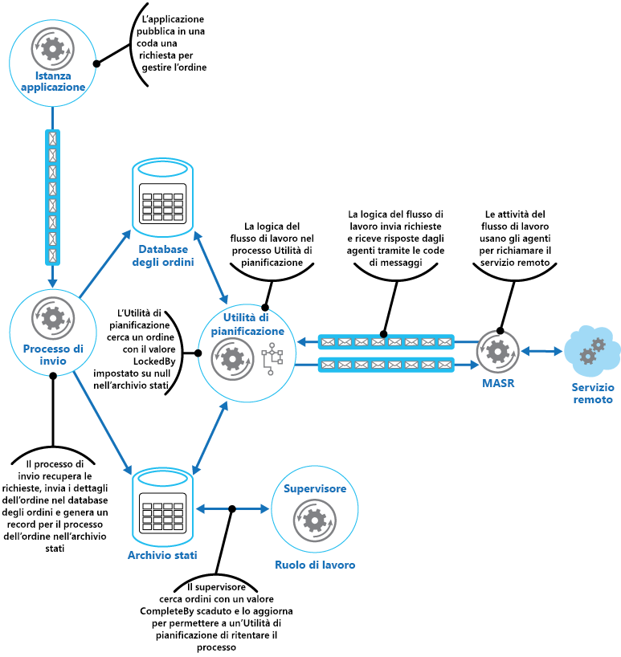

# Modello di supervisione agente di pianificazione

[!INCLUDE [header](../_includes/header.md)]

Coordinare un set di azioni distribuite come singola operazione. Se una qualsiasi operazione ha esito negativo, provare a gestire gli errori in modo trasparente oppure annullare l'attività eseguita in modo da consentire che l'operazione abbia interamente esito positivo o negativo. In questo modo si può aggiungere resilienza a un sistema distribuito, consentendo di recuperare e ripetere le azioni non riuscite a causa di eccezioni temporanee, errori di processi e di lunga durata.

## Contesto e problema

Un'applicazione esegue attività che comprendono diversi passaggi, alcuni dei quali potrebbero richiamare servizi remoti o accedere a risorse remote. I singoli passaggi potrebbero essere indipendenti tra loro, ma sono coordinati dalla logica dell'applicazione che implementa l'attività.

Quando possibile, l'applicazione deve garantire che l'attività venga eseguita fino al completamento e risolvere eventuali problemi che potrebbero verificarsi durante l'accesso a risorse o servizi remoti. Possono verificarsi errori per diversi motivi. Ad esempio, la rete potrebbe essere inattiva, le comunicazioni potrebbero essere interrotte, un servizio remoto potrebbe non rispondere o essere in uno stato instabile oppure una risorsa remota potrebbe essere temporaneamente inaccessibile, forse a causa di vincoli. In molti casi, gli errori sono temporanei e possono essere gestiti con il [modello di ripetizione dei tentativi](./retry.md).

Se l'applicazione rileva un errore più permanente da cui non è possibile eseguire facilmente il recupero, deve essere in grado di ripristinare il sistema a uno stato coerente e garantire l'integrità dell'intera operazione.

## Soluzione

Il modello di supervisione agente di pianificazione definisce gli attori seguenti. Questi attori orchestrano i passaggi da eseguire nell'ambito dell'attività complessiva.

- L'**utilità di pianificazione** predispone i passaggi che costituiscono l'attività da eseguire e ne orchestra il funzionamento. Questi passaggi possono essere combinati in una pipeline o un flusso di lavoro. L'utilità di pianificazione è responsabile dell'esecuzione dei passaggi descritti in questo flusso di lavoro nell'ordine corretto. All'esecuzione di ogni passaggio l'utilità di pianificazione registra lo stato del flusso di lavoro, indicando ad esempio che il passaggio non è stato ancora avviato, è in esecuzione o è stato completato. Le informazioni sullo stato devono includere anche un limite superiore di tempo consentito per il completamento del passaggio, detto appunto ora di completamento. Se un passaggio richiede l'accesso a una risorsa o un servizio remoto, l'utilità di pianificazione richiama l'agente appropriato, passando i dettagli del lavoro da eseguire. L'utilità di pianificazione comunica in genere con un agente usando la messaggistica asincrona di richiesta-risposta. Questa azione può essere implementata usando le code, sebbene sia possibile usare anche altre tecnologie di messaggistica distribuite.

    > L'utilità di pianificazione esegue una funzione analoga al gestore processi nel [modello del gestore processi](https://www.enterpriseintegrationpatterns.com/patterns/messaging/ProcessManager.html). Il flusso di lavoro effettivo è in genere definito e implementato da un motore del flusso di lavoro controllato dall'utilità di pianificazione. Questo approccio decuplica la logica di business nel flusso di lavoro dall'utilità di pianificazione.

- L'**agente** contiene logica che incapsula una chiamata a un servizio remoto o l'accesso a una risorsa remota a cui si fa riferimento in un passaggio di un'attività. Ogni agente in genere esegue il wrapping delle chiamate in un singolo servizio o una risorsa, implementando la logica di gestione degli errori e ripetizione dei tentativi appropriata (soggetta a un vincolo di timeout, descritto più avanti). Se i passaggi nel flusso di lavoro eseguiti dall'utilità di pianificazione usano vari servizi e risorse in diversi passaggi, ognuno di questi può fare riferimento a un agente differente (dettaglio di implementazione del modello).

- Il **supervisore** monitora lo stato dei passaggi nell'attività eseguita dall'utilità di pianificazione. Viene eseguito periodicamente (la frequenza sarà specifica del sistema) ed esamina lo stato dei passaggi gestiti dall'utilità di pianificazione. Se ne rileva alcuni con timeout o errori, ne predispone il recupero da parte dell'agente appropriato oppure esegue l'azione correttiva idonea (che potrebbe includere la modifica dello stato di un passaggio). Si noti che le azioni di recupero o correttive vengono implementate dall'utilità di pianificazione e dagli agenti. Il supervisore deve semplicemente richiedere l'esecuzione di queste azioni.

L'utilità di pianificazione, l'agente e il supervisore sono componenti logici e la loro implementazione fisica dipende dalla tecnologia usata. Ad esempio, potrebbero essere implementati vari agenti logici nell'ambito di un unico servizio Web.

L'utilità di pianificazione gestisce le informazioni sullo stato dell'attività e sullo stato di ogni passaggio in un archivio dati permanente, detto l'archivio stati. Il supervisore può usare queste informazioni per determinare se un passaggio non è riuscito. La figura illustra la relazione tra l'utilità di pianificazione, gli agenti, il supervisore e l'archivio stati.

> [!NOTE]
> Questo diagramma mostra una versione semplificata del modello. In un'implementazione reale varie istanze dell'utilità di pianificazione potrebbero essere in esecuzione contemporaneamente, ognuna con un subset di attività. In modo analogo, il sistema può eseguire più istanze di ogni agente o anche più supervisori. In questo caso i supervisori devono coordinare attentamente il lavoro tra loro per verificare che non si trovino a recuperare gli stessi passaggi e attività non riusciti. Il [modello di designazione leader](./leader-election.md) offre una possibile soluzione a questo problema.

Quando l'applicazione è pronta per l'esecuzione di un'attività, invia una richiesta all'utilità di pianificazione. L'utilità di pianificazione registra le informazioni sullo stato iniziale dell'attività e dei relativi passaggi (ad esempio, indicando che il passaggio non è ancora stata avviato) nell'archivio stati e poi inizia a eseguire le operazioni definite dal flusso di lavoro. All'avvio di ogni passaggio, l'utilità di pianificazione aggiorna le informazioni sullo stato del passaggio nell'archivio stati (ad esempio, come passaggio in esecuzione).

Se un passaggio fa riferimento a una risorsa o un servizio remoto, l'utilità di pianificazione invia un messaggio all'agente appropriato. Il messaggio contiene le informazioni necessarie all'agente per passare al servizio o accedere alla risorsa, oltre all'ora di completamento per l'operazione. Se l'agente completata l'operazione, restituisce una risposta all'utilità di pianificazione. A questo punto l'utilità di pianificazione può aggiornare le informazioni sullo stato nell'archivio stati (ad esempio, come passaggio completato) ed esegue il passaggio successivo. Questo processo continua fino al completamento dell'intera attività.

Un agente può implementare qualsiasi logica di ripetizione dei tentativi necessaria a eseguire il lavoro. Tuttavia, se l'agente non completa il lavoro entro il periodo di completamento, l'utilità di pianificazione presupporrà che l'operazione non sia riuscita. In questo caso l'agente dovrebbe interrompere il lavoro e non restituire alcuna risposta all'utilità di pianificazione (nemmeno un messaggio di errore) o tentare alcun tipo di ripristino. Il motivo di questa limitazione è che, in caso di timeout o errori in un passaggio, un'altra istanza dell'agente può essere pianificata per eseguire il passaggio non riuscito (questo processo è descritto più avanti).

Se l'agente ha esito negativo, l'utilità di pianificazione non riceverà una risposta. Il modello non effettua distinzione tra un passaggio con timeout e uno effettivamente non riuscito.

In caso di timeout o errore in un passaggio, l'archivio stati conterrà un record che indica che il passaggio è in esecuzione, ma l'ora di completamento sarà stato superato. Il supervisore cerca passaggi come questo e tenta di recuperarli. Una possibile strategia prevede che il supervisore aggiorni il valore dell'ora di completamento per estendere la durata disponibile per completare il passaggio e invii un messaggio all'utilità di pianificazione identificando il passaggio con timeout. A questo punto l'utilità di pianificazione potrà provare a ripetere il passaggio. Tuttavia, per questa soluzione le attività devono essere idempotenti.

Il supervisore potrebbe dover impedire che lo stesso passaggio venga ripetuto se continuano a verificarsi errori o timeout. A tale scopo, il supervisore può gestire un numero di tentativi per ogni passaggio, insieme alle informazioni sullo stato, nell'archivio stati. Se questo numero supera una soglia predefinita, il supervisore può adottare una strategia di attesa per un periodo più esteso prima di indicare all'utilità di pianificazione di provare a ripetere il passaggio, nell'eventualità che l'errore venga risolto durante questo periodo. In alternativa, il supervisore può inviare un messaggio all'utilità di pianificazione per richiedere di annullare l'intera attività implementando un [modello di transazioni di compensazione](./compensating-transaction.md). Questo approccio varia a seconda che l'utilità di pianificazione e gli agenti forniscano o meno le informazioni necessarie per implementare le operazioni di compensazione per ogni passaggio completato correttamente.

> Non è compito del supervisore monitorare l'utilità di pianificazione e gli agenti e riavviarli in caso di errori. Questo aspetto del sistema deve essere gestito dall'infrastruttura in cui sono in esecuzione questi componenti. In modo analogo, il supervisore non è tenuto a conoscere le effettive operazioni di business svolte dalle attività in esecuzione nell'utilità di pianificazione (tra cui la procedura di compensazione in caso di errori in queste attività). È compito della logica di flusso di lavoro implementata dall'utilità di pianificazione. L'unica responsabilità del supervisore consiste nel determinare se un passaggio non è riuscito e disporne la ripetizione oppure l'annullamento dell'intera attività che include il passaggio con errori.

Se l'utilità di pianificazione viene riavviata dopo un errore o il flusso di lavoro eseguito dall'utilità di pianificazione si arresta in modo imprevisto, l'utilità di pianificazione dovrà essere in grado di determinare lo stato di qualsiasi attività in elaborazione al suo interno al momento dell'errore ed essere pronta a riprenderla dal punto dell'interruzione. I dettagli di implementazione di questo processo sono probabilmente specifici del sistema. Se l'attività non può essere recuperata, potrebbe essere necessario annullare il lavoro già eseguito dall'attività stessa. Potrebbe essere anche necessario implementare una [transazione di compensazione](./compensating-transaction.md).

Il vantaggio principale di questo modello è che il sistema è resiliente in caso di errori temporanei o irreversibili imprevisti. Il sistema può essere progettato per la riparazione automatica. Ad esempio, se si verifica un errore nell'agente o nell'utilità di pianificazione, è possibile avviare un nuovo agente e il supervisore può predisporre la ripresa di un'attività. Se si verificano errori nel supervisore, un'altra istanza può essere avviata e riprendere dal punto in cui si è verificato l'errore. Se il supervisore è pianificato per l'esecuzione periodica, una nuova istanza può essere avviata automaticamente dopo un intervallo predefinito. È possibile replicare l'archivio stati per raggiungere anche un maggiore grado di resilienza.

## Considerazioni e problemi

Prima di decidere come implementare questo schema, è opportuno considerare quanto segue:

- Questo modello può essere difficile da implementare e richiede test approfonditi di ogni possibile modalità di errore del sistema.

- La logica di recupero/ripetizione dei tentativi implementata dall'utilità di pianificazione è complessa e varia a seconda delle informazioni sullo stato incluse nell'archivio stati. Potrebbe anche essere necessario registrare le informazioni richieste per implementare una transazione di compensazione in un archivio dati permanente.

- La frequenza di esecuzione del supervisore è importante. Deve essere eseguito con una frequenza tale da impedire che eventuali passaggi con errori blocchino un'applicazione per un lungo periodo di tempo, ma non così spesso da creare un sovraccarico.

- I passaggi svolti da un agente possono essere eseguiti più volte. La logica che implementa questi passaggi deve essere idempotente.

## Quando usare questo modello

Usare questo modello quando un processo che viene eseguito in un ambiente distribuito, ad esempio nel cloud, deve essere resiliente a errori di comunicazione e/o operativi.

Questo modello potrebbe non essere indicato per le attività che non richiamano servizi remoti o accedono a risorse remote.

## Esempio

Un'applicazione Web che implementa un sistema di e-commerce è stata distribuita in Microsoft Azure. Gli utenti possono eseguire questa applicazione per visualizzare i prodotti disponibili ed eseguire ordini. L'interfaccia utente viene eseguita come ruolo Web e gli elementi di elaborazione degli ordini dell'applicazione vengono implementati come set di ruoli di lavoro. Parte della logica di elaborazione degli ordini implica l'accesso a un servizio remoto. Questo aspetto del sistema potrebbe essere soggetto a errori temporanei e/o di durata più estesa. Per questo motivo, i progettisti hanno usato il modello di supervisione agente di pianificazione per implementare gli elementi di elaborazione degli ordini del sistema.

Quando un cliente esegue un ordine, l'applicazione crea un messaggio che descrive l'ordine e lo invia a una coda. Un processo di invio separato, in esecuzione in un ruolo di lavoro, recupera il messaggio, inserisce i dettagli dell'ordine nel database degli ordini e crea un record per il processo dell'ordine nell'archivio stati. Si noti che gli inserimenti nel database degli ordini e nell'archivio stati vengono eseguiti all'interno della stessa operazione. Il processo di invio è progettato per garantire che entrambi gli inserimenti vengano completati contemporaneamente.

Le informazioni sullo stato create durante il processo di invio dell'ordine includono:

- **OrderID**. ID dell'ordine nel database degli ordini.

- **LockedBy**. ID di istanza del ruolo di lavoro che gestisce l'ordine. Potrebbero essere presenti più istanze correnti del ruolo di lavoro in esecuzione nell'utilità di pianificazione, ma ogni ordine deve essere gestito da una sola istanza.

- **CompleteBy**. Ora di completamento dell'elaborazione dell'ordine.

- **ProcessState**. Stato corrente dell'attività che gestisce l'ordine. Gli stati possibili sono elencati di seguito:

  - **Pending**. L'ordine è stato creato, ma l'elaborazione non è ancora stata avviata.
  - **Processing**. L'ordine è in fase di elaborazione.
  - **Processed**. L'ordine è stato elaborato correttamente.
  - **Error**. L'elaborazione degli ordini non è riuscita.

- **FailureCount**. Numero di tentativi di elaborazione dell'ordine.

In queste informazioni sullo stato il campo `OrderID` viene copiato dall'ID del nuovo ordine. I campi `LockedBy` e `CompleteBy` sono impostati su `null`, il campo `ProcessState` su `Pending`e il campo `FailureCount` su 0.

> [!NOTE]
> In questo esempio, la logica di gestione degli ordini è relativamente semplice e include un solo passaggio che richiama un servizio remoto. In uno scenario più complesso a più passaggi, il processo di invio comporterebbe diversi passaggi e verrebbero creati vari record nell'archivio stati, ognuno con la descrizione dello stato di un singolo passaggio.

Anche l'utilità di pianificazione viene eseguita nell'ambito di un ruolo di lavoro e implementa la logica di business che gestisce l'ordine. Un'istanza dell'utilità di pianificazione che esegue il polling di nuovi ordini esamina l'archivio stati alla ricerca dei record in cui il campo `LockedBy` è Null e il campo `ProcessState` è Pending. Quando l'utilità di pianificazione individua un nuovo ordine, popola immediatamente il campo `LockedBy` con lo specifico ID di istanza, imposta il campo `CompleteBy` su un'ora appropriata e imposta il campo `ProcessState` per l'elaborazione. Il codice è progettato per essere esclusivo e atomico, per garantire che due istanze simultanee dell'utilità di pianificazione non tentino di gestire contemporaneamente lo stesso ordine.

L'utilità di pianificazione esegue poi il flusso di lavoro di business per elaborare l'ordine in modo asincrono, passando il valore nel campo `OrderID` dall'archivio stati. Il flusso di lavoro che gestisce l'ordine recupera i dettagli dell'ordine dal database degli ordini ed esegue il suo lavoro. Quando un passaggio nel flusso di lavoro di elaborazione degli ordini deve richiamare il servizio remoto, usa un agente. Il passaggio del flusso di lavoro comunica con l'agente usando una coppia di code di messaggi del bus di servizio di Azure che funge da canale di richiesta/risposta. La figura illustra una panoramica della soluzione.

Il messaggio inviato da un passaggio del flusso di lavoro all'agente descrive l'ordine e include l'ora di completamento. Se l'agente riceve una risposta dal servizio remoto prima che sopraggiunga l'ora di completamento, invia un messaggio di risposta nella coda del bus di servizio in cui è in ascolto il flusso di lavoro. Quando il passaggio del flusso di lavoro riceve il messaggio di risposta valido, completa l'elaborazione e l'utilità di pianificazione imposta il campo ProcessState dello stato dell'ordine su Processed. A questo punto, l'elaborazione dell'ordine è stata completata.

Se l'ora di completamento giunge prima che l'agente riceva una risposta dal servizio remoto, l'agente interrompe l'elaborazione e termina la gestione dell'ordine. In modo analogo, se il flusso di lavoro che gestisce l'ordine supera l'ora di completamento, termina anch'esso. In entrambi i casi, lo stato dell'ordine nell'archivio stati resta impostato su Processing, ma l'ora di completamento indica che l'ora di elaborazione dell'ordine è stata superata e il processo viene considerato come non riuscito. Se l'agente che accede al servizio remoto o il flusso di lavoro che gestisce l'ordine (o entrambi) viene terminato in modo imprevisto, le informazioni nell'archivio stati rimarranno nuovamente impostate su Processing e il valore di completamento risulterà scaduto.

Se l'agente rileva un errore irreversibile permanente mentre prova a contattare il servizio remoto, può inviare una risposta di errore al flusso di lavoro. L'utilità di pianificazione può impostare lo stato dell'ordine su Error e generare un evento che avvisa un operatore. A questo punto l'operatore può provare a risolvere manualmente il motivo dell'errore e inviare di nuovo il passaggio di elaborazione non riuscito.

Il supervisore esamina periodicamente l'archivio stati alla ricerca di ordini con valore di completamento scaduto. Se il supervisore trova un record, incrementa il campo `FailureCount`. Se il valore del numero di errori è inferiore a un valore di soglia specificato, il supervisore reimposta il campo `LockedBy` su Null, aggiorna il campo `CompleteBy` con una nuova ora di scadenza e imposta il campo `ProcessState` su Pending. Un'istanza dell'utilità di pianificazione può prelevare questo ordine ed eseguire l'elaborazione come in precedenza. Se il valore del numero di errori supera una soglia specificata, il motivo dell'errore viene considerato permanente. L'utilità di pianificazione imposta lo stato dell'ordine su Error e genera un evento che avvisa un operatore.

> In questo esempio, il supervisore viene implementato in un ruolo di lavoro separato. È possibile usare un'ampia gamma di strategie per predisporre l'esecuzione dell'attività del supervisore, ad esempio l'uso del servizio Utilità di pianificazione di Azure (da non confondersi con il componente utilità di pianificazione in questo modello). Per altre informazioni sul servizio Utilità di pianificazione di Azure, visitare la pagina [Utilità di pianificazione](https://azure.microsoft.com/services/scheduler/).

Sebbene non sia mostrato in questo esempio, l'utilità di pianificazione potrebbe dover mantenere informata l'applicazione che ha inviato l'ordine sull'avanzamento e sullo stato dell'ordine. L'applicazione e l'utilità di pianificazione sono isolate l'una dall'altra per eliminare eventuali interdipendenze. L'applicazione ignora quale istanza dell'utilità di pianificazione gestisca l'ordine e l'utilità di pianificazione non conosce la specifica istanza dell'applicazione che ha inviato l'ordine.

Per consentire la segnalazione dello stato dell'ordine, l'applicazione può usare la coda di risposta privata. I dettagli di questa coda di risposta verranno inseriti nella richiesta inviata al processo di invio, che includerà queste informazioni nell'archivio stati. L'utilità di pianificazione pubblicherà poi i messaggi a questa coda indicando lo stato dell'ordine (richiesta ricevuta, ordine completato, ordine non è riuscito e così via). Deve includere l'ID dell'ordine in questi messaggi, in modo che possano essere correlati alla richiesta originale dall'applicazione.

## Modelli correlati e informazioni aggiuntive

Per l'implementazione di questo modello possono risultare utili i modelli e le informazioni aggiuntive seguenti:

- [Modello di ripetizione dei tentativi](./retry.md). Un agente può usare questo modello per ripetere in modo trasparente un'operazione che accede a un servizio remoto o una risorsa precedentemente non riuscita. Usarlo quando si prevede che la causa dell'errore sia temporanea e possa essere corretta.
- [Modello di interruttore](./circuit-breaker.md). Un agente può usare questo modello per gestire gli errori la cui correzione potrebbe richiedere una quantità variabile di tempo in fase di connessione a una risorsa o a un servizio remoto.
- [Modello di transazioni di compensazione](./compensating-transaction.md). Se il flusso di lavoro eseguito da un'utilità di pianificazione non può essere completato, potrebbe essere necessario annullare le operazioni eseguite in precedenza. Il modello di transizioni di compensazione descrive come ottenere questo risultato per le operazioni che seguono il modello di coerenza finale. Questi tipi di operazioni sono in genere implementate da un'utilità di pianificazione che esegue processi di business e flussi di lavoro complessi.
- [Introduzione alla messaggistica asincrona](https://msdn.microsoft.com/library/dn589781.aspx). I componenti nel modello di supervisione agente di pianificazione vengono in genere eseguiti decuplicati tra loro e comunicano in modo asincrono. Descrive alcuni approcci che possono essere adottati per implementare la comunicazione asincrona in base alle code di messaggi.
- [Modello di designazione leader](./leader-election.md). Potrebbe essere necessario coordinare le azioni di più istanze di un supervisore per evitare che tentino di recuperare lo stesso processo non riuscito. Il modello di designazione leader descrive come ottenere questo risultato.
- [Cloud Architecture: The Scheduler-Agent-Supervisor Pattern](https://blogs.msdn.microsoft.com/clemensv/2010/09/27/cloud-architecture-the-scheduler-agent-supervisor-pattern/) (Architettura cloud: modello di supervisione agente di pianificazione) nel blog di Clemens Vasters
- [Process Manager pattern](https://www.enterpriseintegrationpatterns.com/patterns/messaging/ProcessManager.html) (Modello del gestore processi)
- [Reference 6: A Saga on Sagas](https://msdn.microsoft.com/library/jj591569.aspx) (Informazioni di riferimento 6: una saga sulle saghe). Esempio che illustra in che modo il modello CQRS usa un gestore processi (nell'ambito delle indicazioni sul passaggio a CQRS).
- [Utilità di pianificazione di Microsoft Azure](https://azure.microsoft.com/services/scheduler/)
