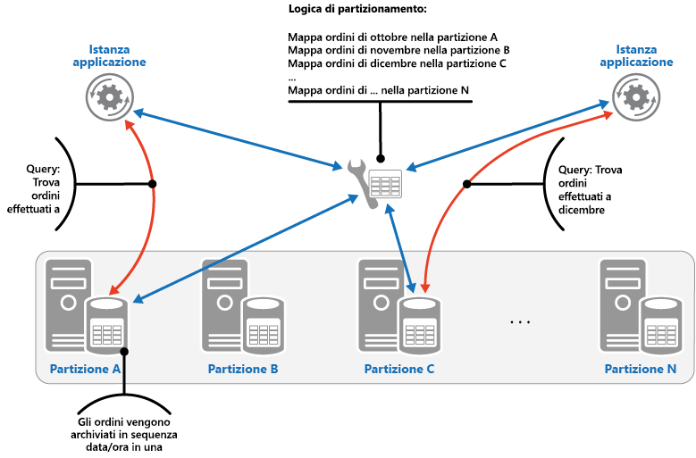
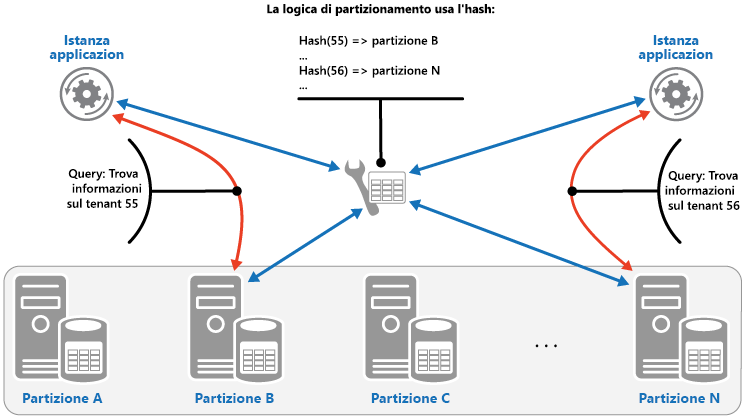

# <a name="sharding-pattern"></a>Modello di partizionamento orizzontale

[!INCLUDE [header](../_includes/header.md)]

Dividere un archivio dati in un set di partizioni orizzontali. Questa operazione può migliorare la scalabilità per l'archiviazione e l'accesso a grandi volumi di dati.

## <a name="context-and-problem"></a>Contesto e problema

Un archivio dati ospitato in un singolo server può essere soggetto alle limitazioni seguenti:

- **Spazio di archiviazione**. Un archivio dati per un'applicazione cloud su larga scala è progettato per contenere un'enorme quantità di dati che può aumentare considerevolmente nel tempo. In un server, la quantità di spazio di archiviazione su disco è in genere limitata, ma è possibile sostituire i dischi esistenti con versioni più capienti o aggiungere altri dischi in un computer man mano che i volumi di dati aumentano. Il sistema finirà tuttavia per raggiungere un limite in cui non è più possibile aumentare facilmente la capacità di archiviazione di un server specifico.

- **Risorse di calcolo**. Un'applicazione cloud è progettata per supportare un numero elevato di utenti simultanei, ognuno dei quali esegue query che recuperano informazioni dall'archivio dati. Se l'archivio dati è ospitato in un server singolo, tale server potrebbe non essere in grado di offrire la potenza di elaborazione necessaria a supportare il carico di lavoro, con conseguente allungamento dei tempi di risposta per gli utenti e frequenti errori di timeout delle applicazioni che tentano di archiviare e recuperare i dati. Si potrebbe aggiungere memoria o processori di aggiornamento, ma il sistema raggiungerà un limite in cui non è più possibile aumentare ulteriormente le risorse di calcolo.

- **Larghezza di banda della rete**. Le prestazioni di un archivio dati in esecuzione in un server singolo solo sostanzialmente governate dalla frequenza con cui il server può ricevere richieste e inviare risposte. È possibile che il volume di traffico della rete superi la capacità della rete usata per la connessione al server e che pertanto le richieste non riescano.

- **Geografia**. Potrebbe essere necessario archiviare i dati generati da utenti specifici nella stessa area degli utenti stessi per motivi legali, di conformità o di prestazioni o per ridurre la latenza dell'accesso ai dati. Se gli utenti sono distribuiti in più aree o paesi diversi, potrebbe non essere possibile archiviare tutti i dati per l'applicazione in un unico archivio dati.

La scalabilità verticale tramite l'aggiunta di capacità del disco, potenza di elaborazione, memoria e connessioni di rete può rimandare gli effetti di alcune di queste limitazioni, ma è probabilmente una soluzione solo temporanea. Un'applicazione cloud commerciale in grado di supportare un numero elevato di utenti e i volumi elevati di dati deve essere in grado di scalare pressoché indefinitamente, pertanto la scalabilità verticale non è necessariamente la soluzione migliore.

## <a name="solution"></a>Soluzione

È possibile dividere un archivio dati in partizioni orizzontali. Ogni partizione ha lo stesso schema, ma contiene il proprio subset di dati distinto. Una partizione è un archivio dati a sé stante (può contenere i dati per molte entità di tipi diversi), in esecuzione in un server che funge da nodo di archiviazione.

Questo modello offre i vantaggi seguenti:

- È possibile scalare il sistema orizzontalmente aggiungendo altre partizioni che vengono eseguite in altri nodi di archiviazione.

- Un sistema può usare hardware preconfigurato anziché computer specializzati e costosi per ogni nodo di archiviazione.

- È possibile ridurre la contesa e migliorare le prestazioni bilanciando il carico di lavoro tra le partizioni.

- Nel cloud, le partizioni possono essere situate fisicamente vicino agli utenti che accedono ai dati.

Quando si divide un archivio dati in partizioni, decidere quali dati devono essere inseriti in ognuna. Una partizione contiene, in genere, elementi che rientrano in un intervallo specificato, determinato da uno o più attributi dei dati. Questi attributi costituiscono la chiave di partizione. La chiave di partizione deve essere statica. Non deve essere basata su dati che potrebbero cambiare.

Il partizionamento orizzontale organizza fisicamente i dati. Quando un'applicazione archivia e recupera i dati, la logica di partizionamento orizzontale indirizza l'applicazione verso la partizione appropriata. Questa logica di partizionamento può essere implementata come parte del codice di accesso ai dati nell'applicazione. Può, in alternativa, essere implementata dal sistema di archiviazione dei dati se supporta il partizionamento orizzontale in modo trasparente.

L'astrazione della posizione fisica dei dati nella logica di partizionamento orizzontale offre un elevato livello di controllo su quali partizioni contengono quali dati. Consente inoltre la migrazione dei dati tra le partizioni senza dover rielaborare la logica di business di un'applicazione nel caso in cui i dati nelle partizioni debbano essere ridistribuiti in un secondo momento (ad esempio, se le partizioni diventano sbilanciate). Il compromesso è il sovraccarico nell'accesso ai dati aggiuntivo necessario per determinare la posizione di ogni elemento dati che viene recuperato.

Per assicurare prestazioni e scalabilità ottimali, è importante suddividere i dati in un modo appropriato ai tipi di query che vengono eseguite dall'applicazione. In molti casi, è improbabile che lo schema di partizionamento corrisponda esattamente ai requisiti di ogni query. In un sistema multi-tenant, ad esempio, un'applicazione potrebbe avere bisogno di recuperare i dati di tenant usando l'ID tenant, ma potrebbe avere bisogno anche di cercare questi dati in base a qualche altro attributo, ad esempio la posizione o il nome del tenant. Per gestire queste situazioni, implementare una strategia di partizionamento orizzontale con una chiave di partizione che supporti le query di uso più comune.

Se le query recuperano regolarmente i dati usando una combinazione di valori di attributo, è probabilmente possibile definire una chiave di partizione composita collegando insieme gli attributi. In alternativa, usare un modello, ad esempio [Tabella dell'indice](./index-table.md) per offrire una ricerca veloce dei dati in base ad attributi che non sono coperti dalla chiave di partizione.

## <a name="sharding-strategies"></a>Strategie di partizionamento

Quando si seleziona una chiave di partizionamento e si decide come distribuire i dati tra le partizioni, si usano in genere tre strategie. Si noti che non è necessario che vi sia una corrispondenza uno a uno tra le partizioni e i server che le ospitano. Un singolo server può ospitare più partizioni. Le strategie sono:

**Strategia di ricerca**. In questa strategia la logica di partizionamento orizzontale implementa una mappa che esegue il routing di una richiesta di dati verso la partizione che contiene quei dati usando la chiave di partizione. In un'applicazione multi-tenant, tutti i dati per un tenant possono essere archiviati insieme in una partizione usando l'ID tenant come chiave di partizione. Più tenant possono condividere la stessa partizione, ma i dati per un singolo tenant non vengono distribuiti tra più partizioni. Nella figura seguente viene illustrato il partizionamento dei dati di tenant in base agli ID tenant.

   

Il mapping tra la chiave di partizione e l'archiviazione fisica può essere basato su partizioni fisiche in cui ogni chiave di partizione esegue il mapping a una partizione fisica. In alternativa, una tecnica più flessibile per il ribilanciamento delle partizioni è il partizionamento virtuale, dove la chiave di partizionamento esegue il mapping allo stesso numero di partizioni virtuali, che a loro volta eseguono il mapping a un numero inferiore di partizioni fisiche. In questo approccio, un'applicazione individua i dati tramite una chiave di partizione che fa riferimento a una partizione virtuale e il sistema esegue il mapping trasparente delle partizioni virtuali alle partizioni fisiche. Il mapping tra una partizione virtuale e una fisica può cambiare senza dover modificare il codice dell'applicazione per usare un set diverso di chiavi di partizione.

**Strategia di intervallo**. Questa strategia raggruppa gli elementi correlati nella stessa partizione e li ordina in base alla chiave di partizione. Le chiavi di partizione sono sequenziali. Questa strategia è utile per le applicazioni che recuperano spesso set di elementi usando query di intervallo, vale a dire query che restituiscono un set di dati per una chiave di partizione che rientra in un intervallo specificato. Se, ad esempio, un'applicazione deve regolarmente trovare tutti gli ordini effettuati in un determinato mese, questi dati possono essere recuperati più rapidamente se sono archiviati in ordine di data e ora nella stessa partizione. Se ogni ordine fosse archiviato in una partizione diversa, lo si dovrebbe recuperare individualmente mediante l'esecuzione di un numero elevato di query di tipo punto, vale a dire di query che restituiscono un singolo elemento dati. La figura successiva illustra l'archiviazione di set sequenziali (intervalli) di dati in partizioni.

   

In questo esempio, la chiave di partizione è una chiave composta contenente il mese degli ordini come elemento più significativo, seguito dal giorno e dall'ora degli ordini. I dati degli ordini vengono ordinati naturalmente quando nuovi ordini vengono creati e aggiunti a una partizione. Alcuni archivi dati supportano chiavi di partizionamento in due parti contenenti un elemento di chiave di partizione che identifica la partizione e una chiave di riga che identifica in modo univoco un elemento nella partizione. I dati vengono in genere conservati in ordine di chiave di riga nella partizione. Gli elementi che sono soggetti a query di intervallo e devono essere raggruppati possono usare una chiave di partizione che ha lo stesso valore per la chiave di partizione, ma un valore univoco per la chiave di riga.

**Strategia Hash**. Lo scopo di questa strategia consiste nel ridurre l'eventualità che si creino aree sensibili, vale a dire partizioni che ricevono una quantità sproporzionata di carico. Questa strategia distribuisce i dati tra le partizioni in modo da ottenere un equilibrio tra la dimensione di ogni partizione e il carico medio che interessa ogni partizione. La logica di partizionamento calcola la partizione per archiviare un elemento in base a un hash di uno o più attributi dei dati. La funzione hash scelta deve distribuire i dati uniformemente tra le partizioni, possibilmente introducendo un elemento casuale nel calcolo. Nella figura riportata di seguito viene illustrato il partizionamento dei dati di tenant in base a un hash di ID tenant.

   

Per comprendere il vantaggio della strategia Hash rispetto alle altre strategie di partizionamento orizzontale, considerare in che modo un'applicazione multi-tenant che registra in modo sequenziale nuovi tenant potrebbe assegnare i tenant a partizioni nell'archivio dati. Quando si usa la strategia di intervallo, i dati per i tenant da 1 a n vengono memorizzato nella partizione A, quelli per i tenant da n+1 a m vengono memorizzati nella partizione B e così via. Se i tenant registrati più di recente sono anche i più attivi, la maggior parte delle attività di dati si verificherà in un numero ridotto di partizioni, creando così aree sensibili. La strategia Hash, al contrario, alloca i tenant alle partizioni in base a un hash dei relativi ID tenant. Ciò significa che i tenant sequenziali sono probabilmente da allocare in partizioni diverse, con conseguente distribuzione del carico tra di loro. La figura precedente mostra questa situazione per i tenant 55 e 56.

Le tre strategie di partizionamento orizzontale presentano i vantaggi e le considerazioni seguenti:

- **Ricerca**. Questa strategia offre maggiore controllo sulle modalità di configurazione e di utilizzo delle partizioni. L'utilizzo di partizioni virtuali riduce l'impatto durante il ribilanciamento dei dati poiché consente di aggiungere nuove partizioni fisiche per bilanciare il carico di lavoro. Il mapping tra una partizione virtuale e le partizioni fisiche che implementano la partizione può essere modificato senza influire sul codice dell'applicazione che usa una chiave di partizione per archiviare e recuperare i dati. La ricerca delle posizioni delle partizioni può imporre un sovraccarico aggiuntivo.

- **Intervallo**. Questa strategia è facile da implementare ed è ideale con le query di intervallo, in quanto possono spesso recuperare più elementi dati da una singola partizione con una singola operazione. Questa strategia offre una gestione dei dati più semplice. Se, ad esempio, gli utenti nella stessa area si trovano nella stessa partizione, è possibile programmare gli aggiornamenti in ogni fuso orario in base al modello di carico e richiesta locale. Questa strategia, tuttavia, non fornisce il bilanciamento ottimale tra le partizioni. Il ribilanciamento delle partizioni è difficile e potrebbe non risolvere il problema di carico non uniforme se la maggior parte delle attività è per le chiavi di partizione adiacenti.

- **Hash**. Questa strategia offre più possibilità di distribuire i dati e il carico in modo uniforme. Il routing delle richieste può essere eseguito direttamente tramite la funzione hash. Non è necessario mantenere una mappa. Si noti che il calcolo dell'hash impone un sovraccarico aggiuntivo. Il ribilanciamento delle partizioni risulta inoltre difficile.

I sistemi più comuni di partizionamento orizzontale implementano uno degli approcci descritti in precedenza, ma occorre anche considerare i requisiti aziendali delle applicazioni e i relativi modelli di utilizzo dei dati. In un'applicazione multi-tenant, ad esempio:

- È possibile partizionare i dati in base al carico di lavoro. È possibile separare i dati per i tenant altamente volatili in partizioni separate. La velocità di accesso ai dati per altri tenant potrebbe essere migliorata di conseguenza.

- È possibile partizionare i dati in base alla posizione dei tenant. È possibile portare i dati di tenant in un'area geografica specifica offline per la manutenzione e il backup durante le ore non di punta nell'area, mentre i dati dei tenant in altre aree restano online e accessibili durante le ore lavorative.

- È possibile assegnare ai tenant di alto valore partizioni private, ad alte prestazioni e a basso carico, mentre si può prevedere la condivisione di partizioni ad alta densità di utilizzo per i tenant di basso valore.

- I dati dei tenant che richiedono un elevato grado di isolamento dei dati e di privacy possono essere archiviati in un server completamente separato.

## <a name="scaling-and-data-movement-operations"></a>Operazioni di spostamento dei dati e scalabilità

Ognuna delle strategie di partizionamento orizzontale implica funzionalità e livelli di complessità diversi per la gestione della scalabilità orizzontale e verticale, lo spostamento dei dati e la gestione dello stato.

La strategia di ricerca consente di eseguire operazioni di spostamento dei dati e scalabilità a livello di utente, online o offline. La tecnica consiste nel sospendere alcune o tutte le attività dell'utente (ad esempio durante i periodi non di punta), spostare i dati nella nuova partizione virtuale o fisica, modificare i mapping, invalidare o aggiornare tutte le cache che contengono questi dati e successivamente consentire all'utente la ripresa dell'attività. Questo tipo di operazione spesso può essere gestito centralmente. La strategia di ricerca richiede che lo stato sia altamente memorizzabile nella cache e replicabile.

La strategia di intervallo impone alcune limitazioni sulle operazioni di spostamento dei dati e di scalabilità, che in genere devono essere effettuate quando l'archivio dati o una parte di esso è offline, poiché i dati devono essere suddivisi e uniti tra le partizioni. Lo spostamento dei dati per ribilanciare le partizioni potrebbe non risolvere il problema di carico non uniforme se la maggior parte delle attività avviene per le chiavi di partizione adiacenti o gli identificatori di dati che rientrano nello stesso intervallo. La strategia di intervallo potrebbe anche richiedere il mantenimento dello stato per eseguire il mapping degli intervalli nelle partizioni fisiche.

La strategia Hash rende più complesse le operazioni di spostamento dei dati e di scalabilità perché le chiavi di partizione sono hash degli identificatori di dati o delle chiavi di partizione. La nuova posizione di ciascuna partizione deve essere determinata dalla funzione hash o dalla funzione modificata per creare i mapping corretti. La strategia Hash non richiede invece la manutenzione dello stato.

## <a name="issues-and-considerations"></a>Considerazioni e problemi

Prima di decidere come implementare questo modello, considerare quanto segue:

- Il partizionamento orizzontale è complementare ad altre forme di partizionamento, ad esempio il partizionamento verticale e il partizionamento funzionale. Una singola partizione, ad esempio, può contenere entità che sono state partizionate verticalmente e una partizione funzionale può essere implementata come più partizioni. Per altre informazioni sul partizionamento, vedere [Linee guida di partizionamento di dati](https://msdn.microsoft.com/library/dn589795.aspx).

- Mantenere le partizioni equilibrate in modo che tutte gestiscano un volume di I/O simile. Dal momento che i dati vengono inseriti ed eliminati, è necessario ribilanciare periodicamente le partizioni per garantire una distribuzione uniforme e per ridurre le possibilità che si creino aree sensibili. Il ribilanciamento può essere un'operazione costosa. Per ridurre la necessità di ribilanciamento, pianificare la crescita assicurando che ogni partizione contenga spazio libero sufficiente per gestire il volume previsto di modifiche. Occorre inoltre sviluppare strategie e script da usare per ribilanciare rapidamente le partizioni in caso di necessità.

- Usare dati stabili per la chiave di partizione. Se la chiave di partizione cambia, è possibile che l'elemento dati corrispondente debba essere spostato tra partizioni, aumentando la quantità di lavoro eseguito dalle operazioni di aggiornamento. Per questo motivo, evitare di basare la chiave di partizione su informazioni potenzialmente volatili. Cercare invece attributi che siano invariabili o che formino una chiave naturalmente.

- Assicurarsi che le chiavi di partizione siano univoche. Evitare, ad esempio, di usare campi a incremento automatico come chiavi di partizione. In alcuni sistemi, non è possibile coordinare i campi a incremento automatico tra le partizioni. Ciò determina la presenza di elementi in partizioni differenti che hanno la stessa chiave di partizione.

    >  Anche i valori che vengono incrementati automaticamente in altri campi che non sono chiavi di partizione possono causare problemi. Se, ad esempio, si usano campi a incremento automatico per generare ID univoci, è possibile che a due diversi elementi posti in partizioni diverse venga assegnato lo stesso ID.

- Potrebbe non essere possibile progettare una chiave di partizione che corrisponde ai requisiti di ogni possibile query sui dati. Partizionare i dati per supportare le query di uso più comune e, se necessario, creare tabelle dell'indice secondarie per supportare le query che recuperano i dati usando criteri basati su attributi che non fanno parte della chiave di partizione. Per altre informazioni, vedere [Index Table pattern](./index-table.md) (Modello di tabella dell'indice).

- Le query che accedono solo a una singola partizione sono più efficienti di quelle che recuperano i dati da più partizioni. È pertanto consigliabile evitare di implementare un sistema di partizionamento orizzontale che comporta da parte delle applicazioni l'esecuzione di un numero elevato di query che creano un join con i dati contenuti in partizioni diverse. Ricordare che una singola partizione può contenere i dati di più tipi di entità. Considerare la denormalizzazione dei dati per mantenere le entità correlate comunemente soggette a query (ad esempio i dettagli di clienti e ordini inseriti) nella stessa partizione per ridurre il numero di letture separate eseguite da un'applicazione.

    >  Se un'entità in una partizione fa riferimento a un'entità memorizzata in un'altra partizione, includere la chiave di partizione della seconda entità come parte dello schema della prima entità. Questa operazione può contribuire a migliorare le prestazioni delle query che fanno riferimento a dati correlati tra partizioni.

- Se un'applicazione deve eseguire query che recuperano dati da più partizioni, potrebbe essere possibile recuperare questi dati tramite attività in parallelo. Un esempio sono le query di tipo fan-out, in cui i dati di più partizioni vengono recuperati in parallelo e quindi aggregati in un singolo risultato. Questo approccio aumenta tuttavia inevitabilmente il livello di complessità della logica di accesso ai dati di una soluzione.

- Per molte applicazioni, la creazione di un numero elevato di partizioni di piccole dimensioni può essere più efficiente rispetto all'utilizzo di un numero ridotto di partizioni di grandi dimensioni, perché può offrire maggiori opportunità di bilanciamento del carico. Questo approccio può essere utile anche quando si prevede di dover migrare le partizioni da una posizione fisica a un'altra. Lo spostamento di una partizione di piccole dimensioni è più rapido rispetto allo spostamento di una di grandi dimensioni.

- Verificare che le risorse disponibili in ogni nodo di archiviazione della partizione siano sufficienti per gestire i requisiti di scalabilità in termini di dimensioni dei dati e di velocità effettiva. Per altre informazioni, vedere la sezione "Progettazione di partizioni per la scalabilità" nel [Linee guida di partizionamento di dati](https://msdn.microsoft.com/library/dn589795.aspx).

- Prendere in considerazione di replicare i dati di riferimento in tutte le partizioni. Se un'operazione che recupera i dati da una partizione fa anche riferimento a dati statici o lenti come parte della stessa query, aggiungere questi dati alla partizione. L'applicazione può quindi recuperare facilmente tutti i dati per la query, senza dover eseguire un round trip aggiuntivo in un archivio dati separato.

    >  Se i dati di riferimento contenuti in più partizioni cambiano, il sistema deve sincronizzare le modifiche tra tutte le partizioni. Il sistema può essere soggetto a un livello di incoerenza durante la sincronizzazione. In questo caso, è consigliabile progettare le applicazioni in modo che possano gestire questa situazione.

- Può essere difficile mantenere l'integrità referenziale e la coerenza tra le partizioni, pertanto è necessario ridurre al minimo le operazioni che influiscono sui dati in più partizioni. Se un'applicazione deve modificare i dati tra partizioni, valutare se la coerenza dei dati completa è effettivamente necessaria. Al contrario, un approccio comune nel cloud consiste nell'implementare la coerenza finale. I dati in ogni partizione vengono aggiornati separatamente e la logica dell'applicazione deve garantire che tutti gli aggiornamenti vengano completati correttamente, nonché gestire le incoerenze che possono sorgere dalle query sui dati durante l'esecuzione di un'operazione con coerenza finale. Per altre informazioni sull'implementazione della coerenza finale, vedere [Data Consistency Primer](https://msdn.microsoft.com/library/dn589800.aspx) (Informazioni relative alla coerenza dei dati).

- La configurazione e la gestione di un numero elevato di partizioni possono risultare difficili. Le attività, quali il monitoraggio, il backup, il controllo della coerenza e la registrazione o il controllo, devono essere eseguite in più partizioni e server, possibilmente contenuti in più posizioni. Queste attività vengono implementate usando script o altre soluzioni di automazione, ma ciò potrebbe non eliminare completamente i requisiti amministrativi aggiuntivi.

- Le partizioni possono essere posizionate geograficamente in modo che i dati in esse contenuti siano vicini alle istanze di un'applicazione che li usano. Questo approccio consente di migliorare notevolmente le prestazioni, ma richiede considerazioni aggiuntive sulle attività che devono accedere a più partizioni in posizioni diverse.

## <a name="when-to-use-this-pattern"></a>Quando usare questo modello

Usare questo modello quando un archivio dati deve essere ridimensionato oltre le risorse disponibili a un singolo nodo di archiviazione o per migliorare le prestazioni riducendo la contesa in un archivio dati.

> [!NOTE]
L'obiettivo principale del partizionamento orizzontale è di migliorare le prestazioni e la scalabilità di un sistema, ma come sottoprodotto può anche migliorare la disponibilità a causa della modalità di suddivisione dei dati in partizioni distinte. Un errore in una partizione non impedisce necessariamente a un'applicazione di accedere ai dati contenuti in altre partizioni e un operatore può eseguire la manutenzione o il ripristino di una o più partizioni senza rendere inaccessibili tutti i dati a un'applicazione. Per altre informazioni, vedere [Linee guida di partizionamento di dati](https://msdn.microsoft.com/library/dn589795.aspx).

## <a name="example"></a>Esempio

L'esempio in C# riportato di seguito usa un set di database SQL Server che fungono da partizioni. Ogni database contiene un subset dei dati usati da un'applicazione. L'applicazione recupera i dati distribuiti tra le partizioni usando la propria logica di partizionamento (si tratta di un esempio di query di tipo fan-out). I dettagli dei dati che si trovano in ogni partizione vengono restituiti da un metodo denominato `GetShards`. Questo metodo restituisce un elenco enumerabile di oggetti `ShardInformation`, in cui il tipo `ShardInformation` contiene un identificatore per ogni partizione e la stringa di connessione di SQL Server che un'applicazione deve usare per connettersi alla partizione (le stringhe di connessione non vengono mostrate nell'esempio di codice).

```csharp
private IEnumerable<ShardInformation> GetShards()
{
  // This retrieves the connection information from a shard store
  // (commonly a root database).
  return new[]
  {
    new ShardInformation
    {
      Id = 1,
      ConnectionString = ...
    },
    new ShardInformation
    {
      Id = 2,
      ConnectionString = ...
    }
  };
}
```

Nel codice riportato di seguito viene illustrato in che modo l'applicazione usa l'elenco di oggetti `ShardInformation` per eseguire una query che recupera i dati da ogni partizione in parallelo. I dettagli della query non vengono visualizzati, ma in questo esempio i dati recuperati contengono una stringa che può contenere informazioni come il nome di un cliente se le partizioni contengono i dettagli dei clienti. I risultati vengono aggregati in una raccolta `ConcurrentBag` per essere elaborati dall'applicazione.

```csharp
// Retrieve the shards as a ShardInformation[] instance.
var shards = GetShards();

var results = new ConcurrentBag<string>();

// Execute the query against each shard in the shard list.
// This list would typically be retrieved from configuration
// or from a root/master shard store.
Parallel.ForEach(shards, shard =>
{
  // NOTE: Transient fault handling isn't included,
  // but should be incorporated when used in a real world application.
  using (var con = new SqlConnection(shard.ConnectionString))
  {
    con.Open();
    var cmd = new SqlCommand("SELECT ... FROM ...", con);

    Trace.TraceInformation("Executing command against shard: {0}", shard.Id);

    var reader = cmd.ExecuteReader();
    // Read the results in to a thread-safe data structure.
    while (reader.Read())
    {
      results.Add(reader.GetString(0));
    }
  }
});

Trace.TraceInformation("Fanout query complete - Record Count: {0}",
                        results.Count);
```

## <a name="related-patterns-and-guidance"></a>Modelli correlati e informazioni aggiuntive

Per l'implementazione di questo modello possono risultare utili i modelli e le informazioni aggiuntive seguenti:

- [Nozioni di base sulla coerenza dei dati](https://msdn.microsoft.com/library/dn589800.aspx). Potrebbe essere necessario mantenere la coerenza dei dati distribuiti tra partizioni diverse. Questo argomento riepiloga i problemi da affrontare per mantenere la coerenza dei dati distribuiti e descrive i vantaggi e i compromessi di diversi modelli di coerenza.
- [Linee guida di partizionamento di dati](https://msdn.microsoft.com/library/dn589795.aspx). Il partizionamento orizzontale di un archivio dati può introdurre una gamma di problemi aggiuntivi. Descrive questi problemi in relazione al partizionamento di archivi dati nel cloud per migliorare la scalabilità, ridurre la contesa e ottimizzare le prestazioni.
- [Modello di tabella degli indici](./index-table.md). In alcuni casi, non è possibile supportare completamente le query solo tramite la progettazione della chiave di partizione. Consente a un'applicazione di recuperare rapidamente i dati da un archivio dati di grandi dimensioni, specificando una chiave diversa dalla chiave di partizione.
- [Modello di vista materializzata](./materialized-view.md). Per mantenere le prestazioni di alcune operazioni di query, è utile creare viste materializzate grado di aggregare e riepilogare i dati, soprattutto se questi dati di riepilogo si basano su informazioni distribuite in più partizioni. Descrive come generare e popolare queste viste.
