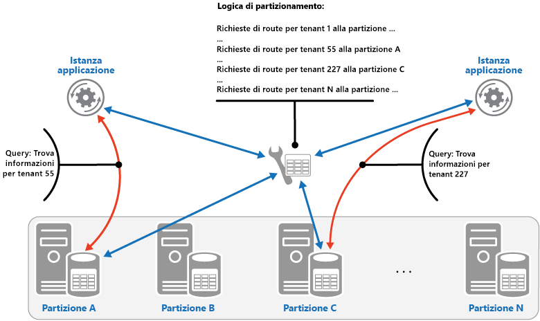

# <a name="sharding-pattern"></a><span data-ttu-id="63d9f-104">Modello di partizionamento orizzontale</span><span class="sxs-lookup"><span data-stu-id="63d9f-104">Sharding pattern</span></span>

[!INCLUDE [header](../_includes/header.md)]

<span data-ttu-id="63d9f-105">Dividere un archivio dati in un set di partizioni orizzontali.</span><span class="sxs-lookup"><span data-stu-id="63d9f-105">Divide a data store into a set of horizontal partitions or shards.</span></span> <span data-ttu-id="63d9f-106">Questa operazione può migliorare la scalabilità per l'archiviazione e l'accesso a grandi volumi di dati.</span><span class="sxs-lookup"><span data-stu-id="63d9f-106">This can improve scalability when storing and accessing large volumes of data.</span></span>

## <a name="context-and-problem"></a><span data-ttu-id="63d9f-107">Contesto e problema</span><span class="sxs-lookup"><span data-stu-id="63d9f-107">Context and problem</span></span>

<span data-ttu-id="63d9f-108">Un archivio dati ospitato in un singolo server può essere soggetto alle limitazioni seguenti:</span><span class="sxs-lookup"><span data-stu-id="63d9f-108">A data store hosted by a single server might be subject to the following limitations:</span></span>

- <span data-ttu-id="63d9f-109">**Spazio di archiviazione**.</span><span class="sxs-lookup"><span data-stu-id="63d9f-109">**Storage space**.</span></span> <span data-ttu-id="63d9f-110">Un archivio dati per un'applicazione cloud su larga scala è progettato per contenere un'enorme quantità di dati che può aumentare considerevolmente nel tempo.</span><span class="sxs-lookup"><span data-stu-id="63d9f-110">A data store for a large-scale cloud application is expected to contain a huge volume of data that could increase significantly over time.</span></span> <span data-ttu-id="63d9f-111">In un server, la quantità di spazio di archiviazione su disco è in genere limitata, ma è possibile sostituire i dischi esistenti con versioni più capienti o aggiungere altri dischi in un computer man mano che i volumi di dati aumentano.</span><span class="sxs-lookup"><span data-stu-id="63d9f-111">A server typically provides only a finite amount of disk storage, but you can replace existing disks with larger ones, or add further disks to a machine as data volumes grow.</span></span> <span data-ttu-id="63d9f-112">Il sistema finirà tuttavia per raggiungere un limite in cui non è più possibile aumentare facilmente la capacità di archiviazione di un server specifico.</span><span class="sxs-lookup"><span data-stu-id="63d9f-112">However, the system will eventually reach a limit where it isn't possible to easily increase the storage capacity on a given server.</span></span>

- <span data-ttu-id="63d9f-113">**Risorse di calcolo**.</span><span class="sxs-lookup"><span data-stu-id="63d9f-113">**Computing resources**.</span></span> <span data-ttu-id="63d9f-114">Un'applicazione cloud è progettata per supportare un numero elevato di utenti simultanei, ognuno dei quali esegue query che recuperano informazioni dall'archivio dati.</span><span class="sxs-lookup"><span data-stu-id="63d9f-114">A cloud application is required to support a large number of concurrent users, each of which run queries that retrieve information from the data store.</span></span> <span data-ttu-id="63d9f-115">Se l'archivio dati è ospitato in un server singolo, tale server potrebbe non essere in grado di offrire la potenza di elaborazione necessaria a supportare il carico di lavoro, con conseguente allungamento dei tempi di risposta per gli utenti e frequenti errori di timeout delle applicazioni che tentano di archiviare e recuperare i dati. Si potrebbe aggiungere memoria o processori di aggiornamento, ma il sistema raggiungerà un limite in cui non è più possibile aumentare ulteriormente le risorse di calcolo.</span><span class="sxs-lookup"><span data-stu-id="63d9f-115">A single server hosting the data store might not be able to provide the necessary computing power to support this load, resulting in extended response times for users and frequent failures as applications attempting to store and retrieve data time out. It might be possible to add memory or upgrade processors, but the system will reach a limit when it isn't possible to increase the compute resources any further.</span></span>

- <span data-ttu-id="63d9f-116">**Larghezza di banda della rete**.</span><span class="sxs-lookup"><span data-stu-id="63d9f-116">**Network bandwidth**.</span></span> <span data-ttu-id="63d9f-117">Le prestazioni di un archivio dati in esecuzione in un server singolo solo sostanzialmente governate dalla frequenza con cui il server può ricevere richieste e inviare risposte.</span><span class="sxs-lookup"><span data-stu-id="63d9f-117">Ultimately, the performance of a data store running on a single server is governed by the rate the server can receive requests and send replies.</span></span> <span data-ttu-id="63d9f-118">È possibile che il volume di traffico della rete superi la capacità della rete usata per la connessione al server e che pertanto le richieste non riescano.</span><span class="sxs-lookup"><span data-stu-id="63d9f-118">It's possible that the volume of network traffic might exceed the capacity of the network used to connect to the server, resulting in failed requests.</span></span>

- <span data-ttu-id="63d9f-119">**Geografia**.</span><span class="sxs-lookup"><span data-stu-id="63d9f-119">**Geography**.</span></span> <span data-ttu-id="63d9f-120">Potrebbe essere necessario archiviare i dati generati da utenti specifici nella stessa area degli utenti stessi per motivi legali, di conformità o di prestazioni o per ridurre la latenza dell'accesso ai dati.</span><span class="sxs-lookup"><span data-stu-id="63d9f-120">It might be necessary to store data generated by specific users in the same region as those users for legal, compliance, or performance reasons, or to reduce latency of data access.</span></span> <span data-ttu-id="63d9f-121">Se gli utenti sono distribuiti in più aree o paesi diversi, potrebbe non essere possibile archiviare tutti i dati per l'applicazione in un unico archivio dati.</span><span class="sxs-lookup"><span data-stu-id="63d9f-121">If the users are dispersed across different countries or regions, it might not be possible to store the entire data for the application in a single data store.</span></span>

<span data-ttu-id="63d9f-122">La scalabilità verticale tramite l'aggiunta di capacità del disco, potenza di elaborazione, memoria e connessioni di rete può rimandare gli effetti di alcune di queste limitazioni, ma è probabilmente una soluzione solo temporanea.</span><span class="sxs-lookup"><span data-stu-id="63d9f-122">Scaling vertically by adding more disk capacity, processing power, memory, and network connections can postpone the effects of some of these limitations, but it's likely to only be a temporary solution.</span></span> <span data-ttu-id="63d9f-123">Un'applicazione cloud commerciale in grado di supportare un numero elevato di utenti e i volumi elevati di dati deve essere in grado di scalare pressoché indefinitamente, pertanto la scalabilità verticale non è necessariamente la soluzione migliore.</span><span class="sxs-lookup"><span data-stu-id="63d9f-123">A commercial cloud application capable of supporting large numbers of users and high volumes of data must be able to scale almost indefinitely, so vertical scaling isn't necessarily the best solution.</span></span>

## <a name="solution"></a><span data-ttu-id="63d9f-124">Soluzione</span><span class="sxs-lookup"><span data-stu-id="63d9f-124">Solution</span></span>

<span data-ttu-id="63d9f-125">È possibile dividere un archivio dati in partizioni orizzontali.</span><span class="sxs-lookup"><span data-stu-id="63d9f-125">Divide the data store into horizontal partitions or shards.</span></span> <span data-ttu-id="63d9f-126">Ogni partizione ha lo stesso schema, ma contiene il proprio subset di dati distinto.</span><span class="sxs-lookup"><span data-stu-id="63d9f-126">Each shard has the same schema, but holds its own distinct subset of the data.</span></span> <span data-ttu-id="63d9f-127">Una partizione è un archivio dati a sé stante (può contenere i dati per molte entità di tipi diversi), in esecuzione in un server che funge da nodo di archiviazione.</span><span class="sxs-lookup"><span data-stu-id="63d9f-127">A shard is a data store in its own right (it can contain the data for many entities of different types), running on a server acting as a storage node.</span></span>

<span data-ttu-id="63d9f-128">Questo modello offre i vantaggi seguenti:</span><span class="sxs-lookup"><span data-stu-id="63d9f-128">This pattern has the following benefits:</span></span>

- <span data-ttu-id="63d9f-129">È possibile scalare il sistema orizzontalmente aggiungendo altre partizioni che vengono eseguite in altri nodi di archiviazione.</span><span class="sxs-lookup"><span data-stu-id="63d9f-129">You can scale the system out by adding further shards running on additional storage nodes.</span></span>

- <span data-ttu-id="63d9f-130">Un sistema può usare hardware preconfigurato anziché computer specializzati e costosi per ogni nodo di archiviazione.</span><span class="sxs-lookup"><span data-stu-id="63d9f-130">A system can use off-the-shelf hardware rather than specialized and expensive computers for each storage node.</span></span>

- <span data-ttu-id="63d9f-131">È possibile ridurre la contesa e migliorare le prestazioni bilanciando il carico di lavoro tra le partizioni.</span><span class="sxs-lookup"><span data-stu-id="63d9f-131">You can reduce contention and improve performance by balancing the workload across shards.</span></span>

- <span data-ttu-id="63d9f-132">Nel cloud, le partizioni possono essere situate fisicamente vicino agli utenti che accedono ai dati.</span><span class="sxs-lookup"><span data-stu-id="63d9f-132">In the cloud, shards can be located physically close to the users that'll access the data.</span></span>

<span data-ttu-id="63d9f-133">Quando si divide un archivio dati in partizioni, decidere quali dati devono essere inseriti in ognuna.</span><span class="sxs-lookup"><span data-stu-id="63d9f-133">When dividing a data store up into shards, decide which data should be placed in each shard.</span></span> <span data-ttu-id="63d9f-134">Una partizione contiene, in genere, elementi che rientrano in un intervallo specificato, determinato da uno o più attributi dei dati.</span><span class="sxs-lookup"><span data-stu-id="63d9f-134">A shard typically contains items that fall within a specified range determined by one or more attributes of the data.</span></span> <span data-ttu-id="63d9f-135">Questi attributi costituiscono la chiave di partizione.</span><span class="sxs-lookup"><span data-stu-id="63d9f-135">These attributes form the shard key (sometimes referred to as the partition key).</span></span> <span data-ttu-id="63d9f-136">La chiave di partizione deve essere statica.</span><span class="sxs-lookup"><span data-stu-id="63d9f-136">The shard key should be static.</span></span> <span data-ttu-id="63d9f-137">Non deve essere basata su dati che potrebbero cambiare.</span><span class="sxs-lookup"><span data-stu-id="63d9f-137">It shouldn't be based on data that might change.</span></span>

<span data-ttu-id="63d9f-138">Il partizionamento orizzontale organizza fisicamente i dati.</span><span class="sxs-lookup"><span data-stu-id="63d9f-138">Sharding physically organizes the data.</span></span> <span data-ttu-id="63d9f-139">Quando un'applicazione archivia e recupera i dati, la logica di partizionamento orizzontale indirizza l'applicazione verso la partizione appropriata.</span><span class="sxs-lookup"><span data-stu-id="63d9f-139">When an application stores and retrieves data, the sharding logic directs the application to the appropriate shard.</span></span> <span data-ttu-id="63d9f-140">Questa logica di partizionamento può essere implementata come parte del codice di accesso ai dati nell'applicazione. Può, in alternativa, essere implementata dal sistema di archiviazione dei dati se supporta il partizionamento orizzontale in modo trasparente.</span><span class="sxs-lookup"><span data-stu-id="63d9f-140">This sharding logic can be implemented as part of the data access code in the application, or it could be implemented by the data storage system if it transparently supports sharding.</span></span>

<span data-ttu-id="63d9f-141">L'astrazione della posizione fisica dei dati nella logica di partizionamento orizzontale offre un elevato livello di controllo su quali partizioni contengono quali dati.</span><span class="sxs-lookup"><span data-stu-id="63d9f-141">Abstracting the physical location of the data in the sharding logic provides a high level of control over which shards contain which data.</span></span> <span data-ttu-id="63d9f-142">Consente inoltre la migrazione dei dati tra le partizioni senza dover rielaborare la logica di business di un'applicazione nel caso in cui i dati nelle partizioni debbano essere ridistribuiti in un secondo momento (ad esempio, se le partizioni diventano sbilanciate).</span><span class="sxs-lookup"><span data-stu-id="63d9f-142">It also enables data to migrate between shards without reworking the business logic of an application if the data in the shards need to be redistributed later (for example, if the shards become unbalanced).</span></span> <span data-ttu-id="63d9f-143">Il compromesso è il sovraccarico nell'accesso ai dati aggiuntivo necessario per determinare la posizione di ogni elemento dati che viene recuperato.</span><span class="sxs-lookup"><span data-stu-id="63d9f-143">The tradeoff is the additional data access overhead required in determining the location of each data item as it's retrieved.</span></span>

<span data-ttu-id="63d9f-144">Per assicurare prestazioni e scalabilità ottimali, è importante suddividere i dati in un modo appropriato ai tipi di query che vengono eseguite dall'applicazione.</span><span class="sxs-lookup"><span data-stu-id="63d9f-144">To ensure optimal performance and scalability, it's important to split the data in a way that's appropriate for the types of queries that the application performs.</span></span> <span data-ttu-id="63d9f-145">In molti casi, è improbabile che lo schema di partizionamento corrisponda esattamente ai requisiti di ogni query.</span><span class="sxs-lookup"><span data-stu-id="63d9f-145">In many cases, it's unlikely that the sharding scheme will exactly match the requirements of every query.</span></span> <span data-ttu-id="63d9f-146">In un sistema multi-tenant, ad esempio, un'applicazione potrebbe avere bisogno di recuperare i dati di tenant usando l'ID tenant, ma potrebbe avere bisogno anche di cercare questi dati in base a qualche altro attributo, ad esempio la posizione o il nome del tenant.</span><span class="sxs-lookup"><span data-stu-id="63d9f-146">For example, in a multi-tenant system an application might need to retrieve tenant data using the tenant ID, but it might also need to look up this data based on some other attribute such as the tenant’s name or location.</span></span> <span data-ttu-id="63d9f-147">Per gestire queste situazioni, implementare una strategia di partizionamento orizzontale con una chiave di partizione che supporti le query di uso più comune.</span><span class="sxs-lookup"><span data-stu-id="63d9f-147">To handle these situations, implement a sharding strategy with a shard key that supports the most commonly performed queries.</span></span>

<span data-ttu-id="63d9f-148">Se le query recuperano regolarmente i dati usando una combinazione di valori di attributo, è probabilmente possibile definire una chiave di partizione composita collegando insieme gli attributi.</span><span class="sxs-lookup"><span data-stu-id="63d9f-148">If queries regularly retrieve data using a combination of attribute values, you can likely define a composite shard key by linking attributes together.</span></span> <span data-ttu-id="63d9f-149">In alternativa, usare un modello, ad esempio [Tabella dell'indice](./index-table.md) per offrire una ricerca veloce dei dati in base ad attributi che non sono coperti dalla chiave di partizione.</span><span class="sxs-lookup"><span data-stu-id="63d9f-149">Alternatively, use a pattern such as [Index Table](./index-table.md) to provide fast lookup to data based on attributes that aren't covered by the shard key.</span></span>

## <a name="sharding-strategies"></a><span data-ttu-id="63d9f-150">Strategie di partizionamento</span><span class="sxs-lookup"><span data-stu-id="63d9f-150">Sharding strategies</span></span>

<span data-ttu-id="63d9f-151">Quando si seleziona una chiave di partizionamento e si decide come distribuire i dati tra le partizioni, si usano in genere tre strategie.</span><span class="sxs-lookup"><span data-stu-id="63d9f-151">Three strategies are commonly used when selecting the shard key and deciding how to distribute data across shards.</span></span> <span data-ttu-id="63d9f-152">Si noti che non è necessario che vi sia una corrispondenza uno a uno tra le partizioni e i server che le ospitano. Un singolo server può ospitare più partizioni.</span><span class="sxs-lookup"><span data-stu-id="63d9f-152">Note that there doesn't have to be a one-to-one correspondence between shards and the servers that host them&mdash;a single server can host multiple shards.</span></span> <span data-ttu-id="63d9f-153">Le strategie sono:</span><span class="sxs-lookup"><span data-stu-id="63d9f-153">The strategies are:</span></span>

<span data-ttu-id="63d9f-154">**Strategia di ricerca**.</span><span class="sxs-lookup"><span data-stu-id="63d9f-154">**The Lookup strategy**.</span></span> <span data-ttu-id="63d9f-155">In questa strategia la logica di partizionamento orizzontale implementa una mappa che esegue il routing di una richiesta di dati verso la partizione che contiene quei dati usando la chiave di partizione.</span><span class="sxs-lookup"><span data-stu-id="63d9f-155">In this strategy the sharding logic implements a map that routes a request for data to the shard that contains that data using the shard key.</span></span> <span data-ttu-id="63d9f-156">In un'applicazione multi-tenant, tutti i dati per un tenant possono essere archiviati insieme in una partizione usando l'ID tenant come chiave di partizione.</span><span class="sxs-lookup"><span data-stu-id="63d9f-156">In a multi-tenant application all the data for a tenant might be stored together in a shard using the tenant ID as the shard key.</span></span> <span data-ttu-id="63d9f-157">Più tenant possono condividere la stessa partizione, ma i dati per un singolo tenant non vengono distribuiti tra più partizioni.</span><span class="sxs-lookup"><span data-stu-id="63d9f-157">Multiple tenants might share the same shard, but the data for a single tenant won't be spread across multiple shards.</span></span> <span data-ttu-id="63d9f-158">Nella figura seguente viene illustrato il partizionamento dei dati di tenant in base agli ID tenant.</span><span class="sxs-lookup"><span data-stu-id="63d9f-158">The figure illustrates sharding tenant data based on tenant IDs.</span></span>

   

<span data-ttu-id="63d9f-160">Il mapping tra la chiave di partizione e l'archiviazione fisica può essere basato su partizioni fisiche in cui ogni chiave di partizione esegue il mapping a una partizione fisica.</span><span class="sxs-lookup"><span data-stu-id="63d9f-160">The mapping between the shard key and the physical storage can be based on physical shards where each shard key maps to a physical partition.</span></span> <span data-ttu-id="63d9f-161">In alternativa, una tecnica più flessibile per il ribilanciamento delle partizioni è il partizionamento virtuale, dove la chiave di partizionamento esegue il mapping allo stesso numero di partizioni virtuali, che a loro volta eseguono il mapping a un numero inferiore di partizioni fisiche.</span><span class="sxs-lookup"><span data-stu-id="63d9f-161">Alternatively, a more flexible technique for rebalancing shards is virtual partitioning, where shard keys map to the same number of virtual shards, which in turn map to fewer physical partitions.</span></span> <span data-ttu-id="63d9f-162">In questo approccio, un'applicazione individua i dati tramite una chiave di partizione che fa riferimento a una partizione virtuale e il sistema esegue il mapping trasparente delle partizioni virtuali alle partizioni fisiche.</span><span class="sxs-lookup"><span data-stu-id="63d9f-162">In this approach, an application locates data using a shard key that refers to a virtual shard, and the system transparently maps virtual shards to physical partitions.</span></span> <span data-ttu-id="63d9f-163">Il mapping tra una partizione virtuale e una fisica può cambiare senza dover modificare il codice dell'applicazione per usare un set diverso di chiavi di partizione.</span><span class="sxs-lookup"><span data-stu-id="63d9f-163">The mapping between a virtual shard and a physical partition can change without requiring the application code be modified to use a different set of shard keys.</span></span>

<span data-ttu-id="63d9f-164">**Strategia di intervallo**.</span><span class="sxs-lookup"><span data-stu-id="63d9f-164">**The Range strategy**.</span></span> <span data-ttu-id="63d9f-165">Questa strategia raggruppa gli elementi correlati nella stessa partizione e li ordina in base alla chiave di partizione. Le chiavi di partizione sono sequenziali.</span><span class="sxs-lookup"><span data-stu-id="63d9f-165">This strategy groups related items together in the same shard, and orders them by shard key&mdash;the shard keys are sequential.</span></span> <span data-ttu-id="63d9f-166">Questa strategia è utile per le applicazioni che recuperano spesso set di elementi usando query di intervallo, vale a dire query che restituiscono un set di dati per una chiave di partizione che rientra in un intervallo specificato.</span><span class="sxs-lookup"><span data-stu-id="63d9f-166">It's useful for applications that frequently retrieve sets of items using range queries (queries that return a set of data items for a shard key that falls within a given range).</span></span> <span data-ttu-id="63d9f-167">Se, ad esempio, un'applicazione deve regolarmente trovare tutti gli ordini effettuati in un determinato mese, questi dati possono essere recuperati più rapidamente se sono archiviati in ordine di data e ora nella stessa partizione.</span><span class="sxs-lookup"><span data-stu-id="63d9f-167">For example, if an application regularly needs to find all orders placed in a given month, this data can be retrieved more quickly if all orders for a month are stored in date and time order in the same shard.</span></span> <span data-ttu-id="63d9f-168">Se ogni ordine fosse archiviato in una partizione diversa, lo si dovrebbe recuperare individualmente mediante l'esecuzione di un numero elevato di query di tipo punto, vale a dire di query che restituiscono un singolo elemento dati.</span><span class="sxs-lookup"><span data-stu-id="63d9f-168">If each order was stored in a different shard, they'd have to be fetched individually by performing a large number of point queries (queries that return a single data item).</span></span> <span data-ttu-id="63d9f-169">La figura successiva illustra l'archiviazione di set sequenziali (intervalli) di dati in partizioni.</span><span class="sxs-lookup"><span data-stu-id="63d9f-169">The next figure illustrates storing sequential sets (ranges) of data in shard.</span></span>

   

<span data-ttu-id="63d9f-171">In questo esempio, la chiave di partizione è una chiave composta contenente il mese degli ordini come elemento più significativo, seguito dal giorno e dall'ora degli ordini.</span><span class="sxs-lookup"><span data-stu-id="63d9f-171">In this example, the shard key is a composite key containing the order month as the most significant element, followed by the order day and the time.</span></span> <span data-ttu-id="63d9f-172">I dati degli ordini vengono ordinati naturalmente quando nuovi ordini vengono creati e aggiunti a una partizione.</span><span class="sxs-lookup"><span data-stu-id="63d9f-172">The data for orders is naturally sorted when new orders are created and added to a shard.</span></span> <span data-ttu-id="63d9f-173">Alcuni archivi dati supportano chiavi di partizionamento in due parti contenenti un elemento di chiave di partizione che identifica la partizione e una chiave di riga che identifica in modo univoco un elemento nella partizione.</span><span class="sxs-lookup"><span data-stu-id="63d9f-173">Some data stores support two-part shard keys containing a partition key element that identifies the shard and a row key that uniquely identifies an item in the shard.</span></span> <span data-ttu-id="63d9f-174">I dati vengono in genere conservati in ordine di chiave di riga nella partizione.</span><span class="sxs-lookup"><span data-stu-id="63d9f-174">Data is usually held in row key order in the shard.</span></span> <span data-ttu-id="63d9f-175">Gli elementi che sono soggetti a query di intervallo e devono essere raggruppati possono usare una chiave di partizione che ha lo stesso valore per la chiave di partizione, ma un valore univoco per la chiave di riga.</span><span class="sxs-lookup"><span data-stu-id="63d9f-175">Items that are subject to range queries and need to be grouped together can use a shard key that has the same value for the partition key but a unique value for the row key.</span></span>

<span data-ttu-id="63d9f-176">**Strategia Hash**.</span><span class="sxs-lookup"><span data-stu-id="63d9f-176">**The Hash strategy**.</span></span> <span data-ttu-id="63d9f-177">Lo scopo di questa strategia consiste nel ridurre l'eventualità che si creino aree sensibili, vale a dire partizioni che ricevono una quantità sproporzionata di carico.</span><span class="sxs-lookup"><span data-stu-id="63d9f-177">The purpose of this strategy is to reduce the chance of hotspots (shards that receive a disproportionate amount of load).</span></span> <span data-ttu-id="63d9f-178">Questa strategia distribuisce i dati tra le partizioni in modo da ottenere un equilibrio tra la dimensione di ogni partizione e il carico medio che interessa ogni partizione.</span><span class="sxs-lookup"><span data-stu-id="63d9f-178">It distributes the data across the shards in a way that achieves a balance between the size of each shard and the average load that each shard will encounter.</span></span> <span data-ttu-id="63d9f-179">La logica di partizionamento calcola la partizione per archiviare un elemento in base a un hash di uno o più attributi dei dati.</span><span class="sxs-lookup"><span data-stu-id="63d9f-179">The sharding logic computes the shard to store an item in based on a hash of one or more attributes of the data.</span></span> <span data-ttu-id="63d9f-180">La funzione hash scelta deve distribuire i dati uniformemente tra le partizioni, possibilmente introducendo un elemento casuale nel calcolo.</span><span class="sxs-lookup"><span data-stu-id="63d9f-180">The chosen hashing function should distribute data evenly across the shards, possibly by introducing some random element into the computation.</span></span> <span data-ttu-id="63d9f-181">Nella figura riportata di seguito viene illustrato il partizionamento dei dati di tenant in base a un hash di ID tenant.</span><span class="sxs-lookup"><span data-stu-id="63d9f-181">The next figure illustrates sharding tenant data based on a hash of tenant IDs.</span></span>

   

<span data-ttu-id="63d9f-183">Per comprendere il vantaggio della strategia Hash rispetto alle altre strategie di partizionamento orizzontale, considerare in che modo un'applicazione multi-tenant che registra in modo sequenziale nuovi tenant potrebbe assegnare i tenant a partizioni nell'archivio dati.</span><span class="sxs-lookup"><span data-stu-id="63d9f-183">To understand the advantage of the Hash strategy over other sharding strategies, consider how a multi-tenant application that enrolls new tenants sequentially might assign the tenants to shards in the data store.</span></span> <span data-ttu-id="63d9f-184">Quando si usa la strategia di intervallo, i dati per i tenant da 1 a n vengono memorizzato nella partizione A, quelli per i tenant da n+1 a m vengono memorizzati nella partizione B e così via.</span><span class="sxs-lookup"><span data-stu-id="63d9f-184">When using the Range strategy, the data for tenants 1 to n will all be stored in shard A, the data for tenants n+1 to m will all be stored in shard B, and so on.</span></span> <span data-ttu-id="63d9f-185">Se i tenant registrati più di recente sono anche i più attivi, la maggior parte delle attività di dati si verificherà in un numero ridotto di partizioni, creando così aree sensibili.</span><span class="sxs-lookup"><span data-stu-id="63d9f-185">If the most recently registered tenants are also the most active, most data activity will occur in a small number of shards, which could cause hotspots.</span></span> <span data-ttu-id="63d9f-186">La strategia Hash, al contrario, alloca i tenant alle partizioni in base a un hash dei relativi ID tenant.</span><span class="sxs-lookup"><span data-stu-id="63d9f-186">In contrast, the Hash strategy allocates tenants to shards based on a hash of their tenant ID.</span></span> <span data-ttu-id="63d9f-187">Ciò significa che i tenant sequenziali sono probabilmente da allocare in partizioni diverse, con conseguente distribuzione del carico tra di loro.</span><span class="sxs-lookup"><span data-stu-id="63d9f-187">This means that sequential tenants are most likely to be allocated to different shards, which will distribute the load across them.</span></span> <span data-ttu-id="63d9f-188">La figura precedente mostra questa situazione per i tenant 55 e 56.</span><span class="sxs-lookup"><span data-stu-id="63d9f-188">The previous figure shows this for tenants 55 and 56.</span></span>

<span data-ttu-id="63d9f-189">Le tre strategie di partizionamento orizzontale presentano i vantaggi e le considerazioni seguenti:</span><span class="sxs-lookup"><span data-stu-id="63d9f-189">The three sharding strategies have the following advantages and considerations:</span></span>

- <span data-ttu-id="63d9f-190">**Ricerca**.</span><span class="sxs-lookup"><span data-stu-id="63d9f-190">**Lookup**.</span></span> <span data-ttu-id="63d9f-191">Questa strategia offre maggiore controllo sulle modalità di configurazione e di utilizzo delle partizioni.</span><span class="sxs-lookup"><span data-stu-id="63d9f-191">This offers more control over the way that shards are configured and used.</span></span> <span data-ttu-id="63d9f-192">L'utilizzo di partizioni virtuali riduce l'impatto durante il ribilanciamento dei dati poiché consente di aggiungere nuove partizioni fisiche per bilanciare il carico di lavoro.</span><span class="sxs-lookup"><span data-stu-id="63d9f-192">Using virtual shards reduces the impact when rebalancing data because new physical partitions can be added to even out the workload.</span></span> <span data-ttu-id="63d9f-193">Il mapping tra una partizione virtuale e le partizioni fisiche che implementano la partizione può essere modificato senza influire sul codice dell'applicazione che usa una chiave di partizione per archiviare e recuperare i dati.</span><span class="sxs-lookup"><span data-stu-id="63d9f-193">The mapping between a virtual shard and the physical partitions that implement the shard can be modified without affecting application code that uses a shard key to store and retrieve data.</span></span> <span data-ttu-id="63d9f-194">La ricerca delle posizioni delle partizioni può imporre un sovraccarico aggiuntivo.</span><span class="sxs-lookup"><span data-stu-id="63d9f-194">Looking up shard locations can impose an additional overhead.</span></span>

- <span data-ttu-id="63d9f-195">**Intervallo**.</span><span class="sxs-lookup"><span data-stu-id="63d9f-195">**Range**.</span></span> <span data-ttu-id="63d9f-196">Questa strategia è facile da implementare ed è ideale con le query di intervallo, in quanto possono spesso recuperare più elementi dati da una singola partizione con una singola operazione.</span><span class="sxs-lookup"><span data-stu-id="63d9f-196">This is easy to implement and works well with range queries because they can often fetch multiple data items from a single shard in a single operation.</span></span> <span data-ttu-id="63d9f-197">Questa strategia offre una gestione dei dati più semplice.</span><span class="sxs-lookup"><span data-stu-id="63d9f-197">This strategy offers easier data management.</span></span> <span data-ttu-id="63d9f-198">Se, ad esempio, gli utenti nella stessa area si trovano nella stessa partizione, è possibile programmare gli aggiornamenti in ogni fuso orario in base al modello di carico e richiesta locale.</span><span class="sxs-lookup"><span data-stu-id="63d9f-198">For example, if users in the same region are in the same shard, updates can be scheduled in each time zone based on the local load and demand pattern.</span></span> <span data-ttu-id="63d9f-199">Questa strategia, tuttavia, non fornisce il bilanciamento ottimale tra le partizioni.</span><span class="sxs-lookup"><span data-stu-id="63d9f-199">However, this strategy doesn't provide optimal balancing between shards.</span></span> <span data-ttu-id="63d9f-200">Il ribilanciamento delle partizioni è difficile e potrebbe non risolvere il problema di carico non uniforme se la maggior parte delle attività è per le chiavi di partizione adiacenti.</span><span class="sxs-lookup"><span data-stu-id="63d9f-200">Rebalancing shards is difficult and might not resolve the problem of uneven load if the majority of activity is for adjacent shard keys.</span></span>

- <span data-ttu-id="63d9f-201">**Hash**.</span><span class="sxs-lookup"><span data-stu-id="63d9f-201">**Hash**.</span></span> <span data-ttu-id="63d9f-202">Questa strategia offre più possibilità di distribuire i dati e il carico in modo uniforme.</span><span class="sxs-lookup"><span data-stu-id="63d9f-202">This strategy offers a better chance of more even data and load distribution.</span></span> <span data-ttu-id="63d9f-203">Il routing delle richieste può essere eseguito direttamente tramite la funzione hash.</span><span class="sxs-lookup"><span data-stu-id="63d9f-203">Request routing can be accomplished directly by using the hash function.</span></span> <span data-ttu-id="63d9f-204">Non è necessario mantenere una mappa.</span><span class="sxs-lookup"><span data-stu-id="63d9f-204">There's no need to maintain a map.</span></span> <span data-ttu-id="63d9f-205">Si noti che il calcolo dell'hash impone un sovraccarico aggiuntivo.</span><span class="sxs-lookup"><span data-stu-id="63d9f-205">Note that computing the hash might impose an additional overhead.</span></span> <span data-ttu-id="63d9f-206">Il ribilanciamento delle partizioni risulta inoltre difficile.</span><span class="sxs-lookup"><span data-stu-id="63d9f-206">Also, rebalancing shards is difficult.</span></span>

<span data-ttu-id="63d9f-207">I sistemi più comuni di partizionamento orizzontale implementano uno degli approcci descritti in precedenza, ma occorre anche considerare i requisiti aziendali delle applicazioni e i relativi modelli di utilizzo dei dati.</span><span class="sxs-lookup"><span data-stu-id="63d9f-207">Most common sharding systems implement one of the approaches described above, but you should also consider the business requirements of your applications and their patterns of data usage.</span></span> <span data-ttu-id="63d9f-208">In un'applicazione multi-tenant, ad esempio:</span><span class="sxs-lookup"><span data-stu-id="63d9f-208">For example, in a multi-tenant application:</span></span>

- <span data-ttu-id="63d9f-209">È possibile partizionare i dati in base al carico di lavoro.</span><span class="sxs-lookup"><span data-stu-id="63d9f-209">You can shard data based on workload.</span></span> <span data-ttu-id="63d9f-210">È possibile separare i dati per i tenant altamente volatili in partizioni separate.</span><span class="sxs-lookup"><span data-stu-id="63d9f-210">You could segregate the data for highly volatile tenants in separate shards.</span></span> <span data-ttu-id="63d9f-211">La velocità di accesso ai dati per altri tenant potrebbe essere migliorata di conseguenza.</span><span class="sxs-lookup"><span data-stu-id="63d9f-211">The speed of data access for other tenants might be improved as a result.</span></span>

- <span data-ttu-id="63d9f-212">È possibile partizionare i dati in base alla posizione dei tenant.</span><span class="sxs-lookup"><span data-stu-id="63d9f-212">You can shard data based on the location of tenants.</span></span> <span data-ttu-id="63d9f-213">È possibile portare i dati di tenant in un'area geografica specifica offline per la manutenzione e il backup durante le ore non di punta nell'area, mentre i dati dei tenant in altre aree restano online e accessibili durante le ore lavorative.</span><span class="sxs-lookup"><span data-stu-id="63d9f-213">You can take the data for tenants in a specific geographic region offline for backup and maintenance during off-peak hours in that region, while the data for tenants in other regions remains online and accessible during their business hours.</span></span>

- <span data-ttu-id="63d9f-214">È possibile assegnare ai tenant di alto valore partizioni private, ad alte prestazioni e a basso carico, mentre si può prevedere la condivisione di partizioni ad alta densità di utilizzo per i tenant di basso valore.</span><span class="sxs-lookup"><span data-stu-id="63d9f-214">High-value tenants could be assigned their own private, high performing, lightly loaded shards, whereas lower-value tenants might be expected to share more densely-packed, busy shards.</span></span>

- <span data-ttu-id="63d9f-215">I dati dei tenant che richiedono un elevato grado di isolamento dei dati e di privacy possono essere archiviati in un server completamente separato.</span><span class="sxs-lookup"><span data-stu-id="63d9f-215">The data for tenants that need a high degree of data isolation and privacy can be stored on a completely separate server.</span></span>

## <a name="scaling-and-data-movement-operations"></a><span data-ttu-id="63d9f-216">Operazioni di spostamento dei dati e scalabilità</span><span class="sxs-lookup"><span data-stu-id="63d9f-216">Scaling and data movement operations</span></span>

<span data-ttu-id="63d9f-217">Ognuna delle strategie di partizionamento orizzontale implica funzionalità e livelli di complessità diversi per la gestione della scalabilità orizzontale e verticale, lo spostamento dei dati e la gestione dello stato.</span><span class="sxs-lookup"><span data-stu-id="63d9f-217">Each of the sharding strategies implies different capabilities and levels of complexity for managing scale in, scale out, data movement, and maintaining state.</span></span>

<span data-ttu-id="63d9f-218">La strategia di ricerca consente di eseguire operazioni di spostamento dei dati e scalabilità a livello di utente, online o offline.</span><span class="sxs-lookup"><span data-stu-id="63d9f-218">The Lookup strategy permits scaling and data movement operations to be carried out at the user level, either online or offline.</span></span> <span data-ttu-id="63d9f-219">La tecnica consiste nel sospendere alcune o tutte le attività dell'utente (ad esempio durante i periodi non di punta), spostare i dati nella nuova partizione virtuale o fisica, modificare i mapping, invalidare o aggiornare tutte le cache che contengono questi dati e successivamente consentire all'utente la ripresa dell'attività.</span><span class="sxs-lookup"><span data-stu-id="63d9f-219">The technique is to suspend some or all user activity (perhaps during off-peak periods), move the data to the new virtual partition or physical shard, change the mappings, invalidate or refresh any caches that hold this data, and then allow user activity to resume.</span></span> <span data-ttu-id="63d9f-220">Questo tipo di operazione spesso può essere gestito centralmente.</span><span class="sxs-lookup"><span data-stu-id="63d9f-220">Often this type of operation can be centrally managed.</span></span> <span data-ttu-id="63d9f-221">La strategia di ricerca richiede che lo stato sia altamente memorizzabile nella cache e replicabile.</span><span class="sxs-lookup"><span data-stu-id="63d9f-221">The Lookup strategy requires state to be highly cacheable and replica friendly.</span></span>

<span data-ttu-id="63d9f-222">La strategia di intervallo impone alcune limitazioni sulle operazioni di spostamento dei dati e di scalabilità, che in genere devono essere effettuate quando l'archivio dati o una parte di esso è offline, poiché i dati devono essere suddivisi e uniti tra le partizioni.</span><span class="sxs-lookup"><span data-stu-id="63d9f-222">The Range strategy imposes some limitations on scaling and data movement operations, which must typically be carried out when a part or all of the data store is offline because the data must be split and merged across the shards.</span></span> <span data-ttu-id="63d9f-223">Lo spostamento dei dati per ribilanciare le partizioni potrebbe non risolvere il problema di carico non uniforme se la maggior parte delle attività avviene per le chiavi di partizione adiacenti o gli identificatori di dati che rientrano nello stesso intervallo.</span><span class="sxs-lookup"><span data-stu-id="63d9f-223">Moving the data to rebalance shards might not resolve the problem of uneven load if the majority of activity is for adjacent shard keys or data identifiers that are within the same range.</span></span> <span data-ttu-id="63d9f-224">La strategia di intervallo potrebbe anche richiedere il mantenimento dello stato per eseguire il mapping degli intervalli nelle partizioni fisiche.</span><span class="sxs-lookup"><span data-stu-id="63d9f-224">The Range strategy might also require some state to be maintained in order to map ranges to the physical partitions.</span></span>

<span data-ttu-id="63d9f-225">La strategia Hash rende più complesse le operazioni di spostamento dei dati e di scalabilità perché le chiavi di partizione sono hash degli identificatori di dati o delle chiavi di partizione.</span><span class="sxs-lookup"><span data-stu-id="63d9f-225">The Hash strategy makes scaling and data movement operations more complex because the partition keys are hashes of the shard keys or data identifiers.</span></span> <span data-ttu-id="63d9f-226">La nuova posizione di ciascuna partizione deve essere determinata dalla funzione hash o dalla funzione modificata per creare i mapping corretti.</span><span class="sxs-lookup"><span data-stu-id="63d9f-226">The new location of each shard must be determined from the hash function, or the function modified to provide the correct mappings.</span></span> <span data-ttu-id="63d9f-227">La strategia Hash non richiede invece la manutenzione dello stato.</span><span class="sxs-lookup"><span data-stu-id="63d9f-227">However, the Hash strategy doesn't require maintenance of state.</span></span>

## <a name="issues-and-considerations"></a><span data-ttu-id="63d9f-228">Considerazioni e problemi</span><span class="sxs-lookup"><span data-stu-id="63d9f-228">Issues and considerations</span></span>

<span data-ttu-id="63d9f-229">Prima di decidere come implementare questo modello, considerare quanto segue:</span><span class="sxs-lookup"><span data-stu-id="63d9f-229">Consider the following points when deciding how to implement this pattern:</span></span>

- <span data-ttu-id="63d9f-230">Il partizionamento orizzontale è complementare ad altre forme di partizionamento, ad esempio il partizionamento verticale e il partizionamento funzionale.</span><span class="sxs-lookup"><span data-stu-id="63d9f-230">Sharding is complementary to other forms of partitioning, such as vertical partitioning and functional partitioning.</span></span> <span data-ttu-id="63d9f-231">Una singola partizione, ad esempio, può contenere entità che sono state partizionate verticalmente e una partizione funzionale può essere implementata come più partizioni.</span><span class="sxs-lookup"><span data-stu-id="63d9f-231">For example, a single shard can contain entities that have been partitioned vertically, and a functional partition can be implemented as multiple shards.</span></span> <span data-ttu-id="63d9f-232">Per altre informazioni sul partizionamento, vedere [Linee guida di partizionamento di dati](https://msdn.microsoft.com/library/dn589795.aspx).</span><span class="sxs-lookup"><span data-stu-id="63d9f-232">For more information about partitioning, see the [Data Partitioning Guidance](https://msdn.microsoft.com/library/dn589795.aspx).</span></span>

- <span data-ttu-id="63d9f-233">Mantenere le partizioni equilibrate in modo che tutte gestiscano un volume di I/O simile.</span><span class="sxs-lookup"><span data-stu-id="63d9f-233">Keep shards balanced so they all handle a similar volume of I/O.</span></span> <span data-ttu-id="63d9f-234">Dal momento che i dati vengono inseriti ed eliminati, è necessario ribilanciare periodicamente le partizioni per garantire una distribuzione uniforme e per ridurre le possibilità che si creino aree sensibili.</span><span class="sxs-lookup"><span data-stu-id="63d9f-234">As data is inserted and deleted, it's necessary to periodically rebalance the shards to guarantee an even distribution and to reduce the chance of hotspots.</span></span> <span data-ttu-id="63d9f-235">Il ribilanciamento può essere un'operazione costosa.</span><span class="sxs-lookup"><span data-stu-id="63d9f-235">Rebalancing can be an expensive operation.</span></span> <span data-ttu-id="63d9f-236">Per ridurre la necessità di ribilanciamento, pianificare la crescita assicurando che ogni partizione contenga spazio libero sufficiente per gestire il volume previsto di modifiche.</span><span class="sxs-lookup"><span data-stu-id="63d9f-236">To reduce the necessity of rebalancing, plan for growth by ensuring that each shard contains sufficient free space to handle the expected volume of changes.</span></span> <span data-ttu-id="63d9f-237">Occorre inoltre sviluppare strategie e script da usare per ribilanciare rapidamente le partizioni in caso di necessità.</span><span class="sxs-lookup"><span data-stu-id="63d9f-237">You should also develop strategies and scripts you can use to quickly rebalance shards if this becomes necessary.</span></span>

- <span data-ttu-id="63d9f-238">Usare dati stabili per la chiave di partizione.</span><span class="sxs-lookup"><span data-stu-id="63d9f-238">Use stable data for the shard key.</span></span> <span data-ttu-id="63d9f-239">Se la chiave di partizione cambia, è possibile che l'elemento dati corrispondente debba essere spostato tra partizioni, aumentando la quantità di lavoro eseguito dalle operazioni di aggiornamento.</span><span class="sxs-lookup"><span data-stu-id="63d9f-239">If the shard key changes, the corresponding data item might have to move between shards, increasing the amount of work performed by update operations.</span></span> <span data-ttu-id="63d9f-240">Per questo motivo, evitare di basare la chiave di partizione su informazioni potenzialmente volatili.</span><span class="sxs-lookup"><span data-stu-id="63d9f-240">For this reason, avoid basing the shard key on potentially volatile information.</span></span> <span data-ttu-id="63d9f-241">Cercare invece attributi che siano invariabili o che formino una chiave naturalmente.</span><span class="sxs-lookup"><span data-stu-id="63d9f-241">Instead, look for attributes that are invariant or that naturally form a key.</span></span>

- <span data-ttu-id="63d9f-242">Assicurarsi che le chiavi di partizione siano univoche.</span><span class="sxs-lookup"><span data-stu-id="63d9f-242">Ensure that shard keys are unique.</span></span> <span data-ttu-id="63d9f-243">Evitare, ad esempio, di usare campi a incremento automatico come chiavi di partizione.</span><span class="sxs-lookup"><span data-stu-id="63d9f-243">For example, avoid using autoincrementing fields as the shard key.</span></span> <span data-ttu-id="63d9f-244">In alcuni sistemi, non è possibile coordinare i campi a incremento automatico tra le partizioni. Ciò determina la presenza di elementi in partizioni differenti che hanno la stessa chiave di partizione.</span><span class="sxs-lookup"><span data-stu-id="63d9f-244">Is some systems, autoincremented fields can't be coordinated across shards, possibly resulting in items in different shards having the same shard key.</span></span>

    >  <span data-ttu-id="63d9f-245">Anche i valori che vengono incrementati automaticamente in altri campi che non sono chiavi di partizione possono causare problemi.</span><span class="sxs-lookup"><span data-stu-id="63d9f-245">Autoincremented values in other fields that are not shard keys can also cause problems.</span></span> <span data-ttu-id="63d9f-246">Se, ad esempio, si usano campi a incremento automatico per generare ID univoci, è possibile che a due diversi elementi posti in partizioni diverse venga assegnato lo stesso ID.</span><span class="sxs-lookup"><span data-stu-id="63d9f-246">For example, if you use autoincremented fields to generate unique IDs, then two different items located in different shards might be assigned the same ID.</span></span>

- <span data-ttu-id="63d9f-247">Potrebbe non essere possibile progettare una chiave di partizione che corrisponde ai requisiti di ogni possibile query sui dati.</span><span class="sxs-lookup"><span data-stu-id="63d9f-247">It might not be possible to design a shard key that matches the requirements of every possible query against the data.</span></span> <span data-ttu-id="63d9f-248">Partizionare i dati per supportare le query di uso più comune e, se necessario, creare tabelle dell'indice secondarie per supportare le query che recuperano i dati usando criteri basati su attributi che non fanno parte della chiave di partizione.</span><span class="sxs-lookup"><span data-stu-id="63d9f-248">Shard the data to support the most frequently performed queries, and if necessary create secondary index tables to support queries that retrieve data using criteria based on attributes that aren't part of the shard key.</span></span> <span data-ttu-id="63d9f-249">Per altre informazioni, vedere [Index Table pattern](./index-table.md) (Modello di tabella dell'indice).</span><span class="sxs-lookup"><span data-stu-id="63d9f-249">For more information, see the [Index Table pattern](./index-table.md).</span></span>

- <span data-ttu-id="63d9f-250">Le query che accedono solo a una singola partizione sono più efficienti di quelle che recuperano i dati da più partizioni. È pertanto consigliabile evitare di implementare un sistema di partizionamento orizzontale che comporta da parte delle applicazioni l'esecuzione di un numero elevato di query che creano un join con i dati contenuti in partizioni diverse.</span><span class="sxs-lookup"><span data-stu-id="63d9f-250">Queries that access only a single shard are more efficient than those that retrieve data from multiple shards, so avoid implementing a sharding system that results in applications performing large numbers of queries that join data held in different shards.</span></span> <span data-ttu-id="63d9f-251">Ricordare che una singola partizione può contenere i dati di più tipi di entità.</span><span class="sxs-lookup"><span data-stu-id="63d9f-251">Remember that a single shard can contain the data for multiple types of entities.</span></span> <span data-ttu-id="63d9f-252">Considerare la denormalizzazione dei dati per mantenere le entità correlate comunemente soggette a query (ad esempio i dettagli di clienti e ordini inseriti) nella stessa partizione per ridurre il numero di letture separate eseguite da un'applicazione.</span><span class="sxs-lookup"><span data-stu-id="63d9f-252">Consider denormalizing your data to keep related entities that are commonly queried together (such as the details of customers and the orders that they have placed) in the same shard to reduce the number of separate reads that an application performs.</span></span>

    >  <span data-ttu-id="63d9f-253">Se un'entità in una partizione fa riferimento a un'entità memorizzata in un'altra partizione, includere la chiave di partizione della seconda entità come parte dello schema della prima entità.</span><span class="sxs-lookup"><span data-stu-id="63d9f-253">If an entity in one shard references an entity stored in another shard, include the shard key for the second entity as part of the schema for the first entity.</span></span> <span data-ttu-id="63d9f-254">Questa operazione può contribuire a migliorare le prestazioni delle query che fanno riferimento a dati correlati tra partizioni.</span><span class="sxs-lookup"><span data-stu-id="63d9f-254">This can help to improve the performance of queries that reference related data across shards.</span></span>

- <span data-ttu-id="63d9f-255">Se un'applicazione deve eseguire query che recuperano dati da più partizioni, potrebbe essere possibile recuperare questi dati tramite attività in parallelo.</span><span class="sxs-lookup"><span data-stu-id="63d9f-255">If an application must perform queries that retrieve data from multiple shards, it might be possible to fetch this data by using parallel tasks.</span></span> <span data-ttu-id="63d9f-256">Un esempio sono le query di tipo fan-out, in cui i dati di più partizioni vengono recuperati in parallelo e quindi aggregati in un singolo risultato.</span><span class="sxs-lookup"><span data-stu-id="63d9f-256">Examples include fan-out queries, where data from multiple shards is retrieved in parallel and then aggregated into a single result.</span></span> <span data-ttu-id="63d9f-257">Questo approccio aumenta tuttavia inevitabilmente il livello di complessità della logica di accesso ai dati di una soluzione.</span><span class="sxs-lookup"><span data-stu-id="63d9f-257">However, this approach inevitably adds some complexity to the data access logic of a solution.</span></span>

- <span data-ttu-id="63d9f-258">Per molte applicazioni, la creazione di un numero elevato di partizioni di piccole dimensioni può essere più efficiente rispetto all'utilizzo di un numero ridotto di partizioni di grandi dimensioni, perché può offrire maggiori opportunità di bilanciamento del carico.</span><span class="sxs-lookup"><span data-stu-id="63d9f-258">For many applications, creating a larger number of small shards can be more efficient than having a small number of large shards because they can offer increased opportunities for load balancing.</span></span> <span data-ttu-id="63d9f-259">Questo approccio può essere utile anche quando si prevede di dover migrare le partizioni da una posizione fisica a un'altra.</span><span class="sxs-lookup"><span data-stu-id="63d9f-259">This can also be useful if you anticipate the need to migrate shards from one physical location to another.</span></span> <span data-ttu-id="63d9f-260">Lo spostamento di una partizione di piccole dimensioni è più rapido rispetto allo spostamento di una di grandi dimensioni.</span><span class="sxs-lookup"><span data-stu-id="63d9f-260">Moving a small shard is quicker than moving a large one.</span></span>

- <span data-ttu-id="63d9f-261">Verificare che le risorse disponibili in ogni nodo di archiviazione della partizione siano sufficienti per gestire i requisiti di scalabilità in termini di dimensioni dei dati e di velocità effettiva.</span><span class="sxs-lookup"><span data-stu-id="63d9f-261">Make sure the resources available to each shard storage node are sufficient to handle the scalability requirements in terms of data size and throughput.</span></span> <span data-ttu-id="63d9f-262">Per altre informazioni, vedere la sezione "Progettazione di partizioni per la scalabilità" nel [Linee guida di partizionamento di dati](https://msdn.microsoft.com/library/dn589795.aspx).</span><span class="sxs-lookup"><span data-stu-id="63d9f-262">For more information, see the section “Designing Partitions for Scalability” in the [Data Partitioning Guidance](https://msdn.microsoft.com/library/dn589795.aspx).</span></span>

- <span data-ttu-id="63d9f-263">Prendere in considerazione di replicare i dati di riferimento in tutte le partizioni.</span><span class="sxs-lookup"><span data-stu-id="63d9f-263">Consider replicating reference data to all shards.</span></span> <span data-ttu-id="63d9f-264">Se un'operazione che recupera i dati da una partizione fa anche riferimento a dati statici o lenti come parte della stessa query, aggiungere questi dati alla partizione.</span><span class="sxs-lookup"><span data-stu-id="63d9f-264">If an operation that retrieves data from a shard also references static or slow-moving data as part of the same query, add this data to the shard.</span></span> <span data-ttu-id="63d9f-265">L'applicazione può quindi recuperare facilmente tutti i dati per la query, senza dover eseguire un round trip aggiuntivo in un archivio dati separato.</span><span class="sxs-lookup"><span data-stu-id="63d9f-265">The application can then fetch all of the data for the query easily, without having to make an additional round trip to a separate data store.</span></span>

    >  <span data-ttu-id="63d9f-266">Se i dati di riferimento contenuti in più partizioni cambiano, il sistema deve sincronizzare le modifiche tra tutte le partizioni.</span><span class="sxs-lookup"><span data-stu-id="63d9f-266">If reference data held in multiple shards changes, the system must synchronize these changes across all shards.</span></span> <span data-ttu-id="63d9f-267">Il sistema può essere soggetto a un livello di incoerenza durante la sincronizzazione.</span><span class="sxs-lookup"><span data-stu-id="63d9f-267">The system can experience a degree of inconsistency while this synchronization occurs.</span></span> <span data-ttu-id="63d9f-268">In questo caso, è consigliabile progettare le applicazioni in modo che possano gestire questa situazione.</span><span class="sxs-lookup"><span data-stu-id="63d9f-268">If you do this, you should design your applications to be able to handle it.</span></span>

- <span data-ttu-id="63d9f-269">Può essere difficile mantenere l'integrità referenziale e la coerenza tra le partizioni, pertanto è necessario ridurre al minimo le operazioni che influiscono sui dati in più partizioni.</span><span class="sxs-lookup"><span data-stu-id="63d9f-269">It can be difficult to maintain referential integrity and consistency between shards, so you should minimize operations that affect data in multiple shards.</span></span> <span data-ttu-id="63d9f-270">Se un'applicazione deve modificare i dati tra partizioni, valutare se la coerenza dei dati completa è effettivamente necessaria.</span><span class="sxs-lookup"><span data-stu-id="63d9f-270">If an application must modify data across shards, evaluate whether complete data consistency is actually required.</span></span> <span data-ttu-id="63d9f-271">Al contrario, un approccio comune nel cloud consiste nell'implementare la coerenza finale.</span><span class="sxs-lookup"><span data-stu-id="63d9f-271">Instead, a common approach in the cloud is to implement eventual consistency.</span></span> <span data-ttu-id="63d9f-272">I dati in ogni partizione vengono aggiornati separatamente e la logica dell'applicazione deve garantire che tutti gli aggiornamenti vengano completati correttamente, nonché gestire le incoerenze che possono sorgere dalle query sui dati durante l'esecuzione di un'operazione con coerenza finale.</span><span class="sxs-lookup"><span data-stu-id="63d9f-272">The data in each partition is updated separately, and the application logic must take responsibility for ensuring that the updates all complete successfully, as well as handling the inconsistencies that can arise from querying data while an eventually consistent operation is running.</span></span> <span data-ttu-id="63d9f-273">Per altre informazioni sull'implementazione della coerenza finale, vedere [Data Consistency Primer](https://msdn.microsoft.com/library/dn589800.aspx) (Informazioni relative alla coerenza dei dati).</span><span class="sxs-lookup"><span data-stu-id="63d9f-273">For more information about implementing eventual consistency, see the [Data Consistency Primer](https://msdn.microsoft.com/library/dn589800.aspx).</span></span>

- <span data-ttu-id="63d9f-274">La configurazione e la gestione di un numero elevato di partizioni possono risultare difficili.</span><span class="sxs-lookup"><span data-stu-id="63d9f-274">Configuring and managing a large number of shards can be a challenge.</span></span> <span data-ttu-id="63d9f-275">Le attività, quali il monitoraggio, il backup, il controllo della coerenza e la registrazione o il controllo, devono essere eseguite in più partizioni e server, possibilmente contenuti in più posizioni.</span><span class="sxs-lookup"><span data-stu-id="63d9f-275">Tasks such as monitoring, backing up, checking for consistency, and logging or auditing must be accomplished on multiple shards and servers, possibly held in multiple locations.</span></span> <span data-ttu-id="63d9f-276">Queste attività vengono implementate usando script o altre soluzioni di automazione, ma ciò potrebbe non eliminare completamente i requisiti amministrativi aggiuntivi.</span><span class="sxs-lookup"><span data-stu-id="63d9f-276">These tasks are likely to be implemented using scripts or other automation solutions, but that might not completely eliminate the additional administrative requirements.</span></span>

- <span data-ttu-id="63d9f-277">Le partizioni possono essere posizionate geograficamente in modo che i dati in esse contenuti siano vicini alle istanze di un'applicazione che li usano.</span><span class="sxs-lookup"><span data-stu-id="63d9f-277">Shards can be geolocated so that the data that they contain is close to the instances of an application that use it.</span></span> <span data-ttu-id="63d9f-278">Questo approccio consente di migliorare notevolmente le prestazioni, ma richiede considerazioni aggiuntive sulle attività che devono accedere a più partizioni in posizioni diverse.</span><span class="sxs-lookup"><span data-stu-id="63d9f-278">This approach can considerably improve performance, but requires additional consideration for tasks that must access multiple shards in different locations.</span></span>

## <a name="when-to-use-this-pattern"></a><span data-ttu-id="63d9f-279">Quando usare questo modello</span><span class="sxs-lookup"><span data-stu-id="63d9f-279">When to use this pattern</span></span>

<span data-ttu-id="63d9f-280">Usare questo modello quando un archivio dati deve essere ridimensionato oltre le risorse disponibili a un singolo nodo di archiviazione o per migliorare le prestazioni riducendo la contesa in un archivio dati.</span><span class="sxs-lookup"><span data-stu-id="63d9f-280">Use this pattern when a data store is likely to need to scale beyond the resources available to a single storage node, or to improve performance by reducing contention in a data store.</span></span>

> [!NOTE]
<span data-ttu-id="63d9f-281">L'obiettivo principale del partizionamento orizzontale è di migliorare le prestazioni e la scalabilità di un sistema, ma come sottoprodotto può anche migliorare la disponibilità a causa della modalità di suddivisione dei dati in partizioni distinte.</span><span class="sxs-lookup"><span data-stu-id="63d9f-281">The primary focus of sharding is to improve the performance and scalability of a system, but as a by-product it can also improve availability due to how the data is divided into separate partitions.</span></span> <span data-ttu-id="63d9f-282">Un errore in una partizione non impedisce necessariamente a un'applicazione di accedere ai dati contenuti in altre partizioni e un operatore può eseguire la manutenzione o il ripristino di una o più partizioni senza rendere inaccessibili tutti i dati a un'applicazione.</span><span class="sxs-lookup"><span data-stu-id="63d9f-282">A failure in one partition doesn't necessarily prevent an application from accessing data held in other partitions, and an operator can perform maintenance or recovery of one or more partitions without making the entire data for an application inaccessible.</span></span> <span data-ttu-id="63d9f-283">Per altre informazioni, vedere [Linee guida di partizionamento di dati](https://msdn.microsoft.com/library/dn589795.aspx).</span><span class="sxs-lookup"><span data-stu-id="63d9f-283">For more information, see the [Data Partitioning Guidance](https://msdn.microsoft.com/library/dn589795.aspx).</span></span>

## <a name="example"></a><span data-ttu-id="63d9f-284">Esempio</span><span class="sxs-lookup"><span data-stu-id="63d9f-284">Example</span></span>

<span data-ttu-id="63d9f-285">L'esempio in C# riportato di seguito usa un set di database SQL Server che fungono da partizioni.</span><span class="sxs-lookup"><span data-stu-id="63d9f-285">The following example in C# uses a set of SQL Server databases acting as shards.</span></span> <span data-ttu-id="63d9f-286">Ogni database contiene un subset dei dati usati da un'applicazione.</span><span class="sxs-lookup"><span data-stu-id="63d9f-286">Each database holds a subset of the data used by an application.</span></span> <span data-ttu-id="63d9f-287">L'applicazione recupera i dati distribuiti tra le partizioni usando la propria logica di partizionamento (si tratta di un esempio di query di tipo fan-out).</span><span class="sxs-lookup"><span data-stu-id="63d9f-287">The application retrieves data that's distributed across the shards using its own sharding logic (this is an example of a fan-out query).</span></span> <span data-ttu-id="63d9f-288">I dettagli dei dati che si trovano in ogni partizione vengono restituiti da un metodo denominato `GetShards`.</span><span class="sxs-lookup"><span data-stu-id="63d9f-288">The details of the data that's located in each shard is returned by a method called `GetShards`.</span></span> <span data-ttu-id="63d9f-289">Questo metodo restituisce un elenco enumerabile di oggetti `ShardInformation`, in cui il tipo `ShardInformation` contiene un identificatore per ogni partizione e la stringa di connessione di SQL Server che un'applicazione deve usare per connettersi alla partizione (le stringhe di connessione non vengono mostrate nell'esempio di codice).</span><span class="sxs-lookup"><span data-stu-id="63d9f-289">This method returns an enumerable list of `ShardInformation` objects, where the `ShardInformation` type contains an identifier for each shard and the SQL Server connection string that an application should use to connect to the shard (the connection strings aren't shown in the code example).</span></span>

```csharp
private IEnumerable<ShardInformation> GetShards()
{
  // This retrieves the connection information from a shard store
  // (commonly a root database).
  return new[]
  {
    new ShardInformation
    {
      Id = 1,
      ConnectionString = ...
    },
    new ShardInformation
    {
      Id = 2,
      ConnectionString = ...
    }
  };
}
```

<span data-ttu-id="63d9f-290">Nel codice riportato di seguito viene illustrato in che modo l'applicazione usa l'elenco di oggetti `ShardInformation` per eseguire una query che recupera i dati da ogni partizione in parallelo.</span><span class="sxs-lookup"><span data-stu-id="63d9f-290">The code below shows how the application uses the list of `ShardInformation` objects to perform a query that fetches data from each shard in parallel.</span></span> <span data-ttu-id="63d9f-291">I dettagli della query non vengono visualizzati, ma in questo esempio i dati recuperati contengono una stringa che può contenere informazioni come il nome di un cliente se le partizioni contengono i dettagli dei clienti.</span><span class="sxs-lookup"><span data-stu-id="63d9f-291">The details of the query aren't shown, but in this example the data that's retrieved contains a string that could hold information such as the name of a customer if the shards contain the details of customers.</span></span> <span data-ttu-id="63d9f-292">I risultati vengono aggregati in una raccolta `ConcurrentBag` per essere elaborati dall'applicazione.</span><span class="sxs-lookup"><span data-stu-id="63d9f-292">The results are aggregated into a `ConcurrentBag` collection for processing by the application.</span></span>

```csharp
// Retrieve the shards as a ShardInformation[] instance.
var shards = GetShards();

var results = new ConcurrentBag<string>();

// Execute the query against each shard in the shard list.
// This list would typically be retrieved from configuration
// or from a root/master shard store.
Parallel.ForEach(shards, shard =>
{
  // NOTE: Transient fault handling isn't included,
  // but should be incorporated when used in a real world application.
  using (var con = new SqlConnection(shard.ConnectionString))
  {
    con.Open();
    var cmd = new SqlCommand("SELECT ... FROM ...", con);

    Trace.TraceInformation("Executing command against shard: {0}", shard.Id);

    var reader = cmd.ExecuteReader();
    // Read the results in to a thread-safe data structure.
    while (reader.Read())
    {
      results.Add(reader.GetString(0));
    }
  }
});

Trace.TraceInformation("Fanout query complete - Record Count: {0}",
                        results.Count);
```

## <a name="related-patterns-and-guidance"></a><span data-ttu-id="63d9f-293">Modelli correlati e informazioni aggiuntive</span><span class="sxs-lookup"><span data-stu-id="63d9f-293">Related patterns and guidance</span></span>

<span data-ttu-id="63d9f-294">Per l'implementazione di questo modello possono risultare utili i modelli e le informazioni aggiuntive seguenti:</span><span class="sxs-lookup"><span data-stu-id="63d9f-294">The following patterns and guidance might also be relevant when implementing this pattern:</span></span>

- <span data-ttu-id="63d9f-295">[Nozioni di base sulla coerenza dei dati](https://msdn.microsoft.com/library/dn589800.aspx).</span><span class="sxs-lookup"><span data-stu-id="63d9f-295">[Data Consistency Primer](https://msdn.microsoft.com/library/dn589800.aspx).</span></span> <span data-ttu-id="63d9f-296">Potrebbe essere necessario mantenere la coerenza dei dati distribuiti tra partizioni diverse.</span><span class="sxs-lookup"><span data-stu-id="63d9f-296">It might be necessary to maintain consistency for data distributed across different shards.</span></span> <span data-ttu-id="63d9f-297">Questo argomento riepiloga i problemi da affrontare per mantenere la coerenza dei dati distribuiti e descrive i vantaggi e i compromessi di diversi modelli di coerenza.</span><span class="sxs-lookup"><span data-stu-id="63d9f-297">Summarizes the issues surrounding maintaining consistency over distributed data, and describes the benefits and tradeoffs of different consistency models.</span></span>
- <span data-ttu-id="63d9f-298">[Linee guida di partizionamento di dati](https://msdn.microsoft.com/library/dn589795.aspx).</span><span class="sxs-lookup"><span data-stu-id="63d9f-298">[Data Partitioning Guidance](https://msdn.microsoft.com/library/dn589795.aspx).</span></span> <span data-ttu-id="63d9f-299">Il partizionamento orizzontale di un archivio dati può introdurre una gamma di problemi aggiuntivi.</span><span class="sxs-lookup"><span data-stu-id="63d9f-299">Sharding a data store can introduce a range of additional issues.</span></span> <span data-ttu-id="63d9f-300">Descrive questi problemi in relazione al partizionamento di archivi dati nel cloud per migliorare la scalabilità, ridurre la contesa e ottimizzare le prestazioni.</span><span class="sxs-lookup"><span data-stu-id="63d9f-300">Describes these issues in relation to partitioning data stores in the cloud to improve scalability, reduce contention, and optimize performance.</span></span>
- <span data-ttu-id="63d9f-301">[Modello di tabella degli indici](./index-table.md).</span><span class="sxs-lookup"><span data-stu-id="63d9f-301">[Index Table pattern](./index-table.md).</span></span> <span data-ttu-id="63d9f-302">In alcuni casi, non è possibile supportare completamente le query solo tramite la progettazione della chiave di partizione.</span><span class="sxs-lookup"><span data-stu-id="63d9f-302">Sometimes it isn't possible to completely support queries just through the design of the shard key.</span></span> <span data-ttu-id="63d9f-303">Consente a un'applicazione di recuperare rapidamente i dati da un archivio dati di grandi dimensioni, specificando una chiave diversa dalla chiave di partizione.</span><span class="sxs-lookup"><span data-stu-id="63d9f-303">Enables an application to quickly retrieve data from a large data store by specifying a key other than the shard key.</span></span>
- <span data-ttu-id="63d9f-304">[Modello di vista materializzata](./materialized-view.md).</span><span class="sxs-lookup"><span data-stu-id="63d9f-304">[Materialized View pattern](./materialized-view.md).</span></span> <span data-ttu-id="63d9f-305">Per mantenere le prestazioni di alcune operazioni di query, è utile creare viste materializzate grado di aggregare e riepilogare i dati, soprattutto se questi dati di riepilogo si basano su informazioni distribuite in più partizioni.</span><span class="sxs-lookup"><span data-stu-id="63d9f-305">To maintain the performance of some query operations, it's useful to create materialized views that aggregate and summarize data, especially if this summary data is based on information that's distributed across shards.</span></span> <span data-ttu-id="63d9f-306">Descrive come generare e popolare queste viste.</span><span class="sxs-lookup"><span data-stu-id="63d9f-306">Describes how to generate and populate these views.</span></span>
