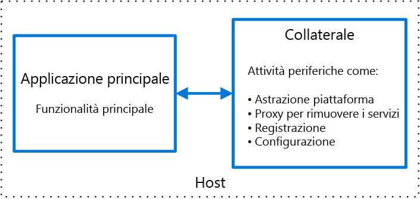

# Modello sidecar

Distribuire i componenti di un'applicazione in un processo o in un contenitore separato per fornire isolamento e incapsulamento. Questo modello può anche abilitare le applicazioni affinché siano composte da componenti e tecnologie eterogenei.

Questo modello viene denominato *sidecar* perché è simile a un sidecar collegato a una moto. Nel modello il sidecar è collegato a un'applicazione padre e offre funzionalità di supporto per l'applicazione. Il sidecar condivide anche lo stesso ciclo di vita dell'applicazione padre, poiché viene creato e ritirato insieme al padre. Il modello sidecar viene talvolta definito modello sidekick ed è un modello di scomposizione.

## Contesto e problema

Le applicazioni e i servizi richiedono spesso funzionalità correlate, quali il monitoraggio, la registrazione, la configurazione e i servizi di rete. Queste attività periferiche possono essere implementate come componenti o servizi separati.

Se sono strettamente integrate nell'applicazione, possono essere eseguite nello stesso processo dell'applicazione, usando in modo efficiente le risorse condivise. Tuttavia, questo significa anche che non sono del tutto isolate e un'interruzione in uno di questi componenti può influenzare gli altri componenti o l'intera applicazione. Per di più, di solito devono essere implementati usando lo stesso linguaggio dell'applicazione padre. Di conseguenza, il componente e l'applicazione presentano una forte interdipendenza.

Se l'applicazione viene scomposta in servizi, ciascun servizio può essere compilato usando diversi linguaggi e tecnologie. Sebbene questo offra una maggiore flessibilità, significa che ogni componente ha dipendenze proprie e richiede librerie specifiche della lingua per accedere alla piattaforma sottostante e a tutte le risorse condivise con l'applicazione padre. In aggiunta, la distribuzione di queste funzionalità come servizi separati può aggiungere latenza all'applicazione. La gestione del codice e delle dipendenze per queste interfacce specifiche della lingua può anche aggiungere una considerevole complessità, soprattutto per quanto riguarda l'hosting, la distribuzione e la gestione.

## Soluzione

Posizionare un insieme di attività coerenti con l'applicazione principale, ma inserirle nel proprio processo o contenitore, offrendo un'interfaccia omogenea per i servizi della piattaforma tra i diversi linguaggi.

Un servizio sidecar non fa necessariamente parte dell'applicazione, ma è connesso a questa. Si sposta insieme all'applicazione. I sidecar sono processi o servizi di supporto distribuiti con l'applicazione principale. Su una motocicletta, il sidecar è collegato a questa e ogni motocicletta può avere il proprio sidecar. Allo stesso modo, un servizio sidecar condivide il destino dell'applicazione padre. Per ogni istanza dell'applicazione, viene distribuita un'istanza del sidecar, ospitata con essa.

I vantaggi dell'uso di un modello sidecar includono:

- Un sidecar è indipendente dall'applicazione principale in termini di ambiente di runtime e linguaggio di programmazione, pertanto non è necessario sviluppare un sidecar per ogni lingua.

- Il sidecar può accedere alle stesse risorse dell'applicazione principale. Ad esempio, un sidecar può monitorare le risorse di sistema usate sia dal sidecar che dall'applicazione principale.

- A causa della vicinanza all'applicazione principale, non c'è una latenza significativa durante la comunicazione tra di essi.

- Anche per le applicazioni che non offrono un meccanismo di estensibilità, è possibile usare un sidecar per estendere le funzionalità collegandolo come processo autonomo nello stesso host o sottocontenitore dell'applicazione principale.

Il modello sidecar viene spesso usato con i contenitori e definito come contenitore sidecar o sidekick.

## Considerazioni e problemi

- Prendere in considerazione il formato della distribuzione e dei pacchetti che si userà per distribuire servizi, processi o contenitori. I contenitori sono particolarmente adatti al modello sidecar.
- Quando si progetta un servizio sidecar, scegliere con attenzione il meccanismo di comunicazione interprocesso. Provare a usare le tecnologie indipendenti dal linguaggio o dal framework, a meno che i requisiti delle prestazioni lo impediscano.
- Prima di inserire le funzionalità in un sidecar, valutare se funzionerà meglio come servizio separato o come un daemon più tradizionale.
- Valutare anche se la funzionalità potrebbe essere implementata come libreria o mediante un meccanismo di estensione tradizionale. Le librerie specifiche della lingua possono avere un livello di integrazione più approfondito e un minore sovraccarico di rete.

## Quando usare questo modello

Usare questo modello quando:

- L'applicazione principale usa un set eterogeneo di linguaggi e framework. Un componente che si trova in un servizio sidecar può essere usato dalle applicazioni scritte in linguaggi diversi tramite framework diversi.
- Il componente appartiene a un team remoto o a un'altra organizzazione.
- Il componente o la funzionalità devono essere posizionati nello stesso host dell'applicazione
- È necessario un servizio che condivida il ciclo di vita completo dell'applicazione principale, ma che può essere aggiornato in modo indipendente.
- È necessario un controllo con granularità fine dei limiti delle risorse per una risorsa o un componente specifico. Potrebbe, ad esempio, essere necessario limitare la quantità di memoria che viene usata da un componente specifico. È possibile distribuire il componente come un sidecar e gestire l'uso della memoria in modo indipendente dall'applicazione principale.

Questo modello potrebbe non essere adatto nelle situazioni seguenti:

- Quando la comunicazione interprocesso deve essere ottimizzata. La comunicazione tra un'applicazione padre e i servizi sidecar include un certo sovraccarico, in particolare la latenza nelle chiamate. Questo potrebbe non essere un compromesso accettabile per le interfacce "frammentate".
- Per applicazioni di piccole dimensioni in cui il costo della risorsa di distribuzione di un sidecar per ogni istanza non vale il vantaggio dell'isolamento.
- Quando il servizio deve essere ridimensionato in modo diverso o in modo indipendente dalle applicazioni principali. In questo caso, potrebbe essere preferibile distribuire la funzionalità come un servizio separato.

## Esempio

Il modello sidecar viene applicato a molti tipi di scenario. Alcuni esempi comuni includono:

- Infrastruttura API. Il team di sviluppo dell'infrastruttura crea un servizio che viene distribuito insieme a ogni applicazione, invece di una libreria client specifica della lingua che deve accedere all'infrastruttura. Il servizio viene caricato come sidecar e offre un livello comune per i servizi dell'infrastruttura, che include la registrazione, i dati di ambiente, l'archivio di configurazione, l'individuazione, i controlli di integrità e i servizi watchdog. Il sidecar consente anche di monitorare l'ambiente e il processo, o il contenitore, host dell'applicazione padre e registra le informazioni di un servizio centralizzato.
- Gestire NGINX/HAProxy. Distribuire NGINX con un servizio sidecar che consente di monitorare lo stato di ambiente, quindi aggiorna il file di configurazione NGINX e ricicla il processo quando è necessaria una modifica nello stato.
- Sidecar ambasciatore. Distribuire un servizio [Ambassador](./ambassador.md) come sidecar. L'applicazione chiama tramite l'ambasciatore, che gestisce la registrazione della richiesta, il routing, l'interruzione del circuito e altre funzionalità correlate alla connettività.
- Proxy offload. Posizionare un proxy NGINX davanti a un'istanza del servizio node.js, per gestire l'invio del contenuto del file statico per il servizio.

## Informazioni correlate

- [Modello Ambassador](./ambassador.md)
