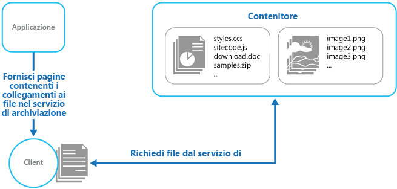

# <a name="static-content-hosting-pattern"></a>Modello di hosting del contenuto statico

[!INCLUDE [header](../_includes/header.md)]

Distribuire contenuto statico in un servizio di archiviazione basato sul cloud in grado di inviarlo direttamente al client. Questo può ridurre la necessità di istanze di calcolo potenzialmente dispendiose.

## <a name="context-and-problem"></a>Contesto e problema

Le applicazioni Web includono in genere alcuni elementi del contenuto statico. Il contenuto statico potrebbe includere pagine HTML e altre risorse, ad esempio immagini e documenti disponibili per il client, come parte di una pagina HTML, ad esempio immagini in linea con il testo, fogli di stile e file JavaScript lato client, o come download separati, quali documenti PDF.

Sebbene i server Web vengano regolati per ottimizzare le richieste tramite l'esecuzione efficiente del codice di una pagina dinamica e la memorizzazione nella cache di output, devono ancora gestire le richieste per scaricare il contenuto statico. Usa cicli di elaborazione che potrebbero spesso essere usati in modo migliore.

## <a name="solution"></a>Soluzione

Nella maggior parte degli ambienti di hosting cloud è possibile ridurre al minimo la necessità di istanze di calcolo, ad esempio usando un'istanza più piccola o meno istanze, individuando alcune risorse e pagine statiche dell'applicazione in un servizio di archiviazione. Il costo dell'archiviazione ospitata su cloud è in genere molto inferiore rispetto a quello per le istanze di calcolo.

Quando si ospitano alcune parti di un'applicazione in un servizio di archiviazione, le principali considerazioni sono correlate alla distribuzione dell'applicazione e alla protezione delle risorse che non devono essere disponibili agli utenti anonimi.

## <a name="issues-and-considerations"></a>Considerazioni e problemi

Prima di decidere come implementare questo modello, considerare quanto segue:

- Il servizio di archiviazione ospitato deve esporre un endpoint HTTP a cui gli utenti possono accedere per scaricare le risorse statiche. Anche alcuni servizi di archiviazione supportano HTTPS, pertanto è possibile ospitare le risorse nei servizi di archiviazione che richiedono l'SSL.

- Per prestazioni e disponibilità ottimali, usare una rete per la distribuzione di contenuti per memorizzare nella cache i contenuti del contenitore di archiviazione nei diversi datacenter di tutto il mondo. Tuttavia, probabilmente sarà necessario pagare per l'uso della rete CDN.

- Gli account di archiviazione sono spesso sottoposti a replica geografica per impostazione predefinita per offrire resilienza in caso di eventi che potrebbero interessare un datacenter. Ciò significa che l'indirizzo IP potrebbe cambiare, ma l'URL resta invariato.

- Quando alcuni contenuti si trovano in un account di archiviazione e altri in un'istanza di calcolo ospitata diventa più difficile distribuire un'applicazione e aggiornarla. Potrebbe essere necessario eseguire distribuzioni separate e controllare la versione dell'applicazione e del contenuto per gestirla in modo più semplice&mdash;soprattutto quando il contenuto statico include file script o componenti dell'interfaccia utente. Tuttavia, se è necessario aggiornare solo le risorse statiche, basta caricarle nell'account di archiviazione senza dover ridistribuire il pacchetto dell'applicazione.

- I servizi di archiviazione potrebbero non supportare l'uso di nomi di dominio personalizzati. In questo caso è necessario specificare l'URL completo delle risorse nei collegamenti, in quanto si troveranno in un dominio diverso dal contenuto generato in modo dinamico che contiene i collegamenti.

- I contenitori di archiviazione devono essere configurati per l'accesso in lettura pubblico, un'operazione fondamentale per garantire che non siano configurati per l'accesso pubblico in scrittura e impedire agli utenti di caricare il contenuto. È consigliabile usare un passepartout o un token per controllare l'accesso alle risorse che non devono essere disponibili in modo anonimo&mdash;vedere [Valet Key pattern](valet-key.md) (Modello passepartout) per altre informazioni.

## <a name="when-to-use-this-pattern"></a>Quando usare questo modello

Questo modello è utile per:

- Ridurre al minimo il costo di hosting di applicazioni e siti Web che contengono risorse statiche.

- Ridurre al minimo il costo di hosting per i siti Web costituiti solo da contenuto statico e risorse. In base alle funzionalità del sistema di archiviazione del provider hosting, potrebbe essere possibile ospitare un sito Web statico completo in un account di archiviazione.

- Esposizione di risorse e contenuto statico per applicazioni in esecuzione in ambienti di hosting diversi o in server locali.

- Individuare il contenuto in più aree geografiche tramite una rete di distribuzione dei contenuti che memorizza nella cache il contenuto dell'account di archiviazione in più datacenter in tutto il mondo.

- Monitorare i costi e l'uso della larghezza di banda. L'uso di un account di archiviazione separato per una parte o per l'intero contenuto statico consente una più semplice separazione dei costi da quelli di hosting e di runtime.

Questo modello può non essere utile nelle situazioni seguenti:

- L'applicazione deve eseguire alcune operazioni di elaborazione sul contenuto statico prima di distribuirlo al client. Ad esempio, potrebbe essere necessario aggiungere un timestamp a un documento.

- Il volume del contenuto statico è molto ridotto. Il sovraccarico per il recupero del contenuto da un archivio separato può annullare il vantaggio del costo della separazione dalla risorsa di calcolo.

## <a name="example"></a>Esempio

Il contenuto statico che si trova nell'archivio BLOB di Azure è accessibile direttamente da un Web browser. Azure offre un'interfaccia basata su HTTP per quanto riguarda l'archiviazione che può essere esposta pubblicamente ai client. Ad esempio, il contenuto in un contenitore di archivio BLOB di Azure verrà esposto tramite un URL nel formato seguente:

`http://[ storage-account-name ].blob.core.windows.net/[ container-name ]/[ file-name ]`


Quando si carica il contenuto è necessario creare uno o più contenitori BLOB per i file e i documenti. Si noti che l'autorizzazione predefinita per un nuovo contenitore è Privata ed è necessario modificarla in Pubblica per consentire ai client di accedere al contenuto. Se è necessario proteggere il contenuto dall'accesso anonimo, è possibile implementare il [modello passepartout](valet-key.md) in modo che gli utenti debbano presentare un token valido per scaricare le risorse.

> [Blob Service Concepts](https://msdn.microsoft.com/library/azure/dd179376.aspx) (Concetti relativi al servizio BLOB) dispone di informazioni sull'archiviazione BLOB e i modi in cui è possibile accedervi e usarla.

I collegamenti di ogni pagina specificheranno l'URL della risorsa e il client potrà accedervi direttamente dal servizio di archiviazione. La figura illustra come recapitare le parti statiche di un'applicazione direttamente da un servizio di archiviazione.




I collegamenti nelle pagine inviate al client devono specificare l'URL completo del contenitore BLOB e la risorsa. Ad esempio, una pagina che contiene un collegamento a un'immagine in un contenitore pubblico può contenere il seguente codice HTML.

```html

```

> Se le risorse sono protette tramite un passepartout, ad esempio una firma di accesso condiviso di Azure, la firma deve essere inclusa negli URL dei collegamenti.

In [GitHub](https://github.com/mspnp/cloud-design-patterns/tree/master/static-content-hosting) è disponibile una soluzione denominata StaticContentHosting che illustra l'uso dell'archiviazione esterna per le risorse statiche. Il progetto StaticContentHosting.Cloud contiene i file di configurazione che specificano l'account di archiviazione e il contenitore che include il contenuto statico.

```xml
<Setting name="StaticContent.StorageConnectionString"
         value="UseDevelopmentStorage=true" />
<Setting name="StaticContent.Container" value="static-content" />
```

La classe `Settings` nel file Settings.cs del progetto StaticContentHosting.Web contiene i metodi per estrarre questi valori e generare un valore di stringa contenente l'URL del contenitore dell'account di archiviazione cloud.

```csharp
public class Settings
{
  public static string StaticContentStorageConnectionString {
    get
    {
      return RoleEnvironment.GetConfigurationSettingValue(
                              "StaticContent.StorageConnectionString");
    }
  }

  public static string StaticContentContainer
  {
    get
    {
      return RoleEnvironment.GetConfigurationSettingValue("StaticContent.Container");
    }
  }

  public static string StaticContentBaseUrl
  {
    get
    {
      var account = CloudStorageAccount.Parse(StaticContentStorageConnectionString);

      return string.Format("{0}/{1}", account.BlobEndpoint.ToString().TrimEnd('/'),
                                      StaticContentContainer.TrimStart('/'));
    }
  }
}
```

La classe `StaticContentUrlHtmlHelper` nel file StaticContentUrlHtmlHelper.cs espone un metodo denominato `StaticContentUrl` che genera un URL contenente il percorso all'account di archiviazione cloud, se l'URL passato inizia con il carattere del percorso radice ASP.NET (~).

```csharp
public static class StaticContentUrlHtmlHelper
{
  public static string StaticContentUrl(this HtmlHelper helper, string contentPath)
  {
    if (contentPath.StartsWith("~"))
    {
      contentPath = contentPath.Substring(1);
    }

    contentPath = string.Format("{0}/{1}", Settings.StaticContentBaseUrl.TrimEnd('/'),
                                contentPath.TrimStart('/'));

    var url = new UrlHelper(helper.ViewContext.RequestContext);

    return url.Content(contentPath);
  }
}
```

Il file Index.cshtml nella cartella Visualizzazioni\Home contiene un elemento immagine che usa il metodo `StaticContentUrl` per creare l'URL relativo all'attributo `src`.

```html

```

## <a name="related-patterns-and-guidance"></a>Modelli correlati e informazioni aggiuntive

- Un esempio che illustra questo modello è disponibile su [GitHub](https://github.com/mspnp/cloud-design-patterns/tree/master/static-content-hosting).
- [Valet Key pattern](valet-key.md) (Modello di passepartout). Se si suppone che le risorse di destinazione non debbano essere disponibili agli utenti anonimi è necessario implementare la sicurezza dell'archivio che contiene il contenuto statico. Descrive come usare un token o una chiave che offra ai client l'accesso diretto limitato a una risorsa o a un servizio specifico quali un servizio di archiviazione ospitato su cloud.
- [An efficient way of deploying a static web site on Azure](http://www.infosysblogs.com/microsoft/2010/06/an_efficient_way_of_deploying.html) (Un modo efficiente per distribuire un sito Web statico in Azure) sul blog di Infosys.
- [Blob Service Concepts](https://msdn.microsoft.com/library/azure/dd179376.aspx) (Concetti relativi al servizio BLOB)
