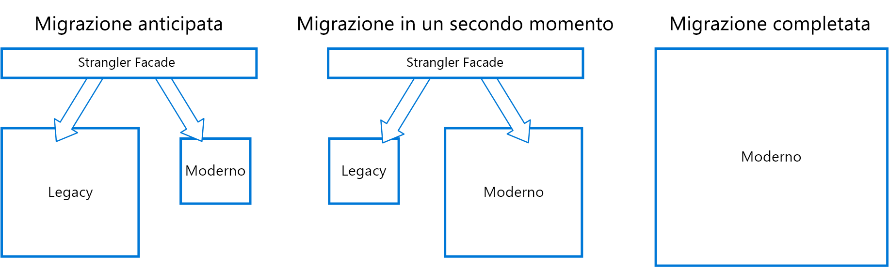

# Modello SostituzioneStrangler pattern

Migrare in maniera incrementale un sistema legacy, sostituendo gradualmente parti specifiche di funzionalità con nuove applicazioni e servizi.Incrementally migrate a legacy system by gradually replacing specific pieces of functionality with new applications and services. Mano a mano che le funzionalità del sistema precedente vengono sostituite, il nuovo sistema sostituisce tutte le funzionalità del sistema precedente fino a quando non è possibile effettuarne la completa dismissione.As features from the legacy system are replaced, the new system eventually replaces all of the old system's features, strangling the old system and allowing you to decommission it. 

## Contesto e problemaContext and problem

Con l'invecchiamento dei sistemi, gli strumenti di sviluppo, le tecnologie di hosting e perfino le architetture con cui sono stati compilati possono diventare obsoleti.As systems age, the development tools, hosting technology, and even system architectures they were built on can become increasingly obsolete. Con l'aggiunta di nuove caratteristiche e funzionalità, la complessità delle applicazioni può aumentare notevolmente, rendendo i sistemi più difficili da gestire o ostacolando l'aggiunta di nuove funzionalità.As new features and functionality are added, the complexity of these applications can increase dramatically, making them harder to maintain or add new features to.

La sostituzione totale di un sistema complesso può rappresentare un impegno notevole.Completely replacing a complex system can be a huge undertaking. Spesso è necessario migrare con gradualità verso il nuovo sistema, conservando quello precedente per gestire le funzionalità di cui non è stata ancora eseguita la migrazione.Often, you will need a gradual migration to a new system, while keeping the old system to handle features that haven't been migrated yet. Tuttavia, l'esecuzione di due versioni distinte di un'applicazione implica che i client sappiano dove si trovano le singole funzionalità.However, running two separate versions of an application means that clients have to know where particular features are located. Ogni volta che viene eseguita la migrazione di una funzione o di un servizio, i client devono essere aggiornati affinché puntino alla nuova posizione.Every time a feature or service is migrated, clients need to be updated to point to the new location.

## SoluzioneSolution

Sostituire gradualmente parti specifiche di funzionalità con nuove applicazioni e servizi.Incrementally replace specific pieces of functionality with new applications and services. Creare un'interfaccia che intercetta le richieste inviate al sistema back-end legacy.Create a façade that intercepts requests going to the backend legacy system. L'interfaccia indirizza tali richieste all'applicazione legacy o ai nuovi servizi.The façade routes these requests either to the legacy application or the new services. Le funzionalità esistenti possono essere migrate nel nuovo sistema gradualmente, e i consumer possono continuare a usare la stessa interfaccia senza percepire l'avvenuta migrazione.Existing features can be migrated to the new system gradually, and consumers can continue using the same interface, unaware that any migration has taken place.

  

Questo modello contribuisce a ridurre i rischi implicati dalla migrazione e a diluire l'attività di sviluppo nel tempo.This pattern helps to minimize risk from the migration, and spread the development effort over time. Grazie all'interfaccia che indirizza gli utenti in modo sicuro all'applicazione corretta, è possibile aggiungere le funzionalità al nuovo sistema al ritmo preferito, assicurando al contempo il funzionamento continuo dell'applicazione legacy.With the façade safely routing users to the correct application, you can add functionality to the new system at whatever pace you like, while ensuring the legacy application continues to function. Nel tempo, le funzionalità vengono migrate nel nuovo sistema e il sistema legacy viene sostituito fino a non essere più necessario.Over time, as features are migrated to the new system, the legacy system is eventually "strangled" and is no longer necessary. Una volta completato questo processo, sarà possibile ritirare il sistema legacy in modo sicuro.Once this process is complete, the legacy system can safely be retired.

## Considerazioni e problemiIssues and considerations

- Considerare la modalità di gestione di archivi dati e servizi che possono essere potenzialmente usati tanto dai sistemi legacy quanto da quelli nuovi.Consider how to handle services and data stores that are potentially used by both new and legacy systems. Verificare che entrambi possano accedere a queste risorse simultaneamente.Make sure both can access these resources side-by-side.
- Strutturare i nuovi servizi e le applicazioni in modo che possono essere facilmente intercettati e sostituiti durante le future migrazioni.Structure new applications and services in a way that they can easily be intercepted and replaced in future strangler migrations.
- Quando la migrazione sarà infine completata, l'interfaccia sostitutiva verrà eliminata o adattata ai client legacy.At some point, when the migration is complete, the strangler façade will either go away or evolve into an adaptor for legacy clients.
- Verificare che l'interfaccia mantenga il passo con la migrazione.Make sure the façade keeps up with the migration.
- Verificare che l'interfaccia non diventi un singolo punto di guasto o un collo di bottiglia delle prestazioni.Make sure the façade doesn't become a single point of failure or a performance bottleneck.

## Quando usare questo modelloWhen to use this pattern

Usare questo modello quando si migra gradualmente un'applicazione back-end in una nuova architettura.Use this pattern when gradually migrating a back-end application to a new architecture.

Questo modello potrebbe non essere adatto nelle situazioni seguenti:This pattern may not be suitable:

- Quando non è possibile intercettare le richieste inviate al sistema back-end.When requests to the back-end system cannot be intercepted.
- Per i sistemi di piccole dimensioni in cui la complessità della sostituzione su larga scala è bassa.For smaller systems where the complexity of wholesale replacement is low.

## Informazioni correlateRelated guidance

- Post di blog di Martin Fowler su [StranglerApplication](https://www.martinfowler.com/bliki/StranglerApplication.html)Martin Fowler's blog post on [StranglerApplication](https://www.martinfowler.com/bliki/StranglerApplication.html)
- [Modello Livello anti-danneggiamentoAnti-Corruption Layer pattern](./anti-corruption-layer.md)
- [Modello Routing gatewayGateway Routing pattern](./gateway-routing.md)

 

