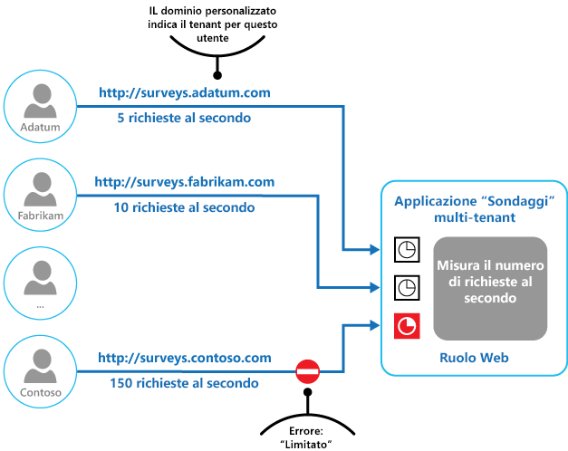

# Modello LimitazioneThrottling pattern

[!INCLUDE [header](../_includes/header.md)]

Controllare il consumo delle risorse usate da un'istanza di un'applicazione, un singolo tenant o un intero servizio.Control the consumption of resources used by an instance of an application, an individual tenant, or an entire service. Questa scelta può consentire al sistema di continuare a funzionare e soddisfare i contratti di servizio, anche quando un aumento della domanda genera un carico particolarmente intenso sulle risorse.This can allow the system to continue to function and meet service level agreements, even when an increase in demand places an extreme load on resources.

## Contesto e problemaContext and problem

Il carico su un'applicazione cloud varia in genere nel tempo in base al numero di utenti attivi o ai tipi di attività in esecuzione.The load on a cloud application typically varies over time based on the number of active users or the types of activities they are performing. Ad esempio, è probabile che più utenti siano attivi durante l'orario di lavoro oppure al sistema potrebbe essere richiesto di eseguire un'analisi impegnativa a livello di calcolo alla fine di ogni mese.For example, more users are likely to be active during business hours, or the system might be required to perform computationally expensive analytics at the end of each month. È possibile anche che si verifichino picchi improvvisi e imprevisti nell'attività.There might also be sudden and unanticipated bursts in activity. Se i requisiti di elaborazione del sistema superano la capacità delle risorse disponibili, è possibile che le prestazioni non siano soddisfacenti e persino che si verifichi un errore del sistema.If the processing requirements of the system exceed the capacity of the resources that are available, it'll suffer from poor performance and can even fail. Se il sistema deve soddisfare un livello di servizio concordato, questo errore potrebbe non essere accettabile.If the system has to meet an agreed level of service, such failure could be unacceptable.

Sono disponibili numerose strategie per gestire carichi variabili nel cloud, a seconda degli obiettivi aziendali per l'applicazione.There're many strategies available for handling varying load in the cloud, depending on the business goals for the application. Una strategia consiste nell'usare la scalabilità automatica in modo che corrisponda alle risorse di cui è stato eseguito il provisioning all'utente in un momento specifico.One strategy is to use autoscaling to match the provisioned resources to the user needs at any given time. Questa strategia è in grado di soddisfare in modo coerente la richiesta dell'utente, ottimizzando al contempo i costi in esecuzione.This has the potential to consistently meet user demand, while optimizing running costs. Tuttavia, mentre la scalabilità automatica può attivare il provisioning di risorse aggiuntive, questo provisioning non è immediato.However, while autoscaling can trigger the provisioning of additional resources, this provisioning isn't immediate. Se la domanda cresce rapidamente, è possibile che le risorse in un intervallo di tempo non siano sufficienti.If demand grows quickly, there can be a window of time where there's a resource deficit.

## SoluzioneSolution

Una strategia alternativa alla scalabilità automatica consiste nel consentire alle applicazioni di usare le risorse solo fino a un limite e di limitarle al raggiungimento di questo limite.An alternative strategy to autoscaling is to allow applications to use resources only up to a limit, and then throttle them when this limit is reached. Il sistema deve monitorare la modalità di utilizzo delle risorse in modo che, quando l'utilizzo supera la soglia, sia possibile limitare le richieste provenienti da uno o più utenti.The system should monitor how it's using resources so that, when usage exceeds the threshold, it can throttle requests from one or more users. In questo modo il sistema continuerà a funzionare e soddisferà gli eventuali contratti di servizio applicabili.This will enable the system to continue functioning and meet any service level agreements (SLAs) that are in place. Per altre informazioni sul monitoraggio dell'utilizzo delle risorse, vedere [Indicazioni sulla strumentazione e la telemetria](https://msdn.microsoft.com/library/dn589775.aspx).For more information on monitoring resource usage, see the [Instrumentation and Telemetry Guidance](https://msdn.microsoft.com/library/dn589775.aspx).

Il sistema potrebbe implementare diverse strategie di limitazione, tra cui:The system could implement several throttling strategies, including:

- Rifiutare le richieste da un singolo utente che ha già effettuato l'accesso alle API di sistema più di n volte al secondo in un determinato periodo di tempo.Rejecting requests from an individual user who's already accessed system APIs more than n times per second over a given period of time. Per tale scopo è necessario che il sistema calcoli l'utilizzo delle risorse per ogni tenant o utente che esegue un'applicazione.This requires the system to meter the use of resources for each tenant or user running an application. Per altre informazioni, vedere le [indicazioni sulla misurazione del servizio](https://msdn.microsoft.com/library/dn589796.aspx).For more information, see the [Service Metering Guidance](https://msdn.microsoft.com/library/dn589796.aspx).

- Disabilitare o degradare la funzionalità di servizi non essenziali selezionati in modo che i servizi essenziali possano essere eseguiti senza problemi con risorse sufficienti.Disabling or degrading the functionality of selected nonessential services so that essential services can run unimpeded with sufficient resources. Ad esempio, se l'applicazione sta trasmettendo l'output video, potrebbe passare a una risoluzione inferiore.For example, if the application is streaming video output, it could switch to a lower resolution.

- Usare il livellamento del carico per regolare il volume di attività; questo approccio è descritto in maggior dettaglio nello [schema di livellamento del carico basato sulle code](queue-based-load-leveling.md).Using load leveling to smooth the volume of activity (this approach is covered in more detail by the [Queue-based Load Leveling pattern](queue-based-load-leveling.md)). In un ambiente multi-tenant questo approccio ridurrà le prestazioni per ogni tenant.In a multi-tenant environment, this approach will reduce the performance for every tenant. Se il sistema deve supportare un insieme di tenant con contratti di servizio diversi, le operazioni i tenant di alto valore possono essere eseguite immediatamente.If the system must support a mix of tenants with different SLAs, the work for high-value tenants might be performed immediately. Le richieste di altri tenant possono essere tratenute e gestite quando il backlog è diminuito.Requests for other tenants can be held back, and handled when the backlog has eased. Lo [schema della coda di priorità][] può essere usato per facilitare l'implementazione di questo approccio.The [Priority Queue pattern][] could be used to help implement this approach.

- Rinviare operazioni eseguite per conto di tenant o di applicazioni con priorità più bassa.Deferring operations being performed on behalf of lower priority applications or tenants. Queste operazioni possono essere sospese o limitate, con un'eccezione generata per informare il tenant che il sistema è occupato e che l'operazione dovrebbe essere ritentata successivamente.These operations can be suspended or limited, with an exception generated to inform the tenant that the system is busy and that the operation should be retried later.

La figura mostra un grafo ad area per l'utilizzo delle risorse (una combinazione di memoria, CPU, larghezza di banda e di altri fattori) rispetto al tempo per cui le applicazioni usano le tre funzioni.The figure shows an area graph for resource use (a combination of memory, CPU, bandwidth, and other factors) against time for applications that are making use of three features. Una funzione è un'area di funzionalità, ad esempio un componente che esegue una serie specifica di attività, una parte del codice che esegue un calcolo complesso o un elemento che fornisce un servizio, ad esempio una cache in memoria.A feature is an area of functionality, such as a component that performs a specific set of tasks, a piece of code that performs a complex calculation, or an element that provides a service such as an in-memory cache. Queste funzioni sono etichettate come A, B e C.These features are labeled A, B, and C.

> L'area immediatamente sotto la linea per una funzione indica le risorse usate dalle applicazioni quando richiamano questa funzione.The area immediately below the line for a feature indicates the resources that are used by applications when they invoke this feature. Ad esempio, l'area sotto la riga per la Funzione A mostra le risorse usate dalle applicazioni che usano la Funzione A e l'area tra le righe per la Funzione A e la Funzione B indica le risorse usate dalle applicazioni che richiamano la Funzione B. L'aggregazione delle aree per ogni funzione mostra l'utilizzo totale delle risorse del sistema.For example, the area below the line for Feature A shows the resources used by applications that are making use of Feature A, and the area between the lines for Feature A and Feature B indicates the resources used by applications invoking Feature B. Aggregating the areas for each feature shows the total resource use of the system.

La figura precedente illustra gli effetti delle operazioni di rinvio.The previous figure illustrates the effects of deferring operations. Appena prima del tempo T1, le risorse totali assegnate a tutte le applicazioni che usano queste funzioni raggiungono una soglia, il limite di utilizzo di risorse.Just prior to time T1, the total resources allocated to all applications using these features reach a threshold (the limit of resource use). A questo punto, le applicazioni rischiano di esaurire le risorse disponibili.At this point, the applications are in danger of exhausting the resources available. In questo sistema, la Funzione B è meno critica della Funzione A o della Funzione C e quindi è stata temporaneamente disattivata rilasciando le risorse che stava usando.In this system, Feature B is less critical than Feature A or Feature C, so it's temporarily disabled and the resources that it was using are released. Tra i tempi T1 e T2, le applicazioni che usano la Funzione A e la Funzione C continuano a funzionare normalmente.Between times T1 and T2, the applications using Feature A and Feature C continue running as normal. Alla fine, l'utilizzo delle risorse di queste due funzioni diminuisce al punto in cui, al tempo T2, è disponibile una capacità sufficiente per abilitare nuovamente la Funzione B.Eventually, the resource use of these two features diminishes to the point when, at time T2, there is sufficient capacity to enable Feature B again.

Gli approcci di scalabilità automatica e limitazione possono anche essere combinati per mantenere reattive le applicazioni e in linea con i contratti di servizio.The autoscaling and throttling approaches can also be combined to help keep the applications responsive and within SLAs. Se si prevede che la domanda rimarrà elevata, la limitazione fornisce una soluzione temporanea mentre il sistema esegue la scalabilità orizzontale. A questo punto è possibile ripristinare la funzionalità completa del sistema.If the demand is expected to remain high, throttling provides a temporary solution while the system scales out. At this point, the full functionality of the system can be restored.

La figura seguente mostra un grafo ad area sull'utilizzo generale delle risorse da parte di tutte le applicazioni eseguite in un sistema rispetto al tempo e illustra come è possibile combinare la limitazione delle richieste con la scalabilità automatica.The next figure shows an area graph of the overall resource use by all applications running in a system against time, and illustrates how throttling can be combined with autoscaling.

All'ora T1 viene raggiunta la soglia che specifica il limite flessibile di utilizzo di risorse.At time T1, the threshold specifying the soft limit of resource use is reached. A questo punto il sistema può iniziare a scalare orizzontalmente. Tuttavia, se le nuove risorse non diventano disponibili abbastanza rapidamente, le risorse esistenti potrebbero esaurirsi e si potrebbe verificare un errore del sistema.At this point, the system can start to scale out. However, if the new resources don't become available quickly enough, then the existing resources might be exhausted and the system could fail. Per evitare questo problema, il sistema viene limitato temporaneamente, come descritto in precedenza.To prevent this from occurring, the system is temporarily throttled, as described earlier. Dopo che la scalabilità automatica è stata completata e che risorse aggiuntive sono diventate disponibili, è possibile ridurre la limitazione.When autoscaling has completed and the additional resources are available, throttling can be relaxed.

## Considerazioni e problemiIssues and considerations

Prima di decidere come implementare questo schema, è opportuno considerare quanto segue:You should consider the following points when deciding how to implement this pattern:

- Limitare le richieste di un'applicazione e scegliere la strategia sono decisioni che influiscono sull'intera progettazione di un sistema.Throttling an application, and the strategy to use, is an architectural decision that impacts the entire design of a system. Non è facile aggiungere la limitazione delle richieste dopo l'implementazione di un sistema ed è quindi opportuno valutare questa scelta all'inizio del processo di progettazione.Throttling should be considered early in the application design process because it isn't easy to add once a system has been implemented.

- La limitazione delle richieste deve essere eseguita rapidamente.Throttling must be performed quickly. Il sistema deve essere in grado di rilevare un aumento di attività e reagire di conseguenza.The system must be capable of detecting an increase in activity and react accordingly. Il sistema deve anche essere in grado di ripristinare lo stato originale rapidamente dopo che il carico è diminuito.The system must also be able to revert to its original state quickly after the load has eased. A tale scopo è necessario che vengano costantemente acquisiti e monitorati i dati sulle prestazioni appropriati.This requires that the appropriate performance data is continually captured and monitored.

- Se un servizio deve negare temporaneamente una richiesta dell'utente, deve restituire un codice di errore specifico in modo che l'applicazione client sia consapevole che il motivo del rifiuto ad eseguire un'operazione è dovuto alla limitazione delle richieste.If a service needs to temporarily deny a user request, it should return a specific error code so the client application understands that the reason for the refusal to perform an operation is due to throttling. L'applicazione client può attendere prima di ritentare la richiesta.The client application can wait for a period before retrying the request.

- La limitazione delle richieste può essere usata come misura temporanea mentre il sistema scala automaticamente.Throttling can be used as a temporary measure while a system autoscales. In alcuni casi è preferibile limitare semplicemente le richieste, anziché eseguire la scalabilità, se un picco di attività è improvviso e non si prevede una lunga durata perché la scalabilità aumenta notevolmente i costi di gestione.In some cases it's better to simply throttle, rather than to scale, if a burst in activity is sudden and isn't expected to be long lived because scaling can add considerably to running costs.

- Se la limitazione delle richieste viene usata come misura temporanea mentre il sistema scala automaticamente e se le richieste di risorse aumentano molto rapidamente, il sistema potrebbe non essere in grado di continuare a funzionare normalmente, anche se funziona in modalità limitata.If throttling is being used as a temporary measure while a system autoscales, and if resource demands grow very quickly, the system might not be able to continue functioning&mdash;even when operating in a throttled mode. Se questa condizione non è accettabile, è consigliabile, prendere in considerazione la possibilità di mantenere maggiori riserve di capacità e di configurare una scalabilità automatica più aggressiva.If this isn't acceptable, consider maintaining larger capacity reserves and configuring more aggressive autoscaling.

## Quando usare questo modelloWhen to use this pattern

Usare questo schema:Use this pattern:

- Per garantire che un sistema continui a soddisfare i contratti di servizio.To ensure that a system continues to meet service level agreements.

- Per evitare a un singolo tenant di monopolizzare le risorse fornite da un'applicazione.To prevent a single tenant from monopolizing the resources provided by an application.

- Per gestire i picchi di attività.To handle bursts in activity.

- Per ottimizzare i costi di un sistema limitando i livelli massimi di risorse necessari per mantenerlo funzionante.To help cost-optimize a system by limiting the maximum resource levels needed to keep it functioning.

## EsempioExample

La figura finale illustra come la limitazione delle richieste può essere implementata in un sistema multi-tenant.The final figure illustrates how throttling can be implemented in a multi-tenant system. Gli utenti di ciascuna organizzazione tenant accedono a un'applicazione ospitata nel cloud dove compilano e inviano sondaggi.Users from each of the tenant organizations access a cloud-hosted application where they fill out and submit surveys. L'applicazione contiene la strumentazione che monitora la velocità con cui questi utenti inviano richieste all'applicazione.The application contains instrumentation that monitors the rate at which these users are submitting requests to the application.

Per impedire agli utenti di un tenant di compromettere i tempi di risposta e la disponibilità dell'applicazione per tutti gli altri utenti, il numero di richieste al secondo che gli utenti di qualsiasi tenant possono inviare viene limitato.In order to prevent the users from one tenant affecting the responsiveness and availability of the application for all other users, a limit is applied to the number of requests per second the users from any one tenant can submit. L'applicazione blocca le richieste che superano questo limite.The application blocks requests that exceed this limit.

## Modelli correlati e informazioni aggiuntiveRelated patterns and guidance

Per l'implementazione di questo modello possono risultare utili i modelli e le informazioni aggiuntive seguenti:The following patterns and guidance may also be relevant when implementing this pattern:
- [Indicazioni sulla strumentazione e la telemetria](https://msdn.microsoft.com/library/dn589775.aspx).[Instrumentation and Telemetry Guidance](https://msdn.microsoft.com/library/dn589775.aspx). La limitazione dipende dalla raccolta di informazioni sulla frequenza di utilizzo di un servizio.Throttling depends on gathering information about how heavily a service is being used. Descrive come generare e acquisire informazioni di monitoraggio personalizzate.Describes how to generate and capture custom monitoring information.
- [Indicazioni sulla misurazione del servizio](https://msdn.microsoft.com/library/dn589796.aspx).[Service Metering Guidance](https://msdn.microsoft.com/library/dn589796.aspx). Descrive come controllare l'utilizzo dei servizi per comprenderne le modalità di utilizzo.Describes how to meter the use of services in order to gain an understanding of how they are used. Queste informazioni possono essere utili per determinare come limitare un servizio.This information can be useful in determining how to throttle a service.
- [Indicazioni sulla scalabilità automatica](https://msdn.microsoft.com/library/dn589774.aspx).[Autoscaling Guidance](https://msdn.microsoft.com/library/dn589774.aspx). La limitazione delle richieste può essere usata come misura provvisoria mentre un sistema esegue la scalabilità automatica o per non rendere necessaria questa operazione.Throttling can be used as an interim measure while a system autoscales, or to remove the need for a system to autoscale. Contiene informazioni sulle strategie di scalabilità automatica.Contains information on autoscaling strategies.
- [Schema di livellamento del carico basato sulle code](queue-based-load-leveling.md).[Queue-based Load Leveling pattern](queue-based-load-leveling.md). Il livellamento del carico basato sulle code è un meccanismo di utilizzo comune per implementare la limitazione delle richieste.Queue-based load leveling is a commonly used mechanism for implementing throttling. Una coda può fungere da buffer che aiuta a bilanciare la velocità con cui le richieste inviate da un'applicazione vengono recapitate a un servizio.A queue can act as a buffer that helps to even out the rate at which requests sent by an application are delivered to a service.
- [schema della coda di priorità][].[Priority Queue pattern][]. Un sistema può usare l'accodamento prioritario nell'ambito della strategia di limitazione per garantire le prestazioni per le applicazioni strategiche o di livello superiore, riducendo al contempo le prestazioni delle applicazioni meno importanti.A system can use priority queuing as part of its throttling strategy to maintain performance for critical or higher value applications, while reducing the performance of less important applications.

[schema della coda di priorità]: priority-queue.md