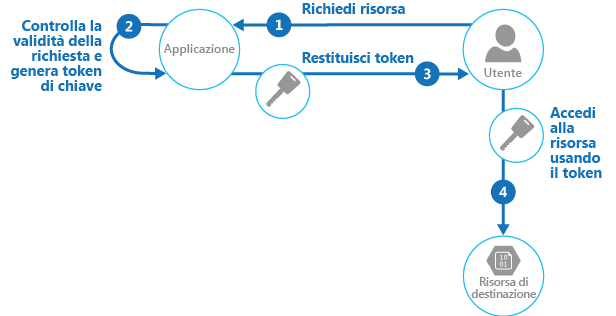

# <a name="valet-key-pattern"></a>Modello di passepartout

[!INCLUDE [header](../_includes/header.md)]

Usare un token che fornisca ai client l'accesso diretto limitato a una specifica risorsa per eseguire l'offload del trasferimento dei dati dall'applicazione. Questa condizione risulta particolarmente utile nelle applicazioni che usano code o sistemi di archiviazione ospitati nel cloud e permette di ridurre i costi e ottimizzare scalabilità e prestazioni.

## <a name="context-and-problem"></a>Contesto e problema

Programmi client e Web browser devono spesso leggere e scrivere file o flussi di dati da e verso l'archiviazione di un'applicazione. L'applicazione gestisce in genere lo spostamento dei dati recuperandoli dall'archiviazione e trasmettendoli al client oppure leggendo il flusso caricato dal client e memorizzandolo nell'archivio dati. Questo approccio assorbe tuttavia risorse utili, ad esempio risorse di calcolo, memoria e larghezza di banda.

Gli archivi dati sono in grado di gestire direttamente l'upload e il download dei dati, senza che l'applicazione debba eseguire un'elaborazione per spostare questi dati. In questi casi, tuttavia, il cliente potrebbe dover accedere alle credenziali di sicurezza per l'archivio. Può trattarsi di una tecnica utile per ridurre al minimo i costi di trasferimento dei dati e l'esigenza di scalare orizzontalmente l'applicazione, nonché per ottimizzare le prestazioni. L'applicazione, tuttavia, non è più in grado di gestire la sicurezza dei dati. Dopo che il client avrà stabilito una connessione all'archivio dati per l'accesso diretto, l'applicazione non potrà fungere da gatekeeper. Non è più in controllo del processo e non può impedire upload o download successivi dall'archivio dati.

Ciò non costituisce un approccio realistico nei sistemi distribuiti che gestiscono client non attendibili. Al contrario, le applicazioni devono essere in grado di controllare in modo sicuro l'accesso ai dati in modo granulare, ma comunque ridurre il carico sul server configurando questa connessione e poi consentendo al client di comunicare direttamente con l'archivio dati per eseguire le operazioni di lettura o scrittura necessarie.

## <a name="solution"></a>Soluzione

È necessario risolvere il problema di controllo dell'accesso a un archivio dati in cui l'archivio non possa gestire l'autenticazione e l'autorizzazione dei client. Una soluzione tipica consiste nel limitare l'accesso alla connessione pubblica dell'archivio dati e fornire al client una chiave o un token convalidabile dall'archivio dati.

Questa chiave o token è in genere definita passepartout. Offre l'accesso temporaneo a risorse specifiche e consente solo operazioni predefinite, ad esempio operazioni di lettura e scrittura nell'archiviazione o nelle code, o upload e download in un Web browser. Le applicazioni possono creare ed emettere passepartout per dispositivi client e Web browser in modo rapido e semplice, consentendo ai client di eseguire le operazioni necessarie senza che l'applicazione debba gestire direttamente il trasferimento dei dati. In questo modo si eliminano il sovraccarico di elaborazione e l'impatto su prestazioni e scalabilità dall'applicazione e dal server.

Il client usa questo token per accedere a una risorsa specifica nell'archivio dati solo per un periodo di tempo e con restrizioni specifiche sulle autorizzazioni di accesso, come illustrato nella figura. Dopo il periodo specificato, la chiave non sarà più valida e non consentirà l'accesso alla risorsa.



È anche possibile configurare una chiave con altre dipendenze, ad esempio l'ambito dei dati. Ad esempio, a seconda delle funzionalità dell'archivio dati, la chiave può specificare un'intera tabella in un archivio dati o solo le righe specifiche di una tabella. Nei sistemi di archiviazione cloud la chiave può specificare un contenitore o solo un elemento specifico al suo interno.

La chiave può anche essere invalidata dall'applicazione. Si tratta di un approccio utile se il client segnala al server che l'operazione di trasferimento dei dati è stata completata. Il server può poi invalidare la chiave per impedire ulteriori accessi.

Questo modello permette di semplificare la gestione dell'accesso alle risorse, perché non è necessario creare e autenticare un utente, concedere autorizzazioni e rimuovere di nuovo l'utente. Semplifica anche la possibilità di limitare la posizione, l'autorizzazione e il periodo di validità. generando semplicemente una chiave in fase di runtime. I fattori importanti consistono nel limitare il periodo di validità, e in particolare la posizione della risorsa, quanto più possibile per garantire che il destinatario possa usarla solo per lo scopo previsto.

## <a name="issues-and-considerations"></a>Considerazioni e problemi

Prima di decidere come implementare questo modello, considerare quanto segue:

**Gestire lo stato e il periodo di validità della chiave**. Se persa o compromessa, la chiave sblocca l'elemento di destinazione e lo rende disponibile per uso dannoso durante il periodo di validità. Una chiave può essere in genere revocata o disabilitata, a seconda della modalità di emissione. I criteri lato server possono essere modificati oppure la chiave del server con cui è stato firmato può essere invalidata. Specificare un periodo di validità breve per ridurre al minimo il rischio di consentire operazioni non autorizzate nell'archivio dati. Se tuttavia il periodo di validità è troppo breve, il client potrebbe non essere in grado di completare l'operazione prima della scadenza della chiave. Consentire agli utenti autorizzati di rinnovare la chiave prima della scadenza del periodo di validità se sono necessari più accessi alla risorsa protetta.

**Controllare il livello di accesso fornito dalla chiave**. La chiave deve in genere consentire all'utente di eseguire solo le azioni necessarie per completare l'operazione, ad esempio l'accesso di sola lettura se il client non è in grado di caricare dati nell'archivio dati. Per l'upload dei file viene in genere specificata una chiave che fornisce l'autorizzazione di sola scrittura, nonché il percorso e il periodo di validità. È fondamentale specificare in modo accurato la risorsa o il set di risorse a cui si applica la chiave.

**Considerare il modo in cui controllare il comportamento degli utenti**. L'implementazione di questo modello implica una perdita parziale di controllo sulle risorse a cui gli utenti sono autorizzati ad accedere. Il livello di controllo che può essere esercitato è limitato dalle funzionalità dei criteri e delle autorizzazioni disponibili per il servizio o l'archivio dati di destinazione. Ad esempio, in genere non è possibile creare una chiave che limita le dimensioni dei dati da scrivere nell'archiviazione o il numero di volte in cui è possibile usare la chiave per accedere a un file. Questo problema può determinare elevati costi imprevisti per il trasferimento dei dati, anche se in uso da parte del client previsto, e può essere dovuto a un errore nel codice che determina upload e download ripetuti. Per limitare il numero di volte in cui può essere caricato un file, laddove possibile, forzare il client a inviare una notifica all'applicazione quando un'operazione è stata completata. Alcuni archivi dati generano ad esempio eventi che il codice dell'applicazione può usare per monitorare le operazioni e controllare il comportamento degli utenti. È comunque difficile imporre quote per singoli utenti in uno scenario multi-tenant in cui la stessa chiave viene usata da tutti gli utenti di un tenant.

**Convalidare e facoltativamente purificare tutti i dati caricati**. Un utente malintenzionato che riesce ad accedere alla chiave potrebbe caricare dati progettati per compromettere il sistema. In alternativa, gli utenti autorizzati potrebbero caricare dati non validi che, se elaborati, potrebbero generare un errore o un errore di sistema. Per evitare questo problema, verificare che tutti i dati caricati siano convalidati e non contengano contenuto dannoso prima dell'uso.

**Controllare tutte le operazioni**. Molti meccanismi basati su chiavi possono registrare alcune operazioni, ad esempio gli upload, i download e gli errori. Questi log possono essere in genere incorporati in un processo di controllo e usati anche per la fatturazione se gli addebiti dell'utente variano in base alle dimensioni dei file o al volume di dati. Usare i log per rilevare errori di autenticazione che potrebbero essere causati da problemi con il provider della chiave o la rimozione accidentale di criteri di accesso archiviati.

**Distribuire in modo sicuro la chiave**. Può essere incorporata in un URL attivato dall'utente in una pagina Web o può essere usato in un'operazione di reindirizzamento del server per consentire il download automatico. Usare sempre HTTPS per distribuire la chiave su un canale sicuro.

**Proteggere i dati sensibili in transito**. I dati sensibili vengono in genere recapitati dall'applicazione con crittografia SSL o TLS. Questa operazione deve essere applicata per i client che accedono direttamente all'archivio dati.

Di seguito sono riportati altri problemi da considerare quando si implementa questo modello:

- Se il client non segnala al server il completamento dell'operazione, o non è in grado di farlo, e l'unico limite è il periodo di scadenza della chiave, l'applicazione non sarà in grado di eseguire le operazioni di controllo, ad esempio il conteggio del numero di upload o download o la capacità di impedire più upload o download.

- La flessibilità dei criteri delle chiavi che è possibile generare potrebbe essere limitata. Alcuni meccanismi consentono ad esempio solo l'uso di un periodo di scadenza a tempo. Altri non sono in grado di specificare un livello sufficiente di granularità per le autorizzazioni di lettura/scrittura.

- Se viene specificata l'ora di inizio per la chiave o il periodo di validità del token, assicurarsi che sia leggermente anteriore all'ora corrente, poiché gli orologi dei client potrebbero non essere perfettamente sincronizzati. Il valore predefinito, se non specificato, è in genere l'ora del server corrente.

- L'URL che contiene la chiave verrà registrato nei file di log del server. Sebbene in genere la chiave scada prima di usare i file di log per l'analisi, assicurarsi comunque di limitare l'accesso a questi file. Se i dati di log vengono trasmessi a un sistema di monitoraggio o archiviati in un'altra posizione, è consigliabile implementare un ritardo per impedire la perdita delle chiavi dopo la scadenza del periodo di validità.

- Se il codice del client viene eseguito in un Web browser, il browser potrebbe dover supportare la condivisione di risorse tra origini (CORS) per consentire al codice in esecuzione nel Web browser di accedere ai dati in un dominio diverso da quello che ha gestito la pagina. Alcuni browser precedenti e alcuni archivi dati non supportano la funzionalità CORS e il codice in esecuzione in questi browser potrebbe essere in grado di usare un passepartout per garantire l'accesso ai dati in un dominio diverso, ad esempio un account di archiviazione cloud.

## <a name="when-to-use-this-pattern"></a>Quando usare questo modello

Questo modello è utile nelle situazioni seguenti:

- Per ridurre al minimo il caricamento delle risorse e ottimizzare prestazioni e scalabilità. L'uso di un passepartout non prevede il blocco della risorsa, non è necessario eseguire una chiamata al server remoto, non sussistono limiti al numero di passepartout che è possibile emettere ed evita che si verifichi un singolo punto di guasto risultante dall'esecuzione del trasferimento dei dati tramite il codice dell'applicazione. La creazione di un passepartout consiste in genere in una semplice operazione crittografica di firma di una stringa con una chiave.

- Per ridurre al minimo i costi operativi. L'accesso diretto ad archivi e risorse consente di risparmiare tempo e denaro, comporta un numero inferiore di round trip di rete e potrebbe determinare una riduzione nel numero delle risorse di calcolo necessarie.

- Quando i client periodicamente caricano o scaricano dati, in particolare in presenza di volumi elevati o se ogni operazione riguarda file di grandi dimensioni.

- Quando l'applicazione ha un numero limitato di risorse di calcolo disponibili, a causa di limitazioni di hosting o per motivi economici. In questo scenario, il modello risulta particolarmente utile in presenza di vari upload o download simultanei, poiché evita all'applicazione di gestire il trasferimento dei dati.

- Quando i dati vengono archiviati in un archivio dati remoto o un altro data center. Se l'applicazione deve agire da gatekeeper, potrebbe essere previsto un addebito per la larghezza di banda aggiuntiva destinata al trasferimento dei dati tra i data center oppure nelle reti pubbliche o private tra il client e l'applicazione e poi tra l'applicazione e l'archivio dati.

Questo modello può non essere utile nelle situazioni seguenti:

- Se l'applicazione deve eseguire alcune attività sui dati prima di che vengano archiviati o inviati al client. Se ad esempio l'applicazione deve eseguire la convalida, registrare l'esito positivo dell'accesso o eseguire una trasformazione sui dati. Alcuni archivi dati e client sono tuttavia in grado di negoziare ed eseguire trasformazioni semplici, ad esempio compressione e decompressione (un Web browser in genere può gestire formati GZip).

- Se la progettazione di un'applicazione esistente rende difficile incorporare il modello. L'uso di questo modello comporta in genere un approccio diverso dal punto di vista dell'architettura per il recapito e la ricezione di dati.

- Se è necessario gestire audit trail o controllare il numero di tentativi di esecuzione di un'operazione di trasferimento di dati e il meccanismo di passepartout in uso non supporta le notifiche che il server può usare per gestire queste operazioni.

- Se è necessario limitare le dimensioni dei dati, soprattutto durante le operazioni di upload. L'unica soluzione per questo scenario prevede che l'applicazione controlli le dimensioni dei dati al termine dell'operazione oppure le dimensioni degli upload dopo un periodo specifico o a intervalli regolari.

## <a name="example"></a>Esempio

Azure supporta firme di accesso condiviso in Archiviazione di Azure per il controllo dell'accesso granulare ai dati in BLOB, tabelle e code e per le code e gli argomenti del bus di servizio. È possibile configurare un token di firma di accesso condiviso per concedere specifici diritti di accesso, ad esempio lettura, scrittura, aggiornamento ed eliminazione, a una specifica tabella, un intervallo di chiavi in una tabella, una coda, un BLOB o un contenitore BLOB. La validità può essere un periodo di tempo specificato, ma è possibile anche impostare nessun limite.

Le firme di accesso condiviso di Azure supportano anche criteri di accesso archiviati nel server che possono essere associati a una risorsa specifica, ad esempio una tabella o un BLOB. Questa funzionalità offre un livello maggiore di controllo e flessibilità rispetto ai token di firma di accesso condiviso generati dall'applicazione e deve essere usata laddove possibile. Le impostazioni definite in un criterio archiviato nel server possono essere modificate e vengono riflesse nel token senza richiederne l'emissione di uno nuovo, mentre le impostazioni definite nel token non possono essere modificate senza emettere un nuovo token. Questo approccio consente anche di revocare un token di firma di accesso condiviso valido prima della scadenza.

> Per altre informazioni, vedere [Introducing Table SAS (Shared Access Signature), Queue SAS and update to Blob SAS](https://blogs.msdn.microsoft.com/windowsazurestorage/2012/06/12/introducing-table-sas-shared-access-signature-queue-sas-and-update-to-blob-sas/) (Introduzione alla tabella SAS (firma di accesso condiviso), alla coda SAS e all'aggiornamento nel BLOB SAS) e [Uso delle firme di accesso condiviso](/azure/storage/common/storage-dotnet-shared-access-signature-part-1) su MSDN.

Il codice seguente mostra come creare un token di firma di accesso condiviso valido per cinque minuti. Il metodo `GetSharedAccessReferenceForUpload` restituisce un token di firma di accesso condiviso che può essere usato per caricare un file in Archiviazione BLOB di Azure.

```csharp
public class ValuesController : ApiController
{
  private readonly CloudStorageAccount account;
  private readonly string blobContainer;
  ...
  /// <summary>
  /// Return a limited access key that allows the caller to upload a file
  /// to this specific destination for a defined period of time.
  /// </summary>
  private StorageEntitySas GetSharedAccessReferenceForUpload(string blobName)
  {
    var blobClient = this.account.CreateCloudBlobClient();
    var container = blobClient.GetContainerReference(this.blobContainer);

    var blob = container.GetBlockBlobReference(blobName);

    var policy = new SharedAccessBlobPolicy
    {
      Permissions = SharedAccessBlobPermissions.Write,

      // Specify a start time five minutes earlier to allow for client clock skew.
      SharedAccessStartTime = DateTime.UtcNow.AddMinutes(-5),

      // Specify a validity period of five minutes starting from now.
      SharedAccessExpiryTime = DateTime.UtcNow.AddMinutes(5)
    };

    // Create the signature.
    var sas = blob.GetSharedAccessSignature(policy);

    return new StorageEntitySas
    {
      BlobUri = blob.Uri,
      Credentials = sas,
      Name = blobName
    };
  }

  public struct StorageEntitySas
  {
    public string Credentials;
    public Uri BlobUri;
    public string Name;
  }
}
```

> L'esempio completo è disponibile nella soluzione ValetKey disponibile per il download da [GitHub](https://github.com/mspnp/cloud-design-patterns/tree/master/valet-key). Il progetto ValetKey.Web in questa soluzione contiene un'applicazione Web che include la classe `ValuesController` illustrata in precedenza. Un'applicazione client di esempio che usa questa applicazione Web per recuperare una chiave di firma di accesso condiviso e caricare un file di archiviazione BLOB è disponibile nel progetto ValetKey.Client.

## <a name="next-steps"></a>Passaggi successivi

Per l'implementazione di questo modello possono risultare utili i modelli e le informazioni aggiuntive seguenti:

- Un esempio che illustra questo modello è disponibile su [GitHub](https://github.com/mspnp/cloud-design-patterns/tree/master/valet-key).
- [Modello Gatekeeper](./gatekeeper.md). Questo modello può essere usato insieme al modello Passepartout per proteggere le applicazioni e i servizi usando un'istanza host dedicata che funga da broker tra i client e l'applicazione o il servizio. Il gatekeeper convalida e purifica le richieste e passa richieste e dati tra il client e l'applicazione. Può conferire un livello aggiuntivo di sicurezza e ridurre la superficie di attacco del sistema.
- [Modello di hosting del contenuto statico](./static-content-hosting.md). Descrive come distribuire risorse statiche in un servizio di archiviazione basato su cloud in grado di recapitare queste risorse direttamente al client per ridurre l'esigenza di dispendiose istanze di calcolo. Laddove le risorse non siano destinate a essere rese disponibili pubblicamente, il modello di passepartout può essere usato per proteggerle.
- [Introducing Table SAS (Shared Access Signature), Queue SAS and update to Blob SAS](https://blogs.msdn.microsoft.com/windowsazurestorage/2012/06/12/introducing-table-sas-shared-access-signature-queue-sas-and-update-to-blob-sas/) (Introduzione alla tabella SAS (firma di accesso condiviso), alla coda SAS e all'aggiornamento nel BLOB SAS)
- [Uso delle firme di accesso condiviso](/azure/storage/common/storage-dotnet-shared-access-signature-part-1)
- [Autenticazione della firma di accesso condiviso con il bus di servizio](/azure/service-bus-messaging/service-bus-sas)
