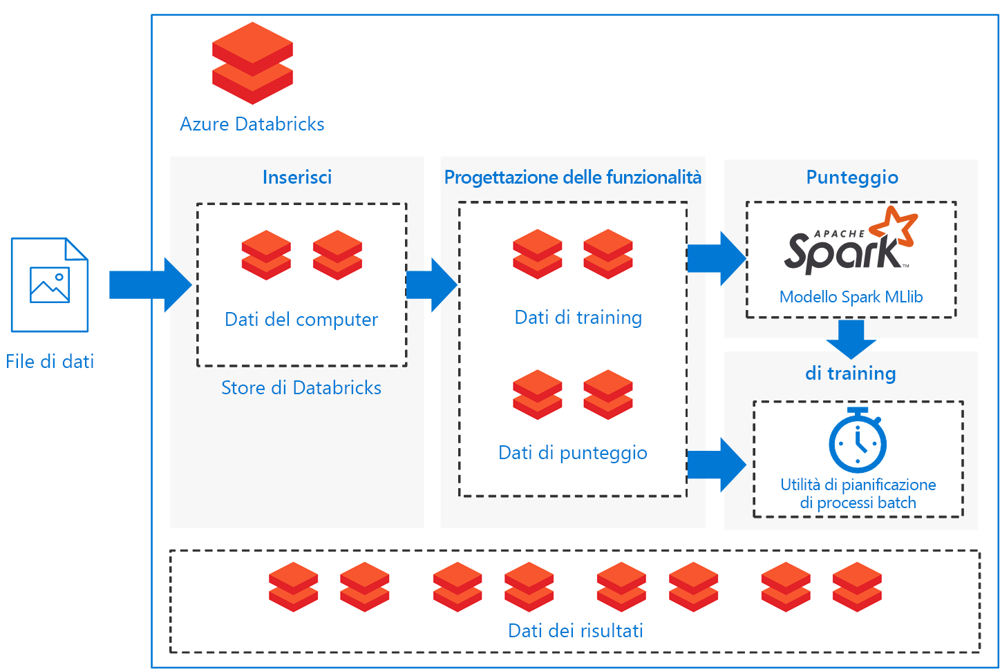

# Assegnazione dei punteggi in batch per i modelli Spark in Azure DatabricksBatch scoring of Spark models on Azure Databricks

Questa architettura di riferimento illustra come creare una soluzione scalabile per l'assegnazione del punteggio batch a un modello di classificazione Apache Spark in una pianificazione usando Azure Databricks, una piattaforma di strumenti analitici basata su Apache Spark ottimizzata per Azure.This reference architecture shows how to build a scalable solution for batch scoring an Apache Spark classification model on a schedule using Azure Databricks, an Apache Spark-based analytics platform optimized for Azure. La soluzione può essere usata come modello che può essere generalizzato per altri scenari.The solution can be used as a template that can be generalized to other scenarios.

Un'implementazione di riferimento per questa architettura è disponibile in  [GitHub][github].A reference implementation for this architecture is available on [GitHub][github].

**Scenario**: un'azienda di un settore che fa largo uso di risorse vuole ridurre al minimo i costi e i tempi di inattività associati a guasti meccanici imprevisti.**Scenario**: A business in an asset-heavy industry wants to minimize the costs and downtime associated with unexpected mechanical failures. Usando i dati IoT raccolti dai computer aziendali, è possibile creare un modello di manutenzione predittiva.Using IoT data collected from their machines, they can create a predictive maintenance model. Questo modello consente all'azienda di gestire i componenti in maniera proattiva, riparandoli prima che si guastino.This model enables the business to maintain components proactively and repair them before they fail. Ottimizzando l'uso dei componenti meccanici, l'azienda può controllare i costi e ridurre i tempi di inattività.By maximizing mechanical component use, they can control costs and reduce downtime.

Un modello di manutenzione predittiva raccoglie i dati dai computer e conserva esempi cronologici dei guasti dei componenti.A predictive maintenance model collects data from the machines and retains historical examples of component failures. Il modello può quindi essere usato per monitorare lo stato corrente dei componenti e stimare se un determinato componente si guasterà nel prossimo futuro.The model can then be used to monitor the current state of the components and predict if a given component will fail in the near future. Per casi d'uso e metodi di modellazione comuni, vedere [Guida di Azure AI per soluzioni di manutenzione predittiva][ai-guide].For common use cases and modeling approaches, see [Azure AI guide for predictive maintenance solutions][ai-guide].

Questa architettura di riferimento è progettata per carichi di lavoro che vengono attivati dalla presenza di nuovi dati dai computer dei componenti.This reference architecture is designed for workloads that are triggered by the presence of new data from the component machines. L'elaborazione prevede i passaggi seguenti:Processing involves the following steps:

1. Inserire i dati dall'archivio dati esterno in un archivio dati di Azure Databricks.Ingest the data from the external data store onto an Azure Databricks data store.

2. Eseguire il training di un modello di Machine Learning trasformando i dati in un set di dati di training e quindi compilando un modello Spark MLlib.Train a machine learning model by transforming the data into a training data set, then building a Spark MLlib model. MLlib è costituito dagli algoritmi e le utilità di Machine Learning più comuni, ottimizzati per sfruttare i vantaggi delle funzionalità di scalabilità dei dati di Spark.MLlib consists of most common machine learning algorithms and utilities optimized to take advantage of Spark data scalability capabilities.

3. Applicare il modello sottoposto a training per stimare (classificare) i guasti dei componenti trasformando i dati in un set di dati di punteggio.Apply the trained model to predict (classify) component failures by transforming the data into a scoring data set. Assegnare un punteggio ai dati con il modello Spark MLlib.Score the data with the Spark MLLib model.

4. Archiviare i risultati nell'archivio dati di Databricks per l'utilizzo post-elaborazione.Store results on the Databricks data store for post-processing consumption.

Su  [GitHub][github] sono disponibili dei notebook per eseguire ognuna di queste attività.Notebooks are provided on [GitHub][github] to perform each of these tasks.

## ArchitetturaArchitecture

L'architettura definisce un flusso di dati interamente contenuto in [Azure Databricks][databricks] e basato su un set di [notebook][notebooks] eseguiti in sequenza.The architecture defines a data flow that is entirely contained within [Azure Databricks][databricks] based on a set of sequentially executed [notebooks][notebooks]. È costituita dai componenti seguenti:It consists of the following components:

**[File di dati][github]**.**[Data files][github]**. L'implementazione di riferimento usa un set di dati simulato contenuto in cinque file di dati statici.The reference implementation uses a simulated data set contained in five static data files.

**[Inserimento][notebooks]**.**[Ingestion][notebooks]**. Il notebook di inserimento dati scarica i file di dati di input in una raccolta di set di dati di Databricks.The data ingestion notebook downloads the input data files into a collection of Databricks data sets. In uno scenario reale, i dati dei dispositivi IoT verrebbero trasmessi a un archivio accessibile da Databricks, come un archivio BLOB di Azure o Azure SQL Server.In a real-world scenario, data from IoT devices would stream onto Databricks-accessible storage such as Azure SQL Server or Azure Blob storage. Databricks supporta più [origini dati][data-sources].Databricks supports multiple [data sources][data-sources].

**Pipeline di training**.**Training pipeline**. Questo notebook esegue il notebook di progettazione delle funzionalità per creare un set di dati di analisi dai dati inseriti.This notebook executes the feature engineering notebook to create an analysis data set from the ingested data. Esegue quindi un notebook di compilazione modello che esegue il training del modello di Machine Learning usando la libreria di Machine Learning scalabile [Apache Spark MLlib][mllib].It then executes a model building notebook that trains the machine learning model using the [Apache Spark MLlib][mllib] scalable machine learning library.

**Pipeline di assegnazione del punteggio**.**Scoring pipeline**. Questo notebook esegue il notebook di progettazione delle funzionalità per creare un set di dati di punteggio dai dati inseriti, quindi esegue il notebook di assegnazione del punteggio.This notebook executes the feature engineering notebook to create scoring data set from the ingested data and executes the scoring notebook. Quest'ultimo usa il modello [Spark MLlib][mllib-spark] sottoposto a training per generare stime per le osservazioni nel set di dati di punteggio.The scoring notebook uses the trained [Spark MLlib][mllib-spark] model to generate predictions for the observations in the scoring data set. Le stime vengono archiviate nell'archivio risultati, un nuovo set di dati nell'archivio dati di Databricks.The predictions are stored in the results store, a new data set on the Databricks data store.

**Utilità di pianificazione**.**Scheduler**. Un [processo][job] pianificato di Databricks gestisce l'assegnazione del punteggio batch con il modello Spark.A scheduled Databricks [job][job] handles batch scoring with the Spark model. Il processo esegue il notebook della pipeline di assegnazione del punteggio, passando argomenti di variabile tramite i parametri del notebook per specificare i dettagli per la costruzione del set di dati di punteggio e la posizione in cui archiviare il set di dati dei risultati.The job executes the scoring pipeline notebook, passing variable arguments through notebook parameters to specify the details for constructing the scoring data set and where to store the results data set.

Lo scenario viene costruito come un flusso della pipeline.The scenario is constructed as a pipeline flow. Ogni notebook è ottimizzato per l'esecuzione in un'impostazione batch per ciascuna operazione: inserimento, progettazione delle funzionalità, compilazione del modello e assegnazione del punteggio al modello.Each notebook is optimized to perform in a batch setting for each of the operations: ingestion, feature engineering, model building, and model scorings. Per questo motivo il notebook di progettazione delle funzionalità è stato creato in modo da generare un set di dati generico per una qualsiasi delle operazioni di training, calibrazione, test o assegnazione del punteggio.To accomplish this, the feature engineering notebook is designed to generate a general data set for any of the training, calibration, testing, or scoring operations. In questo scenario viene usata una strategia di suddivisione temporale per queste operazioni, quindi i parametri del notebook vengono usati per impostare il filtro degli intervalli di date.In this scenario, we use a temporal split strategy for these operations, so the notebook parameters are used to set date-range filtering.

Poiché lo scenario crea una pipeline batch, viene fornito un set di notebook di esame facoltativi per esplorare l'output dei notebook di pipeline.Because the scenario creates a batch pipeline, we provide a set of optional examination notebooks to explore the output of the pipeline notebooks. Questi notebook sono disponibili nel repository GitHub:You can find these in the GitHub repository:

- `1a_raw-data_exploring`
- `2a_feature_exploration`
- `2b_model_testing`
- `3b_model_scoring_evaluation`

## ConsigliRecommendations

Databricks è configurato in modo da consentire di caricare e distribuire i modelli sottoposti a training per eseguire stime con i nuovi dati.Databricks is set up so you can load and deploy your trained models to make predictions with new data. Per questo scenario è stato usato Databricks per offrire i vantaggi aggiuntivi seguenti:We used Databricks for this scenario because it provides these additional advantages:

- Supporto del Single Sign-On mediante credenziali di Azure Active Directory.Single sign-on support using Azure Active Directory credentials.
- Utilità di pianificazione dei processi per eseguire i processi per le pipeline di produzione.Job scheduler to execute jobs for production pipelines.
- Notebook completamente interattivo con funzionalità di collaborazione, dashboard, API REST.Fully interactive notebook with collaboration, dashboards, REST APIs.
- Cluster illimitati scalabili a qualsiasi dimensione.Unlimited clusters that can scale to any size.
- Sicurezza avanzata, controllo degli accessi in base al ruolo e log di controllo.Advanced security, role-based access controls, and audit logs.

Per interagire con il servizio Azure Databricks, usare l'interfaccia [Workspace][workspace] di Databricks in un Web browser oppure l'[Interfaccia della riga di comando][cli].To interact with the Azure Databricks service, use the Databricks [Workspace][workspace] interface in a web browser or the [command-line interface][cli] (CLI). Accedere all'interfaccia della riga di comando di Databricks da qualsiasi piattaforma che supporti Python versioni da 2.7.9 a 3.6.Access the Databricks CLI from any platform that supports Python 2.7.9 to 3.6.

L'implementazione di riferimento usa i [notebook][notebooks] per eseguire le attività in sequenza.The reference implementation uses [notebooks][notebooks] to execute tasks in sequence. Ogni notebook archivia artefatti dei dati intermedi (set di dati di training, test, punteggio o risultati) nello stesso archivio dati dei dati di input.Each notebook stores intermediate data artifacts (training, test, scoring, or results data sets) to the same data store as the input data. L'obiettivo è semplificarne l'uso in base alle esigenze del proprio caso d'uso.The goal is to make it easy for you to use it as needed in your particular use case. In pratica, occorre connettere l'origine dati all'istanza di Azure Databricks per consentire ai notebook di leggere e scrivere direttamente nell'archivio.In practice, you would connect your data source to your Azure Databricks instance for the notebooks to read and write directly back into your storage.

È possibile monitorare l'esecuzione dei processi tramite l'interfaccia utente di Databricks, l'archivio dati o l'[interfaccia della riga di comando][cli] di Databricks, secondo le necessità.You can monitor job execution through the Databricks user interface, the data store, or the Databricks [CLI][cli] as necessary. Monitorare il cluster usando il [log eventi][log] e altre [metriche][metrics] fornite da Databricks.Monitor the cluster using the [event log][log] and other [metrics][metrics] that Databricks provides.

## Considerazioni sulle prestazioniPerformance considerations

Un cluster di Azure Databricks abilita la scalabilità automatica per impostazione predefinita, in modo che, in fase di runtime, Databricks possa riallocare dinamicamente i ruoli di lavoro all'account per le caratteristiche del processo.An Azure Databricks cluster enables autoscaling by default so that during runtime, Databricks dynamically reallocates workers to account for the characteristics of your job. Alcune parti della pipeline potrebbero richiedere più risorse di calcolo di altre.Certain parts of your pipeline may be more computationally demanding than others. Durante queste fasi del processo Databricks aggiunge altri ruoli di lavoro, rimuovendoli in seguito quando non sono più necessari.Databricks adds additional workers during these phases of your job (and removes them when they’re no longer needed). Con la scalabilità automatica è più facile ottenere un [utilizzo del cluster][cluster] elevato, perché non è necessario effettuare il provisioning del cluster per soddisfare un carico di lavoro.Autoscaling makes it easier to achieve high [cluster utilization][cluster], because you don’t need to provision the cluster to match a workload.

È inoltre possibile sviluppare pipeline pianificate più complesse usando [Azure Data Factory][adf] con Azure Databricks.Additionally, more complex scheduled pipelines can be developed by using [Azure Data Factory][adf] with Azure Databricks.

## Considerazioni sulle risorse di archiviazioneStorage considerations

In questa implementazione di riferimento i dati vengono archiviati direttamente nell'archivio di Databricks per semplicità.In this reference implementation, the data is stored directly within Databricks storage for simplicity. In un'impostazione di produzione, tuttavia, i dati possono essere archiviati in un archivio dati cloud come [Archivio BLOB di Azure][blob].In a production setting, however, the data can be stored on cloud data storage such as [Azure Blob Storage][blob]. [Databricks][databricks-connect] supporta anche Azure Data Lake Store, Azure SQL Data Warehouse, Azure Cosmos DB, Apache Kafka e Hadoop.[Databricks][databricks-connect] also supports Azure Data Lake Store, Azure SQL Data Warehouse, Azure Cosmos DB, Apache Kafka, and Hadoop.

## Considerazioni sul costoCost considerations

Azure Databricks è un'offerta Spark premium a cui è associato un costo.Azure Databricks is a premium Spark offering with an associated cost. Sono inoltre disponibili [piani tariffari][pricing] standard e premium per Databricks.In addition, there are standard and premium Databricks [pricing tiers][pricing].

Per questo scenario è sufficiente il piano tariffario standard.For this scenario, the standard pricing tier is sufficient. Tuttavia, se un'applicazione specifica deve poter ridimensionare automaticamente i cluster per gestire carichi di lavoro di grandi dimensioni o dashboard interattivi di Databricks, il livello premium potrebbe aumentare ulteriormente i costi.However, if your specific application requires automatically scaling clusters to handle larger workloads or interactive Databricks dashboards, the premium level could increase costs further.

I notebook della soluzione possono essere eseguiti su qualsiasi piattaforma basata su Spark con modifiche minime per rimuovere i pacchetti specifici di Databricks.The solution notebooks can run on any Spark-based platform with minimal edits to remove the Databricks-specific packages. Vedere le soluzioni simili seguenti per diverse piattaforme di Azure:See the following similar solutions for various Azure platforms:

- [Python in Azure Machine Learning Studio][python-aml][Python on Azure Machine Learning Studio][python-aml]
- [Servizi R per SQL Server][sql-r][SQL Server R services][sql-r]
- [PySpark in Azure Data Science Virtual Machine][py-dvsm][PySpark on an Azure Data Science Virtual Machine][py-dvsm]

## Distribuire la soluzioneDeploy the solution

Per distribuire questa architettura di riferimento, seguire la procedura descritta nel repository  [GitHub][github] per compilare una soluzione scalabile per l'assegnazione di punteggi ai modelli Spark in batch in Azure Databricks.To deploy this reference architecture, follow the steps described in the [GitHub][github] repository to build a scalable solution for scoring Spark models in batch on Azure Databricks.

## Architetture correlateRelated architectures

È disponibile anche un'architettura di riferimento che usa Spark per compilare [sistemi per raccomandazioni in tempo reale][recommendation] con punteggi offline precalcolati.We have also built a reference architecture that uses Spark for building [real-time recommendation systems][recommendation] with offline, pre-computed scores. Questi sistemi sono scenari comuni in cui i punteggi vengono elaborati in batch.These recommendation systems are common scenarios where scores are batch-processed.

[adf]: https://azure.microsoft.com/blog/operationalize-azure-databricks-notebooks-using-data-factory/
[ai-guide]: /azure/machine-learning/team-data-science-process/cortana-analytics-playbook-predictive-maintenance
[blob]: https://docs.databricks.com/spark/latest/data-sources/azure/azure-storage.html
[cli]: https://docs.databricks.com/user-guide/dev-tools/databricks-cli.html
[cluster]: https://docs.azuredatabricks.net/user-guide/clusters/sizing.html
[databricks]: /azure/azure-databricks/
[databricks-connect]: /azure/azure-databricks/databricks-connect-to-data-sources
[data-sources]: https://docs.databricks.com/spark/latest/data-sources/index.html
[github]: https://github.com/Azure/BatchSparkScoringPredictiveMaintenance
[job]: https://docs.databricks.com/user-guide/jobs.html
[log]: https://docs.databricks.com/user-guide/clusters/event-log.html
[metrics]: https://docs.databricks.com/user-guide/clusters/metrics.html
[mllib]: https://docs.databricks.com/spark/latest/mllib/index.html
[mllib-spark]: https://docs.databricks.com/spark/latest/mllib/index.html#apache-spark-mllib
[notebooks]: https://docs.databricks.com/user-guide/notebooks/index.html
[pricing]: https://azure.microsoft.com/en-us/pricing/details/databricks/
[python-aml]: https://gallery.azure.ai/Notebook/Predictive-Maintenance-Modelling-Guide-Python-Notebook-1
[py-dvsm]: https://gallery.azure.ai/Tutorial/Predictive-Maintenance-using-PySpark
[recommendation]: /azure/architecture/reference-architectures/ai/real-time-recommendation
[sql-r]: https://gallery.azure.ai/Tutorial/Predictive-Maintenance-Modeling-Guide-using-SQL-R-Services-1
[workspace]: https://docs.databricks.com/user-guide/workspace.html
