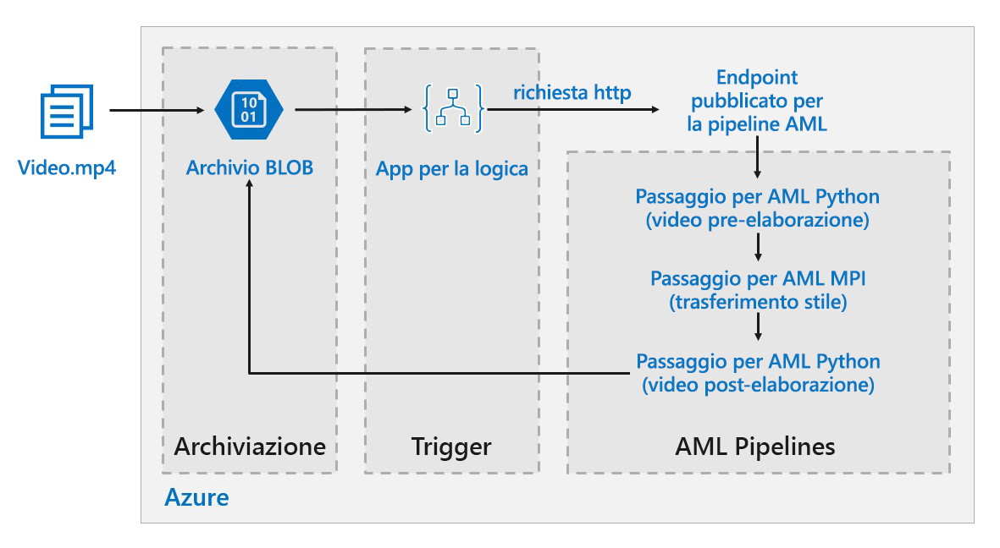

# Punteggio batch in Azure per modelli di apprendimento avanzato

Questa architettura di riferimento mostra come applicare la procedura di neural style transfer a un video tramite Azure Machine Learning. Lo *style transfer* è una tecnica di apprendimento avanzato che ridefinisce un'immagine esistente usando lo stile di un'altra immagine. Questa architettura può essere generalizzata per qualsiasi scenario che usa l'assegnazione del punteggio batch con l'apprendimento avanzato. [**Distribuire questa soluzione**](#deploy-the-solution).

**Scenario**: Un'organizzazione di supporti dispone di un video di cui desidera modificare l'aspetto, rendendolo simile a un dipinto specifico. L'organizzazione vuole applicare questo stile a tutti i frame del video in modo tempestivo e automatico. Per altre informazioni sugli algoritmi di neural style transfer, vedere il PDF [Image Style Transfer Using Convolutional Neural Networks][image-style-transfer] (Style transfer di immagini tramite reti neurali convoluzionali).

| Immagine stile: | Video di input/contenuto: | Video di output: |
|--------|--------|---------|
|  |  *fare clic per visualizzare il video* |  *fare clic per visualizzare il video* |

Questa architettura di riferimento è progettata per carichi di lavoro che vengono attivati dalla presenza di nuovi supporti in Archiviazione di Azure.

L'elaborazione prevede i passaggi seguenti:

1. Caricare un file video nello spazio di archiviazione.
1. Il file video attiva un'app per la logica per l'invio di una richiesta all'endpoint pubblicato della pipeline di Azure Machine Learning.
1. La pipeline elabora il video, applica lo style transfer con MPI e poi lo post-elabora.
1. Quando la pipeline viene completata, l'output viene salvato di nuovo nell'archiviazione BLOB.

## Architettura

L'architettura è costituita dai componenti seguenti.

### Calcolo

**[Servizio Azure Machine Learning][amls]**: usa le pipeline di Azure Machine Learning per creare sequenze di calcolo riproducibili e facilmente gestibili. Offre anche una destinazione di calcolo gestita (in cui è possibile eseguire il calcolo della pipeline), l'[ambiente di calcolo di Machine Learning di Azure][aml-compute] per il training, la distribuzione e l'assegnazione di punteggi ai modelli di Machine Learning. 

### Archiviazione

**[Archiviazione BLOB][blob-storage]**: si usa per archiviare tutte le immagini (di input, di stile e di output). Il servizio Azure Machine Learning si integra con l'archiviazione BLOB, per cui gli utenti non devono spostare manualmente i dati tra le piattaforme di calcolo e l'archiviazione BLOB. Archiviazione BLOB è anche molto conveniente per le prestazioni richieste da questo carico di lavoro.

### Trigger/pianificazione

**[App per la logica di Azure][logic-apps]** viene usato per attivare il flusso di lavoro. Quando l'app per la logica rileva che un BLOB è stato aggiunto al contenitore, attiva la pipeline di Azure Machine Learning. App per la logica rappresenta una buona base per questa architettura di riferimento perché offre un modo semplice per rilevare le modifiche apportate ad Archiviazione BLOB e fornisce una procedura semplice per la modifica del trigger.

### Pre-elaborazione e post-elaborazione dei dati

Questa architettura di riferimento usa un filmato di repertorio di un orangutan in una struttura ad albero. Il filmato è disponibile per il download [qui][source-video].

1. Usare [FFmpeg][ffmpeg] per estrarre il file audio dal filmato video, in modo da riunirlo al video di output in un secondo momento.
1. Usare FFmpeg per suddividere il video in singoli frame. I frame verranno elaborati in modo indipendente, in parallelo.
1. A questo punto è possibile applicare il neural style transfer a ogni singolo fotogramma in parallelo.
1. Una volta elaborato ogni fotogramma, è necessario usare FFmpeg per riunirli di nuovo.
1. Infine, il file audio verrà ricollegato al filmato riunito.

## Considerazioni sulle prestazioni

### GPU e CPU a confronto

Per carichi di lavoro di apprendimento avanzato, le GPU in genere garantiscono prestazioni nettamente superiori rispetto alle CPU, per cui di norma è necessario un cluster consistente di CPU per ottenere prestazioni analoghe. Anche se in questa architettura è possibile usare soltanto CPU, le GPU offrono comunque un rapporto costi/prestazioni di gran lunga superiore. Si consiglia l'utilizzo della più recente combinazione macchina virtuale-dimensioni-gpu [serie NCv3] di macchine virtuali ottimizzate per la GPU.

Le GPU non sono abilitate per impostazione predefinita in tutte le aree. Assicurarsi di selezionare un'area con GPU abilitate. Le sottoscrizioni prevedono anche una quota predefinita di un numero di core pari a zero per macchine virtuali ottimizzate per la GPU. È possibile aumentare questa quota inoltrando una richiesta di supporto. Assicurarsi che la sottoscrizione disponga di una quota sufficiente per eseguire il carico di lavoro.

### Esecuzione in parallelo tra macchine virtuali e core a confronto

Quando si esegue un processo di style transfer come processo batch, i processi che vengono eseguiti principalmente nelle GPU dovranno essere eseguiti in parallelo tra le macchine virtuali. Sono possibili due approcci: è possibile creare un cluster di dimensioni maggiori tramite macchine virtuali con una GPU singola o creare un cluster più piccolo tramite macchine virtuali con più GPU.

Per questo carico di lavoro, queste due opzioni garantiranno prestazioni analoghe. L'utilizzo di un minor numero di macchine virtuali con più GPU per ognuna può contribuire a ridurre lo spostamento dati. Tuttavia, il volume di dati per processo per questo carico di lavoro non è molto grande, per cui non si osserverà una limitazione eccessiva da parte dell'archiviazione BLOB.

### Passaggio MPI 

Quando si crea la pipeline in Azure Machine Learning, uno dei passaggi usati per eseguire il calcolo parallelo è il passaggio MPI, che consente di dividere uniformemente i dati tra i nodi disponibili. Questo passaggio viene eseguito solo quando tutti i nodi richiesti sono pronti. Se un nodo presenta un errore o viene annullato (nel caso di una macchina virtuale a bassa priorità), il passaggio MPI dovrà essere eseguito di nuovo. 

## Considerazioni relative alla sicurezza

### Limitazione dell'accesso ad Archiviazione BLOB di Azure

In questa architettura di riferimento, Archiviazione BLOB di Azure è il componente di archiviazione principale che deve essere protetto. La distribuzione della baseline illustrata nel repository GitHub usa chiavi dell'account di archiviazione per accedere all'archiviazione BLOB. Per livelli maggiori di controllo e protezione, provare a usare una firma di accesso condiviso (SAS), che consente l'accesso limitato agli oggetti presenti nell'archiviazione, senza la necessità di codificare le chiavi dell'account o salvarle in testo non crittografato. Questo approccio è particolarmente utile in quanto le chiavi dell'account sono visibili in testo non crittografato nell'interfaccia della finestra di progettazione di App per la logica. L'uso di una firma di accesso condiviso consente anche di garantire che l'account di archiviazione disponga di una governance appropriata e che l'accesso sia concesso soltanto agli utenti desiderati.

Per gli scenari con più dati sensibili, assicurarsi che tutte le chiavi di archiviazione siano protette, poiché concedono un accesso completo a tutti i dati di input e output dal carico di lavoro.

### Crittografia e spostamento dei dati

Questa architettura di riferimento usa lo style transfer come esempio di processo di punteggio batch. Per altri scenari basati su dati sensibili, i dati contenuti nella risorsa di archiviazione dovranno essere crittografati a riposo. Ogni volta che i dati vengono spostati da una posizione a quella successiva, usare SSL per proteggere il trasferimento dei dati. Per altre informazioni, vedere la [Guida alla sicurezza di Archiviazione di Azure][storage-security].

### Protezione del calcolo in una rete virtuale

Quando si distribuisce un cluster dell'ambiente di calcolo di Machine Learning, è possibile configurarlo in modo che ne venga eseguito il provisioning all'interno di una subnet di una [rete virtuale][virtual-network]. I nodi di calcolo nel cluster possono così comunicare in modo sicuro con altre macchine virtuali. 

### Protezione da attività dannose

Negli scenari in cui sono presenti più utenti, assicurarsi che i dati sensibili siano protetti da attività dannose. Se l'accesso a questa distribuzione è concesso anche ad altri utenti per personalizzare i dati di input, prendere nota delle precauzioni e delle considerazioni seguenti:

- Usare RBAC per limitare l'accesso degli utenti alle sole risorse di cui necessitano.
- Fornire due account di archiviazione separati. Archiviare i dati di input e output nel primo account. Gli utenti esterni potranno avere accesso a questo account. Archiviare script eseguibili e file di log di output nell'altro account. Gli utenti esterni non dovranno avere accesso a questo account. In questo modo gli utenti esterni non potranno modificare alcun file eseguibile (per inserire codici dannosi), né avranno accesso ai file di log, che potrebbero contenere informazioni riservate.
- Gli utenti malintenzionati possono perpetrare attacchi DDoS alla coda processi o inserire in essa messaggi non elaborabili in formato non valido, causando il blocco del sistema o errori di rimozione dalla coda.

## Monitoraggio e registrazione

### Monitoraggio dei processi Batch

Quando si esegue un processo, è importante monitorare lo stato di avanzamento e assicurarsi che tutto funzioni come previsto. Tuttavia, il monitoraggio in un cluster di nodi attivi può rivelarsi un problema.

Per avere un'idea dello stato complessivo del cluster, passare al pannello Machine Learning del portale di Azure per controllare lo stato dei nodi del cluster. Se un nodo è inattivo oppure un processo ha avuto esito negativo, i log degli errori vengono salvati nell'archiviazione BLOB e sono accessibili anche dal portale di Azure.

È possibile arricchire ulteriormente il monitoraggio connettendo i log ad Application Insights o eseguendo processi separati per il polling dello stato del cluster e dei relativi processi.

### Registrazione con Azure Machine Learning

Azure Machine Learning registra automaticamente tutti i flussi StdOut/StdEr per l'account di archiviazione BLOB associato. Se non diversamente specificato, l'area di lavoro di Machine Learning effettua automaticamente il provisioning di un account di archiviazione in cui vi scarica i log. È anche possibile usare uno strumento di esplorazione dell'archiviazione, come ad esempio Storage Explorer, che offre un'esperienza molto più semplice per scorrere i file di log.

## Considerazioni sul costo

Rispetto ai componenti di pianificazione e archiviazione, le risorse di calcolo usate in questa architettura di riferimento sono nettamente superiori in termini di costi. Una delle sfide principali consiste nel riuscire ad abbinare efficacemente in parallelo il lavoro all'interno di un cluster di computer abilitati per GPU.

Le dimensioni del cluster dell'ambiente di calcolo di Machine Learning possono aumentare o diminuire automaticamente a seconda dei processi presenti nella coda. È possibile abilitare il ridimensionamento automatico a livello di codice impostando i nodi minimo e massimo.

Per i lavori che non richiedono un'elaborazione immediata, configurare il ridimensionamento automatico in modo che lo stato predefinito (minimo) sia rappresentato da un cluster con zero nodi. Con questa configurazione, il cluster inizia con un numero di nodi pari a zero, per poi aumentare quando rileva processi nella coda. Se il processo di assegnazione punteggio batch si verifica poche volte al giorno, questa impostazione consente di ottenere risparmi significativi sui costi.

La scalabilità automatica potrebbe non essere appropriata per i processi batch eseguiti in tempi troppo ravvicinati. Anche il tempo necessario per avviare e interrompere un cluster comporta dei costi. Pertanto, se un carico di lavoro batch inizia solo pochi minuti dopo il termine del processo precedente, potrebbe essere più conveniente lasciare il cluster attivo tra i processi.

L'ambiente di calcolo di Machine Learning supporta anche macchine virtuali a bassa priorità. In questo modo è possibile eseguire il calcolo in macchine virtuali scontate, con l'avvertenza che potrebbero essere annullate in qualsiasi momento. Le macchine virtuali a bassa priorità sono ideali per carichi di lavoro di assegnazione di punteggi non critici.

## Distribuire la soluzione

Per distribuire questa architettura di riferimento, seguire la procedura descritta nel [repository GitHub][deployment].

> [!NOTE]
> È anche possibile distribuire un'architettura di assegnazione del punteggio in batch per i modelli di Deep Learning usando il servizio Azure Kubernetes. Seguire la procedura descritta nel [repository Github][deployment2].

<!-- links -->

[aml-compute]: /azure/machine-learning/service/how-to-set-up-training-targets#amlcompute
[amls]: /azure/machine-learning/service/overview-what-is-azure-ml
[azcopy]: /azure/storage/common/storage-use-azcopy-linux
[blob-storage]: /azure/storage/blobs/storage-blobs-introduction
[container-instances]: /azure/container-instances/
[container-registry]: /azure/container-registry/
[deployment]: https://github.com/Azure/Batch-Scoring-Deep-Learning-Models-With-AML
[deployment2]: https://github.com/Azure/Batch-Scoring-Deep-Learning-Models-With-AKS
[ffmpeg]: https://www.ffmpeg.org/
[image-style-transfer]: https://www.cv-foundation.org/openaccess/content_cvpr_2016/papers/Gatys_Image_Style_Transfer_CVPR_2016_paper.pdf
[logic-apps]: /azure/logic-apps/
[source-video]: https://happypathspublic.blob.core.windows.net/videos/orangutan.mp4
[storage-security]: /azure/storage/common/storage-security-guide
[vm-sizes-gpu]: /azure/virtual-machines/windows/sizes-gpu
[virtual-network]: /azure/machine-learning/service/how-to-enable-virtual-network
