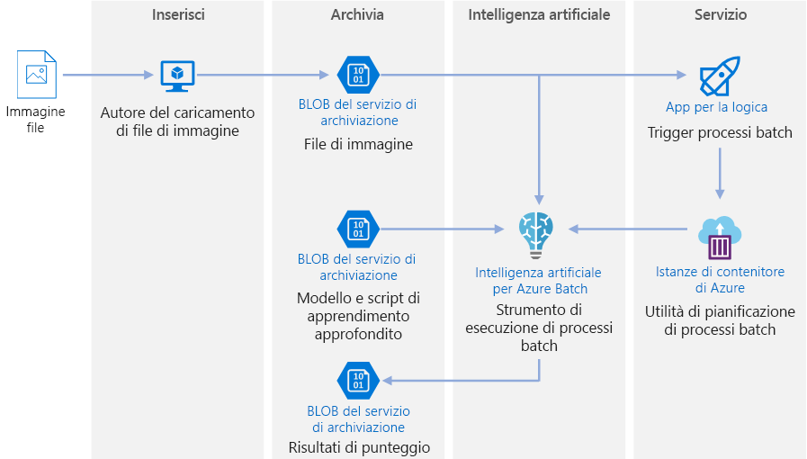
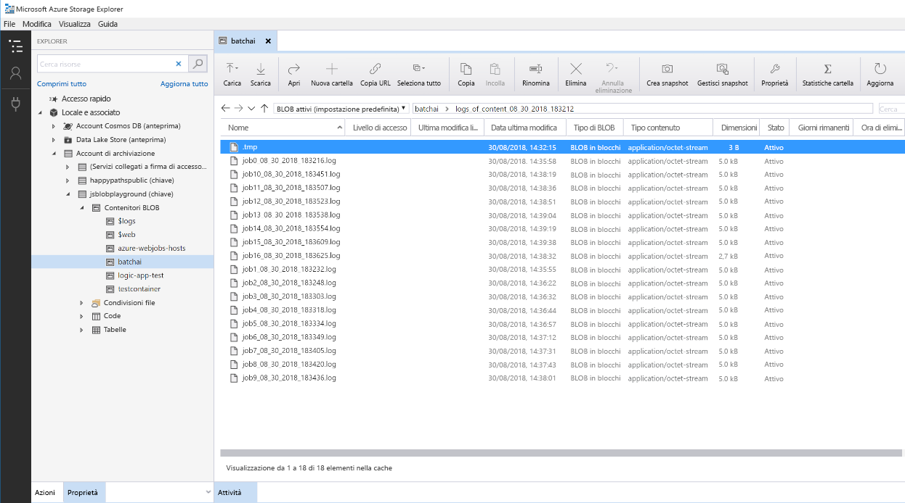

# Punteggio batch in Azure per modelli di apprendimento avanzatoBatch scoring on Azure for deep learning models

Questa architettura di riferimento mostra come applicare la procedura di neural style transfer a un video tramite Azure Batch per intelligenza artificiale.This reference architecture shows how to apply neural style transfer to a video, using Azure Batch AI. Lo *style transfer* è una tecnica di apprendimento avanzato che ridefinisce un'immagine esistente usando lo stile di un'altra immagine.*Style transfer* is a deep learning technique that composes an existing image in the style of another image. Questa architettura può essere generalizzata per qualsiasi scenario che usa l'assegnazione del punteggio batch con l'apprendimento avanzato.This architecture can be generalized for any scenario that uses batch scoring with deep learning. [**Distribuire questa soluzione**](#deploy-the-solution).[**Deploy this solution**](#deploy-the-solution).

**Scenario**: Un'organizzazione di supporti dispone di un video di cui desidera modificare l'aspetto, rendendolo simile a un dipinto specifico.**Scenario**: A media organization has a video whose style they want to change to look like a specific painting. L'organizzazione vuole applicare questo stile a tutti i frame del video in modo tempestivo e automatico.The organization wants to be able to apply this style to all frames of the video in a timely manner and in an automated fashion. Per altre informazioni sugli algoritmi di neural style transfer, vedere il PDF [Image Style Transfer Using Convolutional Neural Networks][image-style-transfer] (Style transfer di immagini tramite reti neurali convoluzionali).For more background about neural style transfer algorithms, see [Image Style Transfer Using Convolutional Neural Networks][image-style-transfer] (PDF).

| Immagine stile:Style image: | Video di input/contenuto:Input/content video: | Video di output:Output video: |
|--------|--------|---------|
|  |  *fare clic per visualizzare il video* *click to view video* |  *fare clic per visualizzare il video* *click to view video* |

Questa architettura di riferimento è progettata per carichi di lavoro che vengono attivati dalla presenza di nuovi supporti in Archiviazione di Azure.This reference architecture is designed for workloads that are triggered by the presence of new media in Azure storage. L'elaborazione prevede i passaggi seguenti:Processing involves the following steps:

1. Caricare un'immagine di stile selezionata (ad esempio, un dipinto di Van Gogh) e uno script di style transfer in Archiviazione BLOB.Upload a selected style image (like a Van Gogh painting) and a style transfer script to Blob Storage.
1. Creare un cluster Azure Batch per intelligenza artificiale con scalabilità automatica, pronto per avviare l'esecuzione del lavoro.Create an autoscaling Batch AI cluster that is ready to start taking work.
1. Suddividere il file video in singoli frame e caricarli in Archiviazione BLOB.Split the video file into individual frames and upload those frames into Blob Storage.
1. Una volta caricati tutti i frame, caricare un file di trigger in Archiviazione BLOB.Once all frames are uploaded, upload a trigger file to Blob Storage.
1. Questo file attiva un'app per la logica che crea un contenitore in esecuzione in Istanze di contenitore di Azure.This file triggers a Logic App that creates a container running in Azure Container Instances.
1. Il contenitore esegue uno script che crea i processi di Azure Batch per intelligenza artificiale.The container runs a script that creates the Batch AI jobs. Ogni processo applica la procedura di neural style transfer in parallelo tra i nodi del cluster Batch per intelligenza artificiale.Each job applies the neural style transfer in parallel across the nodes of the Batch AI cluster.
1. Una volta generate, le immagini vengono salvate in Archiviazione BLOB di Azure.Once the images are generated, they are saved back to Blob Storage.
1. Scaricare i frame generati e unire nuovamente le immagini in un video.Download the generated frames, and stitch back the images into a video.

## ArchitetturaArchitecture

L'architettura è costituita dai componenti seguenti.This architecture consists of the following components.

### CalcoloCompute

**[Azure Batch per intelligenza artificiale][batch-ai]** viene usato per eseguire l'algoritmo di neural style transfer.**[Azure Batch AI][batch-ai]** is used to run the neural style transfer algorithm. Azure Batch per intelligenza artificiale supporta carichi di lavoro di apprendimento avanzato, fornendo ambienti strutturati in contenitori e preconfigurati per framework di apprendimento automatico su macchine virtuali abilitate per GPU.Batch AI supports deep learning workloads by providing containerized environments that are pre-configured for deep learning frameworks, on GPU-enabled VMs. Con Azure Batch per intelligenza artificiale è anche possibile connettere il cluster di elaborazione ad Archiviazione BLOB.Batch AI can also connect the compute cluster to Blob storage.

### ArchiviazioneStorage

**[Archiviazione BLOB][blob-storage]** viene usata per archiviare tutte le immagini (di input, di stile e di output), così come tutti i log prodotti da Azure Batch per intelligenza artificiale.**[Blob storage][blob-storage]** is used to store all images (input images, style images, and output images) as well as all logs produced from Batch AI. Archiviazione BLOB si integra con Azure Batch per intelligenza artificiale tramite [blobfuse][blobfuse], un file system virtuale open source supportato da Archiviazione BLOB.Blob storage integrates with Batch AI via [blobfuse][blobfuse], an open-source virtual filesystem that is backed by Blob storage. Archiviazione BLOB è anche molto conveniente per le prestazioni richieste da questo carico di lavoro.Blob storage is also very cost-effective for the performance that this workload requires.

### Trigger/pianificazioneTrigger / scheduling

**[App per la logica di Azure][logic-apps]** viene usato per attivare il flusso di lavoro.**[Azure Logic Apps][logic-apps]** is used to trigger the workflow. Quando App per la logica rileva che un BLOB è stato aggiunto al contenitore, attiva il processo di Batch per intelligenza artificiale.When the Logic App detects that a blob has been added to the container, it triggers the Batch AI process. App per la logica rappresenta una buona base per questa architettura di riferimento perché offre un modo semplice per rilevare le modifiche apportate ad Archiviazione BLOB e fornisce una procedura semplice per la modifica del trigger.Logic Apps is a good fit for this reference architecture because it's an easy way to detect changes to blob storage and provides an easy process for changing the trigger.

**[Istanze di contenitore di Azure][container-instances]** viene usato per eseguire gli script Python che creano i processi Batch per intelligenza artificiale.**[Azure Container Instances][container-instances]** is used to run the Python scripts that create the Batch AI jobs. Un modo pratico per eseguirli su richiesta consiste nell'eseguire questi script all'interno di un contenitore Docker.Running these scripts inside a Docker container is a convenient way to run them on demand. Per questa architettura viene usato Istanze di contenitore, poiché esiste un connettore App per la logica predefinito che consente ad App per la logica di attivare il processo Batch per intelligenza artificiale.For this architecture, we use Container Instances because there is a pre-built Logic App connector for it, which allows the Logic App to trigger the Batch AI job. Istanze di contenitore può attivare rapidamente i processi senza stato.Container Instances can spin up stateless processes quickly.

**[DockerHub][dockerhub]** viene usato per archiviare l'immagine Docker che Istanze di contenitore usa per la creazione del processo.**[DockerHub][dockerhub]** is used to store the Docker image that Container Instances uses to execute the job creation process. DockerHub è stato scelto per questa architettura perché è facile da usare ed è il repository di immagini predefinito per gli utenti di Docker.DockerHub was chosen for this architecture because it's easy to use and is the default image repository for Docker users. È possibile usare anche il [Registro contenitori di Azure][container-registry].[Azure Container Registry][container-registry] can also be used.

### Preparazione dei datiData preparation

Questa architettura di riferimento usa un filmato di repertorio di un orangutan in una struttura ad albero.This reference architecture uses video footage of an orangutan in a tree. È possibile scaricare il filmato da [qui][source-video] ed elaborarlo per il flusso di lavoro seguendo questa procedura:You can download the footage from [here][source-video] and process it for the workflow by following these steps:

1. Usare [AzCopy][azcopy] per scaricare il video dal BLOB pubblico.Use [AzCopy][azcopy] to download the video from the public blob.
2. Usare [FFmpeg][ffmpeg] per estrarre il file audio, in modo da riunirlo al video di output in un secondo momento.Use [FFmpeg][ffmpeg] to extract the audio file, so that the audio file can be stitched back into the output video later.
3. Usare FFmpeg per suddividere il video in singoli frame.Use FFmpeg to break the video into individual frames. I frame verranno elaborati in modo indipendente, in parallelo.The frames will be processed independently, in parallel.
4. Usare AzCopy per copiare i singoli frame nel contenitore BLOB.Use AzCopy to copy the individual frames into your blob container.

In questa fase, il video è in un formato utilizzabile per il neural style transfer.At this stage, the video footage is in a form that can be used for neural style transfer.

## Considerazioni sulle prestazioniPerformance considerations

### GPU e CPU a confrontoGPU vs CPU

Per carichi di lavoro di apprendimento avanzato, le GPU in genere garantiscono prestazioni nettamente superiori rispetto alle CPU, per cui di norma è necessario un cluster consistente di CPU per ottenere prestazioni analoghe.For deep learning workloads, GPUs will generally out-perform CPUs by a considerable amount, to the extent that a sizeable cluster of CPUs is usually needed to get comparable performance. Anche se in questa architettura è possibile usare soltanto CPU, le GPU offrono comunque un rapporto costi/prestazioni di gran lunga superiore.While it's an option to use only CPUs in this architecture, GPUs will provide a much better cost/performance profile. Si consiglia l'utilizzo della più recente combinazione macchina virtuale-dimensioni-gpu [serie NCv3] di macchine virtuali ottimizzate per la GPU.We recommend using the latest [NCv3 series]vm-sizes-gpu of GPU optimized VMs.

Le GPU non sono abilitate per impostazione predefinita in tutte le aree.GPUs are not enabled by default in all regions. Assicurarsi di selezionare un'area con GPU abilitate.Make sure to select a region with GPUs enabled. Le sottoscrizioni prevedono anche una quota predefinita di un numero di core pari a zero per macchine virtuali ottimizzate per la GPU.In addition, subscriptions have a default quota of zero cores for GPU-optimized VMs. È possibile aumentare questa quota inoltrando una richiesta di supporto.You can raise this quota by opening a support request. Assicurarsi che la sottoscrizione disponga di una quota sufficiente per eseguire il carico di lavoro.Make sure that your subscription has enough quota to run your workload.

### Esecuzione in parallelo tra macchine virtuali e core a confrontoParallelizing across VMs vs cores

Quando si esegue un processo di style transfer come processo batch, i processi che vengono eseguiti principalmente nelle GPU dovranno essere eseguiti in parallelo tra le macchine virtuali.When running a style transfer process as a batch job, the jobs that run primarily on GPUs will have to be parallelized across VMs. Sono possibili due approcci: è possibile creare un cluster di dimensioni maggiori tramite macchine virtuali con una GPU singola o creare un cluster più piccolo tramite macchine virtuali con più GPU.Two approaches are possible: You can create a larger cluster using VMs that have a single GPU, or create a smaller cluster using VMs with many GPUs.

Per questo carico di lavoro, queste due opzioni garantiranno prestazioni analoghe.For this workload, these two options will have comparable performance. L'utilizzo di un minor numero di macchine virtuali con più GPU per ognuna può contribuire a ridurre lo spostamento dati.Using fewer VMs with more GPUs per VM can help to reduce data movement. Tuttavia, il volume di dati per processo per questo carico di lavoro non è molto grande, per cui non si osserverà una limitazione eccessiva da parte dell'archiviazione BLOB.However, the data volume per job for this workload is not very big, so you won't observe much throttling by blob storage.

### Dimensioni batch delle immagini per singolo processo Batch per intelligenza artificialeImages batch size per Batch AI job

Un altro parametro che deve essere configurato è rappresentato dal numero di immagini da elaborare per ogni processo Batch per intelligenza artificiale.Another parameter that must be configured is the number of images to process per Batch AI job. Da un lato, è necessario assicurarsi che il lavoro venga distribuito su vasta scala tra i nodi e che, se un processo ha esito negativo, non sia necessario ripetere troppe immagini.On the one hand, you want to ensure that work is spread broadly across the nodes and that if a job fails, you don't have to retry too many images. In questo modo si avranno molti processi Batch per intelligenza artificiale e pertanto un numero ridotto di immagini da elaborare per ogni processo.That points to having many Batch AI jobs and thus a low number of images to process per job. Dall'altro lato, se per ogni processo viene elaborato un numero eccessivamente ridotto di immagini, il tempo di installazione/avvio diventa estremamente lungo.On the other hand, if too few images are processed per job, the setup/startup time becomes disproportionately large. È possibile impostare un numero di processi uguale al numero massimo di nodi del cluster.You can set the number of jobs to equal the maximum number of nodes in the cluster. In questo modo si otterranno i massimi risultati, supponendo che nessun processo abbia esito negativo, perché i costi di installazione/avvio vengono ridotti al minimo.This will be the most performant assuming that no jobs fail, because it minimizes the amount of setup/startup cost. Tuttavia, se un processo ha esito negativo, potrebbe essere necessario rielaborare un numero elevato di immagini.However, if a job fails, a large number of images might need to be reprocessed.

### File serverFile servers

Quando si usa Azure Batch per intelligenza artificiale, è possibile scegliere più opzioni di archiviazione, a seconda della velocità effettiva necessaria per lo scenario.When using Batch AI, you can choose multiple storage options depending on the throughput needed for your scenario. Per carichi di lavoro con requisiti di bassa velocità effettiva, l'uso di Archiviazione BLOB (tramite blobfuse) dovrebbe essere sufficiente.For workloads with low throughput requirements, using blob storage (via blobfuse) should be enough. In alternativa, Azure Batch per intelligenza artificiale supporta anche un file server Batch per intelligenza artificiale, un NFS a nodo singolo gestito che può essere montato automaticamente su nodi del cluster per offrire una posizione di archiviazione accessibile a livello centrale per i processi.Alternatively, Batch AI also supports a Batch AI File Server, a managed single-node NFS, which can be automatically mounted on cluster nodes to provide a centrally accessible storage location for jobs. Nella maggior parte dei casi è necessario un solo file server in un'area di lavoro ed è possibile separare i dati per i processi di training in directory diverse.For most cases, only one file server is needed in a workspace, and you can separate data for your training jobs into different directories. Se un NFS a nodo singolo non è appropriato per i carichi di lavoro, Azure Batch per intelligenza artificiale supporta altre opzioni di archiviazione, tra cui File di Azure o soluzioni personalizzate, come ad esempio un file system Gluster o Lustre.If a single-node NFS isn't appropriate for your workloads, Batch AI supports other storage options, including Azure Files or custom solutions such as a Gluster or Lustre file system.

## Considerazioni relative alla sicurezzaSecurity considerations

### Limitazione dell'accesso ad Archiviazione BLOB di AzureRestricting access to Azure blob storage

In questa architettura di riferimento, Archiviazione BLOB di Azure è il componente di archiviazione principale che deve essere protetto.In this reference architecture, Azure blob storage is the main storage component that needs to be protected. La distribuzione della baseline illustrata nel repository GitHub usa chiavi dell'account di archiviazione per accedere all'archiviazione BLOB.The baseline deployment shown in the GitHub repo uses storage account keys to access the blob storage. Per livelli maggiori di controllo e protezione, provare a usare una firma di accesso condiviso (SAS),For further control and protection, consider using a shared access signature (SAS) instead. che consente l'accesso limitato agli oggetti presenti nell'archiviazione, senza la necessità di codificare le chiavi dell'account o salvarle in testo non crittografato.This grants limited access to objects in storage, without needing to hard code the account keys or save them in plaintext. Questo approccio è particolarmente utile in quanto le chiavi dell'account sono visibili in testo non crittografato nell'interfaccia della finestra di progettazione di App per la logica.This approach is especially useful because account keys are visible in plaintext inside of Logic App's designer interface. L'uso di una firma di accesso condiviso consente anche di garantire che l'account di archiviazione disponga di una governance appropriata e che l'accesso sia concesso soltanto agli utenti desiderati.Using an SAS also helps to ensure that the storage account has proper governance, and that access is granted only to the people intended to have it.

Per gli scenari con più dati sensibili, assicurarsi che tutte le chiavi di archiviazione siano protette, poiché concedono un accesso completo a tutti i dati di input e output dal carico di lavoro.For scenarios with more sensitive data, make sure that all of your storage keys are protected, because these keys grant full access to all input and output data from the workload.

### Crittografia e spostamento dei datiData encryption and data movement

Questa architettura di riferimento usa lo style transfer come esempio di processo di punteggio batch.This reference architecture uses style transfer as an example of a batch scoring process. Per altri scenari basati su dati sensibili, i dati contenuti nella risorsa di archiviazione dovranno essere crittografati a riposo.For more data-sensitive scenarios, the data in storage should be encrypted at rest. Ogni volta che i dati vengono spostati da una posizione a quella successiva, usare SSL per proteggere il trasferimento dei dati.Each time data is moved from one location to the next, use SSL to secure the data transfer. Per altre informazioni, vedere la [Guida alla sicurezza di Archiviazione di Azure][storage-security].For more information, see [Azure Storage security guide][storage-security].

### Protezione dei dati in una rete virtualeSecuring data in a virtual network

Quando si distribuisce un cluster Batch per intelligenza artificiale, è possibile configurare il cluster perché venga eseguito il provisioning all'interno di una subnet di una rete virtuale.When deploying your Batch AI cluster, you can configure your cluster to be provisioned inside a subnet of a virtual network. In questo modo i nodi di calcolo nel cluster possono comunicare in modo sicuro con altre macchine virtuali o addirittura con una rete locale.This allows the compute nodes in the cluster to communicate securely with other virtual machines, or even with an on-premises network. È anche possibile usare [endpoint di servizio][service-endpoints] con archiviazione BLOB per concedere l'accesso da una rete virtuale, oppure usare un NFS a nodo singolo all'interno della rete virtuale con Batch per intelligenza artificiale per garantire che i dati siano sempre protetti.You can also use [service endpoints][service-endpoints] with blob storage to grant access from a virtual network or use a single-node NFS inside the VNET with Batch AI to ensure that the data is always protected.

### Protezione da attività dannoseProtecting against malicious activity

Negli scenari in cui sono presenti più utenti, assicurarsi che i dati sensibili siano protetti da attività dannose.In scenarios where there are multiple users, make sure that sensitive data is protected against malicious activity. Se l'accesso a questa distribuzione è concesso anche ad altri utenti per personalizzare i dati di input, prendere nota delle precauzioni e delle considerazioni seguenti:If other users are given access to this deployment to customize the input data, take note of the following precautions and considerations:

- Usare RBAC per limitare l'accesso degli utenti alle sole risorse di cui necessitano.Use RBAC to limit users' access to only the resources they need.
- Fornire due account di archiviazione separati.Provision two separate storage accounts. Archiviare i dati di input e output nel primo account.Store input and output data in the first account. Gli utenti esterni potranno avere accesso a questo account.External users can be given access to this account. Archiviare script eseguibili e file di log di output nell'altro account.Store executable scripts and output log files in the other account. Gli utenti esterni non dovranno avere accesso a questo account.External users should not have access to this account. In questo modo gli utenti esterni non potranno modificare alcun file eseguibile (per inserire codici dannosi), né avranno accesso ai file di log, che potrebbero contenere informazioni riservate.This will ensure that external users cannot modify any executable files (to inject malicious code), and don't have access to logfiles, which could hold sensitive information.
- Gli utenti malintenzionati possono perpetrare attacchi DDoS alla coda processi o inserire in essa messaggi non elaborabili in formato non valido, causando il blocco del sistema o errori di rimozione dalla coda.Malicious users can DDOS the job queue or inject malformed poison messages in the job queue, causing the system to lock up or causing dequeuing errors.

## Monitoraggio e registrazioneMonitoring and logging

### Monitoraggio dei processi Batch per intelligenza artificialeMonitoring Batch AI jobs

Quando si esegue un processo, è importante monitorare lo stato di avanzamento e assicurarsi che tutto funzioni come previsto.While running your job, it's important to monitor the progress and make sure that things are working as expected. Tuttavia, il monitoraggio in un cluster di nodi attivi può rivelarsi un problema.However, it can be a challenge to monitor across a cluster of active nodes.

Per ottenere un'idea dello stato complessivo del cluster, passare al pannello Batch per intelligenza artificiale del portale di Azure per controllare lo stato dei nodi del cluster.To get a sense of the overall state of the cluster, go to the Batch AI blade of the Azure Portal to inspect the state of the nodes in the cluster. Se un nodo è inattivo oppure un processo ha avuto esito negativo, i log degli errori vengono salvati nell'archiviazione BLOB e sono accessibili anche dal pannello Processi nel portale di Azure.If a node is inactive or a job has failed, the error logs are saved to blob storage, and are also accessible in the Jobs blade in the Azure Portal.

È possibile arricchire ulteriormente il monitoraggio connettendo i log ad Application Insights o eseguendo processi separati per il polling dello stato del cluster Batch per intelligenza artificiale e relativi processi.Monitoring can be further enriched by connecting logs to Application Insights or by running separate processes to poll for the state of the Batch AI cluster and its jobs.

### Registrazione in Batch per intelligenza artificialeLogging in Batch AI

Batch per intelligenza artificiale registra automaticamente tutti i percorsi StdOut/StdEr per l'account di archiviazione BLOB associato.Batch AI will automatically log all stdout/stderr to the associate blob storage account. L'uso di uno strumento di esplorazione dell'archiviazione, come ad esempio Storage Explorer, offre un'esperienza molto più semplice per scorrere i file di log.Using a storage navigation tool such as Storage Explorer will provide a much easier experience for navigating log files.

La procedura di distribuzione per questa architettura di riferimento mostra anche come configurare un sistema di registrazione più semplice, in modo che tutti i log tra i diversi processi siano salvati nella stessa directory nel contenitore BLOB, come illustrato di seguito.The deployment steps for this reference architecture also shows how to set up a more simple logging system, such that all the logs across the different jobs are saved to the same directory in your blob container, as shown below. Usare questi log per monitorare il tempo necessario per l'elaborazione di ogni processo e immagine.Use these logs to monitor how long it takes for each job and each image to process. In questo modo si avrà un'idea più precisa su come ottimizzare ulteriormente il processo.This will give you a better sense of how to optimize the process even further.

## Considerazioni sul costoCost considerations

Rispetto ai componenti di pianificazione e archiviazione, le risorse di calcolo usate in questa architettura di riferimento sono nettamente superiori in termini di costi.Compared to the storage and scheduling components, the compute resources used in this reference architecture by far dominate in terms of costs. Una delle sfide principali consiste nel riuscire ad abbinare efficacemente in parallelo il lavoro all'interno di un cluster di computer abilitati per GPU.One of the main challenges is effectively parallelizing the work across a cluster of GPU-enabled machines.

Le dimensioni del cluster Batch per intelligenza artificiale possono aumentare automaticamente a seconda dei processi nella coda.The Batch AI cluster size can automatically scale up and down depending on the jobs in the queue. La scalabilità automatica con Batch per intelligenza artificiale può essere abilitata in due modi.You can enable auto-scale with Batch AI in one of two ways. È possibile eseguirla a livello programmatico, tramite configurazione nel file `.env`, nel quadro della [procedura di distribuzione][deployment], oppure modificando la formula di scalabilità direttamente nel portale dopo la creazione del cluster.You can do so programmatically, which can be configured in the `.env` file that is part of the [deployment steps][deployment], or you can change the scale formula directly in the portal after the cluster is created.

Per i lavori che non richiedono un intervento immediato, configurare la formula di scalabilità automatica in modo che lo stato predefinito (minimo) sia rappresentato da un cluster con un numero di nodi pari a zero.For work that doesn't require immediate processing, configure the auto-scale formula so the default state (minimum) is a cluster of zero nodes. Con questa configurazione, il cluster inizia con un numero di nodi pari a zero, per poi aumentare quando rileva processi nella coda.With this configuration, the cluster starts with zero nodes and only scales up when it detects jobs in the queue. Se il processo di assegnazione punteggio batch si verifica poche volte al giorno, questa impostazione consente di ottenere risparmi significativi sui costi.If the batch scoring process only happens a few times a day or less, this setting enables significant cost savings.

La scalabilità automatica potrebbe non essere appropriata per i processi batch eseguiti in tempi troppo ravvicinati.Auto-scaling may not be appropriate for batch jobs that happen too close to each other. Anche il tempo necessario per avviare e interrompere un cluster comporta dei costi. Pertanto, se un carico di lavoro batch inizia solo pochi minuti dopo il termine del processo precedente, potrebbe essere più conveniente lasciare il cluster attivo tra i processi.The time that it takes for a cluster to spin up and spin down also incur a cost, so if a batch workload begins only a few minutes after the previous job ends, it might be more cost effective to keep the cluster running between jobs.

## Distribuire la soluzioneDeploy the solution

Per distribuire questa architettura di riferimento, seguire la procedura descritta nel [repository GitHub][deployment].To deploy this reference architecture, follow the steps described in the [GitHub repo][deployment].

<!-- links -->

[azcopy]: /azure/storage/common/storage-use-azcopy-linux
[batch-ai]: /azure/batch-ai/
[blobfuse]: https://github.com/Azure/azure-storage-fuse
[blob-storage]: /azure/storage/blobs/storage-blobs-introduction
[container-instances]: /azure/container-instances/
[container-registry]: /azure/container-registry/
[deployment]: https://github.com/Azure/batch-scoring-for-dl-models
[dockerhub]: https://hub.docker.com/
[ffmpeg]: https://www.ffmpeg.org/
[image-style-transfer]: https://www.cv-foundation.org/openaccess/content_cvpr_2016/papers/Gatys_Image_Style_Transfer_CVPR_2016_paper.pdf
[logic-apps]: /azure/logic-apps/
[service-endpoints]: /azure/storage/common/storage-network-security?toc=%2fazure%2fvirtual-network%2ftoc.json#grant-access-from-a-virtual-network
[source-video]: https://happypathspublic.blob.core.windows.net/videos/orangutan.mp4
[storage-security]: /azure/storage/common/storage-security-guide
[vm-sizes-gpu]: /azure/virtual-machines/windows/sizes-gpu