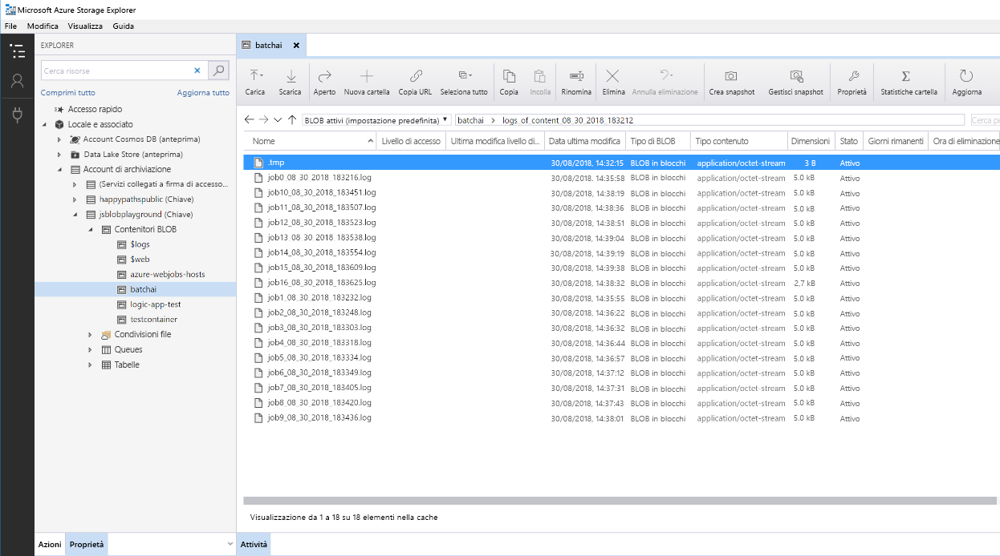

# Assegnazione del punteggio in batch per i modelli Python in Azure

Questa architettura di riferimento illustra come creare una soluzione scalabile per l'assegnazione del punteggio in batch a molti modelli in base a una pianificazione in parallelo usando Azure Batch per intelligenza artificiale. La soluzione può essere usata come modello e supporta la generalizzazione per problemi diversi.

Un'implementazione di riferimento per questa architettura è disponibile in  [GitHub][github].

**Scenario**: Questa soluzione consente di monitorare il funzionamento di un numero elevato di dispositivi in uno scenario IoT in cui ogni dispositivo invia le letture dei sensori in modo continuo. Si presuppone che ogni dispositivo abbia modelli di rilevamento delle anomalie sottoposti precedentemente a training per prevedere se una serie di misurazioni, aggregate per un intervallo di tempo predefinito, corrispondono o meno a un'anomalia. In scenari reali, potrebbe trattarsi di un flusso di letture di sensori che devono essere filtrate e aggregate prima di essere usate per operazioni di training o per l'assegnazione del punteggio in tempo reale. Per semplicità, la soluzione usa lo stesso file di dati durante l'esecuzione dei processi di assegnazione del punteggio.

## Architettura

L'architettura è costituita dai componenti seguenti:

[Hub eventi di Azure][event-hubs]. Questo servizio di inserimento dei messaggi può inserire milioni di messaggi di eventi al secondo. In questa architettura, i sensori inviano un flusso di dati all'hub eventi.

[Analisi di flusso di Azure][stream-analytics]. Un motore di elaborazione di eventi. Un processo di Analisi di flusso legge i flussi di dati dall'hub eventi ed esegue l'elaborazione dei flussi.

[Azure Batch per intelligenza artificiale][batch-ai]. Questo motore di calcolo distribuito viene usato per eseguire training e test dei modelli di Machine Learning e di intelligenza artificiale su larga scala. Batch per intelligenza artificiale consente di creare macchine virtuali su richiesta con un'opzione di scalabilità automatica, in cui ogni nodo del cluster di Batch per intelligenza artificiale esegue un processo di assegnazione del punteggio per un sensore specifico. Lo  [script][python-script] Python viene eseguito in contenitori Docker che vengono creati in ogni nodo del cluster, in cui legge i dati del sensore pertinenti, genera stime e le archivia nell'archivio Blob.

> [!NOTE]
> Il servizio Azure Batch per intelligenza artificiale verrà ritirato a marzo 2019 e le relative funzionalità di training e assegnazione dei punteggi su larga scala sono ora disponibili nel [servizio Azure Machine Learning][amls]. Questa architettura di riferimento verrà presto aggiornata per l'uso di Machine Learning, che offre una destinazione di calcolo gestita, l'[ambiente di calcolo di Machine Learning di Azure][aml-compute] per il training, la distribuzione e l'assegnazione di punteggi dei modelli di Machine Learning.

[Archiviazione BLOB di Azure][storage]. I contenitori BLOB vengono usati per archiviare i modelli già sottoposti a training, i dati e le stime di output. I modelli vengono caricati nell'archivio BLOB nel notebook [create\_resources.ipynb][create-resources]. I modelli [one-class SVM][one-class-svm] vengono sottoposti a training su dati che rappresentano i valori di sensori diversi per diversi dispositivi. Questa soluzione presuppone che i valori dei dati vengano aggregati per un intervallo di tempo fisso.

[App per la logica di Azure][logic-apps]. Questa soluzione crea un'app per la logica che esegue processi di Batch per intelligenza artificiale ogni ora. App per la logica offre un modo semplice per creare il flusso di lavoro di runtime e la pianificazione per la soluzione. I processi di Batch per intelligenza artificiale vengono inviati tramite uno [script][script] Python, anch'esso eseguito in un contenitore Docker.

[Registro Azure Container][acr]. Le immagini Docker vengono usate sia in Batch per intelligenza artificiale che in App per la logica e vengono create nel notebook [create\_resources.ipynb][create-resources], quindi ne viene eseguito il push in Registro Container. Si ottiene così un modo pratico per ospitare le immagini e creare istanze dei contenitori tramite altri servizi di Azure, ovvero App per la logica e Batch per intelligenza artificiale in questa soluzione.

## Considerazioni sulle prestazioni

Per i modelli Python standard, le CPU sono generalmente considerate sufficienti per gestire il carico di lavoro. Questa architettura usa CPU. Per [carichi di lavoro di Deep Learning][deep], tuttavia, le GPU in genere garantiscono prestazioni nettamente superiori rispetto alle CPU, per cui di norma è necessario un cluster consistente di CPU per ottenere prestazioni analoghe.

### Esecuzione in parallelo tra macchine virtuali e core a confronto

Durante l'esecuzione dei processi di assegnazione del punteggio a molti modelli in modalità batch, i processi devono essere eseguiti in parallelo tra le macchine virtuali. Sono possibili due approcci:

* Creare un cluster più grande con macchine virtuali a basso costo.

* Creare un cluster più piccolo con macchine virtuali a prestazioni elevate con più core disponibili in ognuna.

In generale, l'assegnazione del punteggio a modelli di Python standard non è così impegnativa come l'assegnazione del punteggio a modelli di Deep Learning e un cluster piccolo dovrebbe deve essere in grado di gestire in modo efficiente un numero elevato di modelli in coda. È possibile aumentare il numero di nodi del cluster man mano che aumentano le dimensioni dei set di dati.

Per motivi di praticità in questo scenario, una sola attività di assegnazione del punteggio viene inviata all'interno di un singolo processo di Batch per intelligenza artificiale. Tuttavia, può essere più efficiente assegnare il punteggio a più blocchi di dati all'interno dello stesso processo di Batch per intelligenza artificiale. In questi casi, scrivere codice personalizzato per leggere in più set di dati ed eseguire lo script di assegnazione del punteggio per tali set durante l'esecuzione di un singolo processo di Batch per intelligenza artificiale.

### File server

Quando si usa Azure Batch per intelligenza artificiale, è possibile scegliere più opzioni di archiviazione, a seconda della velocità effettiva necessaria per lo scenario. Per carichi di lavoro con requisiti di bassa velocità effettiva, l'uso dell'archivio BLOB dovrebbe essere sufficiente. In alternativa, Azure Batch per intelligenza artificiale supporta anche un [file server Batch per intelligenza artificiale][bai-file-server], un NFS a nodo singolo gestito che può essere montato automaticamente su nodi del cluster per offrire una posizione di archiviazione accessibile a livello centrale per i processi. Nella maggior parte dei casi è necessario un solo file server in un'area di lavoro ed è possibile separare i dati per i processi di training in directory diverse.

Se un NFS a nodo singolo non è appropriato per i carichi di lavoro, Azure Batch per intelligenza artificiale supporta altre opzioni di archiviazione, tra cui [File di Azure][azure-files] e soluzioni personalizzate, come ad esempio un file system Gluster o Lustre.

## Considerazioni sulla gestione

### Monitoraggio dei processi Batch per intelligenza artificiale

È importante monitorare lo stato dei processi in esecuzione, ma può essere complesso eseguire il monitoraggio in un cluster di nodi attivi. Per ottenere un'idea dello stato complessivo del cluster, passare al pannello **Batch per intelligenza artificiale** del [portale di Azure][portal] per controllare lo stato dei nodi del cluster. Se un nodo è inattivo oppure un processo ha avuto esito negativo, i log degli errori vengono salvati nell'archivio BLOB e sono accessibili anche dal pannello **Processi** nel portale.

Per operazioni di monitoraggio più avanzate, connettere i log ad [Application Insights][ai] o eseguire processi separati per il polling dello stato del cluster di Batch per intelligenza artificiale e dei relativi processi.

### Registrazione in Batch per intelligenza artificiale

Batch per intelligenza artificiale registra tutti i flussi stdout/stderr nell'account di archiviazione di Azure associato. Per semplificare l'esplorazione dei file di log, usare uno strumento di esplorazione dell'archiviazione, ad esempio [Azure Storage Explorer][explorer].

Quando si distribuisce questa architettura di riferimento, è possibile configurare un sistema di registrazione più semplice. Con questa opzione, tutti i log tra i diversi processi vengono salvati nella stessa directory nel contenitore BLOB come illustrato di seguito. Usare questi log per monitorare il tempo necessario per l'elaborazione di ogni processo e ogni immagine, in modo da ottenere un quadro più preciso di come ottimizzare il processo.

## Considerazioni sul costo

I componenti più onerosi usati in questa architettura di riferimento sono le risorse di calcolo.

Le dimensioni del cluster di Batch per intelligenza artificiale possono aumentare o diminuire a seconda dei processi nella coda. La [scalabilità automatica][automatic-scaling] con Batch per intelligenza artificiale può essere abilitata in due modi. È possibile procedere a livello programmatico, tramite configurazione nel file env che fa parte della [procedura di distribuzione][github], oppure modificando la formula di ridimensionamento direttamente nel portale dopo la creazione del cluster.

Per le operazioni che non richiedono un intervento immediato, configurare la formula di scalabilità automatica in modo che lo stato predefinito (minimo) sia rappresentato da un cluster con un numero di nodi pari a zero. Con questa configurazione, il cluster inizia con un numero di nodi pari a zero, per poi aumentare quando rileva processi nella coda. Se il processo di assegnazione punteggio batch si verifica poche volte al giorno, questa impostazione consente di ottenere risparmi significativi sui costi.

La scalabilità automatica potrebbe non essere appropriata per i processi batch eseguiti a distanza troppo ravvicinata. Anche il tempo necessario per avviare e interrompere un cluster comporta dei costi. Pertanto, se un carico di lavoro batch inizia solo pochi minuti dopo il termine del processo precedente, potrebbe essere più conveniente lasciare il cluster attivo tra i processi. Ciò dipende dalla frequenza pianificata per l'esecuzione dei processi di assegnazione del punteggio, ovvero elevata (ad esempio, ogni ora) o meno frequente (ad esempio, una volta al mese).

## Distribuire la soluzione

L'implementazione di riferimento per questa architettura è disponibile in [GitHub][github]. Seguire la procedura di configurazione per creare una soluzione scalabile per l'assegnazione del punteggio a molti modelli in parallelo tramite Batch per intelligenza artificiale.

[acr]: /azure/container-registry/container-registry-intro
[ai]: /azure/application-insights/app-insights-overview
[aml-compute]: /azure/machine-learning/service/how-to-set-up-training-targets#amlcompute
[amls]: /azure/machine-learning/service/overview-what-is-azure-ml
[automatic-scaling]: /azure/batch/batch-automatic-scaling
[azure-files]: /azure/storage/files/storage-files-introduction
[batch-ai]: /azure/batch-ai/
[bai-file-server]: /azure/batch-ai/resource-concepts#file-server
[create-resources]: https://github.com/Azure/BatchAIAnomalyDetection/blob/master/create_resources.ipynb
[deep]: /azure/architecture/reference-architectures/ai/batch-scoring-deep-learning
[event-hubs]: /azure/event-hubs/event-hubs-geo-dr
[explorer]: https://azure.microsoft.com/en-us/features/storage-explorer/
[github]: https://github.com/Azure/BatchAIAnomalyDetection
[logic-apps]: /azure/logic-apps/logic-apps-overview
[one-class-svm]: http://scikit-learn.org/stable/modules/generated/sklearn.svm.OneClassSVM.html
[portal]: https://portal.azure.com
[python-script]: https://github.com/Azure/BatchAIAnomalyDetection/blob/master/batchai/predict.py
[script]: https://github.com/Azure/BatchAIAnomalyDetection/blob/master/sched/submit_jobs.py
[storage]: /azure/storage/blobs/storage-blobs-overview
[stream-analytics]: /azure/stream-analytics/
